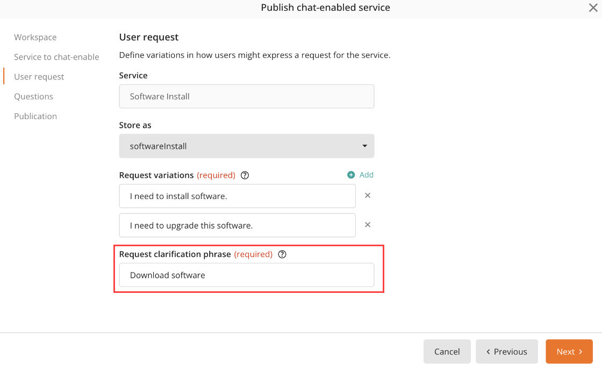
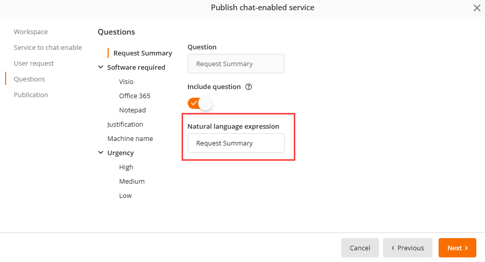

HelixGPT enables users to request services directly through chat conversations in Virtual Agent and DWP. Administrators can make services requestable via chat by using the following methods:

* Importing services created in DWP Catalog into HelixGPT by using the Publish wizard.
* Using the Catalog Request Agent. Learn more about this agent in[Using HelixGPT to make services requestable via chat](https://docs.bmc.com/xwiki/bin/view/Service-Management/Employee-Digital-Workplace/BMC-Helix-Digital-Workplace/dwp254/Creating-and-managing-the-service-catalog/Using-BMC-HelixGPT-to-make-services-requestable-via-chat/).

Both methods allow users to interact with these services conversationally. These services typically include a set of questions that users answer in the chat to complete a request.

**Important**  
These best practices apply to chat-enabled services that administrators have made requestable via chat. They do not apply to catalog services that are not chat-enabled and are instead presented to users as clickable links in the Employee Navigator chat. For more information about suggesting services as clickable links, see[Using Employee Navigator to find AI-generated answers](https://docs.bmc.com/xwiki/bin/view/Service-Management/Employee-Digital-Workplace/BMC-Helix-Digital-Workplace/dwp254/Using-BMC-Helix-Digital-Workplace-to-request-services/Using-Employee-Navigator-to-find-AI-generated-answers/).

Related topics

[Creating-and-managing-the-service-catalog](https://docs.bmc.com/xwiki/bin/view/Service-Management/Employee-Digital-Workplace/BMC-Helix-Digital-Workplace/dwp254/Creating-and-managing-the-service-catalog/)

[Importing chat-enabled services from DWP into HelixGPT](https://docs.bmc.com/xwiki/bin/view/Service-Management/Employee-Digital-Workplace/BMC-Helix-Virtual-Agent/hva253/Integrating/Importing-chat-enabled-services-from-BMC-Helix-Digital-Workplace-Advanced-into-BMC-HelixGPT/)

[Designing service catalog - best practices](https://docs.bmc.com/xwiki/bin/view/Service-Management/Employee-Digital-Workplace/BMC-Helix-Digital-Workplace/dwp254/Getting-started/Best-practices-for-BMC-Helix-Digital-Workplace/Designing-service-catalog-best-practices/)

To ensure services are both discoverable and usable through HelixGPT, we recommend that you design services with conversational AI in mind. Services designed for visual interfaces might not translate well to AI-based conversational experiences. Traditionally, services that are meant to be requested via the application UI greatly rely on structured forms and questions with predefined logic. To guide users through a decision path, they ask a broad category question like*Software*or*Hardware*, then narrow down to options like*Laptop*or*Mobile*.

In contrast, HelixGPT aims to understand the user's intent with fewer questions. Therefore, creating simple and focused services can enhance usability and user experience in HelixGPT.

## Best practices for different user roles

Different user roles contribute to optimizing services for HelixGPT. The following table outlines best practices for each role:

| Role | Goal | Best practices | References |
| --- | --- | --- | --- |
| DWP Catalog administrator | Define and structure services to ensure that they suit well for HelixGPT. These best practices apply to services made available in chat by using either the Publish wizard or the Catalog Request Agent.  | Create smaller, purpose-driven servicesthat are easier to prompt and maintain. Avoid bundling multiple requests, such as a laptop, Wi-Fi, and accessories, into a single catalog item. Bundled services make it difficult for HelixGPT to determine the user's exact intent.  | [Designing service catalog - best practices](https://docs.bmc.com/xwiki/bin/view/Service-Management/Employee-Digital-Workplace/BMC-Helix-Digital-Workplace/dwp254/Getting-started/Best-practices-for-BMC-Helix-Digital-Workplace/Designing-service-catalog-best-practices/) |
| Create dedicated services for each specific use case. Avoid creating services that cover multiple scenarios so that risk of misinterpretation is reduced.  |
| Break down complex conditional paths into multiple, simpler services that are easier to design, test, and maintain. Avoid using complex conditional logic in your services. Conditional questions that change based on user input can be difficult to represent in conversational flows.  |
| Use simple and intuitive input methods that support a natural dialogue flow. Avoid using forms that rely heavily on drop-down fields because they are designed for visual interfaces and might not translate naturally into chat conversation.  |
| Use clear and precise titles for catalog services. Ensure each service title is descriptive and unambiguous. Descriptive titles help HelixGPT to quickly identify the requested service.  |
| Create unique titles for your services to improve accuracy in recognizing the user's intent. Avoid similar service titles. If multiple services have similar names, HelixGPT might confuse them.  |
| Aim for clear, user-friendly language that is easily understood by a broad audience and is easier for HelixGPT to interpret. Avoid using overly technical terms or internal jargon in service descriptions.  |
| Limit the number of questions because too many questions can affect chat performance and user experience. Keep questions concise and relevant to the request. | [Adding service questionnaires - best practices](https://docs.bmc.com/xwiki/bin/view/Service-Management/Employee-Digital-Workplace/BMC-Helix-Digital-Workplace/dwp254/Getting-started/Best-practices-for-BMC-Helix-Digital-Workplace/Adding-service-questionnaires-best-practices/) |
| When you create a questionnaire, consider the following question types that HelixGPT doesn't support in chat:   * Table * Question with an option value whose length is greater than 64 * Conditional questions * Questionnaire actions in service * Lookup queries using filter expressions that refer to questions or fields that are populated with the process variable of the Service Broker Context data type (sbContext).  Additionally, consider chat limitations related to the following fields:   * Text area—Supports only plain text and does not allow rich text formatting. * Attachment— Supports attaching only one file to each question in HelixGPT-powered Employee Navigator.  **Important:**This limitation applies specifically to services imported into HelixGPT by using the Publish wizard.*(Controlled availability)*For details on unsupported question types when using the Catalog Request Agent, see[Using HelixGPT to make services requestable via chat](https://docs.bmc.com/xwiki/bin/view/Service-Management/Employee-Digital-Workplace/BMC-Helix-Digital-Workplace/dwp254/Creating-and-managing-the-service-catalog/Using-BMC-HelixGPT-to-make-services-requestable-via-chat/).  | [Importing chat-enabled services from DWP into HelixGPT](https://docs.bmc.com/xwiki/bin/view/Service-Management/Employee-Digital-Workplace/BMC-Helix-Virtual-Agent/hva253/Integrating/Importing-chat-enabled-services-from-BMC-Helix-Digital-Workplace-Advanced-into-BMC-HelixGPT/) |
| Application business analysts in Virtual Agent and HelixGPT administrators | Enhance the discoverability and usability of services in HelixGPT. These best practices apply only to importing services into HelixGPT by using the Publish wizard.  | When publishing a catalog service to HelixGPT, include multiple ways users might phrase their request. This approach improves HelixGPT’s ability to recognize and match the user's intent.  **Important:**Even though variations enhance the intent recognition, if you define too many similar variations for different services, HelixGPT might confuse them.  | * For importing services to be requested in Virtual Agent, see the*To modify the conversation data for the selected servic*e procedure in[Importing chat-enabled services from DWP into HelixGPT](https://docs.bmc.com/xwiki/bin/view/Service-Management/Employee-Digital-Workplace/BMC-Helix-Virtual-Agent/hva253/Integrating/Importing-chat-enabled-services-from-BMC-Helix-Digital-Workplace-Advanced-into-BMC-HelixGPT/). * For importing services to be requested in DWP, see[Generating prompts automatically from catalog services](https://docs.bmc.com/xwiki/bin/view/Service-Management/Employee-Digital-Workplace/BMC-HelixGPT/helixgpt253/Administering/Generating-prompts-automatically-from-catalog-services/). |
| Define a clarification phrase to be displayed when HelixGPT cannot determine the user’s intent.   |
| Enter a simplified form of the service question to suit your business needs. Question labels that are understandable in a visual interface might not be as clear in a conversational chat. Rephrasing questions for chat ensures that they are easier for users to understand during a conversation.   | * For importing services to be requested in Virtual Agent, see the*To modify the questions for a service in HelixGPT*procedure in[Importing chat-enabled services from DWP into HelixGPT](https://docs.bmc.com/xwiki/bin/view/Service-Management/Employee-Digital-Workplace/BMC-Helix-Virtual-Agent/hva253/Integrating/Importing-chat-enabled-services-from-BMC-Helix-Digital-Workplace-Advanced-into-BMC-HelixGPT/). * For importing services to be requested in DWP, see[Generating prompts automatically from catalog services](https://docs.bmc.com/xwiki/bin/view/Service-Management/Employee-Digital-Workplace/BMC-HelixGPT/helixgpt253/Administering/Generating-prompts-automatically-from-catalog-services/). |
| HelixGPT administrator | Test and customize prompts to improve how HelixGPT understands and responds to user queries. These best practices apply only to services imported into HelixGPT by using the Publish wizard.  | Review how HelixGPT generates prompts from catalog services to understand how HelixGPT interacts with users. | [Prompts generated automatically from catalog services](https://docs.bmc.com/xwiki/bin/view/Service-Management/Employee-Digital-Workplace/BMC-HelixGPT/helixgpt253/Administering/Out-of-the-box-prompts-in-BMC-HelixGPT/Prompts-generated-automatically-from-catalog-services/) [Generating prompts automatically from catalog services](https://docs.bmc.com/xwiki/bin/view/Service-Management/Employee-Digital-Workplace/BMC-HelixGPT/helixgpt253/Administering/Generating-prompts-automatically-from-catalog-services/) [Router prompt](https://docs.bmc.com/xwiki/bin/view/Service-Management/Employee-Digital-Workplace/BMC-HelixGPT/helixgpt253/Administering/Out-of-the-box-prompts-in-BMC-HelixGPT/Router-prompt/)  |
| Review and refine prompts that are generated from catalog services to ensure they reflect natural language and are user-friendly while meeting your organization's needs. However, you must not modify the variables, tags, and the JSON input. | [Prompts generated automatically from catalog services](https://docs.bmc.com/xwiki/bin/view/Service-Management/Employee-Digital-Workplace/BMC-HelixGPT/helixgpt253/Administering/Out-of-the-box-prompts-in-BMC-HelixGPT/Prompts-generated-automatically-from-catalog-services/) [Generating prompts automatically from catalog services](https://docs.bmc.com/xwiki/bin/view/Service-Management/Employee-Digital-Workplace/BMC-HelixGPT/helixgpt253/Administering/Generating-prompts-automatically-from-catalog-services/)  |
| Use the skill testing capability to simulate conversations, debug issues, and refine prompts to achieve the desired results. | The*To test a skill*procedure in[Creating and managing skills](https://docs.bmc.com/xwiki/bin/view/Service-Management/Employee-Digital-Workplace/BMC-HelixGPT/helixgpt253/Administering/Creating-and-managing-skills/). |
| HelixGPT administrator | *(Controlled availability)*Modify the settings and prompt of the Catalog Request Agent. | Modify the default prompt of the Catalog Request Agent. In addition, modify the number of services, questions, and probable answers that the Catalog Request Agent provides to the end users. These changes help tailor the user experience, improve response accuracy, and enhance performance.  | [Using HelixGPT to make services requestable via chat](https://docs.bmc.com/xwiki/bin/view/Service-Management/Employee-Digital-Workplace/BMC-Helix-Digital-Workplace/dwp254/Creating-and-managing-the-service-catalog/Using-BMC-HelixGPT-to-make-services-requestable-via-chat/) |
| End user | Request services through HelixGPT. | Select values from the lookup or drop-down fields rather than entering them manually. When users respond to questions in a chat, the Lookup and Drop-down question types support the following input methods:   * By selecting the required value from the list—Users can enter a partial phrase in the field to filter the list of available options. Partial word matching is supported, making it easier to find and select the desired value. * By typing an answer directly into the chat—Partial word matching is not supported. Users must enter the complete word or exact value to answer the question. If a partial value is submitted, HelixGPT will return an error. | *Not applicable* |