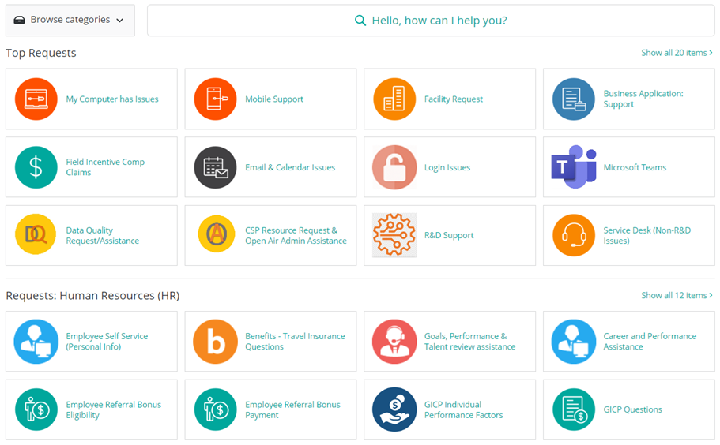
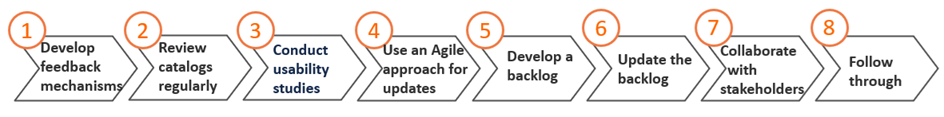

The service catalog is a listing of all services that you offer to your end users. It lists only items that are currently available. We recommend that you implement the following best practices when configuring your service catalog.

Related topics

[Creating-and-managing-the-service-catalog](https://docs.bmc.com/xwiki/bin/view/Service-Management/Employee-Digital-Workplace/BMC-Helix-Digital-Workplace/dwp254/Creating-and-managing-the-service-catalog/)

[Designing and optimizing services for HelixGPT - best practices](https://docs.bmc.com/xwiki/bin/view/Service-Management/Employee-Digital-Workplace/BMC-Helix-Digital-Workplace/dwp254/Getting-started/Best-practices-for-BMC-Helix-Digital-Workplace/Designing-and-optimizing-services-for-BMC-HelixGPT-best-practices/)

## Planning

An essential resource, the service catalog assists users in completing their tasks. A well-designed catalog improves user experience and satisfaction and is flexible to design and maintain. The planning stage plays a crucial role in ensuring that the service catalog, service delivery, and fulfillment meet their intended goals.

* **Users**—Identify the users who use your services and build the catalog to fulfill their needs.Understand the different end users' needs and what will help them get their job done. When creating services for a global audience, think about how people from different cultures see things. The content, color, and other elements of a service must reflect the cultural norms and customs of the target users. Or, keep all elements neutral to appeal to all users.
* **Catalog design team**—Identify the people in your service catalog design team and assign them responsibilities. It is essential to have a design team because otherwise you might end up with a service catalog that doesn't meet its goals.For example, a service owner might not understand the business context of a service and might create a service that does not deliver the necessary user experience.
  + Service owner: Defines, designs, and manages the services within the catalog or subcatalog
  + Business owner: Aligns the service catalog with the overall business strategy, oversees the lifecycle of services, and promotes the catalog within the organization
  + Solution architect: Designs a robust and user-friendly service catalog. Provides technical guidance for process design, development, and implementation
  + User experience designer: Conducts user research and usability testing, maps the user journey, organizes content and navigation, and enhances the user experience
* **Services**—Identify the services existing in the organization. Consult with the various departments to get a comprehensive list of services required. Identify the most frequently requested services, high-priority services, and services that can be automated.
* **Service categories**—Group the services into categories that make it easier for your users to quickly and easily find and request services. Users can filter the service catalog by categories. If you use abbreviations, make sure these are understood by your users. Create a taxonomy that considers the diverse locales and cultures, and use keywords to help users navigate to the correct service or content. When users are located in different regions, you might need to localize categories and services.
* **Catalog sections**—Use catalog sections to group and categorize your services for easy administration and end-user experience. A well-organized catalog helps users quickly find what they need. Use the available out-of-the-box catalog sections or add more according to your requirements.
* **Subcatalogs**—Delegate the responsibility of managing an extensive service catalog by creating subcatalogs and assigning subcatalog administrators to manage them.
* **Knowledge base**—Decide whether to emphasize automated catalog items or the knowledge base. Consider whether you can automate a task and create a service for it or whether you want to create a knowledge article instead. Make sure that knowledge articles are tagged consistently so that users can find the right articles. Configure relevant services or service bundles to be displayed with knowledge articles, permitting end users to request related services in the context of the knowledge article.

## Service design

When creating a service, remember the following points:

* Define service requests based on items users are likely to search for.
* **Service title**—Make sure it uniquely identifies the service. Add good content in this field because it has the higest weight in a catalog item search. For more information, see[Adding-catalog-profile-details-to-a-service](https://docs.bmc.com/xwiki/bin/view/Service-Management/Employee-Digital-Workplace/BMC-Helix-Digital-Workplace/dwp254/Creating-and-managing-the-service-catalog/Building-service-catalogs/Adding-and-updating-services/Adding-catalog-profile-details-to-a-service/).
* **Description**—Add an accurate and concise description of the service.
* **Service logo**—Use an icon that correctly represents the service offered or category of services. Icons and images not only make your catalog visually appealing, they help in visual recognition of a service.
* **Tags**—Identify and use tags to help users find a service quickly through a search. Make sure tagging is consistent.

  

Catalog profile fields

* **Questionnaire**—Note what answers are needed from the requester to fulfill the request and design the questionnaire accordingly. For more information, see[Creating-service-questionnaires](https://docs.bmc.com/xwiki/bin/view/Service-Management/Employee-Digital-Workplace/BMC-Helix-Digital-Workplace/dwp254/Creating-and-managing-the-service-catalog/Building-service-catalogs/Creating-service-questionnaires/).
* **Bundling of services**—Decide whether the service is to be a standalone service or whether it can be bundled with other services. Bundling of services simplifies the catalog. Package items together that users should consider ordering at the same time. For example, a full computer system service can have laptop, external monitor, mouse, wireless keyboard, and a laptop backpack.However, do not create one general service with different items, likeone request called software.  
    
  
* **Searchable services**—Make your service easily searchable. Optimize the content in title, description, and tags fields for findability. For more information about making your services searchable, see[Configuring-search](https://docs.bmc.com/xwiki/bin/view/Service-Management/Employee-Digital-Workplace/BMC-Helix-Digital-Workplace/dwp254/Administering/Administering-BMC-Helix-Digital-Workplace/Configuring-search/).
* **Workflows**—Set up fulfillment workflows to ensure smooth and seamless service delivery.  
  A sample workflow to create a user account:  
    
  
* **SLAs**—Define SLAs for service requests and make sure todeliver services within agreed service levels. For more information, see[Setting-service-level-agreements](https://docs.bmc.com/xwiki/bin/view/Service-Management/Employee-Digital-Workplace/BMC-Helix-Digital-Workplace/dwp254/Creating-and-managing-the-service-catalog/Building-service-catalogs/Adding-and-updating-services/Setting-service-level-agreements/).
* **Display of information**—Make sure each service displays all attributes including cost and date of fulfillment.
* **Testing**—Test your services with a group of users and modify the services as needed.
* When you create a new service, make sure you include it in a catalog section and entitle users to the service.

## Mobile considerations

* **Streamline navigation**—Give preference to the service categories and service that are accessed frequently. Adjust the navigation for scrolling.
* **Service description**—Make service descriptions clear and concise to convey key information about the service to the user.
* **Images**—Use icons that are intuitive and easily recognizable. Use scalable icons and compressed images, which load faster. Use color to make images stand out and contrast to make sure that the images are visible. Make sure you optimize image size without losing quality.
* **Minimize scrolling**—Present important information upfront and use expandable sections for user input or pre-populated options. Use menus that show a list of headers that can be used to hide or show content.
* **Performance optimization**—Reduce page load times by using appropriately sized icons, in terms of both resolution and size.

## Service visibility to users

* Target content to different audiences. Use entitlements to permit users to access services. Reduce the noise and let users find relevant services or items quickly.
* Use virtual marketplaces or people groups to entitle end users to view and request published services. People groups permit you to target content based on their foundation attributes. To learn more, see[Entitling-end-users-to-services-bundles-and-banners](https://docs.bmc.com/xwiki/bin/view/Service-Management/Employee-Digital-Workplace/BMC-Helix-Digital-Workplace/dwp254/Creating-and-managing-the-service-catalog/Entitling-end-users-to-services-bundles-and-banners/).
* If you use virtual marketplaces, and if you enable the full catalog view, all users can view and request all services and bundles in the catalog (unless the items are included in the restricted entitlements list).
* Assign studio pages to people groups by using the**Entitlement**action, making entire pages available to the selected groups. For example, you can create a page for hiring managers and make the page visible to only those users who have the hiring manager role. For more information, see[Making-studio-pages-available-to-end-users](https://docs.bmc.com/xwiki/bin/view/Service-Management/Employee-Digital-Workplace/BMC-Helix-Digital-Workplace/dwp254/Administering/Administering-BMC-Helix-Digital-Workplace/Creating-workplaces-for-your-lines-of-business/Making-studio-pages-available-to-end-users/).
* Make sure a user is not assigned to conflicting permission groups inDWP Catalog. A user may belong to more than one group and the permissions of these groups might conflict. For example, a user is a member of two groups where one group has access to a service while the other group does not have access to a service.

## Streamline checkout

Keep questionnaires precise. When creating questionnaires, remember the amount of information users need to fulfill a request. For more information, see[Adding-service-questionnaires-best-practices](https://docs.bmc.com/xwiki/bin/view/Service-Management/Employee-Digital-Workplace/BMC-Helix-Digital-Workplace/dwp254/Getting-started/Best-practices-for-BMC-Helix-Digital-Workplace/Adding-service-questionnaires-best-practices/).

## Service automation

Reduce manual tasks and free up your service desk employees to handle requests that need their expertise. Automate frequently requested tasks such as password resets, software installation, add or remove users from the Active Directory, and so on. For information about service automation, see[Automating-service-requests](https://docs.bmc.com/xwiki/bin/view/Service-Management/Employee-Digital-Workplace/BMC-Helix-Digital-Workplace/dwp254/Getting-started/Use-cases/Automating-service-requests/).

## Reports, user experience, and feedback

The enterprise service store generates data and analytics on service usage, user feedback, and performance metrics. Use the insights to see failures and troubleshoot process issues.Create surveys to get feeback from your users periodically to keep your services relevant and updated. For more information about creating surveys, see[Setting-up-surveys](https://docs.bmc.com/xwiki/bin/view/Service-Management/Employee-Digital-Workplace/BMC-Helix-Digital-Workplace/dwp254/Creating-and-managing-the-service-catalog/Setting-up-surveys/).

## Process to maintain your service catalog

The following graphic shows the process to maintain your service catalog:

The following table provides the sequence of steps to update and maintain your service catalog:

| Step  | Name  | Action  |
| --- | --- | --- |
| 1  | Develop feedback mechanisms  | Collect inputs from users through surveys, ratings, and direct communication.  |
| 2  | Review catalogs regularly  | Periodically review the catalog's content, descriptions, and structure with stakeholders.  |
| 3  | Conduct usability studies  | Regularly seek user feedback and conduct usability studies. Prioritize user needs in improvements.  |
| 4  | Use an agile approach for updates  | Begin with simpler services and iterate using an Agile approach.  |
| 5  | Develop a backlog  | Prioritize services considering volume, impact, cost savings, and complexity.  |
| 6  | Update the backlog  | Continuously add services to the catalog to match evolving business needs.  |
| 7  | Collaborate with stakeholders  | Engage various stakeholders in the design and development process.  |
| 8  | Follow through  | Establish a regular review and improvement schedule with measurable goals.  |