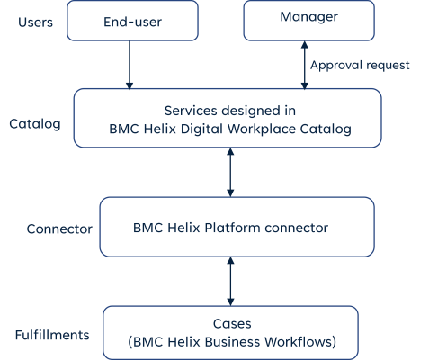
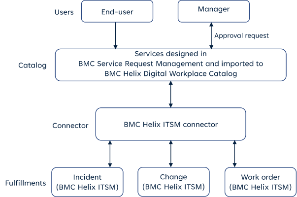

A Catalog is a centralized repository of services and productsfrom multiple business units including IT, HR, and Facilities.Typically, a Catalog consists of the following components:

* Service request definitions
* Workflows that determine the business process of requested service
* Entitlements that determine which set of end users can request a particular service
* Questionnaires to gather more information from requesters before they submit a service request.

DWP supports the following catalog sources:

* Catalog designed inDWP Catalogand fulfilled inITSM.
* Catalog designed inDWP Catalogand fulfilled inBusiness Workflows.
* Catalog designed inService Request Management, imported toDWP Catalog, and fulfilled inITSM.

Related topics

[Getting-started](https://docs.bmc.com/xwiki/bin/view/Service-Management/Employee-Digital-Workplace/BMC-Helix-Digital-Workplace/dwp254/Getting-started/)

**Important**

Starting with the 21.3.02 patch, announces changes related to the availability of Service Request Management that might affect your use of DWP. For new SaaS deployments, Service Request Managementis no longer available as the source of your service catalog.

For more information, see[Deprecated-and-discontinued-features](https://docs.bmc.com/xwiki/bin/view/Service-Management/Employee-Digital-Workplace/BMC-Helix-Digital-Workplace/dwp254/Release-notes-and-notices/Deprecated-and-discontinued-features/).

## Catalog designed inDWP Catalogand fulfilled inITSM

This capability is available withDWP[license entitlements](https://docs.bmc.com/xwiki/bin/view/Service-Management/Employee-Digital-Workplace/BMC-Helix-Digital-Workplace/dwp254/Planning/License-types-and-features/).

You can design a service catalog directly inDWP Catalog, also called as the native catalog. Native services can have fulfillments in other products such asITSM.

The following image provides a representation of the catalog services and their fulfillments inITSM:

## Catalog designed inDWP Catalogand fulfilled inBusiness Workflows

This capability is available withDWP[license entitlements](https://docs.bmc.com/xwiki/bin/view/Service-Management/Employee-Digital-Workplace/BMC-Helix-Digital-Workplace/dwp254/Planning/License-types-and-features/).

You can design your catalog inDWP Catalogand connect it withBusiness Workflowsfor service fulfillments.

The following image provides a representation of the catalog services and their fulfillments inBusiness Workflows:

## Catalog designed in Service Request Management, imported toDWP Catalog, and fulfilled inITSM

This capability is available withDWP[license entitlements](https://docs.bmc.com/xwiki/bin/view/Service-Management/Employee-Digital-Workplace/BMC-Helix-Digital-Workplace/dwp254/Planning/License-types-and-features/).

If you create Service Request Definitions (SRDs) inService Request Management, you can import them intoDWP Catalog. The imported service continue to have their fulfillments inITSM.

The following image provides a representation of the imported services and their fulfillments inITSM:

