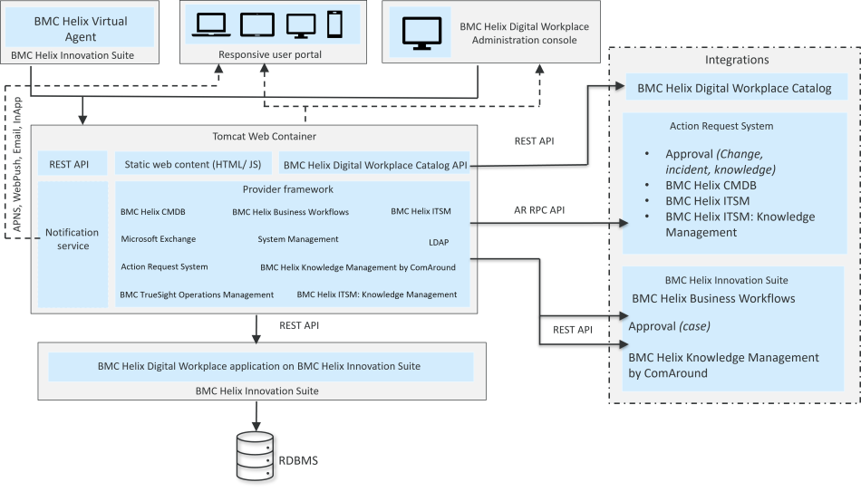

DWP provides a comprehensive digital employee to access knowledge articles, services, and policies across lines of business such as IT, HR, Facilities, and more. Itprovides administrators with straightforward, highly configurable ways to present the capabilities that end users need to be successful.

Related topics

[DWP-Catalog-architecture](https://docs.bmc.com/xwiki/bin/view/Service-Management/Employee-Digital-Workplace/BMC-Helix-Digital-Workplace/dwp254/Getting-started/Key-concepts/BMC-Helix-Digital-Workplace-Catalog-architecture/)

[Key-concepts](https://docs.bmc.com/xwiki/bin/view/Service-Management/Employee-Digital-Workplace/BMC-Helix-Digital-Workplace/dwp254/Getting-started/Key-concepts/)

[License-types-and-features](https://docs.bmc.com/xwiki/bin/view/Service-Management/Employee-Digital-Workplace/BMC-Helix-Digital-Workplace/dwp254/Planning/License-types-and-features/)

The following image shows the architecture of DWP:

**Important**

To view the architecture forDWP Catalog, see[DWP-Catalog-architecture](https://docs.bmc.com/xwiki/bin/view/Service-Management/Employee-Digital-Workplace/BMC-Helix-Digital-Workplace/dwp254/Getting-started/Key-concepts/BMC-Helix-Digital-Workplace-Catalog-architecture/).

The following table describes the DWP architecture components:

| Component  | Description  | Reference  |
| --- | --- | --- |
| DWP application onIS  | An application deployed onISthat includes the record definitions, rules, and associations between the record definitions. Administrators*cannot*modify this application.  | Not applicable  |
| Provider framework  | A method to integrate with other applications such asCMDBandITSM, and specific third-party applications such as Microsoft Exchange and LDAP.  | [Integrating-with-other-applications-by-using-providers](https://docs.bmc.com/xwiki/bin/view/Service-Management/Employee-Digital-Workplace/BMC-Helix-Digital-Workplace/dwp254/Integrating/Integrating-with-other-applications-by-using-providers/)  |
| Notification service  | A service used to send in-app (bell) notifications, email notifications, and push notifications to end users for various events such as approvals, feedback survey, and so on.  | [Configuring-status-updates-and-notifications](https://docs.bmc.com/xwiki/bin/view/Service-Management/Employee-Digital-Workplace/BMC-Helix-Digital-Workplace/dwp254/Administering/Administering-BMC-Helix-Digital-Workplace/Managing-broadcasts-and-notifications-for-end-users/Configuring-status-updates-and-notifications/)  |
| Static web content (HTML/JS)  | The DWP end-user console and administration console web application.  | Not applicable  |
| DWP CatalogAPI  | An interface to integrate withDWP Catalogby using APIs.  | Not applicable  |
| Virtual Agent  | A conversational interface that communicates with the user in a natural language to search knowledge articles, submit service requests, or check the status of service requests.  | [Integrating-a-chat-application-with-DWP](https://docs.bmc.com/xwiki/bin/view/Service-Management/Employee-Digital-Workplace/BMC-Helix-Digital-Workplace/dwp254/Integrating/Integrating-a-BMC-chat-application-with-BMC-Helix-Digital-Workplace/)  |
| Responsive user portal  | The DWP end-user console that can be accessed on desktop, tablet, and phones.  | [Access-from-anywhere-anytime-on-any-device](https://docs.bmc.com/xwiki/bin/view/Service-Management/Employee-Digital-Workplace/BMC-Helix-Digital-Workplace/dwp254/Getting-started/Use-cases/Access-from-anywhere-anytime-on-any-device/)  |
| DWP Administration console  | A user interface to configure global settings or one-time configurations such as setting up end user features, rebranding the end user console, designing pages for lines of business, and analyzing user activities.  | [Administering-DWP](https://docs.bmc.com/xwiki/bin/view/Service-Management/Employee-Digital-Workplace/BMC-Helix-Digital-Workplace/dwp254/Administering/Administering-BMC-Helix-Digital-Workplace/)  |
| DWP Catalog  | A user interface to configure the service catalog by designing the services and workflows, building reusable questionnaires, managing DWP user roles, creating promotional banners, and defining entitlements.  | [Administering-DWP-Catalog](https://docs.bmc.com/xwiki/bin/view/Service-Management/Employee-Digital-Workplace/BMC-Helix-Digital-Workplace/dwp254/Administering/Administering-BMC-Helix-Digital-Workplace-Catalog/)  |
| Approval (Change, Incident, Knowledge)  | Support for approvals originating fromAction Request System, which end users in DWP can respond to.  | [Enabling-approvals](https://docs.bmc.com/xwiki/bin/view/Service-Management/Employee-Digital-Workplace/BMC-Helix-Digital-Workplace/dwp254/Administering/Administering-BMC-Helix-Digital-Workplace/Setting-up-approvals/Enabling-approvals/)  |
| Approval (case)  | Support for case approvals originating fromBusiness Workflows, which end users in DWP can respond to.  | [Enabling-approvals](https://docs.bmc.com/xwiki/bin/view/Service-Management/Employee-Digital-Workplace/BMC-Helix-Digital-Workplace/dwp254/Administering/Administering-BMC-Helix-Digital-Workplace/Setting-up-approvals/Enabling-approvals/)  |
| CMDB  | Support for assets inCMDB, which administrators can import in DWP so that end users can find nearby resources, follow resource status updates, and update the resource status.  | [Managing-assets-on-floor-maps](https://docs.bmc.com/xwiki/bin/view/Service-Management/Employee-Digital-Workplace/BMC-Helix-Digital-Workplace/dwp254/Enabling-self-service-in-an-organization/Locations/Managing-assets-on-floor-maps/)  |
| ITSM  | An integration withITSMthat automatically creates service requests in DWP that correspond to change requests, incident requests, and work order requests.  | [Creating-service-requests-from-ITSM](https://docs.bmc.com/xwiki/bin/view/Service-Management/Employee-Digital-Workplace/BMC-Helix-Digital-Workplace/dwp254/Creating-and-managing-the-service-catalog/Creating-service-requests-from-BMC-Helix-ITSM/)  |
| ITSM: Knowledge Management  | An integration withITSM: Knowledge Managementso that end users can find IT-related knowledge articles for self-service.  | [Setting-up-self-help-resources](https://docs.bmc.com/xwiki/bin/view/Service-Management/Employee-Digital-Workplace/BMC-Helix-Digital-Workplace/dwp254/Enabling-self-service-in-an-organization/Setting-up-self-help-resources/)  |
| Business Workflows  | An integration withBusiness Workflowsso that end users can leverage custom services for lines of business fromBusiness Workflows, and can view and complete To-Dos assigned by agents,  | [Product-overview](https://docs.bmc.com/xwiki/bin/view/Service-Management/Employee-Digital-Workplace/BMC-Helix-Digital-Workplace/dwp254/Getting-started/Product-overview/)  |
| HKM  | An integration withBusiness Workflowsso that end users can find knowledge articles or submit services from the knowledge articles.  | [Configuring-HKM-as-the-knowledge-provider-for-DWP](https://docs.bmc.com/xwiki/bin/view/Service-Management/Employee-Digital-Workplace/BMC-Helix-Digital-Workplace/dwp254/Configuring-BMC-Helix-Knowledge-Management-by-ComAround-as-the-knowledge-provider-for-BMC-Helix-Digital-Workplace/)  |