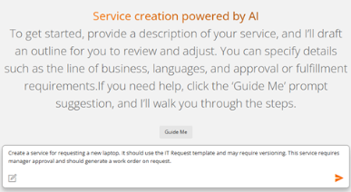
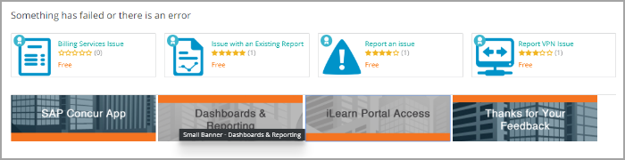
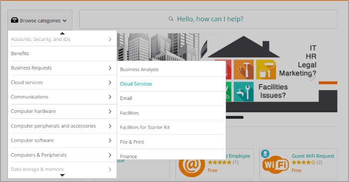

DWP Catalogis a component of theDWP solution that serves as a centralized repository of products and services from multiple business units including IT, HR, and Facilities. Catalog administrators configure the service catalog by designing services and workflows, building reusable questionnaires, creating promotional banners, and defining entitlements.

Required license

[DWP](https://docs.bmc.com/xwiki/bin/view/Service-Management/Employee-Digital-Workplace/BMC-Helix-Digital-Workplace/dwp254/Planning/License-types-and-features/)

The following video (3:15) provides an overview of the key capabilities ofDWP Catalogand the product components:

[🎥 Watch Video: https://www.youtube.com/watch?v=wuycpFLSDBo](https://www.youtube.com/watch?v=wuycpFLSDBo)

[Watch the YouTube video about DWP Catalog product overview](https://youtu.be/wuycpFLSDBo?list=PLibAMtD70sYFm8oRg3MHv-rJufA99QKE3)

## Service Catalog Curator

As a catalog administrator, use the Service Catalog Curator, an AI agent powered by HelixGPT, to to create a catalog service. Enter prompts and other inputs for the service you want to create, review the summary, make real-time edits, and efficiently create a service. This AI assistant offers a solid foundation for developing your service and saves your time and effort.  

For more information, see[Leveraging Service Catalog Curator for creating services](https://docs.bmc.com/xwiki/bin/view/Service-Management/Employee-Digital-Workplace/BMC-Helix-Digital-Workplace/dwp254/Creating-and-managing-the-service-catalog/Leveraging-Service-Catalog-Curator-for-creating-services/).

## Service fulfillments

DWP Catalogintegrates with external fulfillment systems through service connectors to enable communication between the catalog application platform and the different fulfillment systems. To learn more, see[Connecting-your-catalog-to-external-systems](https://docs.bmc.com/xwiki/bin/view/Service-Management/Employee-Digital-Workplace/BMC-Helix-Digital-Workplace/dwp254/Creating-and-managing-the-service-catalog/Connecting-your-catalog-to-external-systems/).

## Enriched catalog profiles

Enhance the service catalog experience by creating profiles for service items that include:

* Multimedia carousel of videos and images to illustrate the selected service.
* Rich text descriptions with business and technical details to help users make decisions when requesting services.
* Downloadable files and links to internet and other web resources.
* Service ratings and timeline to help users evaluate solutions.

The enriched catalog profiles are displayed in the DWP end-user console, as shown in the following image:

## Rich text formatting

Users can benefit from the text editing interface when they submit comments to service requests.

**Important**

* For services created directly inDWP Catalog, end users can add rich text formatting in comments and answers to a questionnaire.
* Rich text format is supported in approvals of onlyDWP Catalogrequests andBusiness Workflowscases.

The following text customization options are available:

* Bold, Italic, and Underline fonts
* Color selection
* Text alignment
* Hyperlinks
* Numbered and bulleted lists
* Formatting options for copy-and-pasted text
* Attachment icon and drag-and-drop capability for file upload
* Drag-and-resize capability to resize images within the text fields
* URI schemes  
  To learn more about the supported URI schemes, see[Updating-the-attachment-settings-and-URI-schemes](https://docs.bmc.com/xwiki/bin/view/Service-Management/Employee-Digital-Workplace/BMC-Helix-Digital-Workplace/dwp254/Administering/Administering-BMC-Helix-Digital-Workplace/Updating-the-attachment-settings-and-URI-schemes/).

Comments with rich text formatting added in DWP are supported and retained byBusiness Workflows. These comments can be seen in request details inDWP Catalogand are preserved in email notifications.

However, inITSM, comments are shown as plain text, and inserted images are shown as attachments.

As a catalog administrator, you can also enable end users to leverage rich text formatting in questionnaires. To learn more, see[Adding-questions-to-a-questionnaire](https://docs.bmc.com/xwiki/bin/view/Service-Management/Employee-Digital-Workplace/BMC-Helix-Digital-Workplace/dwp254/Creating-and-managing-the-service-catalog/Building-service-catalogs/Creating-service-questionnaires/Adding-questions-to-a-questionnaire/).

## Catalog banners

Notify users of important information and draw attention to featured services in your catalog by using promotional banners of different sizes.You create these banners inDWP Catalogandadd them to the catalog display in the DWP Admin console The banner is then visible to the end users in the end-user console.

The following image is an example of a full-width hero banner displayed in the end user console:

The following image is an example of feature banners displayed in the end user console:

## Catalog service bundles

Help users select options for requested items. Service bundles can contain optional items that the user can switch on or off before submitting the request. The catalog manager can can control which optional items are included when packaging a bundle.

The following image is an example of a bundle with optional items:

## Catalog filters

Provide filters to make it easier for users to browse the catalog.

The following image is an example of a category selection filter for Cloud Services:

## Catalog search

Make it easier for users to find items in the catalog. Users can search the catalog for words found in the following catalog profile sections:

* Service name or title
* Service version
* Service description
* Service tags

**Best practice**  
We recommend that you develop a consistent tagging scheme for your organization.

## Satisfaction surveys

Enable organizations to collect user feedback by configuring post-request surveys for completed catalog service requests. Surveys can be customized with rating scales like CSAT or NPS, adaptable templates, and adjustable delivery frequency options. With this capability, catalog administrators can monitor service performance, measure customer satisfaction, analyze user sentiment, and encourage continuous improvements.

For more information, see[Setting up satisfaction surveys for catalog services](https://docs.bmc.com/xwiki/bin/view/Service-Management/Employee-Digital-Workplace/BMC-Helix-Digital-Workplace/dwp254/Creating-and-managing-the-service-catalog/Setting-up-surveys/Setting-up-satisfaction-surveys-for-catalog-services/).

## Testing your knowledge

Check your knowledge. See if you can answer each question. Click the questions to view the answer.

What is the primary function of DWP Catalog?

It serves as a centralized platform where catalog administrators design and manage services, workflows, and entitlements for multiple business units, such as IT, HR, Facilities, etc.

How does the Service Catalog Curator, powered by HelixGPT, assist catalog administrators?

The HelixGPT-powered Service Catalog Curator helps catalog administrators efficiently create catalog services by allowing them to enter prompts, review summaries, make real-time edits, and establish a solid foundation for service development.

In what scenario can end users apply rich text formatting in their comments, and what is a known browser-specific consideration?

End users can apply rich text formatting when commenting on services created in DWP Catalog. In Mozilla Firefox, users must check the upload check box after selecting an image file to ensure the image uploads correctly.

How does DWP Catalog enable integration with external fulfillment systems?

It uses a service connector to facilitate communication between the catalog application and external systems.

When building a catalog service bundle, how can a catalog manager give users flexibility in their request submission?

The catalog manager can include optional items in the service bundle that users can toggle on or off before submitting the request, ensuring personalization while maintaining control over included services.

## Learn more

To learn more aboutDWP Catalog, refer to the following links:

| Action  | Reference  |
| --- | --- |
| Learn about the best practices to design a catalog.  | [Designing-service-catalog-best-practices](https://docs.bmc.com/xwiki/bin/view/Service-Management/Employee-Digital-Workplace/BMC-Helix-Digital-Workplace/dwp254/Getting-started/Best-practices-for-BMC-Helix-Digital-Workplace/Designing-service-catalog-best-practices/)  |
| Learn about the Catalog architecture.  | [DWP-Catalog-architecture](https://docs.bmc.com/xwiki/bin/view/Service-Management/Employee-Digital-Workplace/BMC-Helix-Digital-Workplace/dwp254/Getting-started/Key-concepts/BMC-Helix-Digital-Workplace-Catalog-architecture/)  |
| Learn about the roles and permissions required to set up a catalog.  | [Catalog-roles-and-permissions](https://docs.bmc.com/xwiki/bin/view/Service-Management/Employee-Digital-Workplace/BMC-Helix-Digital-Workplace/dwp254/Administering/Administering-BMC-Helix-Digital-Workplace-Catalog/Setting-up-user-accounts-and-granting-access-to-BMC-Helix-Digital-Workplace-Catalog/Catalog-roles-and-permissions/)  |
| Learn about subcatalogs, catalog services, and fulfillments.  | * [Subcatalogs](https://docs.bmc.com/xwiki/bin/view/Service-Management/Employee-Digital-Workplace/BMC-Helix-Digital-Workplace/dwp254/Getting-started/Key-concepts/Subcatalogs/) * [Catalog-services-and-fulfillments](https://docs.bmc.com/xwiki/bin/view/Service-Management/Employee-Digital-Workplace/BMC-Helix-Digital-Workplace/dwp254/Getting-started/Key-concepts/Catalog-services-and-fulfillments/) |