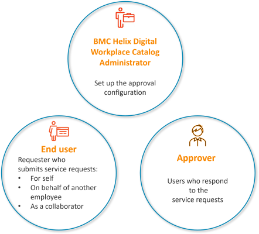
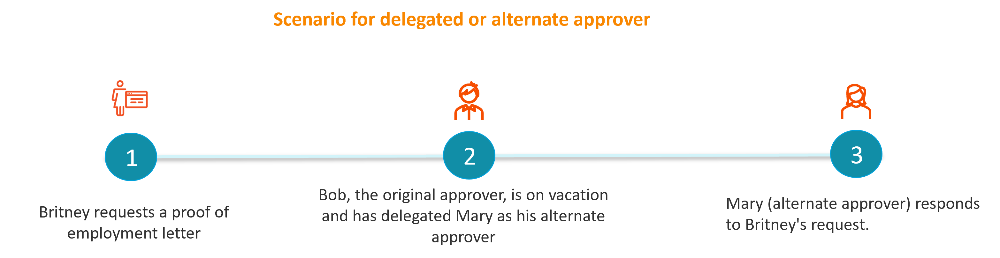
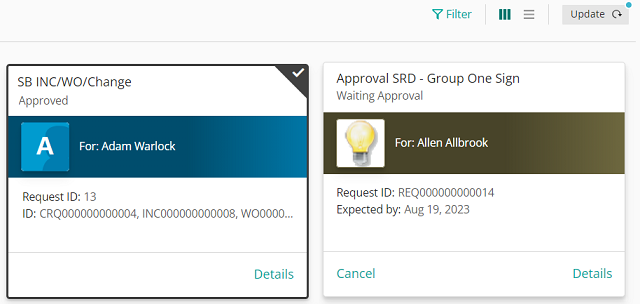
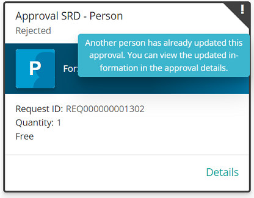

The end-to-end process that starts when a service request is sent for approval and ends with an approval outcome is called an approval. Approvals are an integral part of resolving service requests.

Approvers are end users who can approve, reject, or put approval requests on hold. There can be a single approver or multiple approvers.

The following types of applications are supported for setting up approvals:

* Integrated applications, such asBusiness WorkflowsandITSM.
* Custom applications developed by using Developer Studio.

Related topics

[Key-concepts](https://docs.bmc.com/xwiki/bin/view/Service-Management/Employee-Digital-Workplace/BMC-Helix-Digital-Workplace/dwp254/Getting-started/Key-concepts/)

[Notifications](https://docs.bmc.com/xwiki/bin/view/Service-Management/Employee-Digital-Workplace/BMC-Helix-Digital-Workplace/dwp254/Administering/Administering-BMC-Helix-Digital-Workplace/Managing-broadcasts-and-notifications-for-end-users/Notifications/)

## Approval roles

The following roles are involved in the approval process:

| Role  | Task  | Description  | Reference  |
| --- | --- | --- | --- |
| DWP Catalog administrator  | Set up the approval configuration  | Configure the following approval settings:   * Create the approval workflow for service requests You can leverage the default approval process for manager approval or create a custom approval process. * Enable users to delegate, reassign, put on hold approvals, or*(Version 25.2.01 and later)*request clarification regarding the approval. * Configure how approval results are displayed for end users. * Configure approval notifications. | [Setting-up-approvals](https://docs.bmc.com/xwiki/bin/view/Service-Management/Employee-Digital-Workplace/BMC-Helix-Digital-Workplace/dwp254/Administering/Administering-BMC-Helix-Digital-Workplace/Setting-up-approvals/)  |
| End user  | Submit a service request  | Submit a service request for self, on behalf of another user, or as a collaborator that requires a single approval or a group approval.*(Version 25.2.01 and later)*Provide clarification for approval requests.  | * [Submitting-service-requests-for-other-users](https://docs.bmc.com/xwiki/bin/view/Service-Management/Employee-Digital-Workplace/BMC-Helix-Digital-Workplace/dwp254/Using-BMC-Helix-Digital-Workplace-to-request-services/Submitting-service-requests-for-other-users/) * [Collaborating-with-other-users-on-service-requests](https://docs.bmc.com/xwiki/bin/view/Service-Management/Employee-Digital-Workplace/BMC-Helix-Digital-Workplace/dwp254/Using-BMC-Helix-Digital-Workplace-to-request-services/Collaborating-with-other-users-on-service-requests/) * [Providing clarification for approval requests](https://docs.bmc.com/xwiki/bin/view/Service-Management/Employee-Digital-Workplace/BMC-Helix-Digital-Workplace/dwp254/Using-BMC-Helix-Digital-Workplace-to-request-services/Providing-clarification-for-approval-requests/) |
| Approver  | Work on the service request approval  | Accept, reject, put on hold, delegate, reassign, or*(Version 25.2.01 and later)*request clarification regarding the approval.  | * [Delegating-reassigning-and-responding-to-approval-requests](https://docs.bmc.com/xwiki/bin/view/Service-Management/Employee-Digital-Workplace/BMC-Helix-Digital-Workplace/dwp254/Using-BMC-Helix-Digital-Workplace-to-request-services/Delegating-reassigning-and-responding-to-approval-requests/) * [Requesting approval clarification](https://docs.bmc.com/xwiki/bin/view/Service-Management/Employee-Digital-Workplace/BMC-Helix-Digital-Workplace/dwp254/Using-BMC-Helix-Digital-Workplace-to-request-services/Delegating-reassigning-and-responding-to-approval-requests/Requesting-approval-clarification/) |

## Approver types

Approvers can be of the following types:

* Original approver—User defined as the approver in the service request definition.
* Delegated approver—User defined by the original approver as an alternate approver.
* Reassigned approver—User to whom the original approver reassigns an approval.

The following table shows the approval actions that can be performed by the types of approvers:

| Approval actions  | Original approver  | Delegated approver (Alternate approver)  | Reassigned approver  |
| --- | --- | --- | --- |
| Approve  | ✅️  | ✅️  | ✅️  |
| Reject  | ✅️  | ✅️  | ✅️  |
| Put on hold  | ✅️  | ✅️  | ✅️  |
| Delegate to another approver  | ✅️  | ❌️  | ✅️  |
| Reassign to another approver  | ✅️  | ❌️  | ❌️  |
| *(Version 25.2.01 and later)*Request clarification | ✅️ | ✅️ | ✅️ |

**Important**

An approval cannot be delegated to an alternate approver, and then reassigned to another user.

## Original, delegated, and reassigned approval scenarios

Britney is an employee at Apex Global. The following scenarios describe how her request gets approved by an alternate approver, a reassigned approver, and a reassigned and designated approver.

## Where do requesters and approvers see approval requests?

The following table shows where the requester and approver can see the approval requests on the UI:

| User  | Status of request  | Approval request  | Delegated approval requests  | Reassigned approval requests  | Reassigned and then delegated approval requests  |
| --- | --- | --- | --- | --- | --- |
| * Requester * On behalf of users * Collaborators | Waiting for approval  | Active events  | Active events  | Active events  | Active events  |
| Original approver  | Active events  | Active events  | Not available  | Not available  |
| Alternate approvers  | *Not applicable*  | Active events  | *Not applicable*  | Active events  |
| Reassigned approver  | *Not applicable*  | *Not applicable*  | Active events  | Active events  |
| * Requester * OBO users * Collaborators | Approved  | Active events  | Active events  | Active events  | Active events  |
| Original approver  | Past events  | Past events  | Not available  | Not available  |
| Alternate approvers  | *Not applicable*  | Past events  | *Not applicable*  | Past events  |
| Reassigned approver  | *Not applicable*  | *Not applicable*  | Past events  | Past event  |
| * Requester * OBO users * Collaborators | Closed or rejected  | Past events  | Past events  | Past events  | Past events  |
| Original approver  | Past events  | Past events  | Not available  | Not available  |
| Alternate approvers  | *Not applicable*  | Past events  | *Not applicable*  | Past events  |
| Reassigned approver  | *Not applicable*  | *Not applicable*  | Past events  | Past events  |
| * Requester * OBO users * Collaborators | *(Version 25.2.01 and later)*More information needed | Active events | Active events | Active events | Active events |
| Original approver  | Active events | Active events | *Not available* | *Not available* |
| Alternate approvers  | *Not applicable*  | Active events  | *Not applicable*  | Active events  |
| Reassigned approver  | *Not applicable*  | *Not applicable*  | Active events  | Active events  |

**Important**

An approval request is available in Active events for the requester, OBO users, and collaborators only if the workflow of the requested service contains other activities.

If a workflow of the requested service contains only the Approval activity, the approval request can be found in the Past events.

Any change in the status of an event is noted on the UI. When no further action can be taken on an item in the events view, the item is marked with a dark border and a check mark; the Update button () expands in width to display the text. Both are visual indicators to users that their events view needs to be refreshed. To refresh the view, users can click**Update**button.

The following image shows two requests, one that has been approved and the other that is in progress.

## Behavior when only one approver from a list of approvers needs to approve

If a request is assigned to multiple approvers, the request appears in the Active events section for all approvers. If a request requires approval from only one of the approvers, an appropriate message is displayed if a second approver tries to approve or reject the request at the same time as the first one. When such a message is generated, an exclamation mark is added to the item in the events view. The second approver can click the exclamation mark icon to view the message. All other approvers see the event as completed in their events view.

