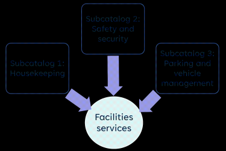

Subcatalogs, like subfolders, are smaller catalogs or units within the larger catalog. Subcatalogs are an administrative concept to better manage services.

Catalog administrators can view and manage services in all catalogs and subcatalogs, whereas internal suppliers and internal supplier administrators can manage only the subcatalogs assigned to them.

The following diagram depicts the concept of subcatalogs:

Required license

[DWP](https://docs.bmc.com/xwiki/bin/view/Service-Management/Employee-Digital-Workplace/BMC-Helix-Digital-Workplace/dwp254/Planning/License-types-and-features/)

Related topics

[DWP-Catalog](https://docs.bmc.com/xwiki/bin/view/Service-Management/Employee-Digital-Workplace/BMC-Helix-Digital-Workplace/dwp254/Getting-started/Key-concepts/BMC-Helix-Digital-Workplace-Catalog/)

[Key-concepts](https://docs.bmc.com/xwiki/bin/view/Service-Management/Employee-Digital-Workplace/BMC-Helix-Digital-Workplace/dwp254/Getting-started/Key-concepts/)

[Assigning-subcatalog-roles-to-user-accounts](https://docs.bmc.com/xwiki/bin/view/Service-Management/Employee-Digital-Workplace/BMC-Helix-Digital-Workplace/dwp254/Administering/Administering-BMC-Helix-Digital-Workplace-Catalog/Setting-up-user-accounts-and-granting-access-to-BMC-Helix-Digital-Workplace-Catalog/Assigning-subcatalog-roles-to-user-accounts/)

## Subcatalogs and their roles

Subcatalogs are managed by the following roles:

* Internal supplier—maintains a subcatalog
* Internal supplier administrator—populates a subcatalog
* Embedded supplier—populates aBusiness Workflowssubcatalog

To learn more about these roles, see[Catalog-roles-and-permissions](https://docs.bmc.com/xwiki/bin/view/Service-Management/Employee-Digital-Workplace/BMC-Helix-Digital-Workplace/dwp254/Administering/Administering-BMC-Helix-Digital-Workplace-Catalog/Setting-up-user-accounts-and-granting-access-to-BMC-Helix-Digital-Workplace-Catalog/Catalog-roles-and-permissions/).

Each service, bundle, banner, service action, and virtual marketplace can be a part of a single subcatalog. The access is restricted to the internal suppliers and service supplier administrators who are associated with it. In the[reports and analysis of the enhanced service catalog](https://docs.bmc.com/xwiki/bin/view/Service-Management/Employee-Digital-Workplace/BMC-Helix-Digital-Workplace/dwp254/Administering/Administering-BMC-Helix-Digital-Workplace-Catalog/Reports-and-analysis-of-the-enhanced-service-catalog/), internal service suppliers and internal supplier administrators can see only thoseservice requests associated within their assigned subcatalog.

TheDWP Catalogensures that users with subcatalog roles can only view and manage services they are entitled to, based on Virtual Marketplace entitlements. This feature enhances multitenancy by preventing internal suppliers from accessing services outside their designated subcatalogs. For more information,see[Creating-virtual-marketplace-entitlements](https://docs.bmc.com/xwiki/bin/view/Service-Management/Employee-Digital-Workplace/BMC-Helix-Digital-Workplace/dwp254/Creating-and-managing-the-service-catalog/Entitling-end-users-to-services-bundles-and-banners/Creating-virtual-marketplace-entitlements/#Creatingvirtualmarketplaceentitlements-EnforceEntitlement).

## Business Workflow subcatalogs specific to lines of business

In addition to the default Business Workflows Sub Catalog, an embedded supplier can create multiple subcatalogs for different lines of business within Business Workflows and populate these subcatalogs with services. When creating services for the Business Workflows subcatalogs, embedded suppliers can select a case template that corresponds to a specific line of business. For more information about selecting case templates, see[Creating questions with default responses](https://docs.bmc.com/xwiki/bin/view/Service-Management/Employee-Digital-Workplace/BMC-Helix-Digital-Workplace/dwp254/Creating-and-managing-the-service-catalog/Building-service-catalogs/Creating-service-questionnaires/Creating-questions-with-default-responses/#templates).

After the subcatalogs are created, a business analyst maps these subcatalogs to their respective lines of business in Business Workflows. This mapping capability is provided by the CreateSubcatalog workflow, which can be viewed but not modified. After the mapping is complete, case catalog administrators will only see the subcatalogs that are relevant to their specific line of business when they access DWP Catalog from Business Workflows. This separation prevents cross-visibility into other lines of business and provides better service management. With this feature, catalog services can be segregated based on the subcatalogs corresponding to each line of business.

For more information about mapping subcatalogs to lines of business, see[Working with DWP Catalog](https://docs.bmc.com/xwiki/bin/create/Service-Management/Enterprise-Service-Management/BMC-Helix-Business-Workflows/bwf252/Getting-started/Key-concepts/Catalog/WebHome?parent=Service-Management.Employee-Digital-Workplace.BMC-Helix-Digital-Workplace.dwp254.Getting-started.Key-concepts.Subcatalogs.WebHome). To learn about limitations related to mapping subcatalogs to lines of business, see[Assigning subcatalog roles to user accounts](https://docs.bmc.com/xwiki/bin/view/Service-Management/Employee-Digital-Workplace/BMC-Helix-Digital-Workplace/dwp254/Administering/Administering-BMC-Helix-Digital-Workplace-Catalog/Setting-up-user-accounts-and-granting-access-to-BMC-Helix-Digital-Workplace-Catalog/Assigning-subcatalog-roles-to-user-accounts/#limitations).

The following image is an example of thedefault Business Workflows Sub Catalog:

Scenario: Designing subcatalogs

Apex Global is designing its service catalog. The administrator wants to design a catalog for their Facilities department. The company outsources its housekeeping and parking and vehicle management to a third-party vendor. Hannah, the catalog administrator creates the following subcatalogs:

* Housekeeping  
  Hannah assigns the responsibility of creating, maintaining, and administering this subcatalog to an internal supplier administrator- Carl.
* Safety and security  
  Hannah retains the administration of this subcatalog to herself.
* Parking and vehicle management  
  Hannah assigns the responsibility of creating services in this subcatalog to an internal supplier - Dave, but retains the administration of the subcatalog with herself.

