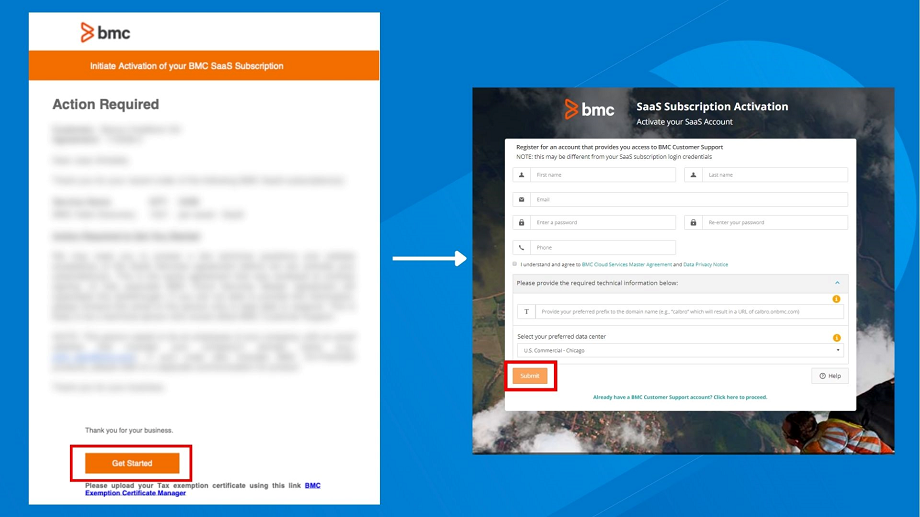

The SaaS onboarding process starts after , Inc. processes your order and you receive the order confirmation email. The following diagram illustrates the initial phases of onboarding:

Related topics

[Product-overview](https://docs.bmc.com/xwiki/bin/view/Service-Management/Employee-Digital-Workplace/BMC-Helix-Digital-Workplace/dwp254/Getting-started/Product-overview/)

[Setting-up-and-going-live](https://docs.bmc.com/xwiki/bin/view/Service-Management/Employee-Digital-Workplace/BMC-Helix-Digital-Workplace/dwp254/Setting-up-and-going-live/)[Orientation Checklist](https://docs.bmc.com/xwiki/bin/view/Helix-Common-Services/Other/BMC-Helix-Subscriber-Information/helixsubscriber/Getting-started/BMC-Helix-Orientation-Checklist/)

Training and certifications

[Training and Certification](https://www.bmc.com/education/training-and-certification.html)[DWP courses, certifications, and subscriptions](https://www.bmc.com/education/courses/find-courses.html#&keyword=Digital%20Workplace&sortCriteria=recommended&category=education)

## Know your onboarding team

Depending on your subscription, you might be assigned team members in addition to your Account Manager. To find your teams:

1. Go to[https://support..com](https://support.bmc.com)and log in.
2. Select**My Support**>**My Team**.
3. To see your , Inc. team contacts for a specific department, such as Customer Success or Education services, select the corresponding tab.

Members of your team who work with you for a short duration might not be listed.

## Activate your SaaS subscription

After you receive your order confirmation, in the email, click**Get Started**and follow the instructions to activate your subscription.

## Set up your application

Global Services, a trusted partner, or your development staff configures the application to meet your business needs. If you are configuring the application, see[Setting-up-and-going-live](https://docs.bmc.com/xwiki/bin/view/Service-Management/Employee-Digital-Workplace/BMC-Helix-Digital-Workplace/dwp254/Setting-up-and-going-live/)..