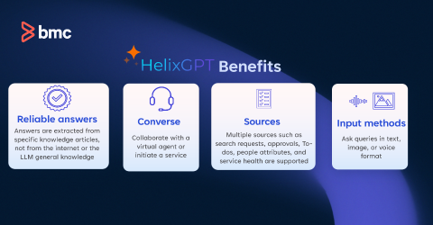

Leverage Employee Navigator powered by HelixGPTto deliver targeted answers for end-user queries related to service requests, approvals, to-dos, or from the referenced knowledge articles. End users can access the Employee Navigator side panel on all types of devices, such as desktops, tablets, and mobile phones.

Required license

[Service Management service](https://docs.bmc.com/xwiki/bin/view/Helix-Common-Services/Other/BMC-Helix-Subscriber-Information/helixsubscriber/BMC-Helix-services/BMC-Helix-Service-Management-service/)HelixGPT chat bar

Related topics

[Using-Employee-Navigator-to-find-AI-generated-answers](https://docs.bmc.com/xwiki/bin/view/Service-Management/Employee-Digital-Workplace/BMC-Helix-Digital-Workplace/dwp254/Using-BMC-Helix-Digital-Workplace-to-request-services/Using-Employee-Navigator-to-find-AI-generated-answers/)[HelixGPT architecture](https://docs.bmc.com/xwiki/bin/view/Service-Management/Employee-Digital-Workplace/BMC-HelixGPT/HelixGPT251/Getting-started/Key-concepts/BMC-HelixGPT-architecture/)

Configuring[Employee Navigator Supervisor agent](https://docs.bmc.com/xwiki/wiki/internal/view/Service-Management/Employee-Digital-Workplace/dwpMaster2/Administering/Administering-BMC-Helix-Digital-Workplace/Configuring-Employee-Navigator-Supervisor-agent/)

[Models in HelixGPT](https://docs.bmc.com/xwiki/bin/view/Service-Management/Employee-Digital-Workplace/BMC-HelixGPT/HelixGPT251/Getting-started/Key-concepts/Models-in-BMC-HelixGPT/)

## The benefits ofHelixGPTinclude:

Scenario: Configuring HelixGPT for generative AI retrieval of answers based on knowledge articles

Apex Global has their knowledge articles inHKMandITSM: Knowledge Management. Allen is an administrator at Apex Global and has enabled theHelixGPT capabilities for his end users.

Britney, the end user wants to install a VPN client on Mac, so she enters her query in the HelixGPT chat bar. A summary of the procedure for a Mac is provided along with the related knowledge article links.

While following the procedure, Britney encounters an error. She shares the screenshot of the error message in the HelixGPT chat bar. The system identifies the context and shares troubleshooting steps with her. After that, Britney is able to install the VPN client on her machine.

Scenario: Finding answers related to service requests or approvals

Britney is an end user who has submitted service requests for the following two items:

* IT peripherals—docking station and wireless mouse
* Access to the common SharePoint location

Britney goes on an urgent PTO for two days after submitting these requests. Upon her return, she doesn't see any updates on these requests. Instead of looking at these requests separately, she asks**Show my requests from past week**. She sees that these requests are in the Open state. She clicks the link of each request and adds a comment to the assigned agent requesting for an expedited closure of the request.

## Difference between search, chatbot, and generative AI retrieval of answers by usingBMC HelixGPT

The following table describes the difference between search, chatbot, and HelixGPT:

| Search  | Virtual Agent  | HelixGPT  |
| --- | --- | --- |
| When a user enters search keywords, the results (default up to 25) that are the closest match to the search text are displayed, irrespective of their source or type.  | When an end user enters a question,Virtual Agentunderstands the intent of the user and provides an answer based on the configured knowledge sources. The chatbot also asks questions required to submit a service request on behalf of the end user.  | When a user enters a question, the system understands the question and generates a summary of the relevant answers from all the available knowledge sources, which is presented as a human-like text response. If configured, HelixGPT also offers to submit a default service request on behalf of the end user.  |
| Search engines index and retrieve data by using keyword-based indexing.  | The Catalog services are imported intoVirtual Agent, which are then provided as suggestions to the end users.  | Generative Pre-trained Transformer (GPT) uses large language models (LLMs) to understand the intent, context, and semantics of human language.  |
| In DWP, end users can use full-text search from the following areas of the end-user console:   * Global search bar on the Catalog and My Activity pages. * Active and past events on the Catalog and My Activity pages. * Social section of the user preferences page. * Studio page, which has a search bar. | In DWP, end users can click the chatbot icon available on all screens to start interaction. **Important:**You can enable only one self-help application - chatbot or HelixGPT for the end users.  | InDWP, end users access theEmployee Navigatorto ask questions from the following areas of the end-user console:   * HelixGPTchat icon on all end-user screens. * Global search bar on the Catalog and My Activity pages. * Studio page (in the Search Bar components and the search block in the Content block component).  **Important:**You can enable only one self-help applicationVirtual Agentor HelixGPT for the end users.  |

## Capabilities available in Chatbot and HelixGPT

The following table describes the capabilities available in Chatbot and HelixGPT.

| Feature | Virtual Agent  | HelixGPT  |
| --- | --- | --- |
| Handoff when raising a request | Users can create requests, but earlier conversations might not be included. | Automatically submits a service request and includes the full chat transcript as an attachment. A summarized version of the conversation is sent as a comment. This behavior is controlled by parameters that can be configured by administrators. For more information, see[To update the configuration parameters of a skill](https://docs.bmc.com/xwiki/bin/view/Service-Management/Employee-Digital-Workplace/BMC-Helix-Digital-Workplace/dwp254/Administering/Administering-BMC-Helix-Digital-Workplace/Configuring-BMC-HelixGPT-in-the-end-user-console-and-studio-pages/#Toupdatetheconfigurationparametersofaskill). If your environment includes existing custom prompts created before the upgrade, you must manually add the following flags to those prompts after the upgrade to ensure proper functionality of raising a request via chat:   * addTranscriptInServiceRequest * addChatSummaryInServiceRequest * serviceRequestSummarizerUser |
| Support agent escalation | In DWP, it supports manual escalation to a support agent. The agent might not have full visibility into the earlier conversation context.  | Automatically shares the full chat transcript and a HelixGPT-generated summary with the support agents.  |

## Workflow to configure HelixGPT with DWP

The following image provides an overview of the workflow to configure HelixGPT with DWP:

The following table provides the detailed description and references to complete the workflow:

| Task  | Action  | Description  | Reference  |
| --- | --- | --- | --- |
| 1  | Complete the prerequisites  | Complete the prerequisites such as deploying a Large Language Model (LLM) service from a supported vendor of your choice, get the API key and other config parameters.  | [Before you begin configuring HelixGPT in the end user console](https://docs.bmc.com/xwiki/bin/view/Service-Management/Employee-Digital-Workplace/BMC-Helix-Digital-Workplace/dwp254/Administering/Administering-BMC-Helix-Digital-Workplace/Configuring-BMC-HelixGPT-in-the-end-user-console-and-studio-pages/#ConfiguringBMCHelixGPTintheend-userconsoleandstudiopages-workflow_prereqs)  |
| 2  | Configure the**HelixGPT**powered Employee Navigator panel on all end user screens  | Specify the default Skill that you want to use with the HelixGPT panel.  | [To set a Skill for the Employee Navigator panel on all end-user screens](https://docs.bmc.com/xwiki/bin/view/Service-Management/Employee-Digital-Workplace/BMC-Helix-Digital-Workplace/dwp254/Administering/Administering-BMC-Helix-Digital-Workplace/Configuring-BMC-HelixGPT-in-the-end-user-console-and-studio-pages/#ConfiguringBMCHelixGPTintheend-userconsoleandstudiopages-Skill_employeenav)  |
| Configure HelixGPT in studio pages  | Specify the default Skill that you want to use with one or more studio pages.  | [To configure HelixGPT in a Studio page](https://docs.bmc.com/xwiki/bin/view/Service-Management/Employee-Digital-Workplace/BMC-Helix-Digital-Workplace/dwp254/Administering/Administering-BMC-Helix-Digital-Workplace/Configuring-BMC-HelixGPT-in-the-end-user-console-and-studio-pages/#ConfiguringBMCHelixGPTintheend-userconsoleandstudiopages-Workflow_configureBMCHelixGPTinStudio)  |
| Configure HelixGPT in the My Activity or Catalog pages  | Specify the default Skill that you want to use with HelixGPT chat bar in the My Activity and Catalog pages.  | [Configuring-HelixGPT-in-the-end-user-console-and-studio-pages](https://docs.bmc.com/xwiki/bin/view/Service-Management/Employee-Digital-Workplace/BMC-Helix-Digital-Workplace/dwp254/Administering/Administering-BMC-Helix-Digital-Workplace/Configuring-BMC-HelixGPT-in-the-end-user-console-and-studio-pages/)  |
|  | Configure the Employee Navigator Supervisor agent for better user experience | Configure the Employee Navigator Supervisor agent to implement these capabilities through an agentic AI approach to offer a more conversational and contextual experience. | Configuring the[Employee Navigator Supervisor agent](https://docs.bmc.com/xwiki/wiki/internal/view/Service-Management/Employee-Digital-Workplace/dwpMaster2/Administering/Administering-BMC-Helix-Digital-Workplace/Configuring-Employee-Navigator-Supervisor-agent/) |

## FAQ

What is generative AI answer retrieval by using HelixGPT

Generative AI answer retrieval is a process that uses large language models (LLM) to understand the meaning of text in the knowledge articles.

HelixGPT

uses this text to match the user queries and generates an answer in human-like natural language.

How reliable are the answers from HelixGPT generative AI?

uses knowledge article content whenextracting answers. They do not come from the Internet or the large language model's (LLM) general knowledge, unless specifically configured.

How is my data protected and security protocols applied HelixGPT?

You can choose to use one of the supported providers for generative AIretrieval of answers. Depending on which model you choose, your data resides in that model and the security compliance of that model is applied.

Which other use cases can be achieved with HelixGPT?

To learn more, visit<a href="https://www.bmc.com/it-solutions/helixgpt.html" rel="noopener noreferrer" target="_blank">Generative AI: The Next Wave of ServiceOps Intelligence</a>on .com.

Why do some links provided with the HelixGPT answers do not open the knowledge articles?

Mostly likely becausethe skill you are using does not have filters to limit the access to external articles, or to a certain company. To learn how to use search filters, see<a href="https://docs.bmc.com/xwiki/bin/create/HelixGPT/Defining%20search%20settings?parent=Service-Management.Employee-Digital-Workplace.BMC-Helix-Digital-Workplace.dwp254.Getting-started.Use-cases.Generating-AI-retrieved-answers-for-end-users-through-BMC-HelixGPT.WebHome" target="_blank">Defining search settings</a>in the HelixGPT documentation.

For more frequently asked questions, see[FAQ in the HelixGPT documentation](https://docs.bmc.com/xwiki/bin/view/Service-Management/Employee-Digital-Workplace/BMC-HelixGPT/HelixGPT/FAQ/)

## Where to go from here

[Using-Employee-Navigator-to-find-AI-generated-answers](https://docs.bmc.com/xwiki/bin/view/Service-Management/Employee-Digital-Workplace/BMC-Helix-Digital-Workplace/dwp254/Using-BMC-Helix-Digital-Workplace-to-request-services/Using-Employee-Navigator-to-find-AI-generated-answers/)