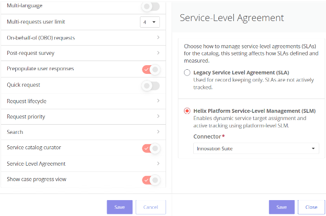
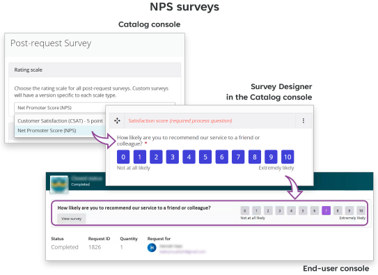
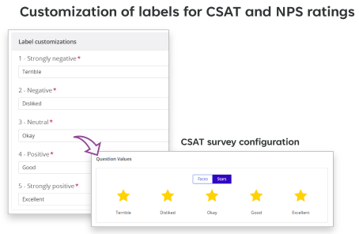
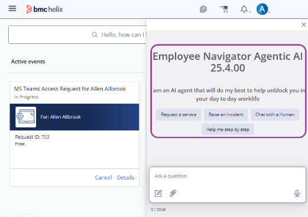
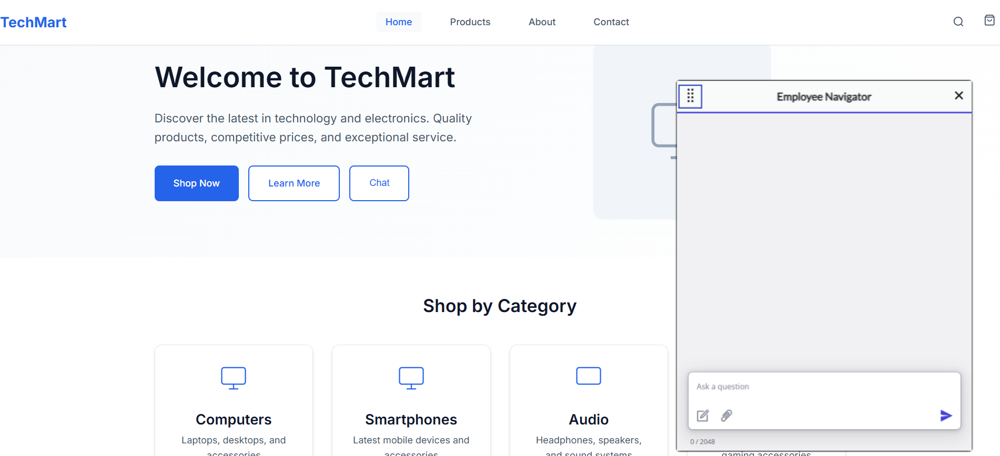

Review the DWP 25.4 enhancements and patches for features that will benefit your organization and to understand changes that might impact your users.

| Version  | SaaS  | On premises  | Fixed issues  | Updates and enhancements  |
| --- | --- | --- | --- | --- |
| 25.4 | ✅️ |  | [Known and corrected issues](https://docs.bmc.com/xwiki/bin/view/Service-Management/Employee-Digital-Workplace/BMC-Helix-Digital-Workplace/dwp254/Release-notes-and-notices/Known-and-corrected-issues/) | [25.4 enhancements](https://docs.bmc.com/xwiki/bin/view/Service-Management/Employee-Digital-Workplace/BMC-Helix-Digital-Workplace/dwp254/Release-notes-and-notices/25-4-enhancements-and-patches/#25.4) |
| 25.4.01 | ✅️ | ✅️ | [Known and corrected issues](https://docs.bmc.com/xwiki/bin/view/Service-Management/Employee-Digital-Workplace/BMC-Helix-Digital-Workplace/dwp254/Release-notes-and-notices/Known-and-corrected-issues/) | [25.4.01 enhancements](https://docs.bmc.com/xwiki/bin/view/Service-Management/Employee-Digital-Workplace/BMC-Helix-Digital-Workplace/dwp254/Release-notes-and-notices/25-4-enhancements-and-patches/#25.4.01) |

---

## 25.4.01

---

## What else changed in this release

| Update  | Product behavior in versions earlier than 25.4.01  | Product behavior in 25.4.01  |
| --- | --- | --- |
| *(Controlled availability)*In addition to text, Employee Navigator displays embedded images from knowledge articles for better accuracy and clarity. | Employee Navigator UI could provide answers from knowledge articles and documents. However, inline retrieval of images from the source content was not supported. Responses were text-based.  | Employee Navigator UI supports inline retrieval of images embedded in knowledge articles sourced from the ITSM: Knowledge Management knowledge store. Images up to 5 MB are supported for inline retrieval. Supported image formats by LLMs:   * Gemini 2.5 Flash supports PNG (.png), JPEG (.jpeg, .jpg), WEBP (.webp) * GPT 4.1 and 4.1 Mini support PNG (.png), JPEG (.jpeg, .jpg), WEBP (.webp), and GIF (.gif)  This capability is available*only*for Agentic AI.  |

## 25.4

The following video (2:29) provides an overview of the enhancements included in DWP 25.4:

[🎥 Watch Video: https://www.youtube.com/watch?v=obniaYNDVo4](https://www.youtube.com/watch?v=obniaYNDVo4)

[What's new in DWP 25.4](https://youtu.be/obniaYNDVo4)

---

## Guide users to a resolution by clarifying their ambiguous asks

This capability is available with the[Service Management service](https://docs.bmc.com/xwiki/bin/view/Helix-Common-Services/Other/BMC-Helix-Subscriber-Information/helixsubscriber/BMC-Helix-services/BMC-Helix-Service-Management-service/)as described in Subscriber Information.

Configure the Employee Navigator Supervisor agent, which uses built-in tools and coordinates sub-agents, to simplify the service interactions for employees. This agentic AI configuration transforms the Employee Navigator chat into a dynamic, more human-like, and context-aware experience in the following ways:

* Asks users follow-up questions to better understand the user intent when the initial input is vague.
* Responds by retrieving information from various sources, such as knowledge articles, service requests, approvals, To-dos, or service health items.
* Provides relevant catalog service links or guides users through a questionnaire to submit requests via chat.
* Connects users to live support or offers a generic request link when no resolution path is available.

For more information, see[Configuring Employee Navigator Supervisor agent](https://docs.bmc.com/xwiki/bin/view/Service-Management/Employee-Digital-Workplace/BMC-Helix-Digital-Workplace/dwp254/Administering/Administering-BMC-Helix-Digital-Workplace/Configuring-Employee-Navigator-Supervisor-agent/).

---

## Submit catalog requests through guided conversations

As an end user, submit service requests via the Employee Navigator chat through an interactive conversational experience. The agent interprets your query, identifies the most relevant catalog service, and walks you through the questionnaire. This capability provides the following benefits:

* Provides continuity by offering links to catalog services when chat-supported services are not available.
* Reduces manual effort and streamlines the process by submitting requests via chat.
* Improves the findability of services through AI-driven matching.

To learn more about the Catalog Request Agent, which facilitates this capability, see[Configuring Employee Navigator Supervisor Agent](https://docs.bmc.com/xwiki/bin/view/Service-Management/Employee-Digital-Workplace/BMC-Helix-Digital-Workplace/dwp254/Administering/Administering-BMC-Helix-Digital-Workplace/Configuring-Employee-Navigator-Supervisor-agent/)and[Using HelixGPT to make services requestable via chat](https://docs.bmc.com/xwiki/bin/view/Service-Management/Employee-Digital-Workplace/BMC-Helix-Digital-Workplace/dwp254/Creating-and-managing-the-service-catalog/Using-BMC-HelixGPT-to-make-services-requestable-via-chat/).  

## Access Employee Navigator via Microsoft Teams for a seamless experience

This capability is available with the[Service Management service](https://docs.bmc.com/xwiki/bin/view/Helix-Common-Services/Other/BMC-Helix-Subscriber-Information/helixsubscriber/BMC-Helix-services/BMC-Helix-Service-Management-service/)as described in Subscriber Information.

Access Employee Navigator within the Microsoft Teams interface to perform service management tasks. End users can ask their workplace queries and track service requests without leaving the communication environment they use every day. They save time and stay focused, reducing friction in daily workflows.

To learn more about Microsoft Teams integration, see[Configuring Employee Navigator in the Microsoft Teams chat](https://docs.bmc.com/xwiki/bin/view/Service-Management/Employee-Digital-Workplace/BMC-Helix-Digital-Workplace/dwp254/Administering/Administering-BMC-Helix-Digital-Workplace/Configuring-Employee-Navigator-in-the-Microsoft-Teams-chat/).

---

## Set up service level targets for service requests

The SLM Service library on Helix Platform enables catalog administrators to define, track, and display service targets for DWP requests. Implementing this feature brings several advantages to administrators, agents, and end users:

* Enhanced reporting with real-time SLM status in service request dashboards
* Streamlined configuration by using reusable service targets across catalog items
* Better SLA compliance tracking with milestone-based status updates
* Automated notifications for milestone alerts via email
* Seamless upgrade path from legacy provisioning time to delivery estimates

For more information, see[Configuring Service Level Management](https://docs.bmc.com/xwiki/wiki/internal/view/Service-Management/Employee-Digital-Workplace/dwpMaster2/Administering/Administering-BMC-Helix-Digital-Workplace-Catalog/Configuring-Service-Level-Management/#)

---

## Measure user satisfaction with the NPS survey

This capability is available with theDWP[license](https://docs.bmc.com/xwiki/wiki/internal/view/Service-Management/Employee-Digital-Workplace/dwpMaster2/Planning/License-types-and-features/).

Provide catalog administrators with the ability to configure surveys by using the Net Promoter Score (NPS) method as an alternative to the existing CSAT formats. This enhancement benefits organizations in the following ways:

* Aligns with industry-standard metrics for customer sentiment.
* Facilitates clear differentiation of survey data by using scale types like CSAT and NPS.
* Allows customization of rating labels to better reflect organizational terminology and support localization.
* Automatically updates the survey template during global scale changes.
* Supports seamless integration of survey data with the Catalog reports that reflect survey scales.

For more information, see[Designing custom surveys for catalog services](https://docs.bmc.com/xwiki/bin/view/Service-Management/Employee-Digital-Workplace/BMC-Helix-Digital-Workplace/dwp254/Creating-and-managing-the-service-catalog/Setting-up-surveys/Setting-up-satisfaction-surveys-for-catalog-services/Designing-custom-surveys-for-catalog-services/).

---

## Evaluating Customer Satisfaction via the DWP Net Promoter Score Dashboard

Use the DWP Net Promoter Score Report dashboard to evaluate customer satisfaction by analyzing survey responses and ratings from the customer service cases based on the Net Promoter Score (NPS). The NPS is calculated by subtracting the percentage of detractors (those who rate 0–6) from the percentage of promoters (those who rate 9–10) on an 11-point scale ranging from 0 (lowest value) to 10 (highest value).

For more information, see[Viewing DWP dashboards](https://docs.bmc.com/xwiki/bin/view/Service-Management/Employee-Digital-Workplace/BMC-Helix-Digital-Workplace/dwp254/Administering/Administering-BMC-Helix-Digital-Workplace/Viewing-BMC-Helix-Digital-Workplace-dashboards/)

---

## Configure a welcome message to guide users in Employee Navigator

Configure a welcome message to be displayed when an end user starts a new topic in Employee Navigator. The message provides a brief introduction and helps you get started with Employee Navigator quickly.

You can also configure the message to be displayed in any of the supported localized languages.

For more information, see[Configuring HelixGPT in the end-user console and studio pages](https://docs.bmc.com/xwiki/bin/view/Service-Management/Employee-Digital-Workplace/BMC-Helix-Digital-Workplace/dwp254/Administering/Administering-BMC-Helix-Digital-Workplace/Configuring-BMC-HelixGPT-in-the-end-user-console-and-studio-pages/).

---

## Copy formatted prompt responses to save time

Save time by copying a prompt response. Reuse the copied content including its formatting and images in other artifacts, such as a Word document or an email.

For more information, see[Using Employee Navigator to find AI-generated answers](https://docs.bmc.com/xwiki/bin/view/Service-Management/Employee-Digital-Workplace/BMC-Helix-Digital-Workplace/dwp254/Using-BMC-Helix-Digital-Workplace-to-request-services/Using-Employee-Navigator-to-find-AI-generated-answers/).

---

## *(Controlled availability)*Embed the Employee Navigator chat panel in your website

As a website developer, embed the Employee Navigator chat panel in your website to bring Employee Navigator capabilities directly to your users. End users can interact with the panel to receive intelligent, context-aware assistance wherever they are. The interface and functionality of the embedded panel closely match the experience end users already have with Employee Navigator in DWP.

For more information, see[Embedding the Employee Navigator chat panel in your website](https://docs.bmc.com/xwiki/bin/view/Service-Management/Employee-Digital-Workplace/BMC-Helix-Digital-Workplace/dwp254/Integrating/Embedding-the-Employee-Navigator-chat-panel-in-your-website/).

---

## What else changed in this release

| Update  | Product behavior in versions earlier than 25.4  | Product behavior in 25.4  |
| --- | --- | --- |
| Create cleaner and well-formatted text inputs with less effort by using improved text editors | While using text editors for tasks, such as adding RTF comments to requests or creating questionnaires, error messages related to unsupported formats or attachment limits would appear on submission. Additionally, Inline images could only be resized by manually editing their pixel size. | Users work with a more intuitive and responsive text editing interface that offers the following benefits:   * **Real-time and inline validation**for unsupported formats, attachment limits, and invalid URL schemes directly within the text editor fields. * **Stronger formatting control**through confirmation prompts for pasted text with different formats. * **Improved attachment handling**with bulk drag-and-drop for uploading images and intuitive drag-to-resize functionality.  

Click here to see the image

 |
| Improved organization of chained-prompt and agentic AI skills for DWP in HelixGPT Agent Studio | Administrators would see a long list of prompt and agent-based skills in HelixGPT Agent Studio, making navigation and discovery time-consuming. | HelixGPT Agent Studio offers a more compact and intuitive list of out-of-the-box skills for DWP by consolidating multiple chained-prompt and agentic AI capabilities under each skill. 

Click here to see the available list of skills in the HelixGPT Studio

**Important:** We recommend using the following skills to leverage agentic AI capabilities:   * Employee Navigator for Helix * Employee Navigator for Helix- MS Teams |
| Route users to a human support by using the Live Chat Agent | Live agent connection was available only through a prompt-based approach. | As an administrator, you can configure the Employee Navigator Supervisor agent to enable the**Live Chat Agent**to connect users with human support. This agentic AI configuration provides a more dynamic user experience. DWP supports both prompt-based and agent-driven approaches.  |
| Branding for applications | applications used an older color theme for icons, buttons, links, and UI pages. | The core brand colors have been updated to create a more modern and accessible palette. The new branding includes an updated color theme, icons, and buttons for a consistent look across all applications.  |