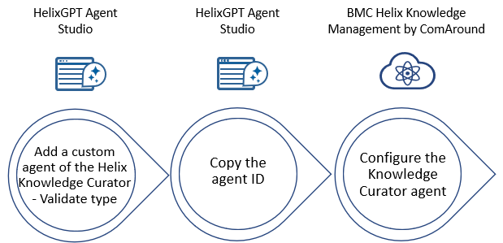
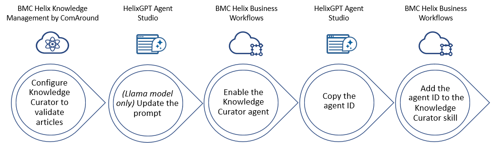
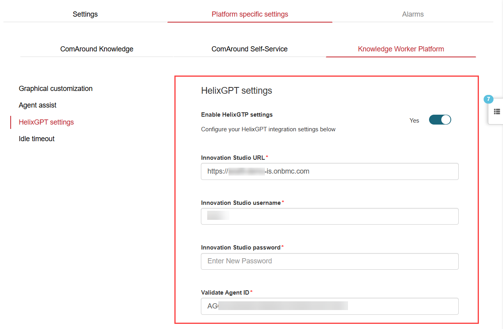

Knowledge Curator is a HelixGPT-powered agent that uses generative AI capabilities to accomplish the following goals:

* Validate knowledge articles in HKM.
* Generate new knowledge articles inHKM from Business Workflows cases.
* Generate new knowledge articles inHKM from ITSM incidents.

As an administrator, you can configure the Knowledge Curator agent for HKM.

Related topics

[Models in HelixGPT](https://docs.bmc.com/xwiki/bin/view/Service-Management/Employee-Digital-Workplace/BMC-HelixGPT/helixgpt254/Getting-started/Key-concepts/Models-in-BMC-HelixGPT/)

[Provisioning and setting up the generative AI provider for your application](https://docs.bmc.com/xwiki/bin/view/Service-Management/Employee-Digital-Workplace/BMC-HelixGPT/helixgpt254/Setting-up-and-going-live/Provisioning-and-setting-up-the-generative-AI-provider-for-your-application/)

[AI Agents in HelixGPT](https://docs.bmc.com/xwiki/bin/view/Service-Management/Employee-Digital-Workplace/BMC-HelixGPT/helixgpt254/AI-agents-in-BMC-HelixGPT/)

## Overview of the supported capabilities

After the Knowledge Curator agent is configured, users can utilize the following capabilities that the Knowledge Curator provides:

| Capability | Description | Available in | Roles that can use this capability | Reference |
| --- | --- | --- | --- | --- |
| Validate knowledge articles in HKM | Knowledge Curator utilizes prompt instructions to review articles for quality and recommend improvements based on the Knowledge-Centered Service (KCS) principles. For more information about the KCS principles, see[Learning about KCS v6 verified HKM](https://docs.bmc.com/xwiki/bin/view/Service-Management/Employee-Digital-Workplace/BMC-Helix-Knowledge-Management-by-ComAround/hkm/Getting-started/Use-cases/Learning-about-KCS-v6-verified-BMC-Helix-Knowledge-Management-by-ComAround/). Knowledge workers can use this capability to improve article quality and save time and effort in reviewing articles.  | This capability is available for , Inc. customers that use HKM as a knowledge provider for ITSM and Business Workflows. | Knowledge worker roles in HKM that can create and edit articles For example, Knowledge candidate is the basic knowledge worker role that has editing access to knowledge articles, specifically those that are in progress or in draft. Higher-level roles have access to articles in additional states. For more information about different user roles, see[User roles](https://docs.bmc.com/xwiki/bin/view/Service-Management/Employee-Digital-Workplace/BMC-Helix-Knowledge-Management-by-ComAround/hkm/Getting-started/Product-overview/#roles).  | * Learn how to configure this capability in[Workflow for configuring Knowledge Curator to validate articles](https://docs.bmc.com/xwiki/bin/view/Service-Management/Employee-Digital-Workplace/BMC-Helix-Knowledge-Management-by-ComAround/hkm/Configuring-the-Knowledge-Curator-agent-for-BMC-Helix-Knowledge-Management-by-ComAround/#validate). * To learn how to use this capability, see[Validating articles by using the Knowledge Curator agent](https://docs.bmc.com/xwiki/bin/view/Service-Management/Employee-Digital-Workplace/BMC-Helix-Knowledge-Management-by-ComAround/hkm/Validating-articles-by-using-the-Knowledge-Curator-agent/). |
| Generate new knowledge articles in HKM from Business Workflows cases | Knowledge Curator utilizes prompt instructions to create a knowledge article from a case that contains information about resolving case-related issues. The article is generated based on the KCS principles, and the article type is KCS article. By default, the article is created in the Work in progress (WIP) status that can be changed by the author. Mapping of knowledge access permissions from Business Workflows to HKM determines access to the created article. For more information, see[Mapping knowledge permissions from applications to HKM](https://docs.bmc.com/xwiki/bin/view/Service-Management/Innovation-Suite/BMC-Helix-Innovation-Suite/is254/Enabling-services/Configuring-BMC-Helix-Knowledge-Management-by-ComAround-as-a-knowledge-provider/Mapping-knowledge-permissions-from-BMC-applications-to-BMC-Helix-Knowledge-Management-by-ComAround/). If another article with a similar content already exists, knowledge workers can use the duplicate detection capability in HKM. **Important:**Customers using Business Workflows must always configure both capabilities—the capability to*validate*and*generate*knowledge articles. It is not possible to generate knowledge articles without first configuring the capability to validate them. These two capabilities are designed to work together. For example, a case agent can create an article from a case and then review it for quality.  | This capability is available for customers that use HKM as a knowledge provider for Business Workflows. | Case agents that have knowledge worker roles that can create and edit articles in HKM. Also, case agents*must*have write access to knowledge articles.  | * Learn how to configure this capability in[Workflow for configuring Knowledge Curator to generate articles from Business Workflows cases](https://docs.bmc.com/xwiki/bin/view/Service-Management/Employee-Digital-Workplace/BMC-Helix-Knowledge-Management-by-ComAround/hkm/Configuring-the-Knowledge-Curator-agent-for-BMC-Helix-Knowledge-Management-by-ComAround/#generate). * To learn how to use this capability, see[Automatically generating and validating knowledge articles](https://docs.bmc.com/xwiki/bin/view/Service-Management/Enterprise-Service-Management/BMC-Helix-Business-Workflows/bwf254/Managing-and-developing-knowledge-articles/Automatically-generating-knowledge-articles/). |
| Generate new knowledge articles in HKM from ITSM incidents. | Knowledge Curator utilizes prompt instructions to create a knowledge article by using the incident data, such as summary, description, and work log entries any time during the incident lifecycle.  The article is generated based on the KCS principles, and the article type is KCS article. By default, the article is created in the**Work in progress (WIP)**status that can be changed by the author. After the article is created, it is automatically pinned to the incident. Mapping of knowledge access permissions from ITSM to HKM determines access to the created article. For more information, see[Mapping knowledge permissions from applications to HKM](https://docs.bmc.com/xwiki/bin/view/Service-Management/Innovation-Suite/BMC-Helix-Innovation-Suite/is254/Enabling-services/Configuring-BMC-Helix-Knowledge-Management-by-ComAround-as-a-knowledge-provider/Mapping-knowledge-permissions-from-BMC-applications-to-BMC-Helix-Knowledge-Management-by-ComAround/). **Important:**Customers using ITSM must always configure both capabilities—the capability to*validate*and*generate*knowledge articles. It is not possible to generate knowledge articles without first configuring the capability to validate them. These two capabilities are designed to work together.  | This capability is available for customers that use HKM as a knowledge provider for ITSM. | Service Desk Agents who have knowledge user permissions can create and edit articles in HKM. | * Learn how to configure this capability, see[Enabling the creation of knowledge articles from incidents by using Knowledge Curator](https://docs.bmc.com/xwiki/bin/view/Service-Management/IT-Service-Management/BMC-Helix-ITSM/itsm254/Setting-up-and-going-live/Configuring-settings-to-use-Agentic-AI-capabilities/Enabling-the-creation-of-knowledge-articles-from-incidents-by-using-Knowledge-Curator/).  * To learn how to use this capability, see[Creating knowledge articles from incidents by using Knowledge Curator - Documentation](https://docs.bmc.com/xwiki/bin/view/Service-Management/IT-Service-Management/BMC-Helix-ITSM-Service-Desk/servicedesk254/Managing-incident-requests/Creating-knowledge-articles-from-incidents-by-using-Knowledge-Curator/). |

Important

Knowledge Curator doesn’t support finding answers or guidance based on knowledge articles from external sources, such as Confluence.

## Before you begin

* Make sure that you have the following licenses and permissions. These licenses and permissions are required to configure the capabilities to validate and generate knowledge articles.
  + [Service Management Advanced license](https://docs.bmc.com/xwiki/bin/view/Helix-Common-Services/Other/BMC-Helix-Subscriber-Information/helixsubscriber/BMC-Helix-services/BMC-Helix-Service-Management-service/)and administrator permissions in HelixGPT.
  + Knowledge manager role inHKM.  
    For more information about different user roles inHKM, see[User roles](https://docs.bmc.com/xwiki/bin/view/Service-Management/Employee-Digital-Workplace/BMC-Helix-Knowledge-Management-by-ComAround/hkm/Getting-started/Product-overview/#roles). Learn how to grant roles to a user in[Add user (HKM)](https://zero.comaround.com/en-us/content/971335/?ctxt=search#/)and[User groups in administration tool (HKM)](https://zero.comaround.com/en-us/content/970339/?ctxt=search#/).

    **Important**

    To access these help articles, you must first subscribe, and then log in to HKM. You subscribe to HKM by purchasing the[Service Management Advanced license](https://docs.bmc.com/xwiki/bin/view/Helix-Common-Services/Other/BMC-Helix-Subscriber-Information/helixsubscriber/BMC-Helix-services/BMC-Helix-Service-Management-service/)license. HKM is also available to customers with entitlements in[Virtual Agent Basic](https://docs.bmc.com/xwiki/bin/view/Helix-Common-Services/Other/BMC-Helix-Subscriber-Information/helixsubscriber/BMC-Helix-services/BMC-Helix-Virtual-Agent-Basic-service/)and[Virtual Agent Advanced](https://docs.bmc.com/xwiki/bin/view/Helix-Common-Services/Other/BMC-Helix-Subscriber-Information/helixsubscriber/BMC-Helix-services/BMC-Helix-Virtual-Agent-Advanced-service/)subscriptions.

* To configure the capability to generate knowledge articles from Business Workflows cases, make sure that you meet the following requirements:
  + You have configuredHKM as a knowledge provider forBusiness Workflows.
  + You have the Administrator and Case business analyst roles in Business Workflows.

* To configure the capability to generate knowledge articles from ITSM incidents, make sure that you meet the following requirements:
  + You have configuredHKMas a knowledge provider forITSM.
  + You have the administrator and knowledge user permissions in ITSM.

* As a HelixGPT administrator, deploy a Large Language Model (LLM) service from a supported vendor of your choice, get the API key and other configuration parameters, and add them in the HelixGPT administrator UI. For more information, see[Provisioning and setting up the generative AI provider for your application](https://docs.bmc.com/xwiki/bin/view/Service-Management/Employee-Digital-Workplace/BMC-HelixGPT/helixgpt254/Setting-up-and-going-live/Provisioning-and-setting-up-the-generative-AI-provider-for-your-application/).

## Workflow for configuring Knowledge Curator to validate articles

The following image provides an overview of the workflow to configure the Knowledge Curator agent to validate knowledge articles:

| Action  | Role  | Description  | Reference  |
| --- | --- | --- | --- |
| Add Knowledge Curator as a custom agent of the Helix Knowledge Curator - Validate type.  | HelixGPT administrator | Add Knowledge Curator as a custom agent in HelixGPT Agent Studio. When you create the custom agent, make sure to select the specific values for the following settings:   * In the**Type**field, select**Helix Knowledge Curator - Validate**. * In the**Instructions**text area, copy and paste the following default prompt text or specify your own instructions:  [Default prompt to validate articles](https://docs.bmc.com/xwiki/bin/download/Service-Management/Employee-Digital-Workplace/BMC-Helix-Knowledge-Management-by-ComAround/hkm/Configuring-the-Knowledge-Curator-agent-for-BMC-Helix-Knowledge-Management-by-ComAround/WebHome/The%20default%20prompt%20to%20validate%20articles.pdf?rev=1.1)(Click to download the PDF copy.) **Important** If you configured the Knowledge Curator agent in version 25.1 by creating the Agent record in IS, the functionality will continue to work in later versions. You will notice that Knowledge Curator is now included as a custom agent in HelixGPT Agent Studio.  | The*To add a custom AI agent*procedure in[Creating and managing agents by using the Agent Studio editor](https://docs.bmc.com/xwiki/bin/view/Service-Management/Employee-Digital-Workplace/BMC-HelixGPT/helixgpt254/Administering/Managing-AI-agents/).  |
| Copy the Agent ID.  | HelixGPT administrator  | After you create a custom agent of the Helix Knowledge Curator - Validate type, copy the ID of this agent. You will use this ID while[configuring the Knowledge Curator agent in HKM](https://docs.bmc.com/xwiki/bin/view/Service-Management/Employee-Digital-Workplace/BMC-Helix-Knowledge-Management-by-ComAround/hkm/Configuring-the-Knowledge-Curator-agent-for-BMC-Helix-Knowledge-Management-by-ComAround/#.ConfiguringtheKnowledgeCuratoragentforBMCHelixKnowledgeManagementbyComAroundv25.1-configs).  | [To copy the ID of a created agent](https://docs.bmc.com/xwiki/bin/view/Service-Management/Employee-Digital-Workplace/BMC-Helix-Knowledge-Management-by-ComAround/hkm/Configuring-the-Knowledge-Curator-agent-for-BMC-Helix-Knowledge-Management-by-ComAround/#agent_id) |
| Configure the Knowledge Curator agent.  | Knowledge manager inHKM  | Configure and enable the Knowledge Curator agent in HKM.  | [To configure the Knowledge Curator agent in HKM](https://docs.bmc.com/xwiki/bin/view/Service-Management/Employee-Digital-Workplace/BMC-Helix-Knowledge-Management-by-ComAround/hkm/Configuring-the-Knowledge-Curator-agent-for-BMC-Helix-Knowledge-Management-by-ComAround/#.ConfiguringtheKnowledgeCuratoragentforBMCHelixKnowledgeManagementbyComAroundv25.1-configs)  |

## Workflow for configuring Knowledge Curator to generate articles from ITSM incidents

The following table provides an overview of the workflow to configure the Knowledge Curator agent to automatically generate articles from ITSM incidents:

| **Action** | **Role** | **Description** | **Reference** |
| --- | --- | --- | --- |
| Configure the Knowledge Curator agent to validate articles in HKM. | Multiple roles needed | Complete the process to configure the Knowledge Curator agent to validate articles. **Important:**To configure the capability to generate articles from incidents, you must first set up the capability to validate articles.  | [Workflow for configuring Knowledge Curator to validate articles](https://docs.bmc.com/xwiki/bin/view/Service-Management/Employee-Digital-Workplace/BMC-Helix-Knowledge-Management-by-ComAround/hkm/Configuring-the-Knowledge-Curator-agent-for-BMC-Helix-Knowledge-Management-by-ComAround/#validate) |
| Enable Knowledge Curator in ITSM. | ITSM Administrator | To start using Knowledge Curator, you must enable the**Enable HelixGPT Knowledge Curator**option in the HPD:CFG-Rules incident rule form. | [Enabling the creation of knowledge articles from incidents by using Knowledge Curator](https://docs.bmc.com/xwiki/bin/view/Service-Management/IT-Service-Management/BMC-Helix-ITSM/itsm254/Setting-up-and-going-live/Configuring-settings-to-use-Agentic-AI-capabilities/Enabling-the-creation-of-knowledge-articles-from-incidents-by-using-Knowledge-Curator/). |

**Important**  
If you're using the Gemini 2.5 Flash model by Google with ITSM and the Knowledge Curator agent, you might receive blank responses when attempting to create a knowledge article. As a workaround, replace the prompt for the ITSM - Generate HKM Article agent in HelixGPT Agent Studio. Replace the existing prompt with the following prompt:[ITSM\_Knowledge\_Curator\_Generate\_prompt.zip](https://docs.bmc.com/xwiki/bin/download/Service-Management/Employee-Digital-Workplace/BMC-Helix-Knowledge-Management-by-ComAround/hkm/Configuring-the-Knowledge-Curator-agent-for-BMC-Helix-Knowledge-Management-by-ComAround/WebHome/ITSM_Knowledge_Curator_Generate_prompt.zip?rev=1.1)(Click to download the zip file containing the prompt in the .md format.)

Learn how to edit the agent in[Managing AI agents](https://docs.bmc.com/xwiki/bin/view/Service-Management/Employee-Digital-Workplace/BMC-HelixGPT/helixgpt254/Administering/Managing-AI-agents/).

## Workflow for configuring Knowledge Curator to generate articles from Business Workflows cases

The following image provides an overview of the workflow to configure the Knowledge Curator agent to automatically generate articles from Business Workflows cases:

| Action  | Role  | Description  | Reference  |
| --- | --- | --- | --- |
| Configure the Knowledge Curator agent to validate articles in HKM. | Multiple roles needed | Complete the process to configure the Knowledge Curator agent to validate articles. **Important:**To configure the capability to generate articles from cases, you must first set up the capability to validate articles.  | [Workflow for configuring Knowledge Curator to validate articles](https://docs.bmc.com/xwiki/bin/view/Service-Management/Employee-Digital-Workplace/BMC-Helix-Knowledge-Management-by-ComAround/hkm/Configuring-the-Knowledge-Curator-agent-for-BMC-Helix-Knowledge-Management-by-ComAround/#validate) |
| *(Llama model only)*Update the prompt.  | HelixGPT administrator | For knowledge article generation, the**BWF - Generate HKM Article**agent is added out of the box in HelixGPT Agent Studio. To use the out-of-the-box agent for the Llama model, update the prompt. [Sample prompt for BWF - Generate HKM Article Llama model](https://docs.bmc.com/xwiki/bin/download/Service-Management/Employee-Digital-Workplace/BMC-Helix-Knowledge-Management-by-ComAround/hkm/Configuring-the-Knowledge-Curator-agent-for-BMC-Helix-Knowledge-Management-by-ComAround/WebHome/Sample%20prompt%20for%20BWF%20-%20Generate%20HKM%20Article%20Llama%20model.pdf?rev=1.1)(Click to download the PDF copy.) **Important**: For the Azure and Gemini models, the prompts are included out-of-the-box in HelixGPT Agent Studio.  | The*Task 1: (Llama model only) To update the prompt for the out-of-the-box agent*​​​​​procedure in[Enabling automatic knowledge article generation and validation by using Knowledge Curator](https://docs.bmc.com/xwiki/bin/view/Service-Management/Enterprise-Service-Management/BMC-Helix-Business-Workflows/bwf254/Configuring-a-line-of-business/Defining-configurations-for-BMC-HelixGPT/Automating-knowledge-article-generation-through-the-Knowledge-Curator-agent/).  |
| Enable the Knowledge Curator agent in Business Workflows. | Business Workflows administrator | Enable the Knowledge Curator agent in Business Workflows. | The*Task 2: To enable the Knowledge Curator agent for a line of business*procedure in[Enabling automatic knowledge article generation and validation by using Knowledge Curator](https://docs.bmc.com/xwiki/bin/view/Service-Management/Enterprise-Service-Management/BMC-Helix-Business-Workflows/bwf254/Configuring-a-line-of-business/Defining-configurations-for-BMC-HelixGPT/Automating-knowledge-article-generation-through-the-Knowledge-Curator-agent/). |
| Copy the agent ID. | HelixGPT administrator | Copy the ID of the**BWF - Generate HKM Article**agent. You will add this[ID to the Knowledge Curator skill in Business Workflows.](https://docs.bmc.com/xwiki/bin/view/Service-Management/Employee-Digital-Workplace/BMC-Helix-Knowledge-Management-by-ComAround/hkm/Configuring-the-Knowledge-Curator-agent-for-BMC-Helix-Knowledge-Management-by-ComAround/#skill_id)  | [To copy the agent ID](https://docs.bmc.com/xwiki/bin/view/Service-Management/Employee-Digital-Workplace/BMC-Helix-Knowledge-Management-by-ComAround/hkm/Configuring-the-Knowledge-Curator-agent-for-BMC-Helix-Knowledge-Management-by-ComAround/#agent_id) |
| Add the Agent ID to the Knowledge Curator skill in Business Workflows. | Case business analyst | Add the ID that you previously copied to the Knowledge Curator skill in Business Workflows. | The*Task 3: (For HKM only) To add the agent ID*procedure in[Enabling automatic knowledge article generation and validation by using Knowledge Curator](https://docs.bmc.com/xwiki/bin/view/Service-Management/Enterprise-Service-Management/BMC-Helix-Business-Workflows/bwf254/Configuring-a-line-of-business/Defining-configurations-for-BMC-HelixGPT/Automating-knowledge-article-generation-through-the-Knowledge-Curator-agent/). |

## To copy the agent ID

1. In HelixGPT Agent Studio, navigate to the Agents page.
2. At the top of the Agents table, click the**Visible columns**link and select**ID**.
3. Locate the table entry for the agent and copy the alphanumeric value in the ID column.

The following image shows the ID displayed in HelixGPT Agent Studio for the**BWF - Generate HKM Article**agent:

## To configure the Knowledge Curator agent in HKM

1. Launch HKM from ITSM or Business Workflows.

   **•**To launch HKM from ITSM, select**Console > Knowledge**.  
   **•**To launch HKMfrom Business Workflows, select**Workspace****> Knowledge**.

   ​​
2. Click**Settings**and select**Administration**.
3. In the**Portals**section, click the**Portal settings**button next to your portal.
4. On the Portal settings page, select**Platform specific settings**>**Knowledge Worker Platform**.
5. Configure**HelixGPT settings**by specifying the following fields:

   | Field  | Action  |
   | --- | --- |
   | Enable HelixGTP settings  | Turn this toggle key on to enable the Knowledge Curator agent for HKM.  |
   | IS URL  | Enter the URLof the IS instance that is associated with HKM.  |
   | IS username  | Enter the name of the user withAR System Administrator permissionswho can accessthis IS instance and call the HelixGPT agents API. **Important**: You cannot use , Inc. service accounts for this configuration. You must create a separate administrator user to complete these settings.  |
   | IS password  | Click**Change password**and enter the password of the user withAR System Administrator permissionswho can accessthis IS instance and call the HelixGPT agents API.  |
   | Validate Agent ID  | Enter the ID that you previously copied from HelixGPT Agent Studio after creating a custom agent of the Helix Knowledge Curator - Validate type.  |

   
6. Click**Save**.  
   ​​​​​

## Results

After you have configured the Knowledge Curator agent, users can utilize it to achieve the following goals:

* Validate knowledge articles in HKM. For more information about utilizing the Knowledge Curator agent to validate articles, see[Validating articles by using the Knowledge Curator agent](https://docs.bmc.com/xwiki/bin/view/Service-Management/Employee-Digital-Workplace/BMC-Helix-Knowledge-Management-by-ComAround/hkm/Validating-articles-by-using-the-Knowledge-Curator-agent/).
* Generate knowledge articles from Business Workflows cases.For more information about utilizing the Knowledge Curator agent to generate articles,see[Automatically generating and validating knowledge articles](https://docs.bmc.com/xwiki/bin/view/Service-Management/Enterprise-Service-Management/BMC-Helix-Business-Workflows/bwf254/Managing-and-developing-knowledge-articles/Automatically-generating-knowledge-articles/).
* Generate knowledge articles from ITSM incidents. For more information, see[Creating knowledge articles from incidents by using Knowledge Curator - Documentation](https://docs.bmc.com/xwiki/bin/view/Service-Management/IT-Service-Management/BMC-Helix-ITSM-Service-Desk/servicedesk254/Managing-incident-requests/Creating-knowledge-articles-from-incidents-by-using-Knowledge-Curator/).

The following image shows the validation capability of the Knowledge Curator agent:

The following image shows the generation capability of the Knowledge Curator agent in Business Workflows:

The following image shows the generation capability of the Knowledge Curator agent in ITSM:

