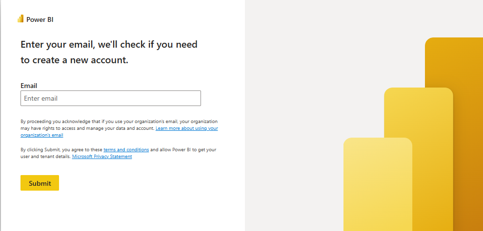
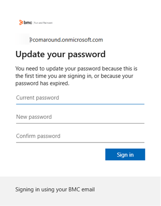
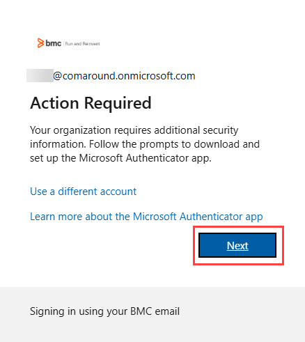
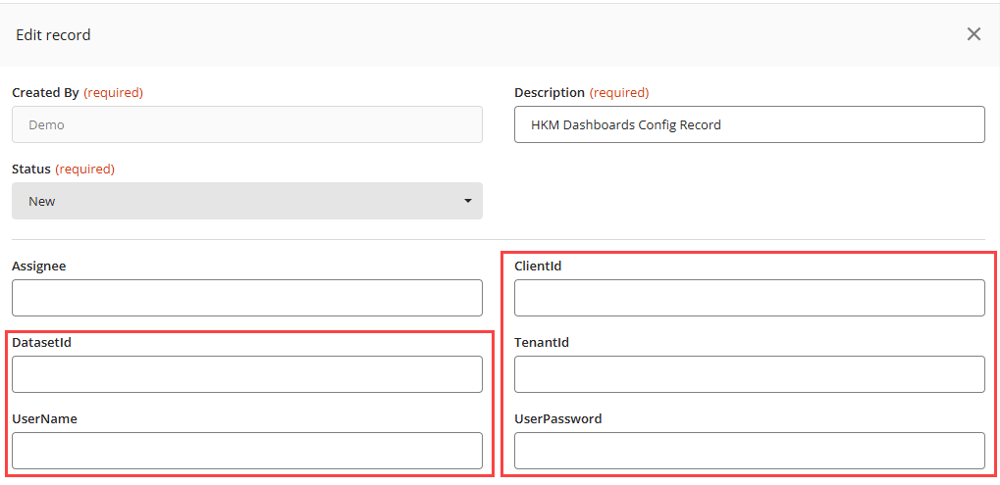
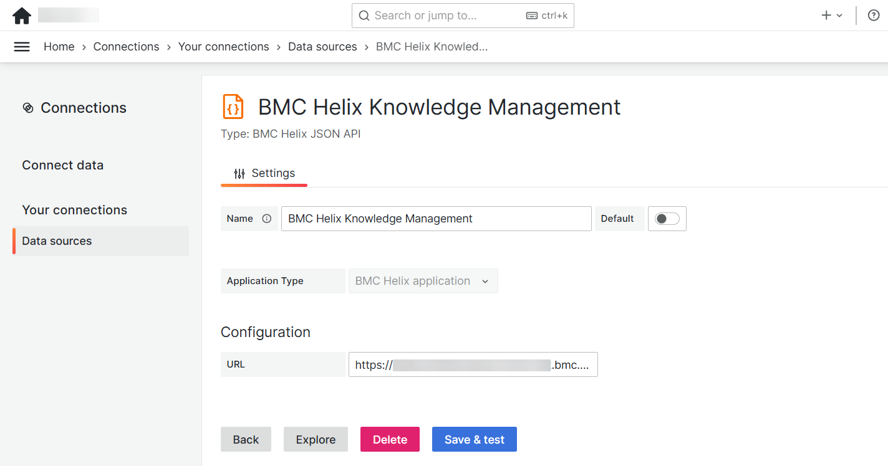
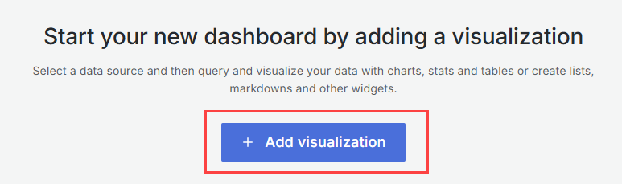
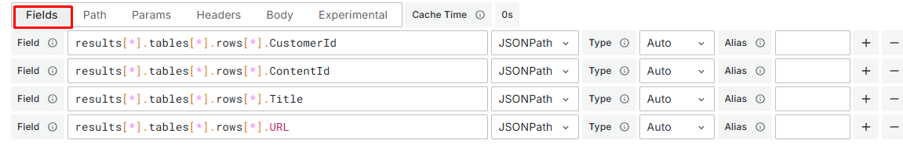
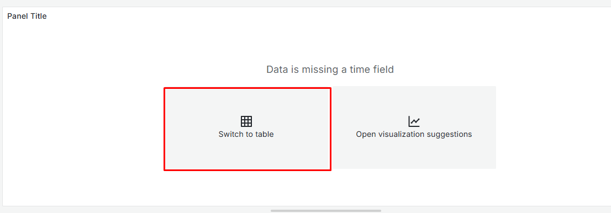

Use Dashboards to create custom dashboards that collect and visualize data from HKM. Dashboards provides unified reporting and a consolidated view of data from various applications within your environment. By creating custom dashboards for HKM, you can centralize all reports in one location and use them consistently.

Important

Out-of-the-box dasboards are not currently available for HKM.

Custom dashboards for HKM retrieve data from Microsoft Power BI (part of Microsoft Fabric) data sets, where your data and content are stored. You build a DAX query to extract data from any table in Microsoft Power BI (part of Microsoft Fabric), specifying which table to access and which fields to display. As a result, you have complete control over the output, and any data can be returned. Data retrieval is fully secure, occurring solely for your organization based on your Microsoft Entra ID. You can visualize the retrieved data by using the visualization plug-ins supported by Dashboards.

Important

Only , Inc. SaaS customers can create custom dashboards for HKM in Dashboards.

## Before you begin

Make sure that you use the following product versions:

* IS version 25.3.00 or later
* Dashboards version 25.3.00 or later

Make sure that you have the following licenses and permissions:

* Administrator permissions in IS.  
  Learn how to grant administrator permissions to a user in[Creating and modifying users](https://docs.bmc.com/xwiki/bin/view/Service-Management/Innovation-Suite/BMC-Helix-Innovation-Suite/is254/Administering/Setting-up-users-access-and-preferences/Creating-users-groups-and-roles/Creating-and-modifying-users/). Refer to Step 4 in the procedure*To create users,*specifically the**Group List**field.
* Reporting administrator or editor roles in Dashboards.  
  For more information about granting roles in Dashboards, see[Managing role-based access control in Dashboards](https://docs.bmc.com/xwiki/bin/view/Helix-Common-Services/Dashboards-Reports/BMC-Helix-Dashboards/BHD253/Administering/Managing-role-based-access-control-in-BMC-Helix-Dashboards/).

## Workflow for creating custom dashboards for HKM

The following overview shows the workflow to create a custom dashboard for HKM in Dashboards:

| Action | Application | Role | Description | Reference |
| --- | --- | --- | --- | --- |
| Request the creation of a user in Microsoft Entra ID. | Not applicable | Not applicable | Ask , Inc. Support to create a new user for your organization in Microsoft Entra ID. After the user is created, , Inc. Support will provide you with the user name and password for that user, along with the ClientId, DatasetId, and TenantId values. You will use these values[to configure the HKM Dashboards Config record definition](https://docs.bmc.com/xwiki/bin/view/Service-Management/Employee-Digital-Workplace/BMC-Helix-Knowledge-Management-by-ComAround/hkm/Creating-dashboards-for-BMC-Helix-Knowledge-Management-by-ComAround/#task3).  | Not applicable |
| Reset the password for the user created in Microsoft Entra ID. | Microsoft Power BI (part of Microsoft Fabric) | Not applicable | Set a new password for the user created in Microsoft Entra ID for your organization. You must update this password regularly.  | [Task 1: To reset the password for a user in Microsoft Entra ID](https://docs.bmc.com/xwiki/bin/view/Service-Management/Employee-Digital-Workplace/BMC-Helix-Knowledge-Management-by-ComAround/hkm/Creating-dashboards-for-BMC-Helix-Knowledge-Management-by-ComAround/#task1) |
| Register a Microsoft Fabric (Free) license for your organization. | Microsoft Power BI (part of Microsoft Fabric) | Not applicable | Assign a Microsoft Fabric (Free) license for your Microsoft Entra ID user. | [Task 2: To create a Microsoft Fabric (Free) license](https://docs.bmc.com/xwiki/bin/view/Service-Management/Employee-Digital-Workplace/BMC-Helix-Knowledge-Management-by-ComAround/hkm/Creating-dashboards-for-BMC-Helix-Knowledge-Management-by-ComAround/#task2) |
| Update the HKM Dashboards Config record definition. | IS | IS administrator | In IS, configure the HKM Dashboards Config record definition. | [Task 3: To configure the HKM Dashboards Config record definition](https://docs.bmc.com/xwiki/bin/view/Service-Management/Employee-Digital-Workplace/BMC-Helix-Knowledge-Management-by-ComAround/hkm/Creating-dashboards-for-BMC-Helix-Knowledge-Management-by-ComAround/#task3) |
| Create the data source in Dashboards. | Dashboards | Dashboards administrator | Add and configure the data source of the JSON API plug-in type. | [Task 4: To create the data source](https://docs.bmc.com/xwiki/bin/view/Service-Management/Employee-Digital-Workplace/BMC-Helix-Knowledge-Management-by-ComAround/hkm/Creating-dashboards-for-BMC-Helix-Knowledge-Management-by-ComAround/#task4) |
| Create a dashboard. | Dashboards | Reporting administrator or editor in Dashboards | Create a custom dashboard for HKM. | [Task 5: To create a custom dashboard for HKM](https://docs.bmc.com/xwiki/bin/view/Service-Management/Employee-Digital-Workplace/BMC-Helix-Knowledge-Management-by-ComAround/hkm/Creating-dashboards-for-BMC-Helix-Knowledge-Management-by-ComAround/#task5) |

## Task 1: To reset the password for a user in Microsoft entra ID

1. Navigate to<http://powerbi.com/>.  
   
2. Log in by using the user name and password provided by , Inc. Support for your Microsoft Entra ID user.
3. Update your password.  
   
4. When prompted to provide additional security information, click**Next**.  
   
5. Follow the onscreen instructions to set up the Microsoft Authenticator app as a primary authentication method.  
   For detailed instructions about how to set up the Microsoft Authenticator app, refer to[Set up Security info from a sign-in page](https://support.microsoft.com/en-us/account-billing/set-up-security-info-from-a-sign-in-page-28180870-c256-4ebf-8bd7-5335571bf9a8). Learn more about this authenticator app in[About Microsoft Authenticator](https://support.microsoft.com/en-us/account-billing/about-microsoft-authenticator-9783c865-0308-42fb-a519-8cf666fe0acc)
   1. Download and install the Microsoft Authenticator app on your mobile device.
   2. Set up your account.
   3. Connect the Microsoft Authenticator app with your account by scanning the QR code.
   4. Send a test notification to the application and approve it.
   5. Finish the setup.  
      
6. When prompted, click**Yes**to stay signed in.

## Task 2: To create a Microsoft Fabric (Free) license

To assign a Microsoft Fabric (Free) license for your Microsoft Entra ID user, complete the following steps:

1. Navigate to<http://powerbi.com/>.
2. Follow the onscreen instructions to create your account.  
   The following image illustrates the steps that you need to complete:

After your account is created, you will see a notification stating that a Microsoft Fabric (Free) license was assigned for your personal use. You account is ready to be connected to Dashboards.

## Task 3: To configure the HKM Dashboards Config record definition

1. Log in to the IS environment that you shared with the , Inc. Support team.
2. On the**Workspace**tab, select**Chatbot > Records**.
3. On the**Records**tab, select**HKM Dashboards Config**and click**Edit data**.
4. On the Data Editor (HKM Dashboards Config) page, open the record.
5. On the Edit Recordpage,complete the following fields:
   * **ClientId**—Enter the client ID value that you received from , Inc. Support[earlier](#activation).
   * **DatasetId**—Enter the dataset ID value that you received from , Inc. Support[earlier](#activation).
   * **TenantId**—Enter the tenant ID value that you received from , Inc. Support[earlier](#activation).
   * **UserName**—Enter the user name of your Microsoft Entra ID user.
   * **UserPassword**—Enter the password of your Microsoft Entra ID user.  
     This password must be the new password that you manually reset earlier.  
     
6. Click**Save**.

## Task 4: To create the data source

To add and configure the data source of the JSON API plug-in type, complete the following steps:

1. As an administrator, log in to Dashboards.
2. From the navigation menu, select**Connections**>**Your connections**.
3. On the Data sources page, click**Add new data source**.
4. On the Add data source page, search for and select the**JSON API**plug-in type.  
   
5. To configure the created JSON API data source, complete the following fields:
   1. **Name**—Enter the name for the data source.
   2. **URL**—Enter the URL of the IS environment you want to use as the data source that will connect to Microsoft Power BI (part of Microsoft Fabric).

      Communication between Dashboards and Microsoft Power BI (part of Microsoft Fabric) occurs through the IS. Therefore, you must select one specific IS environment for this purpose. If you have multiple environments, you can choose only one environment to dedicate to this communication.  
      
6. Click**Save & test**.

## Task 5: To create a custom dashboard for HKM

1. As a reporting administrator or editor, log in to Dashboards.
2. From the navigation menu, click**Dashboards,**and then select**New**>**New Dashboard**.  
   
3. On the New dashboard page, click**+****Add visualization**.  
   
4. In the**Query**section, select the**Knowledge Management**data source for the query.
5. In the query editor of the Knowledge Management data source, configure the following options to call the HKM Dashboards API to retrieve any data that you want from Microsoft Power BI (part of Microsoft Fabric) data sets:

   | Option | Action |
   | --- | --- |
   | Fields | Extract the data from the JSON response returned from the URL that is configured in the data source. On the**Fields**tab, configure the following options:  * **Field**—Enter the**JSONPath**queries to collect the data from specific fields: .results[\*].tables[\*].rows[\*].*field name* * **Type**—Select the**Auto**type of data to be returned by the URL. * **Alias**—Do not select this option.  |
   | Path | Configure the HTTP method of the request sent to the URL. Set this option to**POST**. Then, specify the following path: */api/com..dsm.chatbot/HKM/api/powerbi/query*  |
   | Headers | In the**Key**and the**Value**fields, add the following parameters that you want to send as HTTP headers:  * ***X-Requested-By:**XmlHttpRequest* * ***Content-Type:**application/json* |
   | Body | Enter the following text that is sent as a request: {  "query": "<DAX Query>"  }You must build and enter a DAX query that will extract data from the specified table in Microsoft Power BI (part of Microsoft Fabric). For example, the following DAX query extracts CustomerId, ContentId, Title, and URL data from the DimArticleTranslation table: {  "query": "EVALUATE TOPN(5, SELECTCOLUMNS(DimArticleTranslation, \"CustomerId\", DimArticleTranslation[CustomerId], \"ContentId\", DimArticleTranslation[ContentId], \"Title\", DimArticleTranslation[Title], \"URL\", DimArticleTranslation[URL]))"  }Learn more about DAX queries in[Query reference](https://docs.bmc.com/xwiki/bin/view/Service-Management/Employee-Digital-Workplace/BMC-Helix-Knowledge-Management-by-ComAround/hkm/Creating-dashboards-for-BMC-Helix-Knowledge-Management-by-ComAround/#query).  |
6. In**Panel title**section, select the**Switch to table**option.  
   
7. If necessary, in the**Panel**tab, expand**Visualization**to select any other visualization type.  
   For more information about configuring visualization, see[Out-of-the-box visualization plugins](https://docs.bmc.com/xwiki/bin/view/Helix-Common-Services/Dashboards-Reports/BMC-Helix-Dashboards/BHD253/Creating-and-customizing-dashboards/Out-of-the-box-visualization-plugins/).
8. Save your changes.
9. As a reporting administrator, configure role-based access to this dashboard for Dashboards users.  
   For more information, see[Managing role-based access control in Dashboards](https://docs.bmc.com/xwiki/bin/view/Helix-Common-Services/Dashboards-Reports/BMC-Helix-Dashboards/BHD253/Administering/Managing-role-based-access-control-in-BMC-Helix-Dashboards/).

You have created a custom dashboard for HKM. You can create as many custom dashboards as necessary. Learn more about the overall process to create and customize dashboards in[Creating and customizing dashboards](https://docs.bmc.com/xwiki/bin/view/Helix-Common-Services/Dashboards-Reports/BMC-Helix-Dashboards/BHD253/Creating-and-customizing-dashboards/).

## Query reference

To create an accurate and functional DAX query, you need to understand how to construct DAX queries and which tables and fields in Microsoft Power BI (part of Microsoft Fabric) to use for data retrieval. You can learn how to build DAX queries in[DAX overview](https://learn.microsoft.com/en-us/dax/dax-overview). When you execute DAX queries, consider their[limitations](https://learn.microsoft.com/en-us/rest/api/power-bi/datasets/execute-queries#limitations).

To help you build DAX queries for data retrieval, use the following reference documentation for the Microsoft Power BI (part of Microsoft Fabric) model that HKM utilizes. This documentation oulines data sets' tables, columns, measures, and relationships, ensuring accurate and efficient data extraction. Download this reference documentation as a PDF file[here](https://docs.bmc.com/xwiki/bin/download/Service-Management/Employee-Digital-Workplace/BMC-Helix-Knowledge-Management-by-ComAround/hkm/Creating-dashboards-for-BMC-Helix-Knowledge-Management-by-ComAround/WebHome/model.pdf?rev=1.1)and save the file to your device.

## Results

After you create the custom dashboard and configure role-based access to it, users with the Viewer, Editor, or Admin roles can use it if they have access to this particular dashboard or to a folder where this dashboard is available.

Here's an example of a custom dashboard created for HKM:

