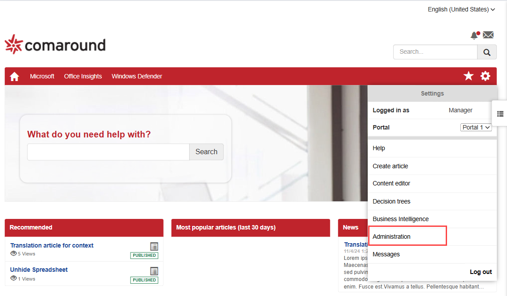
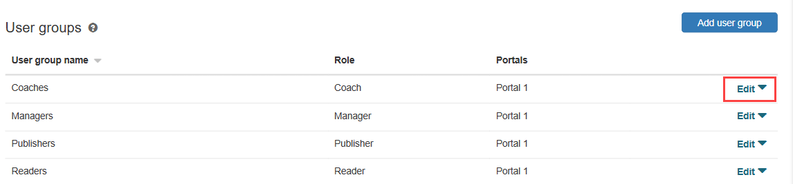
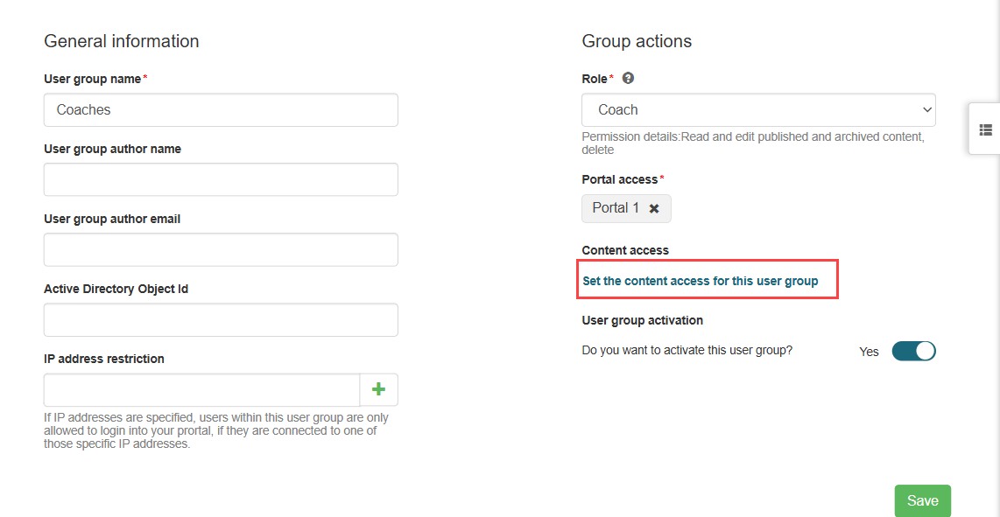
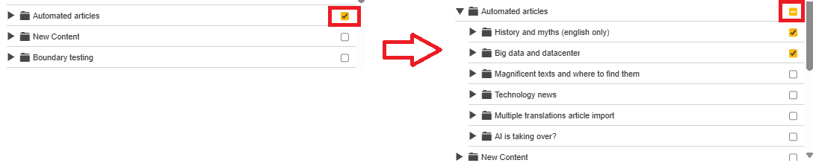

**Important**

The features and enhancements in this topic are available only to customers that have been migrated to the new content storage solution. For more information about the migration,[contact](https://docs.bmc.com/xwiki/bin/view/Service-Management/Employee-Digital-Workplace/BMC-Helix-Knowledge-Management-by-ComAround/hkm/Support-information/)Support.

A user group is a logical collection of users who share the same role and access permissions within a portal. As a knowledge worker with the Manager role, you can create and edit user groups, configure their access to content, and assign users to these groups. This capability enables you to control content visibility and user actions efficiently, without relying on support teams.

# User Groups, roles, and access models

​​​​​​User groups are logical containers that define both the role assigned to users and their access to specific folders and the content within them. Each user must belong to at least one group to access the portal.

A company can create up to 3000 user groups, and each user can be assigned to up to 256 groups. Each group defines the following configurations:

| Configuration | Description |
| --- | --- |
| Role | Determines what actions users can perform, what knowledge articles and which article states they can interact with; such as Draft, Published, or Archived. Learn more about user roles and their capabilities in[Product overview](https://docs.bmc.com/xwiki/bin/view/Service-Management/Employee-Digital-Workplace/BMC-Helix-Knowledge-Management-by-ComAround/hkm/Getting-started/Product-overview/). |
| Portal access | Specifies a portal or multiple portals that this user group can access.  |
| Content access | Specifies which folders and their contents the group can access. Access is granted or denied at the folder level:  * You can only grant access to folders and not individual articles within those folders. * Denying access to a folder automatically denies access to all its child items (subfolders and articles). * You can explicitly grant access to a subfolder even if access to its parent folder is denied. * When you grant access to a subfolder, access to its parent folder is granted. * For subscribed content, access can only be assigned or removed at the top-level folder. You cannot expand subscribed folders to view or manage their child folders. |

Users may belong to multiple groups simultaneously, and in such cases, the following conditions apply:

* Access to content is determined by combining the folder permissions from all assigned groups. If any group grants access to a folder, the user will be able to view it, even if other groups deny access.
* Role-based permissions are determined by the highest role assigned to a user across all groups. Roles have the following fixed hierarchy (from lowest to highest):  
  **Reader**(lowest)**→ Candidate → Contributor → Publisher → Coach → Manager**(highest)  
  The system uses this order to determine the highest applicable role. For example, if a user is part of one group with the Contributor role and another with the Manager role, they will be treated as a Manager for all content they can access. For more information about user roles, see[Product overview](https://docs.bmc.com/xwiki/bin/view/Service-Management/Employee-Digital-Workplace/BMC-Helix-Knowledge-Management-by-ComAround/hkm/Getting-started/Product-overview/).

# To create a user group

1. As a Manager, login to HKM.
2. Click**Settings**and select**Administration**.  
   
3. In the**User groups**section, click**Add user group.  
   **
4. Configure user group settings by specifying the following fields:

   | Field | Action |
   | --- | --- |
   | User group name | Enter a name for the user group. Best practice: We recommend providing names that clearly reflect the group’s purpose or role (for example,*Finance Read-Only*).  |
   | User group author name | *(Optional)*Enter a custom author name that will be displayed when users in this group create articles. This setting helps attribute content to a team or department rather than individuals. |
   | User group author email | *(Optional)*Enter a shared email address for this user group. This email will be displayed when users in this group create articles. |
   | Active Directory Object Id | *(Optional)*Enter an AD Object Id to link the group to an external Active Directory group. Users signing in via the Active Directory will be automatically assigned to this group based on the Object Id. **Important:**This setting is intended for customers who manage their user groups in Microsoft Entra ID (formerly Azure AD) and want to map them directly to corresponding groups in HKM. It's not intended for customers that use HKM as a knowledge provider for their applications.  |
   | IP address restriction | *(Optional)*Enter IP addresses to restrict access for group members. Users must connect from one of these IPs to access the portal. If no IPs are specified, access is allowed from any location. |
   | Role | Select the user role to define what actions users can perform and which article states they can interact with. For more information about user roles, see[Product overview](https://docs.bmc.com/xwiki/bin/view/Service-Management/Employee-Digital-Workplace/BMC-Helix-Knowledge-Management-by-ComAround/hkm/Getting-started/Product-overview/). |
   | Portal access | Select the required portal that this group can access. A group can be linked to one or multiple portals. |

   
5. Click**Save**.

A new user group is added. You can edit newly created user groups or groups that were previously created for you by .

**Important**  
After you create a new user group, assign the user named Activation User to it. This user must be assigned to all user groups. For more information about assigning users to groups, see[Add user (HKM)](https://zero.comaround.com/en-us/content/971335/#/).  
To ensure you're assigning the correct user, search by the name Activation User. If multiple results appear, check the**User name**field and proceed with the user whose user name follows this format:  
*activationuser\_<CustomerName(ProjectName)>\_ENV*; for example,*activationuser\_customer\_prod*.

See the user configuration UI with the standard Name and example User name of the Activation User

# To assign content access

You can configure content access only for saved user groups. To configure the content access, complete the following steps:

1. In HKM, click**Settings**and select**Administration**.
2. In the**User groups**section, click**Edit**next to the user group you want to configure.  
   
3. Under Group actions, click**Set the content access for this user group**.  
   
4. In the Content access window, define content access in the folder tree:
   * To grant access to a folder, select the checkbox next it.
   * To deny access to a folder, clear the checkbox next to it.  
     
   * To grant or deny access to a specific subfolder, expand its parent folder and select or clear the checkbox next to the required subfolder.

     **Important**  
     A checkbox next to a folder means access is granted, but it doesn’t reveal whether access is set at the folder level or only for specific subfolders. If access is granted to the folder itself, all its subfolders automatically inherit access. If access is granted only to certain subfolders, the checkbox still appears next to the parent folder. To understand exactly which subfolders are included, always expand the folder.  
     Learn more about access inheritance in the[User Groups, roles, and access model](https://docs.bmc.com/xwiki/bin/view/Service-Management/Employee-Digital-Workplace/BMC-Helix-Knowledge-Management-by-ComAround/hkm/Creating-user-groups-and-assigning-content-access/#concepts)section.  
     
5. Click**Save**.

   **Important**  
   Wait for the operation to complete. Monitor the Operation Status Message to confirm that access changes were successfully applied. Avoid making additional changes until the operation finishes, as unsaved updates may be lost.  
   
6. Confirm that the**User Group Activation**toggle is turned on.  

   **Warning**  
   If you turn this toggle off, the group will be deactivated. Deactivated groups are hidden from the list and require Support assistance to reactivate.  
   
7. Click**Save**.

**Important**  
Learn how to access this help article in[Accessing product documentation provided by help articles](https://docs.bmc.com/xwiki/bin/view/Service-Management/Employee-Digital-Workplace/BMC-Helix-Knowledge-Management-by-ComAround/hkm/Getting-started/Accessing-product-documentation-provided-by-help-articles/).

# Where to go from here

After configuring content access, assign the group to users. For instructions, see[Add user (HKM)](https://zero.comaround.com/en-us/content/971335/#/).