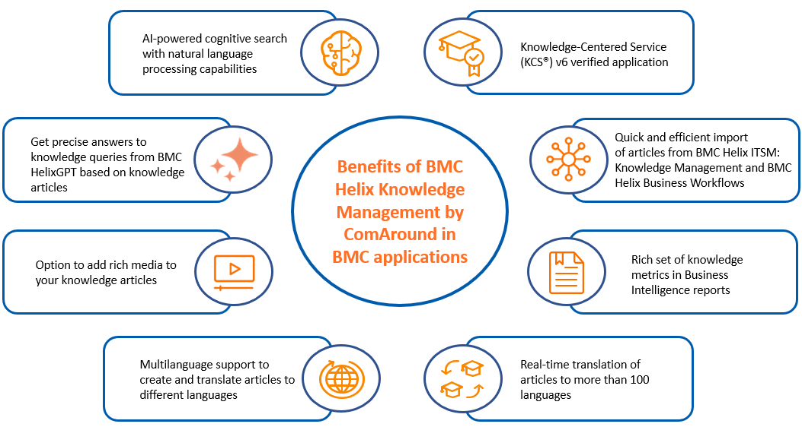

HKMcan be usedas a knowledge provider in the following applications:

* Virtual Agent
* DWP
* ITSM

* Business Workflows

**Important**

HKM is a SaaS solution, and you can use it as a knowledge provider in SaaS versions of the applications*only*. Also, you cannot use HKM as a knowledge provider forMid Tier.

Related topics

[Integrating with third-party applications by using the REST API](https://docs.bmc.com/xwiki/bin/view/Service-Management/Employee-Digital-Workplace/BMC-Helix-Knowledge-Management-by-ComAround/hkm/Integrating-with-third-party-applications-by-using-the-REST-API/)

[Leveraging knowledge articles as a data source for HelixGPT](https://docs.bmc.com/xwiki/bin/view/Service-Management/Employee-Digital-Workplace/BMC-Helix-Knowledge-Management-by-ComAround/hkm/Getting-started/Use-cases/Leveraging-knowledge-articles-as-a-data-source-for-BMC-HelixGPT/)

[Learning about KCS v6 verified HKM](https://docs.bmc.com/xwiki/bin/view/Service-Management/Employee-Digital-Workplace/BMC-Helix-Knowledge-Management-by-ComAround/hkm/Getting-started/Use-cases/Learning-about-KCS-v6-verified-BMC-Helix-Knowledge-Management-by-ComAround/)

WithHKM, applications boost their knowledge bases with the following capabilities:

## Scenario: UsingHKMinITSM

Scenario: Using with ITSM

Apex Global uses ITSM for handling user requests, incidents, and infrastructure-generated issues. The administrator wants to make sure that service desk agents can easily access solutions by referring to the knowledge base. To achieve this goal, the company has decided to implementHKMas the knowledge provider for ITSM. During this process, Apex Global transfers its existing knowledge articles fromITSM: Knowledge ManagementtoHKM, ensuring that all historical knowledge is retained. AfterHKMis configured and activated as the knowledge provider, service desk agents can efficiently locate, create, update, and manage knowledge articles to resolve incidents quickly and accurately.

## Workflow for configuringHKMas a knowledge provider

After subscribing to HKM, administrators configure it as the knowledge provider for a application. AISadministrator completes common configuration tasks inIS. Then, depending on a specific application, application administrators must enable HKM in the application or request , Inc. Support to enable it.

The following diagram illustrates how to set upHKMas a knowledge provider forITSM:

**Important**

The tasks to enableHKMas a knowledge provider differ for each application.

TheISadministrator must perform the following common configuration tasksinIS:

| Task  | Action  | Reference  |
| --- | --- | --- |
| 1  | *(Optional)*Mapcustom knowledge templates and fieldsfromITSM: Knowledge Managementor Business WorkflowsKnowledge ManagementtoHKM. **Important:**If you don't use customtemplates,you do*not*need to do the mapping because out-of-the-box knowledge templates and fields in your application are automatically mapped toHKM. However, if necessary, you can edit these out-of-the-box mappings too.  | [Mapping custom knowledge templates from applications to HKM](https://docs.bmc.com/xwiki/bin/view/Service-Management/Innovation-Suite/BMC-Helix-Innovation-Suite/is254/Enabling-services/Configuring-BMC-Helix-Knowledge-Management-by-ComAround-as-a-knowledge-provider/Mapping-custom-knowledge-templates-from-BMC-applications-to-BMC-Helix-Knowledge-Management-by-ComAround/)  |
| 2  | *(Optional)*Import the articles fromITSM: Knowledge Managementor Business WorkflowsKnowledge ManagementtoHKM.  | [Importing articles to HKM](https://docs.bmc.com/xwiki/bin/view/Service-Management/Innovation-Suite/BMC-Helix-Innovation-Suite/is254/Enabling-services/Configuring-BMC-Helix-Knowledge-Management-by-ComAround-as-a-knowledge-provider/Synchronizing-BMC-applications-with-BMC-Helix-Knowledge-Management-by-ComAround/)  |
| 3  | Map knowledge permissions from your application withHKMuser groups, roles, and portal to set knowledge access permissions inHKM.  | [Mapping knowledge permissions from applications to HKM](https://docs.bmc.com/xwiki/bin/view/Service-Management/Innovation-Suite/BMC-Helix-Innovation-Suite/is254/Enabling-services/Configuring-BMC-Helix-Knowledge-Management-by-ComAround-as-a-knowledge-provider/Mapping-knowledge-permissions-from-BMC-applications-to-BMC-Helix-Knowledge-Management-by-ComAround/) |

After theISadministratorcompletes the configuration tasks, application administrators must enableHKMin the application or request , Inc. Support to enable it:

| Action  | Role  | Reference  |
| --- | --- | --- |
| To useHKMas a knowledge provider in Virtual Agent  | Virtual Agent administrator  | [Leveraging knowledge from HKM](https://docs.bmc.com/xwiki/bin/view/Service-Management/Employee-Digital-Workplace/BMC-Helix-Virtual-Agent/hva254/Getting-started/Use-cases/Leveraging-knowledge-from-BMC-Helix-Knowledge-Management-by-ComAround/)  |
| To useHKMas a knowledge provider in DWP  | NA  | [Leveraging knowledge from HKM](https://docs.bmc.com/xwiki/bin/view/Service-Management/Employee-Digital-Workplace/BMC-Helix-Digital-Workplace/dwp254/Getting-started/Use-cases/Leveraging-knowledge-from-BMC-Helix-Knowledge-Management-by-ComAround/)  |
| To useHKMas a knowledge provider in ITSM  | NA  | [Leveraging knowledge from HKM](https://docs.bmc.com/xwiki/bin/view/Service-Management/IT-Service-Management/BMC-Helix-ITSM/itsm254/Getting-started/Use-cases/Leveraging-knowledge-from-BMC-Helix-Knowledge-Management-by-ComAround/)  |
| To useHKMas a knowledge provider in Business Workflows  | Business Workflows administrator  | [Selecting a knowledge base for Business Workflows](https://docs.bmc.com/xwiki/bin/view/Service-Management/Enterprise-Service-Management/BMC-Helix-Business-Workflows/bwf254/Administering/Defining-global-configurations/Selecting-a-knowledge-base-for-BMC-Helix-Business-Workflows/)  |

## Result

AfterHKMis configured as a knowledge provider for a application, end users can search for and access knowledge articles fromHKMwithin the application. For example,users can search for HKM articles directly within ITSM. They can also open HKM from ITSM to view, edit, and create articles.The following image shows how end users can open articles fromITSMand view them in HKM:

*(Controlled availability customers only)*Additionally, end users can preview and edit HKM knowledge articles directly within the ITSM interface.

The following image shows how end users can preview an article inthe preview pane within ITSM, rendered via an iframe:

For more information about using HKM as a knowledge provider for ITSM, see[Leveraging knowledge from HKM](https://docs.bmc.com/xwiki/bin/view/Service-Management/IT-Service-Management/BMC-Helix-ITSM/itsm254/Getting-started/Use-cases/Leveraging-knowledge-from-BMC-Helix-Knowledge-Management-by-ComAround/)in the ITSM documentation.