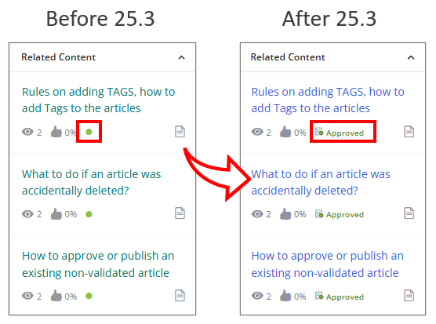

Review theHKM25.3 enhancements and patches for features that will benefit your organization and to understand changes that might impact your users.

| Version  | Updates and enhancement  |
| --- | --- |
| 25.3  | [Updates in 25.3](https://docs.bmc.com/xwiki/bin/view/Service-Management/Employee-Digital-Workplace/BMC-Helix-Knowledge-Management-by-ComAround/hkm/Release-notes-and-notices/25-3-enhancements-and-patches/#25.3)  |

Related topics

[Release-notes-and-notices](https://docs.bmc.com/xwiki/bin/view/Service-Management/Employee-Digital-Workplace/BMC-Helix-Knowledge-Management-by-ComAround/hkm/Release-notes-and-notices/)

[Deprecated and discontinued features](https://docs.bmc.com/xwiki/bin/view/Service-Management/Employee-Digital-Workplace/BMC-Helix-Knowledge-Management-by-ComAround/hkm/Release-notes-and-notices/Deprecated-and-discontinued-features/)

[Knowledge-Centered Service v6 training and certification](https://www.bmc.com/education/courses/find-courses.html#filter/%7B%22products%22%3A%22education-products-138131083%22%7D)

---

## *(Migrated customers only)*Create user groups and manage content access

**Important**  
This enhancement is available only to customers that have been migrated to the new content storage solution. For more information about the migration,[contact](https://docs.bmc.com/xwiki/bin/view/Service-Management/Employee-Digital-Workplace/BMC-Helix-Knowledge-Management-by-ComAround/hkm/Support-information/)Support.

Managers can independently create and manage user groups directly in HKM, enabling faster configuration of content access and user roles.

With this capability, managers can get the following key improvements:

* Accelerate access setup by removing dependency on support teams.
* Enhance governance by allowing direct control over content visibility and user roles.
* Reduce administrative overhead and streamline onboarding processes.

For more information, see[Creating user groups and assigning content access](https://docs.bmc.com/xwiki/bin/view/Service-Management/Employee-Digital-Workplace/BMC-Helix-Knowledge-Management-by-ComAround/hkm/Creating-user-groups-and-assigning-content-access/).

---

## What else changed after the migration

**Important**  
These enhancements are available only to customers that have been migrated to the new content storage solution. For more information about the migration,[contact](https://docs.bmc.com/xwiki/bin/view/Service-Management/Employee-Digital-Workplace/BMC-Helix-Knowledge-Management-by-ComAround/hkm/Support-information/)Support.

| Update  | Product behavior in the previous storage system  | Product behavior in theupgraded content storage solution  |
| --- | --- | --- |
| Independent statistics and associations for subscribed content  | Subscribed articles share statistics and associations with their original versions.  | Statistics and associations are tracked independently for subscribed articles, enabling clear insights into content engagement across portals.  |
| Standardized culture code format in API responses | Culture codes are returned with uppercase letters in the region part (for example, en-US). | Culture codes are now returned entirely in lowercase (for example, en-us, fr-fr), ensuring consistent formatting. |
| Removal of the*Copy*suffix in the titles of copied articles | Articles copied from another portal have the*Copy*suffix appended to their titles. | Copied articles retain the original title, improving consistency and reducing confusion. |
| Enforced limits on theTakeparameter in News and Recommended APIs | TheTakeparameter in/v1/recommended/{{takeValue}}and/v1/news/{{takeValue}}APIs can be set to any number, potentially returning large result sets. | TheTakeparameter must be set to a value between 1 and 15, ensuring predictable and controlled output from these APIs. |
| Changed the default folder for newly created content | New articles are automatically placed in the**New content**folder. | New articles are placed directly under the portal’s root folder unless a specific location is selected. |
| Removal of folder visibility in search results | Search results include folders alongside articles, making it possible to locate and navigate to folders directly from the search results. | Folders no longer appear in search results. Only articles (text, video, and links) are returned, aligning the behavior with other platforms and simplifying search output. |
| Increased limits for user groups and group membership | Only 64 user groups can be created per company, and each user can belong to a maximum of 64 groups. | Managers can create up to 3000 user groups, and each user can belong to up to 256 groups, enabling more scalable and granular access management. |

---

### 25.3

---

## Enhanced accessibility of the Knowledge vNext interface

The Knowledge vNext interface is enhanced with a wide range of updates to improve UI accessibility and provide an inclusive experience for all users. These changes are available in various areas, including the login page, menu, search results, article pages (Create, Edit, View), and the content editor. Knowledge workers can benefit from the following key improvements:

* Visual indicators, such as icons and descriptive text, are used alongside color, ensuring clarity for all users.
* Images provide alternative text to support screen readers and assistive technologies.
* Live regions are indicated to help assistive tools notify users of real-time content updates.
* Interactive functionality is operable via keyboard, allowing navigation without a mouse.
* Input fields are understandable and accessible without relying solely on placeholder text.

**Important**

Knowledge vNext interface is available when users open HKM from ITSM or Business Workflows.

The following image illustrates a UI enhancement that incorporates visual cues and text alongside color to represent the article state:

---

## New branding theme for the Knowledge vNext user interface

The Knowledge vNext interface features the new corporate branding that includes:

* An updated logo that reflects 's evolving identity.
* Refreshed color palette for a clean visual experience.

These updates enhance the user experience with a modern interface that improves visual clarity, usability, and consistency.

---

## *(Controlled availability customers only)*Preview and edit HKM knowledge articles directly within ITSM

Knowledge workers can preview and edit knowledge articles from HKM directly within the ITSM interface.

Knowledge workers can benefit from a seamless and consistent experience when viewing and editing knowledge articles from HKM. They don't need to navigate away from the ITSM application to preview or edit the knowledge articles from HKM, streamlining workflows and saving time.

​​​​​​Learn more about viewing and editing knowledge articles in[Leveraging knowledge from HKM](https://docs.bmc.com/xwiki/bin/view/Service-Management/IT-Service-Management/BMC-Helix-ITSM/itsm253/Getting-started/Use-cases/Leveraging-knowledge-from-BMC-Helix-Knowledge-Management-by-ComAround/).

---

## Use Knowledge Curator to create articles from ITSM incidents

Seamlessly create knowledge articles in HKM directly from ITSM incidents, at any stage of the incident lifecycle. Knowledge Curator uses the description, summary, resolution notes, and activity logs from the incident to generate KCS-aligned knowledge articles. The generated knowledge article is then pinned to the originating incident in ITSM.

This capability provides the following benefits:

* Create knowledge articles without leaving the ITSM interface.
* Transform incident details into structured knowledge.
* Instantly access the knowledge article pinned to the corresponding incident.

For more information, see[Configuring the Knowledge Curator agent for HKM](https://docs.bmc.com/xwiki/bin/view/Service-Management/Employee-Digital-Workplace/BMC-Helix-Knowledge-Management-by-ComAround/hkm/Configuring-the-Knowledge-Curator-agent-for-BMC-Helix-Knowledge-Management-by-ComAround/).

---

## What else changed in this release

| Update  | Product behavior in versions earlier than 25.3  | Product behavior in version 25.3  |
| --- | --- | --- |
| Experience an enhanced design of the Login page  | The Login page displayed the traditional design and branding theme.  | The Login page displays the enhanced design and refreshed branding theme. Additionally, the**Login with AzureID**button has been rebranded to**Login with Microsoft Entra ID**following Microsoft's renaming of Azure ID to Microsoft Entra ID.  |
| Follow tagging conventions that are more consistent with other applications | When adding tags to HKM articles, knowledge workers could include single (') and double (") quotation marks in article tags. | When adding tags to HKM articles, knowledge workers can no longer use single (') or double (") quotation marks. This update ensures tagging consistency across applications. |
| Experience enhanced knowledge articles generated by Knowledge Curator from the Business Workflows cases, driven by the improved prompt. | The prompt occasionally failed to effectively rephrase input from the cases, resulting in articles that closely resembled the original content from the cases. Additionally, it excluded code examples even when they were part of the input. | The**Generate**prompt for Knowledge Curator in Business Workflows has been improved to deliver more effective and compliant knowledge articles. This enhancement provides the following benefits:   * Improved removal of Personally Identifiable Information (PII) * Increased flexibility in rephrasing submitted text * Support for structured formatting, such as bullet points, numbered lists, embedded URLs, and inclusion of code examples in plain text.  For more information about the prompts, see[Configuring the Knowledge Curator agent for HKM](https://docs.bmc.com/xwiki/bin/view/Service-Management/Employee-Digital-Workplace/BMC-Helix-Knowledge-Management-by-ComAround/hkm/Configuring-the-Knowledge-Curator-agent-for-BMC-Helix-Knowledge-Management-by-ComAround/).  |
| Experience improved relevance in search results for knowledge articles. Create advanced filters with complex queries to help find more targeted and relevant knowledge articles.  | When users searched for knowledge articles, only basic filters with individual tags or simple AND/OR logic were supported. | To deliver more precise search results, administrators can create advanced filters by using the combined AND, OR, and NOT operators. These filters with complex queries help users find more targeted and relevant knowledge articles. For more information, see[Creating search filters for applications](https://docs.bmc.com/xwiki/bin/view/Service-Management/Innovation-Suite/BMC-Helix-Innovation-Suite/is253/Enabling-services/Configuring-BMC-Helix-Knowledge-Management-by-ComAround-as-a-knowledge-provider/Creating-search-filters-for-BMC-applications/).  |
| Observe seamless article-to-case association for knowledge articles created from Business Workflows cases. | When a knowledge article was created from a Business Workflows case using the Knowledge Curator agent, the article was not associated with the originating Business Workflows case. | When a knowledge article is created from a Business Workflows case using the Knowledge Curator agent, HKM automatically generates an associated article ID and pins it to the corresponding Business Workflows case. This enhances case context by linking the article directly to the originating case for easy reference. ​​​​For more information, see[Automatically generating knowledge articles](https://docs.bmc.com/xwiki/bin/view/Service-Management/Enterprise-Service-Management/BMC-Helix-Business-Workflows/bwf253/Managing-and-developing-knowledge-articles/Automatically-generating-knowledge-articles/).  |