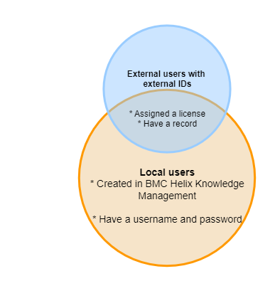

HKMis a subscription-based service that you can purchase individually or with Virtual Agent Basic and Advanced licenses. After you subscribe to the service, , Inc. activates your system.

HKMis a multi-tenant system and includes the following environments and integrations:

* Environments—Production
* Integrations (if required)—Microsoft Entra ID (formerly known as Azure Active Directory (Azure AD).

Related topics

[Integrating with third-party applications by using the REST API](https://docs.bmc.com/xwiki/bin/view/Service-Management/Employee-Digital-Workplace/BMC-Helix-Knowledge-Management-by-ComAround/hkm/Integrating-with-third-party-applications-by-using-the-REST-API/)

[User interface overview](https://docs.bmc.com/xwiki/bin/view/Service-Management/Employee-Digital-Workplace/BMC-Helix-Knowledge-Management-by-ComAround/hkm/Getting-started/User-interface-overview/)

[HKM service](https://docs.bmc.com/xwiki/bin/view/Helix-Common-Services/Other/BMC-Helix-Subscriber-Information/helixsubscriber/BMC-Helix-services/BMC-Helix-Knowledge-Management-by-ComAround-service/)in the Subscriber documentation.

## Setting up HKM

, Inc. provides you different types of setups based on your subscription:

* If you have the standalone subscription, learn about your entitlements in[HKM service](https://docs.bmc.com/xwiki/bin/view/Helix-Common-Services/Other/BMC-Helix-Subscriber-Information/helixsubscriber/BMC-Helix-services/BMC-Helix-Knowledge-Management-by-ComAround-service/).
* If you have theService Management Advanced license, learn about your entitlements in[Service Management service](https://docs.bmc.com/xwiki/bin/view/Helix-Common-Services/Other/BMC-Helix-Subscriber-Information/helixsubscriber/BMC-Helix-services/BMC-Helix-Service-Management-service/).
* If you have Virtual Agent Basic or Advancedsubscriptions, learn about your entitlements in[Virtual Agent Basic service](https://docs.bmc.com/xwiki/bin/view/Helix-Common-Services/Other/BMC-Helix-Subscriber-Information/helixsubscriber/BMC-Helix-services/BMC-Helix-Virtual-Agent-Basic-service/)and[Virtual Agent Advanced service](https://docs.bmc.com/xwiki/bin/view/Helix-Common-Services/Other/BMC-Helix-Subscriber-Information/helixsubscriber/BMC-Helix-services/BMC-Helix-Virtual-Agent-Advanced-service/).

Before you make HKM available to the users in your company, you can modify the following portal configurations:

| Task  | Reference  |
| --- | --- |
| Edit organization details  | * [Edit organization details (HKM)](https://zero.comaround.com/en-us/content/971326/?ctxt=search#/)  |
| Modify portal settings  | * [Portal Settings - Settings (HKM)](https://zero.comaround.com/en-us/content/971323/?ctxt=search#/)  |
| Select portal languages  | * [Portal Settings - Settings (HKM)](https://zero.comaround.com/en-us/content/971323/?ctxt=search#/)  * [Portal language (HKM)](https://zero.comaround.com/en-us/content/820231/?ctxt=search#/)  |
| Modify interface settings and branding  | * [Portal Settings - Platform Specific Settings (HKM)](https://zero.comaround.com/en-us/content/1288802/#/) * [Change theme colors in the portal (HKM)](https://zero.comaround.com/en-us/content/760722/?ctxt=search#/)  * [Edit the navigation bar (HKM)](https://zero.comaround.com/en-us/content/617187/#/)  |
| Edit user groups  | * [User groups in administration tool (HKM)](https://zero.comaround.com/en-us/content/970339/?ctxt=search#/)  |
| Create user groups and manage content access | * *(Migrated customers only)*[Creating user groups and assigning content access](https://docs.bmc.com/xwiki/bin/view/Service-Management/Employee-Digital-Workplace/BMC-Helix-Knowledge-Management-by-ComAround/hkm/Creating-user-groups-and-assigning-content-access/) |
| Add users  | * [Add user (HKM)](https://zero.comaround.com/en-us/content/971335/?ctxt=search#/)  |
| Set alarms  | * [Alarms (HKM)](https://zero.comaround.com/en-us/content/1004617/?ctxt=search#/)  |

**Important**

To access these help articles, you must first subscribe, and then log in toHKM.

## Types of users

HKMcan have internal and external users as described in the following image:

