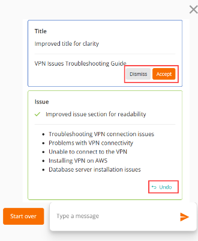
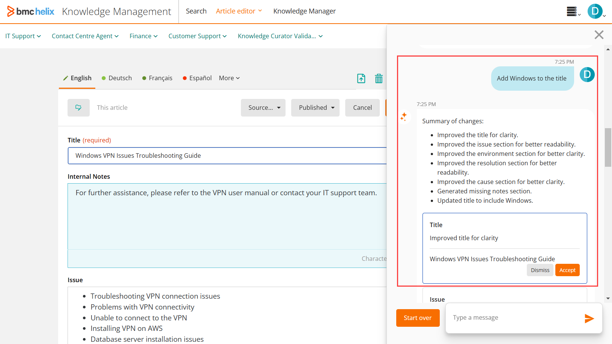
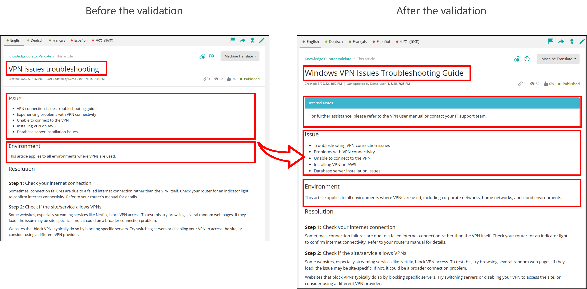

After the administrator has[configured](https://docs.bmc.com/xwiki/bin/view/Service-Management/Employee-Digital-Workplace/BMC-Helix-Knowledge-Management-by-ComAround/hkm/Configuring-the-Knowledge-Curator-agent-for-BMC-Helix-Knowledge-Management-by-ComAround/)the Knowledge Curator agent, knowledge workers can start using it to validate knowledge articles in HKM.

Knowledge workers can benefit from the validation capabilities of the Knowledge Curator agent in several ways:

* Ensure consistent article quality across the entire knowledge base.
* More readily adopt and implement KCS methodologies because suggestions from the Knowledge Curator agent are rooted in KCS principles.
* Save time and effort when updating the articles as the Knowledge Curator agent simplifies the review process and reduces manual tasks.

**Important**

The validate capability is available for , Inc. customers that use HKM as a knowledge provider for ITSM and Business Workflows.

Related topics

[KCS v6 Practices Guide](https://library.serviceinnovation.org/KCS/KCS_v6/KCS_v6_Practices_Guide)

[AI Agents in HelixGPT](https://docs.bmc.com/xwiki/bin/view/Service-Management/Employee-Digital-Workplace/BMC-HelixGPT/helixgpt254/AI-agents-in-BMC-HelixGPT/)

## Validation capabilities of the Knowledge Curator agent

Knowledge Curator is a HelixGPT-powered agent that uses generative AI capabilities to validate knowledge articles. It utilizes prompt instructions to review articles for quality and recommend improvements. The default prompt instructs the Knowledge Curator agent to use the Knowledge-Centered Service (KCS) principles for validating the articles and suggesting the rewrites. For more information about the KCS principles, see[Learning about KCS v6 verified HKM](https://docs.bmc.com/xwiki/bin/view/Service-Management/Employee-Digital-Workplace/BMC-Helix-Knowledge-Management-by-ComAround/hkm/Getting-started/Use-cases/Learning-about-KCS-v6-verified-BMC-Helix-Knowledge-Management-by-ComAround/).

**Best practice**  
Your organization might decide to use custom prompt instructions for the Knowledge Curator agent. However, recommends adhering to the default prompt text to ensure consistent and reliable generative AI performance. These default instructions have undergone thorough pre-testing withinHKM.

Scenario

Apex Global uses ITSM for handling user requests, incidents, and infrastructure-generated issues and has its knowledge articles inHKM.

Service desk agents use knowledge articles to resolve incidents quickly and accurately. Sometimes, while resolving incidents, service desk agents notice that certain articles are not clear or don't adhere to the KCS principles followed by Apex Global. As knowledge workers, these service desk agents navigate to HKM. They then use the Knowledge Curator  
capabilities to review and enhance knowledge articles by accepting suggestions from the agent.

In addition to validating articles, Knowledge Curator can be used to generate knowledge articles from Business Workflows cases and from ITSM incidents. Learn how to configure these capabilities in[Configuring the Knowledge Curator agent for HKM](https://docs.bmc.com/xwiki/bin/view/Service-Management/Employee-Digital-Workplace/BMC-Helix-Knowledge-Management-by-ComAround/hkm/Configuring-the-Knowledge-Curator-agent-for-BMC-Helix-Knowledge-Management-by-ComAround/).

## Before you begin

Make sure that you have the following licenses and permissions:

* [Service Management Advanced license](https://docs.bmc.com/xwiki/bin/view/Helix-Common-Services/Other/BMC-Helix-Subscriber-Information/helixsubscriber/BMC-Helix-services/BMC-Helix-Service-Management-service/)
* Knowledge worker roles inHKMthat enable you to create and edit articles.  
  For example, Knowledge candidate is the basic knowledge worker role that has editing access to knowledge articles, specifically those that are in progress or in draft. Higher-level roles have access to articles in additional states. For more information about different user roles, see[User roles](https://docs.bmc.com/xwiki/bin/view/Service-Management/Employee-Digital-Workplace/BMC-Helix-Knowledge-Management-by-ComAround/hkm/Getting-started/Product-overview/#roles).

## To validate articles

1. As a knowledge worker, open HKM from a knowledge article in ITSM or Business Workflows.
   1. To open HKM from ITSM, search for an article that you want to validate in ITSM, and click the article link from the search results.  
      ITSMopens the article in the HKM on a new browser tab.
   2. To open HKMfrom Business Workflows, search for an article that you want to validate in Business Workflows, and click the**Go to Article**button from the article preview.  
      Business Workflowsopens the article in the HKM on a new browser tab.
2. Open this article in the Edit mode.  
   After you open HKM from ITSM or Business Workflows, you can also search for knowledge articles that you want to validate directly from HKM.

   **Important**

   **Important:**If you create a new article, you must first save it. The Knowledge Curator agent cannot be launched in an unsaved article. Also, the Knowledge Curator can't be launched in the View mode.
3. In the article edit mode, click the**Ask Helix GPT**button.  
   The HelixGPT pane opens and displays insights on whether this article has been validated.
4. To start the validation process, click**Yes, please validate**.  
   The Knowledge Curator agent returns the improvement suggestions for individual topic sections as well as suggests additional tags for the article. These suggestions are displayed as tiles.
5. Click a specific suggestion tile to view the changes in the corresponding topic section.  
   You can now review the rewrites in the actual article section.

   **Important**

   If you move to another suggestion tile without accepting the rewrites, the suggested changes are deleted from the corresponding topic section.
6. Accept or dismiss the improvement suggestions.

   **Best practice**  
   The Knowledge Curator agent reviews the articles to ensure they meet high-quality standards; however, it cannot verify the accuracy or relevance of the validated content from a technical perspective. Therefore, we recommend thoroughly reviewing the suggested improvements before accepting them.

   1. If you're satisfied with the rewrites, click**Accept**.
   2. If you don't want to implement the changes, click**Dismiss**.
   3. After you click**Dismiss**, suggested rewrites are deleted from the corresponding topic section.
   4. If you want to revert the change after accepting it, click**Undo**.  
      
7. Repeat steps 5 and 6 for each improvement suggestion that you want to implement.  
   You can't accept all or multiple changes at once.
8. If you want additional changes to be made to the article, you can use natural language to instruct the Knowledge Curator agent to add them.  
   For example, you can instruct the Knowledge Curator agent to*Add Windows to the title*.  
   
9. Save the article.

Warning

The Knowledge Curator agent doesn't automatically save the changes made to the article. If you exit the Edit mode without saving the article first, all the changes will be lost.

The Knowledge Curator agent can validate only one language at a time. If the article is available in multiple languages and you want to validate different translations, you must switch to the tab for each language and repeat the validation process separately for each translation.However, to apply the same changes to a title across multiple languages, you can instruct the Knowledge Curator agent to update the title in all languages. For example, the product name needs to be updated in the title in multiple languages.

## Results

After you accept the improvement suggestions and save the article, the updates will be added to it.

## FAQ

The Knowledge Curator agent replies as text without any actionable suggestions. What should I do?

Click the<strong>Start over</strong>button to clear your conversation with the Knowledge Curator agent. You can restart the validation process or repeat your instructions.

<strong>Important:</strong>
<ul><li>After you click the<strong>Start over</strong>button, the accepted suggestions will still apply.</li><li>You might get different improvement suggestions when you rerun the validation.</li></ul>

The Knowledge Curator agent doesn't provide suggestions for specific template sections. What should I do?

Click the<strong>Start over</strong>button to clear your conversation with the Knowledge Curator agent and restart the validation process.

Alternatively, you can explicitly instruct the Knowledge Curator agent to validate information in a specific template section.

<strong>Important:</strong>
<ul><li>After you click the<strong>Start over</strong>button, the accepted suggestions will still apply.</li><li>You might get different improvement suggestions when you rerun the validation.</li></ul>

Can I use Knowledge Curator to find answers or guidance from knowledge articles in external data sources?

Knowledge Curator doesn’t support finding answers or guidance based on knowledge articles from external sources, such as Confluence.

​​​​​