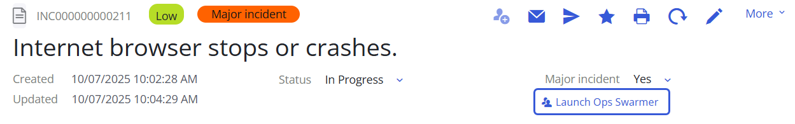
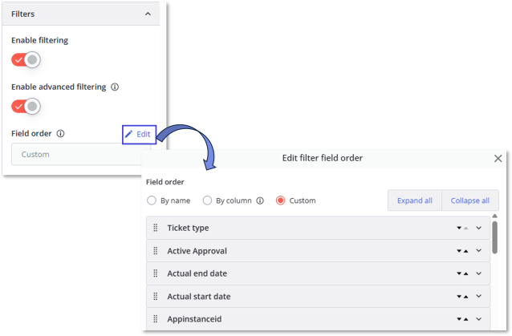
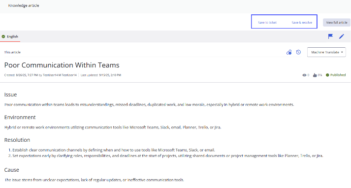
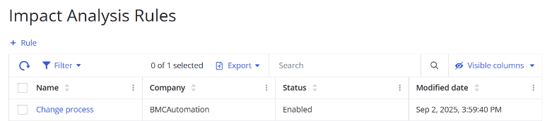
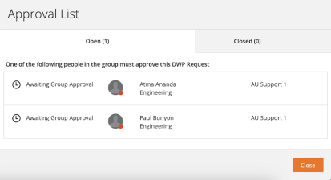
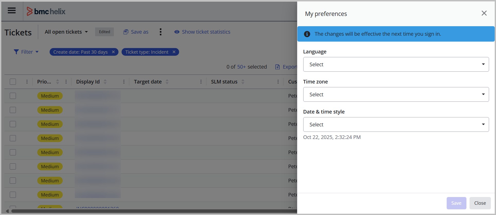
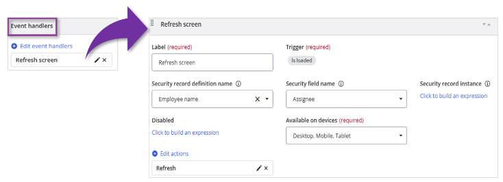
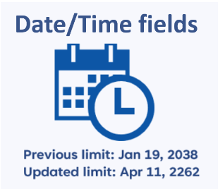
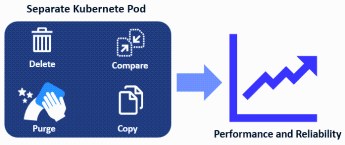
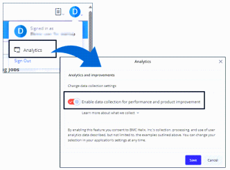

Review the ITSM 25.4 enhancements for features that will benefit your organization and to understand changes that might impact your users.

| Version | SaaS | On premises | Fixed issues | Updates |
| --- | --- | --- | --- | --- |
| 25.4.01 | ✅️ | ✅️ | [Known and corrected issues](https://docs.bmc.com/xwiki/bin/view/Service-Management/IT-Service-Management/BMC-Helix-ITSM/itsm254/Release-notes-and-notices/Known-and-corrected-issues/) | applies upgrades as described in the[Upgrade policy](https://docs.bmc.com/xwiki/bin/view/Helix-Common-Services/Other/BMC-Helix-Subscriber-Information/helixsubscriber/Policies/BMC-Helix-Upgrade-policy/). applies upgrades and patches during[Maintenance windows](https://docs.bmc.com/xwiki/bin/view/Helix-Common-Services/Other/BMC-Helix-Subscriber-Information/helixsubscriber/Operations/Maintenance-windows/). |
| 25.4.00 | ✅️ |  | [Known and corrected issues](https://docs.bmc.com/xwiki/bin/view/Service-Management/IT-Service-Management/BMC-Helix-ITSM/itsm254/Release-notes-and-notices/Known-and-corrected-issues/) | applies upgrades as described in the[Upgrade policy](https://docs.bmc.com/xwiki/bin/view/Helix-Common-Services/Other/BMC-Helix-Subscriber-Information/helixsubscriber/Policies/BMC-Helix-Upgrade-policy/). applies upgrades and patches during[Maintenance windows](https://docs.bmc.com/xwiki/bin/view/Helix-Common-Services/Other/BMC-Helix-Subscriber-Information/helixsubscriber/Operations/Maintenance-windows/). |

---

## 25.4.01

There are no new features are enhancements in this release.

## 25.4.00

## ITSM enhancements

### Get improved answers in Ask HelixGPT by using the agentic approach

Ask HelixGPT is now powered by the agentic AI capabilities from HelixGPT, and delivers more accurate and context-aware responses to queries. The agentic approach uses historical ticket data and provides answers based on knowledge articles and conversational understanding, handling a wider range of queries.

In this release, you can continue using the Retrieval Augmented Generation (RAG) approach or opt for the agentic approach when using Ask HelixGPT.

Learn how to configure and use the ITSM agent for Ask HelixGPT in[Configuring Ask HelixGPT for ITSM](https://docs.bmc.com/xwiki/bin/view/Service-Management/IT-Service-Management/BMC-Helix-ITSM/itsm254/Setting-up-and-going-live/Configuring-settings-to-use-Agentic-AI-capabilities/Configuring-Ask-HelixGPT-for-BMC-Helix-ITSM/). Learn how to use Ask HelixGPT in incidents in[Resolving incidents with the help of Ask HelixGPT](https://docs.bmc.com/xwiki/bin/view/Service-Management/IT-Service-Management/BMC-Helix-ITSM-Service-Desk/servicedesk254/Managing-incident-requests/Resolving-incident-requests/Resolving-tickets-with-the-help-of-Ask-HelixGPT/).

### Search for work orders, assets, and problem investigations by using the Agentic chat

Use Agentic chat to search not just incidents and knowledge articles, but also work orders, assets, and problem investigations by using natural language queries. It retrieves and displays the relevant details, including relationships among assets, work orders, and problems, with in-line links for easy access. You can also filter search results based on multi-form search category names.

Learn how to configure Agentic chat in[Enabling Agentic chat for ITSM](https://docs.bmc.com/xwiki/bin/view/Service-Management/IT-Service-Management/BMC-Helix-ITSM/itsm254/Setting-up-and-going-live/Configuring-settings-to-use-Agentic-AI-capabilities/Enabling-Agentic-chat-for-BMC-Helix-ITSM/). Learn how to search by using Agentic chat in[Searching for information by using Agentic chat](https://docs.bmc.com/xwiki/bin/view/Service-Management/IT-Service-Management/BMC-Helix-ITSM/itsm254/Navigating-common-interfaces/Searching-for-information-by-using-BMC-HelixGPT-chat/).

### Request access to the Microsoft Teams chat and get updated incident details by using the Ops Swarmer agent

Start a Microsoft Teams group chat, add members, or request to join the chat from ITSM by using the Ops Swarmer agent.

When users with write permission to an incident start an Ops Swarmer chat, the incident assignee, major incident manager, and communication coordinator users are automatically added to the chat. Users with edit permission to the incident, and who are not part of the chat, can request access to the chat, which the existing chat members can approve.

The new capabilities of starting an Ops Swarmer chat, requesting access to the chat, and approving access requests help in faster collaboration to resolve incidents.

Learn how to configure ITSM to use the Ops Swarmer agent in[Enabling the Ops Swarmer chat capabilities](https://docs.bmc.com/xwiki/bin/view/Service-Management/IT-Service-Management/BMC-Helix-ITSM/itsm254/Setting-up-and-going-live/Configuring-settings-to-use-Agentic-AI-capabilities/Enabling-the-Ops-Swarmer-chat-capabilities/). Learn how to start a Microsoft Teams chat, add new members, and request access in[Launching Ops Swarmer for collaboration](https://docs.bmc.com/xwiki/bin/view/Service-Management/IT-Service-Management/BMC-Helix-ITSM-Service-Desk/servicedesk254/Managing-incident-requests/Viewing-and-updating-incident-requests/Launching-ChatOps-for-collaboration/).

### *(Controlled availability customers only)*Localize CMDB and Foundation data to enhance user experience

Localize CMDB and Foundation data in the supported languages, and make it available for use in the service management applications that use the Foundation data, such as ITSM: Change Management.

Users can view and use the CMDB and Foundation data in their user-preferred locale. For example, while composing an email message in PWA, you can select the data in your preferred language in the email message.

Learn about the supported languages in[Supported languages and locales](https://docs.bmc.com/xwiki/bin/view/Service-Management/IT-Service-Management/BMC-Helix-ITSM/itsm254/Planning/Supported-languages-and-locales/). Learn how to localize the Foundation and CMDB data in[Localizing foundation data into the supported languages](https://docs.bmc.com/xwiki/bin/view/Service-Management/IT-Service-Management/BMC-Helix-ITSM/itsm254/Administering/Localizing-foundation-data-into-the-supported-languages/)

### Prioritize frequently used filter options for quick access

Customize the display order of fields in the filters on the record grid of Shared Ticket Console. Sort filter columns in an ascending or a custom order using the drag-and-drop interface. This capability provides easy access to frequently-used filters, reducing search time.

Learn how to customize the field order at[Customizing Shared Ticket Console](https://docs.bmc.com/xwiki/bin/view/Service-Management/IT-Service-Management/BMC-Helix-ITSM/itsm254/Administering/Enabling-and-customizing-Shared-Ticket-Console/Customizing-Shared-Ticket-Console/).

### *(Controlled availability customers only)*Link and resolve HKM knowledge articles in ITSM

Associate knowledge articles with tickets by pinning the most relevant articles to a ticket for future reference. You can also associate articles and resolve an incident simultaneously, saving time and reducing the steps to resolve incidents.

Learn how to enable HKM for ITSM in[Leveraging knowledge from HKM](https://docs.bmc.com/xwiki/bin/view/Service-Management/IT-Service-Management/BMC-Helix-ITSM/itsm254/Getting-started/Use-cases/Leveraging-knowledge-from-BMC-Helix-Knowledge-Management-by-ComAround/). Learn how to manage the articles from incidents in[Handling tickets dynamically with Smart Recorder](https://docs.bmc.com/xwiki/bin/view/Service-Management/IT-Service-Management/BMC-Helix-ITSM-Service-Desk/servicedesk254/Managing-incident-requests/Registering-incident-requests/Handling-tickets-dynamically-with-Smart-Recorder/).

### *(Controlled availability customers only)*Use the Data Monitor console to create data monitoring rules for identifying missing or invalid CI details

Create data monitoring rules in the new Data Monitor console to find inconsistent or incomplete configuration items (CIs) in your asset database. Running the data monitoring rules on a regular schedule ensures that your database remains accurate and healthy.

The generative AI capabilities of HelixGPT can also be leveraged to get insights into the data monitoring rules. When enabled, HelixGPT can analyze the inconsistent or incomplete CIs, and provide suggestions to resolve them.

Learn how to configure and run the monitoring rules in[Configuring Data monitoring rules to detect incomplete or inconsistent CI details](https://docs.bmc.com/xwiki/bin/view/Service-Management/IT-Service-Management/BMC-Helix-ITSM-Asset-Management/asset254/Administering/Managing-data-monitoring-rules-to-detect-incomplete-and-inconsistent-CI-details/).

### Predict incident-related service disruptions for faster resolution

Leverage artificial intelligence to predict the services that are likely to be disrupted by incoming incidents. You can then use this information to identify the relevant support team that can work on such incidents for faster resolution, lowering the turnaround time of overall incident management in your organization.

Learn more about the service prediction capability in[Leveraging intelligent service prediction in incidents with the model](https://docs.bmc.com/xwiki/bin/view/Service-Management/IT-Service-Management/BMC-Helix-ITSM-Service-Desk/servicedesk254/Getting-started/Use-cases/Intelligent-service-prediction-in-incidents-with-BMC-Helix-classifier/).  
Learn more about its configuration in[Configuring intelligent service prediction in incidents with classifier](https://docs.bmc.com/xwiki/bin/view/Service-Management/IT-Service-Management/BMC-Helix-ITSM-Service-Desk/servicedesk254/Administering/Setting-up-incident-management/Configuring-intelligent-service-prediction-in-incidents-with-BMC-Helix-classifier/).

### Rule-based automatic impact analysis of change requests

You can now create automation rules to run impact analysis on change requests and associate configuration items (CIs). This enhancement eliminates the need for running the impact analysis manually, saving time and streamlining operations.

Learn more about the capability and its configuration in[Configuring rules for automated impact analysis of change requests](https://docs.bmc.com/xwiki/bin/view/Service-Management/IT-Service-Management/BMC-Helix-ITSM-Change-Management/change254/Administering/Configuring-rules-for-automatic-impact-analysis-of-change-requests/).

### Accelerate incident resolution with automated CI and situation insights from AIOps

For incidents created from AIOps, causal configuration items (CIs) and situational insights are displayed on the incident details page. These insights update automatically as the situation evolves, reducing manual effort and improving response time, data accuracy, and operational efficiency. You can also navigate to AIOps from the incident to view more details about the situation.

Learn more about the capability in[Information displayed on a ticket](https://docs.bmc.com/xwiki/bin/view/Service-Management/IT-Service-Management/BMC-Helix-ITSM-Service-Desk/servicedesk254/Managing-incident-requests/Viewing-and-updating-incident-requests/Information-displayed-on-a-ticket/).

### Track approval details for service requests in ITSM managed through DWP

As a service desk agent using ITSM, view the approvers and the reason for approval or rejection of service requests managed in DWP. By using this capability, you can view the approval details in a single interface without moving away from ITSM, which saves your time and effort for other critical tasks.

Learn more in[Submitting service requests for customers](https://docs.bmc.com/xwiki/bin/view/Service-Management/IT-Service-Management/BMC-Service-Request-Management/srm254/Managing-service-requests/Submitting-service-requests-for-customers/).

### Apply complex expressions in Shared Ticket Console to analyze data

Use advanced filtering on a record grid to apply complex expressions at runtime. Advanced filtering helps you analyze large datasets and locate the most relevant information.

When you install or upgrade to the 25.4.00 version, advanced filtering is enabled and available by default. If you customized your views in the earlier versions and want to use advanced filtering after you upgrade, you must manually enable advanced filtering. Learn more in[Enabling advanced filters in Asset Console and Shared Ticket Console](https://docs.bmc.com/xwiki/bin/view/Service-Management/IT-Service-Management/BMC-Helix-ITSM/itsm254/Administering/Reconciling-customized-views-after-the-upgrade/Enabling-advanced-filters-in-the-Shared-Ticket-Console-and-Asset-Console/).

Learn more about configuring the advanced filters in[Customizing Shared Ticket Console](https://docs.bmc.com/xwiki/bin/view/Service-Management/IT-Service-Management/BMC-Helix-ITSM/itsm254/Administering/Enabling-and-customizing-Shared-Ticket-Console/Customizing-Shared-Ticket-Console/)and using them in[Managing your work by using Ticket Console](https://docs.bmc.com/xwiki/bin/view/Service-Management/IT-Service-Management/BMC-Helix-ITSM/itsm254/Navigating-common-interfaces/Managing-your-work-by-using-Ticket-Console/).

### *(Controlled availability customers only)*Set locale, time zone, and date formats from your user profile

Set your preferred locale, time zone, and date format preferences from your user profile in ITSM instead of from the AR System server form. With these enhancements, you can change the locale, time, and date formats without navigating away from the ITSM user interface (UI).  

Learn how to set preferences in[Date, time, and time zone display](https://docs.bmc.com/xwiki/bin/view/Service-Management/IT-Service-Management/BMC-Helix-ITSM/itsm254/Navigating-common-interfaces/Date-time-and-time-zone-display/)in ITSM. Learn about the supported languages in[Supported languages and locales.](https://docs.bmc.com/xwiki/bin/view/Service-Management/IT-Service-Management/BMC-Helix-ITSM/itsm254/Planning/Supported-languages-and-locales/)

### What else has changed in this release

| Update | Product behavior in versions earlier than 25.4.00 | Product behavior in version 25.4.00 |
| --- | --- | --- |
| The rule-based email engine does not create duplicate incidents from the same email thread. Relevant details from the email thread are added as activity notes to the original incident.  | Every email in the thread created duplicate incidents, and the content from the individual emails was rejected. Details of subsequent emails were not added to the activity notes.  | If an incident is already created from a user's email, the Rule-based email engine prevents creating duplicate incidents from subsequent emails sent in the same thread. Relevant information is also extracted from the subsequent emails and added to the original incident's activity notes. For more details, see[Creating and updating records by using email](https://docs.bmc.com/xwiki/wiki/internal/view/Service-Management/IT-Service-Management/sdMaster2/Managing-incident-requests/Registering-incident-requests/Creating-and-updating-records-by-using-email/#multiple).  |
| ITSM supports the Arabic language. | The Arabic language was not supported. | Users can view all modules in ITSM in the Arabic language. Learn about the supported languages in[Supported languages and locales](https://docs.bmc.com/xwiki/bin/view/Service-Management/IT-Service-Management/BMC-Helix-ITSM/itsm254/Planning/Supported-languages-and-locales/).  |
| Date beyond 01/19/2038 is supported in ITSM. | Any date and time later than January 19, 2038, 03:14:08 AM was not stored in the date and time field. | Users can now enter dates and time beyond January 19, 2038, 03:14:08 AM.  |
| Standardized time stamp format for logs. | Logs were created with a time stamp based on different time zones as set in the user preferences.  | Users can view logs in a standardized time stamp format, ensuring consistency across different time zones. Learn more about the logs in[Configuring logs](https://docs.bmc.com/xwiki/bin/view/Service-Management/IT-Service-Management/BMC-Helix-ITSM/itsm254/Troubleshooting/Enabling-and-analyzing-logs/Configuring-logs/).  |
| Update assets to the In Inventory status in bulk. | You could update a single asset to the**In Inventory**status. | You can update multiple assets to the**In Inventory**status at the same time. Learn more in[Performing bulk updates](https://docs.bmc.com/xwiki/wiki/internal/view/Service-Management/IT-Service-Management/assetMaster2/Managing-assets-and-CIs/Performing-bulk-updates/).  |
| View the service models with CIs in Asset Console. | In Asset Console, while viewing assets, you could view only Business Service models, even when CIs were associated with other service types, such as Business Applications or Technical Services. | In Asset Console, you can view CIs listed under their respective service models, Business Services, Business Applications, or Technical Services. Learn more in[Exploring asset relationships](https://docs.bmc.com/xwiki/wiki/internal/view/Service-Management/IT-Service-Management/assetMaster2/Managing-assets-and-CIs/Exploring-asset-relationships/).  |
| Branding for applications | applications used an older color theme for icons, buttons, links, and UI pages. | The core brand colors have been updated to create a more modern and accessible palette. The new branding includes an updated color theme, icons, and buttons for a consistent look across all applications. Learn more about the updated color theme at[Customizing the look and feel of ITSM applications](https://docs.bmc.com/xwiki/bin/view/Service-Management/IT-Service-Management/BMC-Helix-ITSM/itsm254/Administering/Enabling-Advanced-Responsive-Navigation/Customizing-the-ITSM-navigation-bar/).  |

## IS 25.4.00 enhancements

25.4 enhancements and patches

## 25.4.01 updates

## Use updated support for technology stack

Service Management supports the following technology stacks:

* Kubernetes version 1.34
* OpenShift version 4.19
* Nginx Ingress Controller version 1.13.x and1.14.0
* Helm 3.19

For more information, see[System requirements](https://docs.bmc.com/xwiki/bin/view/Service-Management/On-Premises-Deployment/BMC-Helix-Service-Management-Deployment/brid25401/Planning/System-requirements/).

## Enable realm identification by using patterns

Enable realm identification by using patterns to control user access based on the user name pattern and IP range pattern. This capability ensures that only approved users can log in to Service Management applications.

For more information, see[Setting up the installation environment](https://docs.bmc.com/xwiki/bin/view/Service-Management/On-Premises-Deployment/BMC-Helix-Service-Management-Deployment/brid25401/Installing/Preparing-for-installation/Setting-up-the-installation-environment/).

## Remove obsolete container images

Remove obsolete Service Management container images in your Harbor registry to optimize storage and ensure security by retaining only approved images.

For more information, see[Setting up a Harbor repository to synchronize container images](https://docs.bmc.com/xwiki/bin/view/Service-Management/On-Premises-Deployment/BMC-Helix-Service-Management-Deployment/brid25401/Installing/Preparing-for-installation/Setting-up-a-Harbor-repository-to-synchronize-container-images/).

## Enable multiple domain authentication with Single Sign-On for seamless authentication

Enable seamless authentication between Service Management applications and the Platform hosted on different domains by using the**ENABLE\_RSSO\_MULTI\_DOMAIN**parameter in the**HELIX\_ONPREM\_DEPLOYMENT**pipeline.

For more information, see[Performing the Service Management installation](https://docs.bmc.com/xwiki/bin/view/Service-Management/On-Premises-Deployment/BMC-Helix-Service-Management-Deployment/brid25401/Installing/Performing-the-BMC-Helix-Service-Management-installation/).

## Deploy infrastructure services required for CORE mode automatically

The Platform Common Services deployment manager configures the necessary infrastructure services required for Service Management CORE mode automatically when you set the**SM\_PLATFORM\_CORE**parameter in the**deployment.config**file. This automation efficiently streamlines setup and optimizes resource sizing based on deployment requirements.

For more information, see[Installing Platform Common services 25.4.00](https://docs.bmc.com/xwiki/bin/view/Service-Management/On-Premises-Deployment/BMC-Helix-Service-Management-Deployment/brid25401/Installing/Preparing-for-installation/Installing-BMC-Helix-Platform-Common-services-25-4-00/).

## What else changed in this release

The following table lists the changes in the product behavior in this release:

| Update  | Product behavior in versions earlier than 25.4.01  | Product behavior in version 25.4.01  |
| --- | --- | --- |
| Change in the security certificate configuration process | To use a security certificate, you create the cacerts files in a specific format provided by and then provide this file as the**CACERTS\_FILE**parameter value in the**HELIX\_ONPREM\_DEPLOYMENT**pipeline.  | You can directly provide a single certificate file or a ZIP file containing multiple certificates as the**CUSTOM\_CERTIFICATE**parameter value in the**HELIX\_ONPREM\_DEPLOYMENT**pipeline. The**CACERTS\_FILE**parameter in the**HELIX\_ONPREM\_DEPLOYMENT**pipeline is renamed to**CUSTOM\_CERTIFICATE**. For more information, see[Performing the Service Management installation](https://docs.bmc.com/xwiki/bin/view/Service-Management/On-Premises-Deployment/BMC-Helix-Service-Management-Deployment/brid25401/Installing/Performing-the-BMC-Helix-Service-Management-installation/).  |
| Parameters added in the**HELIX\_ONPREM\_DEPLOYMENT**pipeline | The**HELIX\_ONPREM\_DEPLOYMENT**pipeline do not include the following parameters:   * **ENABLE\_RSSO\_MULTI\_DOMAIN** * **HELIX\_DSO** | The**HELIX\_ONPREM\_DEPLOYMENT**pipeline includes the following parameters: **ENABLE\_RSSO\_MULTI\_DOMAIN**—Use this parameter to enable Single Sign-On multiple domain configuration. **HELIX\_DSO**—Use this parameter to enable the Distributed Server Option (DSO) service. For more information, see[Performing the Service Management installation](https://docs.bmc.com/xwiki/bin/view/Service-Management/On-Premises-Deployment/BMC-Helix-Service-Management-Deployment/brid25401/Installing/Performing-the-BMC-Helix-Service-Management-installation/).  |

## 25.4.00 enhancements

The following video (01:05) provides a quick overview of the enhancements in the IS 25.4.00.

[🎥 Watch Video: //www.youtube.com/watch?v=dBWGVVQqiPQ](//www.youtube.com/watch?v=dBWGVVQqiPQ)

## Get context-aware responses by attaching images to HelixGPT chat

Attach images to the HelixGPT chat component to provide visual context to your prompt by using the**Allow attachments**property. HelixGPT can analyze the content of your uploaded images and provide more accurate and relevant responses.

For more information, see[Adding an AI-based conversational search interface to a view](https://docs.bmc.com/xwiki/bin/view/Service-Management/Innovation-Suite/BMC-Helix-Innovation-Suite/is254/Tailoring-applications-and-automating-processes/Creating-the-definitions-for-a-tailorable-application/Defining-the-user-interface-through-view-definitions/Adding-an-AI-based-conversational-search-interface-to-a-view/).

## Access frequently used filter options quickly

Sort filter columns in the**Record grid**component in ascending order or in a custom order by using the drag and drop interface. With this capability, you can easily access frequently used filters, resulting in improved usability.

For more information, see[To enable filters in a record grid](https://docs.bmc.com/xwiki/bin/view/Service-Management/Innovation-Suite/BMC-Helix-Innovation-Suite/is254/Tailoring-applications-and-automating-processes/Creating-the-definitions-for-a-tailorable-application/Defining-the-user-interface-through-view-definitions/Creating-a-tabular-view-of-record-instances-by-using-a-record-grid/#Toenablefiltersinarecordgrid).

## Configure event handlers in the View designer to automatically trigger actions at runtime

As an application business analyst, configure event handlers in the View designer to automatically trigger actions when specific conditions are met. An event handler enables dynamic, runtime interactions within the application and ensures predefined actions are executed in response to user input or system changes. For more information, see[Creating or modifying view definitions](https://docs.bmc.com/xwiki/bin/view/Service-Management/Innovation-Suite/BMC-Helix-Innovation-Suite/is254/Tailoring-applications-and-automating-processes/Creating-the-definitions-for-a-tailorable-application/Defining-the-user-interface-through-view-definitions/Creating-or-modifying-view-definitions/).

## Flexibility to enforce parent-child record associations to reduce errors

As a developer, you can choose whether a child record must always reference a valid parent record. If you choose to enforce this association, every child record must be associated with a parent. However, if you don’t enforce the association, you can still create records, which prevents errors during upgrades or archival of records. Existing associations created before this feature remain enforced by default to preserve data integrity.

For more information, see[Creating record associations](https://docs.bmc.com/xwiki/bin/view/Service-Management/Innovation-Suite/BMC-Helix-Innovation-Suite/is254/Tailoring-applications-and-automating-processes/Creating-the-definitions-for-a-tailorable-application/Defining-record-definitions-to-store-and-manage-data/Creating-record-associations/).

## Support for the Catalan locale

​​​​IS applications support the Catalan locale. You can localize the application in Catalan to translate error messages, warning messages, and static strings on the UI.

For more information, see[Localizing an application](https://docs.bmc.com/xwiki/bin/view/Service-Management/Innovation-Suite/BMC-Helix-Innovation-Suite/is254/Developing-applications-by-using-BMC-Helix-Innovation-Studio/Developing-and-deploying-code-based-applications/Getting-your-code-based-application-ready-for-use/Localizing-an-application/).

## Enable archiving on audit records

As an application business analyst, you can create an association between a parent record and its corresponding audit record. This association ensures that the parent record is archived with the related audit record, facilitating complete and consistent archival.

For more information, see[Creating record associations](https://docs.bmc.com/xwiki/bin/view/Service-Management/Innovation-Suite/BMC-Helix-Innovation-Suite/is254/Tailoring-applications-and-automating-processes/Creating-the-definitions-for-a-tailorable-application/Defining-record-definitions-to-store-and-manage-data/Creating-record-associations/).

## Launch Dashboards from the AR System Report Console to manage reports

With BIRT reports reaching end of life, administrators can use alternative, modern tools to view analytics for various artifacts and print the reports. Reports are now accessible via Dashboards, PWA screens, or other ITSM consoles. These tools ensure continued access to critical data with enhanced visualization, export, and printing capabilities.

When you view the BIRT reports, a message is displayed in the application informing you about the end of life of the reports.

For more information, see[Creating and managing reports from the AR System Report Console](https://docs.bmc.com/xwiki/bin/view/Service-Management/Innovation-Suite/BMC-Helix-Innovation-Suite/is254/Using/Reporting-on-Service-Management-application-activity/Creating-and-managing-reports-from-the-AR-System-Report-Console/).

## Configure the Results list in Progressive View by using Developer Studio

Configure the Results list in progressive view by using Developer Studio and Mid-Tier CCS configuration parameters. The Results list lets you search, create, update, delete, and save records within a progressive view.

For more information, see[Configuring the Results List in progressive view](https://docs.bmc.com/xwiki/bin/view/Service-Management/Innovation-Suite/BMC-Helix-Innovation-Suite/is254/Developing-Progressive-Web-Applications/Configuring-the-Results-List-in-progressive-view/).

## Date/Time fields can store values beyond January 19, 2038

Date/Time fields can support values beyond January 19, 2038, up to April 11, 2262, which helps store future dates, such as End of Life (EOL) dates for assets. Earlier, Date/Time fields did not support values later than January 19, 2038, because the database column used the INT data type.  
For more information, see[Date and time fields](https://docs.bmc.com/xwiki/bin/view/Service-Management/Innovation-Suite/BMC-Helix-Innovation-Suite/is254/Developing-applications-by-using-Developer-Studio/Developing-the-application-interface/Creating-and-managing-fields/Data-fields/Types-of-data-fields/#Typesofdatafields-Dateandtimefields)and[Troubleshooting invalid or truncated dates.](https://docs.bmc.com/xwiki/bin/view/Service-Management/Innovation-Suite/BMC-Helix-Innovation-Suite/is254/Developing-an-API-program/AR-System-Java-API-overview/Programming-with-the-Java-API/Troubleshooting-the-Java-API/Troubleshooting-invalid-or-truncated-dates/)  
  
For Oracle, this capability is supported automatically after you upgrade to IS 25.4.  
For MSSQL, this capability is supported only for fresh deployments.  
For PostgreSQL, after upgrading to IS 25.4, you must run a database migration to update the data type of the Date/Time field column from INT to BIGINT.​​​​​ To perform the migration, submit a Change Request (RFC) in[Support Central](https://www.bmc.com/support/support-central.html). For more information, see the[Request for Change process](https://docs.bmc.com/xwiki/bin/view/Helix-Common-Services/Other/BMC-Helix-Subscriber-Information/helixsubscriber/Policies/BMC-Helix-Change-Management-policy/Request-for-Change-process/).

## Improve AR System server startup time by usage-based loading of forms

As an administrator, you can improve AR System server startup time by configuring usage-based loading of the forms in the cache. This configuration analyzes the most frequently used forms during AR System server startup and loads only the necessary forms to minimize the server's load. Configure the AR System server to run a periodic removal check to identify forms that have been idle for longer than the defined time. Remove the forms that are not frequently used.

For more information, see[Improving AR Server startup time by usage based loading of forms](https://docs.bmc.com/xwiki/bin/view/Service-Management/Innovation-Suite/BMC-Helix-Innovation-Suite/is254/Administering/Monitoring-the-system-and-performance/Configuring-cache-settings-for-AR-System/Improving-the-AR-Server-startup-time-by-loading-forms-based-on-their-usage/).

## Configure support group and assignee fields for cases

Use the Change Assignment component in the View designer to define fields for the support group and assignee in Business Workflows. These fields appear as drop-downs on the case screen, helping agents select appropriate assignments during case updates.

For more information, see[Updating case assignments using the Change Assignment component](https://docs.bmc.com/xwiki/bin/view/Service-Management/Innovation-Suite/BMC-Helix-Innovation-Suite/is254/Tailoring-applications-and-automating-processes/Creating-the-definitions-for-a-tailorable-application/Defining-the-user-interface-through-view-definitions/Changing-assignments-using-Change-Assignment-component/).

## What else changed in this release​

The following table lists the changes in the product behavior:

| Update | Product behavior in versions earlier than 25.4.00 | Product behavior in version 25.4.00 |
| --- | --- | --- |
| New branding for applications | applications had the old branding theme. ​​  | The core brand colors have been updated to create a more modern and accessible palette. The new branding includes an updated**ADAPT Theme**,**Images**,and**Buttons**themes for a consistent look across all applications. You can customize the branding theme according to your preferences. For more information, see[Customizing the skins and logo for IS applications](https://docs.bmc.com/xwiki/bin/view/Service-Management/Innovation-Suite/BMC-Helix-Innovation-Suite/is254/Administering/Tailoring-the-application-skin-and-brand/Customizing-the-skins-and-logo-for-BMC-Helix-Innovation-Studio-applications/).  |
| Key-pair authentication support for Snowflake destination  | Data Connector supports username-and-password authentication for connecting to Snowflake destination.  | Data Connector supports key-pair authentication for connecting to Snowflake destination, ensuring secure data transfer and key rotation. While new configurations must use key-pair authentication, existing username and password authentication setups will continue to function post-upgrade, provided Snowflake still supports the username/password authentication method. For more information, see[Configuring the destination as Snowflake](https://docs.bmc.com/xwiki/bin/view/Service-Management/Innovation-Suite/BMC-Helix-Innovation-Suite/is254/Administering/Managing-data-and-objects/Replicating-data-from-BMC-Helix-SaaS-to-a-destination-database/Configuring-the-destination-as-Snowflake/).  |
| The ISO 8601 format is used for log timestamps. | Logs used varying timestamp formats across services. | MidTier log files use timestamps in the ISO 8601 format (yyyy-MM-dd'T'HH:mm:ss.SSSZ); for example, 2025-01-29T15:20:15.000-0700. This format makes it easier to debug issues across services.  For more information, see[Configuring the Log Settings page by using Mid Tier Configuration Tool](https://docs.bmc.com/xwiki/bin/view/Service-Management/Innovation-Suite/BMC-Helix-Innovation-Suite/is254/Troubleshooting/Troubleshooting-Mid-Tier/Enabling-logs-for-Mid-Tier-troubleshooting/Mid-Tier-logging/Configuring-the-Log-Settings-page-by-using-Mid-Tier-Configuration-Tool/#ConfiguringtheLogSettingspagebyusingMidTierConfigurationTool-Logfileformat).  |
| Date related database functions are defined during fresh installs and upgrades. | Administrators had to manually run thePERFORM-CUSTOM-DB-FUNCTION-CHANGEcommand and could not define the date related database functions separately.  | Date related database functions are defined during fresh installations and upgrades. Administrators can manually run only the date-related database functions by using thePERFORM-CUSTOM-DB-FUNCTION-CHANGE dstOnlycommand.  For more information, see[Defining database functions](https://docs.bmc.com/xwiki/bin/view/Service-Management/Innovation-Suite/BMC-Helix-Innovation-Suite/is254/Enabling-services/Enabling-reporting-for-Service-Management-Applications/Defining-database-functions-in-AR-System-server/). |

## CMDB 25.4.00 enhancements

The following video (00:53) provides a quick overview of the enhancements in the CMDB 25.4.00.

[🎥 Watch Video: //www.youtube.com/watch?v=ZALhErG3jqg](//www.youtube.com/watch?v=ZALhErG3jqg)

[Watch the video that describes the new features in CMDB 25.4](https://youtu.be/ZALhErG3jqg)

### Improved RE performance with Java-based miscellaneous service

The delete, purge, copy, and compare activities in the Reconciliation Engine run in a dedicated Java-based miscellaneous service. This enhancement improves the performance and reliability of the reconciliation engine by separating these activities from the main reconciliation pod. For more information, see[Enabling or disabling reconciliation engine services](https://docs.bmc.com/xwiki/bin/view/Service-Management/IT-Service-Management/BMC-Helix-CMDB/ac254/Using/Merging-duplicate-CIs-by-reconciling-data-from-multiple-sources/Creating-a-reconciliation-job/Reconciling-a-large-number-of-CIs/).

### Manage product data collection from within the product

You can now manage your product data collection preferences directly from the**Analytics**option in CMDB. This enhancement provides greater control by allowing you to enable or disable data collection from within the product, without navigating to another console. The data helps improve product performance, identify usage trends, and prioritize feature enhancements.  
For more information, see[Modifying consent for data collection](https://docs.bmc.com/xwiki/bin/view/Service-Management/IT-Service-Management/BMC-Helix-CMDB/ac254/Administering/Modifying-consent-for-data-collection/).

### Date and Time fields support dates beyond the year 2038

CMDB Date and Time fields support dates beyond January 19, 2038, helping you store long-range timelines like End of Life (EOL) for configuration items (CIs). With this enhancement, the Date and Time field can store values up to April 11, 2262, 11:47:16.854 PM. This change ensures accurate tracking of future lifecycle data in CMDB.  
For more information, see[Normalization and the Product Catalog](https://docs.bmc.com/xwiki/bin/view/Service-Management/IT-Service-Management/BMC-Helix-CMDB/ac254/Using/Managing-consistency-of-CMDB-data-by-using-normalization/Normalization-and-the-Product-Catalog/).

### What else changed in this release​

The following table lists the changes in the product behavior:

| Update | Product behavior in versions earlier than 25.4.00 | Product behavior in version 25.4.00 |
| --- | --- | --- |
| Failover support for CMDB to Smartgraph synchronization for Telco Extensions | If a CMDB to Smartgraph synchronization run failed or if the AR or plug-in server experienced a temporary outage, the entire sync process had to be restarted. | During the sync, if temporary outages or failures occur, the sync automatically resumes from the point of interruption instead of restarting the entire process. This failover mechanism prevents data duplication, minimizes delays, and maintains consistency across synchronized records.For details, see[Syncing CIs for Telco Extensions by using SmartGraph Sync](https://docs.bmc.com/xwiki/bin/view/Service-Management/IT-Service-Management/BMC-Helix-CMDB/ac254/Administering/Scheduling-a-DSM-Sync-to-share-impact-attributes-with-BMC-Helix-NetOps/). |

## Related topics

[Known-and-corrected-issues](https://docs.bmc.com/xwiki/wiki/internal/view/Service-Management/IT-Service-Management/itsmMaster2/Release-notes-and-notices/Known-and-corrected-issues/)  
[Release-notes-and-notices](https://docs.bmc.com/xwiki/wiki/internal/view/Service-Management/IT-Service-Management/itsmMaster2/Release-notes-and-notices/)  
[Downloading the installation files](https://docs.bmc.com/xwiki/bin/view/Service-Management/On-Premises-Deployment/BMC-Helix-Service-Management-Deployment/brid25301/Installing/Preparing-for-installation/Downloading-the-installation-files/)  
[Single Sign-on 25.3 enhancements and patches](https://docs.bmc.com/xwiki/bin/view/Helix-Common-Services/Single-Sign-On/BMC-Helix-Single-Sign-On/hsso253/)  
[DWP 25.4 enhancements and patches](https://docs.bmc.com/xwiki/bin/view/Service-Management/Employee-Digital-Workplace/BMC-Helix-Digital-Workplace/dwp254/Release-notes-and-notices/25-4-enhancements-and-patches/)