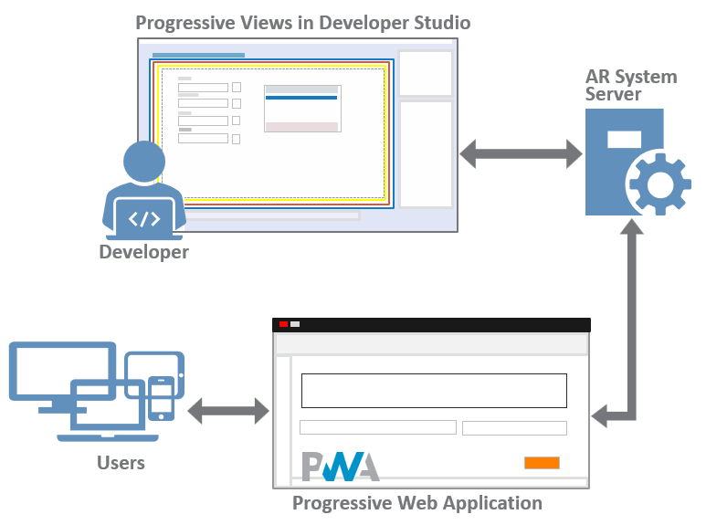

Progressive web applications (PWA) are applications that use common web technologies including HTML, CSS, and JavaScript. These applications are platform-independent and can be used across different devices such as desktops, tablets, and mobiles.

**Best practice**  
Use IS for developing new codeless and code-based applications.

Use Developer Studio for customizing PWA screens for existing applications such asITSM.

You can develop a PWA in Developer Studio. PWA technology provides you with the ability to create applications and additions to the ITSM applications that work across multiple platforms. For example, the same application runs on an iOS device or an Android device without you having to develop a separate client for each device.

Progressive web applications automatically fit the screen of the device they run on.

Related topics

[Comparison-between-Developer-Studio-and-IS-capabilities](https://docs.bmc.com/xwiki/bin/view/Service-Management/Innovation-Suite/BMC-Helix-Innovation-Suite/is254/Getting-started/Comparison-between-Developer-Studio-and-BMC-Helix-Innovation-Studio-capabilities/)

[Mid-Tier-architecture](https://docs.bmc.com/xwiki/bin/view/Service-Management/Innovation-Suite/AR-System/ars221/Getting-started/Key-concepts/Architecture/Mid-Tier-architecture/)

[Enabling-Progressive-Views-for-forms-by-using-Centralized-Configuration-Settings](https://docs.bmc.com/xwiki/bin/view/Service-Management/Innovation-Suite/BMC-Helix-Innovation-Suite/is254/Developing-Progressive-Web-Applications/Enabling-Progressive-Views-for-forms-by-using-Centralized-Configuration-Settings/)

[Adding custom fields to your views by using Smart IT](https://docs.bmc.com/xwiki/bin/create/smartit221/Adding%20custom%20fields%20to%20your%20views%20using%20Smart%20ITe?parent=Service-Management.Innovation-Suite.BMC-Helix-Innovation-Suite.is254.Developing-Progressive-Web-Applications.WebHome)[Community: Video series for PWA](https://community.bmc.com/s/news/aA33n000000CjKYCA0/recorded-video-series-for-remedy-progressive-web-applications-pwa)[Community blog: Whitepaper on ITSM PWA Implementation Methodology](https://community.bmc.com/s/news/aA33n000000TXSHCA4/bmc-helix-itsm-pwa-implementation-methodology)

The following diagram shows the high-level process of developing applications with PWA technologies by using Developer Studio.

## Topics related to developing PWA in Developer Studio

Read through the following topics to learn more about developing a Progressive Web Application (PWA) in Developer Studio.

| Action  | Reference  |
| --- | --- |
| To understand the basic concepts of what PWAs are and their advantages  | [Progressive-Web-Applications-overview](https://docs.bmc.com/xwiki/bin/view/Service-Management/Innovation-Suite/BMC-Helix-Innovation-Suite/is254/Getting-started/Key-concepts/Application-development-overview/Progressive-View-quick-reference-guide/Illustrated-guide-to-progressive-web-applications/)  |
| To understand the Mid Tier architecture in general as well as Mid Tier architecture for PWAs  | [Mid-Tier-architecture](https://docs.bmc.com/xwiki/bin/view/Service-Management/Innovation-Suite/BMC-Helix-Innovation-Suite/is254/Getting-started/Key-concepts/Architecture/Mid-Tier-architecture/)  |
| To understand how flow panel holders can in creating create PWA screens and how they help with making screens responsive to varying screens  | [Flow-panel-holders-for-Progressive-Web-Applications](https://docs.bmc.com/xwiki/bin/view/Service-Management/Innovation-Suite/BMC-Helix-Innovation-Suite/is254/Developing-Progressive-Web-Applications/Flow-panel-holders-for-Progressive-Web-Applications/)  |
| To understand Progressive Web Application screens with a few examples  | [Progressive-web-application-screens](https://docs.bmc.com/xwiki/bin/view/Service-Management/Innovation-Suite/BMC-Helix-Innovation-Suite/is254/Getting-started/Key-concepts/Application-development-overview/Progressive-View-quick-reference-guide/)  |
| To know the basics of accessing and using Developer Studio  | [Accessing-and-navigating-Developer-Studio](https://docs.bmc.com/xwiki/bin/view/Service-Management/Innovation-Suite/BMC-Helix-Innovation-Suite/is254/Developing-applications-by-using-Developer-Studio/Accessing-and-navigating-Developer-Studio/)  |
| To create a Progressive Web Application you must first enable Progressive View for forms in Developer Studio  | [Enabling-Progressive-Views-for-forms-by-using-Centralized-Configuration-Settings](https://docs.bmc.com/xwiki/bin/view/Service-Management/Innovation-Suite/BMC-Helix-Innovation-Suite/is254/Developing-Progressive-Web-Applications/Enabling-Progressive-Views-for-forms-by-using-Centralized-Configuration-Settings/)  |
| To know best practices when developing and customizing a PWA  | [Customization-best-practices-for-developing-PWA](https://docs.bmc.com/xwiki/bin/view/Service-Management/Innovation-Suite/BMC-Helix-Innovation-Suite/is254/Developing-Progressive-Web-Applications/Customization-best-practices-for-developing-PWA/)  |
| To know the differences between the Developer Studio features for Mid Tier versus the features available in Progressive View  | [Differences-between-Developer-Studio-features-available-for-Mid-Tier-and-Progressive-Web-Applications](https://docs.bmc.com/xwiki/bin/view/Service-Management/Innovation-Suite/AR-System/ars221/Getting-started/Differences-between-Developer-Studio-features-available-for-Mid-Tier-and-Progressive-Web-Applications/)  |
| To learn about the localization support for a PWA  | [Localizing-a-Progressive-Web-Application](https://docs.bmc.com/xwiki/bin/view/Service-Management/Innovation-Suite/BMC-Helix-Innovation-Suite/is254/Developing-Progressive-Web-Applications/Localizing-a-Progressive-Web-Application/)  |
| To know how to use autocomplete for character fields in search menus  | [Creating-search-menus](https://docs.bmc.com/xwiki/bin/view/Service-Management/Innovation-Suite/AR-System/ars221/Developing-applications/Developing-the-application-interface/Defining-application-menus/Creating-search-menus/)  |
| To achieve better performance by setting the active links to run in parallel  | [Creating-active-links](https://docs.bmc.com/xwiki/bin/view/Service-Management/Innovation-Suite/AR-System/ars221/Developing-applications/Defining-workflow-to-automate-processes/Creating-workflow-objects/Creating-active-links/)  |
| To know the properties supported when developing a progressive view  | [Field properties](https://docs.bmc.com/xwiki/bin/view/Service-Management/Innovation-Suite/AR-System/ars221/Developing-applications/Developing-the-application-interface/Creating-and-managing-fields/Field-Properties/)  |
| Creating filters and advanced filters in progressive views that enable PWA users to search records and to fill forms  | [Creating-filters](https://docs.bmc.com/xwiki/bin/view/Service-Management/Innovation-Suite/AR-System/ars221/Developing-applications/Defining-workflow-to-automate-processes/Creating-workflow-objects/Creating-filters/) [Creating-an-advanced-filter-in-Progressive-Web-Applications](https://docs.bmc.com/xwiki/bin/view/Service-Management/Innovation-Suite/BMC-Helix-Innovation-Suite/is254/Developing-Progressive-Web-Applications/Creating-an-advanced-filter-in-Progressive-Web-Applications/) [Creating-a-faceted-filter](https://docs.bmc.com/xwiki/bin/view/Service-Management/Innovation-Suite/AR-System/ars221/Developing-applications/Developing-the-application-interface/Defining-tables-to-display-data/Creating-a-faceted-filter/)  |
| To know the icons available in Developer Studio for PWA and how to use them in your applications  | [Previews-of-icons-available-in-Developer-Studio-to-support-PWA](https://docs.bmc.com/xwiki/bin/view/Service-Management/Innovation-Suite/BMC-Helix-Innovation-Suite/is254/Developing-Progressive-Web-Applications/Adding-icons-and-images-to-Progressive-Web-Applications/Previews-of-icons-available-in-Developer-Studio-to-support-PWA/) [Adding-icons-to-UI-elements-on-forms-by-using-Developer-Studio](https://docs.bmc.com/xwiki/bin/view/Service-Management/Innovation-Suite/BMC-Helix-Innovation-Suite/is254/Developing-Progressive-Web-Applications/Adding-icons-and-images-to-Progressive-Web-Applications/Adding-BMC-icons-to-UI-elements-on-forms-by-using-Developer-Studio/)  |
| To create various types of selection lists  | [Creating-selection-lists-in-Progressive-Web-Applications](https://docs.bmc.com/xwiki/bin/view/Service-Management/Innovation-Suite/BMC-Helix-Innovation-Suite/is254/Developing-Progressive-Web-Applications/Creating-selection-lists-in-Progressive-Web-Applications/)  |
| [Creating dynamic multiple selection lists for Progressive Web Applications by using JSON data](https://docs.bmc.com/xwiki/bin/view/Service-Management/Innovation-Suite/BMC-Helix-Innovation-Suite/is254/Developing-Progressive-Web-Applications/Creating-dynamic-selection-lists-for-Progressive-Web-Applications-by-using-JSON-data/)  |
| Add fields that allow editing and formatting of text, adding images, and so on  | [Adding-rich-text-fields-in-Progressive-Web-Applications](https://docs.bmc.com/xwiki/bin/view/Service-Management/Innovation-Suite/BMC-Helix-Innovation-Suite/is254/Developing-Progressive-Web-Applications/Adding-rich-text-fields-in-Progressive-Web-Applications/)  |
| Add a pause to a character field in a workflow  | [Adding-a-pause-interval-in-a-character-field-for-a-workflow-in-PWA](https://docs.bmc.com/xwiki/bin/view/Service-Management/Innovation-Suite/AR-System/ars221/Developing-applications/Developing-the-application-interface/Creating-and-managing-fields/Data-fields/Adding-a-pause-interval-in-a-character-field-for-a-workflow-in-PWA/)  |
| Create a survey in the application  | [Creating-a-survey-questionnaire](https://docs.bmc.com/xwiki/bin/view/Service-Management/Innovation-Suite/AR-System/ars221/Developing-applications/Developing-the-application-interface/Creating-and-managing-fields/Creating-a-survey-questionnaire/)  |
| Manage attachments in the application  | [Managing-attachments-in-Progressive-Web-Applications-by-using-a-remote-form](https://docs.bmc.com/xwiki/bin/view/Service-Management/Innovation-Suite/AR-System/ars221/Developing-a-Progressive-Web-Application/Managing-attachments-in-Progressive-Web-Applications-by-using-a-remote-form/)  |
| Add typeahead to mention users in the organization  | [Configuring-the-mention-component](https://docs.bmc.com/xwiki/bin/view/Service-Management/Innovation-Suite/AR-System/ars221/Developing-applications/Developing-the-application-interface/Creating-and-managing-fields/Data-fields/Configuring-the-mention-component/)  |
| Create a progress bar that shows stages of a workflow or process in your application  | [Configuring-the-Progress-bar-widget-in-Progressive-Web-Applications](https://docs.bmc.com/xwiki/bin/view/Service-Management/Innovation-Suite/BMC-Helix-Innovation-Suite/is254/Developing-Progressive-Web-Applications/Configuring-the-Progress-bar-widget-in-Progressive-Web-Applications/)  |
| Add autocomplete to a field  | [Automatically-completing-menu-entries](https://docs.bmc.com/xwiki/bin/view/Service-Management/Innovation-Suite/AR-System/ars221/Developing-applications/Developing-the-application-interface/Defining-application-menus/Automatically-completing-menu-entries/)  |
| Adding images in the interface of your application  | [Adding-background-images-to-fields-and-form-views](https://docs.bmc.com/xwiki/bin/view/Service-Management/Innovation-Suite/BMC-Helix-Innovation-Suite/is254/Developing-Progressive-Web-Applications/Adding-icons-and-images-to-Progressive-Web-Applications/Adding-background-images-to-fields-and-form-views/)  |
| Automatically aligning fields in Developer Studio  | [Aligning-fields](https://docs.bmc.com/xwiki/bin/view/Service-Management/Innovation-Suite/AR-System/ars221/Developing-applications/Developing-the-application-interface/Customizing-the-interface-for-multiple-consumers/Defining-and-managing-form-views/Arranging-fields-in-a-form-view/Aligning-fields/)  |
| Change the look and feel of your application to suit the branding and styles of your organization  | [Rebranding-Progressive-Web-Application-screens](https://docs.bmc.com/xwiki/bin/view/Service-Management/Innovation-Suite/BMC-Helix-Innovation-Suite/is254/Developing-Progressive-Web-Applications/Rebranding-Progressive-Web-Application-screens/)  |

## Videos related to developing PWA in Developer Studio

You can watch the following videos to know more about developing progressive web applications:

| Video title  | Description  |
| --- | --- |
| Webinar: Progressive Web Apps Introduction & Best Practices  | [🎥 Watch Video: https://www.youtube.com/watch?v=sVJXAhfVzQk](https://www.youtube.com/watch?v=sVJXAhfVzQk) <https://youtu.be/sVJXAhfVzQk>  |
| Webinar: Progressive Web Application (PWA) Development In Helix ITSM  | [🎥 Watch Video: https://www.youtube.com/watch?v=-J-ENCJ8bc4](https://www.youtube.com/watch?v=-J-ENCJ8bc4) <https://youtu.be/-J-ENCJ8bc4>  |
| Overview of Progressive Web Applications  | [🎥 Watch Video: https://www.youtube.com/watch?v=7DnZnfo6uZ8](https://www.youtube.com/watch?v=7DnZnfo6uZ8) [https://youtu.be/7DnZnfo6uZ8](https://youtu.be/7DnZnfo6uZ8)  |
| Advancements in Developer Studio to support PWA  | [🎥 Watch Video: https://www.youtube.com/watch?v=YaI3s28w\_XY](https://www.youtube.com/watch?v=YaI3s28w_XY) <https://youtu.be/YaI3s28w_XY>  |
| Use cases for Progressive Web Applications.  | [🎥 Watch Video: https://www.youtube.com/watch?v=s14\_l\_r9DwQ](https://www.youtube.com/watch?v=s14_l_r9DwQ) <https://youtu.be/s14_l_r9DwQ> This video (2:08) provides use cases for Progressive Web Application.  |
| Localizing a Progressive Web Application  | [🎥 Watch Video: https://www.youtube.com/watch?v=e2tOOdpBAB0](https://www.youtube.com/watch?v=e2tOOdpBAB0) <https://youtu.be/e2tOOdpBAB0> This video (7:31) provides an overview of how to localize a Progressive Web Application.  |
| Panel holder display types, creating fixed panels and complex layouts with flow panels  | [🎥 Watch Video: https://www.youtube.com/watch?v=m33BWG-mEoI](https://www.youtube.com/watch?v=m33BWG-mEoI) <https://youtu.be/m33BWG-mEoI> This video (4:52) demonstrates creating Fixed panels in Developer Studio when you enable progressive views for a form.  |
| [🎥 Watch Video: https://www.youtube.com/watch?v=TnwUS2RF28Q](https://www.youtube.com/watch?v=TnwUS2RF28Q) [https://youtu.be/TnwUS2RF28Q](https://youtu.be/TnwUS2RF28Q) This video (13:03) demonstrates creating complex layouts with flow panels.  |
| Configuring a progress bar widget  | [🎥 Watch Video: https://www.youtube.com/watch?v=-T90EgZ\_ZtI](https://www.youtube.com/watch?v=-T90EgZ_ZtI) <https://youtu.be/-T90EgZ_ZtI> This video (3:37) describes how to configure and use the progress bar widget.  |
| Managing attachments in PWA by using a remote form  | [🎥 Watch Video: https://www.youtube.com/watch?v=sFkBJ-cjcH0](https://www.youtube.com/watch?v=sFkBJ-cjcH0) <https://youtu.be/sFkBJ-cjcH0> This video (5:15) shows how to create attachment pools that allow variable number of attachments in progressive web applications.  |
| Troubleshooting PWA  | [🎥 Watch Video: https://www.youtube.com/watch?v=MfSTrjhwau8](https://www.youtube.com/watch?v=MfSTrjhwau8) <https://youtu.be/MfSTrjhwau8>  This video (3:40) shows you how to use additional log settings and generated HTML to diagnose and troubleshoot PWA  |
| Adding images to buttons and background images to fields and form views.  | [🎥 Watch Video: https://www.youtube.com/watch?v=349xdes86qM](https://www.youtube.com/watch?v=349xdes86qM) <https://www.youtube.com/watch?v=349xdes86qM> This video (3:54) provides a summary of adding static or SVG images in Developer Studio for progressive views.  |
| Creating dynamic selection lists for Progressive Web Applications by using JSON data  | [🎥 Watch Video: https://www.youtube.com/watch?v=3eRIML5mOgI](https://www.youtube.com/watch?v=3eRIML5mOgI) <https://youtu.be/3eRIML5mOgI> This video (4:06) explains the concept and also demonstrates how the JSON properties and the JSONMAP function works.  |
| Creating a survey questionnaire  | [🎥 Watch Video: https://www.youtube.com/watch?v=v0VVhzPHQww](https://www.youtube.com/watch?v=v0VVhzPHQww) <https://youtu.be/v0VVhzPHQww>  Thisvideo (5:33) provides a summary of creating a survey questionnaire in Developer Studio for progressive views:  |
| Adding images in PWA  | This video (3:54) provides a summary of adding static or SVG images in Developer Studio for progressive views:  [🎥 Watch Video: https://www.youtube.com/watch?v=349xdes86qM](https://www.youtube.com/watch?v=349xdes86qM) <https://www.youtube.com/watch?v=349xdes86qM>  |
| Aligning fields  | [🎥 Watch Video: https://www.youtube.com/watch?v=\_JhOoLN2agY](https://www.youtube.com/watch?v=_JhOoLN2agY) <https://youtu.be/_JhOoLN2agY> This video (3:50) provides a summary of how automatic alignment of fields happens in progressive views in Developer Studio.  |
| Creating typeahead fields for PWA  | [🎥 Watch Video: https://www.youtube.com/watch?v=hhvyBy99Ujg](https://www.youtube.com/watch?v=hhvyBy99Ujg) [https://youtu.be/hhvyBy99Ujg](https://youtu.be/hhvyBy99Ujg)  |