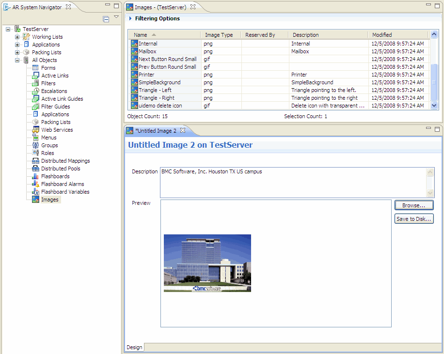

As a developer, you can use images as backgrounds for form views and certain field types, including buttons, panels, and cell-based tables when creating a Progressive Web Application (PWA). An image object is an image stored in theAR System serverdatabase with information defining the image as aAR System serverobject. The image object type appears in the AR System Navigator pane at the end of the All Objects list (see the following figure).

Related topics

[Adding-icons-and-images-to-Progressive-Web-Applications](https://docs.bmc.com/xwiki/bin/view/Service-Management/Innovation-Suite/BMC-Helix-Innovation-Suite/is254/Developing-Progressive-Web-Applications/Adding-icons-and-images-to-Progressive-Web-Applications/)

[Adding-background-images-to-fields-and-form-views](https://docs.bmc.com/xwiki/bin/view/Service-Management/Innovation-Suite/BMC-Helix-Innovation-Suite/is254/Developing-Progressive-Web-Applications/Adding-icons-and-images-to-Progressive-Web-Applications/Adding-background-images-to-fields-and-form-views/)

[Adding-icons-to-UI-elements-on-forms-by-using-Developer-Studio](https://docs.bmc.com/xwiki/bin/view/Service-Management/Innovation-Suite/BMC-Helix-Innovation-Suite/is254/Developing-Progressive-Web-Applications/Adding-icons-and-images-to-Progressive-Web-Applications/Adding-BMC-icons-to-UI-elements-on-forms-by-using-Developer-Studio/)

[Previews-of-icons-available-in-Developer-Studio-to-support-PWA](https://docs.bmc.com/xwiki/bin/view/Service-Management/Innovation-Suite/BMC-Helix-Innovation-Suite/is254/Developing-Progressive-Web-Applications/Adding-icons-and-images-to-Progressive-Web-Applications/Previews-of-icons-available-in-Developer-Studio-to-support-PWA/)

To use the same image in multiple locations, such as the background of related forms, you do not need to store a copy of the image in the display properties of each form view or field that uses the image. Instead, store the image once as an image object, and include it by reference in form view and field display properties. Using an image object, you can also avoid the 4 MB size limit on the field display property.

AR System serversupports the following image types:

* Windows bitmap (**.bmp**file extension)
* Joint Photographic Experts Group format (**.jpeg**or**.jpg**file extensions)
* Graphics Interchange Format (**.gif**file extension)
* Portable Network Graphics format (**.png**file extension)

To convert existing references and image files to shared images, use the**ImageExtractor.bat**utility. See[ImageExtractor-jar-ImageExtractor-bat](https://docs.bmc.com/xwiki/bin/view/Service-Management/Innovation-Suite/AR-System/ars221/Administering/Remedy-configuration-reference/AR-System-external-utilities/ImageExtractor-jar-ImageExtractor-bat/).

## To create an image object

1. In AR System Navigator, expand***serverName*****> All Object**s.
2. Right-click**Images**, and select**New Image**.  
   A blank image object opens in the editing area.
3. In the**Description**field, enter a description of the image.  
   The description appears in the list of images in the Object Selector dialog box when you add an image to a field or form view. Enter up to 255 characters.
4. Click**Browse**, and navigate to the directory containing the image.
5. To display the available images in the directory, select the various image types from the Files of Type list.
6. Select the image to store in AR System, and click**Open**.  
   The image appears in the preview pane of the image object.
7. Save the image object, assigning a unique name in the Save Image As dialog box.  
   Images are indexed on the name you assign and by the image ID. Image names can have up to 255 characters.  
   AlthoughAR System serverpermits backslashes in image object names, you should*not*to include them. To prevent attacks on your system, you should exclude unsafe characters from your web server. By default, most web servers do not allow the backslash character ( \ ) in URLs for security reasons. For example, Tomcat does not allow backslashes in URLs unless you set a parameter to permit them. If your system uses such a web server, images whose object name contains backslashes might not appear in your browser.

## To open an image object

1. In AR System Navigator, expand***serverName*****> All Objects**.
2. Double-click**Images**.
3. From the Images list, double-click the image object to open.

## To save an image to a file outsideAR System server

1. Open the image object, and then click**Save to Disk**.
2. Navigate to the directory where you want to save the file.
3. Enter an appropriate file name, and then click**Save**.

## To rename an image object

1. In AR System Navigator, expand***serverName*****> All Objects**.
2. Double-click**Images**.
3. Right-click the image to be renamed, and then select**Rename**.
4. Enter the new name, and then save the image object.  
   You cannot rename an open object inDeveloper Studio. If a warning indicates the object has an open editor, close the image and repeat these steps.

## To delete an image object

Warning

Deleting a shared image object removes it from*all*form views and fields. You cannot undo this operation inDeveloper Studio.

1. In AR System Navigator, expand***serverName*> All Objects**.
2. Double-click**Images**.
3. Right-click the image to be renamed, and then select**Delete**.
4. Confirm the deletion when prompted.
5. In the second confirmation dialog, specify whether to remove references to the image from the display properties of fields and objects.
   * Click**Yes**to remove the reference from the listed fields or objects.
   * Click**Yes to All**to remove all references to the image.
   * Click**No**to retain the reference in the listed field or object.
   * Click**No to All**to retain all references to the image.  
     If you retain a reference, the image object name stays in the display property, and you can create another image object with the same name to restore the reference.