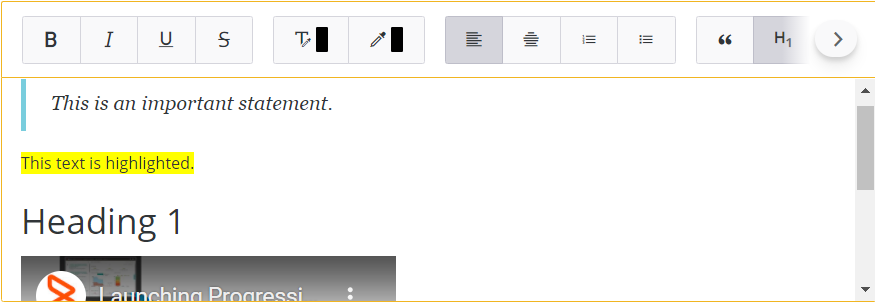

As an application developer, you can add character fields as rich text format (RTF) fields to enable your application users to add formatted text, add images along with text, and so on.

Application users can perform the following tasks by using RTF fields:

* Edit and format text.
* Add content from Microsoft Word, Microsoft Outlook, or HTML pages.
* Add images and links along with text.

**Important**

Rich text fields are displayed as plain text fields in mobile views.

Related topics

[Adding-icons-and-images-to-Progressive-Web-Applications](https://docs.bmc.com/xwiki/bin/view/Service-Management/Innovation-Suite/BMC-Helix-Innovation-Suite/is254/Developing-Progressive-Web-Applications/Adding-icons-and-images-to-Progressive-Web-Applications/)

[Customization-best-practices-for-developing-PWA](https://docs.bmc.com/xwiki/bin/view/Service-Management/Innovation-Suite/BMC-Helix-Innovation-Suite/is254/Developing-Progressive-Web-Applications/Customization-best-practices-for-developing-PWA/)

[Enabling rich text fields on PWA screens by running a utility](https://docs.bmc.com/xwiki/bin/view/Service-Management/IT-Service-Management/BMC-Helix-ITSM/itsm254/Developing/Customizing-BMC-Helix-ITSM/Enabling-rich-text-field-on-Progressive-Web-Application-screens/Enabling-rich-text-fields-on-PWA-screens-by-running-a-utility/)

## To add RTF fields or advanced RTF fields in Progressive Web Applications

1. In Developer Studio, create a progressive view.
2. In Palette, in the Data Fields section, drag**Character**into the view.  
   
3. Select the character field.  
   
4. On the Properties pane, perform one of the following steps:
   * To create a simple rich text field, in the**Display > Display Type**list, select**Rich Text**.  
     This option creates an RTF field in PWA but does not provide you any additional configuration options.
   * To create an advanced rich text field in the**Display > Display Type**list, select**Advanced Rich Text**.  
     Select**Advanced Rich Text**to create an RTF field along with additional configuration options. For example, you can select the RTF toolbar options that are displayed in the application along with other features described in the following section. In the select**Display > Display as text**list, select**True**to display the rich text in view-only mode.

     **Best practice**  
     If you source text from a rich-text-enabled field in Mid Tier and display it within a field in a PWA screen, you must make sure that the field in PWA also has rich text enabled. In such a scenario, if you do not enable rich text in the field in PWA, the field may display text along with the HTML source.
5. Save the changes.

## To perform additional configurations to advanced RTF fields in Progressive Web Applications

Optionally, you can add additional properties to the advanced RTF (ARTF) fields after you select**Advanced Rich Text**in Developer Studio to do the following:

* Add a toggle that enables application users to switch the RTF field to show plain text.
* Enable application users to use @mention in the RTF fields.
* Show or hide advanced RTF palette options.

1. Enable @mention to the rich text field.  
   1. On the**Properties**panel, under the Display property group, for the Enable Menu Hotkeys property, select the**True**value.
   2. In the**Value**column for the Menu Hotkeys property, click the ellipsis button.  
      The**Menu Hotkeys**dialog box is displayed.  
      
   3. Click**Add**, and then perform the following steps:

      | Property  | Step  |
      | --- | --- |
      | Hotkey  | Click the first row in this column, and then select a character from the list. When application users type this character, the @mention list appears.  |
      | Menu Name  | Click the first row in this column, and then click the ellipsis buttonto select a menu from the**Menu Selector**dialog box. This is the menu from which information for the @mention list if obtained.  |
      | Active Link  | Click the first row in this column, and then click the ellipsis buttonto select an active link from the**Active Link Selector**dialog box. The active link that you attach to a hotkey must be an existing one and associated with the current form.  |
      | Labels  | Leave this column empty. This column is related to only character fields without any RTF enabled.  |
      | Auto Complete Key Stroke #  | Enter an integer value. This is the number of characters application users have to enter before the @mention list appears.  |
      | RTF Labels  | Click the first row in this column, and then click the ellipsis buttonto select the fields from which the @mention list obtains data. For example, if you specify a form with all user details in the Menu Name column, you can select the fields representing the following data:  * User name * Device ID * User email * Company nameIn such a scenario, the @mention in the PWA screens displays the information as shown:  The displayed order of the information is the same as the order in which they are in the RTF Label column. **Important**  * The @mention list in the PWA screen displays only the first four fields you select in the RTF Labels column. * If you select more than four fields, the @mention performs the search in all those fields even though it displays only the first four fields in the PWA screen. * If you do not specify anything in the RTF Labels column, Developer Studio uses the first four available fields in the order specified in the form and then displays it in the @mention list in the application.**Best practice** Since @mention searches through all the fields you add in the RTF Label column, make sure you add those fields which make search easier to the application users.  |
   4. Click**OK**.
2. Show only relevant RTF field options.
   1. On the**Properties**panel, beside the**Display >Additional RTF Toolbar Configuration**property, click the field.
   2. Enter the list of options you want the RTF field to display with the following syntax:  
      **Option1, Option2 | Option3, Option4, Option5**  
      The pipe character (|) specifies that the options after it are in a new group. The syntax is case sensitive.

      

Example syntax for adding RTF toolbar options

For example, enter<strong>Maximize, Bold, Underline | Image, Link</strong>to display the Maximize, Bold, and Underline options with the RTF field.  The PWA screen displays the following options on the RTF toolbar: 

Values for RTF toolbar options

You must use the following values for the corresponding RTF toolbar options:
<table class="wrapped"><thead><tr><th scope="col">

Type

</th><th scope="col">

RTF toolbar option

</th><th scope="col">

Description

</th><th scope="col">

Value

</th></tr></thead><tr><td rowspan="8">

Basic style

</td><td>

</td><td>

Bold text

</td><td>

<strong>Bold</strong>

</td></tr><tr><td>

</td><td>

Italicize text

</td><td>

<strong>Italic</strong>

</td></tr><tr><td>

</td><td>

Underline text

</td><td>

<strong>Underline</strong>

</td></tr><tr><td>

</td><td>

Strikeout text

</td><td>

<strong>Strike</strong>

</td></tr><tr><td>

</td><td>

Subscript

</td><td>

<strong>Subscript</strong>

</td></tr><tr><td>

</td><td>

Superscript

</td><td>

<strong>Superscript</strong>

</td></tr><tr><td>

</td><td>

Remove formatting

</td><td>

<strong>RemoveFormat</strong>

</td></tr><tr><td>

</td><td>

Copy formatting

</td><td>

<strong>CopyFormatting</strong>

</td></tr><tr><td rowspan="3">

Style

</td><td>

</td><td>

Format

</td><td>

<strong>Format</strong>

</td></tr><tr><td>

</td><td>

Font

</td><td>

<strong>Font</strong>

</td></tr><tr><td>

</td><td>

Font size

</td><td>

<strong>FontSize</strong>

</td></tr><tr><td rowspan="2">

Color

</td><td>

</td><td>

Text color

</td><td>

<strong>TextColor</strong>

</td></tr><tr><td>

</td><td>

Background color

</td><td>

<strong>BGcolor</strong>

</td></tr><tr><td rowspan="3">

Editing

</td><td>

</td><td>

Find

</td><td>

<strong>Find</strong>

</td></tr><tr><td>

</td><td>

Replace

</td><td>

<strong>Replace</strong>

</td></tr><tr><td>

</td><td>

Select all

</td><td>

<strong>SelectAll</strong>

</td></tr><tr><td rowspan="9">

Paragraph

</td><td>

</td><td>

Outdent

</td><td>

<strong>Outdent</strong>

</td></tr><tr><td>

</td><td>

Indent

</td><td>

<strong>Indent</strong>

</td></tr><tr><td>

</td><td>

Justify to the left

</td><td>

<strong>JustifyLeft</strong>

</td></tr><tr><td>

</td><td>

Justify to center

</td><td>

<strong>JustifyCenter</strong>

</td></tr><tr><td>

</td><td>

Justify to right

</td><td>

<strong>JustifyRight</strong>

</td></tr><tr><td>

</td><td>

Justify

</td><td>

<strong>JustifyBlock</strong>

</td></tr><tr><td>

</td><td>

Numbered list

</td><td>

<strong>NumberedList</strong>

</td></tr><tr><td>

</td><td>

Bulleted list

</td><td>

<strong>BulletedList</strong>

</td></tr><tr><td>

</td><td>

Quote

</td><td>

<strong>Blockquote</strong>

</td></tr><tr><td rowspan="3">

Link

</td><td>

</td><td>

Add link

</td><td>

<strong>Link</strong>

</td></tr><tr><td>

</td><td>

Remove link

</td><td>

<strong>Unlink</strong>

</td></tr><tr><td>

</td><td>

Add anchor

</td><td>

<strong>Anchor</strong>

</td></tr><tr><td rowspan="5">

Insert

</td><td>

</td><td>

Add image

</td><td>

<strong>Image</strong>

</td></tr><tr><td>

</td><td>

Add table

</td><td>

<strong>Table</strong>

</td></tr><tr><td>

</td><td>

Add horizontal rule

</td><td>

<strong>HorizontalRule</strong>

</td></tr><tr><td>

</td><td>

Embed YouTube video

</td><td>

<strong>Youtube</strong>

</td></tr><tr><td>

</td><td>

Insert page break

</td><td>

<strong>PageBreak</strong>

</td></tr><tr><td rowspan="7">

clipboard

</td><td>

</td><td>

Cut

</td><td>

<strong>Cut</strong>

</td></tr><tr><td>

</td><td>

Copy

</td><td>

<strong>Copy</strong>

</td></tr><tr><td>

</td><td>

Paste

</td><td>

<strong>Paste</strong>

</td></tr><tr><td>

</td><td>

Paste as plain text

</td><td>

<strong>PasteText</strong>

</td></tr><tr><td>

</td><td>

Paste Word content

</td><td>

<strong>PasteFromWord</strong>

</td></tr><tr><td>

</td><td>

Undo

</td><td>

<strong>Undo</strong>

</td></tr><tr><td>

</td><td>

Redo

</td><td>

<strong>Redo</strong>

</td></tr><tr><td></td><td>

</td><td>

Maximize

</td><td>

<strong>Maximize</strong>

</td></tr><tr><td></td><td>

</td><td>

View as source

</td><td>

<strong>Source</strong>

</td></tr></table>

3. Save the changes.

## To validate the RTF field or advanced RTF field in PWA

1. In a browser, log in to PWA.  
   **<*serverName*>:8080/arsys/pwa/#/login**
2. Change the URL to include the Progressive View form that you created in Developer Studio.  
   **<*serverName*>:8080/arsys/pwa/#/forms/<*serverName*>/<*formName*>/<*viewName*>**
3. (*Optional*) If you want to display more changes you made in Developer Studio, you must sync the cache in Mid Tier.
   1. Log in to Mid Tier configuration.  
      **<*serverName*>:8080/arsys/shared/config/config.jsp**
   2. Click**Sync Cache**.
   3. Refresh the browser displaying the progressive view form.
4. As an application user, you can perform the following tasks in the RTF editor:
   * Add content that uses standard HTML markup, this RTF editor renders the content without any loss of formatting.
   * Edit the existing rich text content.
   * Copy content from Microsoft Word, Microsoft Outlook, or HTML while retaining most of the supported formatting.
   * You can view the following options in the RTF editor and advanced RTF editor:

     

Options in the RTF editor

<table><thead><tr><th scope="col">

Function

</th><th scope="col">

Description

</th></tr></thead><tr><td>

</td><td>

Make the selected text bold, italicized, underlined, orstrikethrough.

</td></tr><tr><td>

</td><td>

Select the text color and text highlighting background.

</td></tr><tr><td>

</td><td>

Set the paragraph so that it aligns evenly on the left or center, or justifies the text.

</td></tr><tr><td>

</td><td>

Create an ordered or unordered list.

</td></tr><tr><td>

</td><td>

Create special formatting to any text so that it is displayed prominently as shown in the following example:  

</td></tr><tr><td>

</td><td>

Set paragraph formatting style such as headings.

</td></tr><tr><td>

</td><td>

Make the selected text subscript or superscript.

</td></tr><tr><td>

</td><td>

Embed a YouTube video when you provide the embed URL.

</td></tr><tr><td>

</td><td>

Insert a URL. The URL must contain the protocol such as<strong>http://</strong>or<strong>https://</strong>. For example, enter<strong><a href="http://www.docs.bmc.com" shape="rect">http://www.docs..com</a></strong><strong></strong>instead of entering<strong><a href="http://www.docs.bmc.com" shape="rect">www.docs..com</a></strong>.

</td></tr><tr><td>

</td><td>

Insert an image into theRTFfield. You can also copy and paste images into the RTF field.

</td></tr><tr><td>

</td><td>

The undo button removes the last 30 changes made in the RTF editor or reverses the undo action.

</td></tr></table>

Additional options in advanced RTF editor

<table><thead><tr><th scope="col">

Function

</th><th scope="col">

Description

</th></tr></thead><tr><td>

</td><td>

Set text formatting style such as headings, font, and size.

</td></tr><tr><td>

</td><td>

Display the text along with source.

</td></tr><tr><td>

</td><td>

Copy formatting and remove text formatting.

</td></tr><tr><td>

</td><td>

Search, replace, and select all text.

</td></tr><tr><td>

</td><td>

Text indentation.

</td></tr><tr><td>

</td><td>

Remove hyperlink from text and add an anchor.

</td></tr><tr><td>

</td><td>

Insert tables.

</td></tr><tr><td>

</td><td>

Insert page breaks for printing.

</td></tr><tr><td>

</td><td>

Cut, copy to clipboard, paste from clipboard, paste as plain text, and paste from Word

</td></tr><tr><td>

</td><td>

Maximize the field to occupy the browser screen.

</td></tr></table>

How does advanced RTF handle HTML and domains?
<ul><li>Any content created in earlier releases that has HTML is executed and rendered according to the HTML tags.</li><li>HTML tags are compared to theISadministration email configuration whitelist.</li><li>If the tags are not in the whitelist, they are removed and then displayed by the advanced RTF field.</li></ul>

