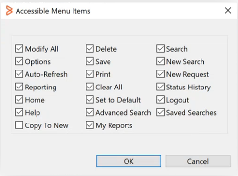

**Related topics**

[Enabling Progressive Views for forms by using Centralized Configuration Settings](https://docs.bmc.com/xwiki/bin/view/Service-Management/Innovation-Suite/BMC-Helix-Innovation-Suite/is254/Developing-Progressive-Web-Applications/Enabling-Progressive-Views-for-forms-by-using-Centralized-Configuration-Settings/)

[Updating-configuration-settings-by-using-the-AR-System-Configuration-Generic-UI-form](https://docs.bmc.com/xwiki/bin/view/Service-Management/Innovation-Suite/BMC-Helix-Innovation-Suite/is254/Administering/BMC-Helix-Innovation-Suite-configuration-references/Centralized-configuration/Updating-configuration-settings-by-using-the-AR-System-Configuration-Generic-UI-form/).

As an administrator, configure the Results List in Developer Studio to provide users with a modern interface for managing records. Use the Results List in Progressive View to perform actions such as creating, searching, or updating records directly within a form in IS.

## Task 1: To enable the CCS parameter in Mid Tier

1. In a browser, open the AR System Administration Console, and select**System > General > Centralized Configuration**.
2. In the AR System Configuration Generic UI form, from the**Component Name**list, select**arsystem..arsys.midtier-DockerMTClusterUser**component to add a CCS parameter.
3. Click**Add**.
4. Enter**pv.showResultList**name of the setting and set its value to**t**(True). For more information, see[Configuration settings N-R](https://docs.bmc.com/xwiki/bin/view/Service-Management/Innovation-Suite/BMC-Helix-Innovation-Suite/is254/Administering/BMC-Helix-Innovation-Suite-configuration-references/Centralized-configuration/Configuration-settings/Configuration-settings-N-R/).

* The following image shows the**pv.showResultList**property set to**true:**
* 

5. Click**Apply**and**Close**.
6. Flush the cache from the Mid Tier. For more information, see[Configuring cache settings for the Mid Tier](https://docs.bmc.com/xwiki/wiki/internal/get/Service-Management/Innovation-Suite/innovationsuitemaster/Administering/BMC-Helix-Innovation-Suite-configuration-references/Centralized-configuration/Configuration-settings/Configuration-settings-N-R/25-4?sheet=CKEditor.ResourceDispatcher&outputSyntax=plain&language=&type=doc&reference=Service-Management.Innovation-Suite.innovationsuitemaster.Administering.Monitoring-the-system-and-performance.Configuring-cache-settings-for-the-Mid-Tier.WebHome&typed=true).

### Task 2: To enable the Results List in Developer Studio

1. Open a form in Developer Studio.
2. Select the form for which you want to enable the Results List and navigate to the**Properties**tab.
3. On the**Properties**tab, under the**Appearance**section, set the**Show Result List**property to**True**. For more information, see[Setting form view properties](https://docs.bmc.com/xwiki/bin/view/Service-Management/Innovation-Suite/BMC-Helix-Innovation-Suite/is254/Developing-applications-by-using-Developer-Studio/Developing-the-application-interface/Customizing-the-interface-for-multiple-consumers/Defining-and-managing-form-views/Setting-form-view-properties/).

* The following image shows the**Show Result List**property:
* 

Important

The Results List is view-specific. If a form has multiple views, enable the property for each view where you want the Results List to appear.

### Task 3: To configure the Results List in Developer Studio

1. On the**Properties**tab, under the**Menu Access**section, click**Accessible Menu Items**to select the actions to be visible in the Results List. For more information, see[Setting form view properties](https://docs.bmc.com/xwiki/bin/view/Service-Management/Innovation-Suite/BMC-Helix-Innovation-Suite/is254/Developing-applications-by-using-Developer-Studio/Developing-the-application-interface/Customizing-the-interface-for-multiple-consumers/Defining-and-managing-form-views/Setting-form-view-properties/).

* The following image shows the**Accessible Menu Items**box:
* 

2. On the**Properties**tab, under the**Result List**section, set the**Size of Chunk**value. For more information, see[Setting form view properties](https://docs.bmc.com/xwiki/bin/view/Service-Management/Innovation-Suite/BMC-Helix-Innovation-Suite/is254/Developing-applications-by-using-Developer-Studio/Developing-the-application-interface/Customizing-the-interface-for-multiple-consumers/Defining-and-managing-form-views/Setting-form-view-properties/).

* The following image shows the**Size of Chunk**property with its value set to zero:
* 

3. To use the Results List in Progressive View, open the form where you’ve enabled it in a browser.  
   The following image shows the Results List interface in the form opened in PWA screen:  
   

Although many of the menu options available in applications built by using Developer Studio are supported in Progressive View for creating Progressive Web Applications, some features, such as Reporting, are not available in Progressive Web Application screens. To see a comparative list of Results List menu items available in Mid Tier and Progressive View, see[Differences between Developer Studio features available for Mid Tier and Progressive Web Applications](https://docs.bmc.com/xwiki/bin/view/Service-Management/Innovation-Suite/BMC-Helix-Innovation-Suite/is254/Getting-started/Differences-between-Developer-Studio-features-available-for-Mid-Tier-and-Progressive-Web-Applications/).