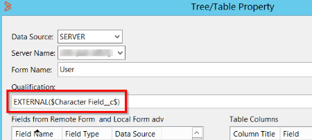
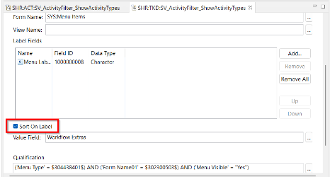

The Advanced filter component enables you to apply advanced filtering options to the fields on a form for which a Progressive view is enabled. You can configure this component on the Table field inDeveloper Studio. After you configure this component, you can view it in a Progressive view. The Advanced filter component is a UI element. It is not related to the Filter, which is a workflow component in AR System.

The following image shows an Advanced filter in a progressive view:

Related topics

[Defining-tables-to-display-data](https://docs.bmc.com/xwiki/bin/view/Service-Management/Innovation-Suite/BMC-Helix-Innovation-Suite/is254/Developing-applications-by-using-Developer-Studio/Developing-the-application-interface/Defining-tables-to-display-data/)

[Creating-a-faceted-filter](https://docs.bmc.com/xwiki/bin/view/Service-Management/Innovation-Suite/BMC-Helix-Innovation-Suite/is254/Developing-applications-by-using-Developer-Studio/Developing-the-application-interface/Defining-tables-to-display-data/Creating-a-faceted-filter/)

The following table lists the characteristics of the Advanced filter:

| Characteristic  | Example  |
| --- | --- |
| Dependent filter values  | Depending on the value that you select in one filter, the values in another filter are populated.  |
| Filter options within a filter  | The Asset Console features options, such as People, Support Group, and Organization.  |
| Filter within filter  | The Operating System section in the Asset Console features filters within a filter.  |
| Specifying a custom display by overriding type  | The CPU Count section in the Asset Console lets you specify a custom display by overriding type.  |
| Specifying the display position of a filter  | The Change Calendar filter in Change Request section lets you specify its display position.  |
| Default options based on the logged in user  | The To be approved by (Me, My Support Groups) and Schedule dates (24H, 48H) filters in the Ticket Console section feature the default options based on the logged in user.  |
| Associating a menu to a filter  | The filters in the Ticket Console section associate a menu with them.  |

To support the Advanced filtering component for progressive views, the following properties are added inDeveloper Studio:

| Property name  | Applicable for field  | Property value  | Description  |
| --- | --- | --- | --- |
| Filter  | * Table - List View * Table - Cell Based | * True * False (Default) | Specifies if the Advanced filter is to be enabled at table-level.  |
| Filter External ID  | * Table - List View * Table - Cell Based | A field ID  | Specifies the external ID of the Advanced filter.  |
| Filter  | Column  | * True * False (Default) | Specifies if the Advanced filter is to be enabled at column-level.  |
| Display As Select  | Column  | * True * False (Default) | Specifies if the options in the Advanced filter are to be displayed as check boxes that you can select.  |
| Use Value As Qualification  | Column  | * True * False (Default) | Specifies if the value of a menu that contains a qualification is to be used as is when you apply the Advanced filter.  |
| Filter QBE Match  | Column  | * Anywhere * Equals * Leading (Default) | Specifies the Query By Example (QBE) match for the Advanced filter.   * Leading—The leading characters in the query string are matched. * Equals—The characters in the query string are precisely matched. * Anywhere—The characters in the query string are matched irrespective of their location. |
| Filter Display Order  | Column  | An Integer  | Specifies the order for a menu item in the Advanced filter.  |
| Menu Name  | Column  | You must associate a menu of type search to this property.  | Specifies a search menu for the filter. You have to set the type Search for the menu. You can use this only when the Filter property value is set to**True**and is mapped to a character field. This property takes precedence over the Menu Name property under Attributes of the character field. The following video clip shows how you can associate a Menu Name property with a predefined search menu. In this example, we associate Menu Name with Menu:Features so that end users in the custom application see searchable options from Menu:Features. Another example where you can use this property is for usernames that you want displayed when users type in a search field.  |
| Button Field  | Button  | You must associate a field of type filter to the Button Field property  | Displays a filter in place of a button. Use this property to provide a button ID to display the filter in place of a button. This property is available in the Filter section. The following video clip shows how you can display a filter in the place of a button. The initial steps inDeveloper Studioinvolve associating a predefined filter with the button:    |
| Groups  | Table  | You must associate a group.  | Creates a group of filters within one section.  Click the property to launch a dialogue where you can define a group. This property is available only when you set the Filter Type to Advanced. Only the following filters types are allowed to be part of groups:   * Character This can be with or without a menu. * Integer * Selection This filter type is always rendered as checkboxes.  The following video clip shows how you can add a filter to a filter group:  |
| Show Apply Button  | * Table - List View * Table - Cell Based | * False (Default) * True | Specifies if the**Apply filters**button is to be shown on the filter. In addition, it also displays the**Cancel**and**Remove all**, buttons. This property is available in the Filter section only when you set the Filter Type to Advanced. The following video clip shows how you can add the**Apply filters**, Cancel, and the**Remove all**buttons.  |
| Filter Visibility  | Table Column  | * False (Default) * True | Set this property to**True**to display a filter.  This property is available in the Filter section. You can add this property if the column Filter property value is set to**True**  |
| Generate Qualification  | Table Column  | * False (Default) * True | Generates a filter qualification when end users select options. To set this property, the Filter property must be set to**True**and Table Type must set to Advanced. Use the following command in an active link along with the Generate Qualification property to fetch the generated qualification:  |

## To configure the Advanced filter component

You must set the values for the properties that are available for the Table field and the Column field.

### To set the values for the properties for the Table field

1. On the progressive view of a form, double-click a Table field.
2. On the**Properties**panel, under the Attributes group, for the Filter property, select the**True**value.
3. Beside the Qualification Field property, in the Value column, click the ellipsisbutton.  
   The Qualification Field dialog box opens.
4. Select a field from the available fields, and then click**OK**.  
   The values for the properties for the Table field are set.
5. Under Attributes, beside Tree/Table Property, in the Value column, click the ellipsisbutton and add the following additive qualification:  
   **EXTERNAL($*qualificationField*$)**
6. Save the changes.

### To set the values for the properties for the Column field

1. In the**Value**column for the Tree/Table Property property, click the ellipsis button.
2. On the**Tree/Table Property**dialog box, add a field as a table column, and then click**OK**.
3. Double-click the column field on the table, and then for the Filter property, select the**True**value.
4. Drag a Character field to the form, and then double-click it to view the**Properties**panel.
5. In the**Value**column for the Menu Name property, click the ellipsis button.
6. On the**Menu Name**dialog box, select a menu of type Search from the available menus, and then click**OK**.
7. Double-click the Table field, in the**Value**column for the Tree/Table Property property, click the ellipsis button.
8. On the Tree/Table Property dialog box, add the Character field with a menu that you've added in step 6 as a table column, and then click**OK**.
9. Double-click the column that you've added in step 8, and then for the Filter property, select the**True**value.
10. Select a value for the following properties as required:
    1. Display As Select
    2. Use Value As Qualification
    3. Filter QBE Match
    4. Filter Display Order
11. Click**Save**to save your settings.

**Tip**

To display the filter labels in alphabetical order on the PWA screen, you must select**Sort On Label**in the menu as shown in the following example:

