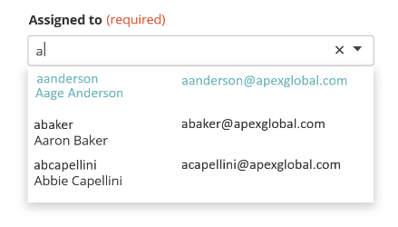
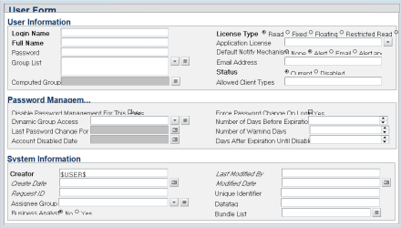
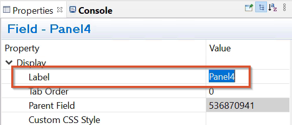
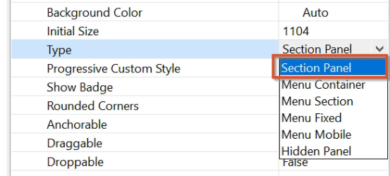
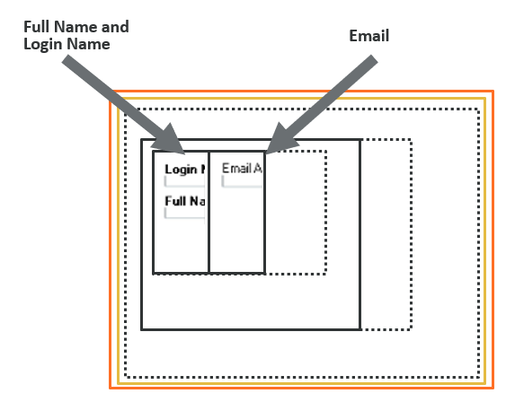
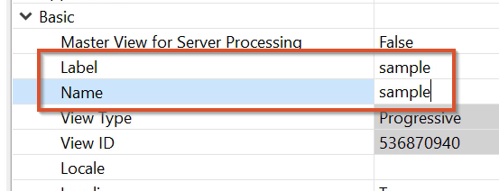

As an application developer, you can create search menus for Progressive Web Applications (PWA). These search menus improve the user experience by providing suggestions that help application users with populating fields.

search menus with display property set to Menu Section present diverse information with better formatting compared to search menus set to Section Panel. Search menus displaying multiple types of information with better formatting have improved readability and easier navigation.

Related topics

[UI-layout-of-Progressive-Web-Applications](https://docs.bmc.com/xwiki/bin/view/Service-Management/Innovation-Suite/BMC-Helix-Innovation-Suite/is254/Developing-Progressive-Web-Applications/UI-layout-of-Progressive-Web-Applications/)

[Flow-panel-holders-for-Progressive-Web-Applications](https://docs.bmc.com/xwiki/bin/view/Service-Management/Innovation-Suite/BMC-Helix-Innovation-Suite/is254/Developing-Progressive-Web-Applications/Flow-panel-holders-for-Progressive-Web-Applications/)

[Creating-search-menus](https://docs.bmc.com/xwiki/bin/view/Service-Management/Innovation-Suite/BMC-Helix-Innovation-Suite/is254/Developing-applications-by-using-Developer-Studio/Developing-the-application-interface/Defining-application-menus/Creating-search-menus/)

Scenario

At Apex Global, Seth the developer wants to create an**Assigned to**field that enables application users to assign a ticket to an employee in Apex Global. Seth has found that application users search by using either the username, employee name, or email ID. To improve the search experience, Seth wants to create search suggestions in the**Assigned to**field which shows the username, employee name, and email ID, so that application users find it easier to search for the appropriate employee.

## Before you begin

You must have a form that has the data required by the search menu with display property set to Menu Section .

## To create smart menus in Progressive Web Applications

The following video (3:28) and procedure describe the example of creating a search menu with display property set to Menu Section by using data from the User Form.

[🎥 Watch Video: https://www.youtube.com/watch?v=1QHi28coXqw](https://www.youtube.com/watch?v=1QHi28coXqw)

<https://www.youtube.com/watch?v=1QHi28coXqw>

### To create the panels with fields

1. In Developer Studio,open the User Form.  
   

1. Create a Progressive View.

   

Steps (2)

<ol><li>Select<strong>Form &gt; Create New View</strong>. The Create New View dialog box opens.</li><li>In the<strong>View Type</strong>list, select<strong>Progressive</strong>.  Developer Studioautomatically creates a Section Panel.</li></ol>

2. Right-click within the section panel and create a flow panel holder in the current view.  
   **Create a New Field > In Current View > Flow Panel Holder**  
     
   Adjust the panel size to allow the addition of more panels. You can see in the Outline pane that a new panel holder and panel are created.
3. Name the new panel holder and panel.  
   In this example, the names are**Panel Holder4**and**Panel 4**.  
   
4. Select**Panel4**and in Properties, set**Display > Type**to**Section Panel**.  
   

1. Inside**Panel4**, create another flow panel holder.

1. Name the panel holder and panel.  
   For example,**Panel Holder5**and**Panel5**.
2. Create another panel within**PanelHolder5**.  
   You can see the two new panels within the panel.  
   

1. Select the two newly created panels.
2. In Properties, set**Progressive Desktop > Progressive Width.**In this example, the value is set to**6/12**. These two panels occupy half the screen according to the 12-column layout. You can set**Progressive Width**to any other value based on how you want to
3. Add the**Login Name**,**Full Name**, and**Email Address**fields by navigating to**Form**>**Add/Remove Fields in View**.  
   These are the fields that are displayed by the search menu with display property set to Menu Section.  
   

1. Select the two panels containing the**Login Name**,**Full Name**, and**Email Address**fields and in Properties, set**Display**>**Type**to**Menu Section**.

   **Best practice**  
   When creating search menus with display property set to Menu Section, include only the following fields or objects within the view:

   * Character
   * Trim Text
   * Check Box
   * Radio Button
   * Date
   * Panel
   * Drop-Down List
2. Change the**Label**and**Name**property of the view to**sample**.  
   

### To create the search menu

1. Create a search menu.  
   
2. In the search menu, in the**Form Name**field, type**U****ser**, and in the**View Name**field, type**sample**.  
   The**View Name**must refer to the view that we just created and named as**sample**.
3. Under**Label fields,**add the three fields**Email Address**,**Full Name**, and**Login Name**.
4. In**Value Field**, type**Login Name**.
5. In Qualification, type**1=1**.
6. Save the menu as**sample\_menu**.
7. Create a form in Progressive View with a character field.  
   Name the form and the field.
8. Select the character fields and change the**Menu Name**property to**sample\_menu**.
9. Set the**Chunk Size**property to 5.  
   Chunking helps with the performance of the search menu with display property set to Menu Section.
10. Save the changes.
11. Open the Mid Tier configuration tool and sync the cache.  
    **http://<*MidtierHostName*>:<*PortNumber*>/arsys/shared/config/config\_cache.jsp**

## To validate the search menu in Progressive Web Applications

1. In a browser, log in to PWA.  
   (*On-premise*)**http://<*midtierHostName*>:<*portNumber*>/arsys/pwa/#/login**(*helix*)**http://<*helixBaseURL*>/arsys/pwa/#/login**
2. Change the URL to include the Progressive View form that you created in Developer Studio.
3. (*On-premise*)**http://<*midtierHostName*>:<*portNumber*>/arsys/pwa/#/forms/<AR\_Server\_Name>/<formName>/**

   (*helix*)**http://<*helixBaseURL*>/arsys/pwa/#/forms/<AR\_Server\_Name>/<formName>/**
4. In the character field, start typing any name.The search menu displays search suggestions consisting of multiple types of information in a well-formatted way.  
   

**Important**

The following table helps you understand the differences between the Menu Section property and the Section Panel property so that you can decide the appropriate option:

| Property  | Behavior  |
| --- | --- |
| Menu Section  | A panel with the**Display > Type**property set to**Menu Section**retains the relative positions of the fields that it encloses when displayed on the PWA screen. The following example illustration shows two fields within the menu section positioned one above another in Developer Studio are displayed one above another on PWA screens as well.   |
| Section Panel  | A panel with the**Display > Type**property set to**Section Panel**does not retain the relative positions of the fields it encloses when displayed on PWA screens. The following illustration shows an example of two fields arranged one above another in Developer Studio. However, on a PWA screen, they are displayed side-by-side.   |