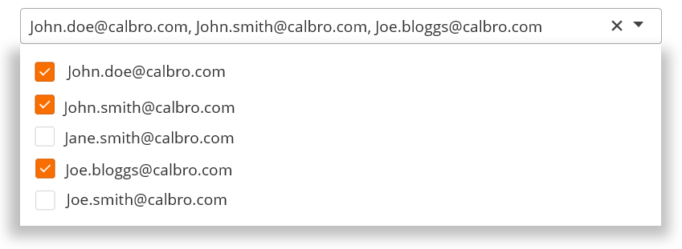
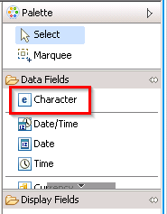
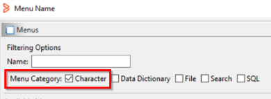

As an application developer, you can create a list where application users can select multiple options. Users can use this list to populate a field.

Example scenario: selection of multiple stakeholders

Seth, the developer wants service desk agents to add a number of stakeholders to the list of people who are notified about the status changes of a ticket.

For this, Seth wants to create a selection field consisting of stakeholders listed with check boxes against each name so that the service desk agent can quickly select and add stakeholders to the CC list.

## To create selection lists in Progressive Web Applications

1. InDeveloper Studio, create a Progressive View.
2. Drag and drop**Character**into the view.  
   
3. Select the character field.  
   
4. In the Properties tab, beside**Attributes >****Menu Name**, click the ellipsis () button.  
   The Menu Name dialog opens.
5. In the**Name**field, enter the name of the form which contains the options you want to display in the list.  
   You must select a menu of category Search.  
   
6. In the**Menu Style**list, select**Append**.  
   If you select**Overwrite**, you get a list that allows selecting only one item.
7. In the**Display > Display Type**list, select**Drop-Down List**.
8. (*Optional*) Under**Display**, in the**Menu Delimiter**field, enter the character that should appear between the selected options when this data is saved.  
   For example, if you enter a slash (/) as the delimiter, you generate the following data within the application:  
   Option1/Option2/Option3  
   Irrespective of the delimiter you specify, application users see a comma (,) as the delimiter in the field.
9. Save the changes.

## Validating the multiple selection list in PWA

1. In a browser, log in to PWA.  
   **<*serverName*>:8080/arsys/pwa/#/login**
2. Change the URL to include the Progressive View form that you created inDeveloper Studio.**<*serverName*>:8080/arsys/pwa/#/forms/<*serverName*>/<*formName*>/<*viewName*>**
3. (*Optional*) If you want to display more changes you made inDeveloper Studio, you must sync the cache in Mid Tier.
   1. Log in toMid Tierconfiguration.  
      **<*serverName*>:8080/arsys/shared/config/config.jsp**
   2. Click**Sync Cache**.
   3. Refresh the browser displaying the progressive view form.

Related topics

[Creating-fields-that-auto-complete-in-Progressive-Web-Applications](https://docs.bmc.com/xwiki/bin/view/Service-Management/Innovation-Suite/BMC-Helix-Innovation-Suite/is254/Developing-Progressive-Web-Applications/Creating-fields-that-auto-complete-in-Progressive-Web-Applications/)

[Creating-dynamic-selection-lists-for-Progressive-Web-Applications-by-using-JSON-data](https://docs.bmc.com/xwiki/bin/view/Service-Management/Innovation-Suite/BMC-Helix-Innovation-Suite/is254/Developing-Progressive-Web-Applications/Creating-dynamic-selection-lists-for-Progressive-Web-Applications-by-using-JSON-data/)

[Adding-mention-for-fields-in-Progressive-Web-Applications](https://docs.bmc.com/xwiki/bin/view/Service-Management/Innovation-Suite/BMC-Helix-Innovation-Suite/is254/Developing-Progressive-Web-Applications/Adding-mention-for-fields-in-Progressive-Web-Applications/)