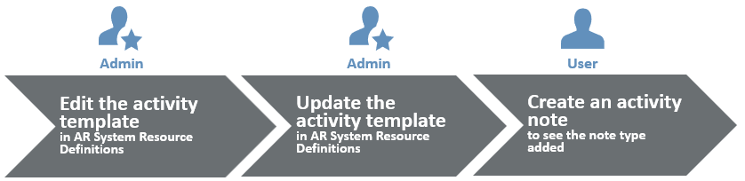
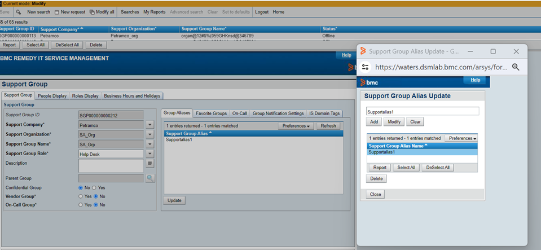

Consider the following best practices when developing or customizing Progressive Web Applications (PWA).

Adhering to these best practices helps you to achieve the following outcomes:

* Leverage the full potential of PWA features, such as responsiveness.
* Enhance the experience of your application users.
* Avoid errors when running workflows.

## Whitepaper on PWA implementation methodology

Make sure that you read the whitepaper at the following link before referring to the best practices in this topic:[Community blog: Whitepaper on ITSM PWA Implementation Methodology](https://community.bmc.com/s/news/aA33n000000TXSHCA4/bmc-helix-itsm-pwa-implementation-methodology)

The information in the whitepaper helps you achieve the following objectives:

* Understand PWA concepts
* Learn how Smart IT PWA screens are developed
* Perform customization and localization of PWA screens

**Important**

Before enabling Progressive Views, make sure that you haveAR System server, Mid Tier, and Developer Studio version 20.08 or later installed.

Related topics

[Developing-Progressive-Web-Applications](https://docs.bmc.com/xwiki/bin/view/Service-Management/Innovation-Suite/BMC-Helix-Innovation-Suite/is254/Developing-Progressive-Web-Applications/)

[UI-layout-of-Progressive-Web-Applications](https://docs.bmc.com/xwiki/bin/view/Service-Management/Innovation-Suite/BMC-Helix-Innovation-Suite/is254/Developing-Progressive-Web-Applications/UI-layout-of-Progressive-Web-Applications/)

[Adding-rich-text-fields-in-Progressive-Web-Applications](https://docs.bmc.com/xwiki/bin/view/Service-Management/Innovation-Suite/BMC-Helix-Innovation-Suite/is254/Developing-Progressive-Web-Applications/Adding-rich-text-fields-in-Progressive-Web-Applications/)

[Panel-holder-display-types-in-Progressive-View](https://docs.bmc.com/xwiki/bin/view/Service-Management/Innovation-Suite/BMC-Helix-Innovation-Suite/is254/Developing-Progressive-Web-Applications/Panel-holder-display-types-in-Progressive-View/)

## Use supported fields and properties in Progressive View

You must only use the fields supported by progressive views to build a Progressive Web Application.For each field on a form, the**Properties**tab in Developer Studio lists the properties of that field.

Fields and properties help you perform the following tasks:

* Create elements in your application interface.
* Set properties that determine the look and behaviorof the field during operations performed in a browser.

The properties listed in the**Properties**tab vary depending on the type of field you create or modify.For the list of supported fields and properties, see[Field properties](https://docs.bmc.com/xwiki/bin/create/Service-Management/Innovation-Suite/remedyservermaster/Developing-applications/Developing-the-application-interface/Creating-and-managing-fields/Field-Properties/WebHome?parent=Service-Management.Innovation-Suite.BMC-Helix-Innovation-Suite.is254.Developing-Progressive-Web-Applications.Customization-best-practices-for-developing-PWA.WebHome).

## Set permissions, visibility, and hierarchy for fields and sections

When creating fields and sections, you must adhere to the following best practices:

* Set section panel permissions for users to be able to view the section panel and its contents.
* In a panel, set the**Visible**property to**True**to enable users to see the contents of that panel.
* Share the same panels between multiple form views where required.  
  Display properties are associated with specific views and do not interfere with other form views, unlike other properties.
* Move temporary fields that don't need localization outside the form view while keeping them within the form.  
  Use the Add/Remove Fields in View dialog to move a field out of the view.
* Maintain panel and field hierarchy—Do not place fields and flow panels at the same level in the hierarchy.  
  The following illustration shows how the hierarchy should appear inDeveloper Studio:  
  

The following video (1:14) demonstrates the best practices when creating fields and sections:

[🎥 Watch Video: https://www.youtube.com/watch?v=uKdaUBgwfJg](https://www.youtube.com/watch?v=uKdaUBgwfJg)

<https://youtu.be/4QzFHEaRwIM><https://youtu.be/uKdaUBgwfJg>

Skip to specific parts of the video:

[0:06](https://www.youtube.com/watch?v=uKdaUBgwfJg&t=6s)Setting panel permissions for users  
[0:24](https://www.youtube.com/watch?v=uKdaUBgwfJg&t=24s)Maintaining panel and field hierarchy  
[0:41](https://www.youtube.com/watch?v=uKdaUBgwfJg&t=41s)Setting panel visibility

## Best practices to create and use flow panel holders

A Flow panel holder is available when you enable a Progressive view for your form. For more information, see[Progressive View quick start guide](https://docs.bmc.com/xwiki/bin/view/Service-Management/Innovation-Suite/BMC-Helix-Innovation-Suite/is254/Getting-started/Key-concepts/Application-development-overview/Progressive-View-quick-reference-guide/).The Flow panel holder supports the properties required to enable a progressive view. Use a Flow Panel holder for aligning fields on a form. You can also group the fields to ensure correct alignment of fields on a form. This panel does not have a panel header, and supports Container panel holder (Default), Sub Panel holder, and Section Panel holder types.The following video (4:52) demonstrates creating Fixed panels in Developer Studio when you enable progressive views for a form:

[🎥 Watch Video: https://www.youtube.com/watch?v=m33BWG-mEoI](https://www.youtube.com/watch?v=m33BWG-mEoI)

<https://youtu.be/m33BWG-mEoI>The following video (13:03) demonstrates creating complex layouts with flow panels:

[🎥 Watch Video: https://www.youtube.com/watch?v=TnwUS2RF28Q](https://www.youtube.com/watch?v=TnwUS2RF28Q)

[https://youtu.be/TnwUS2RF28Q](https://youtu.be/TnwUS2RF28Q)

### Panel arrangement sequence

The panels are arranged in the following sequence or hierarchy:  
Flow Panel holder > Container Panel Holder > Container Panel> Sub Panel Holder > Sub Panel > Section Panel Holder > Section Panel > Section Panel Holder > Section Panel > fields

* A progressive view can hold only a Container type Flow panel holder and a Fixed panel holder.
* By default, a Flow panel holder has one panel as a child panel.
* You can change the read-only property type of any panel only when you change the property type of Flow panel holder.

**Tip**When you add Flow Panel Holder to the Progressive View from the palette in Developer Studio, the flow panel holder is represented by a panel holder in the Outline pane.In the following example figure, the flow panel holder is represented by**Panel Holder\_c**enclosing a panel named**Panel\_c**:

### Container Flow panel holder

* By default, a Container type Flow panel is added to a Flow panel holder.
* You can delete a Container Flow panel only if you remove all progressive views.
* A Container Flow panel holder can have one or more Sub panels.

### Section Flow panel holder

* You can add a Section Flow panel holder only under a Sub panel or Section panel.
* A Section panel can either have a Section type Flow panel holder or non-panel fields.
* The Section Flow panel holder added by framework contains only Section panel as children.

### Sub panel holder

The Sub panel holder behaves as a Section panel on the desktop client. However, it is displayed as a tab on a mobile client.

* You can add a sub panel holder only under the container panel.
* A sub panel holder can have one or more sub panels.

For more information about developing PWA, see[Developing-Progressive-Web-Applications](https://docs.bmc.com/xwiki/bin/view/Service-Management/Innovation-Suite/BMC-Helix-Innovation-Suite/is254/Developing-Progressive-Web-Applications/).

<https://youtu.be/m33BWG-mEoI>The following video (13:03) demonstrates creating complex layouts with flow panels:

[🎥 Watch Video: https://www.youtube.com/watch?v=TnwUS2RF28Q](https://www.youtube.com/watch?v=TnwUS2RF28Q)

[https://youtu.be/TnwUS2RF28Q](https://youtu.be/TnwUS2RF28Q)

### Panel arrangement sequence

The panels are arranged in the following sequence or hierarchy:  
Flow Panel holder > Container Panel Holder > Container Panel> Sub Panel Holder > Sub Panel > Section Panel Holder > Section Panel > Section Panel Holder > Section Panel > fields

* A progressive view can hold only a Container type Flow panel holder and a Fixed panel holder.
* By default, a Flow panel holder has one panel as a child panel.
* You can change the read-only property type of any panel only when you change the property type of Flow panel holder.

**Tip**

When you add Flow Panel Holder to the Progressive View from the palette in Developer Studio, the flow panel holder is represented by a panel holder in the Outline pane.

In the following example figure, the flow panel holder is represented by**Panel Holder\_c**enclosing a panel named**Panel\_c**:

### Container Flow panel holder

* By default, a Container type Flow panel is added to a Flow panel holder.
* You can delete a Container Flow panel only if you remove all progressive views.
* A Container Flow panel holder can have one or more Sub panels.

### Section Flow panel holder

* You can add a Section Flow panel holder only under a Sub panel or Section panel.
* A Section panel can either have a Section type Flow panel holder or non-panel fields.
* The Section Flow panel holder added by framework contains only Section panel as children.

### Sub panel holder

The Sub panel holder behaves as a Section panel on the desktop client. However, it is displayed as a tab on a mobile client.

* You can add a sub panel holder only under the container panel.
* A sub panel holder can have one or more sub panels.

For more information about developing PWA, see[Developing-Progressive-Web-Applications](https://docs.bmc.com/xwiki/bin/view/Service-Management/Innovation-Suite/BMC-Helix-Innovation-Suite/is254/Developing-Progressive-Web-Applications/).

## Best practices when localizing Progressive Web Application screens

Use the localization toolkit and the AR System Message Catalog form to localize your Progressive Web Application (PWA).

You must adhere to the following best practices when localizing a PWA:

* Use independent forms only so that the related Active Links and Filters are also considered.
* For the form fields that you want to localize, set the value of the "Localize Label" property in Display Properties to**True**.
* When you delete a package definition, the package definition is deleted, but the extracted strings are not deleted from the localization database. If you create a package definition with the same name as the deleted one and export, you get the extracted strings from the deleted package definition as well. To avoid this issue, we recommend that you explicitly delete those strings from the database.

For more information about localizing PWA, see[Localizing-a-Progressive-Web-Application](https://docs.bmc.com/xwiki/bin/create/Service-Management/Innovation-Suite/remedyservermaster/Developing-a-Progressive-Web-Application/Localizing-a-Progressive-Web-Application/WebHome?parent=Service-Management.Innovation-Suite.BMC-Helix-Innovation-Suite.is254.Developing-Progressive-Web-Applications.Customization-best-practices-for-developing-PWA.WebHome).

## Update associated workflows when altering Drop-Down List fields

As a developer, you can create a list for PWA users by using the Drop-Down List field. The following graphic shows an example Drop-Down List field:

The Drop-Down List field lists the options that you add by using the Selections dialog box. You must then define active links that refer to these selection values. You must make sure that you do not remove any of the selections shown in the following example graphic:  

For example, if you delete any of the selections in the Selection dialog, the Progressive Web Application users see a blank field in place of the drop-down list. This is because the active link that opens the drop-down list refers to these three options.When one option is missing, the active link breaks the workflow and the field does not get displayed. If you must delete any of the selections, you must also make sure that the associated workflows referring to the selections are updated accordingly.

The following video (1:00) explains the best practice of making sure workflows are updated along with selection lists.

[🎥 Watch Video: https://www.youtube.com/watch?v=4QzFHEaRwIM](https://www.youtube.com/watch?v=4QzFHEaRwIM)

<https://youtu.be/4QzFHEaRwIM>

## Check execution order when modifying workflows

When adding any additional steps in your workflows, you must do the following:

1. Get to know the execution order of all the other existing workflows by viewing the active link logs.
2. Add the additional workflow with the correct execution order depending on the outcome you want to achieve.

The following video (0:52) demonstrates how to view and set the execution order of workflows:

[🎥 Watch Video: https://www.youtube.com/watch?v=gaXqNLvCdBA](https://www.youtube.com/watch?v=gaXqNLvCdBA)

<https://youtu.be/4QzFHEaRwIM><https://youtu.be/gaXqNLvCdBA>

## Best practice to display activity note type in Smart IT by updating the activity template

When Smart IT PWA screen users create a new note, they can select a note type. But by default, the note type is not displayed in the activity pane. In this example procedure, we update the activity template in the AR System Resource Definitions form so that the Smart IT activity note information displays the activity note type.

The following graphic shows a high-level overview of the steps you need to perform in this procedure.

The following video (2:01) shows how to display the activity note type to the activity note message inITSM: Smart IT.

[🎥 Watch Video: https://www.youtube.com/watch?v=-npsSMfbvs](https://www.youtube.com/watch?v=--npsSMfbvs)

[https://youtu.be/-npsSMfbvs](https://youtu.be/--npsSMfbvs)

## To update activity template to display activity note type in the Activity tab

1. Search and download the**SHR\_SV\_Activity\_Template\_Generic.html**template file.
   1. Open the AR System object list page and AR System Resource Definitions form.  
      **http://<MidtierHostName>:PortNumber>/arsys/forms/<AR\_Server\_Name>/AR+System+Mid+Tier+Object+List**
   2. In the**Name**field, enter**AR System Resource Definitions form**.
   3. Click**Open Search**to open the form in search mode.  
      The**AR System Resource Definitions**form opens.
   4. In the**AR System Resource Definitions**form, in the**Name**field, enter**SHR\_SV\_Activity\_Template\_Generic.html**.  
      
   5. Click**Search**.  
      The search result shows SHR\_SV\_Activity\_Template\_Generic.html
   6. In the Resource section, select**SHR\_SV\_Activity\_Template\_Generic.html**.
   7. Click**Save to Disk**.
2. Open the**SHR\_SV\_Activity\_Template\_Generic.html**template file in a source code editor such as Notepad++.
3. Add the following variable in the template file:  
   **varworkLogType= $<field ID>$**
4. Replace the field ID with the field ID of the incident, which is 304427491.  
   The field ID is 304422931 for work orders. After this change, you have the following line of code:  
   **varworkLogType=`$304427491$`;**
5. In the template file, search for the following line of code:  
   **messageText = peopleText + valField\_0 + ' ' + addedNoteStr + ' ' + generateLinkForURL(valField\_1)**
6. Replace it with the following line of code to add the note type variable to the activity notes message:  
   **messageText =****peopleText**+**valField\_0 + ' ' + addedNoteStr + ' ( ' + notetype + ' )' + ' ' + generateLinkForURL(valField\_1);**
7. Save the changes to the template file.
8. In the AR System Resource Definitions form, delete the existing template file (SHR\_SV\_Activity\_Template\_Generic.html) and add the file you just updated.
9. Open the Mid Tier configuration tool and flush the cache to update the changes.
10. OpenITSM: Smart ITand create a new note in the incident page.  
    You can see that the note type information is displayed in the activity note message.

## Create custom activity messages

Create custom activity messages in Smart IT PWA screens. For example, you can change the activity messages to show more information on the changes that were made by a specific user.

The following video (3:16) show how you can change the activity message that is displayed in Smart IT PWA screens.

[🎥 Watch Video: https://www.youtube.com/watch?v=GPqPunk1z\_8](https://www.youtube.com/watch?v=GPqPunk1z_8)

<https://youtu.be/GPqPunk1z_8>

## Identify missing active link guides during customization

When customizing the PWA, you might have to change workflows such as active links and filters. When updating workflows, make sure that the active link guides are not edited or removed in Developer Studio. If the custom message does not appear as expected, it is important to check the logs to see if the active link guides or any workflows are not working as expected.

The following video (1:03) shows you how to make sure the active link guides are working.

[🎥 Watch Video: https://www.youtube.com/watch?v=6De09pnOPqY](https://www.youtube.com/watch?v=6De09pnOPqY)

<https://youtu.be/6De09pnOPqY>

## Change the chunk size in search fields for optimum results and performance

Search fields on PWA screens have a**Chunk Size**display property in Developer Studio that determines the maximum number of matching results that are displayed.  
In the following example graphic,**Chunk Size**is set to**5**and hence not more than 5 matching results are displayed.

To view all the search suggestions, set the**Chunk Size**property for the field to zero.

Setting**Chunk Size**to zero might affect the performance of the application based on factors such as database size.

We recommend that you optimize the chunk size to view the required number of results while making sure performance is reasonable.

The following video (0:17) shows how to change the chunk size of a field in Developer Studio.

## Display messages in prompt bar instead of pop-up window when loader is enabled

To display a message to the application user after an active link executes, use the Message section of the Active Link in Developer Studio to add the message and the message text.

When displaying a message through an active link, you must ensure the following best practices:

* To show the message with the loader enabled, you must select**Show Message in Prompt Bar**in the active link message settings.  
    
  For example, if you have created a message action that is followed by theENABLE-WAIT-CURSOR-ON-LONGRUNNING  
  PROCESScommand to display the loader, you must select**Show Message in Prompt Bar**to make sure the workflow is not interrupted. For more information about theENABLE-WAIT-CURSOR-ON-LONGRUNNING-PROCESScommand, see[Process-commands](https://docs.bmc.com/xwiki/bin/create/Service-Management/Innovation-Suite/remedyservermaster/Developing-applications/Defining-workflow-to-automate-processes/Specifying-workflow-actions/Using-Run-Process-and-PROCESS-commands/Process-commands/WebHome?parent=Service-Management.Innovation-Suite.BMC-Helix-Innovation-Suite.is254.Developing-Progressive-Web-Applications.Customization-best-practices-for-developing-PWA.WebHome).
* To show the message as a pop-up window, you must set the message to display before theENABLE-WAIT-CURSOR-ON-LONGRUNNING-PROCESScommand runs.

## Text with ampersand (&) must have spaces to avoid matching with HTML elements

Plain text with an ampersand (&) that is not preceded and followed by spaces is processed as HTML. If you have any plain text containing ampersand (&), make sure is preceded by and followed by a space.

For example, if you add a value such as**Test&amplitude**, the portion of the string**&amp**is assumed to be an ampersand (&), and that value is replaced by**Test&litude**.

## Use active links to fetch labels of list options

InITSM, when character fields are associated with a menu, the value of the label for the menu and the value returned by the menu are different. In such cases, you must use an active link workflow with**Menu Choice**selected as the**Execution Option**to set the label based on the value returned by the menu.

The following active link is an example of an active link which resets the field back to the label of the option selected by application users:

CHG:Infrastructure Change form, Field ID: 1000000881, z1D Status Reason field in Best Practice View, active link named CHG:SHR:SetStatusReason\_100.

However in PWA, if the field is in enabled state, upon menu selection, the system automatically fetches the label and displays it in the field. In this scenario, there is no need to write an explicit workflow.

**Important**

If the field is in disabled or read-only state, you must create an active link that fetches the label of the selected option.  
You can create an active link similar to the active link CHG:SHR:SetStatusReason\_100 mentioned in the example.

## Avoid selection fields when using autocomplete

When you create a search field in Developer Studio that has autocomplete, make sure you avoid adding fields with**Selection**as a the data type. The following fields are of data type**Selection**:

* Drop-Down List
* Radio Button
* Check Box

If any of these fields of selection data type exist in the source forms that provide the data for the search field, the autocomplete may not work as expected.

## Set Display Type to correctly display phone numbers or email IDs in character fields

When you display an email ID or a phone number in a character field on a PWA screen, the phone number or email ID may not display correctly when they are longer than usual. To avoid this, you must select the following display type properties for the character field:

| information to display  | Property to add to character field  |
| --- | --- |
| Email ID  | **Display Type > Email ID**  |
| Phone number  | **Display Type > Phone Number**  |

Close an existing loader before opening a pop-up window

When a pop-window is set to open when there is a loader running, as a developer, you must make sure that the loader closes before the pop-up window opens.If the loader is not stopped before a pop-up window appears, the loader could prevent access to the pop-up window.

The following animation shows an example of a loader:

To make sure that the loader stops before the pop-up window opens, you must perform the following high-level steps:

1. Identify the active link that opens the pop-up window.
2. Insert the following run process before the open window action:  
   ENABLE-WAIT-CURSOR-ON-LONG-RUNNING-PROCESS 0  
   This ensures that the loader closes before the pop-up stops.
3. (*Optional*) You may run the loader again after the open window action by using the following run process:  
   ENABLE-WAIT-CURSOR-ON-LONG-RUNNING-PROCESS 1

For more information about theENABLE-WAIT-CURSOR-ON-LONGRUNNING-PROCESScommand, see[Process-commands](https://docs.bmc.com/xwiki/bin/view/Service-Management/Innovation-Suite/BMC-Helix-Innovation-Suite/is254/Developing-applications-by-using-Developer-Studio/Defining-workflow-to-automate-processes/Specifying-workflow-actions/Using-Run-Process-and-PROCESS-commands/Process-commands/).

## Enable searching by support groups aliases

As an application developer, perform the following procedure to provide your application users with the ability to search by support group aliases on PWA screens.

### Prerequisites

Create a support group alias for the support group.

1. Log into Mid Tier.
2. Open the Support Group window.  
   **Application Administration Console > Support Group > Group Alias panel**
3. In the**Support Group**tab, click**Update**.
4. In the Support Group Alias Update dialog box, create an alias for the support group.  
     
   For more information about support groups, see[Creating support groups](https://docs.bmc.com/xwiki/bin/view/Service-Management/Innovation-Suite/AR-System/ars221/Administering/Setting-up-and-modifying-Foundation-data-by-using-Application-Administration-Console/Creating-and-modifying-companies-and-organization-structures/Configuring-support-groups/Creating-support-groups/).

**To create a support group search on PWA screens**

1. Log into Developer Studio.
2. Open the CTM:Support Group Alias Lookup form.
3. Create a Progressive View for the CTM:Support Group Alias Lookup form.
4. Create a search menu based on the CTM:Support Group Alias Lookup form.  
     
   For information about creating a search menu, see[Creating search menus.](https://docs.bmc.com/xwiki/bin/view/Service-Management/Innovation-Suite/BMC-Helix-Innovation-Suite/is254/Developing-Progressive-Web-Applications/Creating-search-menus-with-better-readability-in-Progressive-Web-Applications/)
5. Attach the smart menu to the custom or overlaid support group fields in Progressive View.
6. Validate these changes by opening a ticket on a PWA screen and searching by support group alias names.  
   The following graphic shows an example where searching by support group alias names is enabled.  
   

Best practices for enhanced performance

Follow these best practices for better performance of PWA:

* Disable logs for both Mid Tier and AR System. Enable logs only when troubleshooting issues.  
  For more information, see[Enabling-logs-for-performance-issues](https://docs.bmc.com/xwiki/bin/view/Service-Management/Innovation-Suite/BMC-Helix-Innovation-Suite/is254/Troubleshooting/Enabling-and-analyzing-logs/Enabling-logs/Enabling-logs-for-performance-issues/).
* When creating workflows with multiple calls, use parallel calls.  
  This ensures that the time taken by the workflow to complete is limited to that of the longest call. If workflow calls are made one after another, then the workflow duration is the sum of the time taken for all the calls. For more information, see[Creating-active-links](https://docs.bmc.com/xwiki/bin/view/Service-Management/Innovation-Suite/BMC-Helix-Innovation-Suite/is254/Developing-applications-by-using-Developer-Studio/Defining-workflow-to-automate-processes/Creating-workflow-objects/Creating-active-links/).
* Enable archiving for transactional data for all the modules.  
  For more information, see[Archiving-data](https://docs.bmc.com/xwiki/bin/view/Service-Management/Innovation-Suite/BMC-Helix-Innovation-Suite/is254/Administering/Managing-data-and-objects/Archiving-data/).
* Write qualifications that lead to optimum SQL queries.  
  For example, avoid a qualification that will lead to a full table scan.
* Ensure that you include correct and optimized DB indexes.

## Additional resources

[Webinar: Progressive Web Apps Introduction & Best Practices](https://youtu.be/sVJXAhfVzQk)

[Webinar: Progressive Web Application (PWA) Development In Helix ITSM](https://youtu.be/-J-ENCJ8bc4)