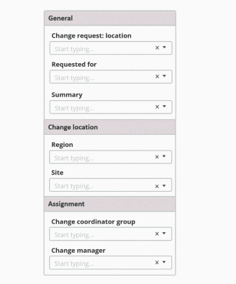
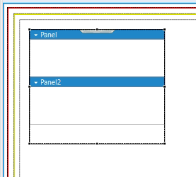

As a developer working on PWA screens, you can simplify the user experience by making use of collapsible or accordion panels to organize the options. This structure declutters the screen and helps users quickly find what they are looking for.

By using these panels, you can also make the screen more visually appealing and easier to navigate, which can lead to higher engagement and user satisfaction.

Related topic

[Flow-panel-holders-for-Progressive-Web-Applications](https://docs.bmc.com/xwiki/bin/view/Service-Management/Innovation-Suite/BMC-Helix-Innovation-Suite/is254/Developing-Progressive-Web-Applications/Flow-panel-holders-for-Progressive-Web-Applications/)

[Panel-holder-display-types-in-Progressive-View](https://docs.bmc.com/xwiki/bin/view/Service-Management/Innovation-Suite/BMC-Helix-Innovation-Suite/is254/Developing-Progressive-Web-Applications/Panel-holder-display-types-in-Progressive-View/)

[Creating-resizable-panes-in-Progressive-Web-Applications](https://docs.bmc.com/xwiki/bin/view/Service-Management/Innovation-Suite/BMC-Helix-Innovation-Suite/is254/Developing-Progressive-Web-Applications/Creating-resizable-panes-in-Progressive-Web-Applications/)

Scenario

At Apex Global, the Change Request screen has some fields that require general information such as change request location and the employee name. Seth, a developer working for Apex Global, organizes the options on this screen into different panels. The users can opt to open only those panels with fields to which they are adding information while closing the other panels. By using these panels, users can have a clutter-free and well-organized view when working with change requests.

The following animation shows an example where the fields are grouped into three panes within a Collapsible Panel Holder and displayed on a PWA screen:  

## To organize fields by using collapsible or accordion panels in Progressive Web Applications

1. In Developer Studio, create a progressive view.  
   1. Select**Form > Create New View**.  
      The Create New View dialog box is displayed.
   2. From the**View Type**list, select**Progressive**.  
        
      Developer Studioautomatically creates a Section Panel.
2. Perform one of the following steps:
   * From the Palette pane, drag a Collapsible Panel Holder into the view.  
       
     The view shows a Collapsible Panel Holder with two panels within it.  
     
   * From the Palette pane, drag Accordion Panel Holder into the view.  
     Accordion panels are similar to collapsible panels except that at least one panel is always open.
3. Click**Save**.
4. Open the Mid Tier configuration tool and sync the cache.  
   **http://<*MidtierHostName*>:<*PortNumber*>/arsys/shared/config/config\_cache.jsp**

## To test and review the panels in Progressive Web Applications

1. In a browser, log in to PWA.  
   (*On-premises*)**http://<*midtierHostName*>:<*portNumber*>/arsys/pwa/#/login**(*SaaS*)**http://<*helixBaseURL*>/arsys/pwa/#/login**
2. Change the URL to include the Progressive View form that you created in Developer Studio.
3. (*On-premises*)**http://<*midtierHostName*>:<*portNumber*>/arsys/pwa/#/forms/<AR\_Server\_Name>/<formName>/**

   (*SaaS*)**http://<*helixBaseURL*>/arsys/pwa/#/forms/<AR\_Server\_Name>/<formName>/**
4. Confirm that the collapsible and accordion panels hide or show options.