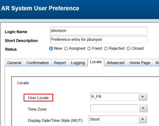
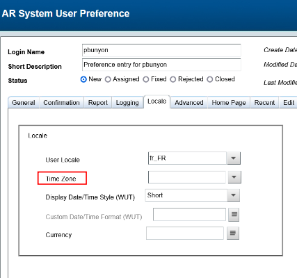
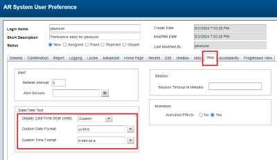

As an AR administrator, you can set preferences for web clients and Progressive Web Applications (PWA) users by using the AR System User Preference form. You can make settings for each user such as logging, locale-based settings, and so on, for better control of AR System behavior as well as better user experience.

Related topics

[Setting-user-preferences](https://docs.bmc.com/xwiki/bin/view/Service-Management/Innovation-Suite/BMC-Helix-Innovation-Suite/is254/Administering/Setting-up-users-access-and-preferences/Setting-user-preferences/)

[Developing-Progressive-Web-Applications](https://docs.bmc.com/xwiki/bin/view/Service-Management/Innovation-Suite/BMC-Helix-Innovation-Suite/is254/Developing-Progressive-Web-Applications/)

[Setting up the time zone](https://docs.bmc.com/xwiki/bin/view/Service-Management/IT-Service-Management/BMC-Helix-ITSM/itsm254/Administering/Setting-up-and-modifying-Foundation-data-by-using-Application-Administration-Console/Creating-and-modifying-companies-and-organization-structures/Setting-up-the-time-zone/)

[Updating-configuration-settings-by-using-the-AR-System-Configuration-Generic-UI-form](https://docs.bmc.com/xwiki/bin/view/Service-Management/Innovation-Suite/BMC-Helix-Innovation-Suite/is254/Administering/BMC-Helix-Innovation-Suite-configuration-references/Centralized-configuration/Updating-configuration-settings-by-using-the-AR-System-Configuration-Generic-UI-form/)

## To set the user preferences for Progressive Web Applications

1. Log into Action Request System and open the AR System User Preference form.  
   **Applications > AR System Administration > AR System Administration Console > User Preferences > My User Preferences**.
2. Set any of the following PWA-related user preferences:

   | Tab<br> | Area Name<br> | Option<br> | Description<br> |
   | --- | --- | --- | --- |
   | Logging<br> | Client<br> | Active Links<br> | Enables logging of active links on the client.<br> |
   | Server<br> | API<br> | Enables logging of APIs running on the server.<br> |
   | Filter<br> | Enables logging of filters on the server.<br> |
   | Database<br> | Enables logging of database activity.<br> |
   | Progressive View<br> | Date Field Display Settings<br><br> | Date Display Mode<br> * Use System Defined * Absolute * Relative | **Use System Defined**displays the date in the format specified by thearsystem.pwa\_date\_field\_display\_modeCCS parameter. To learn more about this CCS parameter, see[Configuring date and time formats](https://docs.bmc.com/xwiki/bin/view/Service-Management/IT-Service-Management/BMC-Helix-ITSM/itsm254/Administering/Configuring-date-and-time-formats/).<br>**Absolute**displays the full date and time when the record was created.<br>**Relative**displays the elapsed time since the record was created.<br> |
   | Start Day of Week<br> | Sets the specified day as the first day of the week.<br> |

   For a complete list of user preferences, see[Setting-centralized-preferences-with-the-AR-System-User-Preference-form](https://docs.bmc.com/xwiki/bin/view/Service-Management/Innovation-Suite/AR-System/ars221/Administering/Setting-up-users-access-and-preferences/Setting-user-preferences/Setting-centralized-preferences-with-the-AR-System-User-Preference-form/).
3. Click**Save**.

## To set centralized configuration settings parameters for Progressive Web Applications

The centralized configuration forms store the configuration settings. You can modify the settings by using the**AR System Configuration Generic UI**form. The settings are case- and space-sensitive. For more information, see[Updating-configuration-settings-by-using-the-AR-System-Configuration-Generic-UI-form](https://docs.bmc.com/xwiki/bin/view/Service-Management/Innovation-Suite/AR-System/ars221/Administering/Remedy-configuration-reference/Centralized-configuration/Updating-configuration-settings-by-using-the-AR-System-Configuration-Generic-UI-form/). For the entire list of configuration settings that are used in AR System, see[Configuration-settings](https://docs.bmc.com/xwiki/bin/view/Service-Management/Innovation-Suite/AR-System/ars221/Administering/Remedy-configuration-reference/Centralized-configuration/Configuration-settings/).

**Best practice**  
We recommend that you use the**AR System Configuration Generic UI**form to modify the configuration settings. Do not use the**ar.cfg**file to modify the configuration settings on the**AR System Configuration Generic UI**form.

1. In a browser, open the AR System Administration Console, and click**System > General > Centralized Configuration**.
2. In the AR System Configuration Generic UI form, from the**Component Name**list, select the component to which you want to add a setting.
3. Click**Add**.
4. Enter the name of the setting that you want to add and then enter its value.  
   The following table lists the PWA-related settings available in centralized configuration:

   | **Setting**<br> | **Description**<br> | **Server group configuration**<br> | **Maps to**<br> |
   | --- | --- | --- | --- |
   | **arsystem.pv\_menu\_debounce\_time**<br>(Component name: arsystem..arsys.midtier)<br> | On progressive view enabled forms, determine the wait time interval in milliseconds for sending expand menu call after entering Autokey stroke in a menu.<br>**Default value**: 500<br> | Yes<br> | **AR System Administration Console > System > General > Centralized Configuration**<br> |
   | **useARUserPreferenceForLocalization**<br>(Component type: arsystem..arsys.midtier)<br> | Use the locale set in the User Preference form as the first priority for the forms with progressive views enabled. The language the application users see is based on this setting.<br>**Valid values**:<br> * true * (Default) false<br>*Example use case:* Apex Global wants to make sure all the employees see the same language in the Progressive Web Application irrespective of the geography they log in from. Set this parameter to**true**to set the language of the Progressive Web Application according to the setting for**User Locale**in the User Preference form. Therefore, Apex Global implements a uniform locale-based experience to all its employees.<br> | Yes<br> | AR System Configuration Generic UI form.<br> |
   | **useARUserPreferenceForTimezone**<br>(Component type: arsystem..arsys.midtier)<br> | Use the time zone set in the User Preference form as the first priority for the forms with progressive view enabled. The time zone that the application users see is based on this setting.<br>**Valid values**:<br> * true * (Default) false<br>*Example use case:* Apex Global wants to make sure all the employees see the same time zone and time settings in the Progressive Web Application irrespective of the geography they log in from. Set this parameter to**true**to set the time zone of the Progressive Web Application according to the setting for**Time Zone**in the User Preference form. Therefore, Apex Global implements a uniform experience to all its employees.<br> | Yes<br> | AR System Configuration Generic UI form.<br> |
   | **useARUserPreferenceForDateTimeFormat**<br>(Component type: (Component name arsystem..arsys.midtier-DockerMTClusterUser))<br> | Use the date and time format set for**Display Date/Time Style (Web)**in the User Preference form as the first priority for the forms with Progressive View enabled. The date and time format that the application users see is based on this setting.<br><br>Valid values:<br> * **Custom** * **Short** * **Long**To learn more abut the values, see[Web-client-preferences](https://docs.bmc.com/xwiki/bin/view/Service-Management/Innovation-Suite/BMC-Helix-Innovation-Suite/is254/Administering/Setting-up-users-access-and-preferences/Setting-user-preferences/Setting-centralized-preferences-with-the-AR-System-User-Preference-form/Web-client-preferences/).<br> | Yes<br> | AR System Configuration Generic UI form.<br> |
   | **pv.enable\_attachment\_on\_delete\_confirmation**<br>(Component name:arsystem..arsys.midtier >arsystem..arsys.midtier-DockerMTClusterUser)<br> | Enables display of a confirmation message when users remove an attachment on Progressive Web Application (PWA) screens.<br>The default value for this option is**false**, which means the application does not display a message when attachments are removed. As an administrator, you can set this option to**true**to enable confirmation messages when PWA users remove attachments.<br> | Yes<br> | AR System Configuration Generic UI form<br> |
   | **pv.show\_transparent\_loader**<br>(Component name: com..arsys.server)<br> | Enables the display of a loader on PWA screens when you run the following command:<br>  ``` ENABLE-WAIT-CURSOR-ON-LONG-RUNNING-PROCESS 2 ```  **Valid values:**<br> * **true**(*Default*) * **false**To learn more about this command, see[Process commands](https://docs.bmc.com/xwiki/wiki/internal/view/Service-Management/Innovation-Suite/innovationsuitemaster/Developing-applications-by-using-Developer-Studio/Defining-workflow-to-automate-processes/Specifying-workflow-actions/Using-Run-Process-and-PROCESS-commands/Process-commands/).<br> | No | AR System Configuration Generic UI form |
   | **pv.menu.in.table.supported** (Component name: arsystem..arsys.midtier) | Enables menu attached fields and active links within cell-based tables on Progressive Web Applications (PWA) screens.  **Default value**: False | Yes | AR System Configuration Generic UI form. |

   For a complete list of configuration settings, see[Configuration settings](https://docs.bmc.com/xwiki/wiki/internal/view/Service-Management/Innovation-Suite/remedyservermaster/Administering/Remedy-configuration-reference/Centralized-configuration/Configuration-settings/).
5. Click**Apply**.
6. Click**Close**.