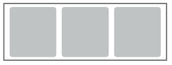

To create views for Progressive Web Applications (PWA), you must first understand that the positioning of panels containing UI elements in Progressive Views is based on the twelve-column layout explained in the following sections.

To design the views in Developer Studio, add Panels within Panel Holder, and then add fields to the Panels. You can also use nested panels and appropriately place fields within. Panels and Panel Holders create a layout for the Mid Tier.

Related topics

[Flow-panel-holders-for-Progressive-Web-Applications](https://docs.bmc.com/xwiki/bin/view/Service-Management/Innovation-Suite/BMC-Helix-Innovation-Suite/is254/Developing-Progressive-Web-Applications/Flow-panel-holders-for-Progressive-Web-Applications/)

[Panel-holder-display-types-in-Progressive-View](https://docs.bmc.com/xwiki/bin/view/Service-Management/Innovation-Suite/BMC-Helix-Innovation-Suite/is254/Developing-Progressive-Web-Applications/Panel-holder-display-types-in-Progressive-View/)

The following options are available for the Layout Style property:

* Container panel – Occupies the entire view port (100% screen width).
* Sub-panel – Holds sections. On mobile devices, occupies the entire width and is displayed as tabs.
* Section panel – Holds fields or nested sections.
* Fixed panel – Holds a section. Aligns to the bottom of a screen.

The following diagram illustrates a sample UI layout of Progressive Views:

The responsive design automatically adjusts the Panels.

## Positioning elements on the screen

Use the twelve-column layout to position elements horizontally on the screen. The following image illustrates the twelve-column layout:

A developer can implement the preceding twelve-column layout by using developer-friendly properties that are added in Developer Studio. Refer to the following example:

To create a three-column layout, set the**Progressive Width**values as follows:

* Panel 1 - 4
* Panel 2 - 4
* Panel 3 - 4

These settings create a layout with orientations that vary based on screen size.

The illustrations in the following table show how the UI layout varies according to the device and screen size:

| Device  | UI layout  |
| --- | --- |
| Desktops and tablet screens   |   |
| Mobiles screens   |   |

From the illustrations, you can see that PWA screens have the same layout in tablet views and desktop views. PWA screens display the mobile view only when you view the application screens on mobiles. As a result, you may see differences in how the application layout is displayed on tablets and desktops when compared to mobiles.