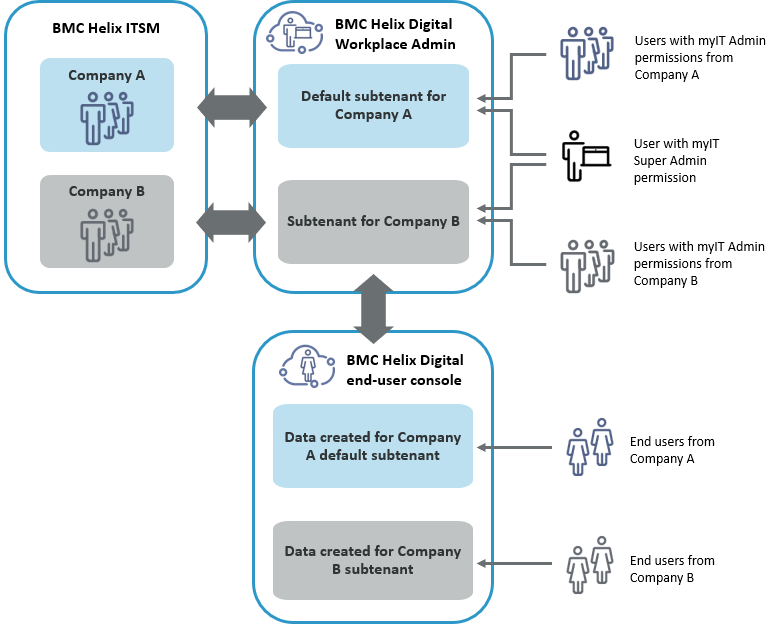
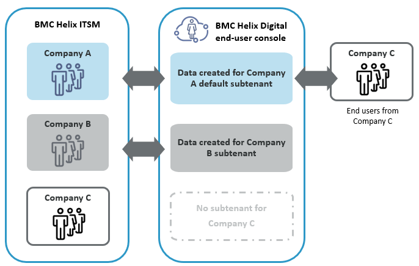

Administrators create subtenants in DWP to grant companies access to data and configurations in the application.

DWP supports the following approaches to granting access to data and configurations specific to individual companies in the application:

* Single tenancy—A single default subtenant is created in DWP. All users belong to the same company and share access to the same data and configurations. Data segregation is not supported.
* Multitenancy—At least one subtenant is created in addition to the default subtenant. Users get access only to the configuration data of the company to which they are assigned inITSMon the People form (on the**Company**field of the**General**tab). Data is segregated between subtenants.

Related topics

[Product-overview](https://docs.bmc.com/xwiki/bin/view/Service-Management/Employee-Digital-Workplace/BMC-Helix-Digital-Workplace/dwp254/Getting-started/Product-overview/)  
[Configuring-multitenancy](https://docs.bmc.com/xwiki/bin/view/Service-Management/Employee-Digital-Workplace/BMC-Helix-Digital-Workplace/dwp254/Administering/Administering-BMC-Helix-Digital-Workplace/Configuring-multitenancy/)

[License-types-and-features](https://docs.bmc.com/xwiki/bin/view/Service-Management/Employee-Digital-Workplace/BMC-Helix-Digital-Workplace/dwp254/Planning/License-types-and-features/)

## Single tenancy in DWP

By default, if only one subtenant is defined,DWPignores information about companies to which users are assigned inITSM. As a result, all users belong to the same company and share access to the same data and configurations inDWP, even if they are assigned to different companies inITSM.

To configure a single tenancy, anAR System administrator[creates a single default subtenant from a record instance](https://docs.bmc.com/xwiki/bin/view/Service-Management/Employee-Digital-Workplace/BMC-Helix-Digital-Workplace/dwp254/Administering/Administering-BMC-Helix-Digital-Workplace/Creating-subtenants-from-a-record-instance/)inIS. In this created record definition for the single default subtenant, the administrator*doesn't*add a company name in the**Name**field to avoid associating the default subtenant with a specific company inITSM.

Example of data access in single tenancy

On the People form inITSM, Britney Unser, an end user, is assigned to the Apex Global company, and Bob Baxter, an end user, is assigned to the Petramco company. When Britney Unser and Bob Baxter log in to DWP, they can access the same data and configurations in the application.

## Multitenancy in DWP

If the administrator creates at least one subtenant in addition to the default subtenant, DWP becomes multitenant, and users get access only to the DWP configuration data of the company to which they are assigned inITSMon the People form (on the**Company**field of the**General**tab).The administrator must define company names for the default subtenant and all subsequent subtenants.

DWP supports multitenancy for on-premises and SaaS subscribers in the following ways:

* IfDWP is deployed on-premises,provides the Managed Service Provider (MSP) Config utility. For more information, see[Configuring-multitenancy](https://docs.bmc.com/xwiki/bin/view/Service-Management/Employee-Digital-Workplace/BMC-Helix-Digital-Workplace/dwp254/Administering/Administering-BMC-Helix-Digital-Workplace/Configuring-multitenancy/).
* If you have a SaaS subscription ofDWP,[create subtenants from a record instance in IS](https://docs.bmc.com/xwiki/bin/view/Service-Management/Employee-Digital-Workplace/BMC-Helix-Digital-Workplace/dwp254/Administering/Administering-BMC-Helix-Digital-Workplace/Creating-subtenants-from-a-record-instance/).

The following diagram illustrates company-level access to subtenants in DWP.

Example of data access in multitenancy

If Britney Unser, an end user, is assigned to the Apex Global company on the People form, she has access to how-to links and locations configured for Apex Global, but not to the how-to links and locations configured for Petramco. This configuration also applies to the DWP Admin console—if Britney Unser has MyIT Admin permissions for DWP, she can configure how-to links and locations only for the Apex Global company.

At the same time, Bob Baxter who is assigned to the Apex Global company and has the permissions of MyIT Super Admin for DWP, can configure how-to links and locations for both companies—Apex Global and Petramco.

### How multitenancy works without a subtenant

By default, if a user is assigned to aITSMcompany for which a subtenant hasn't been created in DWP, this user can't access DWP.

The following diagram shows that users without the subtenant can't access the application:

However, you can change this default behavior and allow such users to access DWP via the default subtenant. To enable access via the default subtenant, contact Support.

The following diagram illustrates how users without the subtenant in DWP can access the application via the default subtenant after Support enables this behavior:

Example of data access for users without a subtenant via the default subtenant

Mary Mann, an end user, is assigned to the Centaricompany on the People form inITSM. In DWP, two subtenants exist—the default subtenant for Apex Global and another subtenant for Petramco. No subtenant exists for Centari. By default, Mary Mann can't access DWP. However, if users without subtenants are allowed to access DWP, Mary Mann can access data created for the Apex Global default subtenant in DWP.

## Multitenancy and access to data

InITSM, multitenancy can be configured for data that comes fromITSM, such as users and service request definitions (SRDs). When users are set up, they are granted access to data for one or more companies.For data that ismaintained inITSM(such as SRDs), the same access is provided in DWP with no additional configuration. This data segregation is present in both single-tenancy and multitenancy modes.For example, if separate SRDs are created for the Apex Global and Petramco companies, and Britney Unser is granted access only to the Apex Global company, she can see and request SRDs only from the Apex Global company.

DWP also provides the following configuration inITSM:

* Quick-pick lists of SRD catalog items that appear on the**Catalog**tab
* Catalog configuration
* How-to links
* Social posts not tied to anyITSMtickets or Service Request Management service requests
* Broadcasts