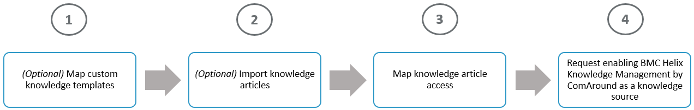

HKMis an Artificial Intelligence (AI)-powered and cloud-based knowledge management solution that offers a centralized way of working with knowledge. You can useHKMas a knowledge article source for DWP to boost your knowledge base with the numerous benefits thatHKMprovides.

You subscribe toHKMby purchasing the[Service Management Advanced license](https://docs.bmc.com/xwiki/bin/view/Helix-Common-Services/Other/BMC-Helix-Subscriber-Information/helixsubscriber/BMC-Helix-services/BMC-Helix-Service-Management-service/).HKM is also available to customers with entitlements in[Virtual Agent Basic](https://docs.bmc.com/xwiki/bin/view/Helix-Common-Services/Other/BMC-Helix-Subscriber-Information/helixsubscriber/BMC-Helix-services/BMC-Helix-Virtual-Agent-Basic-service/)or[Virtual Agent Advanced](https://docs.bmc.com/xwiki/bin/view/Helix-Common-Services/Other/BMC-Helix-Subscriber-Information/helixsubscriber/BMC-Helix-services/BMC-Helix-Virtual-Agent-Advanced-service/)subscriptions.

After you subscribe toHKM, as an administrator, you must configureHKMas a knowledge source for DWP. You must complete the common configuration tasks inIS, and then request , Inc. Support to enableHKMas the knowledge provider in DWP.

**Important**

HKMis a SaaS solution, and you can use it as a knowledge source in SaaS versions of DWP*only*.

ITSM: Knowledge ManagementandBusiness Workflowsare other knowledge sources that DWPsupports.For more information, see[Search-in-DWP](https://docs.bmc.com/xwiki/bin/view/Service-Management/Employee-Digital-Workplace/BMC-Helix-Digital-Workplace/dwp254/Getting-started/Key-concepts/Search-in-BMC-Helix-Digital-Workplace/).

For more information about the capability to submit service requests from the knowledge articles, see[Enabling-end-users-to-request-services-from-knowledge-articles](https://docs.bmc.com/xwiki/bin/view/Service-Management/Employee-Digital-Workplace/BMC-Helix-Digital-Workplace/dwp254/Administering/Administering-BMC-Helix-Digital-Workplace-Catalog/Enabling-end-users-to-request-services-from-knowledge-articles/)​​​​.

## Workflow to configureHKMas a knowledge provider for DWP

To start usingHKMas the knowledge source for DWP, complete the following tasks:

| Task  | Product  | Role  | Action  | Reference  |
| --- | --- | --- | --- | --- |
| 1  | IS  | ISadministrator  | *(Optional)*Map custom knowledge templates and fields fromITSM: Knowledge ManagementorBusiness WorkflowstoHKM. **Important:**If you don't use custom templates, you do*not*need to do the mapping because out-of-the-box knowledge templates and fields inITSM: Knowledge ManagementorBusiness Workflowsare automatically mapped toHKM. However, if necessary, you can edit these out-of-the-box mappings too.  | [Mapping custom knowledge templates from applications to HKM](https://docs.bmc.com/xwiki/bin/view/Service-Management/Innovation-Suite/BMC-Helix-Innovation-Suite/is254/Enabling-services/Configuring-BMC-Helix-Knowledge-Management-by-ComAround-as-a-knowledge-provider/Mapping-custom-knowledge-templates-from-BMC-applications-to-BMC-Helix-Knowledge-Management-by-ComAround/)  |
| 2  | IS  | ISadministrator  | *(Optional)*If you want to include articles fromITSM: Knowledge ManagementorBusiness Workflows, import the knowledge articles toHKM.  | [Importing articles to HKM](https://docs.bmc.com/xwiki/bin/view/Service-Management/Innovation-Suite/BMC-Helix-Innovation-Suite/is254/Enabling-services/Configuring-BMC-Helix-Knowledge-Management-by-ComAround-as-a-knowledge-provider/Synchronizing-BMC-applications-with-BMC-Helix-Knowledge-Management-by-ComAround/)  |
| 3  | IS  | ISadministrator  | To manage access to the knowledge articles inHKM, map the knowledge article access fromDWPtoHKM.  | [Mapping knowledge permissions from applications to HKM](https://docs.bmc.com/xwiki/bin/view/Service-Management/Innovation-Suite/BMC-Helix-Innovation-Suite/is254/Enabling-services/Configuring-BMC-Helix-Knowledge-Management-by-ComAround-as-a-knowledge-provider/Mapping-knowledge-permissions-from-BMC-applications-to-BMC-Helix-Knowledge-Management-by-ComAround/)  |
| 4  | NA  | NA  | Submit a support case to request enablingHKMas a knowledge source forDWP. In a support case, specify an environment or environments (non-production, production environments) whereHKMmust be enabled. **Best practice:**To ensure prompt processing of your request by , Inc. Support, we recommend that you use the following subject line for a support case:*Configure HKM by HKM for DWP*.  | [Support-information](https://docs.bmc.com/xwiki/bin/view/Service-Management/Employee-Digital-Workplace/BMC-Helix-Digital-Workplace/dwp254/Troubleshooting/Support-information/)  |

## Result

AfterHKMis configured as a knowledge article source forDWP,users can search for knowledge articles by using the Global search bar, and then view relevant search results in the application.

For information about how the search functionality works, refer to[Search-in-DWP](https://docs.bmc.com/xwiki/bin/view/Service-Management/Employee-Digital-Workplace/BMC-Helix-Digital-Workplace/dwp254/Getting-started/Key-concepts/Search-in-BMC-Helix-Digital-Workplace/).

After the search results are returned, users can also preview knowledge articles in the application and view the full article.

**Important**

Users*can't*create knowledge articles inHKMdirectly fromDWP.

### Business Intelligence reports inHKM

InHKM, users with the knowledge worker role can access Business Intelligence reports to get insights about knowledge use, user preferences, and engagement. For example, knowledge workers can use the Views report to get information about the views generated by DWP. Learn about this report in the[Views report (HKM)](https://zero.comaround.com/en-us/content/1658396/?ctxt=related#/)help article. For more information about the existing reports, see the[Accessing and navigating Business Intelligence reports (HKM)](https://zero.comaround.com/en-us/content/617180/?ctxt=search#/)help article.

To learn how to access help articles forHKM, see[Accessing product documentation provided by help articles](https://docs.bmc.com/xwiki/bin/view/Service-Management/Employee-Digital-Workplace/BMC-Helix-Knowledge-Management-by-ComAround/hkm/Getting-started/Accessing-product-documentation-provided-by-help-articles/)in theHKMdocumentation.