# Documentation Reference: Dwp 25.4

## Table of Contents
- [25.3-Enhancements-And-Patches.md](#253-enhancements-and-patchesmd)
- [Deprecated-And-Discontinued-Features.md](#deprecated-and-discontinued-featuresmd)
- [Getting-Started.md](#getting-startedmd)
- [Getting-Started/Best-Practices-For-Dwp.md](#getting-startedbest-practices-for-dwpmd)
- [Getting-Started/Best-Practices-For-Dwp/Adding-Service-Questionnaires---Best-Practices.md](#getting-startedbest-practices-for-dwpadding-service-questionnaires---best-practicesmd)
- [Getting-Started/Best-Practices-For-Dwp/Best-Practices-For-Designing-And-Optimizing-Servic.md](#getting-startedbest-practices-for-dwpbest-practices-for-designing-and-optimizing-servicmd)
- [Getting-Started/Best-Practices-For-Dwp/Configuring-Search---Best-Practices.md](#getting-startedbest-practices-for-dwpconfiguring-search---best-practicesmd)
- [Getting-Started/Best-Practices-For-Dwp/Creating-Studio-Pages---Best-Practices.md](#getting-startedbest-practices-for-dwpcreating-studio-pages---best-practicesmd)
- [Getting-Started/Best-Practices-For-Dwp/Creating-Workflows---Best-Practices.md](#getting-startedbest-practices-for-dwpcreating-workflows---best-practicesmd)
- [Getting-Started/Best-Practices-For-Dwp/Designing-Service-Catalog---Best-Practices.md](#getting-startedbest-practices-for-dwpdesigning-service-catalog---best-practicesmd)
- [Getting-Started/Key-Concepts.md](#getting-startedkey-conceptsmd)
- [Getting-Started/Key-Concepts/Catalog-Services-And-Fulfillments.md](#getting-startedkey-conceptscatalog-services-and-fulfillmentsmd)
- [Getting-Started/Key-Concepts/Company-Level-Access-To-Subtenants-In-Dwp.md](#getting-startedkey-conceptscompany-level-access-to-subtenants-in-dwpmd)
- [Getting-Started/Key-Concepts/Credit-Management-For-Managed-Service-Providers.md](#getting-startedkey-conceptscredit-management-for-managed-service-providersmd)
- [Getting-Started/Key-Concepts/Dwp-Architecture.md](#getting-startedkey-conceptsdwp-architecturemd)
- [Getting-Started/Key-Concepts/Dwp-Catalog-Architecture.md](#getting-startedkey-conceptsdwp-catalog-architecturemd)
- [Getting-Started/Key-Concepts/Dwp-Catalog.md](#getting-startedkey-conceptsdwp-catalogmd)
- [Getting-Started/Key-Concepts/Search-In-Dwp.md](#getting-startedkey-conceptssearch-in-dwpmd)
- [Getting-Started/Key-Concepts/Service-Request-Approvals.md](#getting-startedkey-conceptsservice-request-approvalsmd)
- [Getting-Started/Key-Concepts/Studio-Pages.md](#getting-startedkey-conceptsstudio-pagesmd)
- [Getting-Started/Key-Concepts/Subcatalogs.md](#getting-startedkey-conceptssubcatalogsmd)
- [Getting-Started/Onboarding-Overview.md](#getting-startedonboarding-overviewmd)
- [Getting-Started/Product-Overview.md](#getting-startedproduct-overviewmd)
- [Getting-Started/Use-Cases.md](#getting-starteduse-casesmd)
- [Getting-Started/Use-Cases/Access-From-Anywhere,-Anytime,-On-Any-Device.md](#getting-starteduse-casesaccess-from-anywhere,-anytime,-on-any-devicemd)
- [Getting-Started/Use-Cases/Automating-Service-Requests.md](#getting-starteduse-casesautomating-service-requestsmd)
- [Getting-Started/Use-Cases/Enabling-End-Users-To-Work-On-To-Dos.md](#getting-starteduse-casesenabling-end-users-to-work-on-to-dosmd)
- [Getting-Started/Use-Cases/Generating-Ai-Retrieved-Answers-For-End-Users-Thro.md](#getting-starteduse-casesgenerating-ai-retrieved-answers-for-end-users-thromd)
- [Getting-Started/Use-Cases/Leveraging-Knowledge-From-Hkm.md](#getting-starteduse-casesleveraging-knowledge-from-hkmmd)
- [Getting-Started/Use-Cases/Leveraging-The-Out-Of-The-Box-Lines-Of-Business-An.md](#getting-starteduse-casesleveraging-the-out-of-the-box-lines-of-business-anmd)
- [Getting-Started/Use-Cases/Providing-A-Unified-Service-Catalog.md](#getting-starteduse-casesproviding-a-unified-service-catalogmd)
- [Getting-Started/Use-Cases/Providing-Self-Help-Resources-To-Your-End-Users.md](#getting-starteduse-casesproviding-self-help-resources-to-your-end-usersmd)
- [Getting-Started/User-Interface-Overview.md](#getting-starteduser-interface-overviewmd)
- [Getting-Started/Using-This-Documentation.md](#getting-startedusing-this-documentationmd)
- [Known-And-Corrected-Issues.md](#known-and-corrected-issuesmd)
- [Release-Notes-And-Notices.md](#release-notes-and-noticesmd)
- [Release-Notes-And-Notices/25.3-Enhancements-And-Patches.md](#release-notes-and-notices253-enhancements-and-patchesmd)
- [Release-Notes-And-Notices/25.4-Enhancements-And-Patches.md](#release-notes-and-notices254-enhancements-and-patchesmd)
- [Release-Notes-And-Notices/Deprecated-And-Discontinued-Features.md](#release-notes-and-noticesdeprecated-and-discontinued-featuresmd)
- [Release-Notes-And-Notices/Deprecated-And-Discontinued-Features/Branding/End-Of-Life-For-The-Old-Dwp-Branding.md](#release-notes-and-noticesdeprecated-and-discontinued-featuresbrandingend-of-life-for-the-old-dwp-brandingmd)
- [Release-Notes-And-Notices/Deprecated-And-Discontinued-Features/Catalog-Sections.md](#release-notes-and-noticesdeprecated-and-discontinued-featurescatalog-sectionsmd)
- [Release-Notes-And-Notices/Deprecated-And-Discontinued-Features/End-Of-Life-For-Lifecycle-Management-Integration-F.md](#release-notes-and-noticesdeprecated-and-discontinued-featuresend-of-life-for-lifecycle-management-integration-fmd)
- [Release-Notes-And-Notices/Deprecated-And-Discontinued-Features/End-Of-Life-For-The-Old-Dwp-Branding.md](#release-notes-and-noticesdeprecated-and-discontinued-featuresend-of-life-for-the-old-dwp-brandingmd)
- [Release-Notes-And-Notices/Deprecated-And-Discontinued-Features/Jira-Connector-In-Dwpc.md](#release-notes-and-noticesdeprecated-and-discontinued-featuresjira-connector-in-dwpcmd)
- [Release-Notes-And-Notices/Deprecated-And-Discontinued-Features/Limited-Support-For-Srm.md](#release-notes-and-noticesdeprecated-and-discontinued-featureslimited-support-for-srmmd)
- [Statement-Of-Direction_-End-Of-Life-Plan-For-Birt.md](#statement-of-direction_-end-of-life-plan-for-birtmd)
- [Where-Did-The-Smart-It-Documentation-Go_.md](#where-did-the-smart-it-documentation-go_md)

---

## <a id="253-enhancements-and-patchesmd"></a>25.3-Enhancements-And-Patches.md

Review the ITSM 25.3 enhancements for features that will benefit your organization and to understand changes that might impact your users.

| Version | SaaS | On premises | Fixed issues | Updates |
| --- | --- | --- | --- | --- |
| 25.3.02 | ✅️ |  | [Known and corrected issues](https://docs.bmc.com/xwiki/wiki/internal/view/Service-Management/IT-Service-Management/itsmMaster2/Release-notes-and-notices/Known-and-corrected-issues/) | [25.3.02 enhancements](https://docs.bmc.com/xwiki/bin/view/Service-Management/IT-Service-Management/BMC-Helix-ITSM/itsm254/Release-notes-and-notices/25-3-enhancements-and-patches/#25302) |
| 25.3.01 | ✅️ | ✅️ | [Known and corrected issues](https://docs.bmc.com/xwiki/wiki/internal/view/Service-Management/IT-Service-Management/itsmMaster2/Release-notes-and-notices/Known-and-corrected-issues/) | [25.3.01 enhancements](https://docs.bmc.com/xwiki/bin/view/Service-Management/IT-Service-Management/BMC-Helix-ITSM/itsm254/Release-notes-and-notices/25-3-enhancements-and-patches/#25301) |
| 25.3.00 | ✅️ |  | [Known and corrected issues](https://docs.bmc.com/xwiki/wiki/internal/view/Service-Management/IT-Service-Management/itsmMaster2/Release-notes-and-notices/Known-and-corrected-issues/) | [25.3.00 enhancements](https://docs.bmc.com/xwiki/bin/view/Service-Management/IT-Service-Management/BMC-Helix-ITSM/itsm254/Release-notes-and-notices/25-3-enhancements-and-patches/#25300) |

applies upgrades as described in the[Upgrade policy](https://docs.bmc.com/xwiki/bin/view/Helix-Common-Services/Other/BMC-Helix-Subscriber-Information/helixsubscriber/Policies/BMC-Helix-Upgrade-policy/). applies upgrades and patches during[Maintenance windows](https://docs.bmc.com/xwiki/bin/view/Helix-Common-Services/Other/BMC-Helix-Subscriber-Information/helixsubscriber/Operations/Maintenance-windows/).

---

## 25.3.02

There are no new features or enhancements in this release.

## 25.3.01

There are no new features or enhancements in this release

## 25.3.00

## ITSM enhancements

### Create knowledge articles from incidents by using the Knowledge Curator AI agent for faster incident resolution

As a service desk agent, create knowledge articles from incidents directly in HKM by using the Knowledge Curator AI Agent.

This capability provides the following benefits:

* Users need not navigate away from the incident to create a knowledge article.
* Incident data, such as description, summary, and work notes is used to generate the knowledge article.
* The knowledge article is automatically pinned to the incident for ready reference.


Learn more about how to create knowledge articles by using the Knowledge Curator agent in ITSM in[Creating knowledge articles from incidents by using Knowledge Curator](https://docs.bmc.com/xwiki/bin/view/Service-Management/IT-Service-Management/BMC-Helix-ITSM/itsm254/Getting-started/Use-cases/Create-knowledge-articles-from-incidents-by-using-Knowledge-Curator/).

### Use the Service Collaborator AI agent to automatically send email responses for inbound emails

As an administrator, enable automatic responses to inbound emails by using the Service Collaborator AI Agent. The AI agent understands the incident and sends an appropriate response to the email. The response contains a summary of the information retrieved from published knowledge articles with recommended resolutions for the incident. If users find the response helpful, they can resolve the incident directly by clicking**Resolve**button in the email body.

This capability provides the following benefits:

* Reduces agent workload by automating routine email responses.
* Improves response time and user satisfaction with faster, accurate replies.
* Increases operational efficiency by allowing agents to focus on complex issues while Service Collaborator handles common queries.


Learn more about enabling automatic responses to inbound emails in[Enabling automatic responses to inbound emails by using Agentic AI](https://docs.bmc.com/xwiki/bin/view/Service-Management/IT-Service-Management/BMC-Helix-ITSM/itsm254/Setting-up-and-going-live/Configuring-settings-to-use-Agentic-AI-capabilities/Enabling-automatic-responses-to-inbound-emails-using-Agentic-AI/).

### *(Controlled availability customers only)*Preview and edit HKM knowledge articles directly within ITSM

As a Service Desk Agent, preview and edit knowledge articles from HKM directly within the ITSM interface.

This capability provides the following benefits:

* No need to navigate away from the ITSM application to preview and edit the knowledge articles from HKM, streamlining workflows and saving time.
* Experience a seamless user interaction of viewing and editing knowledge articles from both sources with easy navigation.
* Use similar editing capabilities for the knowledge articles from both sources.


Learn more about viewing and editing knowledge articles in[Leveraging knowledge from HKM](https://docs.bmc.com/xwiki/bin/view/Service-Management/IT-Service-Management/BMC-Helix-ITSM/itsm254/Getting-started/Use-cases/Leveraging-knowledge-from-BMC-Helix-Knowledge-Management-by-ComAround/).

### Use the enhanced Agentic Chat to search for incidents, change requests, and knowledge articles

As a Service Desk Agent, use Agentic Chat for an improved, conversational experience when searching for incidents, change requests, and information from knowledge articles.

The improved chat provides the following benefits:

* When an administrator enables HelixGPT for ITSM, Agentic chat is available out of the box. The administrator need not enable it separately.
* A user can retrieve similar and related incidents in the chat and access incidents, change requests, and person objects directly from the chat through inline links.


Learn how to use Agentic Chat in[Searching for information by using HelixGPT chat](https://docs.bmc.com/xwiki/wiki/internal/view/Service-Management/IT-Service-Management/itsmMaster2/Navigating-common-interfaces/Searching-for-information-by-using-BMC-HelixGPT-chat/25-3-00#).

### Use predefined prompts in Ask HelixGPT to accelerate incident resolution and improve response consistency

As a service desk agent, use predefined prompts in Ask HelixGPT to minimize manual entry of standard queries and accelerate incident resolution. An administrator can also modify the predefined prompts according to the business requirement.

This capability provides the following benefits:

* Ease of use and improved user interaction, resulting in faster resolution of incidents.
* Customization of predefined prompts according to business requirements.


Learn how to use the predefined prompts in[Resolving tickets with the help of Ask HelixGPT](https://docs.bmc.com/xwiki/wiki/internal/view/Service-Management/IT-Service-Management/sdMaster2/Managing-incident-requests/Resolving-incident-requests/Resolving-tickets-with-the-help-of-Ask-HelixGPT/25-3).

### Use auto ticket categorization for accelerated incident resolution by leveraging AI capabilities

As a Service Desk Manager, leverage the capabilities of artificial intelligence (AI) to analyze historical, closed incidents to classify incoming incidents into appropriate categories. AI also predicts the best-suited support group for resolving incidents.

This AI-based capability provides the following benefits:

* Better classification of incidents into categories, resulting in quicker resolutions.
* Improved assignments to support groups, ensuring appropriate utilization of support resources.

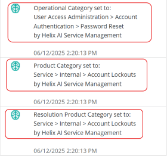

Learn how auto-categorization works in[Creating incident requests](https://docs.bmc.com/xwiki/wiki/internal/view/Service-Management/IT-Service-Management/sdMaster2/Managing-incident-requests/Registering-incident-requests/Creating-an-incident-request/25-3#).

### Use contextual search in the Contracts console filters

As a user, leverage the type-ahead search in filters in the Contracts console to get contextual suggestions for search criteria such as email ID and department. Suggestions appear after you enter the first three characters.

This capability provides the following benefits:

* Alignment with other ITSM consoles, delivering a consistent, intuitive user experience across consoles.
* Service desk agents require less training to work on multiple consoles, improving productivity.


Learn more about the Contract console in[Managing contracts through the Contracts console](https://docs.bmc.com/xwiki/wiki/internal/view/Service-Management/IT-Service-Management/assetMaster2/Managing-contracts/Managing-contracts-through-the-Contract-console/).

### Create a contract from an asset or another contract

As an asset manager, create a contract from an asset or a contract ticket and relate it without navigating away from the ticket. You can also associate existing contracts with assets**.**This capability is consistent with Mid Tier and reduces the repetitive steps, saving you time and effort in asset management.

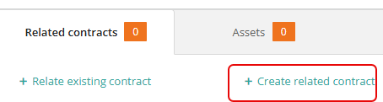

Learn more about creating and relating contracts in[Creating and updating contracts](https://docs.bmc.com/xwiki/wiki/internal/view/Service-Management/IT-Service-Management/assetMaster2/Managing-contracts/Creating-and-updating-contracts/)and[Relating contracts and CIs](https://docs.bmc.com/xwiki/wiki/internal/view/Service-Management/IT-Service-Management/assetMaster2/Managing-contracts/Relating-contracts-to-CIs/).

### Detect major incidents by using additional qualifiers

As a Service Desk Manager, get recommendations to assess whether an incident candidate qualifies to be classified as a major incident. This assessment is based on advanced major incident qualifiers such as economic impact, data loss, and reputational impact.

This capability provides the following benefits:

* Use the recommendation to identify major incidents and their risks in advance to reduce the impact of major incidents.
* Improve the overall incident management in your organization.


Learn how to detect major incidents in[Managing major incidents](https://docs.bmc.com/xwiki/wiki/internal/view/Service-Management/IT-Service-Management/sdMaster2/Managing-incident-requests/Managing-and-tracking-major-incidents/).

### *(Controlled availability customers only)*Localize foundation data to meet locale-specific language requirements

Localize the foundation data in the supported languages to enable users to view it in their preferred language while maintaining language consistency with the application user interface.

Localizing the foundation data helps you adhere to the region-specific language compliance requirements and also enhances user experience.

For more information, see[Localizing foundation data into the supported languages](https://docs.bmc.com/xwiki/bin/view/Service-Management/IT-Service-Management/BMC-Helix-ITSM/itsm254/Administering/Localizing-foundation-data-into-the-supported-languages/).

### Enhanced localization support

Localization support is extended for the following entities:

* System-generated activity notes on PWA screens
* IS-based Create change freeze page
* English Canada (EN\_CA) and French Canada (FR\_CA) languages supported for Mid Tier

Learn about the supported languages in[Supported languages and locales](https://docs.bmc.com/xwiki/bin/view/Service-Management/IT-Service-Management/BMC-Helix-ITSM/itsm253/Planning/Supported-languages-and-locales/).

## What else has changed in this release

| Update | Product behavior in versions earlier than 25.3.00 | Product behavior in version 25.3.00 |
| --- | --- | --- |
| The**Contactmiddlename**field is available out of the box in the ITSM Tickets CRD for the Shared Ticket Console. | In the ITSM Tickets CRD, only the**Contactfirstname**,**Contactlastname**, and**Contactfullname**fields are available out of the box for contact names. The**Contactmiddlename**field is not available.<br> | The**Contactmiddlename**field is available out of the box in the ITSM Tickets CRD. You can add this field to the ticket console record grid and search, filter, or sort contacts by their middle name in the Shared Ticket Console.<br>For more information about the Shared Ticket Console, see[Customizing Shared Ticket Console](https://docs.bmc.com/xwiki/bin/view/Service-Management/IT-Service-Management/BMC-Helix-ITSM/itsm252/Administering/Enabling-and-customizing-Shared-Ticket-Console/Customizing-Shared-Ticket-Console/)and[Managing your work by using Ticket Console](https://docs.bmc.com/xwiki/bin/view/Service-Management/IT-Service-Management/BMC-Helix-ITSM/itsm253/Navigating-common-interfaces/Managing-your-work-by-using-Ticket-Console/).<br> |
| Unified log format across services boosts event correlation | The log entry formats vary, particularly in timestamps and time zone offsets. It is difficult for a central logging solution to support logging across all tenants and applications. | A unified log format across multiple services in a distributed environment is implemented, enhancing the ability to quickly correlate and analyze sequences of events. |
| Ability to customize the Contracts console. | The Contracts console did not support customization. | The following views in the Contracts console support customization:<br>  * Contracts console * Related contracts * Related assets  For more details,[Enabling and configuring the Contract console](https://docs.bmc.com/xwiki/wiki/internal/view/Service-Management/IT-Service-Management/assetMaster2/Administering/Enabling-or-disabling-the-Contract-Console/).<br> |
| The**Resolution note**field is preserved when an incident is reverted from**Resolved**to a prior status, if it contains resolution-specific information.<br> | On PWA screens, the resolution note was removed when you reverted a resolved incident to a prior status.<br> | On PWA screens, the resolution note is preserved when you revert a resolved incident to a prior status. However, if you remove the resolution-specific details from the**Resolution note**field while reverting the incident to a previous status, the field is removed.<br>This functionality aligns with the incident behavior in the Mid Tier and non-PWA screens and provides you with a seamless experience of using ITSM products.<br>For more details, see[Moving a resolved incident request back to In Progress](https://docs.bmc.com/xwiki/wiki/internal/view/Service-Management/IT-Service-Management/sdMaster2/Managing-incident-requests/Resolving-incident-requests/Moving-a-resolved-incident-request-back-to-In-Progress/)and[Reopening a closed or resolved incident request](https://docs.bmc.com/xwiki/wiki/internal/view/Service-Management/IT-Service-Management/sdMaster2/Managing-incident-requests/Reopening-a-closed-or-resolved-incident-request/).<br> |

## ITSM Insights enhancements

### Investigate issues by using the Proactive Problem Management Advanced Analytics dashboard

As a problem coordinator, use the Proactive Problem Management Advanced Analytics dashboard to quickly identify incident trends and resolution patterns for every Proactive problem management job.

This capability provides the following benefits:

* Provides actionable insights about incident patterns and their volume.
* Helps in investigating and resolving problems more efficiently.


Learn more about ITSM Insights dashboards in[Tracking ITSM Insights usage in Dashboards](https://docs.bmc.com/xwiki/wiki/internal/view/Service-Management/IT-Service-Management/insightsMaster/Tracking-ITSM-Insights-usage-in-BMC-Helix-Dashboards/).

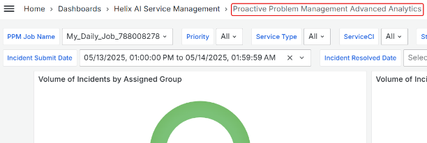

## IS 25.3.00 enhancements

25.3 enhancements and patches

## 25.3.01 updates

## Use updated support for technology stack

Service Management supports the following technology stacks:

* Kubernetes version 1.33
* OpenShift version 4.19
* Nginx Ingress Controller version 1.12.4
* Helm 3.18

For more information, see[System requirements](https://docs.bmc.com/xwiki/bin/view/Service-Management/On-Premises-Deployment/BMC-Helix-Service-Management-Deployment/brid25301/Planning/System-requirements/).

## *(Controlled availability customers only)*Deploy Service Management platform components

To optimize resource utilization and minimize your environmental footprint, deploy only the platform components of Service Management using the CORE deployment mode. This mode loads only the essential components and services into memory, allowing you to start with a lightweight setup and scale up based on your operational needs. Use the CORE mode to activate only the following components:

* IS
* CMDB
* Foundation data objects
* *(Optional)*HelixGPT and Clam AntiVirus

For more information, see[Deploying Service Management in the CORE mode](https://docs.bmc.com/xwiki/bin/view/Service-Management/On-Premises-Deployment/BMC-Helix-Service-Management-Deployment/brid25301/Getting-started/Deployment-use-cases/Deploy-BMC-Helix-Service-Management-platform-components/),[Performing the Service Management installation,](https://docs.bmc.com/xwiki/bin/view/Service-Management/On-Premises-Deployment/BMC-Helix-Service-Management-Deployment/brid25301/Installing/Performing-the-BMC-Helix-Service-Management-installation/)and[Transitioning between deployment modes.](https://docs.bmc.com/xwiki/bin/view/Service-Management/On-Premises-Deployment/BMC-Helix-Service-Management-Deployment/brid25301/Administering/Transitioning-between-deployment-modes/)

## What else changed in this release​

The following table lists the changes in the product behavior:

| Update | Product behavior in versions earlier than 25.3.01 | Product behavior in version 25.3.01 |
| --- | --- | --- |
| Localization of selection field values in record definition for AR System forms. | TheGET:api/rx/application/record/recorddefinition/{name}API did not support the localization of selection field values in record definitions for AR System forms.<br> | TheGET:api/rx/application/record/recorddefinition/{name}API supports the localization of selection field values in record definitions for AR System forms.<br>If you access a view created with AR System form, the selection field values are displayed in your locale.<br>For more information, see[Creating or modifying view definitions.](https://docs.bmc.com/xwiki/bin/view/Service-Management/Innovation-Suite/BMC-Helix-Innovation-Suite/is253/Tailoring-applications-and-automating-processes/Creating-the-definitions-for-a-tailorable-application/Defining-the-user-interface-through-view-definitions/Creating-or-modifying-view-definitions/)<br> |
| Upgrade process changes | Direct upgrade was supported for upgrading Service Management from an earlier version to the latest version. A step upgrade was not required for any earlier version. | You can perform a direct upgrade of Service Management from 23.3.x and later versions. However, upgrading from versions earlier to 23.3.x includes a step upgrade.<br>For more information, see[Upgrading Service Management to 25.3.01](https://docs.bmc.com/xwiki/bin/view/Service-Management/On-Premises-Deployment/BMC-Helix-Service-Management-Deployment/brid25301/Upgrading/Upgrading-BMC-Helix-Service-Management-to-22-1-06/).<br> |
| Parameters name changes in the**HELIX\_ONPREM\_DEPLOYMENT**pipeline. | The**HELIX\_ONPREM\_DEPLOYMENT**pipeline parameter names in version earlier to 25.3.01 are as follows:<br>  * CLUSTER * CLUSTER\_DOMAIN * CUSTOMER\_SIZE * DEPLOYMENT\_MODE | The following**HELIX\_ONPREM\_DEPLOYMENT**pipeline parameter names are renamed:<br>  * CLUSTER renamed as CLUSTER\_CONTEXT * CLUSTER\_DOMAIN renamed as APPLICATION\_PARENT\_DOMAIN * CUSTOMER\_SIZE renamed as ENVIRONMENT\_SIZE * DEPLOYMENT\_MODE renamed as DEPLOYMENT\_TYPE  Additionally, the DEPLOYMENT\_MODE parameter is included. Use this parameter to select the following deployment modes:<br>  * **CORE**—Loads only essential platform components such as:   + IS   + CMDB   + Foundation data objects   + Optionally, HelixGPT and Clam AntiVirus * **FULL**(Default)—Loads all available Service Management components and applications into memory.  For more information, see[Performing the Service Management installation](https://docs.bmc.com/xwiki/bin/view/Service-Management/On-Premises-Deployment/BMC-Helix-Service-Management-Deployment/brid25301/Installing/Performing-the-BMC-Helix-Service-Management-installation/).<br> |
| Automatic installation of the**yq**utility package on Helm nodes during deployment preparation | The**yq**utility package was not required or installed as part of the deployment process. | The**yq**utility package is now automatically installed on all Helm nodes during deployment preparation. This utility is required for smooth Helm-based pipeline execution in both Standard and Air-gapped environments. |

## 25.3.00 updates

The following video (01:05) provides a quick overview of the enhancements in the IS 25.3.00.

[🎥 Watch Video: //www.youtube.com/watch?v=HfKVItwWfdk](//www.youtube.com/watch?v=HfKVItwWfdk)

[Watch the video that describes the new features in IS 25.3](https://youtu.be/HfKVItwWfdk)

## Configure chat responses in a carousel or card format

Developers or application business analysts can configure actions on cards and buttons that are triggered when you click them.

You can view chat responses in a carousel or card format, which shows a more interactive and intuitive experience.

For more information, see[Adding an AI-based conversational search interface to a view](https://docs.bmc.com/xwiki/bin/view/Service-Management/Innovation-Suite/BMC-Helix-Innovation-Suite/is253/Tailoring-applications-and-automating-processes/Creating-the-definitions-for-a-tailorable-application/Defining-the-user-interface-through-view-definitions/Adding-an-AI-based-conversational-search-interface-to-a-view/).


## Configure dynamic welcome suggestions and view dynamic suggestions for chat responses

Developers or application business analysts can configure dynamic welcome suggestions to personalize the initial user interaction. Dynamic welcome suggestions enhance engagement by presenting personalized, context-aware prompts at the beginning of the conversation.

Additionally, HelixGPT displays dynamic suggestions after each response. Users can use these suggestions to select relevant follow-up options.

For more information, see[Adding an AI-based conversational search interface to a view](https://docs.bmc.com/xwiki/bin/view/Service-Management/Innovation-Suite/BMC-Helix-Innovation-Suite/is253/Tailoring-applications-and-automating-processes/Creating-the-definitions-for-a-tailorable-application/Defining-the-user-interface-through-view-definitions/Adding-an-AI-based-conversational-search-interface-to-a-view/).


## *(Controlled availability customers only)*Accelerate record creation with the IS RD Agent

You can generate record definitions by using the prompt-based conversations. The agent intelligently interprets your input and automatically builds the required structure. This capability streamlines the setup process, reduces manual effort, and accelerates application development.

For more information, see[Creating or modifying record definitions by using IS RD Agent](https://docs.bmc.com/xwiki/bin/view/Service-Management/Innovation-Suite/BMC-Helix-Innovation-Suite/is253/Tailoring-applications-and-automating-processes/Creating-the-definitions-for-a-tailorable-application/Defining-record-definitions-to-store-and-manage-data/Creating-or-modifying-record-definitions-by-using-generative-AI/).


## Enhance the flexibility of the Record editor by binding inputs to view variables instead of record fields

As an application business analyst, you can create a view variable while designing a view to get more flexibility while managing data. You can bind a supported Record editor input to this variable instead of binding it to a record field. The value of the view variable can be used within the view. The changes to a variable will be reflected in the input that is bound to it. Conversely, the changes in the input will be reflected in the view variable to which this input is bound. For more information, see[Creating or modifying view definitions](https://docs.bmc.com/xwiki/bin/view/Service-Management/Innovation-Suite/BMC-Helix-Innovation-Suite/is253/Tailoring-applications-and-automating-processes/Creating-the-definitions-for-a-tailorable-application/Defining-the-user-interface-through-view-definitions/Creating-or-modifying-view-definitions/).


## Add a named list to filterable grid columns in a record grid

As an application business analyst, you can assign a named list to a filterable grid column in a record grid if the field is not associated with a named list. You can also override the field’s default named list. A named list provides a predefined set of values that helps users filter and select data within a grid column more quickly. For more information, see[Creating a tabular view of record instances by using a record grid](https://docs.bmc.com/xwiki/bin/view/Service-Management/Innovation-Suite/BMC-Helix-Innovation-Suite/is253/Tailoring-applications-and-automating-processes/Creating-the-definitions-for-a-tailorable-application/Defining-the-user-interface-through-view-definitions/Creating-a-tabular-view-of-record-instances-by-using-a-record-grid/#.Creatingatabularviewofrecordinstancesbyusingarecordgridv23.3.04-Toeditthegridcolumnsandthecolumnpropertiesforthefields).


## Invoke an AI agent from IS workflow

In the Process designer, Business Analysts can add the**Invoke Agent**element to trigger an AI agent to perform a task. The**Invoke Agent**element provides the following benefits:

* Enhances automation by leveraging AI capabilities within workflows.
* Retrieves responses dynamically based on user input.
* Integrates conversational experiences seamlessly into business workflows.

For more information, see[Invoking an AI agent from the process](https://docs.bmc.com/xwiki/bin/view/Service-Management/Innovation-Suite/BMC-Helix-Innovation-Suite/is253/Tailoring-applications-and-automating-processes/Creating-the-definitions-for-a-tailorable-application/Defining-the-application-business-logic-through-processes/Invoking-an-AI-agent-from-the-process/).


## Enable localization of data in AR System forms

As an administrator, enable data localization so that users across multiple regions can interact with IS in their preferred language. With support for localized data, users benefit from improved clarity, compliance, and a more intuitive experience. Administrators can easily manage localized data, ensuring consistency and accessibility across the organization.

For more information, see[Preparing your application to be localized](https://docs.bmc.com/xwiki/bin/view/Service-Management/Innovation-Suite/BMC-Helix-Innovation-Suite/is253/Developing-applications-by-using-Developer-Studio/Localizing-an-application-to-other-languages/Using-the-localization-toolkit-to-localize-your-applications/Preparing-your-application-to-be-localized/).


## Create advanced search filters by combining AND, OR, and NOT operators

While creating search filters for HKM articles, administrators can define advanced search filters that integrate logical operators AND, OR, and NOT within a single query. When your end users use these filters to search for knowledge articles, the workplace page returns only those articles that meet the search criteria. This capability helps users in the following ways:

* Delivers the most relevant knowledge articles.
* Reduces time spent sifting through unrelated search results.
* Helps users apply the right solutions to the right context.

For more information, see[Creating search filters for applications](https://docs.bmc.com/xwiki/bin/view/Service-Management/Innovation-Suite/BMC-Helix-Innovation-Suite/is253/Enabling-services/Configuring-BMC-Helix-Knowledge-Management-by-ComAround-as-a-knowledge-provider/Creating-search-filters-for-BMC-applications/).

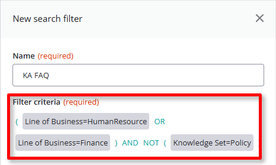

## *(Controlled availability customers only)*Preview and edit HKM knowledge articles directly within ITSM

Knowledge workers can preview and edit knowledge articles from HKM directly within the ITSM interface.

Knowledge workers can benefit from a seamless and consistent experience when viewing and editing knowledge articles from HKM. They don't need to navigate away from the ITSM application to preview or edit the knowledge articles from HKM, streamlining workflows and saving time.

​​​​Learn more about configuring HKM as a knowledge provider for ITSM in[Configuring HKM as a knowledge provider](https://docs.bmc.com/xwiki/bin/view/Service-Management/Innovation-Suite/BMC-Helix-Innovation-Suite/is253/Enabling-services/Configuring-BMC-Helix-Knowledge-Management-by-ComAround-as-a-knowledge-provider/).

****

## What else changed in this release​

The following table lists the changes in the product behavior:

| Update | Product behavior in versions earlier that 25.3.00 | Product behavior in version 25.3.00 |
| --- | --- | --- |
| Response links behavior based on the target attribute for the**HelixGPT chat**component.<br> | Links received in the chat response while using the**HelixGPT chat**component always open on the same tab.<br> | Links received in the chat response while using the**HelixGPT chat**component open on the same tab or a new tab. This behavior depends on the target attribute value specified in the response.<br>For more information, see[Adding an AI-based conversational search interface to a view](https://docs.bmc.com/xwiki/bin/view/Service-Management/Innovation-Suite/BMC-Helix-Innovation-Suite/is253/Tailoring-applications-and-automating-processes/Creating-the-definitions-for-a-tailorable-application/Defining-the-user-interface-through-view-definitions/Adding-an-AI-based-conversational-search-interface-to-a-view/).<br> |
| HelixGPT Manager is rebranded to HelixGPT Agent Studio | NA | HelixGPT Manager, the console that helps administrators to navigate and manage agentic AI capabilities across applications, is rebranded to HelixGPT Agent Studio. |
| The ISO 8601 format is used for log timestamps. | Logs used varying timestamp formats across services. | Log files, including Jetty logs, use timestamps in the ISO 8601 format (yyyy-MM-dd'T'HH:mm:ss.SSSZ); for example, 2025-01-29T15:20:15.000-0700. This format makes it easier to debug issues across services.<br>Formore information, see[Log entry format](https://docs.bmc.com/xwiki/bin/view/Service-Management/Innovation-Suite/BMC-Helix-Innovation-Suite/is253/Troubleshooting/Enabling-and-analyzing-logs/Analyzing-logs/Log-entry-format/).<br> |
| Localize Ask HelixGPT prompt text in Progressive Views. | AR System did not provide the capability to localize Ask HelixGPT prompts. | The message type**Ask HelixGPT Prompt**is available in the AR System Message Catalog form. You can enable applications to centrally define and localize prompt text entries in Progressive Views.<br>For more information, see[Localizing message components of a form view](https://docs.bmc.com/xwiki/bin/view/Service-Management/Innovation-Suite/BMC-Helix-Innovation-Suite/is253/Developing-applications-by-using-Developer-Studio/Localizing-an-application-to-other-languages/Localizing-AR-System-applications-manually/Localizing-message-components-of-a-form-view/).<br> |
| The Creator module in the Email Engine can be configured to run in multi-threaded mode for enhanced performance. | The Creator module in the Email Engine supported only single-threaded mode. | The Creator module in the Email Engine can be configured to run in multi-threaded mode for enhanced performance when handling large volumes of outgoing emails. By default, it runs in single-threaded mode. For more information, see[Email Engine architecture](https://docs.bmc.com/xwiki/bin/view/Service-Management/Innovation-Suite/BMC-Helix-Innovation-Suite/is253/Getting-started/Key-concepts/Architecture/Email-Engine-architecture/). |

## CMDB 25.3.00 enhancements

25.3 enhancements and patches

The following video (01:05) provides a quick overview of the enhancements in the CMDB 25.3.00.

[🎥 Watch Video: //www.youtube.com/watch?v=w0WC0Ko0Js4](//www.youtube.com/watch?v=w0WC0Ko0Js4)

[Watch the video that describes the new features in CMDB 25.3](https://youtu.be/w0WC0Ko0Js4)

### Source data from Azure SQL databases

Source data from Azure SQL databases by using the Atrium Integrator Spoon client.

If your data is on an Azure SQL database, you can continue to have the performance, scalability, and security of an Azure database while directly sourcing the data to the Atrium Integrator Spoon client and then add that data to your CMDB.

To learn more, see[Using the Atrium Integrator Spoon client](https://docs.bmc.com/xwiki/bin/view/Service-Management/IT-Service-Management/BMC-Helix-CMDB/ac253/Using/Transferring-data-from-external-data-stores-to-BMC-Helix-CMDB/Atrium-Integrator/Using-the-Atrium-Integrator-Spoon-client/).

### Access self-help resources with in-app help

In-app help is available from a movable widget on every screen. Click the self-help widget to access a product tour, interactive guides, instructions for setting up and going live, and more. In addition, you can continue to find answers to your questions in the online documentation or in our[CMDB playlist](https://youtube.com/playlist?list=PLibAMtD70sYEcM-dfbe_L0HlKL3HTsHcX&si=7ff83KidKxAzmZFk)


### Consent for data collection

After you log in, select whether you want to allow the product to collect data about your product usage. This data helps to improve product performance, identify usage trends, and prioritize feature enhancements. For more information, see[Modifying consent for data collection](https://docs.bmc.com/xwiki/bin/view/Service-Management/IT-Service-Management/BMC-Helix-CMDB/ac253/Administering/Modifying-consent-for-data-collection/)


## What else changed in this release​

The following table lists the changes in the product behavior:

| Update | Product behavior in versions earlier than 25.3.00 | Product behavior in version 25.3.00 |
| --- | --- | --- |
| Look and feel of the user interface | The user interface for CMDB reflected the older branding.<br><br> | The user interface for CMDB reflects the updated branding, which mainly includes changes to the color palette.<br><br>If you have made any custom branding to the CMDB user interface before upgrading to 25.3.00, the new branding is not applied. To learn more about customizing the color and branding of the CMDB user interface, see[Rebranding the CMDB Portal](https://docs.bmc.com/xwiki/bin/view/Service-Management/IT-Service-Management/BMC-Helix-CMDB/ac253/Administering/Rebranding-the-CMDB-Portal/).<br> |
| Date format in log files | Log files used varying time stamp formats in different services. | Date formats in all the log files are in the ISO 8601 format.<br>ISO 8601 dates are in the following format:<br>  ``` yyyy-MM-dd'T'HH:mm:ss.SSSZ ```  Example :<br>  ``` 2025-01-29T15:20:15.000-0700 ```  This format helps with easy correlation of ​​​events across several services in distributed environments.<br> |

**Related topics**

[Known-and-corrected-issues](https://docs.bmc.com/xwiki/wiki/internal/view/Service-Management/IT-Service-Management/itsmMaster2/Release-notes-and-notices/Known-and-corrected-issues/)

[Release-notes-and-notices](https://docs.bmc.com/xwiki/wiki/internal/view/Service-Management/IT-Service-Management/itsmMaster2/Release-notes-and-notices/)

[Downloading the installation files](https://docs.bmc.com/xwiki/bin/view/Service-Management/On-Premises-Deployment/BMC-Helix-Service-Management-Deployment/brid23304/Installing/Preparing-for-installation/Downloading-the-installation-files/)

[Single Sign-on 22.3 enhancements and patches](https://docs.bmc.com/xwiki/bin/view/Helix-Common-Services/Single-Sign-On/BMC-Helix-Single-Sign-On/rsso223/Release-notes-and-notices/22-3-enhancements-and-patches/)

[DWP 25.3 enhancements and patches](https://docs.bmc.com/xwiki/bin/view/Service-Management/Employee-Digital-Workplace/BMC-Helix-Digital-Workplace/dwp253/Release-notes-and-notices/25-3-enhancements-and-patches/)

---

## <a id="deprecated-and-discontinued-featuresmd"></a>Deprecated-And-Discontinued-Features.md

You must[log in](https://docs.bmc.com/xwiki/bin/login/XWiki/XWikiLogin?xredirect=%2Fxwiki%2Fbin%2Fview%2FService-Management%2FIT-Service-Management%2FBMC-Helix-ITSM%2Fitsm254%2FRelease-notes-and-notices%2FDeprecated-and-discontinued-features%2F)or[register](https://www.bmc.com/available/register-now.html?c=n)to view this page

---

## <a id="getting-startedmd"></a>Getting-Started.md

In an IT Service Management department, your role can be a business user who submits requests; an administrator who configures the system; a service desk agent who resolves issues; a change coordinator who implements change requests; and so on. Use the information here to start usingITSMaccording to your role.

ITSMprovidesa seamless user experience because the basic service management processes, such as creating tickets, viewing related items like tickets, assets, or knowledge articles, and updating profile information are now easier and quicker. TheITSMuser interface reduces the steps involved in performing these tasks. It provides an intuitive, social, and mobile service desk experience that enables a more knowledgeable and collaborative workforce organized around IT roles, not modules.

WithITSMyou:

* Experience an elegant, friction-free UI that is designed for specificITSMroles.
* Access all relevant information in a single window, including a 360-degree view of your customer, service history, and related incidents.
* Experience anytime, anywhere access to complete ITSM functionality from the field (mobile-first design).
* Share knowledge and collaborate in real time with crowd-sourcing.

Orientation

[Overview of Remedyforce](https://docs.bmc.com/xwiki/bin/view/More-Products/RemedyForce/BMC-Helix-Remedyforce/remforce202502/Getting-started/Getting-started-with-BMC-Helix-Remedyforce-modules/Overview-of-BMC-Helix-Remedyforce/)

[Getting started with service request management](https://docs.bmc.com/xwiki/bin/view/More-Products/RemedyForce/BMC-Helix-Remedyforce/remforce202502/Getting-started/Getting-started-with-BMC-Helix-Remedyforce-modules/Getting-started-with-service-request-management/)

[Getting Started with Remedyforce Permission Sets](https://docs.bmc.com/xwiki/bin/view/More-Products/RemedyForce/BMC-Helix-Remedyforce/Remedyforce-20-25-01/Getting-Started-with-BMC-Remedyforce-Permission-Sets/)

[Getting started with incident management](https://docs.bmc.com/xwiki/bin/view/More-Products/RemedyForce/BMC-Helix-Remedyforce/remforce202502/Getting-started/Getting-started-with-BMC-Helix-Remedyforce-modules/Getting-started-with-incident-management/)

[Getting started with change management](https://docs.bmc.com/xwiki/bin/view/More-Products/RemedyForce/BMC-Helix-Remedyforce/remforce202502/Getting-started/Getting-started-with-BMC-Helix-Remedyforce-modules/Getting-started-with-change-management/)

Getting started with various ITSM use cases

[Leveraging Agentic chat to search for information](https://docs.bmc.com/xwiki/bin/view/Service-Management/IT-Service-Management/BMC-Helix-ITSM/itsm254/Getting-started/Use-cases/Leveraging-BMC-HelixGPT-chat-to-search-for-information/)

[Leveraging Knowledge Curator for creating knowledge articles from incidents](https://docs.bmc.com/xwiki/bin/view/Service-Management/IT-Service-Management/BMC-Helix-ITSM/itsm254/Getting-started/Use-cases/Create-knowledge-articles-from-incidents-by-using-Knowledge-Curator/)

[Leveraging Service Collaborator for automatically responding to inbound emails](https://docs.bmc.com/xwiki/bin/view/Service-Management/IT-Service-Management/BMC-Helix-ITSM/itsm254/Getting-started/Use-cases/Automatically-responding-to-inbound-emails-by-leveraging-Service-Collaborator/)

[Leveraging AI Service Management capabilities](https://docs.bmc.com/xwiki/bin/view/Service-Management/IT-Service-Management/BMC-Helix-ITSM/itsm254/Getting-started/Use-cases/Leveraging-AI-Service-Management-capabilities/)

[Leveraging the out-of-the-box IT services](https://docs.bmc.com/xwiki/bin/view/Service-Management/IT-Service-Management/BMC-Helix-ITSM/itsm254/Getting-started/Use-cases/Leveraging-the-out-of-the-box-IT-services/)

[Leveraging knowledge from HKM](https://docs.bmc.com/xwiki/bin/view/Service-Management/IT-Service-Management/BMC-Helix-ITSM/itsm254/Getting-started/Use-cases/Leveraging-knowledge-from-BMC-Helix-Knowledge-Management-by-ComAround/)

[Automating Service Management and Operations Management tasks](https://docs.bmc.com/xwiki/bin/view/Service-Management/IT-Service-Management/BMC-Helix-ITSM/itsm254/Getting-started/Use-cases/Automating-Service-Management-and-Operations-Management-tasks/)

[Automating the F5 devices backup and restore tasks](https://docs.bmc.com/xwiki/bin/view/Service-Management/IT-Service-Management/BMC-Helix-ITSM/itsm254/Getting-started/Use-cases/Automating-the-F5-devices-backup-and-restore-tasks/)

[Automating the updating of whitelists for F5 devices](https://docs.bmc.com/xwiki/bin/view/Service-Management/IT-Service-Management/BMC-Helix-ITSM/itsm254/Getting-started/Use-cases/Automating-the-updating-of-whitelists-for-F5-devices/)

[Automating the renewal of SSL certificates for F5 load balancers](https://docs.bmc.com/xwiki/bin/view/Service-Management/IT-Service-Management/BMC-Helix-ITSM/itsm254/Getting-started/Use-cases/Automating-the-renewal-of-SSL-certificates-for-F5-load-balancers/)

[Automating database resource increase](https://docs.bmc.com/xwiki/bin/view/Service-Management/IT-Service-Management/BMC-Helix-ITSM/itsm254/Getting-started/Use-cases/Automating-database-resource-increase/)

[Automating IT Infrastructure operations](https://docs.bmc.com/xwiki/bin/view/Service-Management/IT-Service-Management/BMC-Helix-ITSM/itsm254/Getting-started/Use-cases/Automating-IT-Infrastructure-operations/)

Getting started with ServiceOps

[ServiceOps overview](https://docs.bmc.com/xwiki/bin/view/Service-Management/IT-Service-Management/BMC-Helix-ITSM/itsm254/Getting-started/ServiceOps-overview/)

Read the following content to get started withITSM:

| Section<br> | Description<br> |
| --- | --- |
| [Product-overview](https://docs.bmc.com/xwiki/bin/view/Service-Management/IT-Service-Management/BMC-Helix-ITSM/itsm254/Getting-started/Product-overview/)<br> | Overview of product and documentation.<br> |
| [Getting started with Asset Management](https://docs.bmc.com/xwiki/bin/view/Service-Management/IT-Service-Management/BMC-Helix-ITSM-Asset-Management/asset254/Getting-started/Getting-started-with-Asset-Management/)<br>[Learning about Change Management](https://docs.bmc.com/xwiki/bin/view/Service-Management/IT-Service-Management/BMC-Helix-ITSM-Change-Management/change254/Getting-started/Learning-about-Change-Management/)<br>[Learning about Incident Management](https://docs.bmc.com/xwiki/bin/view/Service-Management/IT-Service-Management/BMC-Helix-ITSM-Service-Desk/servicedesk254/Getting-started/Learning-about-Incident-Management/)<br>[Learning about Knowledge Management](https://docs.bmc.com/xwiki/bin/view/Service-Management/IT-Service-Management/BMC-Helix-ITSM-Knowledge-Management/km254/Getting-started/Learning-about-Knowledge-Management/)<br>[Learning about Problem Management](https://docs.bmc.com/xwiki/bin/view/Service-Management/IT-Service-Management/BMC-Helix-ITSM-Service-Desk/servicedesk254/Getting-started/Learning-about-Problem-Management/)<br>[Learning about Release Management](https://docs.bmc.com/xwiki/bin/view/Service-Management/IT-Service-Management/BMC-Helix-ITSM-Change-Management/change254/Getting-started/Learning-about-Release-Management/)<br>[Quick start to creating and managing service requests and work orders](https://docs.bmc.com/xwiki/bin/view/Service-Management/IT-Service-Management/BMC-Service-Request-Management/srm254/Getting-started/Quick-start-to-creating-and-managing-service-requests-and-work-orders/)<br> | Information about key areas, and how to work in those areas inITSM.<br> |
| [Key-concepts](https://docs.bmc.com/xwiki/bin/view/Service-Management/IT-Service-Management/BMC-Helix-ITSM/itsm254/Getting-started/Key-concepts/)<br> | Product architecture and other key concepts.<br> |
| [Use-cases](https://docs.bmc.com/xwiki/bin/view/Service-Management/IT-Service-Management/BMC-Helix-ITSM/itsm254/Getting-started/Use-cases/)<br> | Details about the use cases.<br> |
| [Best-practices-for-ITSM](https://docs.bmc.com/xwiki/bin/view/Service-Management/IT-Service-Management/BMC-Helix-ITSM/itsm254/Getting-started/Best-practices-for-BMC-Helix-ITSM/)<br> | Best practices forITSM.<br> |

---

## <a id="getting-startedbest-practices-for-dwpmd"></a>Getting-Started/Best-Practices-For-Dwp.md

We recommend that you review best practices for DWP prior to implementing a product or a feature.

| Category<br> | Reference topics<br> |
| --- | --- |
| Getting started<br> | * [DWP Catalog](https://docs.bmc.com/xwiki/bin/view/Service-Management/Employee-Digital-Workplace/BMC-Helix-Digital-Workplace/dwp254/Getting-started/Key-concepts/BMC-Helix-Digital-Workplace-Catalog/) |
| Planning<br> | * [Best practices for DWP](https://docs.bmc.com/xwiki/bin/view/Service-Management/Employee-Digital-Workplace/BMC-Helix-Digital-Workplace/dwp254/Getting-started/Best-practices-for-BMC-Helix-Digital-Workplace/)* [High availability deployment for production](https://docs.bmc.com/xwiki/bin/view/Service-Management/Employee-Digital-Workplace/BMC-Helix-Digital-Workplace/dwp254/Planning/Deployment-use-cases/High-availability-deployment-for-production/)* [Planning the source of your catalog](https://docs.bmc.com/xwiki/bin/view/Service-Management/Employee-Digital-Workplace/BMC-Helix-Digital-Workplace/dwp254/Planning/Planning-the-source-of-your-catalog/) |
| Integrating<br> | * [Endpoints in the DWP Catalog REST API](https://docs.bmc.com/xwiki/bin/view/Service-Management/Employee-Digital-Workplace/BMC-Helix-Digital-Workplace/dwp254/Developing/Implementing-BMC-Helix-Digital-Workplace-Catalog-REST-API/Endpoints-in-the-BMC-Helix-Digital-Workplace-Catalog-REST-API/)* [Using Broadcast API endpoints in the DWP REST API](https://docs.bmc.com/xwiki/bin/view/Service-Management/Employee-Digital-Workplace/BMC-Helix-Digital-Workplace/dwp254/Developing/Using-Broadcast-API-endpoints-in-the-BMC-Helix-Digital-Workplace-REST-API/) |
| Creating and managing the service catalog<br> | * [AWS Marketplace connector](https://docs.bmc.com/xwiki/bin/view/Service-Management/Employee-Digital-Workplace/BMC-Helix-Digital-Workplace/dwp254/Creating-and-managing-the-service-catalog/Connecting-your-catalog-to-external-systems/Service-connector-capabilities/AWS-Marketplace-connector/)* [AWS Service Catalog connector in Integration Service](https://docs.bmc.com/xwiki/bin/view/Service-Management/Employee-Digital-Workplace/BMC-Helix-Digital-Workplace/dwp254/Creating-and-managing-the-service-catalog/Connecting-your-catalog-to-external-systems/Service-connector-capabilities/AWS-Service-Catalog-connector-in-BMC-Helix-Integration-Service/)* [Configuration example of replacing the Request Entry Console in Service Request Management](https://docs.bmc.com/xwiki/bin/view/Service-Management/Employee-Digital-Workplace/BMC-Helix-Digital-Workplace/dwp254/Creating-and-managing-the-service-catalog/Configuration-example-of-replacing-the-Request-Entry-Console-in-BMC-Service-Request-Management/)* [Configuring an output map for an activity and using it in multiple activities](https://docs.bmc.com/xwiki/bin/view/Service-Management/Employee-Digital-Workplace/BMC-Helix-Digital-Workplace/dwp254/Creating-and-managing-the-service-catalog/Building-service-catalogs/Workflows-for-service-fulfillment/Data-handling-in-workflow-activities/Configuring-an-output-map-for-an-activity-and-using-it-in-multiple-activities/)* [Configuring Employee Navigator Supervisor agent](https://docs.bmc.com/xwiki/bin/view/Service-Management/Employee-Digital-Workplace/BMC-Helix-Digital-Workplace/dwp254/Administering/Administering-BMC-Helix-Digital-Workplace/Configuring-Employee-Navigator-Supervisor-agent/) |
| Designing the service catalog<br> | * [Designing service catalog - best practices](https://docs.bmc.com/xwiki/bin/view/Service-Management/Employee-Digital-Workplace/BMC-Helix-Digital-Workplace/dwp254/Getting-started/Best-practices-for-BMC-Helix-Digital-Workplace/Designing-service-catalog-best-practices/) |
| Creating workflows<br> | * [Creating workflows - best practices](https://docs.bmc.com/xwiki/bin/view/Service-Management/Employee-Digital-Workplace/BMC-Helix-Digital-Workplace/dwp254/Getting-started/Best-practices-for-BMC-Helix-Digital-Workplace/Creating-workflows-best-practices/) |
| Adding service questionnaires<br> | * [Adding service questionnaires - best practices](https://docs.bmc.com/xwiki/bin/view/Service-Management/Employee-Digital-Workplace/BMC-Helix-Digital-Workplace/dwp254/Getting-started/Best-practices-for-BMC-Helix-Digital-Workplace/Adding-service-questionnaires-best-practices/) |
| Configuring search<br> | * [Configuring search - best practices](https://docs.bmc.com/xwiki/bin/view/Service-Management/Employee-Digital-Workplace/BMC-Helix-Digital-Workplace/dwp254/Getting-started/Best-practices-for-BMC-Helix-Digital-Workplace/Configuring-search-best-practices/) |
| Creating studio pages<br> | * [Creating studio pages - best practices](https://docs.bmc.com/xwiki/bin/view/Service-Management/Employee-Digital-Workplace/BMC-Helix-Digital-Workplace/dwp254/Getting-started/Best-practices-for-BMC-Helix-Digital-Workplace/Creating-studio-pages-best-practices/) |
| Administering<br> | * [Creating separate top-level categories for IT requests](https://docs.bmc.com/xwiki/bin/view/Service-Management/Employee-Digital-Workplace/BMC-Helix-Digital-Workplace/dwp254/Administering/Administering-BMC-Helix-Digital-Workplace/Creating-separate-top-level-categories-for-IT-requests/)* [Embedding the chatbot icon](https://docs.bmc.com/xwiki/bin/view/Service-Management/Employee-Digital-Workplace/BMC-Helix-Digital-Workplace/dwp254/Administering/Administering-BMC-Helix-Digital-Workplace/Customizing-and-rebranding-the-BMC-Helix-Digital-Workplace-user-interface/Embedding-the-chatbot-icon/) |
| Troubleshooting<br> | * [Best practices for DWP](https://docs.bmc.com/xwiki/bin/view/Service-Management/Employee-Digital-Workplace/BMC-Helix-Digital-Workplace/dwp254/Getting-started/Best-practices-for-BMC-Helix-Digital-Workplace/)* [Configuring logs for DWP](https://docs.bmc.com/xwiki/bin/view/Service-Management/Employee-Digital-Workplace/BMC-Helix-Digital-Workplace/dwp254/Troubleshooting/Working-with-logs/Configuring-logs-for-BMC-Helix-Digital-Workplace/)* [Workflow to request approval](https://docs.bmc.com/xwiki/bin/view/Service-Management/Employee-Digital-Workplace/BMC-Helix-Digital-Workplace/dwp254/Creating-and-managing-the-service-catalog/Building-service-catalogs/Workflows-for-service-fulfillment/Workflow-examples/Workflow-to-request-approval/) |

---

## <a id="getting-startedbest-practices-for-dwpadding-service-questionnaires---best-practicesmd"></a>Getting-Started/Best-Practices-For-Dwp/Adding-Service-Questionnaires---Best-Practices.md

As a catalog administrator, you create question forms for users to complete when they submit requests. A questionnaire is a unique question set associated with a service and its workflow. Review the following best practices when adding questionnaires to services.You can also download and use the predefined questionnaires attached to[Leveraging popular service examples to optimize service configurations and enhance user experience](https://docs.bmc.com/xwiki/wiki/internal/view/Service-Management/Employee-Digital-Workplace/dwpMaster2/Creating-and-managing-the-service-catalog/Leveraging-popular-service-examples-to-optimize-service-configurations-and-enhance-user-experience/).

Related topics

[Creating-service-questionnaires](https://docs.bmc.com/xwiki/bin/view/Service-Management/Employee-Digital-Workplace/BMC-Helix-Digital-Workplace/dwp254/Creating-and-managing-the-service-catalog/Building-service-catalogs/Creating-service-questionnaires/)

[Leveraging popular service examples to optimize service configurations and enhance user experience](https://docs.bmc.com/xwiki/bin/view/Service-Management/Employee-Digital-Workplace/BMC-Helix-Digital-Workplace/dwp254/Creating-and-managing-the-service-catalog/Leveraging-popular-service-examples-to-optimize-service-configurations-and-enhance-user-experience/)

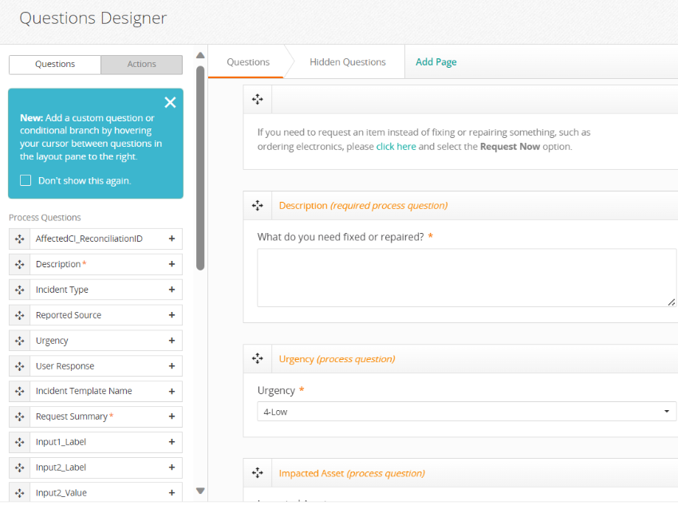

* Keep a one-to-one mapping between a service and its questionnaire. Associate a questionnaire with only one service, but you can use the same workflow for more than one service.
* Prefill known information or auto-complete answers. Create action triggers to prepopulate question responses with information from ITSM forms. For more information, see[Creating-questions-with-default-responses](https://docs.bmc.com/xwiki/bin/view/Service-Management/Employee-Digital-Workplace/BMC-Helix-Digital-Workplace/dwp254/Creating-and-managing-the-service-catalog/Building-service-catalogs/Creating-service-questionnaires/Creating-questions-with-default-responses/).
* Use forms to look up user assets and other data relevant to the request. Build selection menus for question responses where you can pull existing data from the external systems. For more information, see[Creating-selection-menus-for-question-responses](https://docs.bmc.com/xwiki/bin/view/Service-Management/Employee-Digital-Workplace/BMC-Helix-Digital-Workplace/dwp254/Creating-and-managing-the-service-catalog/Building-service-catalogs/Creating-service-questionnaires/Creating-selection-menus-for-question-responses/).  
    
  For example, you create a question for a site, and map the selection values to the SIT:Site form; site is a physical location with a mailing address, such as a building. When you complete the question, the settings appear as shown in the following image:  
    
  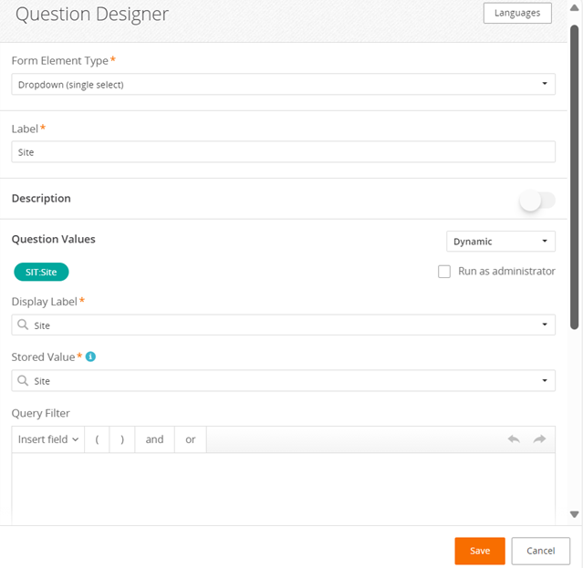
* Keep questions precise and easy to understand. Only ask questions that are necessary.
* Limit the number of questions to ensure good performance in retrieving, saving, and submitting the request.
* Shorten long questionnaires either by reducing the number of questions or by distributing the questions across multiple pages.  
    
  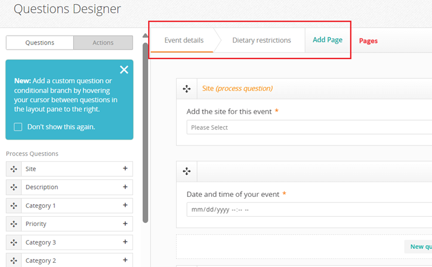
* If a questionnaire has a question that is a dropdown question based on a form, and that form has a lot of data, we recommend you use a lookup question instead of a dropdown question.
  + When a dropdown list loads for the user requesting the service, it loads all the data in the form. Users need to wait for the data to be downloaded and then for the question to be rendered. However, a lookup list retrieves data only when it is clicked.
  + If the number of records queried by the dropdown list is greater than the value of the**Max-Entries-Per-Query**, the result set is limited to the number of records specified in the**Max-Entries-Per-Query**. It is better to use a lookup question ifthe number of records exceeds**Max-Entries**.
  + When there are a large number of items, it's easier to search through a lookup list for the required data than to scroll through a dropdown list.
* Add indexes on searchable fields when querying custom records.
* When defining questions that result in a query against assets, restrict the results to a specific**Data Set Id**.

---

## <a id="getting-startedbest-practices-for-dwpbest-practices-for-designing-and-optimizing-servicmd"></a>Getting-Started/Best-Practices-For-Dwp/Best-Practices-For-Designing-And-Optimizing-Servic.md

HelixGPT enables users to request services directly through chat conversations in Virtual Agent and DWP. Administrators can make services requestable via chat by using the following methods:

* Importing services created in DWP Catalog into HelixGPT by using the Publish wizard.
* Using the Catalog Request Agent. Learn more about this agent in[Using HelixGPT to make services requestable via chat](https://docs.bmc.com/xwiki/bin/view/Service-Management/Employee-Digital-Workplace/BMC-Helix-Digital-Workplace/dwp254/Creating-and-managing-the-service-catalog/Using-BMC-HelixGPT-to-make-services-requestable-via-chat/).

Both methods allow users to interact with these services conversationally. These services typically include a set of questions that users answer in the chat to complete a request.

**Important**  
These best practices apply to chat-enabled services that administrators have made requestable via chat. They do not apply to catalog services that are not chat-enabled and are instead presented to users as clickable links in the Employee Navigator chat. For more information about suggesting services as clickable links, see[Using Employee Navigator to find AI-generated answers](https://docs.bmc.com/xwiki/bin/view/Service-Management/Employee-Digital-Workplace/BMC-Helix-Digital-Workplace/dwp254/Using-BMC-Helix-Digital-Workplace-to-request-services/Using-Employee-Navigator-to-find-AI-generated-answers/).

Related topics

[Creating-and-managing-the-service-catalog](https://docs.bmc.com/xwiki/bin/view/Service-Management/Employee-Digital-Workplace/BMC-Helix-Digital-Workplace/dwp254/Creating-and-managing-the-service-catalog/)

[Importing chat-enabled services from DWP into HelixGPT](https://docs.bmc.com/xwiki/bin/view/Service-Management/Employee-Digital-Workplace/BMC-Helix-Virtual-Agent/hva253/Integrating/Importing-chat-enabled-services-from-BMC-Helix-Digital-Workplace-Advanced-into-BMC-HelixGPT/)

[Designing service catalog - best practices](https://docs.bmc.com/xwiki/bin/view/Service-Management/Employee-Digital-Workplace/BMC-Helix-Digital-Workplace/dwp254/Getting-started/Best-practices-for-BMC-Helix-Digital-Workplace/Designing-service-catalog-best-practices/)

To ensure services are both discoverable and usable through HelixGPT, we recommend that you design services with conversational AI in mind. Services designed for visual interfaces might not translate well to AI-based conversational experiences. Traditionally, services that are meant to be requested via the application UI greatly rely on structured forms and questions with predefined logic. To guide users through a decision path, they ask a broad category question like*Software*or*Hardware*, then narrow down to options like*Laptop*or*Mobile*.

In contrast, HelixGPT aims to understand the user's intent with fewer questions. Therefore, creating simple and focused services can enhance usability and user experience in HelixGPT.

## Best practices for different user roles

Different user roles contribute to optimizing services for HelixGPT. The following table outlines best practices for each role:

| Role | Goal | Best practices | References |
| --- | --- | --- | --- |
| DWP Catalog administrator | Define and structure services to ensure that they suit well for HelixGPT.<br>These best practices apply to services made available in chat by using either the Publish wizard or the Catalog Request Agent.<br> | Create smaller, purpose-driven servicesthat are easier to prompt and maintain.<br>Avoid bundling multiple requests, such as a laptop, Wi-Fi, and accessories, into a single catalog item. Bundled services make it difficult for HelixGPT to determine the user's exact intent.<br> | [Designing service catalog - best practices](https://docs.bmc.com/xwiki/bin/view/Service-Management/Employee-Digital-Workplace/BMC-Helix-Digital-Workplace/dwp254/Getting-started/Best-practices-for-BMC-Helix-Digital-Workplace/Designing-service-catalog-best-practices/) |
| Create dedicated services for each specific use case.<br>Avoid creating services that cover multiple scenarios so that risk of misinterpretation is reduced.<br> |
| Break down complex conditional paths into multiple, simpler services that are easier to design, test, and maintain.<br>Avoid using complex conditional logic in your services. Conditional questions that change based on user input can be difficult to represent in conversational flows.<br> |
| Use simple and intuitive input methods that support a natural dialogue flow.<br>Avoid using forms that rely heavily on drop-down fields because they are designed for visual interfaces and might not translate naturally into chat conversation.<br> |
| Use clear and precise titles for catalog services.<br>Ensure each service title is descriptive and unambiguous. Descriptive titles help HelixGPT to quickly identify the requested service.<br> |
| Create unique titles for your services to improve accuracy in recognizing the user's intent.<br>Avoid similar service titles. If multiple services have similar names, HelixGPT might confuse them.<br> |
| Aim for clear, user-friendly language that is easily understood by a broad audience and is easier for HelixGPT to interpret.<br>Avoid using overly technical terms or internal jargon in service descriptions.<br> |
| Limit the number of questions because too many questions can affect chat performance and user experience. Keep questions concise and relevant to the request. | [Adding service questionnaires - best practices](https://docs.bmc.com/xwiki/bin/view/Service-Management/Employee-Digital-Workplace/BMC-Helix-Digital-Workplace/dwp254/Getting-started/Best-practices-for-BMC-Helix-Digital-Workplace/Adding-service-questionnaires-best-practices/) |
| When you create a questionnaire, consider the following question types that HelixGPT doesn't support in chat:<br>  * Table * Question with an option value whose length is greater than 64 * Conditional questions * Questionnaire actions in service * Lookup queries using filter expressions that refer to questions or fields that are populated with the process variable of the Service Broker Context data type (sbContext).  Additionally, consider chat limitations related to the following fields:<br>  * Text area—Supports only plain text and does not allow rich text formatting. * Attachment— Supports attaching only one file to each question in HelixGPT-powered Employee Navigator.  **Important:**This limitation applies specifically to services imported into HelixGPT by using the Publish wizard.*(Controlled availability)*For details on unsupported question types when using the Catalog Request Agent, see[Using HelixGPT to make services requestable via chat](https://docs.bmc.com/xwiki/bin/view/Service-Management/Employee-Digital-Workplace/BMC-Helix-Digital-Workplace/dwp254/Creating-and-managing-the-service-catalog/Using-BMC-HelixGPT-to-make-services-requestable-via-chat/).<br> | [Importing chat-enabled services from DWP into HelixGPT](https://docs.bmc.com/xwiki/bin/view/Service-Management/Employee-Digital-Workplace/BMC-Helix-Virtual-Agent/hva253/Integrating/Importing-chat-enabled-services-from-BMC-Helix-Digital-Workplace-Advanced-into-BMC-HelixGPT/) |
| Application business analysts in Virtual Agent and HelixGPT administrators | Enhance the discoverability and usability of services in HelixGPT.<br>These best practices apply only to importing services into HelixGPT by using the Publish wizard.<br> | When publishing a catalog service to HelixGPT, include multiple ways users might phrase their request. This approach improves HelixGPT’s ability to recognize and match the user's intent.<br>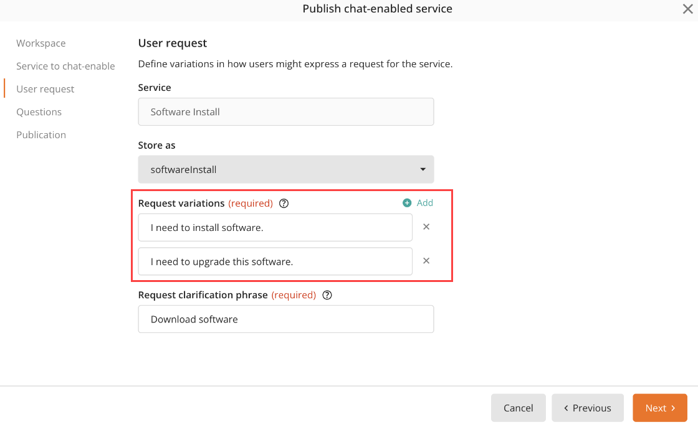<br>**Important:**Even though variations enhance the intent recognition, if you define too many similar variations for different services, HelixGPT might confuse them.<br> | * For importing services to be requested in Virtual Agent, see the*To modify the conversation data for the selected servic*e procedure in[Importing chat-enabled services from DWP into HelixGPT](https://docs.bmc.com/xwiki/bin/view/Service-Management/Employee-Digital-Workplace/BMC-Helix-Virtual-Agent/hva253/Integrating/Importing-chat-enabled-services-from-BMC-Helix-Digital-Workplace-Advanced-into-BMC-HelixGPT/). * For importing services to be requested in DWP, see[Generating prompts automatically from catalog services](https://docs.bmc.com/xwiki/bin/view/Service-Management/Employee-Digital-Workplace/BMC-HelixGPT/helixgpt253/Administering/Generating-prompts-automatically-from-catalog-services/). |
| Define a clarification phrase to be displayed when HelixGPT cannot determine the user’s intent.<br><br> |
| Enter a simplified form of the service question to suit your business needs. Question labels that are understandable in a visual interface might not be as clear in a conversational chat. Rephrasing questions for chat ensures that they are easier for users to understand during a conversation.<br><br> | * For importing services to be requested in Virtual Agent, see the*To modify the questions for a service in HelixGPT*procedure in[Importing chat-enabled services from DWP into HelixGPT](https://docs.bmc.com/xwiki/bin/view/Service-Management/Employee-Digital-Workplace/BMC-Helix-Virtual-Agent/hva253/Integrating/Importing-chat-enabled-services-from-BMC-Helix-Digital-Workplace-Advanced-into-BMC-HelixGPT/). * For importing services to be requested in DWP, see[Generating prompts automatically from catalog services](https://docs.bmc.com/xwiki/bin/view/Service-Management/Employee-Digital-Workplace/BMC-HelixGPT/helixgpt253/Administering/Generating-prompts-automatically-from-catalog-services/). |
| HelixGPT administrator | Test and customize prompts to improve how HelixGPT understands and responds to user queries.<br>These best practices apply only to services imported into HelixGPT by using the Publish wizard.<br> | Review how HelixGPT generates prompts from catalog services to understand how HelixGPT interacts with users. | [Prompts generated automatically from catalog services](https://docs.bmc.com/xwiki/bin/view/Service-Management/Employee-Digital-Workplace/BMC-HelixGPT/helixgpt253/Administering/Out-of-the-box-prompts-in-BMC-HelixGPT/Prompts-generated-automatically-from-catalog-services/)<br>[Generating prompts automatically from catalog services](https://docs.bmc.com/xwiki/bin/view/Service-Management/Employee-Digital-Workplace/BMC-HelixGPT/helixgpt253/Administering/Generating-prompts-automatically-from-catalog-services/)<br>[Router prompt](https://docs.bmc.com/xwiki/bin/view/Service-Management/Employee-Digital-Workplace/BMC-HelixGPT/helixgpt253/Administering/Out-of-the-box-prompts-in-BMC-HelixGPT/Router-prompt/)<br> |
| Review and refine prompts that are generated from catalog services to ensure they reflect natural language and are user-friendly while meeting your organization's needs. However, you must not modify the variables, tags, and the JSON input. | [Prompts generated automatically from catalog services](https://docs.bmc.com/xwiki/bin/view/Service-Management/Employee-Digital-Workplace/BMC-HelixGPT/helixgpt253/Administering/Out-of-the-box-prompts-in-BMC-HelixGPT/Prompts-generated-automatically-from-catalog-services/)<br>[Generating prompts automatically from catalog services](https://docs.bmc.com/xwiki/bin/view/Service-Management/Employee-Digital-Workplace/BMC-HelixGPT/helixgpt253/Administering/Generating-prompts-automatically-from-catalog-services/)<br> |
| Use the skill testing capability to simulate conversations, debug issues, and refine prompts to achieve the desired results. | The*To test a skill*procedure in[Creating and managing skills](https://docs.bmc.com/xwiki/bin/view/Service-Management/Employee-Digital-Workplace/BMC-HelixGPT/helixgpt253/Administering/Creating-and-managing-skills/). |
| HelixGPT administrator | *(Controlled availability)*Modify the settings and prompt of the Catalog Request Agent. | Modify the default prompt of the Catalog Request Agent. In addition, modify the number of services, questions, and probable answers that the Catalog Request Agent provides to the end users.<br>These changes help tailor the user experience, improve response accuracy, and enhance performance.<br> | [Using HelixGPT to make services requestable via chat](https://docs.bmc.com/xwiki/bin/view/Service-Management/Employee-Digital-Workplace/BMC-Helix-Digital-Workplace/dwp254/Creating-and-managing-the-service-catalog/Using-BMC-HelixGPT-to-make-services-requestable-via-chat/) |
| End user | Request services through HelixGPT. | Select values from the lookup or drop-down fields rather than entering them manually.<br>When users respond to questions in a chat, the Lookup and Drop-down question types support the following input methods:<br>  * By selecting the required value from the list—Users can enter a partial phrase in the field to filter the list of available options. Partial word matching is supported, making it easier to find and select the desired value. * By typing an answer directly into the chat—Partial word matching is not supported. Users must enter the complete word or exact value to answer the question. If a partial value is submitted, HelixGPT will return an error. | *Not applicable* |

---

## <a id="getting-startedbest-practices-for-dwpconfiguring-search---best-practicesmd"></a>Getting-Started/Best-Practices-For-Dwp/Configuring-Search---Best-Practices.md

Search helps end users find correct, structured, and useful information at the correct time and place. Search in DWP can be configured to provide results relevant to the user's intent.We recommend that you review the following best practices when configuring search in the application.

Related topics

[Search-in-DWP](https://docs.bmc.com/xwiki/bin/view/Service-Management/Employee-Digital-Workplace/BMC-Helix-Digital-Workplace/dwp254/Getting-started/Key-concepts/Search-in-BMC-Helix-Digital-Workplace/)

[Configuring-search](https://docs.bmc.com/xwiki/bin/view/Service-Management/Employee-Digital-Workplace/BMC-Helix-Digital-Workplace/dwp254/Administering/Administering-BMC-Helix-Digital-Workplace/Configuring-search/)

End users can also use HelixGPT to find answers to their queries through the global search bar on the Catalog, My Activity, or other custom pages created in the Studio. The generative AI retrieval processgenerates answers to queries instead of providing a list of knowledge articles.For more information, see[Using-Employee-Navigator-to-find-AI-generated-answers](https://docs.bmc.com/xwiki/bin/view/Service-Management/Employee-Digital-Workplace/BMC-Helix-Digital-Workplace/dwp254/Using-BMC-Helix-Digital-Workplace-to-request-services/Using-Employee-Navigator-to-find-AI-generated-answers/).

## Personas

Identify your user personasand tailor the user experience to fit their regional, cultural, and language preferences, as well as accessibility requirements. Learn about your audience's needs, how they search, theirpreferred words, and images, and what will help them get their job done.Structure your service catalog to address the distinct needs of different employee groups. Different roles within the organization, like admin, sales, and tech teams, might need very different IT services. Make sure each role gets the correct services they need for their job.If you have a diverse DWP, think about creating dedicated studio pageswith limited search options.

### Scenario: Different service catalog views

Scenario

Britney, a salesperson, is assisting a customer with their purchase. She notices that the billing software is acting up. She wants to report the issue to the IT department to get it resolved immediately. She logs in to the end-user portal and accesses the service catalog, which is designed specifically for employees like her. The interface is straightforward, with prominent options for reporting technical issues, accessing FAQs for common troubleshooting,mobile applications for on-the-go access,and inventory management software. Britney selects the option to report a technical issue, fills out a simple form, and submits the request.

Meanwhile, Sarah, the marketing manager, accesses the same service catalog but views a different catalog tailored to her role. The catalog is more comprehensive, offering a range of options related todigital marketing platforms, analytics tools, marketing automation tools, social media management platforms, and campaign tracking software.

For a salesperson like Britney, the IT service catalog UI is streamlined and focused on addressing immediate technical issues. For a marketing manager like Sarah, the service catalog caters to her needs for requesting new solutions or features to support strategic initiatives and marketing campaigns.

## Taxonomy

Enhance the searchability and navigation of your catalog by properly categorizing and organizing knowledge articles and catalog items.Tailor the taxonomy to suit specific regions, cultures, languages, and other relevant factors.

### Scenario: Service catalog taxonomy for employees across geographies

Scenario

Britney, transferred to a new office location, discovers that her previous hardware is incompatible in her new work environment. In response to Britney's issue, Hannah, the catalog manager, recognizes the need for an IT service catalog that accounts for regional and cultural differences and creates a bespoke service catalog. Understanding the importance of easy navigation and relevance to diverse contexts, Hannah restructures the catalog to cater specifically to the unique requirements of each geographic location, taking into account regional technology preferences, software usage patterns, and IT infrastructure variations. For example, the service catalog now has hardware options compatible with regional standards, such as voltage requirements or language-specific keyboard layouts, ensuring employees have the appropriate devices for their location.

## Catalog profile optimization

* Use accurate comprehensive content in the**Title**,**Description**, and**Tags**fields of a catalog profile.These are primary search fields. Good content in these fields ensures effective catalog searches.

<details class="confluence-expand-macro panel panel-default"><summary><span class="panel-title"><span class="title-text">Catalog service profile fields</span></span></summary><div class="panel-body"><p></p></div></details>

* Use a uniform tagging system for all your catalog items and add keywords in the**Tags**field.
* Use meaningful icons in the logo field to represent services effectively.  
    
  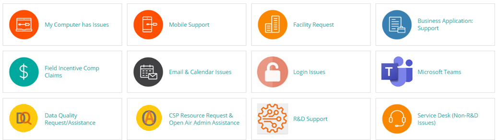

## Number of results returned by search

Do not overwhelm users with too many results.

* **AND logic**—Enable the AND logic setting if you want to narrow the search. The AND logic will return items that match all search terms.DWP Catalogitems are searched using AND logic, whereas Service Request Management items are searched by using OR logic to match keywords.
* **Effective use of search sources**—Minimize the number of search sources to streamline the search and narrow down the results. You can make it easier for users to find relevant information by designing studio pages with a narrower search scope. For theHKMsource, use filters that utilize article tags toprovide even more precise search results.
* **Wildcards**—Enable wildcards to accommodate spelling variations that might affect search results. This feature helps users to search using alternate spellings and variations of a term and get more comprehensive search results. You can enable wildcard search forDWP Catalogitems. In DWP,global search supports*Begins with*searches, recognizing both complete words and partial ones. For example, a search for printer-related documents displays relevant results even with just "pri" entered. By default, search-related settings for pluggable providers are disabled to prevent interference with full-text search, language-specific tokenization, stemming, and relevance logic.Not all sources support searching with wildcards.

  **Important**

  Leading wildcards are not supported if the search is performed on fields that are indexed for Full Text Search (FTS). Only trailing wildcards are supported for these fields.For more information about wildcards, see[How search with wildcards works](https://docs.bmc.com/xwiki/bin/view/Service-Management/Employee-Digital-Workplace/BMC-Helix-Digital-Workplace/dwp254/Getting-started/Key-concepts/Search-in-BMC-Helix-Digital-Workplace/#SearchinBMCHelixDigitalWorkplace-wildcards).
* **Date Filter**–The Global Search in ITSM searches for the DWPC requests according to the value in the**default submitted date filter in days**field. Use this field to list only the results submitted within the specified number of days, back from today.  
  We recommend that you set this value to 90. To disable this filter, set this value to 0.

## Knowledge base

* Maintain a quality knowledge base. A well-maintained knowledge base is highly effective in quick and low effort task completion.
* Create content that matches the users' needs and vocabulary, taking into account regional, cultural, and linguistic differences.
* Make sure that knowledge articles are tagged consistently.
* Configure filters to use tags that provide geo-based, company-based, or other specific search results.
* Personalize the content to specific contexts as needed, by creating variants of an article. Cultural variants might include examples, references, or illustrationsrelevant to diverse user backgrounds.Article variants can also accommodate varying user roles, skill levels, or preferences, offering personalized guidance and support.
* Implement a strict process to maintain the articles best supported byHKM.
* Consider prioritizing automated catalog items or the knowledge base based on your needs. Enable the**Natural language searching**setting to facilitate the distinction between catalog items and knowledge articles. This feature enables the search engine to comprehend the context of a sentence or phrase, discern the user's intent, and deliver relevant results accordingly.

## Search bar configuration

Add search bars in your studio pages to allow users to find things on their own and resolve their issues without the need to raise help-desk tickets or to contact support. Make sure the search bar is prominently positioned at the top of studio pages, accompanied by a search icon, and sized appropriately to accommodate typical search queries. Use variables to personalize the search bar text based on the user initiating the search, enhancing the user experience.

## Catalog and knowledge base cleanup

Periodically review catalog items and knowledge articles for usage. Remove or unpublish unused items.

## Permissions for users

Make sure that only users with the correct permissions canaccess articles and services displayed in search results. Hide pages from users who lack the requisite permissions to view them.

## Feedback

Use satisfaction surveys to collect information about your users to improve their search experience.

## customer success webinar

Watch the following webinar to learn how to improve search in DWP.

[🎥 Watch Video: https://www.youtube.com/watch?v=SB022vFsKgY](https://www.youtube.com/watch?v=SB022vFsKgY)

[Webinar: How To Improve Search In DWP](https://www.youtube.com/embed/SB022vFsKgY)

---

## <a id="getting-startedbest-practices-for-dwpcreating-studio-pages---best-practicesmd"></a>Getting-Started/Best-Practices-For-Dwp/Creating-Studio-Pages---Best-Practices.md

Use the Studio to create visually appealing and effective pages suited for your lines of business, including Facilities, Travel, Human Resources, and Legal. We recommend that you review the following best practices when configuring your studio pages.

Watch the following webinar (1:05:55) to learn how to create your self-service portal using the DWP Studio:

[🎥 Watch Video: //www.youtube.com/watch?v=kUVi00J7Fiw](//www.youtube.com/watch?v=kUVi00J7Fiw)

[Webinar: A Recipe For Success When Using DWP Studio](https://youtu.be/kUVi00J7Fiw?si=SKgJbrbtKV2ejQyo)

Related topics

[Creating-pages-in-the-studio](https://docs.bmc.com/xwiki/bin/view/Service-Management/Employee-Digital-Workplace/BMC-Helix-Digital-Workplace/dwp254/Administering/Administering-BMC-Helix-Digital-Workplace/Creating-workplaces-for-your-lines-of-business/Creating-pages-in-the-studio/)

## Sample pages and templates

* Leverage the sample pages for a quick start to creating your pages. For more information, see[Sample-pages](https://docs.bmc.com/xwiki/bin/view/Service-Management/Employee-Digital-Workplace/BMC-Helix-Digital-Workplace/dwp254/Administering/Administering-BMC-Helix-Digital-Workplace/Creating-workplaces-for-your-lines-of-business/Sample-pages/).
* Make a copy of a page, look at the settings, tweak them, or play around with the options toachieve your desired page appearance.
* Design a set of pages with settings aligned withyour company's branding or specific lines of business in terms of color and appearance. Use these pages as templates by duplicating them to create additional pages. This shortcut saves you the time typically spent on creating pages from scratch, ensuring a consistent look and feel across all pages
* Use color themes to differentiate pages for different lines of business. When using colors, remember that colors mean different things to different people and may even have a cultural significance. For more information, see[Using-colors-to-create-visually-appealing-pages](https://docs.bmc.com/xwiki/bin/view/Service-Management/Employee-Digital-Workplace/BMC-Helix-Digital-Workplace/dwp254/Administering/Administering-BMC-Helix-Digital-Workplace/Creating-workplaces-for-your-lines-of-business/Using-colors-to-create-visually-appealing-pages/).

## Page components

* Arrange the page components to establish a clear visual hierarchy, in line with the page's purpose. Consider the sequence in which you want your users to engage with the elements, then place them accordingly on the page.Arrange components in rows and columns to create structured and engaging page layouts. For more information, see[Designing-page-layouts-with-rows-and-columns](https://docs.bmc.com/xwiki/bin/view/Service-Management/Employee-Digital-Workplace/BMC-Helix-Digital-Workplace/dwp254/Administering/Administering-BMC-Helix-Digital-Workplace/Creating-workplaces-for-your-lines-of-business/Designing-page-layouts-with-rows-and-columns/).
* Use a*mobile first*strategy to structure your content hierarchy effectively. Due to the limited space available on small screens, you will prioritize creating practical layouts and remove unnecessary elements that might impede page rendering or navigation.
* Use wireframes,which are diagrams or sketches showing where each component should be placed.Wireframes help you plan the layout of a page before you begin work on the page. Create a wireframe of your page and add placeholders for the text and images.
* Place the search bar in an expected, conventional location, typically at the top of the page, to make sure the search functionality is available and easily accessible. Include a search icon in the search bar for added visual clarity.  
  You can place the search bar (standalone) with other page components in a row (horizontally) to create an integrated and visually structured page layout. For information about limitations while placing multiple page components in a row, see[Restrictions for using page components in rows](https://docs.bmc.com/xwiki/bin/view/Service-Management/Employee-Digital-Workplace/BMC-Helix-Digital-Workplace/dwp254/Administering/Administering-BMC-Helix-Digital-Workplace/Creating-workplaces-for-your-lines-of-business/Designing-page-layouts-with-rows-and-columns/#Designingpagelayoutswithrowsandcolumns-restrictions).
* Draw your users' attention to specific content by adding a catalog banner and positioning it at the top of your page.
* Design more granular components like content blocks, then copy them to use as templates.
* Add empty containers as spacing placeholders in the layout if a row has multiple blocks. Replace these later with real component blocks. Start by filling the first container with a content block to achieve the desired appearance. For multiple blocks of equal width, use the first content block as a template. Copy and paste it into the other containers.

## Form factor and device size

Design your components in a way that they can be displayed correctly on different screen sizes and devices. Your end users may access your application from desktops, mobiles, or other devices. The difference in screen size and display area make it difficult for a component that looks great on a desktop to display well on a mobile device.

* Adjust the alignment of text and images to suit different screen sizes and orientation. Avoid designs that need specific alignments between text and background because they tend to be less responsive.
* While catalog sections and out-of-the-box components typically resize and work consistently across devices, some components such as content blocks need adjustments for optimal appearance on mobile devices. To handle this challenge, duplicate the component and configure it separately for small, medium, and wide screens.
* After you configure a component, preview it to test its appearance on different device sizes.

## Images

* Leverage in-house marketing and design resources.
* Do not use restricted file types for images.
* Balance image quality with file size because large file sizes take longer to load.
* Do not make images larger than they need to be, especially for mobile devices.

---

## <a id="getting-startedbest-practices-for-dwpcreating-workflows---best-practicesmd"></a>Getting-Started/Best-Practices-For-Dwp/Creating-Workflows---Best-Practices.md

As a catalog administrator, you create workflows for service fulfillment. We recommend that you review and implement the following best practices when configuring your service fulfillment workflows.

Related topics

[Workflows-for-service-fulfillment](https://docs.bmc.com/xwiki/bin/view/Service-Management/Employee-Digital-Workplace/BMC-Helix-Digital-Workplace/dwp254/Creating-and-managing-the-service-catalog/Building-service-catalogs/Workflows-for-service-fulfillment/)

## Creating workflows

Make sure you refer to common questions such as how to create workflows inDWP Catalog, how to submit a service request usingDWP CatalogREST API, how to simplify string building inDWP Catalog, and so on at[BEST FAQ on DWP Catalog for catalog workflows](https://community.bmc.com/s/article/BEST-FAQ-on-BMC-Helix-Digital-Workplace-Catalog-Workflow).

The following image shows a sample workflow to create an account:  


* Determine the workflow scenarios including the need for approval, the type of approval required, and the necessary fulfillments such as cases, work orders, and incidents.
* To increase efficiency, simplify, standardize, and minimize the number of workflows. Fewer workflows mean less development effort and less troubleshooting.
* Create generic, reusable workflows. Avoid creating a separate workflow from scratch for every service. When creating a new service, analyze whether an existing generic workflow can be reused.You can use one workflow for many services, but make sure you have a one-to-one mapping between a service and a questionnaire.Leverage the workflows in the IT-content pack. For more information, see[Setting up the IT content pack](https://docs.bmc.com/xwiki/bin/view/Service-Management/IT-Service-Management/BMC-Helix-ITSM/itsm251/Setting-up-and-going-live/Setting-up-the-IT-content-pack/).  
  Learn how to create reusable workflows at[Configurable, reuseable workorder workflow](https://community.bmc.com/s/news/aA33n000000D0ZbCAK/configurable-reuseable-workorder-workflow)on Communities.
* Use templates to set fulfillment values and automation mechanisms to create work orders, cases, and incidents and reduce the reliance on the service desk.
* If service requirements do not match existing workflows, develop new workflows and prioritize their development.
* Identify the tasks in your workflow and create a flowchart.
* Do not overload a workflow with all the logic in one huge workflow. A workflow with many steps takes longer to load in the designer.It may also become difficult to understand how the steps are connected, especially if links between process activities cross. We recommend that you split the logic in another process and use a**Call Activity**element to call this process. For example, when you have exclusive gateways each branch might do the same thing with a few differences. You could add one process that would handle the different use cases, and this process could be used in each branch, with different parameters.

* Use a subprocess to collapse process steps. Splitting your workflow into smaller workflows makes it easier to understand complex workflows. M ove repeated activities into a subprocess. This approach also helps to isolate callbacks thus preventing them from triggering the wrong sequence of the workflow. This can happen if you create two incidents in a row within the same branch of a workflow.
* Use automation wherever possible. For more informaton, see[Automating-service-requests](https://docs.bmc.com/xwiki/bin/view/Service-Management/Employee-Digital-Workplace/BMC-Helix-Digital-Workplace/dwp254/Getting-started/Use-cases/Automating-service-requests/).
* When you design a workflow, first create the process inputs. Map each process input to a process question; the question can be answered by the user or have a default value. By using process variables, you can attach the same workflow to different services, and still provide specific information based on the service.
* If you need to reference an output expression from one activity and use it in other activities in a workflow, assign a local variable to the output expression of the activity.
* If a questionnaire, along with the workflow, is imported from the AWS Service Catalog, set all questions to**Required**.
* If a questionnaire is attached to a workflow that uses AWS Marketplace actions, set all questions to**Required**.
* To prevent a failure in a workflow from processing as expected, use an Error Boundary event to identify the workflow path that must be followed to resolve the error.
* If a workflow has an approval step, make sure the approver field is correctly filled in. For example, if a workflow requires manager approval, fill in the manager field in the CTM:People form. If a user doesn't have a manager assigned, such approval requests will fail.
* For future reference and understanding, document all services and workflows:
  + Document each step, including all decision points.
  + Design the workflow diagram to improve readability.
  + Align elements, use the same size for elements, and add labels when workflows branch.

## Testing and troubleshooting workflows

* After you create a workflow, verify that it works correctly. Iterate and test your workflows, identify improvements, and refine the flows accordingly.
* Test a workflow against its business requirement.
* Make sure your workflow passes through the DEV and QA stages before you deploy it to your PROD environment.
* Test your workflowto make sure you can deliver services within the Service Level Agreements (SLAs).
* Check the workflow execution in the service request report. When you open a service to view its details, the**Error Details**tab shows error details if the service request was unsuccessful. Analyze the For more information, see[Reviewing-the-status-of-service-requests](https://docs.bmc.com/xwiki/bin/view/Service-Management/Employee-Digital-Workplace/BMC-Helix-Digital-Workplace/dwp254/Creating-and-managing-the-service-catalog/Reviewing-the-status-of-service-requests/). See also managing processes in[IS](https://docs.bmc.com/xwiki/bin/view/Service-Management/Innovation-Suite/BMC-Helix-Innovation-Suite/is251/)documentation.
* Enable and download the process log file. Process logs capture the information and errors that occur in a workflow. Review the log file to Understand how the process flows from the workflow elements, what value a variable has, and other information.  
  Perform the following steps to enable process logs:

* 1. Log in to Mid Tier, as an administrator.
  2. Select**AR System Management Console > AR System Server Group Console**.
  3. Select**Logs > Logs Management**.
  4. Select either**Server**or**Template**to load the required settings.

* 1. Select**All servers**.
  2. Enable**Process.log**.
  3. Click**Apply**.

* To view the process logs, perform the following steps:
  1. Select**Logs > View Logs**.
  2. Select the server for which you want to view the logs.
  3. Select**process.log**from the log file list, and click**Get File**.
  4. Select the file name in the attachment field and click**Save to Disk.**
  5. Select the download directory and save the log file.
  6. Review the contents of the file to troubleshoot the workflow.

## Editing workflows

* If you want to edit a workflow, make a copy of the workflow and edit the copy.This method ensures the in-process requests are not affected by changes you make.
* When you edit workflows, record what you did and why. This information helps others understand the changes you made.

## Importing workflows

* Take a backup from the PROD environment. If you need to roll back, import the old version.
* When importing, select the option to create a new copy instead of overwriting a workflow.

## Connect with Webinar

Watch the following webinar to learn more about common workflow creation use cases and best practices:

[🎥 Watch Video: https://www.youtube.com/watch?v=YzAVY-3IAnE](https://www.youtube.com/watch?v=YzAVY-3IAnE)

[Webinar: DWP Catalog: Common Workflow Creation Use Cases & Best Practices](https://www.youtube.com/embed/YzAVY-3IAnE)

## Support webinar

Watch the following webinar to learn how to create custom workflows:

[🎥 Watch Video: https://www.youtube.com/watch?v=yX4e51I0gOo](https://www.youtube.com/watch?v=yX4e51I0gOo)

[Webinar: A custom workflow example](https://www.youtube.com/embed/yX4e51I0gOo)

---

## <a id="getting-startedbest-practices-for-dwpdesigning-service-catalog---best-practicesmd"></a>Getting-Started/Best-Practices-For-Dwp/Designing-Service-Catalog---Best-Practices.md

The service catalog is a listing of all services that you offer to your end users. It lists only items that are currently available. We recommend that you implement the following best practices when configuring your service catalog.

Related topics

[Creating-and-managing-the-service-catalog](https://docs.bmc.com/xwiki/bin/view/Service-Management/Employee-Digital-Workplace/BMC-Helix-Digital-Workplace/dwp254/Creating-and-managing-the-service-catalog/)

[Designing and optimizing services for HelixGPT - best practices](https://docs.bmc.com/xwiki/bin/view/Service-Management/Employee-Digital-Workplace/BMC-Helix-Digital-Workplace/dwp254/Getting-started/Best-practices-for-BMC-Helix-Digital-Workplace/Designing-and-optimizing-services-for-BMC-HelixGPT-best-practices/)

## Planning

An essential resource, the service catalog assists users in completing their tasks. A well-designed catalog improves user experience and satisfaction and is flexible to design and maintain. The planning stage plays a crucial role in ensuring that the service catalog, service delivery, and fulfillment meet their intended goals.

* **Users**—Identify the users who use your services and build the catalog to fulfill their needs.Understand the different end users' needs and what will help them get their job done. When creating services for a global audience, think about how people from different cultures see things. The content, color, and other elements of a service must reflect the cultural norms and customs of the target users. Or, keep all elements neutral to appeal to all users.
* **Catalog design team**—Identify the people in your service catalog design team and assign them responsibilities. It is essential to have a design team because otherwise you might end up with a service catalog that doesn't meet its goals.For example, a service owner might not understand the business context of a service and might create a service that does not deliver the necessary user experience.
  + Service owner: Defines, designs, and manages the services within the catalog or subcatalog
  + Business owner: Aligns the service catalog with the overall business strategy, oversees the lifecycle of services, and promotes the catalog within the organization
  + Solution architect: Designs a robust and user-friendly service catalog. Provides technical guidance for process design, development, and implementation
  + User experience designer: Conducts user research and usability testing, maps the user journey, organizes content and navigation, and enhances the user experience
* **Services**—Identify the services existing in the organization. Consult with the various departments to get a comprehensive list of services required. Identify the most frequently requested services, high-priority services, and services that can be automated.
* **Service categories**—Group the services into categories that make it easier for your users to quickly and easily find and request services. Users can filter the service catalog by categories. If you use abbreviations, make sure these are understood by your users. Create a taxonomy that considers the diverse locales and cultures, and use keywords to help users navigate to the correct service or content. When users are located in different regions, you might need to localize categories and services.
* **Catalog sections**—Use catalog sections to group and categorize your services for easy administration and end-user experience. A well-organized catalog helps users quickly find what they need. Use the available out-of-the-box catalog sections or add more according to your requirements.
* **Subcatalogs**—Delegate the responsibility of managing an extensive service catalog by creating subcatalogs and assigning subcatalog administrators to manage them.
* **Knowledge base**—Decide whether to emphasize automated catalog items or the knowledge base. Consider whether you can automate a task and create a service for it or whether you want to create a knowledge article instead. Make sure that knowledge articles are tagged consistently so that users can find the right articles. Configure relevant services or service bundles to be displayed with knowledge articles, permitting end users to request related services in the context of the knowledge article.


## Service design

When creating a service, remember the following points:

* Define service requests based on items users are likely to search for.
* **Service title**—Make sure it uniquely identifies the service. Add good content in this field because it has the higest weight in a catalog item search. For more information, see[Adding-catalog-profile-details-to-a-service](https://docs.bmc.com/xwiki/bin/view/Service-Management/Employee-Digital-Workplace/BMC-Helix-Digital-Workplace/dwp254/Creating-and-managing-the-service-catalog/Building-service-catalogs/Adding-and-updating-services/Adding-catalog-profile-details-to-a-service/).
* **Description**—Add an accurate and concise description of the service.
* **Service logo**—Use an icon that correctly represents the service offered or category of services. Icons and images not only make your catalog visually appealing, they help in visual recognition of a service.
* **Tags**—Identify and use tags to help users find a service quickly through a search. Make sure tagging is consistent.

  <details class="confluence-expand-macro panel panel-default"><summary><span class="panel-title"><span class="title-text">Catalog profile fields</span></span></summary><div class="panel-body"><p></p></div></details>
* **Questionnaire**—Note what answers are needed from the requester to fulfill the request and design the questionnaire accordingly. For more information, see[Creating-service-questionnaires](https://docs.bmc.com/xwiki/bin/view/Service-Management/Employee-Digital-Workplace/BMC-Helix-Digital-Workplace/dwp254/Creating-and-managing-the-service-catalog/Building-service-catalogs/Creating-service-questionnaires/).
* **Bundling of services**—Decide whether the service is to be a standalone service or whether it can be bundled with other services. Bundling of services simplifies the catalog. Package items together that users should consider ordering at the same time. For example, a full computer system service can have laptop, external monitor, mouse, wireless keyboard, and a laptop backpack.However, do not create one general service with different items, likeone request called software.  
    
  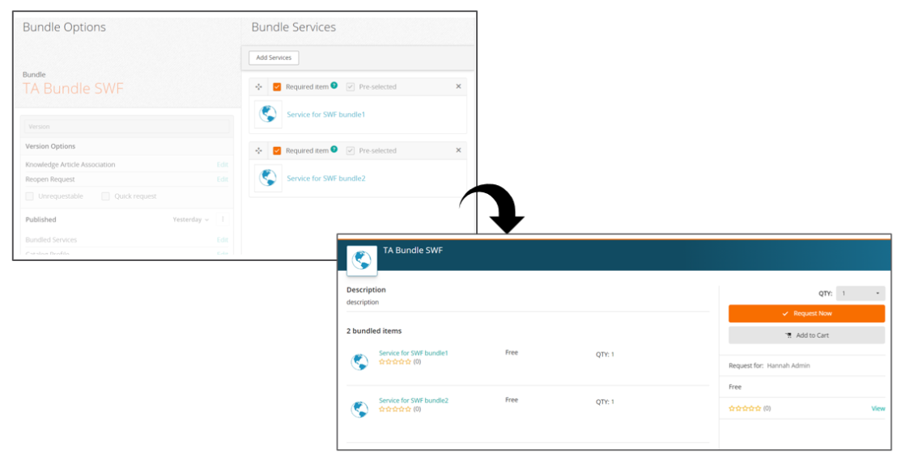
* **Searchable services**—Make your service easily searchable. Optimize the content in title, description, and tags fields for findability. For more information about making your services searchable, see[Configuring-search](https://docs.bmc.com/xwiki/bin/view/Service-Management/Employee-Digital-Workplace/BMC-Helix-Digital-Workplace/dwp254/Administering/Administering-BMC-Helix-Digital-Workplace/Configuring-search/).
* **Workflows**—Set up fulfillment workflows to ensure smooth and seamless service delivery.  
  A sample workflow to create a user account:  
    
  
* **SLAs**—Define SLAs for service requests and make sure todeliver services within agreed service levels. For more information, see[Setting-service-level-agreements](https://docs.bmc.com/xwiki/bin/view/Service-Management/Employee-Digital-Workplace/BMC-Helix-Digital-Workplace/dwp254/Creating-and-managing-the-service-catalog/Building-service-catalogs/Adding-and-updating-services/Setting-service-level-agreements/).
* **Display of information**—Make sure each service displays all attributes including cost and date of fulfillment.
* **Testing**—Test your services with a group of users and modify the services as needed.
* When you create a new service, make sure you include it in a catalog section and entitle users to the service.

## Mobile considerations

* **Streamline navigation**—Give preference to the service categories and service that are accessed frequently. Adjust the navigation for scrolling.
* **Service description**—Make service descriptions clear and concise to convey key information about the service to the user.
* **Images**—Use icons that are intuitive and easily recognizable. Use scalable icons and compressed images, which load faster. Use color to make images stand out and contrast to make sure that the images are visible. Make sure you optimize image size without losing quality.
* **Minimize scrolling**—Present important information upfront and use expandable sections for user input or pre-populated options. Use menus that show a list of headers that can be used to hide or show content.
* **Performance optimization**—Reduce page load times by using appropriately sized icons, in terms of both resolution and size.

## Service visibility to users

* Target content to different audiences. Use entitlements to permit users to access services. Reduce the noise and let users find relevant services or items quickly.
* Use virtual marketplaces or people groups to entitle end users to view and request published services. People groups permit you to target content based on their foundation attributes. To learn more, see[Entitling-end-users-to-services-bundles-and-banners](https://docs.bmc.com/xwiki/bin/view/Service-Management/Employee-Digital-Workplace/BMC-Helix-Digital-Workplace/dwp254/Creating-and-managing-the-service-catalog/Entitling-end-users-to-services-bundles-and-banners/).
* If you use virtual marketplaces, and if you enable the full catalog view, all users can view and request all services and bundles in the catalog (unless the items are included in the restricted entitlements list).
* Assign studio pages to people groups by using the**Entitlement**action, making entire pages available to the selected groups. For example, you can create a page for hiring managers and make the page visible to only those users who have the hiring manager role. For more information, see[Making-studio-pages-available-to-end-users](https://docs.bmc.com/xwiki/bin/view/Service-Management/Employee-Digital-Workplace/BMC-Helix-Digital-Workplace/dwp254/Administering/Administering-BMC-Helix-Digital-Workplace/Creating-workplaces-for-your-lines-of-business/Making-studio-pages-available-to-end-users/).
* Make sure a user is not assigned to conflicting permission groups inDWP Catalog. A user may belong to more than one group and the permissions of these groups might conflict. For example, a user is a member of two groups where one group has access to a service while the other group does not have access to a service.

## Streamline checkout

Keep questionnaires precise. When creating questionnaires, remember the amount of information users need to fulfill a request. For more information, see[Adding-service-questionnaires-best-practices](https://docs.bmc.com/xwiki/bin/view/Service-Management/Employee-Digital-Workplace/BMC-Helix-Digital-Workplace/dwp254/Getting-started/Best-practices-for-BMC-Helix-Digital-Workplace/Adding-service-questionnaires-best-practices/).

## Service automation

Reduce manual tasks and free up your service desk employees to handle requests that need their expertise. Automate frequently requested tasks such as password resets, software installation, add or remove users from the Active Directory, and so on. For information about service automation, see[Automating-service-requests](https://docs.bmc.com/xwiki/bin/view/Service-Management/Employee-Digital-Workplace/BMC-Helix-Digital-Workplace/dwp254/Getting-started/Use-cases/Automating-service-requests/).

## Reports, user experience, and feedback

The enterprise service store generates data and analytics on service usage, user feedback, and performance metrics. Use the insights to see failures and troubleshoot process issues.Create surveys to get feeback from your users periodically to keep your services relevant and updated. For more information about creating surveys, see[Setting-up-surveys](https://docs.bmc.com/xwiki/bin/view/Service-Management/Employee-Digital-Workplace/BMC-Helix-Digital-Workplace/dwp254/Creating-and-managing-the-service-catalog/Setting-up-surveys/).

## Process to maintain your service catalog

The following graphic shows the process to maintain your service catalog:


The following table provides the sequence of steps to update and maintain your service catalog:

| Step<br> | Name<br> | Action<br> |
| --- | --- | --- |
| 1<br> | Develop feedback mechanisms<br> | Collect inputs from users through surveys, ratings, and direct communication.<br> |
| 2<br> | Review catalogs regularly<br> | Periodically review the catalog's content, descriptions, and structure with stakeholders.<br> |
| 3<br> | Conduct usability studies<br> | Regularly seek user feedback and conduct usability studies. Prioritize user needs in improvements.<br> |
| 4<br> | Use an agile approach for updates<br> | Begin with simpler services and iterate using an Agile approach.<br> |
| 5<br> | Develop a backlog<br> | Prioritize services considering volume, impact, cost savings, and complexity.<br> |
| 6<br> | Update the backlog<br> | Continuously add services to the catalog to match evolving business needs.<br> |
| 7<br> | Collaborate with stakeholders<br> | Engage various stakeholders in the design and development process.<br> |
| 8<br> | Follow through<br> | Establish a regular review and improvement schedule with measurable goals.<br> |

---

## <a id="getting-startedkey-conceptsmd"></a>Getting-Started/Key-Concepts.md

Before you proceed, you should understand some of the basics and key offerings of the product. This section gives you an overview of different aspects of the product that let you better leverage its functionalities.

Related topics

[Use-cases](https://docs.bmc.com/xwiki/bin/view/Service-Management/Employee-Digital-Workplace/BMC-Helix-Digital-Workplace/dwp254/Getting-started/Use-cases/)

[Getting-started](https://docs.bmc.com/xwiki/bin/view/Service-Management/Employee-Digital-Workplace/BMC-Helix-Digital-Workplace/dwp254/Getting-started/)

| Action<br> | Reference<br> |
| --- | --- |
| Learn about the DWP architecture. | [DWP architecture](https://docs.bmc.com/xwiki/bin/view/Service-Management/Employee-Digital-Workplace/BMC-Helix-Digital-Workplace/dwp254/Getting-started/Key-concepts/BMC-Helix-Digital-Workplace-architecture/) |
| Learn about the DWP catalog architecture. | [DWP Catalog architecture](https://docs.bmc.com/xwiki/bin/view/Service-Management/Employee-Digital-Workplace/BMC-Helix-Digital-Workplace/dwp254/Getting-started/Key-concepts/BMC-Helix-Digital-Workplace-Catalog-architecture/) |
| Learn how a service request is processed from start to end.<br> | [Service-request-approvals](https://docs.bmc.com/xwiki/bin/view/Service-Management/Employee-Digital-Workplace/BMC-Helix-Digital-Workplace/dwp254/Getting-started/Key-concepts/Service-request-approvals/)<br> |
| Learn how to set up broadcasts to ensure that your users receive urgent alerts and important information on time.<br> | [Broadcasts](https://docs.bmc.com/xwiki/bin/view/Service-Management/Employee-Digital-Workplace/BMC-Helix-Digital-Workplace/dwp254/Administering/Administering-BMC-Helix-Digital-Workplace/Managing-broadcasts-and-notifications-for-end-users/Broadcasts/)<br> |
| Learn about populating your catalog by using other application and by building your own catalog.<br> | [Catalog-services-and-fulfillments](https://docs.bmc.com/xwiki/bin/view/Service-Management/Employee-Digital-Workplace/BMC-Helix-Digital-Workplace/dwp254/Getting-started/Key-concepts/Catalog-services-and-fulfillments/)<br> |
| Learn the basics about subtenants.<br> | [Company-level-access-to-subtenants-in-DWP](https://docs.bmc.com/xwiki/bin/view/Service-Management/Employee-Digital-Workplace/BMC-Helix-Digital-Workplace/dwp254/Getting-started/Key-concepts/Company-level-access-to-subtenants-in-BMC-Helix-Digital-Workplace/)<br> |
| Learn how different search options assist end users in their day to day activities.<br> | [Search-in-DWP](https://docs.bmc.com/xwiki/bin/view/Service-Management/Employee-Digital-Workplace/BMC-Helix-Digital-Workplace/dwp254/Getting-started/Key-concepts/Search-in-BMC-Helix-Digital-Workplace/)<br> |
| Learn about how the catalog services are charged.<br> | [Credit-management-for-managed-service-providers](https://docs.bmc.com/xwiki/bin/view/Service-Management/Employee-Digital-Workplace/BMC-Helix-Digital-Workplace/dwp254/Getting-started/Key-concepts/Credit-management-for-managed-service-providers/)<br> |
| Learn about providing an app store experience to your end users for requesting services through the catalog.<br> | [DWP-Catalog](https://docs.bmc.com/xwiki/bin/view/Service-Management/Employee-Digital-Workplace/BMC-Helix-Digital-Workplace/dwp254/Getting-started/Key-concepts/BMC-Helix-Digital-Workplace-Catalog/)<br>[DWP](https://docs.bmc.com/xwiki/bin/view/Service-Management/Employee-Digital-Workplace/BMC-Helix-Digital-Workplace/dwp254/Planning/License-types-and-features/)<br> |
| Learn about the supported notification types and how they work.<br> | [Notifications](https://docs.bmc.com/xwiki/bin/view/Service-Management/Employee-Digital-Workplace/BMC-Helix-Digital-Workplace/dwp254/Administering/Administering-BMC-Helix-Digital-Workplace/Managing-broadcasts-and-notifications-for-end-users/Notifications/)<br> |
| Learn about providing services to users outside of your organization and managing their access to services.<br> | [Portal-for-external-users](https://docs.bmc.com/xwiki/bin/view/Service-Management/Employee-Digital-Workplace/BMC-Helix-Digital-Workplace/dwp254/Administering/Administering-BMC-Helix-Digital-Workplace/Administering-an-external-BMC-Helix-Digital-Workplace-portal/Portal-for-external-users/)<br>[DWP](https://docs.bmc.com/xwiki/bin/view/Service-Management/Employee-Digital-Workplace/BMC-Helix-Digital-Workplace/dwp254/Planning/License-types-and-features/)and[external users licenses](https://docs.bmc.com/xwiki/bin/view/Service-Management/Employee-Digital-Workplace/BMC-Helix-Digital-Workplace/dwp254/Planning/License-types-and-features/)<br> |
| Learn about distributing various catalog items among different users.<br> | [Subcatalogs](https://docs.bmc.com/xwiki/bin/view/Service-Management/Employee-Digital-Workplace/BMC-Helix-Digital-Workplace/dwp254/Getting-started/Key-concepts/Subcatalogs/)<br>[DWP](https://docs.bmc.com/xwiki/bin/view/Service-Management/Employee-Digital-Workplace/BMC-Helix-Digital-Workplace/dwp254/Planning/License-types-and-features/)<br> |
| Learn about associating users with services, bundles, and banners.<br> | [Virtual-marketplaces](https://docs.bmc.com/xwiki/bin/view/Service-Management/Employee-Digital-Workplace/BMC-Helix-Digital-Workplace/dwp254/Creating-and-managing-the-service-catalog/Entitling-end-users-to-services-bundles-and-banners/Virtual-marketplaces/)<br>[DWP](https://docs.bmc.com/xwiki/bin/view/Service-Management/Employee-Digital-Workplace/BMC-Helix-Digital-Workplace/dwp254/Planning/License-types-and-features/)<br> |

---

## <a id="getting-startedkey-conceptscatalog-services-and-fulfillmentsmd"></a>Getting-Started/Key-Concepts/Catalog-Services-And-Fulfillments.md

A Catalog is a centralized repository of services and productsfrom multiple business units including IT, HR, and Facilities.Typically, a Catalog consists of the following components:

* Service request definitions
* Workflows that determine the business process of requested service
* Entitlements that determine which set of end users can request a particular service
* Questionnaires to gather more information from requesters before they submit a service request.

DWP supports the following catalog sources:

* Catalog designed inDWP Catalogand fulfilled inITSM.
* Catalog designed inDWP Catalogand fulfilled inBusiness Workflows.
* Catalog designed inService Request Management, imported toDWP Catalog, and fulfilled inITSM.

Related topics

[Getting-started](https://docs.bmc.com/xwiki/bin/view/Service-Management/Employee-Digital-Workplace/BMC-Helix-Digital-Workplace/dwp254/Getting-started/)

**Important**

Starting with the 21.3.02 patch, announces changes related to the availability of Service Request Management that might affect your use of DWP. For new SaaS deployments, Service Request Managementis no longer available as the source of your service catalog.

For more information, see[Deprecated-and-discontinued-features](https://docs.bmc.com/xwiki/bin/view/Service-Management/Employee-Digital-Workplace/BMC-Helix-Digital-Workplace/dwp254/Release-notes-and-notices/Deprecated-and-discontinued-features/).

## Catalog designed inDWP Catalogand fulfilled inITSM

This capability is available withDWP[license entitlements](https://docs.bmc.com/xwiki/bin/view/Service-Management/Employee-Digital-Workplace/BMC-Helix-Digital-Workplace/dwp254/Planning/License-types-and-features/).

You can design a service catalog directly inDWP Catalog, also called as the native catalog. Native services can have fulfillments in other products such asITSM.

The following image provides a representation of the catalog services and their fulfillments inITSM:

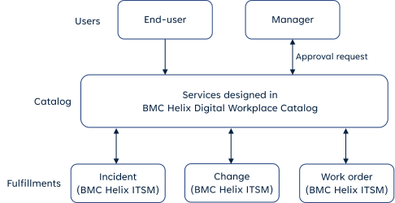

## Catalog designed inDWP Catalogand fulfilled inBusiness Workflows

This capability is available withDWP[license entitlements](https://docs.bmc.com/xwiki/bin/view/Service-Management/Employee-Digital-Workplace/BMC-Helix-Digital-Workplace/dwp254/Planning/License-types-and-features/).

You can design your catalog inDWP Catalogand connect it withBusiness Workflowsfor service fulfillments.

The following image provides a representation of the catalog services and their fulfillments inBusiness Workflows:


## Catalog designed in Service Request Management, imported toDWP Catalog, and fulfilled inITSM

This capability is available withDWP[license entitlements](https://docs.bmc.com/xwiki/bin/view/Service-Management/Employee-Digital-Workplace/BMC-Helix-Digital-Workplace/dwp254/Planning/License-types-and-features/).

If you create Service Request Definitions (SRDs) inService Request Management, you can import them intoDWP Catalog. The imported service continue to have their fulfillments inITSM.

The following image provides a representation of the imported services and their fulfillments inITSM:


---

## <a id="getting-startedkey-conceptscompany-level-access-to-subtenants-in-dwpmd"></a>Getting-Started/Key-Concepts/Company-Level-Access-To-Subtenants-In-Dwp.md

Administrators create subtenants in DWP to grant companies access to data and configurations in the application.

DWP supports the following approaches to granting access to data and configurations specific to individual companies in the application:

* Single tenancy—A single default subtenant is created in DWP. All users belong to the same company and share access to the same data and configurations. Data segregation is not supported.
* Multitenancy—At least one subtenant is created in addition to the default subtenant. Users get access only to the configuration data of the company to which they are assigned inITSMon the People form (on the**Company**field of the**General**tab). Data is segregated between subtenants.

Related topics

[Product-overview](https://docs.bmc.com/xwiki/bin/view/Service-Management/Employee-Digital-Workplace/BMC-Helix-Digital-Workplace/dwp254/Getting-started/Product-overview/)  
[Configuring-multitenancy](https://docs.bmc.com/xwiki/bin/view/Service-Management/Employee-Digital-Workplace/BMC-Helix-Digital-Workplace/dwp254/Administering/Administering-BMC-Helix-Digital-Workplace/Configuring-multitenancy/)

[License-types-and-features](https://docs.bmc.com/xwiki/bin/view/Service-Management/Employee-Digital-Workplace/BMC-Helix-Digital-Workplace/dwp254/Planning/License-types-and-features/)

## Single tenancy in DWP

By default, if only one subtenant is defined,DWPignores information about companies to which users are assigned inITSM. As a result, all users belong to the same company and share access to the same data and configurations inDWP, even if they are assigned to different companies inITSM.

To configure a single tenancy, anAR System administrator[creates a single default subtenant from a record instance](https://docs.bmc.com/xwiki/bin/view/Service-Management/Employee-Digital-Workplace/BMC-Helix-Digital-Workplace/dwp254/Administering/Administering-BMC-Helix-Digital-Workplace/Creating-subtenants-from-a-record-instance/)inIS. In this created record definition for the single default subtenant, the administrator*doesn't*add a company name in the**Name**field to avoid associating the default subtenant with a specific company inITSM.

Example of data access in single tenancy

On the People form inITSM, Britney Unser, an end user, is assigned to the Apex Global company, and Bob Baxter, an end user, is assigned to the Petramco company. When Britney Unser and Bob Baxter log in to DWP, they can access the same data and configurations in the application.

## Multitenancy in DWP

If the administrator creates at least one subtenant in addition to the default subtenant, DWP becomes multitenant, and users get access only to the DWP configuration data of the company to which they are assigned inITSMon the People form (on the**Company**field of the**General**tab).The administrator must define company names for the default subtenant and all subsequent subtenants.

DWP supports multitenancy for on-premises and SaaS subscribers in the following ways:

* IfDWP is deployed on-premises,provides the Managed Service Provider (MSP) Config utility. For more information, see[Configuring-multitenancy](https://docs.bmc.com/xwiki/bin/view/Service-Management/Employee-Digital-Workplace/BMC-Helix-Digital-Workplace/dwp254/Administering/Administering-BMC-Helix-Digital-Workplace/Configuring-multitenancy/).
* If you have a SaaS subscription ofDWP,[create subtenants from a record instance in IS](https://docs.bmc.com/xwiki/bin/view/Service-Management/Employee-Digital-Workplace/BMC-Helix-Digital-Workplace/dwp254/Administering/Administering-BMC-Helix-Digital-Workplace/Creating-subtenants-from-a-record-instance/).

The following diagram illustrates company-level access to subtenants in DWP.


Example of data access in multitenancy

If Britney Unser, an end user, is assigned to the Apex Global company on the People form, she has access to how-to links and locations configured for Apex Global, but not to the how-to links and locations configured for Petramco. This configuration also applies to the DWP Admin console—if Britney Unser has MyIT Admin permissions for DWP, she can configure how-to links and locations only for the Apex Global company.

At the same time, Bob Baxter who is assigned to the Apex Global company and has the permissions of MyIT Super Admin for DWP, can configure how-to links and locations for both companies—Apex Global and Petramco.

### How multitenancy works without a subtenant

By default, if a user is assigned to aITSMcompany for which a subtenant hasn't been created in DWP, this user can't access DWP.

The following diagram shows that users without the subtenant can't access the application:


However, you can change this default behavior and allow such users to access DWP via the default subtenant. To enable access via the default subtenant, contact Support.

The following diagram illustrates how users without the subtenant in DWP can access the application via the default subtenant after Support enables this behavior:


Example of data access for users without a subtenant via the default subtenant

Mary Mann, an end user, is assigned to the Centaricompany on the People form inITSM. In DWP, two subtenants exist—the default subtenant for Apex Global and another subtenant for Petramco. No subtenant exists for Centari. By default, Mary Mann can't access DWP. However, if users without subtenants are allowed to access DWP, Mary Mann can access data created for the Apex Global default subtenant in DWP.

## Multitenancy and access to data

InITSM, multitenancy can be configured for data that comes fromITSM, such as users and service request definitions (SRDs). When users are set up, they are granted access to data for one or more companies.For data that ismaintained inITSM(such as SRDs), the same access is provided in DWP with no additional configuration. This data segregation is present in both single-tenancy and multitenancy modes.For example, if separate SRDs are created for the Apex Global and Petramco companies, and Britney Unser is granted access only to the Apex Global company, she can see and request SRDs only from the Apex Global company.

DWP also provides the following configuration inITSM:

* Quick-pick lists of SRD catalog items that appear on the**Catalog**tab
* Catalog configuration
* How-to links
* Social posts not tied to anyITSMtickets or Service Request Management service requests
* Broadcasts

---

## <a id="getting-startedkey-conceptscredit-management-for-managed-service-providersmd"></a>Getting-Started/Key-Concepts/Credit-Management-For-Managed-Service-Providers.md

Services inDWP Catalogcan be free or chargeable. A service is chargeable if it has a defined price. By default, all chargeable services are priced in USD. The currency is set during the installation ofDWP Catalog.

Required license

[](https://docs.bmc.com/xwiki/bin/view/Service-Management/Employee-Digital-Workplace/BMC-Helix-Digital-Workplace/dwp254/Planning/License-types-and-features/)[DWP](https://docs.bmc.com/xwiki/bin/view/Service-Management/Employee-Digital-Workplace/BMC-Helix-Digital-Workplace/dwp254/Planning/License-types-and-features/)

Related topics

[Enabling-credit-management](https://docs.bmc.com/xwiki/bin/view/Service-Management/Employee-Digital-Workplace/BMC-Helix-Digital-Workplace/dwp254/Administering/Administering-BMC-Helix-Digital-Workplace-Catalog/Setting-up-and-managing-a-credit-based-payment-system/Enabling-credit-management/)

[Managing-customers](https://docs.bmc.com/xwiki/bin/view/Service-Management/Employee-Digital-Workplace/BMC-Helix-Digital-Workplace/dwp254/Administering/Administering-BMC-Helix-Digital-Workplace-Catalog/Managing-customers/)

If the Managed Service Provider (MSP) feature is enabled for theDWP Catalog, catalog administrators can configure the global price setting for all services inDWP Catalog. They can change the default currency-based price to the credit-based price.

Warning

Enable this feature only if you performed a fresh installation ofDWP Catalog. Do not enable this feature if you are upgrading from a previous version.

After this feature is enabled, you cannot use the external users feature or create people groups that your end users can add as collaborators.

## Business case overview

A telecommunication company, which is a managed service provider, has deployed the DWP solution in their data center. The company usesDWP Catalogas a system for creating chargeable services for their customers—companies that provide services to end users.

The telecommunication company needs to be able to define their company customers, push services to them, and invite customer administrators. These administrators manage entitlements for the services that a catalog administrator provided to them. Company customers are charged in credits based on consumption of services. Customer administrators can monitor service consumption and the company’s credit consumption. End users can use DWP as a client management console where they request telecom services.

## Credit-based system overview

You can enable the credit based pricing system only if you have enabled the Managed Service Provider (MSP) mode.

For a multi-customer company, a catalog administrator can use a credit system that replaces the traditional currency-based pricing model.

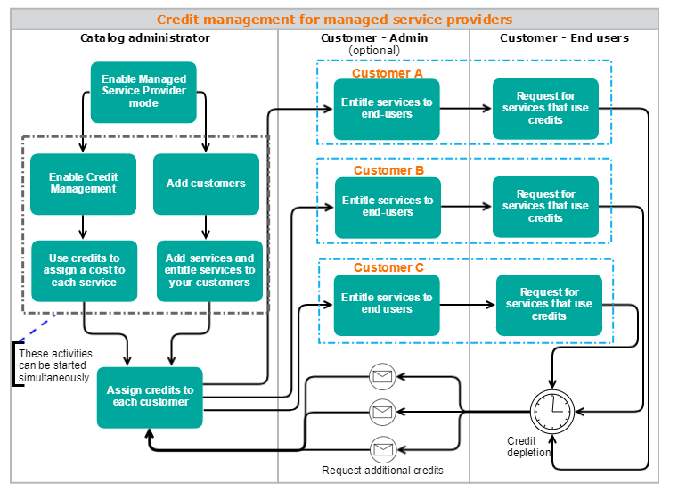

## Credit balance

The catalog administrator defines the credit balance for each customer of the company. For example, the catalog administrator grants 10,000 credits to its customer company. The balance remains positive until the number of credits is more than zero. The credit balance becomes negative when all credits are used and when the credit value is below zero.

## Service requests with credit-based price enabled

When the credit-based system is enabled, all chargeable services are priced in credits instead of USD. The catalog administrator can provide each tenant with only one pricing system, but the credit-based pricing system works only within the MSP customer.

---

## <a id="getting-startedkey-conceptsdwp-architecturemd"></a>Getting-Started/Key-Concepts/Dwp-Architecture.md

DWP provides a comprehensive digital employee to access knowledge articles, services, and policies across lines of business such as IT, HR, Facilities, and more. Itprovides administrators with straightforward, highly configurable ways to present the capabilities that end users need to be successful.

Related topics

[DWP-Catalog-architecture](https://docs.bmc.com/xwiki/bin/view/Service-Management/Employee-Digital-Workplace/BMC-Helix-Digital-Workplace/dwp254/Getting-started/Key-concepts/BMC-Helix-Digital-Workplace-Catalog-architecture/)

[Key-concepts](https://docs.bmc.com/xwiki/bin/view/Service-Management/Employee-Digital-Workplace/BMC-Helix-Digital-Workplace/dwp254/Getting-started/Key-concepts/)

[License-types-and-features](https://docs.bmc.com/xwiki/bin/view/Service-Management/Employee-Digital-Workplace/BMC-Helix-Digital-Workplace/dwp254/Planning/License-types-and-features/)

The following image shows the architecture of DWP:


**Important**

To view the architecture forDWP Catalog, see[DWP-Catalog-architecture](https://docs.bmc.com/xwiki/bin/view/Service-Management/Employee-Digital-Workplace/BMC-Helix-Digital-Workplace/dwp254/Getting-started/Key-concepts/BMC-Helix-Digital-Workplace-Catalog-architecture/).

The following table describes the DWP architecture components:

| Component<br> | Description<br> | Reference<br> |
| --- | --- | --- |
| DWP application onIS<br> | An application deployed onISthat includes the record definitions, rules, and associations between the record definitions.<br>Administrators*cannot*modify this application.<br> | Not applicable<br> |
| Provider framework<br> | A method to integrate with other applications such asCMDBandITSM, and specific third-party applications such as Microsoft Exchange and LDAP.<br> | [Integrating-with-other-applications-by-using-providers](https://docs.bmc.com/xwiki/bin/view/Service-Management/Employee-Digital-Workplace/BMC-Helix-Digital-Workplace/dwp254/Integrating/Integrating-with-other-applications-by-using-providers/)<br> |
| Notification service<br> | A service used to send in-app (bell) notifications, email notifications, and push notifications to end users for various events such as approvals, feedback survey, and so on.<br> | [Configuring-status-updates-and-notifications](https://docs.bmc.com/xwiki/bin/view/Service-Management/Employee-Digital-Workplace/BMC-Helix-Digital-Workplace/dwp254/Administering/Administering-BMC-Helix-Digital-Workplace/Managing-broadcasts-and-notifications-for-end-users/Configuring-status-updates-and-notifications/)<br> |
| Static web content (HTML/JS)<br> | The DWP end-user console and administration console web application.<br> | Not applicable<br> |
| DWP CatalogAPI<br> | An interface to integrate withDWP Catalogby using APIs.<br> | Not applicable<br> |
| Virtual Agent<br> | A conversational interface that communicates with the user in a natural language to search knowledge articles, submit service requests, or check the status of service requests.<br> | [Integrating-a-chat-application-with-DWP](https://docs.bmc.com/xwiki/bin/view/Service-Management/Employee-Digital-Workplace/BMC-Helix-Digital-Workplace/dwp254/Integrating/Integrating-a-BMC-chat-application-with-BMC-Helix-Digital-Workplace/)<br> |
| Responsive user portal<br> | The DWP end-user console that can be accessed on desktop, tablet, and phones.<br> | [Access-from-anywhere-anytime-on-any-device](https://docs.bmc.com/xwiki/bin/view/Service-Management/Employee-Digital-Workplace/BMC-Helix-Digital-Workplace/dwp254/Getting-started/Use-cases/Access-from-anywhere-anytime-on-any-device/)<br> |
| DWP Administration console<br> | A user interface to configure global settings or one-time configurations such as setting up end user features, rebranding the end user console, designing pages for lines of business, and analyzing user activities.<br> | [Administering-DWP](https://docs.bmc.com/xwiki/bin/view/Service-Management/Employee-Digital-Workplace/BMC-Helix-Digital-Workplace/dwp254/Administering/Administering-BMC-Helix-Digital-Workplace/)<br> |
| DWP Catalog<br> | A user interface to configure the service catalog by designing the services and workflows, building reusable questionnaires, managing DWP user roles, creating promotional banners, and defining entitlements.<br> | [Administering-DWP-Catalog](https://docs.bmc.com/xwiki/bin/view/Service-Management/Employee-Digital-Workplace/BMC-Helix-Digital-Workplace/dwp254/Administering/Administering-BMC-Helix-Digital-Workplace-Catalog/)<br> |
| Approval (Change, Incident, Knowledge)<br> | Support for approvals originating fromAction Request System, which end users in DWP can respond to.<br> | [Enabling-approvals](https://docs.bmc.com/xwiki/bin/view/Service-Management/Employee-Digital-Workplace/BMC-Helix-Digital-Workplace/dwp254/Administering/Administering-BMC-Helix-Digital-Workplace/Setting-up-approvals/Enabling-approvals/)<br> |
| Approval (case)<br> | Support for case approvals originating fromBusiness Workflows, which end users in DWP can respond to.<br> | [Enabling-approvals](https://docs.bmc.com/xwiki/bin/view/Service-Management/Employee-Digital-Workplace/BMC-Helix-Digital-Workplace/dwp254/Administering/Administering-BMC-Helix-Digital-Workplace/Setting-up-approvals/Enabling-approvals/)<br> |
| CMDB<br> | Support for assets inCMDB, which administrators can import in DWP so that end users can find nearby resources, follow resource status updates, and update the resource status.<br> | [Managing-assets-on-floor-maps](https://docs.bmc.com/xwiki/bin/view/Service-Management/Employee-Digital-Workplace/BMC-Helix-Digital-Workplace/dwp254/Enabling-self-service-in-an-organization/Locations/Managing-assets-on-floor-maps/)<br> |
| ITSM<br> | An integration withITSMthat automatically creates service requests in DWP that correspond to change requests, incident requests, and work order requests.<br> | [Creating-service-requests-from-ITSM](https://docs.bmc.com/xwiki/bin/view/Service-Management/Employee-Digital-Workplace/BMC-Helix-Digital-Workplace/dwp254/Creating-and-managing-the-service-catalog/Creating-service-requests-from-BMC-Helix-ITSM/)<br> |
| ITSM: Knowledge Management<br> | An integration withITSM: Knowledge Managementso that end users can find IT-related knowledge articles for self-service.<br> | [Setting-up-self-help-resources](https://docs.bmc.com/xwiki/bin/view/Service-Management/Employee-Digital-Workplace/BMC-Helix-Digital-Workplace/dwp254/Enabling-self-service-in-an-organization/Setting-up-self-help-resources/)<br> |
| Business Workflows<br> | An integration withBusiness Workflowsso that end users can leverage custom services for lines of business fromBusiness Workflows, and can view and complete To-Dos assigned by agents,<br> | [Product-overview](https://docs.bmc.com/xwiki/bin/view/Service-Management/Employee-Digital-Workplace/BMC-Helix-Digital-Workplace/dwp254/Getting-started/Product-overview/)<br> |
| HKM<br> | An integration withBusiness Workflowsso that end users can find knowledge articles or submit services from the knowledge articles.<br> | [Configuring-HKM-as-the-knowledge-provider-for-DWP](https://docs.bmc.com/xwiki/bin/view/Service-Management/Employee-Digital-Workplace/BMC-Helix-Digital-Workplace/dwp254/Configuring-BMC-Helix-Knowledge-Management-by-ComAround-as-the-knowledge-provider-for-BMC-Helix-Digital-Workplace/)<br> |

---

## <a id="getting-startedkey-conceptsdwp-catalog-architecturemd"></a>Getting-Started/Key-Concepts/Dwp-Catalog-Architecture.md

DWP provides a comprehensive digital employee experience to request services and policies across lines of business such as IT, HR, Facilities, and more. Itprovides administrators with straightforward, highly configurable ways to present the capabilities that end users need to be successful.

Related topics

[DWP-architecture](https://docs.bmc.com/xwiki/bin/view/Service-Management/Employee-Digital-Workplace/BMC-Helix-Digital-Workplace/dwp254/Getting-started/Key-concepts/BMC-Helix-Digital-Workplace-architecture/)

[Key-concepts](https://docs.bmc.com/xwiki/bin/view/Service-Management/Employee-Digital-Workplace/BMC-Helix-Digital-Workplace/dwp254/Getting-started/Key-concepts/)

[License-types-and-features](https://docs.bmc.com/xwiki/bin/view/Service-Management/Employee-Digital-Workplace/BMC-Helix-Digital-Workplace/dwp254/Planning/License-types-and-features/)

The following image shows the architecture ofDWP Catalog:


**Important**

To view the architecture for DWP , see[DWP-architecture](https://docs.bmc.com/xwiki/bin/view/Service-Management/Employee-Digital-Workplace/BMC-Helix-Digital-Workplace/dwp254/Getting-started/Key-concepts/BMC-Helix-Digital-Workplace-architecture/).

The following table describes the DWP architecture components:

| Component<br> | Description<br> | Reference<br> |
| --- | --- | --- |
| DWP Catalogconsole<br> | A user interface to configure the service catalog by designing the services and workflows, building reusable questionnaires, managing DWPuser roles, creating promotional banners, and defining entitlements.<br> | [Administering-DWP-Catalog](https://docs.bmc.com/xwiki/bin/view/Service-Management/Employee-Digital-Workplace/BMC-Helix-Digital-Workplace/dwp254/Administering/Administering-BMC-Helix-Digital-Workplace-Catalog/)<br> |
| DWP Catalogapplication onIS<br> | An application deployed onISthat includes the record definitions, rules, and associations between the record definitions.<br>Administrators*cannot*modify this application.<br> | Not applicable<br> |
| IS<br> | A no-code platform that helps you to create and automate business processes forDWP Catalog.<br> | Not applicable<br> |
| DWP Catalogconnectors<br> | A method to integrate with other applications such asCMDBandITSM, and specific third-party applications such as Microsoft Office 365 and Active Directory.<br> | [Service-connector-capabilities](https://docs.bmc.com/xwiki/bin/view/Service-Management/Employee-Digital-Workplace/BMC-Helix-Digital-Workplace/dwp254/Creating-and-managing-the-service-catalog/Connecting-your-catalog-to-external-systems/Service-connector-capabilities/)<br> |
| Approval inAction Request System<br> | Approvals for specific request types, which end users in DWPcan respond to.<br> | [Enabling-approvals](https://docs.bmc.com/xwiki/bin/view/Service-Management/Employee-Digital-Workplace/BMC-Helix-Digital-Workplace/dwp254/Administering/Administering-BMC-Helix-Digital-Workplace/Setting-up-approvals/Enabling-approvals/)<br> |
| CMDBinAction Request System<br> | A capability tosaveDWP Catalogrequests or services as an asset inCMDB.<br> | [Managing-assets-on-floor-maps](https://docs.bmc.com/xwiki/bin/view/Service-Management/Employee-Digital-Workplace/BMC-Helix-Digital-Workplace/dwp254/Enabling-self-service-in-an-organization/Locations/Managing-assets-on-floor-maps/)<br> |
| Remote connector framework and third-party service providers<br> | A framework to connect to a remote server that hosts connectors thatDWP Catalogcan use for transferring data to and from third-party service providers via REST calls.<br> | [Integrating-DWP-with-remote-servers](https://docs.bmc.com/xwiki/bin/view/Service-Management/Employee-Digital-Workplace/BMC-Helix-Digital-Workplace/dwp254/Developing/Integrating-BMC-Helix-Digital-Workplace-with-remote-servers/)<br> |

---

## <a id="getting-startedkey-conceptsdwp-catalogmd"></a>Getting-Started/Key-Concepts/Dwp-Catalog.md

DWP Catalogis a component of theDWP solution that serves as a centralized repository of products and services from multiple business units including IT, HR, and Facilities. Catalog administrators configure the service catalog by designing services and workflows, building reusable questionnaires, creating promotional banners, and defining entitlements.

Required license

[](https://docs.bmc.com/xwiki/bin/view/Service-Management/Employee-Digital-Workplace/BMC-Helix-Digital-Workplace/dwp254/Planning/License-types-and-features/)[DWP](https://docs.bmc.com/xwiki/bin/view/Service-Management/Employee-Digital-Workplace/BMC-Helix-Digital-Workplace/dwp254/Planning/License-types-and-features/)

The following video (3:15) provides an overview of the key capabilities ofDWP Catalogand the product components:

[🎥 Watch Video: https://www.youtube.com/watch?v=wuycpFLSDBo](https://www.youtube.com/watch?v=wuycpFLSDBo)

[Watch the YouTube video about DWP Catalog product overview](https://youtu.be/wuycpFLSDBo?list=PLibAMtD70sYFm8oRg3MHv-rJufA99QKE3)

## Service Catalog Curator

As a catalog administrator, use the Service Catalog Curator, an AI agent powered by HelixGPT, to to create a catalog service. Enter prompts and other inputs for the service you want to create, review the summary, make real-time edits, and efficiently create a service. This AI assistant offers a solid foundation for developing your service and saves your time and effort.  


For more information, see[Leveraging Service Catalog Curator for creating services](https://docs.bmc.com/xwiki/bin/view/Service-Management/Employee-Digital-Workplace/BMC-Helix-Digital-Workplace/dwp254/Creating-and-managing-the-service-catalog/Leveraging-Service-Catalog-Curator-for-creating-services/).

## Service fulfillments

DWP Catalogintegrates with external fulfillment systems through service connectors to enable communication between the catalog application platform and the different fulfillment systems. To learn more, see[Connecting-your-catalog-to-external-systems](https://docs.bmc.com/xwiki/bin/view/Service-Management/Employee-Digital-Workplace/BMC-Helix-Digital-Workplace/dwp254/Creating-and-managing-the-service-catalog/Connecting-your-catalog-to-external-systems/).

## Enriched catalog profiles

Enhance the service catalog experience by creating profiles for service items that include:

* Multimedia carousel of videos and images to illustrate the selected service.
* Rich text descriptions with business and technical details to help users make decisions when requesting services.
* Downloadable files and links to internet and other web resources.
* Service ratings and timeline to help users evaluate solutions.

The enriched catalog profiles are displayed in the DWP end-user console, as shown in the following image:

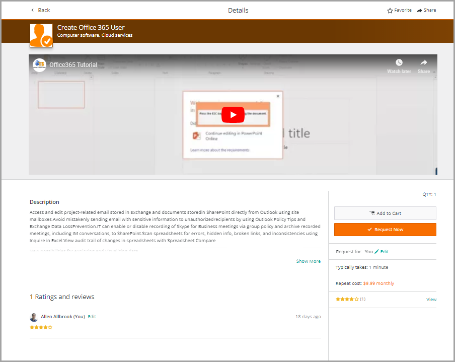

## Rich text formatting

Users can benefit from the text editing interface when they submit comments to service requests.

**Important**

* For services created directly inDWP Catalog, end users can add rich text formatting in comments and answers to a questionnaire.
* Rich text format is supported in approvals of onlyDWP Catalogrequests andBusiness Workflowscases.

The following text customization options are available:

* Bold, Italic, and Underline fonts
* Color selection
* Text alignment
* Hyperlinks
* Numbered and bulleted lists
* Formatting options for copy-and-pasted text
* Attachment icon and drag-and-drop capability for file upload
* Drag-and-resize capability to resize images within the text fields
* URI schemes  
  To learn more about the supported URI schemes, see[Updating-the-attachment-settings-and-URI-schemes](https://docs.bmc.com/xwiki/bin/view/Service-Management/Employee-Digital-Workplace/BMC-Helix-Digital-Workplace/dwp254/Administering/Administering-BMC-Helix-Digital-Workplace/Updating-the-attachment-settings-and-URI-schemes/).

Comments with rich text formatting added in DWP are supported and retained byBusiness Workflows. These comments can be seen in request details inDWP Catalogand are preserved in email notifications.

However, inITSM, comments are shown as plain text, and inserted images are shown as attachments.

As a catalog administrator, you can also enable end users to leverage rich text formatting in questionnaires. To learn more, see[Adding-questions-to-a-questionnaire](https://docs.bmc.com/xwiki/bin/view/Service-Management/Employee-Digital-Workplace/BMC-Helix-Digital-Workplace/dwp254/Creating-and-managing-the-service-catalog/Building-service-catalogs/Creating-service-questionnaires/Adding-questions-to-a-questionnaire/).

## Catalog banners

Notify users of important information and draw attention to featured services in your catalog by using promotional banners of different sizes.You create these banners inDWP Catalogandadd them to the catalog display in the DWP Admin console The banner is then visible to the end users in the end-user console.

The following image is an example of a full-width hero banner displayed in the end user console:


The following image is an example of feature banners displayed in the end user console:


## Catalog service bundles

Help users select options for requested items. Service bundles can contain optional items that the user can switch on or off before submitting the request. The catalog manager can can control which optional items are included when packaging a bundle.

The following image is an example of a bundle with optional items:

## Catalog filters

Provide filters to make it easier for users to browse the catalog.

The following image is an example of a category selection filter for Cloud Services:


## Catalog search

Make it easier for users to find items in the catalog. Users can search the catalog for words found in the following catalog profile sections:

* Service name or title
* Service version
* Service description
* Service tags

**Best practice**  
We recommend that you develop a consistent tagging scheme for your organization.

## Satisfaction surveys

Enable organizations to collect user feedback by configuring post-request surveys for completed catalog service requests. Surveys can be customized with rating scales like CSAT or NPS, adaptable templates, and adjustable delivery frequency options. With this capability, catalog administrators can monitor service performance, measure customer satisfaction, analyze user sentiment, and encourage continuous improvements.

For more information, see[Setting up satisfaction surveys for catalog services](https://docs.bmc.com/xwiki/bin/view/Service-Management/Employee-Digital-Workplace/BMC-Helix-Digital-Workplace/dwp254/Creating-and-managing-the-service-catalog/Setting-up-surveys/Setting-up-satisfaction-surveys-for-catalog-services/).

## Testing your knowledge

Check your knowledge. See if you can answer each question. Click the questions to view the answer.

<details class="confluence-expand-macro panel panel-default"><summary><span class="panel-title"><span class="title-text">What is the primary function of DWP Catalog?</span></span></summary><div class="panel-body"><p>It serves as a centralized platform where catalog administrators design and manage services, workflows, and entitlements for multiple business units, such as IT, HR, Facilities, etc.</p></div></details><details class="confluence-expand-macro panel panel-default"><summary><span class="panel-title"><span class="title-text">How does the Service Catalog Curator, powered by HelixGPT, assist catalog administrators?</span></span></summary><div class="panel-body"><p>The HelixGPT-powered Service Catalog Curator helps catalog administrators efficiently create catalog services by allowing them to enter prompts, review summaries, make real-time edits, and establish a solid foundation for service development.</p></div></details><details class="confluence-expand-macro panel panel-default"><summary><span class="panel-title"><span class="title-text">In what scenario can end users apply rich text formatting in their comments, and what is a known browser-specific consideration?</span></span></summary><div class="panel-body"><p>End users can apply rich text formatting when commenting on services created in DWP Catalog. In Mozilla Firefox, users must check the upload check box after selecting an image file to ensure the image uploads correctly.</p></div></details><details class="confluence-expand-macro panel panel-default"><summary><span class="panel-title"><span class="title-text">How does DWP Catalog enable integration with external fulfillment systems?</span></span></summary><div class="panel-body"><p>It uses a service connector to facilitate communication between the catalog application and external systems.</p></div></details><details class="confluence-expand-macro panel panel-default"><summary><span class="panel-title"><span class="title-text">When building a catalog service bundle, how can a catalog manager give users flexibility in their request submission?</span></span></summary><div class="panel-body"><p>The catalog manager can include optional items in the service bundle that users can toggle on or off before submitting the request, ensuring personalization while maintaining control over included services.</p></div></details>

## Learn more

To learn more aboutDWP Catalog, refer to the following links:

| Action<br> | Reference<br> |
| --- | --- |
| Learn about the best practices to design a catalog.<br> | [Designing-service-catalog-best-practices](https://docs.bmc.com/xwiki/bin/view/Service-Management/Employee-Digital-Workplace/BMC-Helix-Digital-Workplace/dwp254/Getting-started/Best-practices-for-BMC-Helix-Digital-Workplace/Designing-service-catalog-best-practices/)<br> |
| Learn about the Catalog architecture.<br> | [DWP-Catalog-architecture](https://docs.bmc.com/xwiki/bin/view/Service-Management/Employee-Digital-Workplace/BMC-Helix-Digital-Workplace/dwp254/Getting-started/Key-concepts/BMC-Helix-Digital-Workplace-Catalog-architecture/)<br> |
| Learn about the roles and permissions required to set up a catalog.<br> | [Catalog-roles-and-permissions](https://docs.bmc.com/xwiki/bin/view/Service-Management/Employee-Digital-Workplace/BMC-Helix-Digital-Workplace/dwp254/Administering/Administering-BMC-Helix-Digital-Workplace-Catalog/Setting-up-user-accounts-and-granting-access-to-BMC-Helix-Digital-Workplace-Catalog/Catalog-roles-and-permissions/)<br> |
| Learn about subcatalogs, catalog services, and fulfillments.<br> | * [Subcatalogs](https://docs.bmc.com/xwiki/bin/view/Service-Management/Employee-Digital-Workplace/BMC-Helix-Digital-Workplace/dwp254/Getting-started/Key-concepts/Subcatalogs/) * [Catalog-services-and-fulfillments](https://docs.bmc.com/xwiki/bin/view/Service-Management/Employee-Digital-Workplace/BMC-Helix-Digital-Workplace/dwp254/Getting-started/Key-concepts/Catalog-services-and-fulfillments/) |

---

## <a id="getting-startedkey-conceptssearch-in-dwpmd"></a>Getting-Started/Key-Concepts/Search-In-Dwp.md

Search with keywords helps your end users find what they need easily and quickly. Search in DWP can be configured to provide results relevant to the user's intent.Focused results improve work efficiency because users don't waste time viewing irrelevant results.

When a user starts typing in the[global search field](https://docs.bmc.com/xwiki/bin/view/Service-Management/Employee-Digital-Workplace/BMC-Helix-Digital-Workplace/dwp254/Using-BMC-Helix-Digital-Workplace-to-request-services/Searching-for-records/#Searchingforrecords-usingsearch), the matching text is highlighted in the suggestions. The suggestions that appear are based on previous searches by other users within your tenancy. These are generated from backend-stored search history and are updated by a scheduled backend process.

After performing a search with the appropriate keywords, the results that are the closest match to the search text are displayed, irrespective of their source or type.

End users get a list of the relevant search results from the keyword search. They can also find answers to their queries by using HelixGPT. For more information, see[Generating-AI-retrieved-answers-for-end-users-through-HelixGPT](https://docs.bmc.com/xwiki/bin/view/Service-Management/Employee-Digital-Workplace/BMC-Helix-Digital-Workplace/dwp254/Getting-started/Use-cases/Generating-AI-retrieved-answers-for-end-users-through-BMC-HelixGPT/).

As the administrator, you must understand how search works to assist your business users.

Related topics

[Configuring-search](https://docs.bmc.com/xwiki/bin/view/Service-Management/Employee-Digital-Workplace/BMC-Helix-Digital-Workplace/dwp254/Administering/Administering-BMC-Helix-Digital-Workplace/Configuring-search/)

[Troubleshooting-issues-with-search-in-DWP](https://docs.bmc.com/xwiki/bin/view/Service-Management/Employee-Digital-Workplace/BMC-Helix-Digital-Workplace/dwp254/Troubleshooting/Troubleshooting-issues-with-search-in-BMC-Helix-Digital-Workplace/)[Configuring full text search](https://docs.bmc.com/xwiki/bin/view/Service-Management/Innovation-Suite/BMC-Helix-Innovation-Suite/is251/Enabling-services/Enabling-Full-Text-Search/Enabling-Full-Text-search-in-Action-Request-System-server/Configuring-full-text-search/)

[Searching-for-records](https://docs.bmc.com/xwiki/bin/view/Service-Management/Employee-Digital-Workplace/BMC-Helix-Digital-Workplace/dwp254/Using-BMC-Helix-Digital-Workplace-to-request-services/Searching-for-records/)

## How search works

The search bar on the My Activity, Catalog, and studio pages means end users can search multiple sources from a single place and easily find what they need. Sources of search may be catalog items, knowledge articles, locations, and so on. The application performs a federated search, which means that the search phrase is sent to more than ten different search engines, each configured to provide the best possible results from individual search sources. Administrators configure search options for each source. An advanced ranking technology displays the most relevant search results at the top of the list.

The following image shows the different search sources:


As an administrator, you can improve search results by setting the parameters that control different searches. For more information about how to configure search, see[Configuring-search](https://docs.bmc.com/xwiki/bin/view/Service-Management/Employee-Digital-Workplace/BMC-Helix-Digital-Workplace/dwp254/Administering/Administering-BMC-Helix-Digital-Workplace/Configuring-search/).

## How search with wildcards works

Wildcard search helps end users find what they’re looking for, even if they don't know the exact term. Wildcards allow users to search for partial terms, alternate spellings, and variations of a term without specifying an exact term match or without having to append the % symbol to a part of a search term. Wildcards broaden the search results and provide a higher chance of finding the required information.

**Important**

For end users to leverage the benefits of using wildcards, administrators must enable this feature. If not enabled, end users need to manually append the % symbol at the beginning or the end of an incomplete search term to get the results.

Administrators can enable the use of wildcards when searching forDWP Catalogitems. For more information, see[Configuring-search](https://docs.bmc.com/xwiki/bin/view/Service-Management/Employee-Digital-Workplace/BMC-Helix-Digital-Workplace/dwp254/Administering/Administering-BMC-Helix-Digital-Workplace/Configuring-search/).Also, they can enable the wildcard-related settings for the integrated providers, such as the RKM pluggable provider and Helix ITSM Provider. For example, if administrators enable the**rkm.search.force.wildcards**setting in the RKM pluggable provider, users can search by entering only parts of the title. Learn more about enabling search-related settings for the pluggable providers in[Integrating-with-other-applications-by-using-providers](https://docs.bmc.com/xwiki/bin/view/Service-Management/Employee-Digital-Workplace/BMC-Helix-Digital-Workplace/dwp254/Integrating/Integrating-with-other-applications-by-using-providers/). These settings are disabled by default because they interfere with the full-text search, language-specific tokenization, stemming, and relevance logic. For certain sources, wildcards are always supported, and the administrator doesn't have an option to disable them; for example, appointments.

### Types of wildcards in DWP

DWP supports two types of wildcards:

* Leading wildcard—End users can omit the beginning of a search term and don't need to append the % symbol before the search query. The leading wildcard automatically matches any characters that precede the specified search query. For example, if the end user enters*flow*, the search might return*workflow*in the results.
* Trailing wildcard—End users can omit the end of a search term and don't need to append the % symbol after the search query. The trailing wildcard automatically matches any characters that follow the specified search query. For example, if the end user enters*work*, the search might return*workflow*and*workaround*terms in the results.

The actual search results with wildcardsmay vary from the results that users expect to receive. The search results are determined by the following factors:

* Sources that end users search for by using wildcards.  
  Not all sources support the wildcard search. For example, end users can't search for DWP locations and assets by using wildcards. This use case is different from enabling wildcards. For certain sources, the wildcard search is not supported, and the administrator has no options to enable it.
* Fields by which the search is executed.  
  When end users perform a wildcard search, the system searches in records that are associated with a searched-for source and retrieves information from the designated fields within these records. While searching in the fields, the system analyzes whether these fields are indexed for Full Text Search (FTS) or not. For example, when the end user searches for a catalog service in the Global search field by using the wildcard, the search is performed by the**Title**,**Description**, and**Tag**fields, and the search checks whether these fields are indexed for FTS.

**Important**

Leading wildcards are*not*supported if the search is performed on fields that are indexed for FTS. Only trailing wildcards are supported for these fields.

For example, the search for a catalog service is performed by the**Title**,**Description**, and**Tag**fields. All these fields are indexed for FTS by default. So, leading wildcards are not recognized in search for catalog services. If the end user searches for a service with the title*Hardware*and enters*ware*, the search won't return*hardware*in the results. However, if the end user enters*hard*, the search will return the*Hardware*service in the results because the trailing wildcard is used automatically.

### List of sources that support the wildcard search

The following table lists the sources that support the wildcard search and indicates whether each source supports both leading and trailing wildcards or only trailing wildcards:

| Source<br> | Wildcards must be enabled to work<br> | Supported type of wildcard<br> | Location where the wildcard search is supported in the end-user console<br> | Fields on which the search is performed<br> | Are the searched-for fields indexed for FTS?<br> |
| --- | --- | --- | --- | --- | --- |
| DWP Catalog items<br> | Yes<br><details class="confluence-expand-macro panel panel-default"><summary><span class="panel-title"><span class="title-text">How to enable wildcards</span></span></summary><div class="panel-body"><p><span>The administrator must enable the<strong>Allow wildcards</strong>setting.</span><span>For more information, see</span><span><span class="wikilink"><a href="https://docs.bmc.com/xwiki/bin/view/Service-Management/Employee-Digital-Workplace/BMC-Helix-Digital-Workplace/dwp254/Administering/Administering-BMC-Helix-Digital-Workplace/Configuring-search/"><span class="wikigeneratedlinkcontent">Configuring-search</span></a></span></span><span>.</span></p></div></details> | Trailing only<br> | In the Global search field<br> | * **Title** * **Description** * **Tag** | Yes<br>Leading wildcards are*not*supported starting with 23.3.01. <br> |
| DWP Catalog requests<br> | Yes<br><details class="confluence-expand-macro panel panel-default"><summary><span class="panel-title"><span class="title-text">How to enable wildcards</span></span></summary><div class="panel-body"><p><span>The administrator must enable the<strong>Allow wildcards</strong>setting.</span><span>For more information, see</span><span><span class="wikilink"><a href="https://docs.bmc.com/xwiki/bin/view/Service-Management/Employee-Digital-Workplace/BMC-Helix-Digital-Workplace/dwp254/Administering/Administering-BMC-Helix-Digital-Workplace/Configuring-search/"><span class="wikigeneratedlinkcontent">Configuring-search</span></a></span></span><span>.</span></p></div></details> | Trailing only<br> | * In the Global search field * From the Events filter in the**Active**or**Past events**sections on the My Activity page or a studio page that has an events component added to it | * **Title** * **Request ID** * **Order ID** * **Order Description** |
| Appointments<br> | No<br> | Trailing only<br> | * In the Global search field * From the Events filter in the**Active**or**Past events**sections on the My Activity page or a studio page that has an events component added to it | * **Notes** * **Incident Number** |
| Knowledge articles from ITSM: Knowledge Management<br> | Yes<br><details class="confluence-expand-macro panel panel-default"><summary><span class="panel-title"><span class="title-text">How to enable wildcards</span></span></summary><div class="panel-body"><p><span>The administrator must enable the<strong>rkm.search.force.wildcards</strong>setting in the RKM pluggable provider. For more information, see</span><span><span class="wikilink"><a href="https://docs.bmc.com/xwiki/bin/view/Service-Management/Employee-Digital-Workplace/BMC-Helix-Digital-Workplace/dwp254/Integrating/Integrating-with-other-applications-by-using-providers/"><span class="wikigeneratedlinkcontent">Integrating-with-other-applications-by-using-providers</span></a></span></span><span>.</span></p></div></details> | Trailing only<br> | In the Global search field<br> | * **Title** * **Digest**(contains ID, Keywords, Content) |
| Service Request Management SRDs<br> | Yes<br><details class="confluence-expand-macro panel panel-default"><summary><span class="panel-title"><span class="title-text">How to enable wildcards</span></span></summary><div class="panel-body"><p><span>The administrator must enable the</span><strong><span>srd.search.force.wildcards</span></strong><span>setting in the Helix ITSM pluggable provider.</span><span>For more information, see</span><span><span class="wikilink"><a href="https://docs.bmc.com/xwiki/bin/view/Service-Management/Employee-Digital-Workplace/BMC-Helix-Digital-Workplace/dwp254/Integrating/Integrating-with-other-applications-by-using-providers/"><span class="wikigeneratedlinkcontent">Integrating-with-other-applications-by-using-providers</span></a></span></span><span>.</span></p></div></details> | Trailing only<br> | In the Global search field<br> | * **Title** * **Description** * **Keywords** |
| On Behalf Of users<br> | Yes<br><details class="confluence-expand-macro panel panel-default"><summary><span class="panel-title"><span class="title-text">How to enable wildcards</span></span></summary><div class="panel-body"><p><span>The administrator must enable the</span><strong><span>obo.search.prefixWildcard</span></strong><span>setting in the Helix ITSM pluggable provider.</span><span>For more information, see</span><span><span class="wikilink"><a href="https://docs.bmc.com/xwiki/bin/view/Service-Management/Employee-Digital-Workplace/BMC-Helix-Digital-Workplace/dwp254/Integrating/Integrating-with-other-applications-by-using-providers/"><span class="wikigeneratedlinkcontent">Integrating-with-other-applications-by-using-providers</span></a></span></span><span>.</span></p></div></details> | Leading and trailing<br> | * In the Request as someone else dialog box in the user profile * In the**Request for**field in a service request | All fields in the following ITSM forms:<br>  * <details class="confluence-expand-macro panel panel-default"><summary><span class="panel-title"><span class="title-text">CTM:People</span></span></summary><div class="panel-body"><ul><li><span>4 (<strong>Remedy Login ID</strong>)</span></li><li><span>1000000019 (<strong>First Name</strong>)</span></li><li><span>1000000018 (<strong>Last Name</strong>)</span></li><li><span>1000000017 (<strong>Full Name</strong>)</span></li><li><span>1000000048 (<strong>Internet E-mail</strong>)</span></li><li><span>1000000036 (<strong>Mail Station</strong>)</span></li></ul></div></details> * <details class="confluence-expand-macro panel panel-default"><summary><span class="panel-title"><span class="title-text">OBO:Ppl Search-SupportGrpAssoc_Outer_Join</span></span></summary><div class="panel-body"><ul><li><span>4 (<strong>Remedy Login ID</strong>)</span></li><li><span>1000000019 (<strong>First Name</strong>)</span></li><li><span>1000000018 (<strong>Last Name</strong>)</span></li><li><span>1000000048 (<strong>Internet E-mail</strong>)</span></li><li><span>1000000036 (<strong>Mail Station</strong>)</span></li></ul></div></details> | No.<br>If an organization has a custom setup where certain fields are manually indexed for FTS in the ITSM forms, leading wildcards are not supported when the search is performed by these fields.<br>**Best practice:**Indexing fields for FTS manually might cause unexpected search results and, therefore, is not recommended.<br> |
| Users<br> | No<br> | Leading and trailing<br> | * In the Global search field * In the Collaborators dialog box in a service request * In the**Collaborators**section of the user preferences page * In the Add approver dialog box in Approval settings * In theReassign approvaldialog box in a service request * In the**Social**section of the user preferences page * In the posts when tagging users | All fields in the following ITSM form:<br>  * <details class="confluence-expand-macro panel panel-default"><summary><span class="panel-title"><span class="title-text">CTM:People</span></span></summary><div class="panel-body"><ul><li><span>4 (<strong>Remedy Login ID</strong>)</span></li><li><span>1000000019 (<strong>First Name</strong>)</span></li><li><span>1000000018 (<strong>Last Name</strong>)</span></li><li><span>1000000017 (<strong>Full Name</strong>)</span></li><li><span>1000000048 (<strong>Internet E-mail</strong>)</span></li><li><span>1000000036 (<strong>Mail Station</strong>)</span></li></ul></div></details> |
| Quick links<br> | No<br> | Leading and trailing<br> | In the Global search field<br> | All fields in the following ITSM form:<br>  * <details class="confluence-expand-macro panel panel-default"><summary><span class="panel-title"><span class="title-text">SRS:QuickLinks</span></span></summary><div class="panel-body"><ul><li><span>304260010 (<strong>Display Name</strong>)</span></li><li><span>304304900 (<strong>Description</strong>)</span></li></ul></div></details> |
| SRD requests<br> | No<br> | Leading and trailing<br> | * In the Global search field * From the Events filter in the**Active**or**Past events**sections on the My Activity page or a studio page that has an events component added to it | All fields in the following ITSM form:<br>  * <details class="confluence-expand-macro panel panel-default"><summary><span class="panel-title"><span class="title-text">MYIT:Service_Request</span></span></summary><div class="panel-body"><ul><li><span>301244700 (<strong>summary</strong>)</span></li><li><span>1000000829 (<strong>requested</strong>)</span></li><li><span>1000000025 (<strong>requestedByFullName</strong>)</span></li><li><span>420003100 (<strong>subtitle</strong>)</span></li><li><span>1000000017 (<strong>requestFullName</strong>)</span></li><li><span>303490600 (<strong>orderId</strong>)</span></li><li><span>303490700 (<strong>orderDesc</strong>)</span></li></ul></div></details> |
| SRD requests by submitted responses<br> | No<br> | Leading and trailing<br> | * In the Global search field * From the Events filter in the**Active**or**Past events**sections on the My Activity page or a studio page that has an events component added to it | All fields in the following ITSM form:<br>  * <details class="confluence-expand-macro panel panel-default"><summary><span class="panel-title"><span class="title-text">SRD:MultipleQuestionResponse</span></span></summary><div class="panel-body"><ul><li><span>303630000 (<strong>Answer In Char</strong>)</span></li><li><span>303935200 (<strong>Answer Internal</strong>)</span></li><li><span>303669500 (<strong>Menu Label</strong>)</span></li></ul></div></details> |
| Approval search<br> | No<br> | Leading and trailing<br> | * In the Global search field * From the Events filter in the**Active**or**Past events**sections on the My Activity page or a studio page that has an events component added to it | All fields in the following ITSM forms:<br>  * <details class="confluence-expand-macro panel panel-default"><summary><span class="panel-title"><span class="title-text">AP:Detail-Signature</span></span></summary><div class="panel-body"><ul><li><span>14516</span></li><li><span>14506</span></li></ul></div></details> * <details class="confluence-expand-macro panel panel-default"><summary><span class="panel-title"><span class="title-text">SRM:Request</span></span></summary><div class="panel-body"><ul><li><span>1000003297 (<strong>Customer First Name</strong>)</span></li><li><span>1000003298 (<strong>Customer Last Name</strong>)</span></li><li><span>1000000025 (<strong>Customer Full Name</strong>)</span></li><li><span>1000000019 (<strong>First Name</strong>)</span></li><li><span>1000000018 (<strong>Last Name</strong>)</span></li><li><span>1000000017 (<strong>Full Name</strong>)</span></li><li><span>303490600 (<strong>CartID</strong>)</span></li><li><span>303490700 (<strong>CartName</strong>)</span></li></ul></div></details> * <details class="confluence-expand-macro panel panel-default"><summary><span class="panel-title"><span class="title-text">SB:ServiceRequestStub</span></span></summary><div class="panel-body"><ul><li><span>536870926 (<strong>Request For User Id</strong>)</span></li><li><span>536870950 (<strong>Request For User First Name</strong>)</span></li><li><span>536870953 (<strong>Request For User Last Name</strong>)</span></li><li><span>536870925 (<strong>Requesting User Id</strong>)</span></li><li><span>536870946 (<strong>Requesting User First Name</strong>)</span></li><li><span>536870947 (<strong>Requesting User Last Name</strong>)</span></li><li><span>536870951 (<strong>Order ID</strong>)</span></li><li><span>304412841 (<strong>Order Description</strong>)</span></li></ul></div></details> * <details class="confluence-expand-macro panel panel-default"><summary><span class="panel-title"><span class="title-text">CHG:Infrastructure Change</span></span></summary><div class="panel-body"><ul><li><span>1000003297 (<strong>Customer First Name</strong>)</span></li><li><span>1000003298 (<strong>Customer Last Name</strong>)</span></li><li><span>1000000019 (<strong>First Name</strong>)</span></li><li><span>1000000018 (<strong>Last Name</strong>)</span></li><li><span>1000000000 (<strong>Description</strong>)</span></li><li><span>1000000182 (<strong>Infrastructure Change ID</strong>)</span></li></ul></div></details> |
| User groups<br> | No<br> | Leading and trailing<br> | The wildcard search for user groups is supported in the Admin console:<br>  * In the Admin console, in the**Send to**picker window for user groups on the New Broadcasts page. * In the Admin console, on the**Group**tab on the Service Availability page | All fields in the following ITSM form:<br>  * <details class="confluence-expand-macro panel panel-default"><summary><span class="panel-title"><span class="title-text">Group</span></span></summary><div class="panel-body"><ul><li><span>8 (<strong>Long Group Name</strong>)</span></li><li><span>105 (<strong>Group Name</strong>)</span></li></ul></div></details> |
| DWP Catalog requests by submitted responses<br> | No<br> | Leading and trailing<br> | * In the Global search field * From the Events filter in the**Active**or**Past events**sections on the My Activity page or a studio page that has an events component added to it | <br> | No<br>**Important:**The searched-for fields cannot be manually indexed for FTS.<br> |
| Service Health items<br> | No<br> | Leading and trailing<br> | * In the search field on the My Stuff page on the**Service Health**tab | <br>{{/confluence\_table-filter}} |

The indicated list of sources might not be exhaustive, and additional sources might be supported.

## How search results are ranked by relevance

Search results for different sources are returned by using an improved ranking technology. The setting displays the most relevant results at the top of all results. The content of the primary search results from the different sources is re-ranked by using the Okapi BM25 ranking function. During this second round of ranking, the search result data is parsed into a single document corpus. The parsing process uses a text processing pipeline that includes:

* Upper- to lowercase transformation.
* Punctuation removal.
* Tokenization (breaking sentences into words).
* *(English only)*Lemmatization (determining basic word forms; for example, the basic form of "better" is "good").
* Stop word filtering (overly common words of the language are removed).

When all of the search result documents are parsed, the corpus represents a record of the total number of documents, the average size of each document, and the number of documents that would match a particular search term. Each document within the corpus has a record of the number of unique terms within that document, and the number of occurrences of each unique term. These values are then used to determine the relevance score of each term within the user’s search query. The user’s query is also parsed by the same pipeline to facilitate matching.

Scenario

Mary is a new hire at the Petramco company and she wants to investigate the medical benefits provided for the employees. Mary utilizes re-ranking, initiates the search "Medical and dental benefits" and finds the information immediately. She does not waste time looking for the correct knowledge article or pinging other colleagues.

The search results are ranked in a descending order:

* ***(Top result)*Dental Benefits**
* ***(Top result)*Benefits Dental Request or Inquiry**
* Employee Benefits
* Employee Benefits Application Login Issue
* How to Add a Dependent Service
* Private Medical Benefits

---

## <a id="getting-startedkey-conceptsservice-request-approvalsmd"></a>Getting-Started/Key-Concepts/Service-Request-Approvals.md

The end-to-end process that starts when a service request is sent for approval and ends with an approval outcome is called an approval. Approvals are an integral part of resolving service requests.

Approvers are end users who can approve, reject, or put approval requests on hold. There can be a single approver or multiple approvers.

The following types of applications are supported for setting up approvals:

* Integrated applications, such asBusiness WorkflowsandITSM.
* Custom applications developed by using Developer Studio.

Related topics

[Key-concepts](https://docs.bmc.com/xwiki/bin/view/Service-Management/Employee-Digital-Workplace/BMC-Helix-Digital-Workplace/dwp254/Getting-started/Key-concepts/)

[Notifications](https://docs.bmc.com/xwiki/bin/view/Service-Management/Employee-Digital-Workplace/BMC-Helix-Digital-Workplace/dwp254/Administering/Administering-BMC-Helix-Digital-Workplace/Managing-broadcasts-and-notifications-for-end-users/Notifications/)

## Approval roles

The following roles are involved in the approval process:


| Role<br> | Task<br> | Description<br> | Reference<br> |
| --- | --- | --- | --- |
| DWP Catalog administrator<br> | Set up the approval configuration<br> | Configure the following approval settings:<br>  * Create the approval workflow for service requests You can leverage the default approval process for manager approval or create a custom approval process. * Enable users to delegate, reassign, put on hold approvals, or*(Version 25.2.01 and later)*request clarification regarding the approval. * Configure how approval results are displayed for end users. * Configure approval notifications. | [Setting-up-approvals](https://docs.bmc.com/xwiki/bin/view/Service-Management/Employee-Digital-Workplace/BMC-Helix-Digital-Workplace/dwp254/Administering/Administering-BMC-Helix-Digital-Workplace/Setting-up-approvals/)<br> |
| End user<br> | Submit a service request<br> | Submit a service request for self, on behalf of another user, or as a collaborator that requires a single approval or a group approval.*(Version 25.2.01 and later)*Provide clarification for approval requests.<br> | * [Submitting-service-requests-for-other-users](https://docs.bmc.com/xwiki/bin/view/Service-Management/Employee-Digital-Workplace/BMC-Helix-Digital-Workplace/dwp254/Using-BMC-Helix-Digital-Workplace-to-request-services/Submitting-service-requests-for-other-users/) * [Collaborating-with-other-users-on-service-requests](https://docs.bmc.com/xwiki/bin/view/Service-Management/Employee-Digital-Workplace/BMC-Helix-Digital-Workplace/dwp254/Using-BMC-Helix-Digital-Workplace-to-request-services/Collaborating-with-other-users-on-service-requests/) * [Providing clarification for approval requests](https://docs.bmc.com/xwiki/bin/view/Service-Management/Employee-Digital-Workplace/BMC-Helix-Digital-Workplace/dwp254/Using-BMC-Helix-Digital-Workplace-to-request-services/Providing-clarification-for-approval-requests/) |
| Approver<br> | Work on the service request approval<br> | Accept, reject, put on hold, delegate, reassign, or*(Version 25.2.01 and later)*request clarification regarding the approval.<br> | * [Delegating-reassigning-and-responding-to-approval-requests](https://docs.bmc.com/xwiki/bin/view/Service-Management/Employee-Digital-Workplace/BMC-Helix-Digital-Workplace/dwp254/Using-BMC-Helix-Digital-Workplace-to-request-services/Delegating-reassigning-and-responding-to-approval-requests/) * [Requesting approval clarification](https://docs.bmc.com/xwiki/bin/view/Service-Management/Employee-Digital-Workplace/BMC-Helix-Digital-Workplace/dwp254/Using-BMC-Helix-Digital-Workplace-to-request-services/Delegating-reassigning-and-responding-to-approval-requests/Requesting-approval-clarification/) |

## Approver types

Approvers can be of the following types:

* Original approver—User defined as the approver in the service request definition.
* Delegated approver—User defined by the original approver as an alternate approver.
* Reassigned approver—User to whom the original approver reassigns an approval.

The following table shows the approval actions that can be performed by the types of approvers:

| Approval actions<br> | Original approver<br> | Delegated approver<br>(Alternate approver)<br> | Reassigned approver<br> |
| --- | --- | --- | --- |
| Approve<br> | ✅️<br> | ✅️<br> | ✅️<br> |
| Reject<br> | ✅️<br> | ✅️<br> | ✅️<br> |
| Put on hold<br> | ✅️<br> | ✅️<br> | ✅️<br> |
| Delegate to another approver<br> | ✅️<br> | ❌️<br> | ✅️<br> |
| Reassign to another approver<br> | ✅️<br> | ❌️<br> | ❌️<br> |
| *(Version 25.2.01 and later)*Request clarification | ✅️ | ✅️ | ✅️ |

**Important**

An approval cannot be delegated to an alternate approver, and then reassigned to another user.

## Original, delegated, and reassigned approval scenarios

Britney is an employee at Apex Global. The following scenarios describe how her request gets approved by an alternate approver, a reassigned approver, and a reassigned and designated approver.


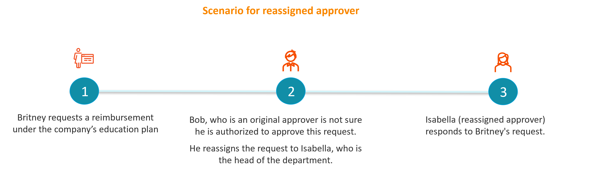

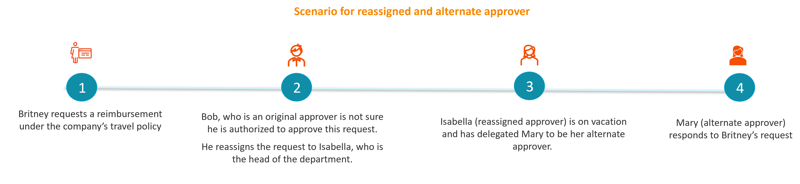

## Where do requesters and approvers see approval requests?

The following table shows where the requester and approver can see the approval requests on the UI:

| User<br> | Status of request<br> | Approval request<br> | Delegated approval requests<br> | Reassigned approval requests<br> | Reassigned and then delegated approval requests<br> |
| --- | --- | --- | --- | --- | --- |
| * Requester * On behalf of users * Collaborators | Waiting for approval<br> | Active events<br> | Active events<br> | Active events<br> | Active events<br> |
| Original approver<br> | Active events<br> | Active events<br> | Not available<br> | Not available<br> |
| Alternate approvers<br> | *Not applicable*<br> | Active events<br> | *Not applicable*<br> | Active events<br> |
| Reassigned approver<br> | *Not applicable*<br> | *Not applicable*<br> | Active events<br> | Active events<br> |
| * Requester * OBO users * Collaborators | Approved<br> | Active events<br> | Active events<br> | Active events<br> | Active events<br> |
| Original approver<br> | Past events<br> | Past events<br> | Not available<br> | Not available<br> |
| Alternate approvers<br> | *Not applicable*<br> | Past events<br> | *Not applicable*<br> | Past events<br> |
| Reassigned approver<br> | *Not applicable*<br> | *Not applicable*<br> | Past events<br> | Past event<br> |
| * Requester * OBO users * Collaborators | Closed or rejected<br> | Past events<br> | Past events<br> | Past events<br> | Past events<br> |
| Original approver<br> | Past events<br> | Past events<br> | Not available<br> | Not available<br> |
| Alternate approvers<br> | *Not applicable*<br> | Past events<br> | *Not applicable*<br> | Past events<br> |
| Reassigned approver<br> | *Not applicable*<br> | *Not applicable*<br> | Past events<br> | Past events<br> |
| * Requester * OBO users * Collaborators | *(Version 25.2.01 and later)*More information needed | Active events | Active events | Active events | Active events |
| Original approver<br> | Active events | Active events | *Not available* | *Not available* |
| Alternate approvers<br> | *Not applicable*<br> | Active events<br> | *Not applicable*<br> | Active events<br> |
| Reassigned approver<br> | *Not applicable*<br> | *Not applicable*<br> | Active events<br> | Active events<br> |

**Important**

An approval request is available in Active events for the requester, OBO users, and collaborators only if the workflow of the requested service contains other activities.

If a workflow of the requested service contains only the Approval activity, the approval request can be found in the Past events.

Any change in the status of an event is noted on the UI. When no further action can be taken on an item in the events view, the item is marked with a dark border and a check mark; the Update button () expands in width to display the text. Both are visual indicators to users that their events view needs to be refreshed. To refresh the view, users can click**Update**button.

The following image shows two requests, one that has been approved and the other that is in progress.


## Behavior when only one approver from a list of approvers needs to approve

If a request is assigned to multiple approvers, the request appears in the Active events section for all approvers. If a request requires approval from only one of the approvers, an appropriate message is displayed if a second approver tries to approve or reject the request at the same time as the first one. When such a message is generated, an exclamation mark is added to the item in the events view. The second approver can click the exclamation mark icon to view the message. All other approvers see the event as completed in their events view.


---

## <a id="getting-startedkey-conceptsstudio-pagesmd"></a>Getting-Started/Key-Concepts/Studio-Pages.md

Use the DWP Studio to create content rich visually appealing pages for the best user experience for your lines of business.You can create pages that align with your organization branding, consistent global appearance and feel, and provide a seamless experience to your users.

Use Studio to create multiple pages, with the right text, images, videos, and links, to guide your users to the desired content and services. You can restrict access to these pages through entitlements. You can then create navigation menus to group pages under sections and guide your users to the desired content.

Required license

[](https://docs.bmc.com/xwiki/bin/view/Service-Management/Employee-Digital-Workplace/BMC-Helix-Digital-Workplace/dwp254/Planning/License-types-and-features/)[DWP](https://docs.bmc.com/xwiki/bin/view/Service-Management/Employee-Digital-Workplace/BMC-Helix-Digital-Workplace/dwp254/Planning/License-types-and-features/)

Related topics

[Creating-workplaces-for-your-lines-of-business](https://docs.bmc.com/xwiki/bin/view/Service-Management/Employee-Digital-Workplace/BMC-Helix-Digital-Workplace/dwp254/Administering/Administering-BMC-Helix-Digital-Workplace/Creating-workplaces-for-your-lines-of-business/)

Studio provides the following features:

* Components palette and a design canvas to create pages
* Configurable properties for control over the design, layout, and appearance of a page
* Support for various screen sizes and choices for viewing page previews for various form factors

## Leveraging the sample pages

provides several sample pages to help you design and create studio pages for your workplaces. The sample pages are design ideas that show you how to configure properties of different page components to create a particular look or to provide a desired functionality. These pages serve as a reference or as a good starting point to build your pages.

Scenario

Petramco is a managed service provider (MSP) that offers a curated service catalog to its customers, who are from different industry verticals such as telecom, retail, or entertainment. Petramco wants to provide industry-specific Home pages for the customers.

The administrator saves time to create pages from scratch by reusing the components and color schemes from the sample pages for industry verticals.

Copy a sample page and use it as the basis for creating a page with the desired layout, appearance (look and feel), and content. For more information, see[Sample-pages](https://docs.bmc.com/xwiki/bin/view/Service-Management/Employee-Digital-Workplace/BMC-Helix-Digital-Workplace/dwp254/Administering/Administering-BMC-Helix-Digital-Workplace/Creating-workplaces-for-your-lines-of-business/Sample-pages/).

To watch a video on creating a page in the Studio, see the topic[Creating-pages-in-the-studio](https://docs.bmc.com/xwiki/bin/view/Service-Management/Employee-Digital-Workplace/BMC-Helix-Digital-Workplace/dwp254/Administering/Administering-BMC-Helix-Digital-Workplace/Creating-workplaces-for-your-lines-of-business/Creating-pages-in-the-studio/).

## Use cases for a studio page

You can create pages for your lines of business. Each line of business has specific requirements for services and information and you can create pages accordingly. You can also use the pages as templates to create more pages. For example, you might create two versions of the same HR page, one for managers and the other for non-managerial employees.

### Human Resources

A sample HR portal with pages created in the studio:

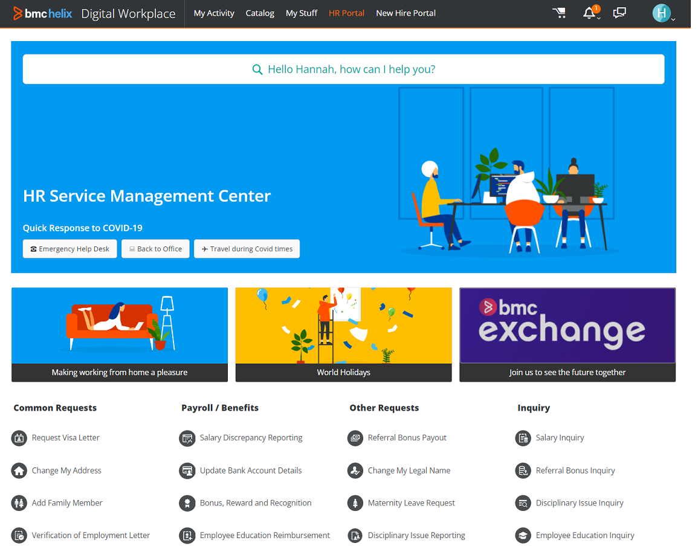

### **Facilities portal**

You can create a facilities portal that the following services and many more:

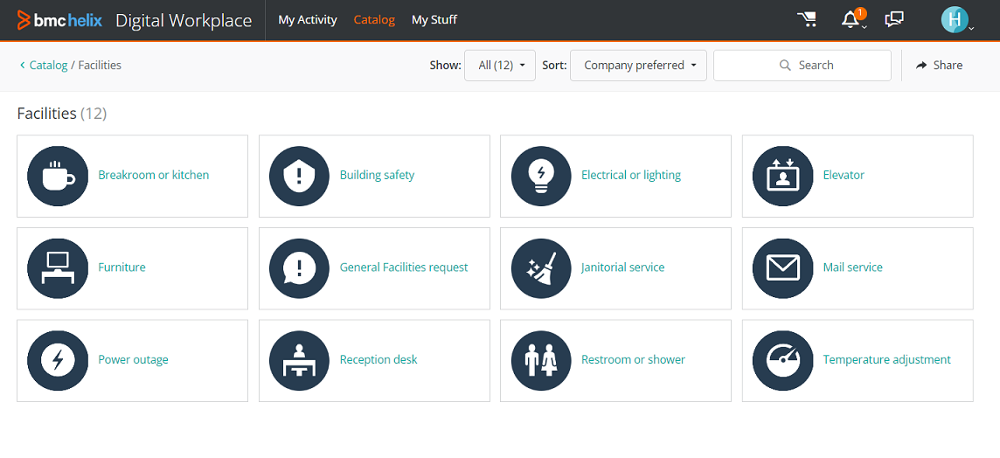

## Where to go from here

[Creating-workplaces-for-your-lines-of-business](https://docs.bmc.com/xwiki/bin/view/Service-Management/Employee-Digital-Workplace/BMC-Helix-Digital-Workplace/dwp254/Administering/Administering-BMC-Helix-Digital-Workplace/Creating-workplaces-for-your-lines-of-business/)

---

## <a id="getting-startedkey-conceptssubcatalogsmd"></a>Getting-Started/Key-Concepts/Subcatalogs.md

Subcatalogs, like subfolders, are smaller catalogs or units within the larger catalog. Subcatalogs are an administrative concept to better manage services.

Catalog administrators can view and manage services in all catalogs and subcatalogs, whereas internal suppliers and internal supplier administrators can manage only the subcatalogs assigned to them.

The following diagram depicts the concept of subcatalogs:

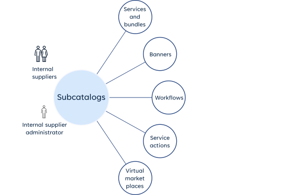

Required license

[](https://docs.bmc.com/xwiki/bin/view/Service-Management/Employee-Digital-Workplace/BMC-Helix-Digital-Workplace/dwp254/Planning/License-types-and-features/)[DWP](https://docs.bmc.com/xwiki/bin/view/Service-Management/Employee-Digital-Workplace/BMC-Helix-Digital-Workplace/dwp254/Planning/License-types-and-features/)

Related topics

[DWP-Catalog](https://docs.bmc.com/xwiki/bin/view/Service-Management/Employee-Digital-Workplace/BMC-Helix-Digital-Workplace/dwp254/Getting-started/Key-concepts/BMC-Helix-Digital-Workplace-Catalog/)

[Key-concepts](https://docs.bmc.com/xwiki/bin/view/Service-Management/Employee-Digital-Workplace/BMC-Helix-Digital-Workplace/dwp254/Getting-started/Key-concepts/)

[Assigning-subcatalog-roles-to-user-accounts](https://docs.bmc.com/xwiki/bin/view/Service-Management/Employee-Digital-Workplace/BMC-Helix-Digital-Workplace/dwp254/Administering/Administering-BMC-Helix-Digital-Workplace-Catalog/Setting-up-user-accounts-and-granting-access-to-BMC-Helix-Digital-Workplace-Catalog/Assigning-subcatalog-roles-to-user-accounts/)

## Subcatalogs and their roles

Subcatalogs are managed by the following roles:

* Internal supplier—maintains a subcatalog
* Internal supplier administrator—populates a subcatalog
* Embedded supplier—populates aBusiness Workflowssubcatalog

To learn more about these roles, see[Catalog-roles-and-permissions](https://docs.bmc.com/xwiki/bin/view/Service-Management/Employee-Digital-Workplace/BMC-Helix-Digital-Workplace/dwp254/Administering/Administering-BMC-Helix-Digital-Workplace-Catalog/Setting-up-user-accounts-and-granting-access-to-BMC-Helix-Digital-Workplace-Catalog/Catalog-roles-and-permissions/).

Each service, bundle, banner, service action, and virtual marketplace can be a part of a single subcatalog. The access is restricted to the internal suppliers and service supplier administrators who are associated with it. In the[reports and analysis of the enhanced service catalog](https://docs.bmc.com/xwiki/bin/view/Service-Management/Employee-Digital-Workplace/BMC-Helix-Digital-Workplace/dwp254/Administering/Administering-BMC-Helix-Digital-Workplace-Catalog/Reports-and-analysis-of-the-enhanced-service-catalog/), internal service suppliers and internal supplier administrators can see only thoseservice requests associated within their assigned subcatalog.

TheDWP Catalogensures that users with subcatalog roles can only view and manage services they are entitled to, based on Virtual Marketplace entitlements. This feature enhances multitenancy by preventing internal suppliers from accessing services outside their designated subcatalogs. For more information,see[Creating-virtual-marketplace-entitlements](https://docs.bmc.com/xwiki/bin/view/Service-Management/Employee-Digital-Workplace/BMC-Helix-Digital-Workplace/dwp254/Creating-and-managing-the-service-catalog/Entitling-end-users-to-services-bundles-and-banners/Creating-virtual-marketplace-entitlements/#Creatingvirtualmarketplaceentitlements-EnforceEntitlement).

## Business Workflow subcatalogs specific to lines of business

In addition to the default Business Workflows Sub Catalog, an embedded supplier can create multiple subcatalogs for different lines of business within Business Workflows and populate these subcatalogs with services. When creating services for the Business Workflows subcatalogs, embedded suppliers can select a case template that corresponds to a specific line of business. For more information about selecting case templates, see[Creating questions with default responses](https://docs.bmc.com/xwiki/bin/view/Service-Management/Employee-Digital-Workplace/BMC-Helix-Digital-Workplace/dwp254/Creating-and-managing-the-service-catalog/Building-service-catalogs/Creating-service-questionnaires/Creating-questions-with-default-responses/#templates).

After the subcatalogs are created, a business analyst maps these subcatalogs to their respective lines of business in Business Workflows. This mapping capability is provided by the CreateSubcatalog workflow, which can be viewed but not modified. After the mapping is complete, case catalog administrators will only see the subcatalogs that are relevant to their specific line of business when they access DWP Catalog from Business Workflows. This separation prevents cross-visibility into other lines of business and provides better service management. With this feature, catalog services can be segregated based on the subcatalogs corresponding to each line of business.

For more information about mapping subcatalogs to lines of business, see[Working with DWP Catalog](https://docs.bmc.com/xwiki/bin/create/Service-Management/Enterprise-Service-Management/BMC-Helix-Business-Workflows/bwf252/Getting-started/Key-concepts/Catalog/WebHome?parent=Service-Management.Employee-Digital-Workplace.BMC-Helix-Digital-Workplace.dwp254.Getting-started.Key-concepts.Subcatalogs.WebHome). To learn about limitations related to mapping subcatalogs to lines of business, see[Assigning subcatalog roles to user accounts](https://docs.bmc.com/xwiki/bin/view/Service-Management/Employee-Digital-Workplace/BMC-Helix-Digital-Workplace/dwp254/Administering/Administering-BMC-Helix-Digital-Workplace-Catalog/Setting-up-user-accounts-and-granting-access-to-BMC-Helix-Digital-Workplace-Catalog/Assigning-subcatalog-roles-to-user-accounts/#limitations).

The following image is an example of thedefault Business Workflows Sub Catalog:

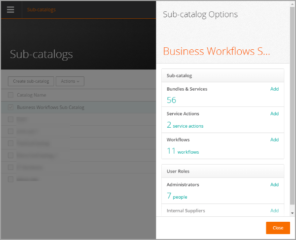

Scenario: Designing subcatalogs

Apex Global is designing its service catalog. The administrator wants to design a catalog for their Facilities department. The company outsources its housekeeping and parking and vehicle management to a third-party vendor. Hannah, the catalog administrator creates the following subcatalogs:

* Housekeeping  
  Hannah assigns the responsibility of creating, maintaining, and administering this subcatalog to an internal supplier administrator- Carl.
* Safety and security  
  Hannah retains the administration of this subcatalog to herself.
* Parking and vehicle management  
  Hannah assigns the responsibility of creating services in this subcatalog to an internal supplier - Dave, but retains the administration of the subcatalog with herself.


---

## <a id="getting-startedonboarding-overviewmd"></a>Getting-Started/Onboarding-Overview.md

The SaaS onboarding process starts after , Inc. processes your order and you receive the order confirmation email. The following diagram illustrates the initial phases of onboarding:

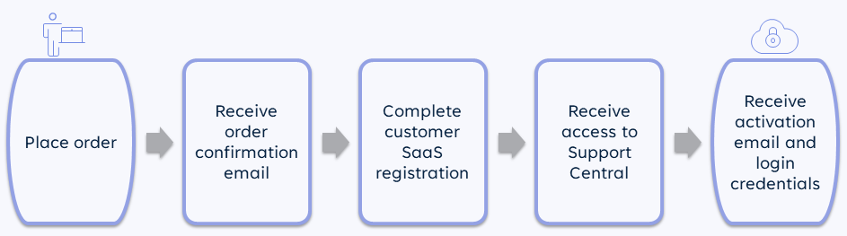

Related topics

[Product-overview](https://docs.bmc.com/xwiki/bin/view/Service-Management/Employee-Digital-Workplace/BMC-Helix-Digital-Workplace/dwp254/Getting-started/Product-overview/)

[Setting-up-and-going-live](https://docs.bmc.com/xwiki/bin/view/Service-Management/Employee-Digital-Workplace/BMC-Helix-Digital-Workplace/dwp254/Setting-up-and-going-live/)[Orientation Checklist](https://docs.bmc.com/xwiki/bin/view/Helix-Common-Services/Other/BMC-Helix-Subscriber-Information/helixsubscriber/Getting-started/BMC-Helix-Orientation-Checklist/)

Training and certifications

[Training and Certification](https://www.bmc.com/education/training-and-certification.html)[DWP courses, certifications, and subscriptions](https://www.bmc.com/education/courses/find-courses.html#&keyword=Digital%20Workplace&sortCriteria=recommended&category=education)

## Know your onboarding team

Depending on your subscription, you might be assigned team members in addition to your Account Manager. To find your teams:

1. Go to[https://support..com](https://support.bmc.com)and log in.
2. Select**My Support**>**My Team**.
3. To see your , Inc. team contacts for a specific department, such as Customer Success or Education services, select the corresponding tab.

Members of your team who work with you for a short duration might not be listed.

## Activate your SaaS subscription

After you receive your order confirmation, in the email, click**Get Started**and follow the instructions to activate your subscription.


## Set up your application

Global Services, a trusted partner, or your development staff configures the application to meet your business needs. If you are configuring the application, see[Setting-up-and-going-live](https://docs.bmc.com/xwiki/bin/view/Service-Management/Employee-Digital-Workplace/BMC-Helix-Digital-Workplace/dwp254/Setting-up-and-going-live/)..

---

## <a id="getting-startedproduct-overviewmd"></a>Getting-Started/Product-Overview.md

**Transition from IBM Watson to HelixGPT**  
From September 22, your IBM Watson instance is turned off by default. For enhanced capabilities, use[HelixGPT Employee Navigator](https://docs.bmc.com/xwiki/bin/view/Service-Management/Employee-Digital-Workplace/BMC-HelixGPT/helixgpt253/AI-agents-in-BMC-HelixGPT/Employee-Navigator/).

If you want to continue using IBM Watson, please contact Support.

DWPis a solution that helps make it easier and faster for employees to find the information they need so that they can focus on more strategic work. It presents the services from different lines of business into a single-click, intuitive storefront. Employees can interact with internal service providers (IT, HR, Facilities, Legal and Finance) in a modern way and get their request fulfilled anytime, anywhere. They can use Employee Navigator that serves as an AI Assistant to provide instant self-service when it is most needed.

Related topics

[Using-DWP-to-request-services](https://docs.bmc.com/xwiki/bin/view/Service-Management/Employee-Digital-Workplace/BMC-Helix-Digital-Workplace/dwp254/Using-BMC-Helix-Digital-Workplace-to-request-services/)

[Use-cases](https://docs.bmc.com/xwiki/bin/view/Service-Management/Employee-Digital-Workplace/BMC-Helix-Digital-Workplace/dwp254/Getting-started/Use-cases/)[DWP Training & Certification](https://www.bmc.com/education/product-training/dwp-options.html)

The following video (5:22) provides an overview of key capabilities of DWP and the product components:

[🎥 Watch Video: https://www.youtube.com/watch?v=EyIaV0kmbk8](https://www.youtube.com/watch?v=EyIaV0kmbk8)

[Watch the YouTube video about DWP product overview](https://www.youtube.com/embed/EyIaV0kmbk8)

**Tip**

To view all videos for the product, go to the[DWP YouTube playlist](https://www.youtube.com/playlist?list=PLibAMtD70sYFm8oRg3MHv-rJufA99QKE3).[Subscribe to BMCdocs](https://www.youtube.com/c/BMCdocs?sub_confirmation=1)[Subscribe to ServiceOps](https://www.youtube.com/@BMCHelixServiceOps)

## Scenario

Leveraging DWP capabilities

Apex Global, a subscriber ofDWPAdvanced wants to empower its employees by allowing them to interact with internal service providers - HR, IT, and Finance in a modern way and get their request fulfilled anywhere at any time.

* Allen, the administrator leverages the cognitive capabilities ofVirtual Agentto provide an omni-channel, multi-lingual interaction with the end users. He also integrates withBusiness Workflowsto leverage the HR line of business capabilities.
* Hannah, the Catalog administrator sets up the subcatalog for the IT and Finance lines of business and entitles users to these services.
* Britney, an employee of Apex Global has a client meeting in the San Francisco office, which she is visiting for the first time. She uses the following resources from her mobile device to reach the office and locate the meeting room:
  + Location to use the driving instructions to reach the office. (This capability is available withDWPAdvanced[license](https://docs.bmc.com/xwiki/bin/view/Service-Management/Employee-Digital-Workplace/BMC-Helix-Digital-Workplace/dwp254/Planning/License-types-and-features/))
  + Floor maps to locate and book a suitable meeting room with a projector and whiteboard. (This capability is available withDWPAdvanced[license](https://docs.bmc.com/xwiki/bin/view/Service-Management/Employee-Digital-Workplace/BMC-Helix-Digital-Workplace/dwp254/Planning/License-types-and-features/))
  + Service to request guest wi-fi credentials before reaching office.  
    She receives the credentials, well in advance, which she shares with the guests upon their arrival.

## User roles

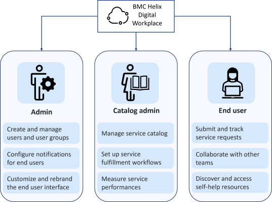

The following tables list the roles, their goals, and the corresponding tasks:

* <details class="confluence-expand-macro panel panel-default"><summary><span class="panel-title"><span class="title-text">Roles to work in the DWP administration console</span></span></summary><div class="panel-body"><table class="relative-table wrapped"><thead><tr><th scope="col"><div><p>Role</p></div></th><th scope="col"><div><p>Goal</p></div></th><th scope="col"><div><p>Tasks</p></div></th><th scope="col"><div><p>Reference</p></div></th></tr></thead><tr><td rowspan="3"><div><p><strong>Super Administrator</strong><br/><strong><br/><br/></strong></p></div></td><td><div><p><span>Provide external users access to the service catalog.</span></p></div></td><td><div><ul><li>Create a portal for external users.</li><li>Manage the access of external users.</li><li>Integrate with products.</li></ul></div></td><td><div><p><span class="wikilink"><a href="https://docs.bmc.com/xwiki/bin/view/Service-Management/Employee-Digital-Workplace/BMC-Helix-Digital-Workplace/dwp254/Administering/Administering-BMC-Helix-Digital-Workplace/Administering-an-external-BMC-Helix-Digital-Workplace-portal/"><span class="wikigeneratedlinkcontent">Administering-an-external-DWP-portal</span></a></span></p><p><span class="wikilink"><a href="https://docs.bmc.com/xwiki/bin/view/Service-Management/Employee-Digital-Workplace/BMC-Helix-Digital-Workplace/dwp254/Integrating/Enabling-integrated-applications-for-external-users/"><span class="wikigeneratedlinkcontent">Enabling-integrated-applications-for-external-users</span></a></span></p></div></td></tr><tr><td><div><p><span>Manage MSPs (Managed Service Providers) and perform</span>baseline configuration and other related tasks to help them get started.</p></div></td><td><div><ul><li>Create and manage your customers.</li><li>Formulate the pricing for services.</li><li>Integrate with providers to provide their functionality to tenants.</li></ul></div></td><td><div><p><span class="wikilink"><a href="https://docs.bmc.com/xwiki/bin/view/Service-Management/Employee-Digital-Workplace/BMC-Helix-Digital-Workplace/dwp254/Administering/Administering-BMC-Helix-Digital-Workplace/Configuring-subtenants/"><span class="wikigeneratedlinkcontent">Configuring-subtenants</span></a></span></p><p><span class="wikilink"><a href="https://docs.bmc.com/xwiki/bin/view/Service-Management/Employee-Digital-Workplace/BMC-Helix-Digital-Workplace/dwp254/Administering/Administering-BMC-Helix-Digital-Workplace-Catalog/Setting-up-and-managing-a-credit-based-payment-system/"><span class="wikigeneratedlinkcontent">Setting-up-and-managing-a-credit-based-payment-system</span></a></span></p><p><span class="wikilink"><a href="https://docs.bmc.com/xwiki/bin/view/Service-Management/Employee-Digital-Workplace/BMC-Helix-Digital-Workplace/dwp254/Integrating/Integrating-with-other-applications-by-using-providers/"><span class="wikigeneratedlinkcontent">Integrating-with-other-applications-by-using-providers</span></a></span>and<span class="wikilink"><a href="https://docs.bmc.com/xwiki/bin/view/Service-Management/Employee-Digital-Workplace/BMC-Helix-Digital-Workplace/dwp254/Integrating/"><span class="wikigeneratedlinkcontent">Integrating</span></a></span></p></div></td></tr><tr><td colspan="3"><div><p><strong>Important</strong>: A super administrator can perform all the tasks of an administrator in addition to the two tasks listed.</p></div></td></tr><tr><td rowspan="15"><div><p><strong>Administrator</strong><br/><strong><br/><br/><br/><br/><br/><br/><br/><br/></strong></p></div></td><td rowspan="3"><div><p><span>Empower end users to look for and find solutions to their issues</span><span>before they file an incident, open a case, or talk to support staff.</span><br/></p></div></td><td><div><ul><li><span>Set up self-service.</span></li><li><span>Set up links to how-to resources, knowledge articles, and knowledge article sources.</span></li></ul></div></td><td><div><p><span class="wikilink"><a href="https://docs.bmc.com/xwiki/bin/view/Service-Management/Employee-Digital-Workplace/BMC-Helix-Digital-Workplace/dwp254/Enabling-self-service-in-an-organization/"><span class="wikigeneratedlinkcontent">Enabling-self-service-in-an-organization</span></a></span></p><p><span class="wikilink"><a href="https://docs.bmc.com/xwiki/bin/view/Service-Management/Employee-Digital-Workplace/BMC-Helix-Digital-Workplace/dwp254/Enabling-self-service-in-an-organization/Setting-up-self-help-resources/"><span class="wikigeneratedlinkcontent">Setting-up-self-help-resources</span></a></span></p></div></td></tr><tr><td><div><p><span>Configure locations and assets associated with locations so users can reserve conference rooms, desks, and break rooms.</span></p></div></td><td><div><p><span class="wikilink"><a href="https://docs.bmc.com/xwiki/bin/view/Service-Management/Employee-Digital-Workplace/BMC-Helix-Digital-Workplace/dwp254/Enabling-self-service-in-an-organization/Locations/">Managing locations</a></span></p></div></td></tr><tr><td><div><p><span>Provide information about the health of important services running in your organization.</span></p></div></td><td><div><p><span class="wikilink"><a href="https://docs.bmc.com/xwiki/bin/view/Service-Management/Employee-Digital-Workplace/BMC-Helix-Digital-Workplace/dwp254/Enabling-self-service-in-an-organization/Setting-up-service-health-items/"><span class="wikigeneratedlinkcontent">Setting-up-service-health-items</span></a></span></p></div></td></tr><tr><td><div><p><span>Provide contextual conversation to help users resolve issues quickly.</span></p></div></td><td><div><p>Integrate with Live Chat and Virtual Agent.</p></div></td><td><div><ul><li><span class="wikicreatelink"><a href="https://docs.bmc.com/xwiki/bin/create/Service-Management/Employee-Digital-Workplace/BMC-Helix-Digital-Workplace/dwp254/Integrating/Integrating-BMC-Helix-Digital-Workplace-Catalog-with-BMC-Helix-Virtual-Agent/WebHome?parent=Service-Management.Employee-Digital-Workplace.BMC-Helix-Digital-Workplace.dwp254.Getting-started.Product-overview.WebHome"><span class="wikigeneratedlinkcontent">Integrating-DWP-Catalog-with-Virtual-Agent</span></a></span></li><li><span class="wikilink"><a href="https://docs.bmc.com/xwiki/bin/view/Service-Management/Employee-Digital-Workplace/BMC-Helix-Digital-Workplace/dwp254/Integrating/Integrating-a-BMC-chat-application-with-BMC-Helix-Digital-Workplace/"><span class="wikigeneratedlinkcontent">Integrating-a-chat-application-with-DWP</span></a></span></li></ul></div></td></tr><tr><td><div><p><span>Customize the look of the application to match the company's branding or identity.</span></p></div></td><td><div><p><span>Rebrand the user interface.</span></p></div></td><td><div><p><span class="wikilink"><a href="https://docs.bmc.com/xwiki/bin/view/Service-Management/Employee-Digital-Workplace/BMC-Helix-Digital-Workplace/dwp254/Administering/Administering-BMC-Helix-Digital-Workplace/Customizing-and-rebranding-the-BMC-Helix-Digital-Workplace-user-interface/Rebranding-BMC-Helix-Digital-Workplace/"><span class="wikigeneratedlinkcontent">Rebranding-DWP</span></a></span></p></div></td></tr><tr><td><div><p><span>Create pages for lines of business.</span></p></div></td><td><div><p><span>Create visually appealing and efficient pages suited for your lines of business.</span></p></div></td><td><div><p><span class="wikilink"><a href="https://docs.bmc.com/xwiki/bin/view/Service-Management/Employee-Digital-Workplace/BMC-Helix-Digital-Workplace/dwp254/Administering/Administering-BMC-Helix-Digital-Workplace/Creating-workplaces-for-your-lines-of-business/"><span class="wikigeneratedlinkcontent">Creating-workplaces-for-your-lines-of-business</span></a></span></p></div></td></tr><tr><td><div><p><span>Make announcements and inform end users about new services.</span></p></div></td><td><div><p><span>Create and display banners to promote services and announcements.</span></p></div></td><td><div><p><span class="wikilink"><a href="https://docs.bmc.com/xwiki/bin/view/Service-Management/Employee-Digital-Workplace/BMC-Helix-Digital-Workplace/dwp254/Creating-and-managing-the-service-catalog/Creating-promotional-banners/"><span class="wikigeneratedlinkcontent">Creating-promotional-banners</span></a></span></p></div></td></tr><tr><td><div><p><span>Help users easily find services.</span></p></div></td><td><div><p><span>Create catalog sections.</span></p></div></td><td><div><p><span class="wikilink"><a href="https://docs.bmc.com/xwiki/bin/view/Service-Management/Employee-Digital-Workplace/BMC-Helix-Digital-Workplace/dwp254/Creating-and-managing-the-service-catalog/Setting-up-sections-in-the-Catalog/"><span class="wikigeneratedlinkcontent">Setting-up-sections-in-the-Catalog</span></a></span></p></div></td></tr><tr><td><div><p><span>Show end users what resources and services they are entitled to.</span></p></div></td><td><div><p><span>Create assets groups and manage them.</span></p></div></td><td><div><p><span class="wikilink"><a href="https://docs.bmc.com/xwiki/bin/view/Service-Management/Employee-Digital-Workplace/BMC-Helix-Digital-Workplace/dwp254/Creating-and-managing-the-service-catalog/Building-service-catalogs/Managing-asset-groups/"><span class="wikigeneratedlinkcontent">Managing-asset-groups</span></a></span></p></div></td></tr><tr><td><div><p><span>Let end users interact with their assets and completed service requests.</span></p></div></td><td><div><p><span>Create service actions.</span></p></div></td><td><div><p><span class="wikilink"><a href="https://docs.bmc.com/xwiki/bin/view/Service-Management/Employee-Digital-Workplace/BMC-Helix-Digital-Workplace/dwp254/Creating-and-managing-the-service-catalog/Building-service-catalogs/Managing-service-actions/"><span class="wikigeneratedlinkcontent">Managing-service-actions</span></a></span></p></div></td></tr><tr><td><div><p><span>Let end users collaborate on service requests.</span></p></div></td><td><div><ul><li><span>Let</span><span>collaborators view and comment on the initial request.</span></li><li><span>Create and manage people groups for end user collaboration.</span></li></ul></div></td><td><div><p><span class="wikilink"><a href="https://docs.bmc.com/xwiki/bin/view/Service-Management/Employee-Digital-Workplace/BMC-Helix-Digital-Workplace/dwp254/Administering/Administering-BMC-Helix-Digital-Workplace-Catalog/Enabling-service-request-collaboration/"><span class="wikigeneratedlinkcontent">Enabling-service-request-collaboration</span></a></span></p><p>See also,<span class="wikilink"><a href="https://docs.bmc.com/xwiki/bin/view/Service-Management/Employee-Digital-Workplace/BMC-Helix-Digital-Workplace/dwp254/Administering/Administering-BMC-Helix-Digital-Workplace-Catalog/Setting-up-user-accounts-and-granting-access-to-BMC-Helix-Digital-Workplace-Catalog/Creating-people-groups-for-end-user-collaboration/"><span class="wikigeneratedlinkcontent">Creating-people-groups-for-end-user-collaboration</span></a></span></p></div></td></tr><tr><td><div><p>Communicate with end users about the progress of their service requests as they are being processed.</p><p>Send messages to the whole organization or to specific users about service outages, knowledge article updates, or other announcements.</p></div></td><td><div><ul><li><span>Configure notifications.</span></li><li>Configure broadcasts.</li></ul></div></td><td><div><p><span class="wikilink"><a href="https://docs.bmc.com/xwiki/bin/view/Service-Management/Employee-Digital-Workplace/BMC-Helix-Digital-Workplace/dwp254/Administering/Administering-BMC-Helix-Digital-Workplace/Managing-broadcasts-and-notifications-for-end-users/"><span class="wikigeneratedlinkcontent">Managing-broadcasts-and-notifications-for-end-users</span></a></span></p></div></td></tr><tr><td><div><p>Get feedback on services, check what is working and what is not, and identify areas for improvement.</p></div></td><td><div><ul><li><span>Create satisfaction surveys.</span></li><li><span>Generate satisfaction reports.</span></li><li>Generate trend reports to compare changes in requests received over time.</li></ul></div></td><td><div><p><span class="wikilink"><a href="https://docs.bmc.com/xwiki/bin/view/Service-Management/Employee-Digital-Workplace/BMC-Helix-Digital-Workplace/dwp254/Creating-and-managing-the-service-catalog/Setting-up-surveys/"><span class="wikigeneratedlinkcontent">Setting-up-surveys</span></a></span></p><p><span class="wikilink"><a href="https://docs.bmc.com/xwiki/bin/view/Service-Management/Employee-Digital-Workplace/BMC-Helix-Digital-Workplace/dwp254/Administering/Administering-BMC-Helix-Digital-Workplace-Catalog/Reports-and-analysis-of-the-enhanced-service-catalog/"><span class="wikigeneratedlinkcontent">Reports-and-analysis-of-the-enhanced-service-catalog</span></a></span></p></div></td></tr><tr><td><div><p><span>Manage costs associated with the fulfillment of service requests and streamline the process.</span></p></div></td><td><div><p><span>Configure approvals for service requests.</span></p></div></td><td><div><p><span class="wikilink"><a href="https://docs.bmc.com/xwiki/bin/view/Service-Management/Employee-Digital-Workplace/BMC-Helix-Digital-Workplace/dwp254/Administering/Administering-BMC-Helix-Digital-Workplace/Setting-up-approvals/"><span class="wikigeneratedlinkcontent">Setting-up-approvals</span></a></span></p></div></td></tr><tr><td><div><p><span>Optimize licenses.</span></p></div></td><td><div><p><span>Review the active user and self-registered user reports.</span></p></div></td><td><div><p><span class="wikilink"><a href="https://docs.bmc.com/xwiki/bin/view/Service-Management/Employee-Digital-Workplace/BMC-Helix-Digital-Workplace/dwp254/Administering/Administering-BMC-Helix-Digital-Workplace/Tracking-activity/Reviewing-active-users/"><span class="wikigeneratedlinkcontent">Reviewing-active-users</span></a></span></p></div></td></tr></table></div></details>
* <details class="confluence-expand-macro panel panel-default"><summary><span class="panel-title"><span class="title-text">Roles to work in DWP Catalog</span></span></summary><div class="panel-body"><table class="relative-table wrapped"><thead><tr><th scope="col"><div><p>Role</p></div></th><th scope="col"><div><p>Goal</p></div></th><th scope="col"><div><p>Tasks</p></div></th><th scope="col"><div><p>Reference</p></div></th></tr></thead><tr><td rowspan="9"><div><p><strong>Catalog Administrator</strong><br/><strong><br/><br/></strong></p></div></td><td><div><p><span>Make it possible for the organization to provide all necessary services to end users.</span></p></div></td><td><div><ul><li>Set up one or more service catalogs for end users.</li><li>Create service templates.</li><li>Create and publish services.</li></ul></div></td><td><div><p><span class="wikilink"><a href="https://docs.bmc.com/xwiki/bin/view/Service-Management/Employee-Digital-Workplace/BMC-Helix-Digital-Workplace/dwp254/Creating-and-managing-the-service-catalog/Building-service-catalogs/"><span class="wikigeneratedlinkcontent">Building-service-catalogs</span></a></span></p></div></td></tr><tr><td><div><p><span>Expand the service catalog and bring external offerings into the catalog.</span></p></div></td><td><div><ul><li><span>Integrate with services and platforms like Microsoft Office 365, Microsoft Azure, Atlassian JIRA, Amazon Web Services.</span></li><li><span>Import services.</span></li></ul></div></td><td><div><p><span class="wikilink"><a href="https://docs.bmc.com/xwiki/bin/view/Service-Management/Employee-Digital-Workplace/BMC-Helix-Digital-Workplace/dwp254/Creating-and-managing-the-service-catalog/Connecting-your-catalog-to-external-systems/Configuring-service-connectors/"><span class="wikigeneratedlinkcontent">Configuring-service-connectors</span></a></span></p><p><span class="wikilink"><a href="https://docs.bmc.com/xwiki/bin/view/Service-Management/Employee-Digital-Workplace/BMC-Helix-Digital-Workplace/dwp254/Creating-and-managing-the-service-catalog/Building-service-catalogs/Importing-service-catalog-items-from-external-systems/"><span class="wikigeneratedlinkcontent">Importing-service-catalog-items-from-external-systems</span></a></span></p></div></td></tr><tr><td><div><p><span>Help users easily find services.</span></p></div></td><td><div><p><span>Create service categories.</span></p></div></td><td><div><p><span class="wikilink"><a href="https://docs.bmc.com/xwiki/bin/view/Service-Management/Employee-Digital-Workplace/BMC-Helix-Digital-Workplace/dwp254/Creating-and-managing-the-service-catalog/Building-service-catalogs/Adding-and-updating-service-categories/"><span class="wikigeneratedlinkcontent">Adding-and-updating-service-categories</span></a></span></p></div></td></tr><tr><td><div><p><span>Manage a large service catalog.</span></p></div></td><td><div><p><span>Organize services into groups by creating subcatalogs.</span></p></div></td><td><div><p><span class="wikilink"><a href="https://docs.bmc.com/xwiki/bin/view/Service-Management/Employee-Digital-Workplace/BMC-Helix-Digital-Workplace/dwp254/Getting-started/Key-concepts/Subcatalogs/"><span class="wikigeneratedlinkcontent">Subcatalogs</span></a></span></p><p><span class="wikilink"><a href="https://docs.bmc.com/xwiki/bin/view/Service-Management/Employee-Digital-Workplace/BMC-Helix-Digital-Workplace/dwp254/Administering/Administering-BMC-Helix-Digital-Workplace-Catalog/Setting-up-user-accounts-and-granting-access-to-BMC-Helix-Digital-Workplace-Catalog/Assigning-subcatalog-roles-to-user-accounts/"><span class="wikigeneratedlinkcontent">Assigning-subcatalog-roles-to-user-accounts</span></a></span></p></div></td></tr><tr><td><div><p><span>Control user access to services in the organization.</span></p></div></td><td><div><p><span>Create virtual marketplaces and entitlements.</span></p></div></td><td><div><p><span class="wikilink"><a href="https://docs.bmc.com/xwiki/bin/view/Service-Management/Employee-Digital-Workplace/BMC-Helix-Digital-Workplace/dwp254/Creating-and-managing-the-service-catalog/Entitling-end-users-to-services-bundles-and-banners/"><span class="wikigeneratedlinkcontent">Entitling-end-users-to-services-bundles-and-banners</span></a></span></p></div></td></tr><tr><td><div><p><span>Distribute the creation and management of services.</span></p></div></td><td><div><ul><li><span>Create subcatalogs.</span></li><li><span>Assign users to internal supplier administrator and internal supplier roles to manage subcatalogs.</span></li></ul></div></td><td><div><p><span class="wikilink"><a href="https://docs.bmc.com/xwiki/bin/view/Service-Management/Employee-Digital-Workplace/BMC-Helix-Digital-Workplace/dwp254/Administering/Administering-BMC-Helix-Digital-Workplace-Catalog/Setting-up-user-accounts-and-granting-access-to-BMC-Helix-Digital-Workplace-Catalog/Assigning-subcatalog-roles-to-user-accounts/"><span class="wikigeneratedlinkcontent">Assigning-subcatalog-roles-to-user-accounts</span></a></span></p></div></td></tr><tr><td><div><p><span>Check end user satisfaction with services and the popularity, cost, and effectiveness of the services.</span></p></div></td><td><div><p><span>Generate and analyze reports on usage, performance, and cost metrics of services.</span></p></div></td><td><div><p><span class="wikilink"><a href="https://docs.bmc.com/xwiki/bin/view/Service-Management/Employee-Digital-Workplace/BMC-Helix-Digital-Workplace/dwp254/Administering/Administering-BMC-Helix-Digital-Workplace-Catalog/Reports-and-analysis-of-the-enhanced-service-catalog/"><span class="wikigeneratedlinkcontent">Reports-and-analysis-of-the-enhanced-service-catalog</span></a></span></p></div></td></tr><tr><td><div><p><span>Distribute the creation and management of services.</span></p></div></td><td><div><p><span>Assign internal supplier role to users.</span></p></div></td><td><div><p><span class="wikilink"><a href="https://docs.bmc.com/xwiki/bin/view/Service-Management/Employee-Digital-Workplace/BMC-Helix-Digital-Workplace/dwp254/Administering/Administering-BMC-Helix-Digital-Workplace-Catalog/Setting-up-user-accounts-and-granting-access-to-BMC-Helix-Digital-Workplace-Catalog/Assigning-subcatalog-roles-to-user-accounts/"><span class="wikigeneratedlinkcontent">Assigning-subcatalog-roles-to-user-accounts</span></a></span></p></div></td></tr><tr><td><div><p><span>Allow collaboration on service requests.</span></p></div></td><td><div><p><span>Create people groups.</span></p></div></td><td><div><p><span class="wikilink"><a href="https://docs.bmc.com/xwiki/bin/view/Service-Management/Employee-Digital-Workplace/BMC-Helix-Digital-Workplace/dwp254/Administering/Administering-BMC-Helix-Digital-Workplace-Catalog/Setting-up-user-accounts-and-granting-access-to-BMC-Helix-Digital-Workplace-Catalog/Creating-people-groups-for-end-user-collaboration/"><span class="wikigeneratedlinkcontent">Creating-people-groups-for-end-user-collaboration</span></a></span></p><p>See also<span class="wikilink"><a href="https://docs.bmc.com/xwiki/bin/view/Service-Management/Employee-Digital-Workplace/BMC-Helix-Digital-Workplace/dwp254/Administering/Administering-BMC-Helix-Digital-Workplace-Catalog/Enabling-service-request-collaboration/"><span class="wikigeneratedlinkcontent">Enabling-service-request-collaboration</span></a></span></p></div></td></tr><tr><td rowspan="5"><div><p><strong>Internal Supplier Administrator</strong><br/><strong><br/><br/><br/></strong></p></div></td><td colspan="3"><div><p><strong><span>Scope: subcatalog</span></strong></p></div></td></tr><tr><td><div><p><span>Make it possible for the organization to offer a subset of services to end users.</span></p></div></td><td><div><ul><li>Set up services and bundles for end users.</li><li>Create and publish services.</li><li>Import services from external systems.</li></ul></div></td><td><div><p><span class="wikilink"><a href="https://docs.bmc.com/xwiki/bin/view/Service-Management/Employee-Digital-Workplace/BMC-Helix-Digital-Workplace/dwp254/Creating-and-managing-the-service-catalog/Building-service-catalogs/"><span class="wikigeneratedlinkcontent">Building-service-catalogs</span></a></span></p></div></td></tr><tr><td><div><p><span>Control user access to services in the organization.</span></p></div></td><td><div><ul><li>Create entitlement groups.</li><li>Distribute services to virtual marketplaces.</li></ul></div></td><td><div><p><span class="wikilink"><a href="https://docs.bmc.com/xwiki/bin/view/Service-Management/Employee-Digital-Workplace/BMC-Helix-Digital-Workplace/dwp254/Creating-and-managing-the-service-catalog/Entitling-end-users-to-services-bundles-and-banners/Creating-virtual-marketplace-entitlements/"><span class="wikigeneratedlinkcontent">Creating-virtual-marketplace-entitlements</span></a></span></p><p><span class="wikilink"><a href="https://docs.bmc.com/xwiki/bin/view/Service-Management/Employee-Digital-Workplace/BMC-Helix-Digital-Workplace/dwp254/Creating-and-managing-the-service-catalog/Entitling-end-users-to-services-bundles-and-banners/Distributing-services-among-virtual-marketplaces/"><span class="wikigeneratedlinkcontent">Distributing-services-among-virtual-marketplaces</span></a></span></p></div></td></tr><tr><td><div><p><span>Get an insight into the services provided.</span></p></div></td><td><div><p>View the service reports.</p></div></td><td><div><p><span class="wikilink"><a href="https://docs.bmc.com/xwiki/bin/view/Service-Management/Employee-Digital-Workplace/BMC-Helix-Digital-Workplace/dwp254/Administering/Administering-BMC-Helix-Digital-Workplace-Catalog/Reports-and-analysis-of-the-enhanced-service-catalog/"><span class="wikigeneratedlinkcontent">Reports-and-analysis-of-the-enhanced-service-catalog</span></a></span></p><p><strong>Important</strong>: These users can view only the Service Requests report.</p></div></td></tr><tr><td><div><p><span>Distribute the creation and management of services.</span></p></div></td><td><div><p><span>Assign internal supplier role to users.</span></p></div></td><td><div><p><span class="wikilink"><a href="https://docs.bmc.com/xwiki/bin/view/Service-Management/Employee-Digital-Workplace/BMC-Helix-Digital-Workplace/dwp254/Administering/Administering-BMC-Helix-Digital-Workplace-Catalog/Setting-up-user-accounts-and-granting-access-to-BMC-Helix-Digital-Workplace-Catalog/Assigning-subcatalog-roles-to-user-accounts/"><span class="wikigeneratedlinkcontent">Assigning-subcatalog-roles-to-user-accounts</span></a></span></p></div></td></tr><tr><td><div><p><strong>Internal Supplier</strong></p></div></td><td colspan="3"><div><p><strong>Scope: subcatalog</strong></p><p>Has all the goals fo an internal supplier administrator and can perform the same tasks, except for assigning the internal supplier role to users.</p></div></td></tr><tr><td><div><p><strong>Asset Manager</strong></p></div></td><td><div><p><span>Control user access to services in the organization.</span></p></div></td><td><div><ul><li>Create entitlement groups.</li><li>Distribute services to virtual marketplaces.</li></ul></div></td><td><div><p><span class="wikilink"><a href="https://docs.bmc.com/xwiki/bin/view/Service-Management/Employee-Digital-Workplace/BMC-Helix-Digital-Workplace/dwp254/Creating-and-managing-the-service-catalog/Entitling-end-users-to-services-bundles-and-banners/Creating-virtual-marketplace-entitlements/"><span class="wikigeneratedlinkcontent">Creating-virtual-marketplace-entitlements</span></a></span></p><p><span class="wikilink"><a href="https://docs.bmc.com/xwiki/bin/view/Service-Management/Employee-Digital-Workplace/BMC-Helix-Digital-Workplace/dwp254/Creating-and-managing-the-service-catalog/Entitling-end-users-to-services-bundles-and-banners/Distributing-services-among-virtual-marketplaces/"><span class="wikigeneratedlinkcontent">Distributing-services-among-virtual-marketplaces</span></a></span></p></div></td></tr><tr><td rowspan="3"><div><p><strong>Subtenant Administrator</strong><br/><strong><br/><br/></strong></p></div></td><td><div><p><span>Control user access to services that are provided to the organization by the managed service provider company.</span></p></div></td><td><div><ul><li>Create entitlement groups.</li><li>Distribute services to virtual marketplaces.</li></ul></div></td><td><div><p><span class="wikilink"><a href="https://docs.bmc.com/xwiki/bin/view/Service-Management/Employee-Digital-Workplace/BMC-Helix-Digital-Workplace/dwp254/Creating-and-managing-the-service-catalog/Entitling-end-users-to-services-bundles-and-banners/Creating-virtual-marketplace-entitlements/"><span class="wikigeneratedlinkcontent">Creating-virtual-marketplace-entitlements</span></a></span></p><p><span class="wikilink"><a href="https://docs.bmc.com/xwiki/bin/view/Service-Management/Employee-Digital-Workplace/BMC-Helix-Digital-Workplace/dwp254/Creating-and-managing-the-service-catalog/Entitling-end-users-to-services-bundles-and-banners/Distributing-services-among-virtual-marketplaces/"><span class="wikigeneratedlinkcontent">Distributing-services-among-virtual-marketplaces</span></a></span></p></div></td></tr><tr><td><div><p>Get help on your tasks.</p></div></td><td><div><p>Assign administrator role to users.</p></div></td><td><div><p><span class="wikilink"><a href="https://docs.bmc.com/xwiki/bin/view/Service-Management/Employee-Digital-Workplace/BMC-Helix-Digital-Workplace/dwp254/Administering/Administering-BMC-Helix-Digital-Workplace-Catalog/Setting-up-user-accounts-and-granting-access-to-BMC-Helix-Digital-Workplace-Catalog/Assigning-catalog-roles-to-user-accounts/"><span class="wikigeneratedlinkcontent">Assigning-catalog-roles-to-user-accounts</span></a></span></p></div></td></tr><tr><td><div><p><span>Check the usage of services, determine the total cost of different services, and determine the remaining credit.</span></p></div></td><td><div><p>View the service catalog and service details reports.</p></div></td><td><div><p><span class="wikilink"><a href="https://docs.bmc.com/xwiki/bin/view/Service-Management/Employee-Digital-Workplace/BMC-Helix-Digital-Workplace/dwp254/Administering/Administering-BMC-Helix-Digital-Workplace-Catalog/Reports-and-analysis-of-the-enhanced-service-catalog/"><span class="wikigeneratedlinkcontent">Reports-and-analysis-of-the-enhanced-service-catalog</span></a></span></p></div></td></tr><tr><td rowspan="3"><div><p><strong>Embedded Supplier</strong><br/><strong><br/><br/></strong></p></div></td><td rowspan="3"><div><div class="content-wrapper"><p><span>Make it possible for the organization to offer<span>Business Workflows</span>specific services to end users.</span></p></div></div></td><td><div><div class="content-wrapper"><p><span>Use service requests to create cases in</span><span class="conf-macro output-block">Business Workflows.</span></p></div></div></td><td><div><div class="content-wrapper"><p><span class="wikilink"><a href="https://docs.bmc.com/xwiki/bin/view/Service-Management/Employee-Digital-Workplace/BMC-Helix-Digital-Workplace/dwp254/Creating-and-managing-the-service-catalog/Connecting-your-catalog-to-external-systems/Service-connector-capabilities/BMC-Helix-Innovation-Studio-connector/"><span class="wikigeneratedlinkcontent">IS-connector</span></a></span></p></div></div></td></tr><tr><td><div><div class="content-wrapper"><p><span class="conf-macro output-block">Create and manage services specific to</span><span class="conf-macro output-block"><span>Business Workflows</span>.</span></p></div></div></td><td><div><div class="content-wrapper"><p><span class="wikilink"><a href="https://docs.bmc.com/xwiki/bin/view/Service-Management/Enterprise-Service-Management/BMC-Helix-Business-Workflows/bwf221/Getting-started/Key-concepts/Catalog/" target="_blank">Business Workflows Catalog</a></span></p></div></div></td></tr><tr><td><div><div class="content-wrapper"><p>Set up service entitlements for users.</p></div></div></td><td><div><div class="content-wrapper"><p><span class="wikilink"><a href="https://docs.bmc.com/xwiki/bin/view/Service-Management/Employee-Digital-Workplace/BMC-Helix-Digital-Workplace/dwp254/Creating-and-managing-the-service-catalog/Entitling-end-users-to-services-bundles-and-banners/Creating-virtual-marketplace-entitlements/"><span class="wikigeneratedlinkcontent">Creating-virtual-marketplace-entitlements</span></a></span></p><p><span class="wikilink"><a href="https://docs.bmc.com/xwiki/bin/view/Service-Management/Employee-Digital-Workplace/BMC-Helix-Digital-Workplace/dwp254/Creating-and-managing-the-service-catalog/Entitling-end-users-to-services-bundles-and-banners/Distributing-services-among-virtual-marketplaces/"><span class="wikigeneratedlinkcontent">Distributing-services-among-virtual-marketplaces</span></a></span></p></div></div></td></tr><tr><td><div><p><strong>Agent</strong></p></div></td><td><div><p>Respond to end-user queries and resolve issues; improve the end-user experience.</p></div></td><td><div><p>Create incidents, work orders, and escalate cases if needed.</p><p>Request services on behalf of users.</p><p>Review reports and reprocess requests.</p></div></td><td><div><div class="content-wrapper"><p><span class="wikilink"><a href="https://docs.bmc.com/xwiki/bin/view/Service-Management/IT-Service-Management/BMC-Helix-ITSM-Smart-IT/smartit221/" target="_blank">ITSM: Smart IT documentation</a></span><span class="wikilink"><a href="https://docs.bmc.com/xwiki/bin/view/Service-Management/IT-Service-Management/BMC-Helix-ITSM-Smart-IT/smartit221/Using/Creating-incidents-service-requests-and-work-orders/Submitting-service-requests/" target="_blank">Submitting service requests for customers</a></span></p><p><span class="wikilink"><a href="https://docs.bmc.com/xwiki/bin/view/Service-Management/Employee-Digital-Workplace/BMC-Helix-Digital-Workplace/dwp254/Administering/Administering-BMC-Helix-Digital-Workplace-Catalog/Reports-and-analysis-of-the-enhanced-service-catalog/"><span class="wikigeneratedlinkcontent">Reports-and-analysis-of-the-enhanced-service-catalog</span></a></span></p><p><strong>Important</strong>: These users can view only the Service Requests report.</p></div></div></td></tr></table></div></details><details class="confluence-expand-macro panel panel-default"><summary><span class="panel-title"><span class="title-text">Roles to work in DWP end-user console and external portal</span></span></summary><div class="panel-body"><table class="wrapped"><thead><tr><th scope="col"><div><p>Role</p></div></th><th scope="col"><div><p>Goals</p></div></th><th scope="col"><div><p>Tasks</p></div></th><th scope="col"><div><p>Reference</p></div></th></tr></thead><tr><td><div><p>End user</p></div></td><td><div><div class="content-wrapper"><p><span>Use DWP</span>to request services that help you accomplish your tasks.</p></div></div></td><td><div><ul><li>Find knowledge articles</li><li>Submit service requests</li><li>Specify notification preferences</li><li>Find locations</li><li>Set calendar appointments</li></ul></div></td><td><div><ul><li><span class="wikilink"><a href="https://docs.bmc.com/xwiki/bin/view/Service-Management/Employee-Digital-Workplace/BMC-Helix-Digital-Workplace/dwp254/Getting-started/User-interface-overview/"><span class="wikigeneratedlinkcontent">User-interface-overview</span></a></span></li><li><span class="wikilink"><a href="https://docs.bmc.com/xwiki/bin/view/Service-Management/Employee-Digital-Workplace/BMC-Helix-Digital-Workplace/dwp254/Using-BMC-Helix-Digital-Workplace-to-request-services/"><span class="wikigeneratedlinkcontent">Using-DWP-to-request-services</span></a></span></li></ul></div></td></tr><tr><td><div><p><span>External user (users that are not internal to your organization)</span></p></div></td><td><div><div class="content-wrapper"><p><span>Access DWP</span><span class="sv-infopopup-container conf-macro output-inline">external portal</span>to request services from the organization and complete your tasks.</p><p><strong><span>Important</span></strong><span>: The external portal is applicable toDWP</span><span>Advanced andexternal user<span class="wikilink"><a href="https://docs.bmc.com/xwiki/bin/view/Service-Management/Employee-Digital-Workplace/BMC-Helix-Digital-Workplace/dwp254/Planning/License-types-and-features/">license</a></span>.</span></p></div></div></td><td><div><ul><li>Find knowledge articles</li><li>Submit simple service requests</li><li>Specify notification preferences</li></ul></div></td><td><div><ul><li><span class="wikilink"><a href="https://docs.bmc.com/xwiki/bin/view/Service-Management/Employee-Digital-Workplace/BMC-Helix-Digital-Workplace/dwp254/Administering/Administering-BMC-Helix-Digital-Workplace/Administering-an-external-BMC-Helix-Digital-Workplace-portal/Portal-for-external-users/"><span class="wikigeneratedlinkcontent">Portal-for-external-users</span></a></span></li></ul></div></td></tr></table></div></details>
<details class="confluence-expand-macro panel panel-default"><summary><span class="panel-title"><span class="title-text">Roles to work in DWP guest portal</span></span></summary><div class="panel-body"><table><thead><tr><th scope="col"><div><p>Role</p></div></th><th scope="col"><div><p>Goals</p></div></th><th scope="col"><div><p>Tasks</p></div></th><th scope="col"><div><p>Reference</p></div></th></tr></thead><tr><th scope="col"><div><ul><li>Guest administrator</li></ul></div></th><th scope="col"><div><ul><li>To prepare a guest portal for the guest users</li></ul></div></th><th scope="col"><div><ul><li>Configure the guest portal requestor's URL and make it available for the users</li><li>Set up the DWP Catalog for guest users.</li><li>Customize the appearance of the guest portal for users.</li></ul></div></th><th scope="col"><div><ul><li><span class="wikilink"><a href="https://docs.bmc.com/xwiki/bin/view/Service-Management/Employee-Digital-Workplace/BMC-Helix-Digital-Workplace/dwp254/Administering/Administering-BMC-Helix-Digital-Workplace/Administering-a-guest-portal/">Administering a guest portal</a></span></li></ul></div></th></tr><tr><th scope="col"><div><ul><li>Guest users</li></ul></div></th><th scope="col"><div><ul><li>To access the guest portal self service without having to register</li></ul></div></th><th scope="col"><div><ul><li>Submit the requests</li><li>Access How-To resources</li></ul></div></th><th scope="col"><div><ul><li><span class="wikilink"><a href="https://docs.bmc.com/xwiki/bin/view/Service-Management/Employee-Digital-Workplace/BMC-Helix-Digital-Workplace/dwp254/Using-BMC-Helix-Digital-Workplace-to-request-services/Using-the-BMC-Helix-Digital-Workplace-guest-portal-for-self-service/">Using the DWP guest portal for self service</a></span></li></ul></div></th></tr></table></div></details>

## Product features

### Omni-channel approach to submit service requests

This capability is available with the[Service Management Advanced license](https://docs.bmc.com/xwiki/bin/view/Helix-Common-Services/Other/BMC-Helix-Subscriber-Information/helixsubscriber/BMC-Helix-services/BMC-Helix-Service-Management-service/)

Employee Navigator powered byHelixGPTand Live Chat are chat applications that help users to interact in a conversational interface to resolve their issues. End users can use natural language to generate AI-retrieved targeted answers to a query, rather than a list of knowledge articles.

For more information, see[Configuring-HelixGPT-in-the-end-user-console-and-studio-pages](https://docs.bmc.com/xwiki/bin/view/Service-Management/Employee-Digital-Workplace/BMC-Helix-Digital-Workplace/dwp254/Administering/Administering-BMC-Helix-Digital-Workplace/Configuring-BMC-HelixGPT-in-the-end-user-console-and-studio-pages/).

The following short video (1:15) shows how you can find answers with HelixGPT, switch between search and HelixGPT, or start over with a new topic:

### Single or multi-service requests

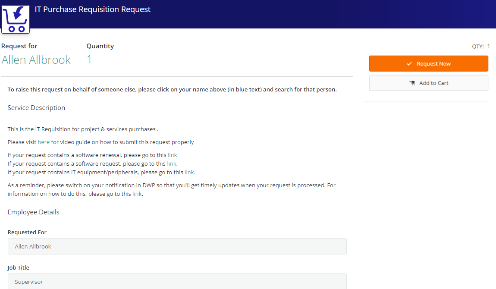

End users can add services to cart and request them later or click**Request Now**to immediately start the system process to resolve their request.

For more information, see[Submitting-service-requests](https://docs.bmc.com/xwiki/bin/view/Service-Management/Employee-Digital-Workplace/BMC-Helix-Digital-Workplace/dwp254/Using-BMC-Helix-Digital-Workplace-to-request-services/Submitting-service-requests/)

### Unified service catalog

DWP Catalogis a single pane of glass for end users to find the following self-service resources:

* Knowledge articles
* Services delivered internally or by third-party vendors
* IT requests
* Context services such as location services

For more information, see[DWP-Catalog](https://docs.bmc.com/xwiki/bin/view/Service-Management/Employee-Digital-Workplace/BMC-Helix-Digital-Workplace/dwp254/Getting-started/Key-concepts/BMC-Helix-Digital-Workplace-Catalog/)

The following image is an example of a unified service catalog:


## Learn more

The documentation helps both new and experienced users implement and use this product. In the documentation, the following icons distinguish the capabilities for DWP and External users:

—**DWP[license features](https://docs.bmc.com/xwiki/bin/view/Service-Management/Employee-Digital-Workplace/BMC-Helix-Digital-Workplace/dwp254/Planning/License-types-and-features/)**

—**DWP External**users[license features](https://docs.bmc.com/xwiki/bin/view/Service-Management/Employee-Digital-Workplace/BMC-Helix-Digital-Workplace/dwp254/Planning/License-types-and-features/)

Based on your role, the following sections of the documentation are recommended:

| Role<br> | Documentation sections<br> |
| --- | --- |
| DWP administrators<br> | * [Planning](https://docs.bmc.com/xwiki/bin/view/Service-Management/Employee-Digital-Workplace/BMC-Helix-Digital-Workplace/dwp254/Planning/) * [Integrating](https://docs.bmc.com/xwiki/bin/view/Service-Management/Employee-Digital-Workplace/BMC-Helix-Digital-Workplace/dwp254/Integrating/)  * [Using-DWP-to-request-services](https://docs.bmc.com/xwiki/bin/view/Service-Management/Employee-Digital-Workplace/BMC-Helix-Digital-Workplace/dwp254/Using-BMC-Helix-Digital-Workplace-to-request-services/) * [Administering-DWP](https://docs.bmc.com/xwiki/bin/view/Service-Management/Employee-Digital-Workplace/BMC-Helix-Digital-Workplace/dwp254/Administering/Administering-BMC-Helix-Digital-Workplace/) |
| Catalog administrators<br> | * [Creating-and-managing-the-service-catalog](https://docs.bmc.com/xwiki/bin/view/Service-Management/Employee-Digital-Workplace/BMC-Helix-Digital-Workplace/dwp254/Creating-and-managing-the-service-catalog/) * [Connecting-your-catalog-to-external-systems](https://docs.bmc.com/xwiki/bin/view/Service-Management/Employee-Digital-Workplace/BMC-Helix-Digital-Workplace/dwp254/Creating-and-managing-the-service-catalog/Connecting-your-catalog-to-external-systems/) * [Administering-DWP-Catalog](https://docs.bmc.com/xwiki/bin/view/Service-Management/Employee-Digital-Workplace/BMC-Helix-Digital-Workplace/dwp254/Administering/Administering-BMC-Helix-Digital-Workplace-Catalog/) |

---

## <a id="getting-starteduse-casesmd"></a>Getting-Started/Use-Cases.md

Consult the following use cases to learn how to achieve value with DWP:

Related topics

[Key-concepts](https://docs.bmc.com/xwiki/bin/view/Service-Management/Employee-Digital-Workplace/BMC-Helix-Digital-Workplace/dwp254/Getting-started/Key-concepts/)

[Getting-started](https://docs.bmc.com/xwiki/bin/view/Service-Management/Employee-Digital-Workplace/BMC-Helix-Digital-Workplace/dwp254/Getting-started/)

| Use case<br> | Business value<br> | User<br> | Products used<br> |
| --- | --- | --- | --- |
| [Providing-self-help-resources-to-your-end-users](https://docs.bmc.com/xwiki/bin/view/Service-Management/Employee-Digital-Workplace/BMC-Helix-Digital-Workplace/dwp254/Getting-started/Use-cases/Providing-self-help-resources-to-your-end-users/)<br> | End users resolve their issues on their own by referring to knowledge articles, online technical documentation, videos, tutorials, and so on.<br> | * Administrator * End user | DWP<br> |
| [Providing-a-unified-service-catalog](https://docs.bmc.com/xwiki/bin/view/Service-Management/Employee-Digital-Workplace/BMC-Helix-Digital-Workplace/dwp254/Getting-started/Use-cases/Providing-a-unified-service-catalog/)<br> | End users can access a single catalog to submit service requests related to different departments, such as HR and IT.<br> | * Administrator * Catalog administrator * HR agent * End user | * DWP * Business Workflows |
| [Access-from-anywhere-anytime-on-any-device](https://docs.bmc.com/xwiki/bin/view/Service-Management/Employee-Digital-Workplace/BMC-Helix-Digital-Workplace/dwp254/Getting-started/Use-cases/Access-from-anywhere-anytime-on-any-device/)<br> | End users can access DWP from a device of their choice. If you use it for a conversational experience, your end users can also request services and check the knowledge articles from different chat channels such as Microsoft Teams.<br> | * Administrator * End user | DWP<br> |
| [Enabling-end-users-to-work-on-To-dos](https://docs.bmc.com/xwiki/bin/view/Service-Management/Employee-Digital-Workplace/BMC-Helix-Digital-Workplace/dwp254/Getting-started/Use-cases/Enabling-end-users-to-work-on-To-dos/)<br> | End users work on single tasks fromBusiness Workflowsthat are assigned to them by managers or team leaders.They save time by viewing and completing their To-dos without moving away from the end-user console.<br> | * Case Business Analyst * DWPadministrator * Case agent * End user | * DWP * Business Workflows |
| [Generating-AI-retrieved-answers-for-end-users-through-HelixGPT](https://docs.bmc.com/xwiki/bin/view/Service-Management/Employee-Digital-Workplace/BMC-Helix-Digital-Workplace/dwp254/Getting-started/Use-cases/Generating-AI-retrieved-answers-for-end-users-through-BMC-HelixGPT/)<br> | End users get targeted answers to their queries related to service requests, approvals, or from the referenced knowledge articles by leveraging HelixGPT.<br> | * DWPadministrator * End user | * DWP * IS |
| [Leveraging-knowledge-from-HKM](https://docs.bmc.com/xwiki/bin/view/Service-Management/Employee-Digital-Workplace/BMC-Helix-Digital-Workplace/dwp254/Getting-started/Use-cases/Leveraging-knowledge-from-BMC-Helix-Knowledge-Management-by-ComAround/)<br> | End users can find articles fromHKM.<br> | * Administrator * End user | * IS * DWP * HKM |
| [Automating-service-requests](https://docs.bmc.com/xwiki/bin/view/Service-Management/Employee-Digital-Workplace/BMC-Helix-Digital-Workplace/dwp254/Getting-started/Use-cases/Automating-service-requests/)<br> | Automate routine and repetitive tasks so that your service agents can focus on strategic initiatives and unique requests that need manual intervention.<br> | * Administrator * End user * Service agent | * DWP * Other applications and third-party tools |

---

## <a id="getting-starteduse-casesaccess-from-anywhere,-anytime,-on-any-devicemd"></a>Getting-Started/Use-Cases/Access-From-Anywhere,-Anytime,-On-Any-Device.md

Employees can access DWP on their preferred devices from any location at any time. They can easily request services and access information through various channels, including web browsers, Slack, SMS, Microsoft Teams, orVirtual Agent. The application is designed to be accessible across multiple devices, including desktops, tablets, and mobile devices, ensuring a consistent user experience regardless of the location and the communication channel.

Related topics

[Using-DWP-to-request-services](https://docs.bmc.com/xwiki/bin/view/Service-Management/Employee-Digital-Workplace/BMC-Helix-Digital-Workplace/dwp254/Using-BMC-Helix-Digital-Workplace-to-request-services/)


The benefits include:

* Enhanced mobility and accessibility**:**Accessing from any place or device gives users with mobility and accessibility, ensuring a constant connection to DWP.
* Device independence: Users can seamlessly access the application across a range of devices, including laptops, smartphones, and tablets.
* Location independence: Users can connect to the application from any location, whether in the office, at home, or on the go.
* Multi-channel support: The application is available through various channels, such as email, phone, chat, and self-service portals, allowing users to effortlessly switch between them. Users have an uninterrupted connection with the application, even when transitioning between communication channels.
* Enhanced supportability: Users can seamlessly switch between channels without losing the context of their interaction. They can converse withVirtual Agentwithin the application and effortlessly transition from a bot to a live agent for enhanced support.

Scenario 1: Omnichannel engagement

Scenario

Before a campaign launch, Britney, the marketing manager, realizes that the analytics tool is not functioning correctly. She consults with HelixGPT inDWPfor help; however, the suggestions do not fulfill her needs. HelixGPT offers her the option to chat with a live agent or raise a request. She submits a service request and simultaneously escalates the issue through the chatbot. The IT team quickly acknowledges her request, provides a potential workaround and resolves the issue. Britney interacted seamlessly with IT support through various integrated channels.

## Scenario 2:Road warrior

Scenario

Joe is travelling for the first time to the Boston office. At the airport, he wonders if his employee badge will work there. Joe opensDWPon his mobile phone. After consulting with HelixGPT, he is given the option to submit a request to get access to the office added to his existing card, which he accepts. In Boston, Joe receives a notification that his request has been resolved. At the office, he swipes his badge and lets himself in.

## Scenario 3:Self-service from WhatsApp

The following scenario applies to[DWP](https://docs.bmc.com/xwiki/bin/view/Service-Management/Employee-Digital-Workplace/BMC-Helix-Digital-Workplace/dwp254/Planning/License-types-and-features/).

Scenario

Mary spends much of her day on WhatsApp, responding to queries from the team she supports. She needs WiFi access for a visiting customer, so she consults HelixGPT on WhatsApp and says, "Request guest WiFi." She answers a few questions and soon gets credentials she can give the visiting customer. That evening,Mary has problems connecting to the VPN from home. She again consults HelixGPT on WhatsApp and says, "Cannot connect to VPN." HelixGPT generates an answer and proposes self-help resolution steps based on knowledge articles in the knowledge base. She follows the steps and connects to the VPN.

## Access from any device

As an administrator, you can make DWP available to your users via desktop and mobile devices (Apple iOS and Google Android). On mobile devices, you can access DWP by using the same URL you use on the web. Neither Android nor iOS mobile devices require any special app.

However, iOS users have to download the iOS wrapper app from the Apple App Store to use push notifications and QR code scans.The minimum iOS version required for DWP is iOS 15. This requirement applies to installing the wrapper app and accessing the application via the mobile browser. You can also distribute the wrapper app to iOS devices within your organization through your Mobile Device Management (MDM) solution. You require the following MDM keys stored in the user default settings:

* com..configuration.managed.myit-server
* com..configuration.managed.myit-port


The process described in[Rebranding-DWP](https://docs.bmc.com/xwiki/bin/view/Service-Management/Employee-Digital-Workplace/BMC-Helix-Digital-Workplace/dwp254/Administering/Administering-BMC-Helix-Digital-Workplace/Customizing-and-rebranding-the-BMC-Helix-Digital-Workplace-user-interface/Rebranding-BMC-Helix-Digital-Workplace/)applies the branding changes to all desktop and mobile users. Remember that the Apple iOS wrapper app or its name cannot be rebranded on iOS devices. However, you can rebrand the app's content by using the rebranding functionality in the Admin console. This rebranding will appear the same on iOS devices as it does on Android devices and desktop web browsers.

You need to configureVirtual Agentor a chatbot forDWP to enable interaction over various user communication channels such as Slack, Microsoft Teams, SMS, and WhatsApp.For more information, see[Integrating-DWP-Catalog-with-Virtual-Agent](https://docs.bmc.com/xwiki/bin/create/Service-Management/Employee-Digital-Workplace/BMC-Helix-Digital-Workplace/dwp254/Integrating/Integrating-BMC-Helix-Digital-Workplace-Catalog-with-BMC-Helix-Virtual-Agent/WebHome?parent=Service-Management.Employee-Digital-Workplace.BMC-Helix-Digital-Workplace.dwp254.Getting-started.Use-cases.Access-from-anywhere-anytime-on-any-device.WebHome). See also[Configuring a chatbot to work with a communication channel](https://docs.bmc.com/xwiki/bin/view/Service-Management/Employee-Digital-Workplace/BMC-Helix-Virtual-Agent/hva251/Administering/Configuring-BMC-Helix-Virtual-Agent-with-IBM-Watson-Assistant/Configuring-a-chatbot-to-work-with-a-communication-channel/).

---

## <a id="getting-starteduse-casesautomating-service-requestsmd"></a>Getting-Started/Use-Cases/Automating-Service-Requests.md

Automating routine and repetitive tasks increases the efficiency of your service desk because it frees up your service agents to focus on strategic initiatives and unique requests that need manual intervention. Service automationreduces the risk of human error,decreases resolution time, brings efficiency, ensures security and compliance, reduces administrative burden, and improves user experience.Password resets, software provisioning requests,access management, and employee onboarding requests are a few examples of tasks that can be automated.

## Automated service creation with the Service Catalog Curator AI agent

As a catalog administrator, use Service Catalog Curator, an AI agent powered by HelixGPT, to automate the catalog service creation process. Enter prompts and necessary inputs for the service you want to create, review the summary, make real-time edits, and get the service automatically created in Draft state. This AI tool empowers catalog administrators by providing a solid foundation for generating catalog services, saving time and manual effort. For more information, see[Leveraging Service Catalog Curator for creating services](https://docs.bmc.com/xwiki/bin/view/Service-Management/Employee-Digital-Workplace/BMC-Helix-Digital-Workplace/dwp254/Creating-and-managing-the-service-catalog/Leveraging-Service-Catalog-Curator-for-creating-services/).

After the catalog service is created, you can automate the catalog service tasks. For more information, refer to the following documentation.

## Typical request fulfillment automation process

You can use an automation tool such as Intelligent Automation or any third-party tool to automate manual tasks involved in request fulfillment.

The following image illustrates the steps in a request fulfillment automation workflow:

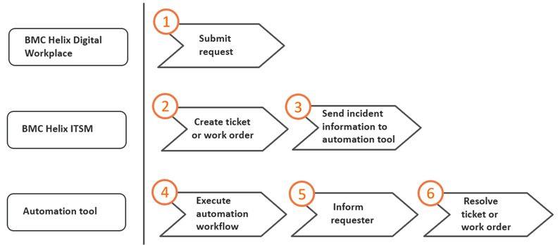

An automated fulfillment workflow includes the following steps:

1. A user submits a request in DWP.
2. The fulfillment workflow creates a work order or a ticket inITSM.
3. ITSMsends the incident information to the automation tool.
4. The automation workflow in the tool performs the steps to fulfill the work order.
5. The tool informs the user.
6. It updates the work order or ticket and resolves it.

Related topics

[Automating Service Management and Operations Management tasks](https://docs.bmc.com/xwiki/bin/view/Service-Management/IT-Service-Management/BMC-Helix-ITSM/itsm251/Getting-started/Use-cases/Automating-Service-Management-and-Operations-Management-tasks/)

[Leveraging popular service examples to optimize service configurations and enhance user experience](https://docs.bmc.com/xwiki/bin/view/Service-Management/Employee-Digital-Workplace/BMC-Helix-Digital-Workplace/dwp254/Creating-and-managing-the-service-catalog/Leveraging-popular-service-examples-to-optimize-service-configurations-and-enhance-user-experience/)

## Service request categories for automation

Service requests are organized into different types depending on the nature of the requests, the department responsible for handling the request, and the work required to resolve them.

The following section lists service request categories that can be automated by using applications and third-party tools.

| **Categories**<br> | **Description**<br> | **Services**<br> | **Industries**<br> |
| --- | --- | --- | --- |
| [**Access Management**](https://docs.bmc.com/xwiki/bin/view/Service-Management/Employee-Digital-Workplace/BMC-Helix-Digital-Workplace/dwp254/Creating-and-managing-the-service-catalog/Building-service-catalogs/Leveraging-popular-service-examples-to-optimize-service-configurations-and-enhance-user-experience/#accessmanagement)<br> | Services that control, grant, or revoke access to systems, applications, data, or physical locations. Includes requests for elevated, temporary, or emergency access, as well as group and user permissions management. | * General Access Request * Request Admin or Elevated Access Helix ITSM and its modules. * Temporary Data Center Access Card * Manage Support Group Access * Access FAS User Account * Access Provisioning Status Check * Access User Entitlements Data * Whitelist Applications Request * Web Browsing/Proxy/Off-Network Exemption Requests * Bulk Removal for Office 365 Access * Manage Application Access * Request Virtual Desktop Access * Access Unix Account Details * Access User Details in AD * Access NIS NetGroups * Access Unix Group Information/Membership * Request Unix Group Access * Request Report Export Access * Request GL4 Codes * Request Database Access * Manage Conference Bridge Access * Request folder or File Access * Request Data Center Site Access * Request dataset access * Enable Mobility Platform Access | * Information Technology * Telecommunications * Data Centers * Security & Facilities * Human Resources * Finance (for access to financial systems) |
| [**Identity & User Management**](https://docs.bmc.com/xwiki/bin/view/Service-Management/Employee-Digital-Workplace/BMC-Helix-Digital-Workplace/dwp254/Creating-and-managing-the-service-catalog/Building-service-catalogs/Leveraging-popular-service-examples-to-optimize-service-configurations-and-enhance-user-experience/#IdUser)<br> | Covers the creation, modification, validation, and management of user identities and accounts across IT systems (e.g., Active Directory, Unix, FAS). Includes user profile updates, group memberships, and identity verification, and also database account setup and storage management (SAN/NAS).<br> | * Manage Microsoft Teams Access * Create a UNIX Account * Modify Unix Account * Validate Unix User Existence * View Exchange Group Membership * Database Account Setup * Find Default Approver for Requests * Manage an AD group * Manage AD group membership and properties * Add or remove AD group to another * Manage user in AD * Validate AD user and AD group * Add or remove machine to an AD group * Retrieve User Name from Identifier * Validate Active Directory User * Convert AD CN/DN to Name | * Information Technology * Human Resources * Security * Any industry with regulated user access (e.g., Banking, Healthcare)  * Data Management * Database Administration * Any data-intensive industry |
| [**Asset & Device Management**](https://docs.bmc.com/xwiki/bin/view/Service-Management/Employee-Digital-Workplace/BMC-Helix-Digital-Workplace/dwp254/Creating-and-managing-the-service-catalog/Building-service-catalogs/Leveraging-popular-service-examples-to-optimize-service-configurations-and-enhance-user-experience/#Asset)<br> | Encompasses the lifecycle management of IT and physical assets, including creation, modification, disposal, registration, and decommissioning of devices, servers, and other hardware. | * Create or Update IT Assets * Request Asset Disposal * Update Data Center Asset Model * Register Device with Workspace One * Decommission an MVD Device * Add/Remove Servers to/from SCCM Collection * Submit Asset Investment Request | * Information Technology * Data Centers * Corporate Services * Finance (for asset investment) * Facilities Management |
| [**Data & File Management**](https://docs.bmc.com/xwiki/bin/view/Service-Management/Employee-Digital-Workplace/BMC-Helix-Digital-Workplace/dwp254/Creating-and-managing-the-service-catalog/Building-service-catalogs/Leveraging-popular-service-examples-to-optimize-service-configurations-and-enhance-user-experience/#Data)<br> | Services related to the storage, retrieval, sharing, and organization of files and data. Includes shared folders, file permissions, archiving, quotas, and data retrieval from archives or virtual desktops. | * Set Folder Quota * Validate Folder Availability * Manage Archive Requests * Request Archived Information * Request Information on Archive Services * Report Indexing Errors * Manage Directory Audit Log Attributes * Request for backup information<br> * Update product category mapping<br> * Foundation data management<br> * Request drive usage exemption<br> * Manual data or document classification request * Manage data rooms | * Information Technology * Data Management * Legal Services (for eDiscovery, archiving) * Compliance * Any data-driven industry (e.g., Healthcare, Finance) |
| [**Collaboration & Communication Tools**](https://docs.bmc.com/xwiki/bin/view/Service-Management/Employee-Digital-Workplace/BMC-Helix-Digital-Workplace/dwp254/Creating-and-managing-the-service-catalog/Building-service-catalogs/Leveraging-popular-service-examples-to-optimize-service-configurations-and-enhance-user-experience/#Collab)<br> | Facilitates teamwork and communication through tools like email, chat, conferencing, collaboration sites, and groupware (e.g., Teams, Office 365, SharePoint, IM platforms). | * Secure Collaboration Site Request * Refinitiv IM Account Management * Manage Email Distribution Lists * Add Domain to Email System * Email Delivery Investigation * Create/Manage Office 365 Groups * Send Email Notification via DCM * Request Data Center Email Template * Search Mailboxes for Emails | * Information Technology * Telecommunications * Corporate Services * Professional Services * Any knowledge-based or distributed workforce industry |
| [**Compliance, Legal & Security**](https://docs.bmc.com/xwiki/bin/view/Service-Management/Employee-Digital-Workplace/BMC-Helix-Digital-Workplace/dwp254/Creating-and-managing-the-service-catalog/Building-service-catalogs/Leveraging-popular-service-examples-to-optimize-service-configurations-and-enhance-user-experience/#Legal)<br> | Ensures adherence to legal, regulatory, and internal security requirements. Includes policy acknowledgments, legal holds, compliance audits, security exemptions, and management of sensitive or regulated data.<br>Focuses on the secure handling, classification, archiving, and disposal of sensitive data and media, ensuring privacy and regulatory compliance.<br> | * Acknowledge Acceptable Use Policy * Enterprise Vault Compliance Support * Legal Hold for Data Preservation * Compliance/Legal Requests (eDiscovery, Contract Extension, etc.) * Hide Distribution List in GAL * Server VirusScan Exemption Request * McAfee ePolicy Orchestrator Request * Request Database Log Activity * Manual Classification Request * Submit FMG QRM Request or Issue * Report Hardware Issues (if compliance-related) * Report Patch Release Issues * Report Helix Module Issues * Request Media Disposal Service * Add Data to WORM Archive * Request Encryption Bypass * Request Drive Usage Exemption | * Legal Services * Compliance * Information Technology * Finance * Data Security * Any regulated industry (e.g., Banking, Healthcare, Insurance) * Any industry handling sensitive data |
| [**IT Operations & Support**](https://docs.bmc.com/xwiki/bin/view/Service-Management/Employee-Digital-Workplace/BMC-Helix-Digital-Workplace/dwp254/Creating-and-managing-the-service-catalog/Building-service-catalogs/Leveraging-popular-service-examples-to-optimize-service-configurations-and-enhance-user-experience/#ITOPs)<br> | General IT support and operational services, such as incident reporting, technical assistance, system troubleshooting, and ITSM platform support. | * Technical Service Operations Requests * Report IT System Time Issues * Report Hardware Issues * Request Remote Hands Support * Request Port Reset * Retrieve Network Account Password * Manage IT Support Groups | * Information Technology * Data Centers * Corporate Services * Any industry with internal IT support |
| [**Infrastructure & Network Management**](https://docs.bmc.com/xwiki/bin/view/Service-Management/Employee-Digital-Workplace/BMC-Helix-Digital-Workplace/dwp254/Creating-and-managing-the-service-catalog/Building-service-catalogs/Leveraging-popular-service-examples-to-optimize-service-configurations-and-enhance-user-experience/#Infra)<br> | Covers the setup, configuration, maintenance, and optimization of IT infrastructure and networks, including data centers, cabling, network devices, DNS, firewalls, and connectivity. | * Request Data Center Cabling * Data Center Delivery Request * Manage Data Center Site Info * DCM Workflow Management Request * Manage Directory Audit Log Attributes * Manage NAS/SAN Storage Requests * Manage DNS and Domain Requests * Network Load Balancer Setup * Network Switch Configuration * Request a Virtual Network Setup * Update Network PAC File * Report PAC File Network Issue * Request Proxy Bypass Support * Firewall Rule Configuration/Change/Exemption * Report Firewall Connectivity Issue * Network Optimization Request * Custom Data Center Service Request | * Information Technology * Data Centers * Telecommunications * Network Management * Any large enterprise with complex infrastructure |
| [**HR & Employee Management**](https://docs.bmc.com/xwiki/bin/view/Service-Management/Employee-Digital-Workplace/BMC-Helix-Digital-Workplace/dwp254/Creating-and-managing-the-service-catalog/Building-service-catalogs/Leveraging-popular-service-examples-to-optimize-service-configurations-and-enhance-user-experience/#HR)<br> | Services for managing employee records, job titles, organizational structure, onboarding/offboarding, work arrangements, and HR-related requests. | * Access Staff Records * Alternate Work Arrangement * Update Employee Designation * Job Category Transition Request * Visitor Induction Service * Access Job Family Information * Access Reporting Line Information * Retrieve Functional Job Title * Update Your Functional Title | * Human Resources * Corporate Services * Any industry with employee management needs |
| [**Project & Workflow Management**](https://docs.bmc.com/xwiki/bin/view/Service-Management/Employee-Digital-Workplace/BMC-Helix-Digital-Workplace/dwp254/Creating-and-managing-the-service-catalog/Building-service-catalogs/Leveraging-popular-service-examples-to-optimize-service-configurations-and-enhance-user-experience/#Project)<br> | Enables project support, workflow automation, approval mapping, queue management, and task tracking (including Jira and other project management tools). | * Adhoc Project Support * Queue Management Request * VPN lockdown exemption request * Approval Mapping for Change Records * Manage Assignment Config Mapping * Request ITSM functionality enhancement * Request Helix ITSM module * Report non-prod ITSM issue * Report patch release issues * Report Helix module issues * Submit a Jira Request Ticket * Create a Jira Ticket or check the ticket Status * Add servers to SCCM collection * Validate Unix user existence * Add Java site exceptions * DCM workflow management request | * Consulting * Project Management * Information Technology * Any industry with structured project delivery |
| [**Procurement & Facility Services**](https://docs.bmc.com/xwiki/bin/view/Service-Management/Employee-Digital-Workplace/BMC-Helix-Digital-Workplace/dwp254/Creating-and-managing-the-service-catalog/Building-service-catalogs/Leveraging-popular-service-examples-to-optimize-service-configurations-and-enhance-user-experience/#Procure)<br> | Handles requests for procurement of devices, mobile connections, facility customization, and related approvals for physical or digital resources. | * Order a Mobile Connection * Order an iPhone or iPad * Customize Meeting Room Setup | * Procurement * Facilities Management * Corporate Services * Technology (for device procurement) |
| [**Change & Issue Management**](https://docs.bmc.com/xwiki/bin/view/Service-Management/Employee-Digital-Workplace/BMC-Helix-Digital-Workplace/dwp254/Creating-and-managing-the-service-catalog/Building-service-catalogs/Leveraging-popular-service-examples-to-optimize-service-configurations-and-enhance-user-experience/#Issue)<br> | Manages changes to IT systems, tracks issues, and supports the resolution of incidents, including patch management, module issues, and change requests. | * Report Patch Release Issues * Report Helix Module Issues * Report Non-Prod ITSM Issue * Change MVD Performance Tier * Modify Firewall Rule Reversal Date | * Information Technology * Data Centers * Network Management * Any industry with formal change control |
| [**Custom & Miscellaneous Services**](https://docs.bmc.com/xwiki/bin/view/Service-Management/Employee-Digital-Workplace/BMC-Helix-Digital-Workplace/dwp254/Creating-and-managing-the-service-catalog/Building-service-catalogs/Leveraging-popular-service-examples-to-optimize-service-configurations-and-enhance-user-experience/#Misc)<br> | Covers unique, non-standard, or uncategorized service requests that do not fit into any other categories, including custom solutions and undefined services. | * Service Not Specified (for uncategorized/other requests) * Adhoc Project Support * Adhoc Trade Support Query * Post-Trade Processing Support | * All industries (for any unique or uncategorized requests) |

---

## <a id="getting-starteduse-casesenabling-end-users-to-work-on-to-dosmd"></a>Getting-Started/Use-Cases/Enabling-End-Users-To-Work-On-To-Dos.md

The end-user console is a single pane of glass for end users to find knowledge articles, submit service requests, view the status of their requests, and work on action items assigned to them by managers or team leaders.

Single tasks fromBusiness Workflowsthat are assigned to end users by managers or team leaders are called To-dos. To-dos are actions that end users must complete to achieve a common, bigger goal. End users can save time by viewing and completing their To-doswithout moving away from the end user console.

The benefits include:

* Managers or team leaders can assign To-dos to their reportees and colleagues.
* Managers or team leaders can assign a form or questionnaires that require completion by assignees.
* Assignees receive notifications when To-dos are assigned, so that they do not miss them.
* Assignees receive proactive reminders via email as the due date approaches, minimizing the risk of missed deadlines.
* Assignees can mark a To-do as complete only after they have answered all the mandatory questions, if any.
* Assignees can save and close the To-dos questionnaire at any time and revisit it later to complete the task.
* Assigners can monitor the progress of assigned To-dos by tracking when end users mark them as complete.
* Assigners and assignees can communicate with each other via comments to the To-dos.

Required license

[](https://docs.bmc.com/xwiki/bin/view/Service-Management/Employee-Digital-Workplace/BMC-Helix-Digital-Workplace/dwp254/Planning/License-types-and-features/)DWP and

DWP External users[licenses](https://docs.bmc.com/xwiki/bin/view/Service-Management/Employee-Digital-Workplace/BMC-Helix-Digital-Workplace/dwp254/Planning/License-types-and-features/)

Related topic

[Use-cases](https://docs.bmc.com/xwiki/bin/view/Service-Management/Employee-Digital-Workplace/BMC-Helix-Digital-Workplace/dwp254/Getting-started/Use-cases/)

## Scenario: Viewing and completing end user assignments by using To-dos

Scenario

Sarah is a new employee being onboarded to Apex Global. She is a self-registered, external user ofDWP. Bill is the hiring manager who assigns To-dosto her as part of her onboarding process.

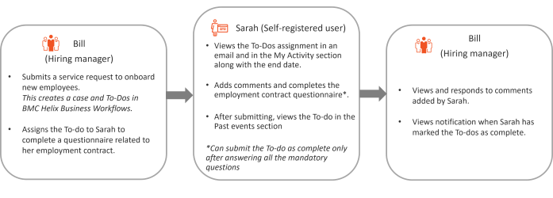

After submitting a To-do, the end user in DWP*cannot*reopen the To-do. Agents inBusiness Workflowscan reopen a To-do and reassign it to the end user.

## Scenario: Displaying To-dos in a studio page

As an administrator, you can add and configure the To-Dos event type in studio pages.

Scenario

Apex Global uses the studio capability to create a custom home page for the end users. Allen, the administrator, wants to make sure that Britney, an end user, can view the To-dos assigned to her.

* Allen configures the To-do event type in the studio page and makes the studio page available for Britney.
* Allen enables the To-do capability for end users.
* Bill, who is Britney's manager, assigns To-dos to Britney to complete two mandatory training sessions and adds the due date.
* Britney views the To-dos and marks them complete after taking the mandatory trainings.
* Bill sees that Britney has completed the To-dos.

## Scenario: Searching for To-dos in HelixGPT

After an administrator has configured HelixGPTwith DWP, end users can search for To-dos in HelixGPT*.*

Scenario

Britney is a new employee being onboarded to Apex Global. She was assigned the following To-dos as part of her onboarding process:

* Passport and visa documents
* Candidate photograph
* Educational documents

During her onboarding, Britney needs to focus on multiple different activities. So, she wants to make sure that she completes all her assigned To-dos on time. Instead of looking for each assigned To-do separately, she searches for*Show my current To-dos*in theHelixGPTchat bar to see the list of all her assignments.

For more information about searching for To-dos in HelixGPT, see[Using-Employee-Navigator-to-find-AI-generated-answers](https://docs.bmc.com/xwiki/bin/view/Service-Management/Employee-Digital-Workplace/BMC-Helix-Digital-Workplace/dwp254/Using-BMC-Helix-Digital-Workplace-to-request-services/Using-Employee-Navigator-to-find-AI-generated-answers/).

## Configuring the To-dos workflow

The following image shows the workflow of To-dos associated with a case inBusiness Workflowsand assigned to an end user in DWP:


| Product<br> | User<br> | Action<br> | Reference<br> |
| --- | --- | --- | --- |
| Business Workflows<br> | Case Business Analyst<br> | * Defines a new template for To-dos. * Defines a task flow for To-dos. | [To dos](https://docs.bmc.com/xwiki/bin/view/Service-Management/Enterprise-Service-Management/BMC-Helix-Business-Workflows/bwf251/Getting-started/Key-concepts/Task-Management/To-dos/)<br> |
| DWP Catalog<br> | Case Business Analyst with catalog administrator permissions<br> | * Creates the Task type action to display the questionnaire for the end user (To-do assignee). * Creates a workflow to update the To-dos status and display the end user's answers inBusiness Workflows. * Creates a To-do questionnaire, which is presented to the end users when the To-dos is assigned. | * [To create a service action](https://docs.bmc.com/xwiki/bin/view/Service-Management/Employee-Digital-Workplace/BMC-Helix-Digital-Workplace/dwp254/Creating-and-managing-the-service-catalog/Building-service-catalogs/Managing-service-actions/#Managingserviceactions-Createserviceaction) * [Designing-a-workflow-to-update-To-dos-in-Business-Workflows](https://docs.bmc.com/xwiki/bin/view/Service-Management/Employee-Digital-Workplace/BMC-Helix-Digital-Workplace/dwp254/Creating-and-managing-the-service-catalog/Building-service-catalogs/Workflows-for-service-fulfillment/Designing-a-workflow-to-update-To-dos-in-BMC-Helix-Business-Workflows/) * [Creating-questionnaires-for-To-dos](https://docs.bmc.com/xwiki/bin/view/Service-Management/Employee-Digital-Workplace/BMC-Helix-Digital-Workplace/dwp254/Creating-and-managing-the-service-catalog/Building-service-catalogs/Creating-service-questionnaires/Creating-questionnaires-for-To-dos/) |
| DWP<br> | Administrator<br> | * Enables To-dos for end users and specify whether you want to display the priority of To-Dos. * *(Optional)*If you want to display To-dos for end users in a custom page,configures the To-do event in the relevant studio page. Ensure that you make the studio page available to end users and add it to the navigation menu. | * [Enabling-end-user-features](https://docs.bmc.com/xwiki/bin/view/Service-Management/Employee-Digital-Workplace/BMC-Helix-Digital-Workplace/dwp254/Administering/Administering-BMC-Helix-Digital-Workplace/Managing-end-user-features/Enabling-end-user-features/) * [Creating-pages-in-the-studio](https://docs.bmc.com/xwiki/bin/view/Service-Management/Employee-Digital-Workplace/BMC-Helix-Digital-Workplace/dwp254/Administering/Administering-BMC-Helix-Digital-Workplace/Creating-workplaces-for-your-lines-of-business/Creating-pages-in-the-studio/) * [Making-studio-pages-available-to-end-users](https://docs.bmc.com/xwiki/bin/view/Service-Management/Employee-Digital-Workplace/BMC-Helix-Digital-Workplace/dwp254/Administering/Administering-BMC-Helix-Digital-Workplace/Creating-workplaces-for-your-lines-of-business/Making-studio-pages-available-to-end-users/) |
| Business Workflows<br> | Case Agent<br> | * Associates the appropriate To-do template with the case. * Adds To-dos to the task flow. | [Updating tasks and tracking progress](https://docs.bmc.com/xwiki/bin/view/Service-Management/Enterprise-Service-Management/BMC-Helix-Business-Workflows/bwf251/Working-on-cases-and-tasks/Creating-and-managing-tasks/Updating-tasks-and-tracking-progress/)<br> |
| DWP<br> | End user<br> | * Works on and submits the assigned To-dos. | [Working-with-To-dos](https://docs.bmc.com/xwiki/bin/view/Service-Management/Employee-Digital-Workplace/BMC-Helix-Digital-Workplace/dwp254/Using-BMC-Helix-Digital-Workplace-to-request-services/Working-with-To-dos/)<br> |

---

## <a id="getting-starteduse-casesgenerating-ai-retrieved-answers-for-end-users-thromd"></a>Getting-Started/Use-Cases/Generating-Ai-Retrieved-Answers-For-End-Users-Thro.md

Leverage Employee Navigator powered by HelixGPTto deliver targeted answers for end-user queries related to service requests, approvals, to-dos, or from the referenced knowledge articles. End users can access the Employee Navigator side panel on all types of devices, such as desktops, tablets, and mobile phones.

Required license

[Service Management service](https://docs.bmc.com/xwiki/bin/view/Helix-Common-Services/Other/BMC-Helix-Subscriber-Information/helixsubscriber/BMC-Helix-services/BMC-Helix-Service-Management-service/)HelixGPT chat bar

Related topics

[Using-Employee-Navigator-to-find-AI-generated-answers](https://docs.bmc.com/xwiki/bin/view/Service-Management/Employee-Digital-Workplace/BMC-Helix-Digital-Workplace/dwp254/Using-BMC-Helix-Digital-Workplace-to-request-services/Using-Employee-Navigator-to-find-AI-generated-answers/)[HelixGPT architecture](https://docs.bmc.com/xwiki/bin/view/Service-Management/Employee-Digital-Workplace/BMC-HelixGPT/HelixGPT251/Getting-started/Key-concepts/BMC-HelixGPT-architecture/)

Configuring[Employee Navigator Supervisor agent](https://docs.bmc.com/xwiki/wiki/internal/view/Service-Management/Employee-Digital-Workplace/dwpMaster2/Administering/Administering-BMC-Helix-Digital-Workplace/Configuring-Employee-Navigator-Supervisor-agent/)

[Models in HelixGPT](https://docs.bmc.com/xwiki/bin/view/Service-Management/Employee-Digital-Workplace/BMC-HelixGPT/HelixGPT251/Getting-started/Key-concepts/Models-in-BMC-HelixGPT/)

## The benefits ofHelixGPTinclude:


Scenario: Configuring HelixGPT for generative AI retrieval of answers based on knowledge articles

Apex Global has their knowledge articles inHKMandITSM: Knowledge Management. Allen is an administrator at Apex Global and has enabled theHelixGPT capabilities for his end users.

Britney, the end user wants to install a VPN client on Mac, so she enters her query in the HelixGPT chat bar. A summary of the procedure for a Mac is provided along with the related knowledge article links.

While following the procedure, Britney encounters an error. She shares the screenshot of the error message in the HelixGPT chat bar. The system identifies the context and shares troubleshooting steps with her. After that, Britney is able to install the VPN client on her machine.

Scenario: Finding answers related to service requests or approvals

Britney is an end user who has submitted service requests for the following two items:

* IT peripherals—docking station and wireless mouse
* Access to the common SharePoint location

Britney goes on an urgent PTO for two days after submitting these requests. Upon her return, she doesn't see any updates on these requests. Instead of looking at these requests separately, she asks**Show my requests from past week**. She sees that these requests are in the Open state. She clicks the link of each request and adds a comment to the assigned agent requesting for an expedited closure of the request.

## Difference between search, chatbot, and generative AI retrieval of answers by usingBMC HelixGPT

The following table describes the difference between search, chatbot, and HelixGPT:

| Search<br> | Virtual Agent<br> | HelixGPT<br> |
| --- | --- | --- |
| When a user enters search keywords, the results (default up to 25) that are the closest match to the search text are displayed, irrespective of their source or type.<br> | When an end user enters a question,Virtual Agentunderstands the intent of the user and provides an answer based on the configured knowledge sources. The chatbot also asks questions required to submit a service request on behalf of the end user.<br> | When a user enters a question, the system understands the question and generates a summary of the relevant answers from all the available knowledge sources, which is presented as a human-like text response.<br>If configured, HelixGPT also offers to submit a default service request on behalf of the end user.<br> |
| Search engines index and retrieve data by using keyword-based indexing.<br> | The Catalog services are imported intoVirtual Agent, which are then provided as suggestions to the end users.<br> | Generative Pre-trained Transformer (GPT) uses large language models (LLMs) to understand the intent, context, and semantics of human language.<br> |
| In DWP, end users can use full-text search from the following areas of the end-user console:<br>  * Global search bar on the Catalog and My Activity pages. * Active and past events on the Catalog and My Activity pages. * Social section of the user preferences page. * Studio page, which has a search bar. | In DWP, end users can click the chatbot icon available on all screens to start interaction.<br>**Important:**You can enable only one self-help application - chatbot or HelixGPT for the end users.<br> | InDWP, end users access theEmployee Navigatorto ask questions from the following areas of the end-user console:<br>  * HelixGPTchat icon on all end-user screens. * Global search bar on the Catalog and My Activity pages. * Studio page (in the Search Bar components and the search block in the Content block component).  **Important:**You can enable only one self-help applicationVirtual Agentor HelixGPT for the end users.<br> |

## Capabilities available in Chatbot and HelixGPT

The following table describes the capabilities available in Chatbot and HelixGPT.

| Feature | Virtual Agent<br> | HelixGPT<br> |
| --- | --- | --- |
| Handoff when raising a request | Users can create requests, but earlier conversations might not be included. | Automatically submits a service request and includes the full chat transcript as an attachment. A summarized version of the conversation is sent as a comment.<br>This behavior is controlled by parameters that can be configured by administrators. For more information, see[To update the configuration parameters of a skill](https://docs.bmc.com/xwiki/bin/view/Service-Management/Employee-Digital-Workplace/BMC-Helix-Digital-Workplace/dwp254/Administering/Administering-BMC-Helix-Digital-Workplace/Configuring-BMC-HelixGPT-in-the-end-user-console-and-studio-pages/#Toupdatetheconfigurationparametersofaskill).<br>If your environment includes existing custom prompts created before the upgrade, you must manually add the following flags to those prompts after the upgrade to ensure proper functionality of raising a request via chat:<br>  * addTranscriptInServiceRequest * addChatSummaryInServiceRequest * serviceRequestSummarizerUser |
| Support agent escalation | In DWP, it supports manual escalation to a support agent.<br>The agent might not have full visibility into the earlier conversation context.<br> | Automatically shares the full chat transcript and a HelixGPT-generated summary with the support agents.<br> |

## Workflow to configure HelixGPT with DWP

The following image provides an overview of the workflow to configure HelixGPT with DWP:

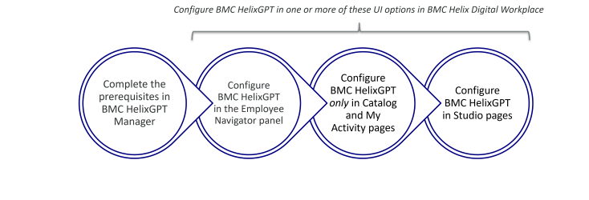

The following table provides the detailed description and references to complete the workflow:

| Task<br> | Action<br> | Description<br> | Reference<br> |
| --- | --- | --- | --- |
| 1<br> | Complete the prerequisites<br> | Complete the prerequisites such as deploying a Large Language Model (LLM) service from a supported vendor of your choice, get the API key and other config parameters.<br> | [Before you begin configuring HelixGPT in the end user console](https://docs.bmc.com/xwiki/bin/view/Service-Management/Employee-Digital-Workplace/BMC-Helix-Digital-Workplace/dwp254/Administering/Administering-BMC-Helix-Digital-Workplace/Configuring-BMC-HelixGPT-in-the-end-user-console-and-studio-pages/#ConfiguringBMCHelixGPTintheend-userconsoleandstudiopages-workflow_prereqs)<br> |
| 2<br> | Configure the**HelixGPT**powered Employee Navigator panel on all end user screens<br> | Specify the default Skill that you want to use with the HelixGPT panel.<br> | [To set a Skill for the Employee Navigator panel on all end-user screens](https://docs.bmc.com/xwiki/bin/view/Service-Management/Employee-Digital-Workplace/BMC-Helix-Digital-Workplace/dwp254/Administering/Administering-BMC-Helix-Digital-Workplace/Configuring-BMC-HelixGPT-in-the-end-user-console-and-studio-pages/#ConfiguringBMCHelixGPTintheend-userconsoleandstudiopages-Skill_employeenav)<br> |
| Configure HelixGPT in studio pages<br> | Specify the default Skill that you want to use with one or more studio pages.<br> | [To configure HelixGPT in a Studio page](https://docs.bmc.com/xwiki/bin/view/Service-Management/Employee-Digital-Workplace/BMC-Helix-Digital-Workplace/dwp254/Administering/Administering-BMC-Helix-Digital-Workplace/Configuring-BMC-HelixGPT-in-the-end-user-console-and-studio-pages/#ConfiguringBMCHelixGPTintheend-userconsoleandstudiopages-Workflow_configureBMCHelixGPTinStudio)<br> |
| Configure HelixGPT in the My Activity or Catalog pages<br> | Specify the default Skill that you want to use with HelixGPT chat bar in the My Activity and Catalog pages.<br> | [Configuring-HelixGPT-in-the-end-user-console-and-studio-pages](https://docs.bmc.com/xwiki/bin/view/Service-Management/Employee-Digital-Workplace/BMC-Helix-Digital-Workplace/dwp254/Administering/Administering-BMC-Helix-Digital-Workplace/Configuring-BMC-HelixGPT-in-the-end-user-console-and-studio-pages/)<br> |
|  | Configure the Employee Navigator Supervisor agent for better user experience | Configure the Employee Navigator Supervisor agent to implement these capabilities through an agentic AI approach to offer a more conversational and contextual experience. | Configuring the[Employee Navigator Supervisor agent](https://docs.bmc.com/xwiki/wiki/internal/view/Service-Management/Employee-Digital-Workplace/dwpMaster2/Administering/Administering-BMC-Helix-Digital-Workplace/Configuring-Employee-Navigator-Supervisor-agent/) |

## FAQ

<details class="confluence-expand-macro panel panel-default"><summary><span class="panel-title"><span class="title-text">What is generative AI answer retrieval by using HelixGPT</span></span></summary><div class="panel-body"><p>Generative AI answer retrieval is a process that uses large language models (LLM) to understand the meaning of text in the knowledge articles.</p><p>HelixGPT</p><p>uses this text to match the user queries and generates an answer in human-like natural language.</p></div></details><details class="confluence-expand-macro panel panel-default"><summary><span class="panel-title"><span class="title-text">How reliable are the answers from HelixGPT generative AI?</span></span></summary><div class="panel-body"><p><span>uses knowledge article content when</span><span>extracting answers. They do not come from the Internet or the large language model's (LLM) general knowledge, unless specifically configured.</span></p></div></details><details class="confluence-expand-macro panel panel-default"><summary><span class="panel-title"><span class="title-text">How is my data protected and security protocols applied HelixGPT?</span></span></summary><div class="panel-body"><p>You can choose to use one of the supported providers for generative AI<span>retrieval of answers. Depending on which model you choose, your data resides in that model and the security compliance of that model is applied.</span></p></div></details><details class="confluence-expand-macro panel panel-default"><summary><span class="panel-title"><span class="title-text">Which other use cases can be achieved with HelixGPT?</span></span></summary><div class="panel-body"><p>To learn more, visit<span class="wikiexternallink"><a href="https://www.bmc.com/it-solutions/helixgpt.html" rel="noopener noreferrer" target="_blank">Generative AI: The Next Wave of ServiceOps Intelligence</a></span>on .com.</p></div></details><details class="confluence-expand-macro panel panel-default"><summary><span class="panel-title"><span class="title-text">Why do some links provided with the HelixGPT answers do not open the knowledge articles?</span></span></summary><div class="panel-body"><p>Mostly likely because<span>the skill you are using does not have filters to limit the access to external articles, or to a certain company. To learn how to use search filters, see</span><span class="wikicreatelink"><a href="https://docs.bmc.com/xwiki/bin/create/HelixGPT/Defining%20search%20settings?parent=Service-Management.Employee-Digital-Workplace.BMC-Helix-Digital-Workplace.dwp254.Getting-started.Use-cases.Generating-AI-retrieved-answers-for-end-users-through-BMC-HelixGPT.WebHome" target="_blank">Defining search settings</a></span>in the HelixGPT documentation.</p></div></details>

For more frequently asked questions, see[FAQ in the HelixGPT documentation](https://docs.bmc.com/xwiki/bin/view/Service-Management/Employee-Digital-Workplace/BMC-HelixGPT/HelixGPT/FAQ/)

## Where to go from here

[Using-Employee-Navigator-to-find-AI-generated-answers](https://docs.bmc.com/xwiki/bin/view/Service-Management/Employee-Digital-Workplace/BMC-Helix-Digital-Workplace/dwp254/Using-BMC-Helix-Digital-Workplace-to-request-services/Using-Employee-Navigator-to-find-AI-generated-answers/)

---

## <a id="getting-starteduse-casesleveraging-knowledge-from-hkmmd"></a>Getting-Started/Use-Cases/Leveraging-Knowledge-From-Hkm.md

HKMis an Artificial Intelligence (AI)-powered and cloud-based knowledge management solution that offers a centralized way of working with knowledge. You can useHKMas a knowledge article source for DWP to boost your knowledge base with the numerous benefits thatHKMprovides.

You subscribe toHKMby purchasing the[Service Management Advanced license](https://docs.bmc.com/xwiki/bin/view/Helix-Common-Services/Other/BMC-Helix-Subscriber-Information/helixsubscriber/BMC-Helix-services/BMC-Helix-Service-Management-service/).HKM is also available to customers with entitlements in[Virtual Agent Basic](https://docs.bmc.com/xwiki/bin/view/Helix-Common-Services/Other/BMC-Helix-Subscriber-Information/helixsubscriber/BMC-Helix-services/BMC-Helix-Virtual-Agent-Basic-service/)or[Virtual Agent Advanced](https://docs.bmc.com/xwiki/bin/view/Helix-Common-Services/Other/BMC-Helix-Subscriber-Information/helixsubscriber/BMC-Helix-services/BMC-Helix-Virtual-Agent-Advanced-service/)subscriptions.

After you subscribe toHKM, as an administrator, you must configureHKMas a knowledge source for DWP. You must complete the common configuration tasks inIS, and then request , Inc. Support to enableHKMas the knowledge provider in DWP.

**Important**

HKMis a SaaS solution, and you can use it as a knowledge source in SaaS versions of DWP*only*.

ITSM: Knowledge ManagementandBusiness Workflowsare other knowledge sources that DWPsupports.For more information, see[Search-in-DWP](https://docs.bmc.com/xwiki/bin/view/Service-Management/Employee-Digital-Workplace/BMC-Helix-Digital-Workplace/dwp254/Getting-started/Key-concepts/Search-in-BMC-Helix-Digital-Workplace/).


For more information about the capability to submit service requests from the knowledge articles, see[Enabling-end-users-to-request-services-from-knowledge-articles](https://docs.bmc.com/xwiki/bin/view/Service-Management/Employee-Digital-Workplace/BMC-Helix-Digital-Workplace/dwp254/Administering/Administering-BMC-Helix-Digital-Workplace-Catalog/Enabling-end-users-to-request-services-from-knowledge-articles/)​​​​.

## Workflow to configureHKMas a knowledge provider for DWP

To start usingHKMas the knowledge source for DWP, complete the following tasks:


| Task<br> | Product<br> | Role<br> | Action<br> | Reference<br> |
| --- | --- | --- | --- | --- |
| 1<br> | IS<br> | ISadministrator<br> | *(Optional)*Map custom knowledge templates and fields fromITSM: Knowledge ManagementorBusiness WorkflowstoHKM.<br>**Important:**If you don't use custom templates, you do*not*need to do the mapping because out-of-the-box knowledge templates and fields inITSM: Knowledge ManagementorBusiness Workflowsare automatically mapped toHKM. However, if necessary, you can edit these out-of-the-box mappings too.<br> | [Mapping custom knowledge templates from applications to HKM](https://docs.bmc.com/xwiki/bin/view/Service-Management/Innovation-Suite/BMC-Helix-Innovation-Suite/is254/Enabling-services/Configuring-BMC-Helix-Knowledge-Management-by-ComAround-as-a-knowledge-provider/Mapping-custom-knowledge-templates-from-BMC-applications-to-BMC-Helix-Knowledge-Management-by-ComAround/)<br> |
| 2<br> | IS<br> | ISadministrator<br> | *(Optional)*If you want to include articles fromITSM: Knowledge ManagementorBusiness Workflows, import the knowledge articles toHKM.<br> | [Importing articles to HKM](https://docs.bmc.com/xwiki/bin/view/Service-Management/Innovation-Suite/BMC-Helix-Innovation-Suite/is254/Enabling-services/Configuring-BMC-Helix-Knowledge-Management-by-ComAround-as-a-knowledge-provider/Synchronizing-BMC-applications-with-BMC-Helix-Knowledge-Management-by-ComAround/)<br> |
| 3<br> | IS<br> | ISadministrator<br> | To manage access to the knowledge articles inHKM, map the knowledge article access fromDWPtoHKM.<br> | [Mapping knowledge permissions from applications to HKM](https://docs.bmc.com/xwiki/bin/view/Service-Management/Innovation-Suite/BMC-Helix-Innovation-Suite/is254/Enabling-services/Configuring-BMC-Helix-Knowledge-Management-by-ComAround-as-a-knowledge-provider/Mapping-knowledge-permissions-from-BMC-applications-to-BMC-Helix-Knowledge-Management-by-ComAround/)<br> |
| 4<br> | NA<br> | NA<br> | Submit a support case to request enablingHKMas a knowledge source forDWP. In a support case, specify an environment or environments (non-production, production environments) whereHKMmust be enabled.<br>**Best practice:**To ensure prompt processing of your request by , Inc. Support, we recommend that you use the following subject line for a support case:*Configure HKM by HKM for DWP*.<br> | [Support-information](https://docs.bmc.com/xwiki/bin/view/Service-Management/Employee-Digital-Workplace/BMC-Helix-Digital-Workplace/dwp254/Troubleshooting/Support-information/)<br> |

## Result

AfterHKMis configured as a knowledge article source forDWP,users can search for knowledge articles by using the Global search bar, and then view relevant search results in the application.

For information about how the search functionality works, refer to[Search-in-DWP](https://docs.bmc.com/xwiki/bin/view/Service-Management/Employee-Digital-Workplace/BMC-Helix-Digital-Workplace/dwp254/Getting-started/Key-concepts/Search-in-BMC-Helix-Digital-Workplace/).


After the search results are returned, users can also preview knowledge articles in the application and view the full article.

**Important**

Users*can't*create knowledge articles inHKMdirectly fromDWP.

### Business Intelligence reports inHKM

InHKM, users with the knowledge worker role can access Business Intelligence reports to get insights about knowledge use, user preferences, and engagement. For example, knowledge workers can use the Views report to get information about the views generated by DWP. Learn about this report in the[Views report (HKM)](https://zero.comaround.com/en-us/content/1658396/?ctxt=related#/)help article. For more information about the existing reports, see the[Accessing and navigating Business Intelligence reports (HKM)](https://zero.comaround.com/en-us/content/617180/?ctxt=search#/)help article.

To learn how to access help articles forHKM, see[Accessing product documentation provided by help articles](https://docs.bmc.com/xwiki/bin/view/Service-Management/Employee-Digital-Workplace/BMC-Helix-Knowledge-Management-by-ComAround/hkm/Getting-started/Accessing-product-documentation-provided-by-help-articles/)in theHKMdocumentation.

---

## <a id="getting-starteduse-casesleveraging-the-out-of-the-box-lines-of-business-anmd"></a>Getting-Started/Use-Cases/Leveraging-The-Out-Of-The-Box-Lines-Of-Business-An.md

provides several out-of-the-box lines of business, such as HR and Facilities, and content packs, such as IT content pack with common, ready-to-use services, that you can leverage in your organization.

The lines of business and content packs contain various components, such as an end user portal to submit the services, foundation data, approval workflows, fulfillment workflows, and work order templates, that are required for the end-to-end resolution of a service request.

The benefits include:

* Leverage ready-made services to quicky implement in your organization.
* Modify or extend the services to align with your organization’s unique business processes.
* Easily customize and rebrand end-user portals.
* Faster ROI by reusing -provided questionnaires, advanced approval workflows, and fulfillment workflows.

Related topics

[Use-cases](https://docs.bmc.com/xwiki/bin/view/Service-Management/Employee-Digital-Workplace/BMC-Helix-Digital-Workplace/dwp254/Getting-started/Use-cases/)

[Key-concepts](https://docs.bmc.com/xwiki/bin/view/Service-Management/Employee-Digital-Workplace/BMC-Helix-Digital-Workplace/dwp254/Getting-started/Key-concepts/)

## Scenario: Leverage the out-of-the-box content pack and HR line of business

Apex Global is a new customer of DWP. The company wants to leverage the common services provided with the content packand HR Service Management to quickly set up common services for employees. Hannah can publish the services for her employees with these simple steps:


## Out-of-the-box lines of business and content packs

The following table describes the out-of-the-box lines of business and content packs:

| Content pack<br> | Description<br> | Reference<br> |
| --- | --- | --- |
| IT content pack<br> | IncludesDWP Catalognative IT services such as fix or repair an asset or a service, order new PC, create user account, and request application access.<br>It also includes an IT portal for end users to submit the requests, foundation data, and related artifacts to fulfill the requests such as approval workflows, work order templates, and fulfillment workflows.<br> | [Setting up the IT content pack](https://docs.bmc.com/xwiki/bin/view/Service-Management/IT-Service-Management/BMC-Helix-ITSM/itsm221/Setting-up-and-going-live/Setting-up-the-IT-content-pack/)<br> |
| HR Service Management<br> | Includes HR services such as add a family member, employee education reimbursement, referral bonus payout, and verification of employment letter.<br>It also includes the HR Portal, Onboarding Portal, and a New Hire Portal for end users.<br> | [HR Service Management overview](https://docs.bmc.com/xwiki/bin/view/Service-Management/Enterprise-Service-Management/BMC-Helix-for-HR-Service-Management/hrsm251/Getting-started/Human-Resources-portal/)<br> |
| Workplace Service Management<br> | Includes common employee services such as issues with the electrical system, running water in a restroom, and request for a new chair.<br> | [Workplace Service Management overview](https://docs.bmc.com/xwiki/bin/view/Service-Management/Enterprise-Service-Management/Workplace-Service-Management/WSMLOB221/Getting-started/Workplace-Service-Management-overview/)<br> |

## FAQ

To get more information about the lines of business and content packs, refer to the following questions and their responses:

<details class="confluence-expand-macro panel panel-default"><summary><span class="panel-title"><span class="title-text">How can I get the lines of business and content packs?</span></span></summary><div class="panel-body"><p><span>You can get HR Service Management and Workplace Service Management by default with<span>Business Workflows</span>.</span></p><p><span>If you are a SaaS customer, to get the IT content pack, contact Support to deploy it in your environment. The content pack is deployed in the development environment.</span></p><p><span>If you are an on-premises customer, to get the IT content pack, visit<span class="wikilink"><a href="https://docs.bmc.com/xwiki/bin/view/Service-Management/IT-Service-Management/BMC-Helix-ITSM/itsm221/Setting-up-and-going-live/Setting-up-the-IT-content-pack/Task-1-Getting-the-IT-content-pack/" target="_blank">Task 1: Getting the IT content pack</a></span>for details.</span></p></div></details><details class="confluence-expand-macro panel panel-default"><summary><span class="panel-title"><span class="title-text">Can I customize the lines of business and content packs?</span></span></summary><div class="panel-body"><p>Yes. You can customize the lines of business and content packs to suit your business requirements. We recommend that you create a copy of the templates, services, and workflows before modifying them.</p></div></details>

---

## <a id="getting-starteduse-casesproviding-a-unified-service-catalogmd"></a>Getting-Started/Use-Cases/Providing-A-Unified-Service-Catalog.md

TheDWP Catalogis a consumer-like storefront for end users to find knowledge articles, services delivered internally or by third-party vendors, and context services such as location.

As a Catalog administrator, you can configure the catalog to include services from different lines of business, design the services and their workflows, create virtual marketplaces to entitle services to a group of authorized users, and so on.

DWP Catalog empowers catalog administrators to create services with minimal effort with the HelixGPT-powered Service Catalog Curator. For more information, see[Leveraging Service Catalog Curator for creating services](https://docs.bmc.com/xwiki/bin/view/Service-Management/Employee-Digital-Workplace/BMC-Helix-Digital-Workplace/dwp254/Creating-and-managing-the-service-catalog/Leveraging-Service-Catalog-Curator-for-creating-services/).

Related topics

[Use-cases](https://docs.bmc.com/xwiki/bin/view/Service-Management/Employee-Digital-Workplace/BMC-Helix-Digital-Workplace/dwp254/Getting-started/Use-cases/)

[Key-concepts](https://docs.bmc.com/xwiki/bin/view/Service-Management/Employee-Digital-Workplace/BMC-Helix-Digital-Workplace/dwp254/Getting-started/Key-concepts/)

## Scenario: Request a bundle of services to onboard new employees

A bundle is a group of related services that end users can request with a single click. The bundle request is fulfilledby calling the workflows for individual services one at a time.

Britney is being onboarded to Apex Global as a full time employee, who will be working from home. As part of her onboarding process, she submits the*Home office setup*request bundle to receive IT assets and office equipment. This bundle includes the following services:

* Request IT assets - To receive standard IT assets such as a laptop, backpack, external monitor, wireless mouse, wireless keyboard, and a headset.
* Request office equipment - To receive an office chair and a laptop stand. Britney also opts for optional equipment such as a footrest and a file of drawers.

Instead of submitting multiple requests, Britney submitted a bundle of services.

## Scenario: Quick in-person assistance for a faulty device

Newman, an employee of a large accounting company, typically works remotely. He travels frequently in his role and requires the use of a mobile hotspot device. The accounting company has recently switched carriers and assigned everyone new hotspot devices, but Newman cannot connect for more than a few minutes at a time.

Rather than wait for a new device or go through another phone call with his IT team, Newman launches his DWP application and schedules an in-person Help Desk appointment. He schedules the appointment for next Monday, when he will be visiting the corporate headquarters on other business.

When his appointment time arrives, Newman brings the device in. Having read the problem description in Newman's ticket, the IT employee behind the desk tries a few troubleshooting tactics with Newman's device and determines that the problem is caused by a hardware failure. The IT employee exchanges the faulty device for a new one and configures it on the spot. Newman tests it to his satisfaction and tells the IT employee that the ticket can be marked as resolved. The entire interaction takes 15 minutes.

## Unified service catalog for end users

The following image is an example of a unified service catalog:


## Where to go from here

| Task<br> | Reference<br> |
| --- | --- |
| To create and manage a service catalog<br> | [Creating-and-managing-the-service-catalog](https://docs.bmc.com/xwiki/bin/view/Service-Management/Employee-Digital-Workplace/BMC-Helix-Digital-Workplace/dwp254/Creating-and-managing-the-service-catalog/)<br> |
| To learn about catalog roles and permissions<br> | [Catalog-roles-and-permissions](https://docs.bmc.com/xwiki/bin/view/Service-Management/Employee-Digital-Workplace/BMC-Helix-Digital-Workplace/dwp254/Administering/Administering-BMC-Helix-Digital-Workplace-Catalog/Setting-up-user-accounts-and-granting-access-to-BMC-Helix-Digital-Workplace-Catalog/Catalog-roles-and-permissions/)<br> |

---

## <a id="getting-starteduse-casesproviding-self-help-resources-to-your-end-usersmd"></a>Getting-Started/Use-Cases/Providing-Self-Help-Resources-To-Your-End-Users.md

As an administrator, you can accelerate self-service for end users by providing them with knowledge articles, products, and services from multiple lines of business such as IT, HR, and Facilities. You can deploy these self-service resources for end users anytime, anywhere, and on any device of their choice.

Self-service resources reduce the burden on your support teams while empowering end users to resolve their issues independently.

Related topics

[Use-cases](https://docs.bmc.com/xwiki/bin/view/Service-Management/Employee-Digital-Workplace/BMC-Helix-Digital-Workplace/dwp254/Getting-started/Use-cases/)

[Product-overview](https://docs.bmc.com/xwiki/bin/view/Service-Management/Employee-Digital-Workplace/BMC-Helix-Digital-Workplace/dwp254/Getting-started/Product-overview/)

## Self-service resources

DWP supports several self-help resources, including some of the self-help resources shown in the following image:


To view the entire list of self-help resources for end users, see[License-types-and-features](https://docs.bmc.com/xwiki/bin/view/Service-Management/Employee-Digital-Workplace/BMC-Helix-Digital-Workplace/dwp254/Planning/License-types-and-features/).

## Scenarios

As an administrator, you configure multiple self-service resources depending on your business requirements. The following scenarios provide an example of configuring some of the self-help resources:

**Important**

These scenarios apply to[DWP](https://docs.bmc.com/xwiki/bin/view/Service-Management/Employee-Digital-Workplace/BMC-Helix-Digital-Workplace/dwp254/Planning/License-types-and-features/).

* [Scenario: Enable end users to submit a service request from a knowledge article](#HScenario:Enableenduserstosubmitaservicerequestfromaknowledgearticle)
* [Scenario: Enable end users to book help desk appointments](#HScenario:Enableenduserstobookhelpdeskappointments)
* [Scenario: Enable end users to reserve a conference room](#HScenario:Enableenduserstoreserveaconferenceroom)

### Scenario: Enable end users to submit a service request from a knowledge article

Apex Global has implementedHKMas its knowledge provider.

* Allen, the administrator, wants to enhance the self-service experience of end users by having them submit service requests from a knowledge article. Allen completes the configuration steps as described in[Enabling-end-users-to-request-services-from-knowledge-articles](https://docs.bmc.com/xwiki/bin/view/Service-Management/Employee-Digital-Workplace/BMC-Helix-Digital-Workplace/dwp254/Administering/Administering-BMC-Helix-Digital-Workplace-Catalog/Enabling-end-users-to-request-services-from-knowledge-articles/).
* Britney is a new employee who wants to configure Microsoft Office 365 Teams on her personal mobile device. She finds the*Configuring MS Office 365*knowledge article. The article also has the*Request to configure MS Office 365 on Android and iOS devices*service associated with it.  
  Britney requests the*Request to configure MS Office 365 on Android and iOS devices*servicein the context of the knowledge article.

### Scenario: Enable end users to book help desk appointments

Petramco has recently onboarded two in-house doctors, a general practitioner and a gynecologist, at its India location for the benefit of its employees.

* Allen, the administrator, wants end users to be able to book appointments with the doctors as required. Allen sets up a calendar for the two doctors and specifies their unavailability, for example, on weekends and public holidays. He follows the instructions in[Setting-up-help-desk-appointments](https://docs.bmc.com/xwiki/bin/view/Service-Management/Employee-Digital-Workplace/BMC-Helix-Digital-Workplace/dwp254/Enabling-self-service-in-an-organization/Setting-up-help-desk-appointments/)to complete the configuration.
* Sara, one of the employees, feels unwell in the office and decides to visit the in-house doctor. She books an appointment with one of the doctors for the same day and includes details of her symptoms This process saves Sara's time in checking the doctor's availability. It also gives the doctor a heads-up of the upcoming appointment.

### Scenario: Enable end users to reserve a conference room

Apex Global has recently bought a larger office space in its existing building and added new conference rooms. Allen, the administrator wants end users to be able to reserve the new conference rooms via DWP.

* Allen adds the new conference rooms to floor maps and locations by following the instructions in[Enabling-room-reservations](https://docs.bmc.com/xwiki/bin/view/Service-Management/Employee-Digital-Workplace/BMC-Helix-Digital-Workplace/dwp254/Enabling-self-service-in-an-organization/Locations/Enabling-room-reservations/).
* Pete, a manager, wants to book a conference room for his team of 12 people. He visits the end-user console, selects one of the newer conference rooms with the desired capacity, and books it for anappropriate time slot.

The following video highlights the location awareness feature of DWP.

[🎥 Watch Video: https://www.youtube.com/watch?v=T9Y3WC\_K\_sg](https://www.youtube.com/watch?v=T9Y3WC_K_sg)

[](https://youtu.be/HJKoQdEpXrU)<https://youtu.be/T9Y3WC_K_sg>

Where to go from here

| Action<br> | Reference<br> |
| --- | --- |
| To set up self-help resources<br> | * [Setting-up-self-help-resources](https://docs.bmc.com/xwiki/bin/view/Service-Management/Employee-Digital-Workplace/BMC-Helix-Digital-Workplace/dwp254/Enabling-self-service-in-an-organization/Setting-up-self-help-resources/) |
| To configure location services<br> | * [Adding-a-Google-Maps-license-key](https://docs.bmc.com/xwiki/bin/view/Service-Management/Employee-Digital-Workplace/BMC-Helix-Digital-Workplace/dwp254/Enabling-self-service-in-an-organization/Locations/Adding-a-Google-Maps-license-key/) * [Setting-up-locations](https://docs.bmc.com/xwiki/bin/view/Service-Management/Employee-Digital-Workplace/BMC-Helix-Digital-Workplace/dwp254/Enabling-self-service-in-an-organization/Locations/Setting-up-locations/) * [Managing-assets-on-floor-maps](https://docs.bmc.com/xwiki/bin/view/Service-Management/Employee-Digital-Workplace/BMC-Helix-Digital-Workplace/dwp254/Enabling-self-service-in-an-organization/Locations/Managing-assets-on-floor-maps/) |
| To set up service health items<br> | * [Setting-up-service-health-items](https://docs.bmc.com/xwiki/bin/view/Service-Management/Employee-Digital-Workplace/BMC-Helix-Digital-Workplace/dwp254/Enabling-self-service-in-an-organization/Setting-up-service-health-items/) |

---

## <a id="getting-starteduser-interface-overviewmd"></a>Getting-Started/User-Interface-Overview.md

Employees of the organization log in to theDWPconsoles according to their roles and requirements.Roles determine what data and user interface consoles users can access and the actions they can perform. For more information about user roles, see[User roles](https://docs.bmc.com/xwiki/bin/view/Service-Management/Employee-Digital-Workplace/BMC-Helix-Digital-Workplace/dwp254/Getting-started/Product-overview/).

You can use any supported mobile device or desktop browser for accessing and navigating DWP consoles. To learn more about accessing the consoles from mobile devices, see[Access-from-anywhere-anytime-on-any-device](https://docs.bmc.com/xwiki/bin/view/Service-Management/Employee-Digital-Workplace/BMC-Helix-Digital-Workplace/dwp254/Getting-started/Use-cases/Access-from-anywhere-anytime-on-any-device/).

Related topics

[Product-overview](https://docs.bmc.com/xwiki/bin/view/Service-Management/Employee-Digital-Workplace/BMC-Helix-Digital-Workplace/dwp254/Getting-started/Product-overview/)

[Administering-DWP](https://docs.bmc.com/xwiki/bin/view/Service-Management/Employee-Digital-Workplace/BMC-Helix-Digital-Workplace/dwp254/Administering/Administering-BMC-Helix-Digital-Workplace/)

[Enabling-and-configuring-the-enhanced-catalog](https://docs.bmc.com/xwiki/bin/view/Service-Management/Employee-Digital-Workplace/BMC-Helix-Digital-Workplace/dwp254/Administering/Administering-BMC-Helix-Digital-Workplace-Catalog/Enabling-and-configuring-the-enhanced-catalog/)

[Portal-for-external-users](https://docs.bmc.com/xwiki/bin/view/Service-Management/Employee-Digital-Workplace/BMC-Helix-Digital-Workplace/dwp254/Administering/Administering-BMC-Helix-Digital-Workplace/Administering-an-external-BMC-Helix-Digital-Workplace-portal/Portal-for-external-users/)

## Overview of user consoles in the DWP

DWP provides different interfaces for users based on their roles and actions. Administrators, Catalog administrators, end users, and external users can access the following consoles to perform their tasks:

| Component<br> | Description<br> | Users who have access<br> | URL and user interface<br> |
| --- | --- | --- | --- |
| DWPAdmin console<br> | Access the Admin consoleto configure global settings or one-time configurations such as setting up end-user features, rebranding the end-user console, designing pages for lines of business, and analyzing user activities.<br>Navigate to the Admin console from the end-user console by using a link in the menu under the user profile. On the navigation bar, select the user icon, and then click**Administration**. The page will be redirected to the Admin console.<br> | * DWPadministrator | * SaaS customers—To learn how the Admin console URL is constructed, see[URL re-direction](https://docs.bmc.com/xwiki/bin/view/Helix-Common-Services/Other/BMC-Helix-Subscriber-Information/helixsubscriber/Getting-started/URL-re-direction/).<br>  * On-premises customers— Access the Admin console by the following URL format in a supported browser:***https://******HelixDWPServer:portNumber*****/dwp/admin**  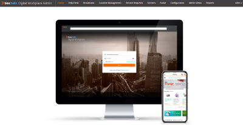<br>Navigate to the Admin console from the end-user console.<br>***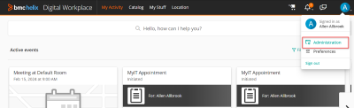***<br> |
| DWPCatalog console<br> | Access the Catalog console to configure the service catalog for designing the services and workflows, building reusable questionnaires, managing DWPuser roles, creating promotional banners, configuring connectors, and defining entitlements.<br> | * DWPadministrator * Catalog administrator * Asset manager | * SaaS customers—To learn how the Admin console URL is constructed, see[URL re-direction](https://docs.bmc.com/xwiki/bin/view/Helix-Common-Services/Other/BMC-Helix-Subscriber-Information/helixsubscriber/Getting-started/URL-re-direction/).<br>  * On-premises customers—Access the Admin console by the following URL format in a supported browser:  **https://*****HelixDWPCatalogServer:portNumber*/dwpc/index.html**<br>****<br> |
| DWPend-user console<br> | Log in to the end-user console to submit requests, find knowledge articles, schedule helpdesk appointments, work on assigned To-dos, respond to approvals, and access a chatbot.<br>If the My Activity page is not visible on the navigation bar, navigate to the My Activity page by using a link added in the user profile menu. On the navigation bar, select the user icon, and then click**My Activity**.<br>Important: If the administrator has removed the My Activity page from the navigation menu and has also assigned customized landing pages for users, those users cannot see the**My Activity**link in the user profile menu.<br>For more information, see[Controlling-the-visibility-of-the-My-Activity-page](https://docs.bmc.com/xwiki/bin/view/Service-Management/Employee-Digital-Workplace/BMC-Helix-Digital-Workplace/dwp254/Administering/Administering-BMC-Helix-Digital-Workplace/Creating-workplaces-for-your-lines-of-business/Setting-up-navigation-for-your-workplace/Controlling-the-visibility-of-the-My-Activity-page/).<br> | * End users | * SaaS customers—To learn how the Admin console URL is constructed, see[URL re-direction](https://docs.bmc.com/xwiki/bin/view/Helix-Common-Services/Other/BMC-Helix-Subscriber-Information/helixsubscriber/Getting-started/URL-re-direction/).<br>  * On-premises customers—Access the Admin console by the following URL format in a supported browser:  **https://*****HelixDWPServer:portNumber*****/dwp/app**<br>****  Navigate to the My Activity page in the end-user console.  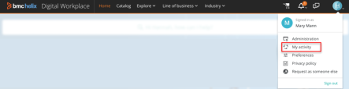<br> |
| External portal<br> | AccessDWP by an external portal as an external user. External users can register with their own email address and willhave limited access to theDWPfeatures. They can use the external portal to request services, find knowledge articles, and view notifications. For more information, see[Portal-for-external-users](https://docs.bmc.com/xwiki/bin/view/Service-Management/Employee-Digital-Workplace/BMC-Helix-Digital-Workplace/dwp254/Administering/Administering-BMC-Helix-Digital-Workplace/Administering-an-external-BMC-Helix-Digital-Workplace-portal/Portal-for-external-users/).<br> | * External users(users that are not internal to your organization) | * SaaS customers—To learn how the Admin console URL is constructed, see[URL re-direction](https://docs.bmc.com/xwiki/bin/view/Helix-Common-Services/Other/BMC-Helix-Subscriber-Information/helixsubscriber/Getting-started/URL-re-direction/).<br>  * On-premises customers—Access the Admin console by the following URL format in a supported browser:  **https://*****HelixDWPServer:portNumber*****/dwp/app**<br><br> |
| Guest portal | AccessDWP by using a guest portal as a guest user.A guest portal serves as a user-friendly gateway to information, services, and resources without requiring users to log in or disclose their personal identity. It is designed to provide stakeholders with easy access and quick transactions for public services.<br> | * Guest users with anonymous access | Customers should contact support to generate the guest portal URL.<br>**https://*****HelixDWPServer:portNumber*****/dwp/app**<br>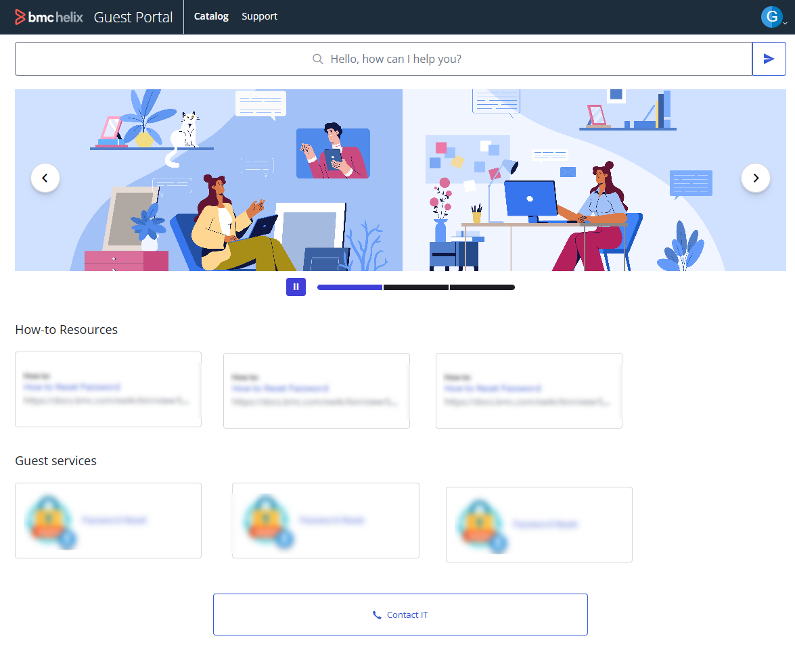<br> |

---

## <a id="getting-startedusing-this-documentationmd"></a>Getting-Started/Using-This-Documentation.md

Learn how to effectively locate information in the product documentation and how to provide feedback to improve documentation further.

Watch this video (2:37) to learn how to navigate the product documentation portal:

[🎥 Watch Video: //www.youtube.com/watch?v=MZVmtdmL5tA](//www.youtube.com/watch?v=MZVmtdmL5tA)

## To select another version of the product

When you find documentation from a search engine, such as a Google search, you might be looking at documentation for  
an older version of the product.

1. Open a topic in the product documentation.
2. In the**Product version**section in the navigation pane, click the version number.
3. From the list of product documentation versions, select the required version.

   After you select the required version from the list, the same topic opens if it's available in the selected version. If the topic is not available or has a different title, you are directed to the homepage of the selected version. You can then search for the specific content.
4. Alternatively, use the breadcrumb to view the content of the page in the other versions.  
   

## To search the product documentation

Use the following methods to search for product content:

| Search type | Procedure |
| --- | --- |
| Global search | Use this search to find information about documentation for different products or solutions. This search box is located on all documentation pages as shown in the following image:<br><br>**💡 Tips for better results**<br>  * Use**quotes**for exact phrases: "incident management" * Use**AND/OR**for combining terms: Helix AND upgrade * Use**wildcards**: instal\* to match install, installation, etc. |
| **Product documentation search** | Use this space-level search to find product-specific information such as concepts, architecture, access and navigation, integration, and troubleshooting<br>This search box is located in the left navigation pane on the specific product documentation set page as shown in the following image: 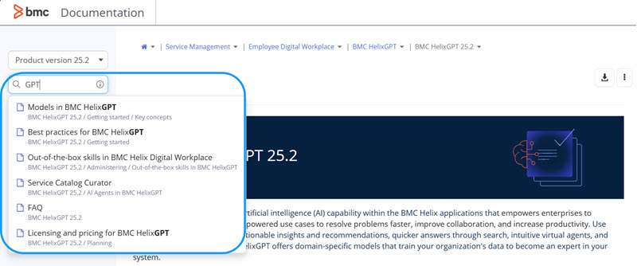<br> |
| **Advanced search** | Use this to refine your search with additional criteria.<br>  1. Go to the global search or the product documentation search bar. 2. Type the keywords (for example, prompt, API, architecture). You see the search results matching the keywords from the current documentation. 3. Press the**Enter key**to open the search results page with the list that matches the keywords across all documentation.  4. Add additional filtering options to refine your search.    * Result type    * Object type    * Location    * Language  You see the search results list changing as you refine the filters.<br> |

## To view sections on a page

The**On this page**pane in the product documentation typically serves as a table of contents for the current documentation page. It is beneficial on long pages with multiple sections, such as prerequisites, steps, examples, and troubleshooting.

1. On the right side of the page, you see the**On this page**section, which lists all major headings on the page.
2. Click a heading to jump to the specific part of the page without scrolling.  
   

Use the Toggle panel option to hide this section and get the wider reading area.

## To watch pages for later

Watch pages for your reference during future visits and to limit searches to your set of saved pages.

1. Log in to the documentation portal.
2. Navigate to the page you want to bookmark.
3. Scroll to the bottom of the page.
4. Look for the heart icon and click to save the page.  
   

To remove a saved page from your list, click the heart icon again.

## To provide feedback on a topic

You can take this short survey at the bottom of the page. Your feedback is only visible to the Documentation team. If you are not logged in to the documentation portal, your feedback is recorded anonymously.

1. Go to the "Was this page helpful" section and select an option.  
   
2. Provide details of your feedback.  
   
3. Click**Send**to forward your feedback.
4. For any queries or additional feedback, use the**Comments**section.  
     
   You must log in to the documentation portal to add comments.  
     
     
   

---

## <a id="known-and-corrected-issuesmd"></a>Known-And-Corrected-Issues.md

You must[log in](https://docs.bmc.com/xwiki/bin/login/XWiki/XWikiLogin?xredirect=%2Fxwiki%2Fbin%2Fview%2FService-Management%2FIT-Service-Management%2FBMC-Helix-ITSM%2Fitsm254%2FRelease-notes-and-notices%2FKnown-and-corrected-issues%2F)or[register](https://www.bmc.com/available/register-now.html?c=n)to view this page

---

## <a id="release-notes-and-noticesmd"></a>Release-Notes-And-Notices.md

Learn what's new or changed in this space, including urgent issues, documentation updates, service packs, and fixes and patches.

Related topics

[Known-and-corrected-issues](https://docs.bmc.com/xwiki/bin/view/Service-Management/Employee-Digital-Workplace/BMC-Helix-Digital-Workplace/dwp254/Release-notes-and-notices/Known-and-corrected-issues/)

[Support-information](https://docs.bmc.com/xwiki/bin/view/Service-Management/Employee-Digital-Workplace/BMC-Helix-Digital-Workplace/dwp254/Troubleshooting/Support-information/)[DWP Training & Certification](https://www.bmc.com/education/product-training/dwp-options.html)

| Date<br> | Summary<br> | Reference<br> |
| --- | --- | --- |
| November 20, 2025 | [Issues that were corrected in this patch and issues that remain open](https://docs.bmc.com/xwiki/bin/view/Service-Management/Employee-Digital-Workplace/BMC-Helix-Digital-Workplace/dwp254/Release-notes-and-notices/Known-and-corrected-issues/)<br>Patch 1 is available for SaaS and on-premises customers.<br> | [25.4 enhancements and patches](https://docs.bmc.com/xwiki/bin/view/Service-Management/Employee-Digital-Workplace/BMC-Helix-Digital-Workplace/dwp254/Release-notes-and-notices/25-4-enhancements-and-patches/) |
| October 17, 2025 | [Issues that were corrected in this patch and issues that remain open](https://docs.bmc.com/xwiki/bin/view/Service-Management/Employee-Digital-Workplace/BMC-Helix-Digital-Workplace/dwp254/Release-notes-and-notices/Known-and-corrected-issues/)<br>Enhancements available in 25.4:<br>  * Guide users to a resolution by clarifying their ambiguous asks * Measure user satisfaction by using the NPS scale in feedback surveys * Set up service level targets for service requests * Access Employee Navigator via Microsoft Teams for a seamless experience * *(Controlled availability)*Embed the Employee Navigator chat panel in your website. | [25.4 enhancements and patches](https://docs.bmc.com/xwiki/bin/view/Service-Management/Employee-Digital-Workplace/BMC-Helix-Digital-Workplace/dwp254/Release-notes-and-notices/25-4-enhancements-and-patches/) |
| September 16, 2025 | [Issues that were corrected in this patch and issues that remain open](https://docs.bmc.com/xwiki/bin/view/Service-Management/Employee-Digital-Workplace/BMC-Helix-Digital-Workplace/dwp254/Release-notes-and-notices/Known-and-corrected-issues/)<br>Patch 2 for version 25.3 is available for SaaS customers.<br> | [25.3 enhancements and patches](https://docs.bmc.com/xwiki/bin/view/Service-Management/Employee-Digital-Workplace/BMC-Helix-Digital-Workplace/dwp254/Release-notes-and-notices/25-3-enhancements-and-patches/) |
| September 3, 2025 | [Issues that were corrected in this patch and issues that remain open](https://docs.bmc.com/xwiki/bin/view/Service-Management/Employee-Digital-Workplace/BMC-Helix-Digital-Workplace/dwp254/Release-notes-and-notices/Known-and-corrected-issues/)<br>The cumulative updates from previous releases (25.2.02 and 25.3) are rolled into the 25.3.01 release for on-premises users.<br> | [25.3 enhancements and patches](https://docs.bmc.com/xwiki/bin/view/Service-Management/Employee-Digital-Workplace/BMC-Helix-Digital-Workplace/dwp254/Release-notes-and-notices/25-3-enhancements-and-patches/) |
| August 28, 2025 | [Issues that were corrected in this patch and issues that remain open](https://docs.bmc.com/xwiki/bin/view/Service-Management/Employee-Digital-Workplace/BMC-Helix-Digital-Workplace/dwp254/Release-notes-and-notices/Known-and-corrected-issues/)<br>Updates available in 25.3.01:<br>  * *(Controlled availability)*View localized foundation data in DWP. * Updated UI labels for Arabic locale. | [25.3 enhancements and patches](https://docs.bmc.com/xwiki/bin/view/Service-Management/Employee-Digital-Workplace/BMC-Helix-Digital-Workplace/dwp254/Release-notes-and-notices/25-3-enhancements-and-patches/) |
| July 24, 2025 | [Issues that were corrected in this patch and issues that remain open](https://docs.bmc.com/xwiki/bin/view/Service-Management/Employee-Digital-Workplace/BMC-Helix-Digital-Workplace/dwp254/Release-notes-and-notices/Known-and-corrected-issues/)<br>Enhancements available in 25.3:<br>  * Get a summary of the service request comments from the Employee Navigator chat. * Add rich text comments and attachments to the service requests via Employee Navigator chat. * Simplify service request submission by suggesting relevant services as links in the Employee Navigator chat. * Boost service creation and accuracy with the Service Catalog Curator. * Define functions with the question responses to automatically populate the questionnaire fields. * Enable social notifications via the notification engine on IS to modernize enterprise communication. * *(Controlled availability)*Use HelixGPT to make services requestable via chat. * Use fulfillment IDs to search for service requests in Employee Navigator. * Use Employee Navigator to interact with approvals. | [25.3 enhancements and patches](https://docs.bmc.com/xwiki/bin/view/Service-Management/Employee-Digital-Workplace/BMC-Helix-Digital-Workplace/dwp254/Release-notes-and-notices/25-3-enhancements-and-patches/) |
| June 23, 2025 | [Issues that were corrected in this patch and issues that remain open](https://docs.bmc.com/xwiki/bin/view/Service-Management/Employee-Digital-Workplace/BMC-Helix-Digital-Workplace/dwp254/Release-notes-and-notices/Known-and-corrected-issues/)<br>Patch 2 for version 25.2 is available for SaaS customers.<br> | [25.2 enhancements and patches](https://docs.bmc.com/xwiki/bin/create/Service-Management/Employee-Digital-Workplace/BMC-Helix-Digital-Workplace/dwp254/Release-notes-and-notices/25-2-enhancements-and-patches/WebHome?parent=Service-Management.Employee-Digital-Workplace.BMC-Helix-Digital-Workplace.dwp254.Release-notes-and-notices.WebHome) |
| June 3, 2025 | [Issues that were corrected in this patch and issues that remain open](https://docs.bmc.com/xwiki/bin/view/Service-Management/Employee-Digital-Workplace/BMC-Helix-Digital-Workplace/dwp254/Release-notes-and-notices/Known-and-corrected-issues/)<br>Updates available in 25.2.01:<br>  * Request additional information before approval.  Patch 1 for version 25.2 is available for on-premises customers.<br> | [25.2 enhancements and patches](https://docs.bmc.com/xwiki/bin/create/Service-Management/Employee-Digital-Workplace/BMC-Helix-Digital-Workplace/dwp254/Release-notes-and-notices/25-2-enhancements-and-patches/WebHome?parent=Service-Management.Employee-Digital-Workplace.BMC-Helix-Digital-Workplace.dwp254.Release-notes-and-notices.WebHome) |
| May 27, 2025 | [Issues that were corrected in this patch and issues that remain open](https://docs.bmc.com/xwiki/bin/view/Service-Management/Employee-Digital-Workplace/BMC-Helix-Digital-Workplace/dwp254/Release-notes-and-notices/Known-and-corrected-issues/)<br>Updates available in 25.2.01:<br>  * Request additional information before approval. | [25.2 enhancements and patches](https://docs.bmc.com/xwiki/bin/create/Service-Management/Employee-Digital-Workplace/BMC-Helix-Digital-Workplace/dwp254/Release-notes-and-notices/25-2-enhancements-and-patches/WebHome?parent=Service-Management.Employee-Digital-Workplace.BMC-Helix-Digital-Workplace.dwp254.Release-notes-and-notices.WebHome) |
| April 15, 2025<br> | [Issues that were corrected in this patch and issues that remain open](https://docs.bmc.com/xwiki/bin/view/Service-Management/Employee-Digital-Workplace/BMC-Helix-Digital-Workplace/dwp254/Release-notes-and-notices/Known-and-corrected-issues/)<br>Enhancements available in 25.2:<br>  * Accelerate service creation by using the Service Catalog Curator. * Access DWP guest portal for self-service without needing registration. * Snap and upload images as input in Employee Navigator. * Configure the disclaimer message for HelixGPT responses. * Define the data archival policy for DWP. * Assign a DWP Catalog role to multiple users in bulk. * Use HelixGPT chat to update service requests in DWP. * *(Controlled availability)*Connect to a live agent from HelixGPT chat. * View relevant subcatalogs for lines of business. * Simplified licensing model for Service Management Suite. | [25.2 enhancements and patches](https://docs.bmc.com/xwiki/bin/create/Service-Management/Employee-Digital-Workplace/BMC-Helix-Digital-Workplace/dwp254/Release-notes-and-notices/25-2-enhancements-and-patches/WebHome?parent=Service-Management.Employee-Digital-Workplace.BMC-Helix-Digital-Workplace.dwp254.Release-notes-and-notices.WebHome)<br> |

---

## <a id="release-notes-and-notices253-enhancements-and-patchesmd"></a>Release-Notes-And-Notices/25.3-Enhancements-And-Patches.md

Review the DWP 25.3 enhancements and patches for features that will benefit your organization and to understand changes that might impact your users.

| Version<br> | SaaS<br> | On premises<br> | Fixed issues<br> | Updates and enhancements<br> |
| --- | --- | --- | --- | --- |
| 25.3.02 | ✅️ |  | [Known and corrected issues](https://docs.bmc.com/xwiki/bin/view/Service-Management/Employee-Digital-Workplace/BMC-Helix-Digital-Workplace/dwp254/Issues-tables/) | None |
| 25.3.01 | ✅️ | ✅️ | [Known and corrected issues](https://docs.bmc.com/xwiki/bin/view/Service-Management/Employee-Digital-Workplace/BMC-Helix-Digital-Workplace/dwp254/Issues-tables/) | [25.3.01 enhancements](https://docs.bmc.com/xwiki/bin/view/Service-Management/Employee-Digital-Workplace/BMC-Helix-Digital-Workplace/dwp254/Release-notes-and-notices/25-3-enhancements-and-patches/) |
| 25.3 | ✅️ |  | [Known and corrected issues](https://docs.bmc.com/xwiki/bin/view/Service-Management/Employee-Digital-Workplace/BMC-Helix-Digital-Workplace/dwp254/Issues-tables/) | [25.3 enhancements](https://docs.bmc.com/xwiki/bin/view/Service-Management/Employee-Digital-Workplace/BMC-Helix-Digital-Workplace/dwp254/Release-notes-and-notices/25-3-enhancements-and-patches/) |

## 25.3.01

---

## *(Controlled availability)*View localized foundation data in DWP

DWP displays localized foundation data from ITSM across the end-user console and within service requests.

End users can view foundation data in their preferred language, consistent with the application’s user interface. This change supports compliance with region-specific language requirements and enhances the user experience.

For more information, see[Localized foundation data in DWP](https://docs.bmc.com/xwiki/bin/view/Service-Management/Employee-Digital-Workplace/BMC-Helix-Digital-Workplace/dwp254/Administering/Administering-BMC-Helix-Digital-Workplace/Setting-up-a-localized-environment/Localized-foundation-data-in-BMC-Helix-Digital-Workplace/).

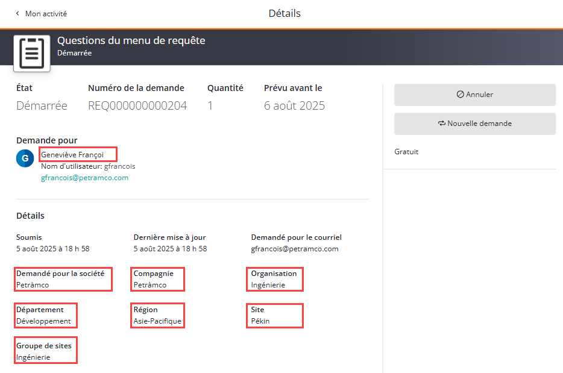

---

## Updated UI labels for Arabic locale

DWP displays updated Arabic label strings across the UI. These labels improve clarity and user comprehension for Arabic locale users. No administrative configuration is required to apply these updates. The updated localized labels are automatically visible to users with the Arabic locale enabled.

[List of the updated UI labels for Arabic locale](https://docs.bmc.com/xwiki/bin/download/Service-Management/Employee-Digital-Workplace/BMC-Helix-Digital-Workplace/dwp254/Release-notes-and-notices/25-3-enhancements-and-patches/WebHome/Updated%20UI%20labels%20for%20Arabic%20locale_%2025.3.01%20release.pdf?rev=1.3)(click to download PDF)

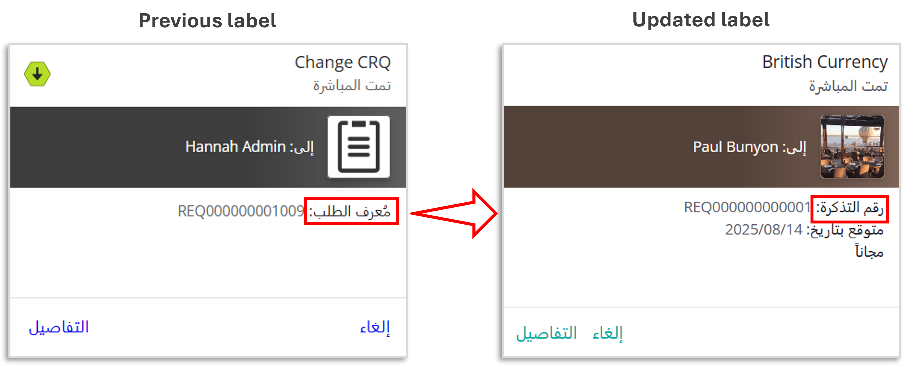

## Documentation enhancements

Explore our comprehensive categories for business services designed to support operational efficiency across industries. The details include service descriptions, associated offerings, and applicable industry domains. See[Automating service requests](https://docs.bmc.com/xwiki/wiki/internal/view/Service-Management/Employee-Digital-Workplace/dwpMaster2/Getting-started/Use-cases/Automating-service-requests/25-3).

Use popular service examples and predefined questionnaires to create and update services, standardize configurations, improve discoverability, and enhance fulfillment workflows for a better user experience. See[Leveraging popular service examples to optimize service configurations and enhance user experience](https://docs.bmc.com/xwiki/wiki/internal/view/Service-Management/Employee-Digital-Workplace/dwpMaster2/Creating-and-managing-the-service-catalog/Leveraging-popular-service-examples-to-optimize-service-configurations-and-enhance-user-experience/25-1).

---

## 25.3

---

The following video (2:36) provides an overview of the enhancements included in DWP 25.3:

[🎥 Watch Video: https://www.youtube.com/watch?v=M6lQbQxUiW0](https://www.youtube.com/watch?v=M6lQbQxUiW0)

[What's new in DWP 25.3](https://youtu.be/M6lQbQxUiW0?si=kTcwW7Q-QlZpUWyf)

---

## Use Employee Navigator to interact with approvals

End users can manage and interact with approval requests directly from the chat interface of Employee Navigator, eliminating the need to navigate through specific approval pages.

With this capability, you can perform the following actions:

* Approve or reject approvals instantly from the chat.
* Reassign approvals to other team members.
* Put approvals on hold for later action.

For more information, see[Using Employee Navigator to find AI-generated answers](https://docs.bmc.com/xwiki/bin/view/Service-Management/Employee-Digital-Workplace/BMC-Helix-Digital-Workplace/dwp254/Using-BMC-Helix-Digital-Workplace-to-request-services/Using-Employee-Navigator-to-find-AI-generated-answers/).


---

## Use fulfillment IDs to search for service requests in Employee Navigator

When a user submits a service request, it often triggers various fulfillment tickets with their respective fulfillment IDs. This capability enables users to search for a service request in the Employee Navigator using an associated fulfillment ID, such as a work order ID, incident ID, case ID, or change request ID.

This capability offers the following benefits:

* Enhances service request traceability.
* Provides flexibility to use different identifiers to query the associated service request.
* Reduces friction in collaborative workflows where different fulfillment tickets are managed by different people.
* Improves overall user experience.

For more information, see[Configuring fulfillment details display in service requests](https://docs.bmc.com/xwiki/bin/view/Service-Management/Employee-Digital-Workplace/BMC-Helix-Digital-Workplace/dwp254/Administering/Administering-BMC-Helix-Digital-Workplace/Managing-end-user-features/Configuring-fulfillment-details-display-in-service-requests/).


---

## Get a summary of the service request comments from the Employee Navigator chat

This capability is available with the[Service Management service](https://docs.bmc.com/xwiki/bin/view/Helix-Common-Services/Other/BMC-Helix-Subscriber-Information/)as described in Subscriber Information.

Provide end users with a summary of the comments on the service requests via Employee Navigator chat, offering instant clarity on service request activities. They do not have to manually sift through lengthy comment threads, especially when dealing with complex requests that involve multiple stakeholders. The capability offers the following benefits:

* Quickly understand request history without reading every comment.
* Make faster decisions with summarized insights.
* Focus on key updates without information overload.

For more information, see[Using Employee Navigator to find AI-generated answers](https://docs.bmc.com/xwiki/bin/view/Service-Management/Employee-Digital-Workplace/BMC-Helix-Digital-Workplace/dwp254/Using-BMC-Helix-Digital-Workplace-to-request-services/Using-Employee-Navigator-to-find-AI-generated-answers/).


---

## Add rich text comments and attachments to the service requests via the Employee Navigator chat

This capability is available with the[Service Management service](https://docs.bmc.com/xwiki/bin/view/Helix-Common-Services/Other/BMC-Helix-Subscriber-Information/)as described in Subscriber Information.

Enable end users to add RTF comments and attachments to existing service requests by using Employee Navigator chat. This capability offers the following benefits:

* Simplifies routine tasks, making the process more intuitive and user-friendly.
* Improves productivity for end users by allowing them to add rich text comments and attachments without navigating through multiple interfaces.

For more information, see[Using Employee Navigator to find AI-generated answers](https://docs.bmc.com/xwiki/bin/view/Service-Management/Employee-Digital-Workplace/BMC-Helix-Digital-Workplace/dwp254/Using-BMC-Helix-Digital-Workplace-to-request-services/Using-Employee-Navigator-to-find-AI-generated-answers/).

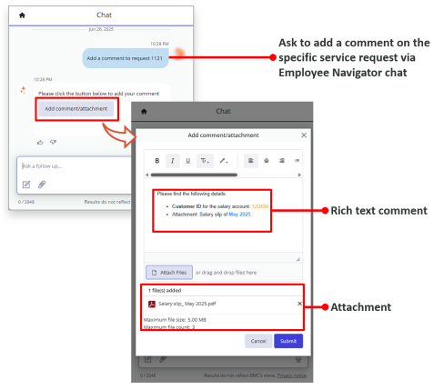

---

## Guide users to the relevant catalog services via links in Employee Navigator chat

This capability is available with the[Service Management service](https://docs.bmc.com/xwiki/bin/view/Helix-Common-Services/Other/BMC-Helix-Subscriber-Information/)as described in Subscriber Information.

By leveraging AI capabilities, the Employee Navigator intelligently matches user intention to published services. With this enhancement, user questions are mapped to the most relevant catalog services through clickable links via chat, offering the following benefits:

* For services that cannot be fulfilled via chat, users are guided directly through links to the appropriate request submission pages.
* Redirecting users to the relevant catalog service reduces support overhead, minimizing manual intervention.

For more information, see[Using Employee Navigator to find AI-generated answers](https://docs.bmc.com/xwiki/bin/view/Service-Management/Employee-Digital-Workplace/BMC-Helix-Digital-Workplace/dwp254/Using-BMC-Helix-Digital-Workplace-to-request-services/Using-Employee-Navigator-to-find-AI-generated-answers/).


---

## Boost service creation and accuracy with the Service Catalog Curator

This capability is available with the[Service Management service](https://docs.bmc.com/xwiki/bin/view/Helix-Common-Services/Other/BMC-Helix-Subscriber-Information/helixsubscriber/BMC-Helix-services/BMC-Helix-Service-Management-service/)as described in Subscriber Information.

The Service Catalog Curator offers optimized performance, enhanced display, and greater accuracy for service creation with the following enhancements:

* Group or individual approval mappings
* Delta Updates for follow-up Conversations
* Optimized questionnaire featuring sectional and description widgets
* RegEx validation for questions

These improvements empower catalog administrators to create services with greater accuracy and faster turnaround times using the service catalog curator.

For more information, see[Leveraging Service Catalog Curator for creating services](https://docs.bmc.com/xwiki/bin/view/Service-Management/Employee-Digital-Workplace/BMC-Helix-Digital-Workplace/dwp254/Creating-and-managing-the-service-catalog/Leveraging-Service-Catalog-Curator-for-creating-services/).

|  | 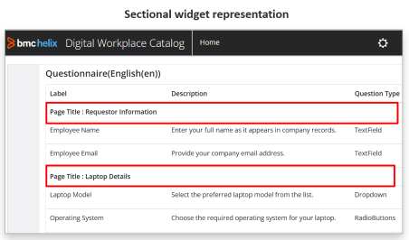 |
| --- | --- |
| 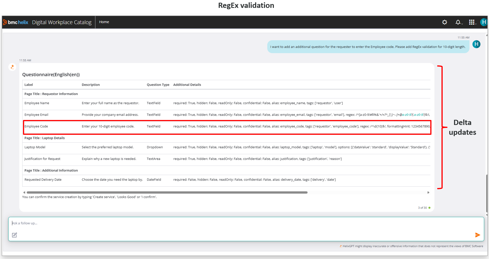 | |

---

## Define functions with the question responses to auto-populate the questionnaire fields

This capability is available with theDWP[license](https://docs.bmc.com/xwiki/bin/view/Service-Management/Employee-Digital-Workplace/BMC-Helix-Digital-Workplace/dwp254/Planning/License-types-and-features/).

Define functions within a questionnaire that act on user answers. These functions can apply operations on the responses to compute values, fill in fields, and enforce logic before the submission of service requests. This enhancement creates a smarter and more responsive questionnaire that adapts in real-time based on user input, offering the following benefits:

* **Faster form completion**—Auto-filled and computed fields reduce manual typing and guesswork, reducing cognitive load.
* **Enforced business rules**—Prevents non-compliant submissions at the source, such as a refund exceeding the allowance amount.
* **Reduced errors**—Built-in logic prevents mistakes that could delay the processing of a service request.

For more information, see[Applying operations to question responses](https://docs.bmc.com/xwiki/bin/view/Service-Management/Employee-Digital-Workplace/BMC-Helix-Digital-Workplace/dwp254/Creating-and-managing-the-service-catalog/Building-service-catalogs/Creating-service-questionnaires/Applying-operations-to-question-responses/).

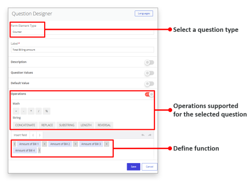

---

## *(Controlled availability)*Use HelixGPT to make services easily requestable via chat

This capability is available with the[Service Management service](https://docs.bmc.com/xwiki/bin/view/Helix-Common-Services/Other/BMC-Helix-Subscriber-Information/helixsubscriber/BMC-Helix-services/BMC-Helix-Service-Management-service/)as described in Subscriber Information.

Catalog administrators can save their time and manual efforts by using HelixGPT to make services easily accessible and requestable via chat. End users can request such services via Employee navigator.

Using HelixGPT provides the following benefits to the catalog administrators:

* Save manual efforts required for using the Publish chat-enabled servicewizard to make services requestable.
* Avoid human errors when using disambiguation, providing variations in service descriptions, service clarification phrases, and providing natural language variations of the questions.
* Achieve faster scalability by making several services requestable in a short period of time.
* Improve discoverability of services that help users identify the appropriate service for their queries.

For more information, see[Using HelixGPT to make services requestable via chat](https://docs.bmc.com/xwiki/bin/view/Service-Management/Employee-Digital-Workplace/BMC-Helix-Digital-Workplace/dwp254/Creating-and-managing-the-service-catalog/Using-BMC-HelixGPT-to-make-services-requestable-via-chat/).

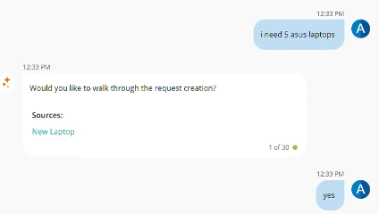

---

## Use the delivery estimate to define service timelines

Catalog administrators can specify a value in the**Delivery Estimate**field to show how long a service usually takes to complete. The**Delivery Estimate**field replaces the older**Provisioning Time**field. In**Service Broker context data type**, the**Turnaround Date**field uses the delivery estimate instead of the provisioning time. Administrators can turn on the**Show to requestors**option to display the estimate as “Typically takes” on the service catalog and checkout pages.

This capability offers the following benefits:

* Users can see how long a service might take without contacting Support.
* Users can decide when to request a service based on how long it usually takes.

For more information, see[Setting service level agreements](https://docs.bmc.com/xwiki/wiki/internal/view/Service-Management/Employee-Digital-Workplace/dwpMaster2/Creating-and-managing-the-service-catalog/Building-service-catalogs/Adding-and-updating-services/Setting-service-level-agreements/).

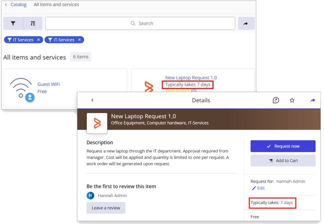

---

## What else changed in this release

---

| Update<br> | Product behavior in versions earlier than 25.3<br> | Product behavior in 25.3<br> |
| --- | --- | --- |
| This capability is available with theDWP[license](https://docs.bmc.com/xwiki/bin/view/Service-Management/Employee-Digital-Workplace/BMC-Helix-Digital-Workplace/dwp254/Planning/License-types-and-features/).<br>Enhanced performance of Catalog sections that load articles from HKM<br> | In DWP, users experienced loading delays when accessing Catalog sections that contained articles from HKM. The articles took a noticeable amount of time to load. | Articles from HKM load significantly faster in the Catalog sections of DWP.<br> |
| Support for the delivery of social notifications through the notification engine on IS. | The notification engine on IS did not support the notifications for social events. | The notification engine on IS supports email notifications for the following social events:<br>  * A user was mentioned in another user's post. * A user commented on another user's post. * A user commented on a post where another user was mentioned. * The asset followed by a user, was mentioned in another user's post.  For more information, see[Out-of-the-box notification events, templates, and processes.](https://docs.bmc.com/xwiki/bin/view/Service-Management/Employee-Digital-Workplace/BMC-Helix-Digital-Workplace/dwp254/Administering/Administering-BMC-Helix-Digital-Workplace/Leveraging-the-notification-engine-on-BMC-Helix-Innovation-Suite-for-greater-flexibility/Out-of-the-box-notification-events-templates-and-processes/)<br> |
| Provide feedback on all Employee Navigator responses. | Employee Navigator displayed feedback options only when the response included source links.<br> | Employee Navigator displays feedback options for all responses, regardless of whether source links are included.<br> |
| This capability is available with the[Service Management service](https://docs.bmc.com/xwiki/bin/view/Helix-Common-Services/Other/BMC-Helix-Subscriber-Information/helixsubscriber/BMC-Helix-services/BMC-Helix-Service-Management-service/)as described in Subscriber Information.<br>Enhanced prompt selection in the HelixGPT Agent Studio with a filtering option<br> | When administrators link a prompt to a skill, the Link prompt dialog box displayed the list of prompts for all the applications. Because administrators were unable to filter the list, it was difficult to locate and reuse prompts specific to DWP. | The HelixGPT Agent Studio offers filters for all columns, including Name, Application, Type, and Seed in the Link prompt user interface.<br>Administrators can filter the prompt list to show only those related to the DWP, simplifying prompt selection. For more information, see[Creating and managing prompts](https://docs.bmc.com/xwiki/bin/view/Service-Management/Employee-Digital-Workplace/BMC-HelixGPT/helixgpt253/Administering/Creating-and-managing-prompts/).<br> |
| This capability is available with theDWP[license](https://docs.bmc.com/xwiki/bin/view/Service-Management/Employee-Digital-Workplace/BMC-Helix-Digital-Workplace/dwp254/Planning/License-types-and-features/).<br>Leverage a visual interface for generating and viewing the DWP Guest User Report.<br> | Guest administrators could only generate the DWP Guest User Report by exporting it as a CSV file. The visual user interface was not available for viewing or interacting with the report. | Guest administrators can generate and view the DWP Guest User Reportdirectly through an intuitive visual interface.<br>This capability enhances usability, flexibility, and decision-making efficiency.<br>Additionally, this interface introduces the following customizable data selection options:<br>  * Dynamic date range filters * Device type filters  These filters empower guest administrators to generate more relevant and actionable insights.<br>For more information, see[Reviewing active users](https://docs.bmc.com/xwiki/bin/view/Service-Management/Employee-Digital-Workplace/BMC-Helix-Digital-Workplace/dwp254/Administering/Administering-BMC-Helix-Digital-Workplace/Tracking-activity/Reviewing-active-users/).<br> |
| This capability is available with theDWP[license](https://docs.bmc.com/xwiki/bin/view/Service-Management/Employee-Digital-Workplace/BMC-Helix-Digital-Workplace/dwp254/Planning/License-types-and-features/).<br>The IS connector retrieves and displays localized data from applications developed on IS.<br> | The IS connector retrieved the data from applications developed on IS by using only the default English locale.<br> | When you create questions that pull responses from applications developed on IS, the IS connector can retrieve and display localized data. This capability provides the following benefits:<br>  * Enhances user experience by presenting content in the user's preferred language that is set for DWP. * Improves consistency across applications. * Maximizes the value of localization investments already made in IS.  For more information, see[IS connector](https://docs.bmc.com/xwiki/bin/view/Service-Management/Employee-Digital-Workplace/BMC-Helix-Digital-Workplace/dwp254/Creating-and-managing-the-service-catalog/Connecting-your-catalog-to-external-systems/Service-connector-capabilities/BMC-Helix-Innovation-Studio-connector/).<br> |
| This capability is available with the[Service Management service](https://docs.bmc.com/xwiki/bin/view/Helix-Common-Services/Other/BMC-Helix-Subscriber-Information/helixsubscriber/BMC-Helix-services/BMC-Helix-Service-Management-service/)as described in Subscriber Information.<br>Experience an optimized table view in Employee Navigator responses with clickable links within each row for the corresponding row item<br> | When users view tables in response to prompts such as show requests, show approvals, and show to-dos, the links to go to the details page of each row item are listed below the table. | When users view tables in response to prompts such as show requests, show approvals, and show to-dos, each row within the table contains a link that routes them to the details page of the corresponding item. This capability eliminates the need for users to look for the specific link that corresponds to a row item.<br>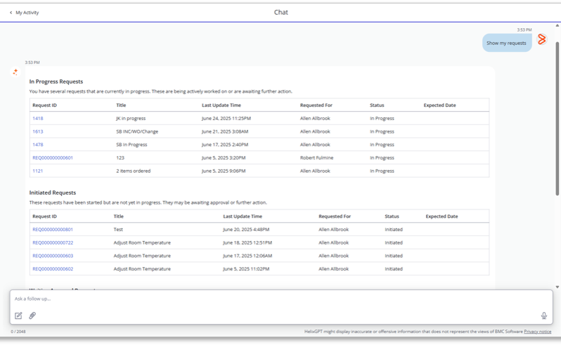<br> |
| *(Controlled availability)*Support agents receive Employee Navigator chat summaries | Support agents had limited visibility into a user's Employee Navigator chat summary.<br> | When HelixGPT redirects users to support agents, it shares the chat history with the support agent.<br>This context helps agents understand the query and provide faster, more accurate assistance.<br>For more information, see[Generating AI-retrieved answers for end users through HelixGPT](https://docs.bmc.com/xwiki/bin/view/Service-Management/Employee-Digital-Workplace/BMC-Helix-Digital-Workplace/dwp254/Getting-started/Use-cases/Generating-AI-retrieved-answers-for-end-users-through-BMC-HelixGPT/).<br> |
| Users from a tenancy can see search suggestions based on the search history of other users in their tenancy | Search suggestions were generated from the browser's local storage. Any user accessing the same browser could view the last 10 search terms, regardless of who performed the search. This behavior did not support tenant-level segregation. | A search history is stored in the backend and is used to generate search suggestions for other users within the same tenancy. A backend scheduler processes and updates these suggestions approximately every 24 hours.<br>Administrators can configure the search scheduler settings. To learn more, see[Configuring search](https://docs.bmc.com/xwiki/bin/view/Service-Management/Employee-Digital-Workplace/BMC-Helix-Digital-Workplace/dwp253/Administering/Administering-BMC-Helix-Digital-Workplace/Configuring-search/).<br> |
| The*Software*copyright statements in DWP and DWP Catalog are replaced withcopyright statements | The copyright statement in the footer text on the login page, footer text in the privacy policy, and the text when the user is prompted to enable advanced features read.<br>*Copyright 1997-2025 Software*<br>*, Software, the Software logo, are the exclusive properties of Software, Inc. and are registered with the U.S. Patent and Trademark Office, and may be registered or pending registration in other countries.*<br>**<br> | The copyright statement in the footer text on the login page, footer text in the privacy policy, and the text when the user is prompted to enable advanced features read:<br>*Copyright 1997-2025 Inc.*<br>*Helix and other Helix marks are the exclusive properties of Inc. and are registered or may be registered with the U.S. Patent and Trademark Office or in other countries.*<br><br> |
| Experience improved relevance in search results for knowledge articles from HKM | When users searched for knowledge articles, only basic filters with individual tags or simple AND/OR logic were supported. | Users benefit from advanced filters created by administrators by using combined**AND**,**OR**, and**NOT**operators for more precise results. The filters with complex queries help users find more targeted and relevant knowledge articles. For more information, see[Configuring search](https://docs.bmc.com/xwiki/bin/view/Service-Management/Employee-Digital-Workplace/BMC-Helix-Digital-Workplace/dwp253/Administering/Administering-BMC-Helix-Digital-Workplace/Configuring-search/).<br> |

---

## <a id="release-notes-and-notices254-enhancements-and-patchesmd"></a>Release-Notes-And-Notices/25.4-Enhancements-And-Patches.md

Review the DWP 25.4 enhancements and patches for features that will benefit your organization and to understand changes that might impact your users.

| Version<br> | SaaS<br> | On premises<br> | Fixed issues<br> | Updates and enhancements<br> |
| --- | --- | --- | --- | --- |
| 25.4 | ✅️ |  | [Known and corrected issues](https://docs.bmc.com/xwiki/bin/view/Service-Management/Employee-Digital-Workplace/BMC-Helix-Digital-Workplace/dwp254/Release-notes-and-notices/Known-and-corrected-issues/) | [25.4 enhancements](https://docs.bmc.com/xwiki/bin/view/Service-Management/Employee-Digital-Workplace/BMC-Helix-Digital-Workplace/dwp254/Release-notes-and-notices/25-4-enhancements-and-patches/#25.4) |
| 25.4.01 | ✅️ | ✅️ | [Known and corrected issues](https://docs.bmc.com/xwiki/bin/view/Service-Management/Employee-Digital-Workplace/BMC-Helix-Digital-Workplace/dwp254/Release-notes-and-notices/Known-and-corrected-issues/) | [25.4.01 enhancements](https://docs.bmc.com/xwiki/bin/view/Service-Management/Employee-Digital-Workplace/BMC-Helix-Digital-Workplace/dwp254/Release-notes-and-notices/25-4-enhancements-and-patches/#25.4.01) |

---

## 25.4.01

---

## What else changed in this release

| Update<br> | Product behavior in versions earlier than 25.4.01<br> | Product behavior in 25.4.01<br> |
| --- | --- | --- |
| *(Controlled availability)*In addition to text, Employee Navigator displays embedded images from knowledge articles for better accuracy and clarity. | Employee Navigator UI could provide answers from knowledge articles and documents. However, inline retrieval of images from the source content was not supported. Responses were text-based.<br> | Employee Navigator UI supports inline retrieval of images embedded in knowledge articles sourced from the ITSM: Knowledge Management knowledge store.<br>Images up to 5 MB are supported for inline retrieval.<br>Supported image formats by LLMs:<br>  * Gemini 2.5 Flash supports PNG (.png), JPEG (.jpeg, .jpg), WEBP (.webp) * GPT 4.1 and 4.1 Mini support PNG (.png), JPEG (.jpeg, .jpg), WEBP (.webp), and GIF (.gif)  This capability is available*only*for Agentic AI.<br> |

## 25.4

The following video (2:29) provides an overview of the enhancements included in DWP 25.4:

[🎥 Watch Video: https://www.youtube.com/watch?v=obniaYNDVo4](https://www.youtube.com/watch?v=obniaYNDVo4)

[What's new in DWP 25.4](https://youtu.be/obniaYNDVo4)

---

## Guide users to a resolution by clarifying their ambiguous asks

This capability is available with the[Service Management service](https://docs.bmc.com/xwiki/bin/view/Helix-Common-Services/Other/BMC-Helix-Subscriber-Information/helixsubscriber/BMC-Helix-services/BMC-Helix-Service-Management-service/)as described in Subscriber Information.

Configure the Employee Navigator Supervisor agent, which uses built-in tools and coordinates sub-agents, to simplify the service interactions for employees. This agentic AI configuration transforms the Employee Navigator chat into a dynamic, more human-like, and context-aware experience in the following ways:

* Asks users follow-up questions to better understand the user intent when the initial input is vague.
* Responds by retrieving information from various sources, such as knowledge articles, service requests, approvals, To-dos, or service health items.
* Provides relevant catalog service links or guides users through a questionnaire to submit requests via chat.
* Connects users to live support or offers a generic request link when no resolution path is available.

For more information, see[Configuring Employee Navigator Supervisor agent](https://docs.bmc.com/xwiki/bin/view/Service-Management/Employee-Digital-Workplace/BMC-Helix-Digital-Workplace/dwp254/Administering/Administering-BMC-Helix-Digital-Workplace/Configuring-Employee-Navigator-Supervisor-agent/).

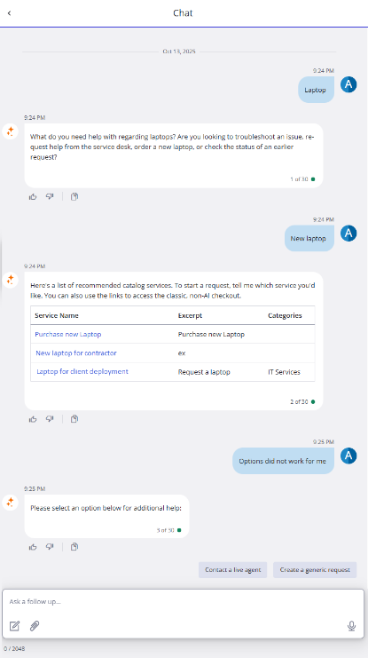

---

## Submit catalog requests through guided conversations

As an end user, submit service requests via the Employee Navigator chat through an interactive conversational experience. The agent interprets your query, identifies the most relevant catalog service, and walks you through the questionnaire. This capability provides the following benefits:

* Provides continuity by offering links to catalog services when chat-supported services are not available.
* Reduces manual effort and streamlines the process by submitting requests via chat.
* Improves the findability of services through AI-driven matching.

To learn more about the Catalog Request Agent, which facilitates this capability, see[Configuring Employee Navigator Supervisor Agent](https://docs.bmc.com/xwiki/bin/view/Service-Management/Employee-Digital-Workplace/BMC-Helix-Digital-Workplace/dwp254/Administering/Administering-BMC-Helix-Digital-Workplace/Configuring-Employee-Navigator-Supervisor-agent/)and[Using HelixGPT to make services requestable via chat](https://docs.bmc.com/xwiki/bin/view/Service-Management/Employee-Digital-Workplace/BMC-Helix-Digital-Workplace/dwp254/Creating-and-managing-the-service-catalog/Using-BMC-HelixGPT-to-make-services-requestable-via-chat/).  
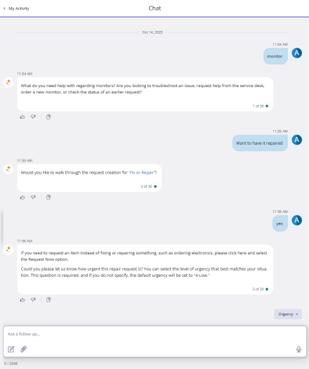

## Access Employee Navigator via Microsoft Teams for a seamless experience

This capability is available with the[Service Management service](https://docs.bmc.com/xwiki/bin/view/Helix-Common-Services/Other/BMC-Helix-Subscriber-Information/helixsubscriber/BMC-Helix-services/BMC-Helix-Service-Management-service/)as described in Subscriber Information.

Access Employee Navigator within the Microsoft Teams interface to perform service management tasks. End users can ask their workplace queries and track service requests without leaving the communication environment they use every day. They save time and stay focused, reducing friction in daily workflows.

To learn more about Microsoft Teams integration, see[Configuring Employee Navigator in the Microsoft Teams chat](https://docs.bmc.com/xwiki/bin/view/Service-Management/Employee-Digital-Workplace/BMC-Helix-Digital-Workplace/dwp254/Administering/Administering-BMC-Helix-Digital-Workplace/Configuring-Employee-Navigator-in-the-Microsoft-Teams-chat/).

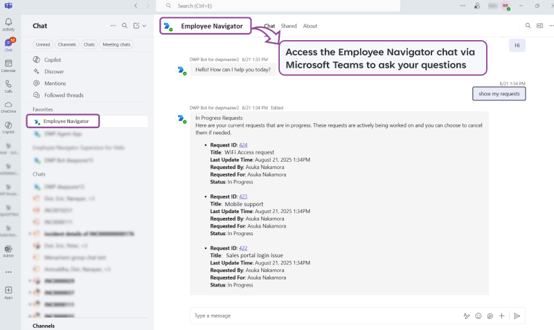

---

## Set up service level targets for service requests

The SLM Service library on Helix Platform enables catalog administrators to define, track, and display service targets for DWP requests. Implementing this feature brings several advantages to administrators, agents, and end users:

* Enhanced reporting with real-time SLM status in service request dashboards
* Streamlined configuration by using reusable service targets across catalog items
* Better SLA compliance tracking with milestone-based status updates
* Automated notifications for milestone alerts via email
* Seamless upgrade path from legacy provisioning time to delivery estimates

For more information, see[Configuring Service Level Management](https://docs.bmc.com/xwiki/wiki/internal/view/Service-Management/Employee-Digital-Workplace/dwpMaster2/Administering/Administering-BMC-Helix-Digital-Workplace-Catalog/Configuring-Service-Level-Management/#)


---

## Measure user satisfaction with the NPS survey

This capability is available with theDWP[license](https://docs.bmc.com/xwiki/wiki/internal/view/Service-Management/Employee-Digital-Workplace/dwpMaster2/Planning/License-types-and-features/).

Provide catalog administrators with the ability to configure surveys by using the Net Promoter Score (NPS) method as an alternative to the existing CSAT formats. This enhancement benefits organizations in the following ways:

* Aligns with industry-standard metrics for customer sentiment.
* Facilitates clear differentiation of survey data by using scale types like CSAT and NPS.
* Allows customization of rating labels to better reflect organizational terminology and support localization.
* Automatically updates the survey template during global scale changes.
* Supports seamless integration of survey data with the Catalog reports that reflect survey scales.

For more information, see[Designing custom surveys for catalog services](https://docs.bmc.com/xwiki/bin/view/Service-Management/Employee-Digital-Workplace/BMC-Helix-Digital-Workplace/dwp254/Creating-and-managing-the-service-catalog/Setting-up-surveys/Setting-up-satisfaction-surveys-for-catalog-services/Designing-custom-surveys-for-catalog-services/).


---

## Evaluating Customer Satisfaction via the DWP Net Promoter Score Dashboard

Use the DWP Net Promoter Score Report dashboard to evaluate customer satisfaction by analyzing survey responses and ratings from the customer service cases based on the Net Promoter Score (NPS). The NPS is calculated by subtracting the percentage of detractors (those who rate 0–6) from the percentage of promoters (those who rate 9–10) on an 11-point scale ranging from 0 (lowest value) to 10 (highest value).

For more information, see[Viewing DWP dashboards](https://docs.bmc.com/xwiki/bin/view/Service-Management/Employee-Digital-Workplace/BMC-Helix-Digital-Workplace/dwp254/Administering/Administering-BMC-Helix-Digital-Workplace/Viewing-BMC-Helix-Digital-Workplace-dashboards/)


---

## Configure a welcome message to guide users in Employee Navigator

Configure a welcome message to be displayed when an end user starts a new topic in Employee Navigator. The message provides a brief introduction and helps you get started with Employee Navigator quickly.

You can also configure the message to be displayed in any of the supported localized languages.

For more information, see[Configuring HelixGPT in the end-user console and studio pages](https://docs.bmc.com/xwiki/bin/view/Service-Management/Employee-Digital-Workplace/BMC-Helix-Digital-Workplace/dwp254/Administering/Administering-BMC-Helix-Digital-Workplace/Configuring-BMC-HelixGPT-in-the-end-user-console-and-studio-pages/).


---

## Copy formatted prompt responses to save time

Save time by copying a prompt response. Reuse the copied content including its formatting and images in other artifacts, such as a Word document or an email.

For more information, see[Using Employee Navigator to find AI-generated answers](https://docs.bmc.com/xwiki/bin/view/Service-Management/Employee-Digital-Workplace/BMC-Helix-Digital-Workplace/dwp254/Using-BMC-Helix-Digital-Workplace-to-request-services/Using-Employee-Navigator-to-find-AI-generated-answers/).

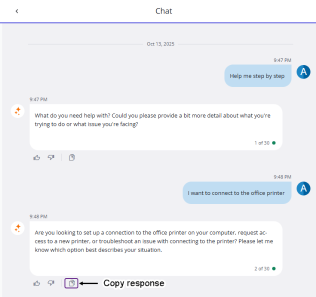

---

## *(Controlled availability)*Embed the Employee Navigator chat panel in your website

As a website developer, embed the Employee Navigator chat panel in your website to bring Employee Navigator capabilities directly to your users. End users can interact with the panel to receive intelligent, context-aware assistance wherever they are. The interface and functionality of the embedded panel closely match the experience end users already have with Employee Navigator in DWP.

For more information, see[Embedding the Employee Navigator chat panel in your website](https://docs.bmc.com/xwiki/bin/view/Service-Management/Employee-Digital-Workplace/BMC-Helix-Digital-Workplace/dwp254/Integrating/Embedding-the-Employee-Navigator-chat-panel-in-your-website/).


---

## What else changed in this release

| Update<br> | Product behavior in versions earlier than 25.4<br> | Product behavior in 25.4<br> |
| --- | --- | --- |
| Create cleaner and well-formatted text inputs with less effort by using improved text editors | While using text editors for tasks, such as adding RTF comments to requests or creating questionnaires, error messages related to unsupported formats or attachment limits would appear on submission. Additionally, Inline images could only be resized by manually editing their pixel size. | Users work with a more intuitive and responsive text editing interface that offers the following benefits:<br>  * **Real-time and inline validation**for unsupported formats, attachment limits, and invalid URL schemes directly within the text editor fields. * **Stronger formatting control**through confirmation prompts for pasted text with different formats. * **Improved attachment handling**with bulk drag-and-drop for uploading images and intuitive drag-to-resize functionality.  <details class="confluence-expand-macro panel panel-default"><summary><span class="panel-title"><span class="title-text">Click here to see the image</span></span></summary><div class="panel-body"><p></p></div></details> |
| Improved organization of chained-prompt and agentic AI skills for DWP in HelixGPT Agent Studio | Administrators would see a long list of prompt and agent-based skills in HelixGPT Agent Studio, making navigation and discovery time-consuming. | HelixGPT Agent Studio offers a more compact and intuitive list of out-of-the-box skills for DWP by consolidating multiple chained-prompt and agentic AI capabilities under each skill.<br><details class="confluence-expand-macro panel panel-default"><summary><span class="panel-title"><span class="title-text">Click here to see the available list of skills in the HelixGPT Studio</span></span></summary><div class="panel-body"><p></p></div></details>**Important:**<br>We recommend using the following skills to leverage agentic AI capabilities:<br>  * Employee Navigator for Helix * Employee Navigator for Helix- MS Teams |
| Route users to a human support by using the Live Chat Agent | Live agent connection was available only through a prompt-based approach. | As an administrator, you can configure the Employee Navigator Supervisor agent to enable the**Live Chat Agent**to connect users with human support. This agentic AI configuration provides a more dynamic user experience.<br>DWP supports both prompt-based and agent-driven approaches.<br> |
| Branding for applications | applications used an older color theme for icons, buttons, links, and UI pages. | The core brand colors have been updated to create a more modern and accessible palette.<br>The new branding includes an updated color theme, icons, and buttons for a consistent look across all applications.<br> |

---

## <a id="release-notes-and-noticesdeprecated-and-discontinued-featuresmd"></a>Release-Notes-And-Notices/Deprecated-And-Discontinued-Features.md

This topic describes important announcements and changes that occur in the product andmight impact future releases of the product.These changes can affect the way in which you configure or run the version of DWP.

Related topics

[Support-information](https://docs.bmc.com/xwiki/bin/view/Service-Management/Employee-Digital-Workplace/BMC-Helix-Digital-Workplace/dwp254/Troubleshooting/Support-information/)

[Release-notes-and-notices](https://docs.bmc.com/xwiki/bin/view/Service-Management/Employee-Digital-Workplace/BMC-Helix-Digital-Workplace/dwp254/Release-notes-and-notices/)

[25-1-enhancements-and-patches](https://docs.bmc.com/xwiki/bin/create/Service-Management/Employee-Digital-Workplace/BMC-Helix-Digital-Workplace/dwp254/Release-notes-and-notices/25-1-enhancements-and-patches/WebHome?parent=Service-Management.Employee-Digital-Workplace.BMC-Helix-Digital-Workplace.dwp254.Release-notes-and-notices.Deprecated-and-discontinued-features.WebHome)

## Deprecated features and components

| Feature<br> | Announcements and recommendations<br> |
| --- | --- |
| Service Request Management<br> | While willcontinue to maintain the current Service Request Management capabilities for the existing customer base and for those who migrate from on-premises to SaaS, Service Request Management is no longer available in new deployments of DWP. We recommend that all customers useDWP Catalogto create and manage service request catalog items for their end users.<br>For more information, see[Statement-of-direction-Limited-support-for-Service-Request-Management](https://docs.bmc.com/xwiki/bin/view/Service-Management/Employee-Digital-Workplace/BMC-Helix-Digital-Workplace/dwp254/Release-notes-and-notices/Deprecated-and-discontinued-features/Statement-of-direction-Limited-support-for-BMC-Service-Request-Management/).<br> |
| DWP CatalogREST API **To submit a specified request to the specified service**<br> | The**To submit a specified request to the specified service**API is one of the ways to submit a specified request by using the following endpoint:<br>POST /services/{serviceId}/requests/{requestId}/submissions<br>This endpoint is due to be deprecated, so we recommend that you use the following equivalent APIs:<br>  * To submit a bulk service request order * To create and submit a service request in a single API call  For more information, see[Endpoints-in-the-DWP-Catalog-REST-API](https://docs.bmc.com/xwiki/bin/view/Service-Management/Employee-Digital-Workplace/BMC-Helix-Digital-Workplace/dwp254/Developing/Implementing-BMC-Helix-Digital-Workplace-Catalog-REST-API/Endpoints-in-the-BMC-Helix-Digital-Workplace-Catalog-REST-API/).<br> |
| Jira connector inDWP Catalog.<br> | The Jira connector inDWP Catalogis one of the ways to create Jira tickets corresponding to a Catalog service request. This connector is due to be deprecated and we recommend customers to use iPaaS, powered by Jitterbit to integrate with Jira.<br>For more information, see[Statement-of-direction-Jira-connector-in-DWP-Catalog](https://docs.bmc.com/xwiki/bin/view/Service-Management/Employee-Digital-Workplace/BMC-Helix-Digital-Workplace/dwp254/Release-notes-and-notices/Deprecated-and-discontinued-features/Statement-of-direction-Jira-connector-in-BMC-Helix-Digital-Workplace-Catalog/).<br> |

## Discontinued features and components

Discontinued features are no longer available in the product or service.

| Features<br> | Announcements and recommendations<br> |
| --- | --- |
| Integration for TrueSight Operations Management, which provides information about service availability | As of March 31, 2025, TrueSight Operations Management has officially reached its end of support. For more information, see[End of Life Notification: TSOM & Sentry for TSOM](https://community.bmc.com/s/news/aA33n000000D0y8CAC/end-of-life-notification-tsom-sentry-for-tsom).<br>Starting with the 25.2 version of DWP, TrueSight Operations Management is no longer supported to provide service availability information to DWP users through the integration.<br>To continue displaying service availability details, we recommend that you use the Service Health API. Download the Service Health API documentation as a zip file—[service-health-v1-api.zip](https://docs.bmc.com/xwiki/bin/download/Service-Management/Employee-Digital-Workplace/BMC-Helix-Digital-Workplace/dwp254/Restricted-PDFs/WebHome/service-health-v1-api.zip?rev=1.1).<br> |
| Leading wildcards in searches that are performed on fields indexed for Full Text Search (FTS)<br> | Leading wildcards are no longer supported in wildcard searches that are performed on fields indexed for Full Text Search (FTS). Only trailing wildcards are supported for these fields. Discontinuing the support for leading wildcards enhances application performance.<br>**Important:**Certain sources do not support the search with wildcards in general. This update only impacts sources that allow the wildcard search.<br>Learn more about wildcards in[How search with wildcards works](https://docs.bmc.com/xwiki/bin/view/Service-Management/Employee-Digital-Workplace/BMC-Helix-Digital-Workplace/dwp254/Getting-started/Key-concepts/Search-in-BMC-Helix-Digital-Workplace/#SearchinBMCHelixDigitalWorkplace-wildcards).<br> |
| Mixpanel Analytics<br> | Support for Mixpanel Analytics is discontinued from September 30, 2023. Mixpanel Analytics is turned off for existing customers if it was previously enabled.<br>Mixpanel Analytics enabled support to track end users' activity in DWP. The data was used to get web statistics and optimize the functionality and performance of the website. It was used to get insights on search behavior to help with the personalization of DWP and market research.<br> |
| Basic authentication for Microsoft Exchange<br> | Starting October 1, 2022, Microsoft deprecated basic authentication for Microsoft Exchange. Customers need to migrate to OAuth2 authentication.<br>To enable OAuth2 authentication for the Microsoft Exchange pluggable provider in DWP, in the provider settings, select the**Enable OAuth2**check box, and enter the Client ID, Client Secret, Exchange Tenant ID, and URL. For detailed instructions, see[Integrating-with-other-applications-by-using-providers](https://docs.bmc.com/xwiki/bin/view/Service-Management/Employee-Digital-Workplace/BMC-Helix-Digital-Workplace/dwp254/Integrating/Integrating-with-other-applications-by-using-providers/).<br> |
| Integration for HR Case Management<br> | The HR Case Management feature will no longer be supported. However, its capabilities have been integrated into Business workflows, ensuring a smooth transition for customers. For more information, see[Statement-of-direction-End-of-life-for-HR-Case-Management-and-Cloud-Lifecycle-Management-integration-features](https://docs.bmc.com/xwiki/bin/view/Service-Management/Employee-Digital-Workplace/BMC-Helix-Digital-Workplace/dwp254/Release-notes-and-notices/Deprecated-and-discontinued-features/Statement-of-direction-End-of-life-for-BMC-HR-Case-Management-and-BMC-Cloud-Lifecycle-Management-integration-features/).<br> |
| Integration for Cloud Lifecycle Management, which allows users to view and request available virtual machine (VM) offerings as part of DWP Catalog.<br> | Cloud Lifecycle Management will no longer be supported for features available in DWP through the integrations. For more information, see[Statement-of-direction-End-of-life-for-HR-Case-Management-and-Cloud-Lifecycle-Management-integration-features](https://docs.bmc.com/xwiki/bin/view/Service-Management/Employee-Digital-Workplace/BMC-Helix-Digital-Workplace/dwp254/Release-notes-and-notices/Deprecated-and-discontinued-features/Statement-of-direction-End-of-life-for-BMC-HR-Case-Management-and-BMC-Cloud-Lifecycle-Management-integration-features/).<br> |

---

## <a id="release-notes-and-noticesdeprecated-and-discontinued-featuresbrandingend-of-life-for-the-old-dwp-brandingmd"></a>Release-Notes-And-Notices/Deprecated-And-Discontinued-Features/Branding/End-Of-Life-For-The-Old-Dwp-Branding.md

announces the end-of-life plan for the old branding theme of DWP.

**Important**

While every effort is made to provide accurate, forward-looking guidance on product direction to assist you with your buying and planning decisions, cannot guarantee that intentions stated as follows are final and binding.

## Background

The old branding theme for the DWP end-user console includes color scheme for the navigation bar, login page, application message, and so on. In version 25.2.00, has introduced a new branding theme with a modern color scheme, which customers can opt for from the UI as shown in the following image:


## Statement of direction

plans to enable the new branding theme by default in the first major release of 2026. While customers will no longer be able to use the old branding theme, they will continue to be able to modify the branding parameters.

## FAQ for the end-of-life support of old branding theme for DWP

<details class="confluence-expand-macro panel panel-default"><summary><span class="panel-title"><span class="title-text">What is the difference between the new and old branding theme?</span></span></summary><div class="panel-body"><p>To view a detailed comparison between the new and old branding theme, see<span class="wikilink"><a href="https://docs.bmc.com/xwiki/bin/view/Service-Management/Employee-Digital-Workplace/BMC-Helix-Digital-Workplace/dwp252/Administering/Administering-BMC-Helix-Digital-Workplace/Customizing-and-rebranding-the-BMC-Helix-Digital-Workplace-user-interface/Rebranding-BMC-Helix-Digital-Workplace/#Comparison%20of%20branding%20themes">Rebranding DWP</a></span>.</p></div></details><details class="confluence-expand-macro panel panel-default"><summary><span class="panel-title"><span class="title-text">When will the support for old branding theme end?</span></span></summary><div class="panel-body"><p>plans to end support for the old branding theme from version 26.1.00 of DWP.</p></div></details><details class="confluence-expand-macro panel panel-default"><summary><span class="panel-title"><span class="title-text">We are using the old branding theme. Do we have to manually change it to the new theme?</span></span></summary><div class="panel-body"><p>Customers who are upgrading to version 25.xx.xx opt in for the new branding theme by using a toggle key. Starting from version 26.1.00, the new branding theme will be applied by default, and the toggle key to switch between the themes will no longer be available.</p></div></details><details class="confluence-expand-macro panel panel-default"><summary><span class="panel-title"><span class="title-text">We want to continue using the old branding theme from version 26.1.00. What are our options?</span></span></summary><div class="panel-body"><p>You can manually change the individual color settings and other parameters to match the old branding theme.<span>From version 26.1.00, you will<em>not</em>have the toggle key to switch between the old and the new branding theme</span>.</p></div></details>

---

## <a id="release-notes-and-noticesdeprecated-and-discontinued-featurescatalog-sectionsmd"></a>Release-Notes-And-Notices/Deprecated-And-Discontinued-Features/Catalog-Sections.md

announces a change in the catalog sections framework that defines how catalog sections are displayed for end users in DWP.

**Important**

While every effort is made to provide accurate, forward-looking guidance on product direction to assist you with your buying and planning decisions, cannot guarantee that intentions stated as follows are final and binding.

Related topics

[Support-information](https://docs.bmc.com/xwiki/bin/view/Service-Management/Employee-Digital-Workplace/BMC-Helix-Digital-Workplace/dwp254/Troubleshooting/Support-information/)

[Release-notes-and-notices](https://docs.bmc.com/xwiki/bin/view/Service-Management/Employee-Digital-Workplace/BMC-Helix-Digital-Workplace/dwp254/Release-notes-and-notices/)

[Deprecated-and-discontinued-features](https://docs.bmc.com/xwiki/bin/view/Service-Management/Employee-Digital-Workplace/BMC-Helix-Digital-Workplace/dwp254/Release-notes-and-notices/Deprecated-and-discontinued-features/)

## Background

DWPprovides the catalog section with tile framework for studio pages (custom pages). This framework allows for many layout options such as cards, color theme, and number of cards to be displayed. You can specify the color theme (light or dark), and whether the cards have a drop shadow. Additionally, you can set the tile size in catalog sections as compact, default, or large to suit the page layout.

The following image is an example of how catalog sections appear after configuring the tile framework:


## Statement of direction

has enabled the tile framework of catalog sections by default.Customers might notice a change in the layout of sections and might need to adjust the studio pages to align with the new framework.

## Transition period

The catalog sections with tile framework is enabled by default from this release.

---

## <a id="release-notes-and-noticesdeprecated-and-discontinued-featuresend-of-life-for-lifecycle-management-integration-fmd"></a>Release-Notes-And-Notices/Deprecated-And-Discontinued-Features/End-Of-Life-For-Lifecycle-Management-Integration-F.md

announces that HR Case Management and Cloud Lifecycle Managementintegration capabilities in DWPwill be discontinued.

**Important**

While every effort is made to provide accurate, forward-looking guidance on product direction to assist you with your buying and planning decisions, cannot guarantee that intentions stated as follows are final and binding.

Related topics

[Support-information](https://docs.bmc.com/xwiki/bin/view/Service-Management/Employee-Digital-Workplace/BMC-Helix-Digital-Workplace/dwp254/Troubleshooting/Support-information/)

[Release-notes-and-notices](https://docs.bmc.com/xwiki/bin/view/Service-Management/Employee-Digital-Workplace/BMC-Helix-Digital-Workplace/dwp254/Release-notes-and-notices/)

[Deprecated-and-discontinued-features](https://docs.bmc.com/xwiki/bin/view/Service-Management/Employee-Digital-Workplace/BMC-Helix-Digital-Workplace/dwp254/Release-notes-and-notices/Deprecated-and-discontinued-features/)

## Background

HR Case Management reached product end of life on December 17, 2022,andno versions ofCloud Lifecycle Management are supported as of December 31, 2021. Features available in DWP through the integration with these products were deprecated inversion21.05ofDWP. However, has continued to maintain these features inDWP.

## Statement of direction

In a subsequent release, plans to discontinue DWP features that are linked to the integration with HR Case Management and Cloud Lifecycle Management.Afterward, customers will see the following changes in DWP:

| DWPend-user console<br> | DWP Admin console<br> | DWP Catalog<br> |
| --- | --- | --- |
| End users won't be able to see the following items on the My Activity page:<br>  * Service requests related to Cloud Lifecycle Management. * Service requests related to HR Case Management.  **Important:**Administrators will retain the option to view created service requests directly inHR Case Management, provided they have access to the server hosting HR Case Management. Catalog administrators will be able to view data about these service requests in theDWP Catalogreports.<br> | The following pluggable providers will be removed:<br>  * CLM cloud services pluggable provider * HRCM - knowledge pluggable provider * HRCM - service catalog pluggable provider * HRCM - user details pluggable provider | The following connectors will be removed:<br>  * CLM * HRCM |

The list of changes described is not exhaustive, and other configurations in the Admin and Catalog consoles might be affected. will provide a complete list of changes after the features are discontinued.

Going forward, ’s strategic direction is to provide HR service management capabilities throughBusiness Workflows.Business Workflowshas been available since the end of 2017 andHR Case Managementcustomers have successfully migrated to this alternative.Business Workflowsprovides advanced features and capabilities readily available to take the employee experience with HR to the next level.

---

## <a id="release-notes-and-noticesdeprecated-and-discontinued-featuresend-of-life-for-the-old-dwp-brandingmd"></a>Release-Notes-And-Notices/Deprecated-And-Discontinued-Features/End-Of-Life-For-The-Old-Dwp-Branding.md

announces the end-of-life plan for the old branding theme of DWP.

**Important**

While every effort is made to provide accurate, forward-looking guidance on product direction to assist you with your buying and planning decisions, cannot guarantee that intentions stated as follows are final and binding.

## Background

The old branding theme for the DWP end-user console includes color scheme for the navigation bar, login page, application message, and so on. In version 25.2.00, has introduced a new branding theme with a modern color scheme, which customers can opt for from the UI as shown in the following image:


## Statement of direction

plans to enable the new branding theme by default in the first major release of 2026. While customers will no longer be able to use the old branding theme, they will continue to be able to modify the branding parameters.

## FAQ for the end-of-life support of old branding theme for DWP

<details class="confluence-expand-macro panel panel-default"><summary><span class="panel-title"><span class="title-text">What is the difference between the new and old branding theme?</span></span></summary><div class="panel-body"><p>To view a detailed comparison between the new and old branding theme, see<span class="wikilink"><a href="https://docs.bmc.com/xwiki/bin/view/Service-Management/Employee-Digital-Workplace/BMC-Helix-Digital-Workplace/dwp252/Administering/Administering-BMC-Helix-Digital-Workplace/Customizing-and-rebranding-the-BMC-Helix-Digital-Workplace-user-interface/Rebranding-BMC-Helix-Digital-Workplace/#Comparison%20of%20branding%20themes">Rebranding DWP</a></span>.</p></div></details><details class="confluence-expand-macro panel panel-default"><summary><span class="panel-title"><span class="title-text">When will the support for old branding theme end?</span></span></summary><div class="panel-body"><p>plans to end support for the old branding theme from version 26.1.00 of DWP.</p></div></details><details class="confluence-expand-macro panel panel-default"><summary><span class="panel-title"><span class="title-text">We are using the old branding theme. Do we have to manually change it to the new theme?</span></span></summary><div class="panel-body"><p>Customers who are upgrading to version 25.xx.xx opt in for the new branding theme by using a toggle key. Starting from version 26.1.00, the new branding theme will be applied by default, and the toggle key to switch between the themes will no longer be available.</p></div></details><details class="confluence-expand-macro panel panel-default"><summary><span class="panel-title"><span class="title-text">We want to continue using the old branding theme from version 26.1.00. What are our options?</span></span></summary><div class="panel-body"><p>You can manually change the individual color settings and other parameters to match the old branding theme.<span>From version 26.1.00, you will<em>not</em>have the toggle key to switch between the old and the new branding theme</span>.</p></div></details>

---

## <a id="release-notes-and-noticesdeprecated-and-discontinued-featuresjira-connector-in-dwpcmd"></a>Release-Notes-And-Notices/Deprecated-And-Discontinued-Features/Jira-Connector-In-Dwpc.md

announces that the Jira connector provided with theDWP Catalogwill be discontinued.

**Important**

While every effort is made to provide accurate, forward-looking guidance on product direction to assist you with your buying and planning decisions, cannot guarantee that the intentions stated as follows are final and binding.

Related topics

[Support-information](https://docs.bmc.com/xwiki/bin/view/Service-Management/Employee-Digital-Workplace/BMC-Helix-Digital-Workplace/dwp254/Troubleshooting/Support-information/)

[Release-notes-and-notices](https://docs.bmc.com/xwiki/bin/view/Service-Management/Employee-Digital-Workplace/BMC-Helix-Digital-Workplace/dwp254/Release-notes-and-notices/)

[Deprecated-and-discontinued-features](https://docs.bmc.com/xwiki/bin/view/Service-Management/Employee-Digital-Workplace/BMC-Helix-Digital-Workplace/dwp254/Release-notes-and-notices/Deprecated-and-discontinued-features/)

## Background

DWP Catalogprovides the Jira connector to create a Jira ticket that corresponds to a catalog service request. In the Catalog workflow, you use the**Create Jira issue**to populate the required fields in Jira.

## Statement of direction

ends support for the Jira connector provided with theDWP Catalog. recommends that you use iPaaS, powered by Jitterbit, to integrate with Jira. Use one of the following templates:

* **Create Jira Issue from DWP Request**template to create a Jira issue and synchronize attachments and comments. For more information, see[Creating Jira issues from DWP requests by using Jitterbit Harmony](https://docs.bmc.com/xwiki/bin/view/Helix-Common-Services/iPaaS/BMC-Helix-iPaaS/bhip2002/BMC-Helix-iPaaS-powered-by-Jitterbit/Integrating-by-using-integration-templates-powered-by-Jitterbit/Creating-Jira-issues-from-BMC-Helix-Digital-Workplace-requests-by-using-Jitterbit-Harmony/).
* **Create Jira issues from DWP requests by using MuleSoft Anypoint Platform**template to create a Jira issue, synchronize attachments and comments, and update the service request status to Closed when the Jira issueis resolved.For more information, see[Creating Jira issues from DWP requests by using MuleSoft Anypoint Platform](https://docs.bmc.com/xwiki/bin/view/Helix-Common-Services/iPaaS/BMC-Helix-iPaaS/bhip2002/BMC-Helix-iPaaS-powered-by-MuleSoft/Integrating-by-using-integration-templates-powered-by-MuleSoft/Creating-Jira-issues-from-BMC-Helix-Digital-Workplace-requests-by-using-MuleSoft-Anypoint-Platform/).

---

## <a id="release-notes-and-noticesdeprecated-and-discontinued-featureslimited-support-for-srmmd"></a>Release-Notes-And-Notices/Deprecated-And-Discontinued-Features/Limited-Support-For-Srm.md

BMC announces that Service Request Managementcapabilitiesin DWPwill be discontinued.

**Important**

While every effort is made to provide accurate, forward-looking guidance on product direction to assist you with your buying and planning decisions, cannot guarantee that intentions stated as follows are final and binding.

## Limited support forService Request Management

Fora more robustuser experience and business value, we recommend that all customers useDWP Catalogto create and manage service request catalog items for their end users.

### SaaS customers

For new SaaS customers, starting with version 21.3.02 of DWP, Service Request Managementis no longer available in new deployments of DWP.

### On-premises customers

recommends that all customers useDWP Catalogto create and manage service request catalog items for their end users. We will continue to maintain the current Service Request Management capabilities and deliver minor updates to the solution, as needed, for the existing customer base and for those who migrate from on-premises to SaaS. However, no major design changes or major innovations are planned for Service Request Management.

Work Order management continues to be delivered with[ITSM](https://docs.bmc.com/xwiki/bin/view/Helix-Common-Services/Other/BMC-Helix-Subscriber-Information/helixsubscriber/BMC-Helix-services/BMC-Helix-ITSM-Suite-service/).

### Availability of Service Request Management

Review the availability of Service Request Managementin the following table:

| **Deployment type**<br> | **Availability ofService Request Management**<br> | | |
| --- | --- | --- | --- |
| New deployment<br> | Upgrade<br> | Migration to SaaS<br> |
| **SaaS**<br> | ❌️<br> | ✅️<br> | <br> |
| **On-premises**<br> | ✅️<br> | ✅️<br> | ✅️<br> |

---

## <a id="statement-of-direction_-end-of-life-plan-for-birtmd"></a>Statement-Of-Direction_-End-Of-Life-Plan-For-Birt.md

announces the end-of-life plan for Business Intelligence and Reporting Tools (BIRT) forITSMandIS. We recommend that you plan to transition to Dashboards for your reporting needs.

**Important**

While every effort is made to provide accurate, forward-looking guidance on product direction to assist you with your buying and planning decisions, cannot guarantee that intentions stated as follows are final and binding.

Related topics

[Support-information](https://docs.bmc.com/xwiki/bin/view/Service-Management/IT-Service-Management/BMC-Helix-ITSM/itsm254/Troubleshooting/Support-information/)

[Deprecated-and-discontinued-features](https://docs.bmc.com/xwiki/bin/view/Service-Management/IT-Service-Management/BMC-Helix-ITSM/itsm254/Release-notes-and-notices/Deprecated-and-discontinued-features/)

## Background

BIRT is a module ofITSM, (earlier known as Remedy IT Service Management Suite) and delivers in-application ITSM reporting capabilities as a part of the standard ITSM user licenses. You might have used BIRT to develop reports and dashboards forITSMapplications or applications created by using IS.

## Statement of direction

Starting with version 25.4.00, plans the end of life of BIRT in ITSM applications and applications developed by using IS.

To view and create reports, recommends that all customers use Dashboards or shared consoles in ITSM. Dashboards offers a unified reporting and dashboard experience across all service and operations management solutions.

To help you with a smooth transition to Dashboards, we plan to deliver relevant documentation and videos that explain the deployment of Dashboards.

**Important**

Dashboards does not deliver a one-to-one replacement for all BIRT features.

## Transition period

will use the following timelines to complete the transition:

* Starting with version 25.2.00, users can no longer create new web reports. However, they can continue to edit and access existing reports. To create new reports, they must use Dashboards.
* From version 25.3.00, users can no longer print reports by using the Print button from ticket forms. However, they can continue to print the reports from the report console.
* Starting with version 25.4.00, support for all BIRT reports will end.

You can continue using BIRT reports to view and edit existing reports until you upgrade to version 25.4.00; you cannot create new reports. However, support will no longer be available for BIRT reports.

## FAQ for end-of-life of BIRT

<details class="confluence-expand-macro panel panel-default"><summary><span class="panel-title"><span class="title-text">By what date will BIRT reach end of life</span></span></summary><div class="panel-body"><p><span>We plan to stop distributing and supporting BIRT starting from version 25.4.00. This applies to using BIRT with ’s Service Management products such as<span>ITSM</span>and applications developed by using IS.</span></p></div></details><details class="confluence-expand-macro panel panel-default"><summary><span class="panel-title"><span class="title-text">Which licensed products and services are affected?</span></span></summary><div class="panel-body"><p>The BIRT capability is licensed by Custom Applications - Reporting User (SaaS), and the deprecation of BIRT deprecation affects the following products:</p><ul><li><span><span>ITSM</span>(SaaS)</span></li><li><span><span>ITSM</span>(On-premises)</span></li></ul></div></details><details class="confluence-expand-macro panel panel-default"><summary><span class="panel-title"><span class="title-text">My company is using BIRT as SaaS service with ITSM SaaS. What changes will we experience after version 25.4.00?</span></span></summary><div class="panel-body"><p><span>Starting from version 25.4.00, will no longer provide BIRT as a service as a part of<span>ITSM</span>(SaaS).</span></p></div></details><details class="confluence-expand-macro panel panel-default"><summary><span class="panel-title"><span class="title-text">My company is using BIRT with ITSM On-premises. What changes will we experience from version 25.4.00?</span></span></summary><div class="panel-body"><p><span>Starting from version 25.4.00, will no longer provide BIRT (including hotfixes or patches) as a part of<span>ITSM</span>and<span>IS</span>, nor provide support for BIRT.</span></p></div></details><details class="confluence-expand-macro panel panel-default"><summary><span class="panel-title"><span class="title-text">Will existing BIRT On-premises installations stop working?</span></span></summary><div class="panel-body"><p><span>No. Existing On-premises deployments of BIRT will continue to work after reaching the end-of-life date.</span></p><p><span>However, you won’t get any more support (including hotfixes or patches), and you will not be able to download the BIRT software or update the BIRT license key. The solution continues to work until the license key expires.</span></p></div></details><details class="confluence-expand-macro panel panel-default"><summary><span class="panel-title"><span class="title-text">Should we keep our ITSM BIRT implementation going?</span></span></summary><div class="panel-body"><p><span>Even though will continue to support BIRT until version 25.3.02, we strongly recommend that you start using Dashboards f</span><span>or any reporting needs.</span></p></div></details>

## FAQ for Dashboards

<details class="confluence-expand-macro panel panel-default"><summary><span class="panel-title"><span class="title-text">Where can we learn about Dashboards?</span></span></summary><div class="panel-body"><p>The following information is available about Dashboards:</p><ul><li>Online documentation—<span class="wikilink"><a href="https://docs.bmc.com/xwiki/bin/view/Helix-Common-Services/Dashboards-Reports/BMC-Helix-Dashboards/BHD243/" shape="rect">Dashboards</a></span></li><li>Videos (YouTube)—<span class="wikiexternallink"><a href="https://www.youtube.com/results?search_query=bmc+helix+dashboards" shape="rect">Dashboards video playlist</a></span></li><li>Webinars—<span class="wikiexternallink"><a href="https://community.bmc.com/s/news/aA33n000000XfcsCAC/connect-with-bmc-helix-itsm-bmc-helix-dashboards-webinar" shape="rect">Connect with ITSM and Dashboards</a></span></li></ul></div></details><details class="confluence-expand-macro panel panel-default"><summary><span class="panel-title"><span class="title-text">Why is Dashboards a better solution for customers?</span></span></summary><div class="panel-body"><p>Dashboards is a modern reporting and dashboard solution for customers based on the widely used Grafana visualization technology. Some of the key features of Dashboards are as follows:</p><ul><li>A single reporting and dashboard solution for<span><span>ITSM</span></span>. Dashboards collect data from multiple Service Management and IT Operations Management solutions and several external data sources through Grafana connectors and display them in cross-solution dashboards.</li><li>Delivers out-of-the-box dashboards and reports for solutions, which so far did not have any reporting capability or for which the previous reporting options were limited to a few canned reports in a proprietary technology (DWP).</li><li>Superior visualization capabilities and better performance than many currently available modules, leading to a much better overall customer experience.</li><li>Provides better support experience with Dashboards, because has more control over the solution design.</li></ul></div></details><details class="confluence-expand-macro panel panel-default"><summary><span class="panel-title"><span class="title-text">Is Dashboards available for our on-premises deployments?</span></span></summary><div class="panel-body"><p>The support for On-premises deployments of Dashboards is available from the 21.3 release.</p><p>For more information, see<span class="wikilink"><a href="https://docs.bmc.com/xwiki/bin/view/IT-Operations-Management/On-Premises-Deployment/BMC-Helix-IT-Operations-Management-Deployment/itomdeploy213/" shape="rect">IT Operations Management deployment 21.3</a></span>.</p></div></details><details class="confluence-expand-macro panel panel-default"><summary><span class="panel-title"><span class="title-text">We are a licensed ITSM customer, but we only use the IS platform to develop custom applications. Can we use the new Dashboards capabilities?</span></span></summary><div class="panel-body"><p><span>Dashboards are available to anyone who is a licensed user of<span>ITSM</span>or for<span>IS</span>, which includes. Such customers can use Dashboards for report and dashboard use cases for their custom applications developed by using Developer Studio or IS.</span></p></div></details><details class="confluence-expand-macro panel panel-default"><summary><span class="panel-title"><span class="title-text">Can we run Dashboards with previous versions of ITSM?</span></span></summary><div class="panel-body"><p><span>No. Dashboards was first introduced with<span>ITSM</span>version 21.02. Customers need to upgrade the entire<span>ITSM</span>stack to version 21.02 or later to use the Dashboards capabilities.</span></p></div></details><details class="confluence-expand-macro panel panel-default"><summary><span class="panel-title"><span class="title-text">Can SaaS customers use the Dashboards functionality?</span></span></summary><div class="panel-body"><p><span>After you upgrade to</span><span><span>IS</span></span><span>version 21.03 or later, Dashboards will be available to</span><span><span>ITSM</span></span><span>customers for both on-premises and SaaS.</span></p></div></details><details class="confluence-expand-macro panel panel-default"><summary><span class="panel-title"><span class="title-text">Which solutions are integrated with Dashboards?</span></span></summary><div class="panel-body"><ul><li><span><span>ITSM</span></span>(including<span>ITSM: Smart IT</span>, ITSM Insights, and<span>CMDB</span>)</li><li>Business Workflows(BWF)</li><li><span>DWP</span>(DWP)</li><li><span><span>IS</span></span>(including AR System and IS) and custom applications built on<span><span>IS</span></span></li><li><span>Virtual Agent</span></li><li>Live Chat</li><li>Operations Management</li><li>Continuous Optimization</li><li>Automation Console</li><li>Cloud Security</li><li>Remediate</li></ul></div></details>

## FAQ for technical transition to Dashboards

<details class="confluence-expand-macro panel panel-default"><summary><span class="panel-title"><span class="title-text">Does offer a migration tool to migrate reports from BIRT to Dashboards?</span></span></summary><div class="panel-body"><p>No, there is no tool for migration. We recommend customers review their BIRT reports and use this change as an opportunity to clean up their reports.</p><p>Develop reports afresh in Dashboards only if they are routinely required. With recent features like Visual Query Builder and Reporting Metadata Studio, you can develop dashboards using a drag-and-drop interface.</p></div></details><details class="confluence-expand-macro panel panel-default"><summary><span class="panel-title"><span class="title-text">What transition services are available to help us transition from BIRT to Dashboards?</span></span></summary><div class="panel-body"><p><span>Global Services or Partners can provide services to assist you in transitioning from BIRT to Dashboards. These paid services are optional and aimed at accelerating customer adoption of Dashboards and the content migration from BIRT to Dashboards.</span></p><p><span>Contact your Account Manager for more details on the available packages.</span></p></div></details>

---

## <a id="where-did-the-smart-it-documentation-go_md"></a>Where-Did-The-Smart-It-Documentation-Go_.md

Starting with version 23.3, we have streamlined the documentation of ITSM to help you find the documentation for the ticket types that you work on.

Related topics

[23-3-enhancements-and-patches](https://docs.bmc.com/xwiki/bin/create/Service-Management/IT-Service-Management/BMC-Helix-ITSM/itsm254/Release-notes-and-notices/23-3-enhancements-and-patches/WebHome?parent=Service-Management.IT-Service-Management.BMC-Helix-ITSM.itsm254.Release-notes-and-notices.Where-did-the-Smart-IT-documentation-go.WebHome)

## Looking for Smart IT documentation?

Consult the following table to understand where you can find the information you need.

| Feature or component<br> | Link<br> |
| --- | --- |
| * Incident management * Problem investigation * Known error | [ITSM: Service Desk documentation](https://docs.bmc.com/xwiki/bin/view/Service-Management/IT-Service-Management/BMC-Helix-ITSM-Service-Desk/servicedesk233/)<br> |
| * Change request * Task management | [ITSM: Change Management documentation](https://docs.bmc.com/xwiki/bin/view/Service-Management/IT-Service-Management/BMC-Helix-ITSM-Change-Management/change233/)<br> |
| Asset management<br> | [ITSM: Asset Management documentation](https://docs.bmc.com/xwiki/bin/view/Service-Management/IT-Service-Management/BMC-Helix-ITSM-Asset-Management/asset233/)<br> |
| Knowledge management<br> | [ITSM: Knowledge Management documentation](https://docs.bmc.com/xwiki/bin/view/Service-Management/IT-Service-Management/BMC-Helix-ITSM-Knowledge-Management/km233/)<br> |
| * Service request management * Work order management | [Service Request Management documentation](https://docs.bmc.com/xwiki/bin/view/Service-Management/IT-Service-Management/BMC-Service-Request-Management/srm233/)<br> |
| Service level management<br> | [Service Level Management documentation](https://docs.bmc.com/xwiki/bin/view/Service-Management/IT-Service-Management/BMC-Service-Level-Management/slm233/)<br> |
| * Common concepts * Common configurations | [ITSM documentation](https://docs.bmc.com/xwiki/bin/view/Service-Management/IT-Service-Management/BMC-Helix-ITSM/itsm233/)<br> |

## Why was the change?

Prior to version 23.3, information related to Mid Tier and Smart IT for the same ticket type was in different documentation spaces. For example, if you work on Incident Management, you had to go through two different documentation spaces to get the required information - one for Mid Tier and one for Smart IT and PWA screens. Going forward, you will be able to find all information related to a*specific*ticket type, for example Incident Management, in one single documentation space. Similarly, all information related to Change Management is in the Change Management documentation space.

Due to the redesigned documentation, you get the following advantages:

* Reduced topic-hierarchy: Get to the content with fewer clicks.
* Use-case based titles: Easier to find the topic you are looking for.
* Merged topics: Less number of topics to navigate through, all relevant information is in the same topic.

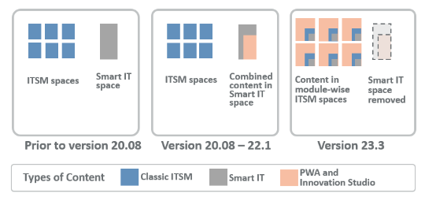

The following video (3:15) provides an overview of documentation space restructure from ITSM version 23.3.

[🎥 Watch Video: https://www.youtube.com/watch?v=S6YhIgSV9lc](https://www.youtube.com/watch?v=S6YhIgSV9lc)

[Watch the YouTube video about the documentation space restructure](https://youtu.be/S6YhIgSV9lc?si=IaLw_UXDLXWC9RL5)

## Structure within a topic

At a topic level, we have segregated the information so that it is easier for you to follow the latest information. Based on your requirement, you can also read information related to older screens in the same topic. For example, if you are reading about a procedure that can be performed by using PWA screens, classic Smart IT, and Mid Tier, the topic will display the information related to the PWA screens at the top. If you want, you can read the relevant information for the classic interfaces (Classic Smart IT and Mid Tier) by going to the**Instructions for classic interfaces**section of the topic.

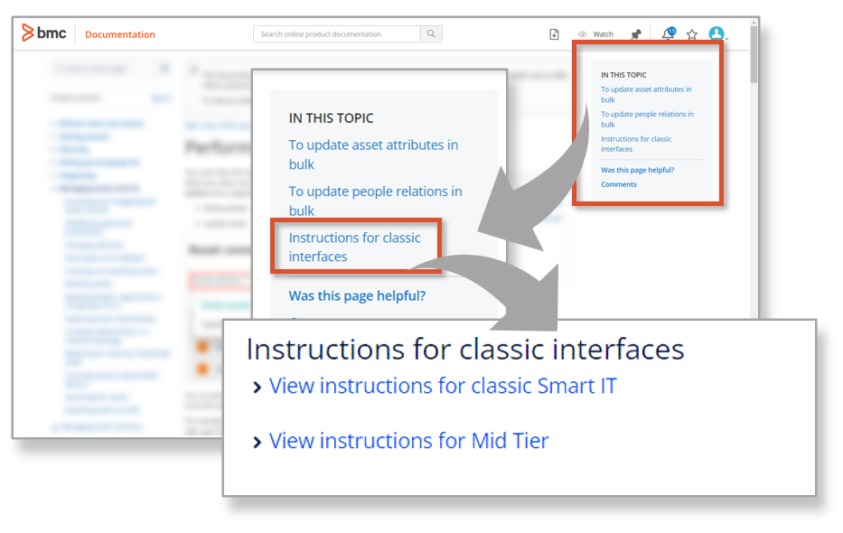

## Popular links

See the following links to some of the popular content across the ITSM documentation spaces.

Service desk

* [Learning about Incident Management](https://docs.bmc.com/xwiki/bin/view/Service-Management/IT-Service-Management/BMC-Helix-ITSM-Service-Desk/servicedesk233/Getting-started/Learning-about-Incident-Management/)
* [Learning about Problem Management](https://docs.bmc.com/xwiki/bin/view/Service-Management/IT-Service-Management/BMC-Helix-ITSM-Service-Desk/servicedesk233/Getting-started/Learning-about-Problem-Management/)
* [Managing incident requests](https://docs.bmc.com/xwiki/bin/view/Service-Management/IT-Service-Management/BMC-Helix-ITSM-Service-Desk/servicedesk233/Managing-incident-requests/)
* [Managing problem investigations and known errors](https://docs.bmc.com/xwiki/bin/view/Service-Management/IT-Service-Management/BMC-Helix-ITSM-Service-Desk/servicedesk233/Managing-problem-investigations-and-known-errors/)
* [Managing work on tickets by using tasks](https://docs.bmc.com/xwiki/bin/view/Service-Management/IT-Service-Management/BMC-Helix-ITSM-Service-Desk/servicedesk233/Managing-work-on-tickets-by-using-tasks/)

Change Management

* [Learning about Change Management](https://docs.bmc.com/xwiki/bin/view/Service-Management/IT-Service-Management/BMC-Helix-ITSM-Change-Management/change233/Getting-started/Learning-about-Change-Management/)
* [Learning about Release Management](https://docs.bmc.com/xwiki/bin/view/Service-Management/IT-Service-Management/BMC-Helix-ITSM-Change-Management/change233/Getting-started/Learning-about-Release-Management/)
* [Learning about Task Management](https://docs.bmc.com/xwiki/bin/view/Service-Management/IT-Service-Management/BMC-Helix-ITSM-Change-Management/change233/Getting-started/Learning-about-Task-Management/)
* [Managing change](https://docs.bmc.com/xwiki/bin/view/Service-Management/IT-Service-Management/BMC-Helix-ITSM-Change-Management/change233/Managing-change/)
* [Managing release](https://docs.bmc.com/xwiki/bin/view/Service-Management/IT-Service-Management/BMC-Helix-ITSM-Change-Management/change233/Managing-releases/)

Asset Management

* [ITSM: Asset management overview](https://docs.bmc.com/xwiki/bin/view/Service-Management/IT-Service-Management/BMC-Helix-ITSM-Asset-Management/asset233/Getting-started/BMC-Helix-ITSM-Asset-Management-overview/)
* [Getting started with Asset Management](https://docs.bmc.com/xwiki/bin/view/Service-Management/IT-Service-Management/BMC-Helix-ITSM-Asset-Management/asset233/Getting-started/Getting-started-with-Asset-Management/)
* [Managing contracts](https://docs.bmc.com/xwiki/bin/view/Service-Management/IT-Service-Management/BMC-Helix-ITSM-Asset-Management/asset233/Managing-contracts/)
* [Use cases](https://docs.bmc.com/xwiki/bin/view/Service-Management/IT-Service-Management/BMC-Helix-ITSM-Asset-Management/asset233/Getting-started/Use-cases/)
* [Key concepts](https://docs.bmc.com/xwiki/bin/view/Service-Management/IT-Service-Management/BMC-Helix-ITSM-Asset-Management/asset233/Getting-started/Key-concepts/)

Knowledge Management

* [Learning about Knowledge Management](https://docs.bmc.com/xwiki/bin/view/Service-Management/IT-Service-Management/BMC-Helix-ITSM-Knowledge-Management/km233/Getting-started/Learning-about-Knowledge-Management/)
* [Creating and publishing knowledge articles](https://docs.bmc.com/xwiki/bin/view/Service-Management/IT-Service-Management/BMC-Helix-ITSM-Knowledge-Management/km233/Creating-and-publishing-knowledge-articles/)
* [Use cases](https://docs.bmc.com/xwiki/bin/view/Service-Management/IT-Service-Management/BMC-Helix-ITSM-Knowledge-Management/km233/Getting-started/Use-cases/)
* [Improving the findability of knowledge articles](https://docs.bmc.com/xwiki/bin/view/Service-Management/IT-Service-Management/BMC-Helix-ITSM-Knowledge-Management/km233/Improving-the-findability-of-knowledge-articles/)
* [Reviewing and improving knowledge articles](https://docs.bmc.com/xwiki/bin/view/Service-Management/IT-Service-Management/BMC-Helix-ITSM-Knowledge-Management/km233/Reviewing-and-improving-knowledge-articles/)

Service Request Management

* [Learning about Service Request Management](https://docs.bmc.com/xwiki/bin/view/Service-Management/IT-Service-Management/BMC-Service-Request-Management/srm233/Getting-started/Learning-about-BMC-Service-Request-Management/)
* [Managing work orders](https://docs.bmc.com/xwiki/bin/view/Service-Management/IT-Service-Management/BMC-Service-Request-Management/srm233/Managing-work-orders/)
* [Managing service requests](https://docs.bmc.com/xwiki/bin/view/Service-Management/IT-Service-Management/BMC-Service-Request-Management/srm233/Managing-service-requests/)
* [Building the service catalog](https://docs.bmc.com/xwiki/bin/view/Service-Management/IT-Service-Management/BMC-Service-Request-Management/srm233/Building-the-service-catalog/)

We recommend that you use[DWP](https://docs.bmc.com/xwiki/bin/view/Service-Management/Employee-Digital-Workplace/BMC-Helix-Digital-Workplace/dwp233/)for managing service requests

ITSM (Foundation)

* [ITSM suite overview](https://docs.bmc.com/xwiki/bin/view/Service-Management/IT-Service-Management/BMC-Helix-ITSM/itsm233/Getting-started/BMC-Helix-ITSM-suite-overview/)
* [Use cases](https://docs.bmc.com/xwiki/bin/view/Service-Management/IT-Service-Management/BMC-Helix-ITSM/itsm254/Getting-started/Use-cases/)
* [Key concepts](https://docs.bmc.com/xwiki/bin/view/Service-Management/IT-Service-Management/BMC-Helix-ITSM/itsm233/Getting-started/Key-concepts/)
* [Navigating common interfaces](https://docs.bmc.com/xwiki/bin/view/Service-Management/IT-Service-Management/BMC-Helix-ITSM/itsm233/Navigating-common-interfaces/)
* [Setting up and going live](https://docs.bmc.com/xwiki/bin/view/Service-Management/IT-Service-Management/BMC-Helix-ITSM/itsm233/Setting-up-and-going-live/)

## What's next

We constantly strive to give the best experience to our customers. Use the comments box that is available at the bottom of each topic to let us know your feedback about the topic.We will soon get back to you with the updates.

---

