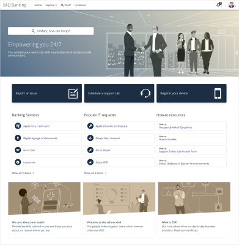

announces a change in the catalog sections framework that defines how catalog sections are displayed for end users in DWP.

**Important**

While every effort is made to provide accurate, forward-looking guidance on product direction to assist you with your buying and planning decisions, cannot guarantee that intentions stated as follows are final and binding.

Related topics

[Support-information](https://docs.bmc.com/xwiki/bin/view/Service-Management/Employee-Digital-Workplace/BMC-Helix-Digital-Workplace/dwp254/Troubleshooting/Support-information/)

[Release-notes-and-notices](https://docs.bmc.com/xwiki/bin/view/Service-Management/Employee-Digital-Workplace/BMC-Helix-Digital-Workplace/dwp254/Release-notes-and-notices/)

[Deprecated-and-discontinued-features](https://docs.bmc.com/xwiki/bin/view/Service-Management/Employee-Digital-Workplace/BMC-Helix-Digital-Workplace/dwp254/Release-notes-and-notices/Deprecated-and-discontinued-features/)

## Background

DWPprovides the catalog section with tile framework for studio pages (custom pages). This framework allows for many layout options such as cards, color theme, and number of cards to be displayed. You can specify the color theme (light or dark), and whether the cards have a drop shadow. Additionally, you can set the tile size in catalog sections as compact, default, or large to suit the page layout.

The following image is an example of how catalog sections appear after configuring the tile framework:

## Statement of direction

has enabled the tile framework of catalog sections by default.Customers might notice a change in the layout of sections and might need to adjust the studio pages to align with the new framework.

## Transition period

The catalog sections with tile framework is enabled by default from this release.