# Documentation Reference: Hkm 25.4

## Table of Contents
- [Assigning-Knowledge-Article-Ownership-To-User-Grou.md](#assigning-knowledge-article-ownership-to-user-groumd)
- [Configuring-The-Knowledge-Curator-Agent.md](#configuring-the-knowledge-curator-agentmd)
- [Creating-Dashboards-For-Hkm.md](#creating-dashboards-for-hkmmd)
- [Creating-User-Groups-And-Assigning-Content-Access.md](#creating-user-groups-and-assigning-content-accessmd)
- [Getting-Started.md](#getting-startedmd)
- [Getting-Started/Hkm-Architecture.md](#getting-startedhkm-architecturemd)
- [Getting-Started/Product-Overview.md](#getting-startedproduct-overviewmd)
- [Getting-Started/Use-Cases.md](#getting-starteduse-casesmd)
- [Getting-Started/Use-Cases/Learning-About-Kcs-V6-Verified.md](#getting-starteduse-caseslearning-about-kcs-v6-verifiedmd)
- [Getting-Started/Use-Cases/Leveraging-Hkm-Articles-In-Other-Applications.md](#getting-starteduse-casesleveraging-hkm-articles-in-other-applicationsmd)
- [Getting-Started/Use-Cases/Leveraging-Knowledge-Articles-As-A-Data-Source-For.md](#getting-starteduse-casesleveraging-knowledge-articles-as-a-data-source-formd)
- [Getting-Started/User-Interface-Overview.md](#getting-starteduser-interface-overviewmd)
- [Getting-Started/Using-This-Documentation.md](#getting-startedusing-this-documentationmd)
- [Integrating-With-Third-Party-Applications-By-Using.md](#integrating-with-third-party-applications-by-usingmd)
- [Release-Notes-And-Notices.md](#release-notes-and-noticesmd)
- [Release-Notes-And-Notices/25.3-Enhancements-And-Patches.md](#release-notes-and-notices253-enhancements-and-patchesmd)
- [Release-Notes-And-Notices/25.4-Enhancements-And-Patches.md](#release-notes-and-notices254-enhancements-and-patchesmd)
- [Release-Notes-And-Notices/Deprecated-And-Discontinued-Features.md](#release-notes-and-noticesdeprecated-and-discontinued-featuresmd)
- [Setting-Up-And-Going-Live.md](#setting-up-and-going-livemd)
- [Troubleshooting.md](#troubleshootingmd)
- [Troubleshooting/Troubleshooting-Access-To-Help-Articles.md](#troubleshootingtroubleshooting-access-to-help-articlesmd)
- [Troubleshooting/Troubleshooting-Product-Issues.md](#troubleshootingtroubleshooting-product-issuesmd)
- [Validating-Articles-By-Using-The-Knowledge-Curator.md](#validating-articles-by-using-the-knowledge-curatormd)

---

## Assigning-Knowledge-Article-Ownership-To-User-Grou.md

**Important**

The features and enhancements in this topic are available only to customers that have been migrated to the new content storage solution. For more information about the migration,[contact](https://docs.bmc.com/xwiki/bin/view/Service-Management/Employee-Digital-Workplace/BMC-Helix-Knowledge-Management-by-ComAround/hkm/Support-information/)Support.

As a knowledge worker with edit content permission, you can assign ownership of knowledge articles to various user groups within your organization. For more information about user roles and permissions, see[Product overview](https://docs.bmc.com/xwiki/bin/view/Service-Management/Employee-Digital-Workplace/BMC-Helix-Knowledge-Management-by-ComAround/hkm/Getting-started/Product-overview/).

With this capability, you can ensure content visibility by assigning or updating the ownership of knowledge articles when necessary, preventing articles from becoming outdated or neglected. You can also drive accountability and collaboration by quickly identifying the relevant point of contact for clarifications and updates in the knowledge articles.

**Important**

This capability is only available in Knowledge vNext interface. For more information about HKM interfaces, see[User interface overview](https://docs.bmc.com/xwiki/bin/view/Service-Management/Employee-Digital-Workplace/BMC-Helix-Knowledge-Management-by-ComAround/hkm/Getting-started/User-interface-overview/).

# Role-based ownership permissions

​​​​​​The scope of ownership assignment capabilities is based on the role of the knowledge worker. The table below outlines which roles can assign ownership and to whom:

| Knowledge worker role | Can assign ownership to |
| --- | --- |
| Knowledge manager | Any user group within the organization |
| * Knowledge candidate * Knowledge contributor * Knowledge publisher * Knowledge coach | The user groups that these knowledge workers belong to |
| Knowledge reader | Can't assign or view knowledge article ownership |

# To assign knowledge article ownership

1. As a knowledge worker, login to HKM.
2. Either open an existing knowledge article in edit mode or click**Article editor**to create a new article.
3. Use the**Assignee Group**field to assign ownership to the required user group.

   **Important**

   The Assignee Group field is only visible and accessible when a knowledge article is opened in edit mode.

   You can either enter the name of the user group in the**Assignee Group**field to search for it, or you can select the relevant one from the list menu that displays when you click the**Assignee Group**field.

   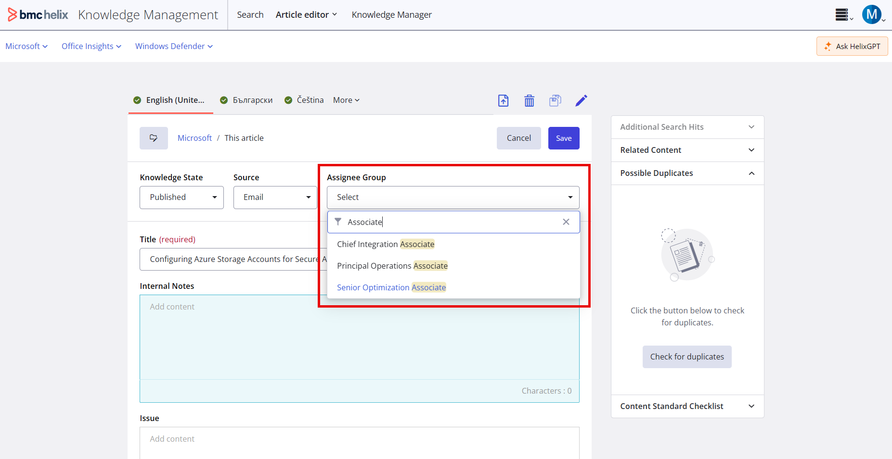

   **Important**

   Assignee group is not a mandatory field. You can leave it blank if you don't want to assign ownership.

4. Click**Save**.

The ownership to the selected user group has been assigned. You can add, remove, or update the**Assigned Group**field for any knowledge article.

# To view knowledge article ownership in Library report

As a knowledge worker, you can use the Library report to get the ownership information about your knowledge articles:

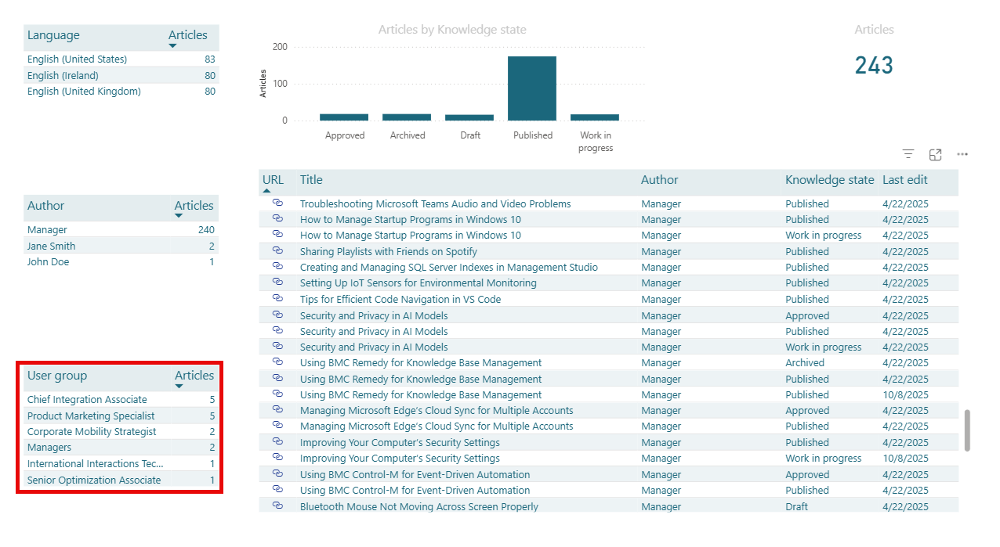

Use the user group filter to list articles of any particular user group:

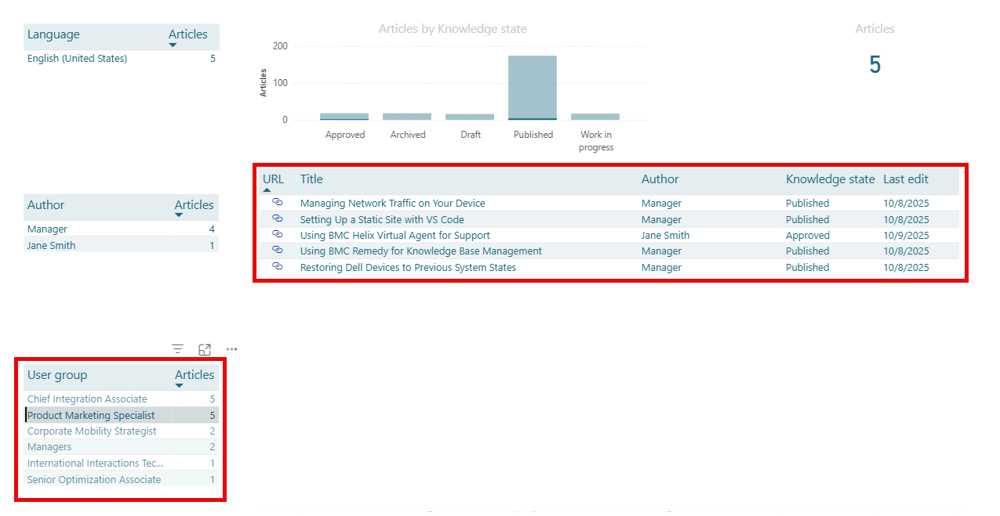

---

## Configuring-The-Knowledge-Curator-Agent.md

Knowledge Curator is a HelixGPT-powered agent that uses generative AI capabilities to accomplish the following goals:

* Validate knowledge articles in HKM.
* Generate new knowledge articles inHKM from Business Workflows cases.
* Generate new knowledge articles inHKM from ITSM incidents.

As an administrator, you can configure the Knowledge Curator agent for HKM.

Related topics

[Models in HelixGPT](https://docs.bmc.com/xwiki/bin/view/Service-Management/Employee-Digital-Workplace/BMC-HelixGPT/helixgpt254/Getting-started/Key-concepts/Models-in-BMC-HelixGPT/)

[Provisioning and setting up the generative AI provider for your application](https://docs.bmc.com/xwiki/bin/view/Service-Management/Employee-Digital-Workplace/BMC-HelixGPT/helixgpt254/Setting-up-and-going-live/Provisioning-and-setting-up-the-generative-AI-provider-for-your-application/)

[AI Agents in HelixGPT](https://docs.bmc.com/xwiki/bin/view/Service-Management/Employee-Digital-Workplace/BMC-HelixGPT/helixgpt254/AI-agents-in-BMC-HelixGPT/)

## Overview of the supported capabilities

After the Knowledge Curator agent is configured, users can utilize the following capabilities that the Knowledge Curator provides:

| Capability | Description | Available in | Roles that can use this capability | Reference |
| --- | --- | --- | --- | --- |
| Validate knowledge articles in HKM | Knowledge Curator utilizes prompt instructions to review articles for quality and recommend improvements based on the Knowledge-Centered Service (KCS) principles. For more information about the KCS principles, see[Learning about KCS v6 verified HKM](https://docs.bmc.com/xwiki/bin/view/Service-Management/Employee-Digital-Workplace/BMC-Helix-Knowledge-Management-by-ComAround/hkm/Getting-started/Use-cases/Learning-about-KCS-v6-verified-BMC-Helix-Knowledge-Management-by-ComAround/). Knowledge workers can use this capability to improve article quality and save time and effort in reviewing articles.  | This capability is available for , Inc. customers that use HKM as a knowledge provider for ITSM and Business Workflows. | Knowledge worker roles in HKM that can create and edit articles For example, Knowledge candidate is the basic knowledge worker role that has editing access to knowledge articles, specifically those that are in progress or in draft. Higher-level roles have access to articles in additional states. For more information about different user roles, see[User roles](https://docs.bmc.com/xwiki/bin/view/Service-Management/Employee-Digital-Workplace/BMC-Helix-Knowledge-Management-by-ComAround/hkm/Getting-started/Product-overview/#roles).  | * Learn how to configure this capability in[Workflow for configuring Knowledge Curator to validate articles](https://docs.bmc.com/xwiki/bin/view/Service-Management/Employee-Digital-Workplace/BMC-Helix-Knowledge-Management-by-ComAround/hkm/Configuring-the-Knowledge-Curator-agent-for-BMC-Helix-Knowledge-Management-by-ComAround/#validate). * To learn how to use this capability, see[Validating articles by using the Knowledge Curator agent](https://docs.bmc.com/xwiki/bin/view/Service-Management/Employee-Digital-Workplace/BMC-Helix-Knowledge-Management-by-ComAround/hkm/Validating-articles-by-using-the-Knowledge-Curator-agent/). |
| Generate new knowledge articles in HKM from Business Workflows cases | Knowledge Curator utilizes prompt instructions to create a knowledge article from a case that contains information about resolving case-related issues. The article is generated based on the KCS principles, and the article type is KCS article. By default, the article is created in the Work in progress (WIP) status that can be changed by the author. Mapping of knowledge access permissions from Business Workflows to HKM determines access to the created article. For more information, see[Mapping knowledge permissions from applications to HKM](https://docs.bmc.com/xwiki/bin/view/Service-Management/Innovation-Suite/BMC-Helix-Innovation-Suite/is254/Enabling-services/Configuring-BMC-Helix-Knowledge-Management-by-ComAround-as-a-knowledge-provider/Mapping-knowledge-permissions-from-BMC-applications-to-BMC-Helix-Knowledge-Management-by-ComAround/). If another article with a similar content already exists, knowledge workers can use the duplicate detection capability in HKM. **Important:**Customers using Business Workflows must always configure both capabilities—the capability to*validate*and*generate*knowledge articles. It is not possible to generate knowledge articles without first configuring the capability to validate them. These two capabilities are designed to work together. For example, a case agent can create an article from a case and then review it for quality.  | This capability is available for customers that use HKM as a knowledge provider for Business Workflows. | Case agents that have knowledge worker roles that can create and edit articles in HKM. Also, case agents*must*have write access to knowledge articles.  | * Learn how to configure this capability in[Workflow for configuring Knowledge Curator to generate articles from Business Workflows cases](https://docs.bmc.com/xwiki/bin/view/Service-Management/Employee-Digital-Workplace/BMC-Helix-Knowledge-Management-by-ComAround/hkm/Configuring-the-Knowledge-Curator-agent-for-BMC-Helix-Knowledge-Management-by-ComAround/#generate). * To learn how to use this capability, see[Automatically generating and validating knowledge articles](https://docs.bmc.com/xwiki/bin/view/Service-Management/Enterprise-Service-Management/BMC-Helix-Business-Workflows/bwf254/Managing-and-developing-knowledge-articles/Automatically-generating-knowledge-articles/). |
| Generate new knowledge articles in HKM from ITSM incidents. | Knowledge Curator utilizes prompt instructions to create a knowledge article by using the incident data, such as summary, description, and work log entries any time during the incident lifecycle.  The article is generated based on the KCS principles, and the article type is KCS article. By default, the article is created in the**Work in progress (WIP)**status that can be changed by the author. After the article is created, it is automatically pinned to the incident. Mapping of knowledge access permissions from ITSM to HKM determines access to the created article. For more information, see[Mapping knowledge permissions from applications to HKM](https://docs.bmc.com/xwiki/bin/view/Service-Management/Innovation-Suite/BMC-Helix-Innovation-Suite/is254/Enabling-services/Configuring-BMC-Helix-Knowledge-Management-by-ComAround-as-a-knowledge-provider/Mapping-knowledge-permissions-from-BMC-applications-to-BMC-Helix-Knowledge-Management-by-ComAround/). **Important:**Customers using ITSM must always configure both capabilities—the capability to*validate*and*generate*knowledge articles. It is not possible to generate knowledge articles without first configuring the capability to validate them. These two capabilities are designed to work together.  | This capability is available for customers that use HKM as a knowledge provider for ITSM. | Service Desk Agents who have knowledge user permissions can create and edit articles in HKM. | * Learn how to configure this capability, see[Enabling the creation of knowledge articles from incidents by using Knowledge Curator](https://docs.bmc.com/xwiki/bin/view/Service-Management/IT-Service-Management/BMC-Helix-ITSM/itsm254/Setting-up-and-going-live/Configuring-settings-to-use-Agentic-AI-capabilities/Enabling-the-creation-of-knowledge-articles-from-incidents-by-using-Knowledge-Curator/).  * To learn how to use this capability, see[Creating knowledge articles from incidents by using Knowledge Curator - Documentation](https://docs.bmc.com/xwiki/bin/view/Service-Management/IT-Service-Management/BMC-Helix-ITSM-Service-Desk/servicedesk254/Managing-incident-requests/Creating-knowledge-articles-from-incidents-by-using-Knowledge-Curator/). |

Important

Knowledge Curator doesn’t support finding answers or guidance based on knowledge articles from external sources, such as Confluence.

## Before you begin

* Make sure that you have the following licenses and permissions. These licenses and permissions are required to configure the capabilities to validate and generate knowledge articles.
  + [Service Management Advanced license](https://docs.bmc.com/xwiki/bin/view/Helix-Common-Services/Other/BMC-Helix-Subscriber-Information/helixsubscriber/BMC-Helix-services/BMC-Helix-Service-Management-service/)and administrator permissions in HelixGPT.
  + Knowledge manager role inHKM.  
    For more information about different user roles inHKM, see[User roles](https://docs.bmc.com/xwiki/bin/view/Service-Management/Employee-Digital-Workplace/BMC-Helix-Knowledge-Management-by-ComAround/hkm/Getting-started/Product-overview/#roles). Learn how to grant roles to a user in[Add user (HKM)](https://zero.comaround.com/en-us/content/971335/?ctxt=search#/)and[User groups in administration tool (HKM)](https://zero.comaround.com/en-us/content/970339/?ctxt=search#/).

    **Important**

    To access these help articles, you must first subscribe, and then log in to HKM. You subscribe to HKM by purchasing the[Service Management Advanced license](https://docs.bmc.com/xwiki/bin/view/Helix-Common-Services/Other/BMC-Helix-Subscriber-Information/helixsubscriber/BMC-Helix-services/BMC-Helix-Service-Management-service/)license. HKM is also available to customers with entitlements in[Virtual Agent Basic](https://docs.bmc.com/xwiki/bin/view/Helix-Common-Services/Other/BMC-Helix-Subscriber-Information/helixsubscriber/BMC-Helix-services/BMC-Helix-Virtual-Agent-Basic-service/)and[Virtual Agent Advanced](https://docs.bmc.com/xwiki/bin/view/Helix-Common-Services/Other/BMC-Helix-Subscriber-Information/helixsubscriber/BMC-Helix-services/BMC-Helix-Virtual-Agent-Advanced-service/)subscriptions.

* To configure the capability to generate knowledge articles from Business Workflows cases, make sure that you meet the following requirements:
  + You have configuredHKM as a knowledge provider forBusiness Workflows.
  + You have the Administrator and Case business analyst roles in Business Workflows.

* To configure the capability to generate knowledge articles from ITSM incidents, make sure that you meet the following requirements:
  + You have configuredHKMas a knowledge provider forITSM.
  + You have the administrator and knowledge user permissions in ITSM.

* As a HelixGPT administrator, deploy a Large Language Model (LLM) service from a supported vendor of your choice, get the API key and other configuration parameters, and add them in the HelixGPT administrator UI. For more information, see[Provisioning and setting up the generative AI provider for your application](https://docs.bmc.com/xwiki/bin/view/Service-Management/Employee-Digital-Workplace/BMC-HelixGPT/helixgpt254/Setting-up-and-going-live/Provisioning-and-setting-up-the-generative-AI-provider-for-your-application/).

## Workflow for configuring Knowledge Curator to validate articles

The following image provides an overview of the workflow to configure the Knowledge Curator agent to validate knowledge articles:

| Action  | Role  | Description  | Reference  |
| --- | --- | --- | --- |
| Add Knowledge Curator as a custom agent of the Helix Knowledge Curator - Validate type.  | HelixGPT administrator | Add Knowledge Curator as a custom agent in HelixGPT Agent Studio. When you create the custom agent, make sure to select the specific values for the following settings:   * In the**Type**field, select**Helix Knowledge Curator - Validate**. * In the**Instructions**text area, copy and paste the following default prompt text or specify your own instructions:  [Default prompt to validate articles](https://docs.bmc.com/xwiki/bin/download/Service-Management/Employee-Digital-Workplace/BMC-Helix-Knowledge-Management-by-ComAround/hkm/Configuring-the-Knowledge-Curator-agent-for-BMC-Helix-Knowledge-Management-by-ComAround/WebHome/The%20default%20prompt%20to%20validate%20articles.pdf?rev=1.1)(Click to download the PDF copy.) **Important** If you configured the Knowledge Curator agent in version 25.1 by creating the Agent record in IS, the functionality will continue to work in later versions. You will notice that Knowledge Curator is now included as a custom agent in HelixGPT Agent Studio.  | The*To add a custom AI agent*procedure in[Creating and managing agents by using the Agent Studio editor](https://docs.bmc.com/xwiki/bin/view/Service-Management/Employee-Digital-Workplace/BMC-HelixGPT/helixgpt254/Administering/Managing-AI-agents/).  |
| Copy the Agent ID.  | HelixGPT administrator  | After you create a custom agent of the Helix Knowledge Curator - Validate type, copy the ID of this agent. You will use this ID while[configuring the Knowledge Curator agent in HKM](https://docs.bmc.com/xwiki/bin/view/Service-Management/Employee-Digital-Workplace/BMC-Helix-Knowledge-Management-by-ComAround/hkm/Configuring-the-Knowledge-Curator-agent-for-BMC-Helix-Knowledge-Management-by-ComAround/#.ConfiguringtheKnowledgeCuratoragentforBMCHelixKnowledgeManagementbyComAroundv25.1-configs).  | [To copy the ID of a created agent](https://docs.bmc.com/xwiki/bin/view/Service-Management/Employee-Digital-Workplace/BMC-Helix-Knowledge-Management-by-ComAround/hkm/Configuring-the-Knowledge-Curator-agent-for-BMC-Helix-Knowledge-Management-by-ComAround/#agent_id) |
| Configure the Knowledge Curator agent.  | Knowledge manager inHKM  | Configure and enable the Knowledge Curator agent in HKM.  | [To configure the Knowledge Curator agent in HKM](https://docs.bmc.com/xwiki/bin/view/Service-Management/Employee-Digital-Workplace/BMC-Helix-Knowledge-Management-by-ComAround/hkm/Configuring-the-Knowledge-Curator-agent-for-BMC-Helix-Knowledge-Management-by-ComAround/#.ConfiguringtheKnowledgeCuratoragentforBMCHelixKnowledgeManagementbyComAroundv25.1-configs)  |

## Workflow for configuring Knowledge Curator to generate articles from ITSM incidents

The following table provides an overview of the workflow to configure the Knowledge Curator agent to automatically generate articles from ITSM incidents:

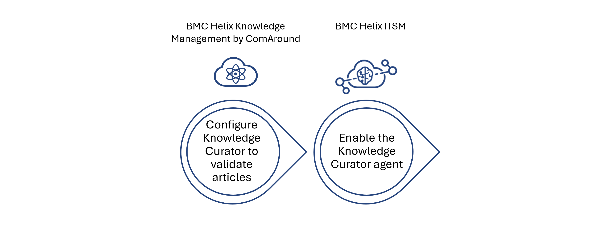

| **Action** | **Role** | **Description** | **Reference** |
| --- | --- | --- | --- |
| Configure the Knowledge Curator agent to validate articles in HKM. | Multiple roles needed | Complete the process to configure the Knowledge Curator agent to validate articles. **Important:**To configure the capability to generate articles from incidents, you must first set up the capability to validate articles.  | [Workflow for configuring Knowledge Curator to validate articles](https://docs.bmc.com/xwiki/bin/view/Service-Management/Employee-Digital-Workplace/BMC-Helix-Knowledge-Management-by-ComAround/hkm/Configuring-the-Knowledge-Curator-agent-for-BMC-Helix-Knowledge-Management-by-ComAround/#validate) |
| Enable Knowledge Curator in ITSM. | ITSM Administrator | To start using Knowledge Curator, you must enable the**Enable HelixGPT Knowledge Curator**option in the HPD:CFG-Rules incident rule form. | [Enabling the creation of knowledge articles from incidents by using Knowledge Curator](https://docs.bmc.com/xwiki/bin/view/Service-Management/IT-Service-Management/BMC-Helix-ITSM/itsm254/Setting-up-and-going-live/Configuring-settings-to-use-Agentic-AI-capabilities/Enabling-the-creation-of-knowledge-articles-from-incidents-by-using-Knowledge-Curator/). |

**Important**  
If you're using the Gemini 2.5 Flash model by Google with ITSM and the Knowledge Curator agent, you might receive blank responses when attempting to create a knowledge article. As a workaround, replace the prompt for the ITSM - Generate HKM Article agent in HelixGPT Agent Studio. Replace the existing prompt with the following prompt:[ITSM\_Knowledge\_Curator\_Generate\_prompt.zip](https://docs.bmc.com/xwiki/bin/download/Service-Management/Employee-Digital-Workplace/BMC-Helix-Knowledge-Management-by-ComAround/hkm/Configuring-the-Knowledge-Curator-agent-for-BMC-Helix-Knowledge-Management-by-ComAround/WebHome/ITSM_Knowledge_Curator_Generate_prompt.zip?rev=1.1)(Click to download the zip file containing the prompt in the .md format.)

Learn how to edit the agent in[Managing AI agents](https://docs.bmc.com/xwiki/bin/view/Service-Management/Employee-Digital-Workplace/BMC-HelixGPT/helixgpt254/Administering/Managing-AI-agents/).

## Workflow for configuring Knowledge Curator to generate articles from Business Workflows cases

The following image provides an overview of the workflow to configure the Knowledge Curator agent to automatically generate articles from Business Workflows cases:

| Action  | Role  | Description  | Reference  |
| --- | --- | --- | --- |
| Configure the Knowledge Curator agent to validate articles in HKM. | Multiple roles needed | Complete the process to configure the Knowledge Curator agent to validate articles. **Important:**To configure the capability to generate articles from cases, you must first set up the capability to validate articles.  | [Workflow for configuring Knowledge Curator to validate articles](https://docs.bmc.com/xwiki/bin/view/Service-Management/Employee-Digital-Workplace/BMC-Helix-Knowledge-Management-by-ComAround/hkm/Configuring-the-Knowledge-Curator-agent-for-BMC-Helix-Knowledge-Management-by-ComAround/#validate) |
| *(Llama model only)*Update the prompt.  | HelixGPT administrator | For knowledge article generation, the**BWF - Generate HKM Article**agent is added out of the box in HelixGPT Agent Studio. To use the out-of-the-box agent for the Llama model, update the prompt. [Sample prompt for BWF - Generate HKM Article Llama model](https://docs.bmc.com/xwiki/bin/download/Service-Management/Employee-Digital-Workplace/BMC-Helix-Knowledge-Management-by-ComAround/hkm/Configuring-the-Knowledge-Curator-agent-for-BMC-Helix-Knowledge-Management-by-ComAround/WebHome/Sample%20prompt%20for%20BWF%20-%20Generate%20HKM%20Article%20Llama%20model.pdf?rev=1.1)(Click to download the PDF copy.) **Important**: For the Azure and Gemini models, the prompts are included out-of-the-box in HelixGPT Agent Studio.  | The*Task 1: (Llama model only) To update the prompt for the out-of-the-box agent*​​​​​procedure in[Enabling automatic knowledge article generation and validation by using Knowledge Curator](https://docs.bmc.com/xwiki/bin/view/Service-Management/Enterprise-Service-Management/BMC-Helix-Business-Workflows/bwf254/Configuring-a-line-of-business/Defining-configurations-for-BMC-HelixGPT/Automating-knowledge-article-generation-through-the-Knowledge-Curator-agent/).  |
| Enable the Knowledge Curator agent in Business Workflows. | Business Workflows administrator | Enable the Knowledge Curator agent in Business Workflows. | The*Task 2: To enable the Knowledge Curator agent for a line of business*procedure in[Enabling automatic knowledge article generation and validation by using Knowledge Curator](https://docs.bmc.com/xwiki/bin/view/Service-Management/Enterprise-Service-Management/BMC-Helix-Business-Workflows/bwf254/Configuring-a-line-of-business/Defining-configurations-for-BMC-HelixGPT/Automating-knowledge-article-generation-through-the-Knowledge-Curator-agent/). |
| Copy the agent ID. | HelixGPT administrator | Copy the ID of the**BWF - Generate HKM Article**agent. You will add this[ID to the Knowledge Curator skill in Business Workflows.](https://docs.bmc.com/xwiki/bin/view/Service-Management/Employee-Digital-Workplace/BMC-Helix-Knowledge-Management-by-ComAround/hkm/Configuring-the-Knowledge-Curator-agent-for-BMC-Helix-Knowledge-Management-by-ComAround/#skill_id)  | [To copy the agent ID](https://docs.bmc.com/xwiki/bin/view/Service-Management/Employee-Digital-Workplace/BMC-Helix-Knowledge-Management-by-ComAround/hkm/Configuring-the-Knowledge-Curator-agent-for-BMC-Helix-Knowledge-Management-by-ComAround/#agent_id) |
| Add the Agent ID to the Knowledge Curator skill in Business Workflows. | Case business analyst | Add the ID that you previously copied to the Knowledge Curator skill in Business Workflows. | The*Task 3: (For HKM only) To add the agent ID*procedure in[Enabling automatic knowledge article generation and validation by using Knowledge Curator](https://docs.bmc.com/xwiki/bin/view/Service-Management/Enterprise-Service-Management/BMC-Helix-Business-Workflows/bwf254/Configuring-a-line-of-business/Defining-configurations-for-BMC-HelixGPT/Automating-knowledge-article-generation-through-the-Knowledge-Curator-agent/). |

## To copy the agent ID

1. In HelixGPT Agent Studio, navigate to the Agents page.
2. At the top of the Agents table, click the**Visible columns**link and select**ID**.
3. Locate the table entry for the agent and copy the alphanumeric value in the ID column.

The following image shows the ID displayed in HelixGPT Agent Studio for the**BWF - Generate HKM Article**agent:

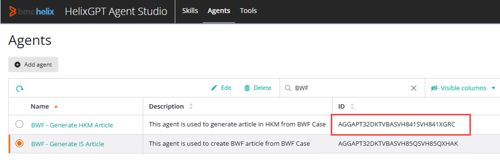

## To configure the Knowledge Curator agent in HKM

1. Launch HKM from ITSM or Business Workflows.

   **•**To launch HKM from ITSM, select**Console > Knowledge**.  
   **•**To launch HKMfrom Business Workflows, select**Workspace****> Knowledge**.

   ​​
2. Click**Settings**and select**Administration**.
3. In the**Portals**section, click the**Portal settings**button next to your portal.
4. On the Portal settings page, select**Platform specific settings**>**Knowledge Worker Platform**.
5. Configure**HelixGPT settings**by specifying the following fields:

   | Field  | Action  |
   | --- | --- |
   | Enable HelixGTP settings  | Turn this toggle key on to enable the Knowledge Curator agent for HKM.  |
   | IS URL  | Enter the URLof the IS instance that is associated with HKM.  |
   | IS username  | Enter the name of the user withAR System Administrator permissionswho can accessthis IS instance and call the HelixGPT agents API. **Important**: You cannot use , Inc. service accounts for this configuration. You must create a separate administrator user to complete these settings.  |
   | IS password  | Click**Change password**and enter the password of the user withAR System Administrator permissionswho can accessthis IS instance and call the HelixGPT agents API.  |
   | Validate Agent ID  | Enter the ID that you previously copied from HelixGPT Agent Studio after creating a custom agent of the Helix Knowledge Curator - Validate type.  |

   
6. Click**Save**.  
   ​​​​​

## Results

After you have configured the Knowledge Curator agent, users can utilize it to achieve the following goals:

* Validate knowledge articles in HKM. For more information about utilizing the Knowledge Curator agent to validate articles, see[Validating articles by using the Knowledge Curator agent](https://docs.bmc.com/xwiki/bin/view/Service-Management/Employee-Digital-Workplace/BMC-Helix-Knowledge-Management-by-ComAround/hkm/Validating-articles-by-using-the-Knowledge-Curator-agent/).
* Generate knowledge articles from Business Workflows cases.For more information about utilizing the Knowledge Curator agent to generate articles,see[Automatically generating and validating knowledge articles](https://docs.bmc.com/xwiki/bin/view/Service-Management/Enterprise-Service-Management/BMC-Helix-Business-Workflows/bwf254/Managing-and-developing-knowledge-articles/Automatically-generating-knowledge-articles/).
* Generate knowledge articles from ITSM incidents. For more information, see[Creating knowledge articles from incidents by using Knowledge Curator - Documentation](https://docs.bmc.com/xwiki/bin/view/Service-Management/IT-Service-Management/BMC-Helix-ITSM-Service-Desk/servicedesk254/Managing-incident-requests/Creating-knowledge-articles-from-incidents-by-using-Knowledge-Curator/).

The following image shows the validation capability of the Knowledge Curator agent:

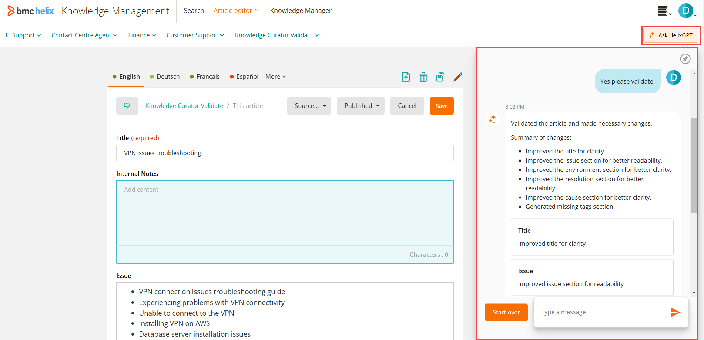

The following image shows the generation capability of the Knowledge Curator agent in Business Workflows:

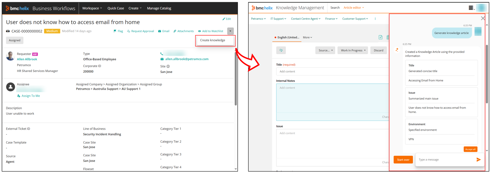

The following image shows the generation capability of the Knowledge Curator agent in ITSM:

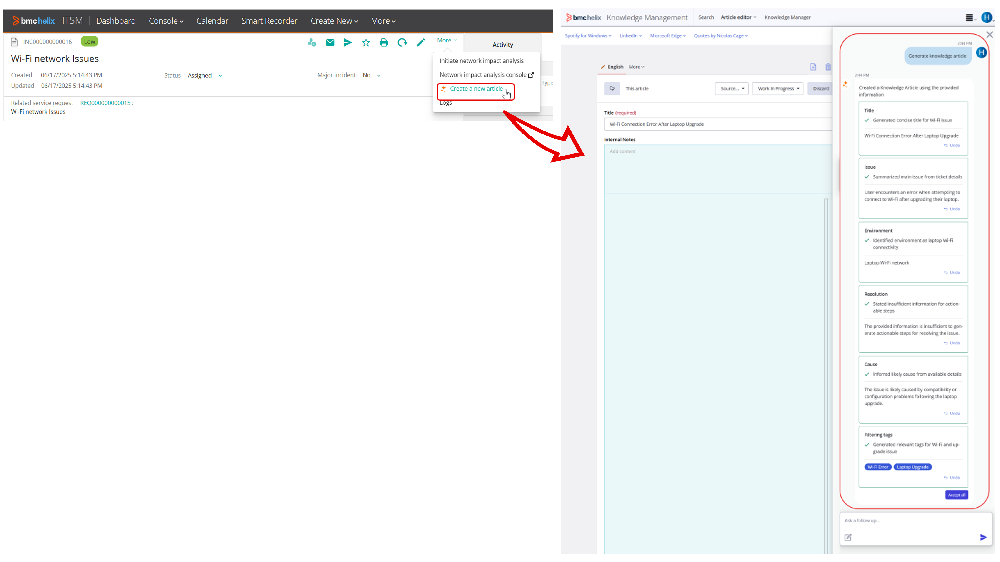

---

## Creating-Dashboards-For-Hkm.md

Use Dashboards to create custom dashboards that collect and visualize data from HKM. Dashboards provides unified reporting and a consolidated view of data from various applications within your environment. By creating custom dashboards for HKM, you can centralize all reports in one location and use them consistently.

Important

Out-of-the-box dasboards are not currently available for HKM.

Custom dashboards for HKM retrieve data from Microsoft Power BI (part of Microsoft Fabric) data sets, where your data and content are stored. You build a DAX query to extract data from any table in Microsoft Power BI (part of Microsoft Fabric), specifying which table to access and which fields to display. As a result, you have complete control over the output, and any data can be returned. Data retrieval is fully secure, occurring solely for your organization based on your Microsoft Entra ID. You can visualize the retrieved data by using the visualization plug-ins supported by Dashboards.

Important

Only , Inc. SaaS customers can create custom dashboards for HKM in Dashboards.

## Before you begin

Make sure that you use the following product versions:

* IS version 25.3.00 or later
* Dashboards version 25.3.00 or later

Make sure that you have the following licenses and permissions:

* Administrator permissions in IS.  
  Learn how to grant administrator permissions to a user in[Creating and modifying users](https://docs.bmc.com/xwiki/bin/view/Service-Management/Innovation-Suite/BMC-Helix-Innovation-Suite/is254/Administering/Setting-up-users-access-and-preferences/Creating-users-groups-and-roles/Creating-and-modifying-users/). Refer to Step 4 in the procedure*To create users,*specifically the**Group List**field.
* Reporting administrator or editor roles in Dashboards.  
  For more information about granting roles in Dashboards, see[Managing role-based access control in Dashboards](https://docs.bmc.com/xwiki/bin/view/Helix-Common-Services/Dashboards-Reports/BMC-Helix-Dashboards/BHD253/Administering/Managing-role-based-access-control-in-BMC-Helix-Dashboards/).

## Workflow for creating custom dashboards for HKM

The following overview shows the workflow to create a custom dashboard for HKM in Dashboards:

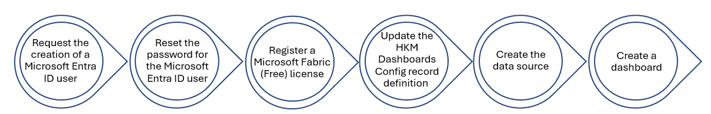

| Action | Application | Role | Description | Reference |
| --- | --- | --- | --- | --- |
| Request the creation of a user in Microsoft Entra ID. | Not applicable | Not applicable | Ask , Inc. Support to create a new user for your organization in Microsoft Entra ID. After the user is created, , Inc. Support will provide you with the user name and password for that user, along with the ClientId, DatasetId, and TenantId values. You will use these values[to configure the HKM Dashboards Config record definition](https://docs.bmc.com/xwiki/bin/view/Service-Management/Employee-Digital-Workplace/BMC-Helix-Knowledge-Management-by-ComAround/hkm/Creating-dashboards-for-BMC-Helix-Knowledge-Management-by-ComAround/#task3).  | Not applicable |
| Reset the password for the user created in Microsoft Entra ID. | Microsoft Power BI (part of Microsoft Fabric) | Not applicable | Set a new password for the user created in Microsoft Entra ID for your organization. You must update this password regularly.  | [Task 1: To reset the password for a user in Microsoft Entra ID](https://docs.bmc.com/xwiki/bin/view/Service-Management/Employee-Digital-Workplace/BMC-Helix-Knowledge-Management-by-ComAround/hkm/Creating-dashboards-for-BMC-Helix-Knowledge-Management-by-ComAround/#task1) |
| Register a Microsoft Fabric (Free) license for your organization. | Microsoft Power BI (part of Microsoft Fabric) | Not applicable | Assign a Microsoft Fabric (Free) license for your Microsoft Entra ID user. | [Task 2: To create a Microsoft Fabric (Free) license](https://docs.bmc.com/xwiki/bin/view/Service-Management/Employee-Digital-Workplace/BMC-Helix-Knowledge-Management-by-ComAround/hkm/Creating-dashboards-for-BMC-Helix-Knowledge-Management-by-ComAround/#task2) |
| Update the HKM Dashboards Config record definition. | IS | IS administrator | In IS, configure the HKM Dashboards Config record definition. | [Task 3: To configure the HKM Dashboards Config record definition](https://docs.bmc.com/xwiki/bin/view/Service-Management/Employee-Digital-Workplace/BMC-Helix-Knowledge-Management-by-ComAround/hkm/Creating-dashboards-for-BMC-Helix-Knowledge-Management-by-ComAround/#task3) |
| Create the data source in Dashboards. | Dashboards | Dashboards administrator | Add and configure the data source of the JSON API plug-in type. | [Task 4: To create the data source](https://docs.bmc.com/xwiki/bin/view/Service-Management/Employee-Digital-Workplace/BMC-Helix-Knowledge-Management-by-ComAround/hkm/Creating-dashboards-for-BMC-Helix-Knowledge-Management-by-ComAround/#task4) |
| Create a dashboard. | Dashboards | Reporting administrator or editor in Dashboards | Create a custom dashboard for HKM. | [Task 5: To create a custom dashboard for HKM](https://docs.bmc.com/xwiki/bin/view/Service-Management/Employee-Digital-Workplace/BMC-Helix-Knowledge-Management-by-ComAround/hkm/Creating-dashboards-for-BMC-Helix-Knowledge-Management-by-ComAround/#task5) |

## Task 1: To reset the password for a user in Microsoft entra ID

1. Navigate to<http://powerbi.com/>.  
   
2. Log in by using the user name and password provided by , Inc. Support for your Microsoft Entra ID user.
3. Update your password.  
   
4. When prompted to provide additional security information, click**Next**.  
   
5. Follow the onscreen instructions to set up the Microsoft Authenticator app as a primary authentication method.  
   For detailed instructions about how to set up the Microsoft Authenticator app, refer to[Set up Security info from a sign-in page](https://support.microsoft.com/en-us/account-billing/set-up-security-info-from-a-sign-in-page-28180870-c256-4ebf-8bd7-5335571bf9a8). Learn more about this authenticator app in[About Microsoft Authenticator](https://support.microsoft.com/en-us/account-billing/about-microsoft-authenticator-9783c865-0308-42fb-a519-8cf666fe0acc)
   1. Download and install the Microsoft Authenticator app on your mobile device.
   2. Set up your account.
   3. Connect the Microsoft Authenticator app with your account by scanning the QR code.
   4. Send a test notification to the application and approve it.
   5. Finish the setup.  
      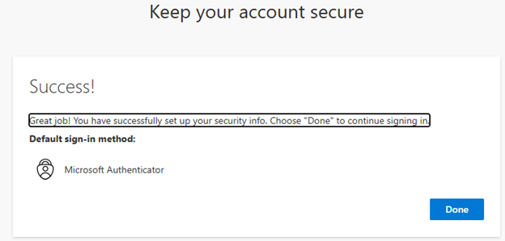
6. When prompted, click**Yes**to stay signed in.

## Task 2: To create a Microsoft Fabric (Free) license

To assign a Microsoft Fabric (Free) license for your Microsoft Entra ID user, complete the following steps:

1. Navigate to<http://powerbi.com/>.
2. Follow the onscreen instructions to create your account.  
   The following image illustrates the steps that you need to complete:

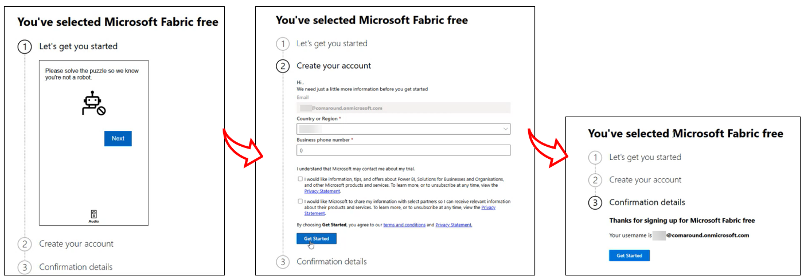

After your account is created, you will see a notification stating that a Microsoft Fabric (Free) license was assigned for your personal use. You account is ready to be connected to Dashboards.

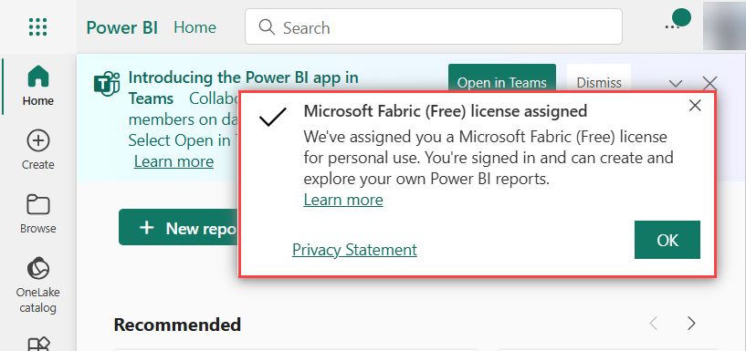

## Task 3: To configure the HKM Dashboards Config record definition

1. Log in to the IS environment that you shared with the , Inc. Support team.
2. On the**Workspace**tab, select**Chatbot > Records**.
3. On the**Records**tab, select**HKM Dashboards Config**and click**Edit data**.
4. On the Data Editor (HKM Dashboards Config) page, open the record.
5. On the Edit Recordpage,complete the following fields:
   * **ClientId**—Enter the client ID value that you received from , Inc. Support[earlier](#activation).
   * **DatasetId**—Enter the dataset ID value that you received from , Inc. Support[earlier](#activation).
   * **TenantId**—Enter the tenant ID value that you received from , Inc. Support[earlier](#activation).
   * **UserName**—Enter the user name of your Microsoft Entra ID user.
   * **UserPassword**—Enter the password of your Microsoft Entra ID user.  
     This password must be the new password that you manually reset earlier.  
     
6. Click**Save**.

## Task 4: To create the data source

To add and configure the data source of the JSON API plug-in type, complete the following steps:

1. As an administrator, log in to Dashboards.
2. From the navigation menu, select**Connections**>**Your connections**.
3. On the Data sources page, click**Add new data source**.
4. On the Add data source page, search for and select the**JSON API**plug-in type.  
   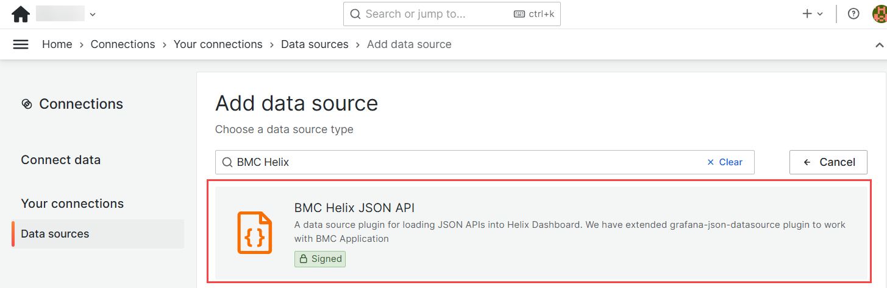
5. To configure the created JSON API data source, complete the following fields:
   1. **Name**—Enter the name for the data source.
   2. **URL**—Enter the URL of the IS environment you want to use as the data source that will connect to Microsoft Power BI (part of Microsoft Fabric).

      Communication between Dashboards and Microsoft Power BI (part of Microsoft Fabric) occurs through the IS. Therefore, you must select one specific IS environment for this purpose. If you have multiple environments, you can choose only one environment to dedicate to this communication.  
      
6. Click**Save & test**.

## Task 5: To create a custom dashboard for HKM

1. As a reporting administrator or editor, log in to Dashboards.
2. From the navigation menu, click**Dashboards,**and then select**New**>**New Dashboard**.  
   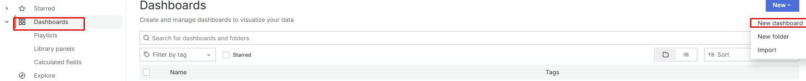
3. On the New dashboard page, click**+****Add visualization**.  
   
4. In the**Query**section, select the**Knowledge Management**data source for the query.
5. In the query editor of the Knowledge Management data source, configure the following options to call the HKM Dashboards API to retrieve any data that you want from Microsoft Power BI (part of Microsoft Fabric) data sets:

   | Option | Action |
   | --- | --- |
   | Fields | Extract the data from the JSON response returned from the URL that is configured in the data source. On the**Fields**tab, configure the following options:  * **Field**—Enter the**JSONPath**queries to collect the data from specific fields: .results[\*].tables[\*].rows[\*].*field name* * **Type**—Select the**Auto**type of data to be returned by the URL. * **Alias**—Do not select this option.  |
   | Path | Configure the HTTP method of the request sent to the URL. Set this option to**POST**. Then, specify the following path: */api/com..dsm.chatbot/HKM/api/powerbi/query*  |
   | Headers | In the**Key**and the**Value**fields, add the following parameters that you want to send as HTTP headers:  * ***X-Requested-By:**XmlHttpRequest* * ***Content-Type:**application/json* |
   | Body | Enter the following text that is sent as a request: {  "query": "<DAX Query>"  }You must build and enter a DAX query that will extract data from the specified table in Microsoft Power BI (part of Microsoft Fabric). For example, the following DAX query extracts CustomerId, ContentId, Title, and URL data from the DimArticleTranslation table: {  "query": "EVALUATE TOPN(5, SELECTCOLUMNS(DimArticleTranslation, \"CustomerId\", DimArticleTranslation[CustomerId], \"ContentId\", DimArticleTranslation[ContentId], \"Title\", DimArticleTranslation[Title], \"URL\", DimArticleTranslation[URL]))"  }Learn more about DAX queries in[Query reference](https://docs.bmc.com/xwiki/bin/view/Service-Management/Employee-Digital-Workplace/BMC-Helix-Knowledge-Management-by-ComAround/hkm/Creating-dashboards-for-BMC-Helix-Knowledge-Management-by-ComAround/#query).  |
6. In**Panel title**section, select the**Switch to table**option.  
   
7. If necessary, in the**Panel**tab, expand**Visualization**to select any other visualization type.  
   For more information about configuring visualization, see[Out-of-the-box visualization plugins](https://docs.bmc.com/xwiki/bin/view/Helix-Common-Services/Dashboards-Reports/BMC-Helix-Dashboards/BHD253/Creating-and-customizing-dashboards/Out-of-the-box-visualization-plugins/).
8. Save your changes.
9. As a reporting administrator, configure role-based access to this dashboard for Dashboards users.  
   For more information, see[Managing role-based access control in Dashboards](https://docs.bmc.com/xwiki/bin/view/Helix-Common-Services/Dashboards-Reports/BMC-Helix-Dashboards/BHD253/Administering/Managing-role-based-access-control-in-BMC-Helix-Dashboards/).

You have created a custom dashboard for HKM. You can create as many custom dashboards as necessary. Learn more about the overall process to create and customize dashboards in[Creating and customizing dashboards](https://docs.bmc.com/xwiki/bin/view/Helix-Common-Services/Dashboards-Reports/BMC-Helix-Dashboards/BHD253/Creating-and-customizing-dashboards/).

## Query reference

To create an accurate and functional DAX query, you need to understand how to construct DAX queries and which tables and fields in Microsoft Power BI (part of Microsoft Fabric) to use for data retrieval. You can learn how to build DAX queries in[DAX overview](https://learn.microsoft.com/en-us/dax/dax-overview). When you execute DAX queries, consider their[limitations](https://learn.microsoft.com/en-us/rest/api/power-bi/datasets/execute-queries#limitations).

To help you build DAX queries for data retrieval, use the following reference documentation for the Microsoft Power BI (part of Microsoft Fabric) model that HKM utilizes. This documentation oulines data sets' tables, columns, measures, and relationships, ensuring accurate and efficient data extraction. Download this reference documentation as a PDF file[here](https://docs.bmc.com/xwiki/bin/download/Service-Management/Employee-Digital-Workplace/BMC-Helix-Knowledge-Management-by-ComAround/hkm/Creating-dashboards-for-BMC-Helix-Knowledge-Management-by-ComAround/WebHome/model.pdf?rev=1.1)and save the file to your device.

## Results

After you create the custom dashboard and configure role-based access to it, users with the Viewer, Editor, or Admin roles can use it if they have access to this particular dashboard or to a folder where this dashboard is available.

Here's an example of a custom dashboard created for HKM:

---

## Creating-User-Groups-And-Assigning-Content-Access.md

**Important**

The features and enhancements in this topic are available only to customers that have been migrated to the new content storage solution. For more information about the migration,[contact](https://docs.bmc.com/xwiki/bin/view/Service-Management/Employee-Digital-Workplace/BMC-Helix-Knowledge-Management-by-ComAround/hkm/Support-information/)Support.

A user group is a logical collection of users who share the same role and access permissions within a portal. As a knowledge worker with the Manager role, you can create and edit user groups, configure their access to content, and assign users to these groups. This capability enables you to control content visibility and user actions efficiently, without relying on support teams.

# User Groups, roles, and access models

​​​​​​User groups are logical containers that define both the role assigned to users and their access to specific folders and the content within them. Each user must belong to at least one group to access the portal.

A company can create up to 3000 user groups, and each user can be assigned to up to 256 groups. Each group defines the following configurations:

| Configuration | Description |
| --- | --- |
| Role | Determines what actions users can perform, what knowledge articles and which article states they can interact with; such as Draft, Published, or Archived. Learn more about user roles and their capabilities in[Product overview](https://docs.bmc.com/xwiki/bin/view/Service-Management/Employee-Digital-Workplace/BMC-Helix-Knowledge-Management-by-ComAround/hkm/Getting-started/Product-overview/). |
| Portal access | Specifies a portal or multiple portals that this user group can access.  |
| Content access | Specifies which folders and their contents the group can access. Access is granted or denied at the folder level:  * You can only grant access to folders and not individual articles within those folders. * Denying access to a folder automatically denies access to all its child items (subfolders and articles). * You can explicitly grant access to a subfolder even if access to its parent folder is denied. * When you grant access to a subfolder, access to its parent folder is granted. * For subscribed content, access can only be assigned or removed at the top-level folder. You cannot expand subscribed folders to view or manage their child folders. |

Users may belong to multiple groups simultaneously, and in such cases, the following conditions apply:

* Access to content is determined by combining the folder permissions from all assigned groups. If any group grants access to a folder, the user will be able to view it, even if other groups deny access.
* Role-based permissions are determined by the highest role assigned to a user across all groups. Roles have the following fixed hierarchy (from lowest to highest):  
  **Reader**(lowest)**→ Candidate → Contributor → Publisher → Coach → Manager**(highest)  
  The system uses this order to determine the highest applicable role. For example, if a user is part of one group with the Contributor role and another with the Manager role, they will be treated as a Manager for all content they can access. For more information about user roles, see[Product overview](https://docs.bmc.com/xwiki/bin/view/Service-Management/Employee-Digital-Workplace/BMC-Helix-Knowledge-Management-by-ComAround/hkm/Getting-started/Product-overview/).

# To create a user group

1. As a Manager, login to HKM.
2. Click**Settings**and select**Administration**.  
   
3. In the**User groups**section, click**Add user group.  
   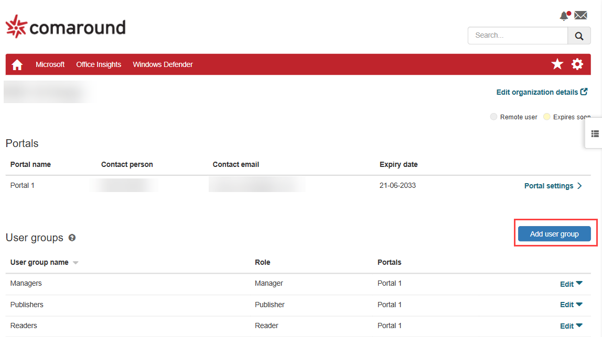**
4. Configure user group settings by specifying the following fields:

   | Field | Action |
   | --- | --- |
   | User group name | Enter a name for the user group. Best practice: We recommend providing names that clearly reflect the group’s purpose or role (for example,*Finance Read-Only*).  |
   | User group author name | *(Optional)*Enter a custom author name that will be displayed when users in this group create articles. This setting helps attribute content to a team or department rather than individuals. |
   | User group author email | *(Optional)*Enter a shared email address for this user group. This email will be displayed when users in this group create articles. |
   | Active Directory Object Id | *(Optional)*Enter an AD Object Id to link the group to an external Active Directory group. Users signing in via the Active Directory will be automatically assigned to this group based on the Object Id. **Important:**This setting is intended for customers who manage their user groups in Microsoft Entra ID (formerly Azure AD) and want to map them directly to corresponding groups in HKM. It's not intended for customers that use HKM as a knowledge provider for their applications.  |
   | IP address restriction | *(Optional)*Enter IP addresses to restrict access for group members. Users must connect from one of these IPs to access the portal. If no IPs are specified, access is allowed from any location. |
   | Role | Select the user role to define what actions users can perform and which article states they can interact with. For more information about user roles, see[Product overview](https://docs.bmc.com/xwiki/bin/view/Service-Management/Employee-Digital-Workplace/BMC-Helix-Knowledge-Management-by-ComAround/hkm/Getting-started/Product-overview/). |
   | Portal access | Select the required portal that this group can access. A group can be linked to one or multiple portals. |

   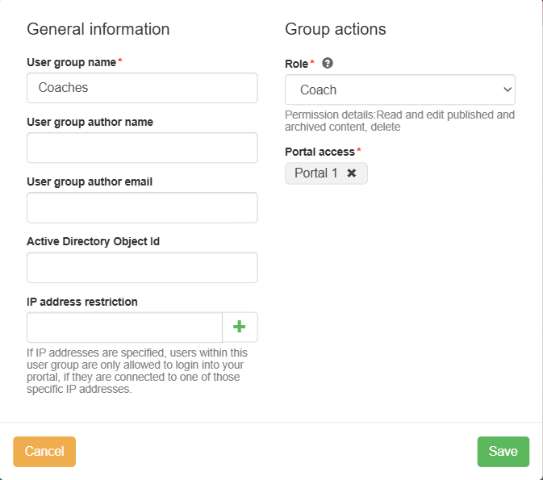
5. Click**Save**.

A new user group is added. You can edit newly created user groups or groups that were previously created for you by .

**Important**  
After you create a new user group, assign the user named Activation User to it. This user must be assigned to all user groups. For more information about assigning users to groups, see[Add user (HKM)](https://zero.comaround.com/en-us/content/971335/#/).  
To ensure you're assigning the correct user, search by the name Activation User. If multiple results appear, check the**User name**field and proceed with the user whose user name follows this format:  
*activationuser\_<CustomerName(ProjectName)>\_ENV*; for example,*activationuser\_customer\_prod*.

See the user configuration UI with the standard Name and example User name of the Activation User

# To assign content access

You can configure content access only for saved user groups. To configure the content access, complete the following steps:

1. In HKM, click**Settings**and select**Administration**.
2. In the**User groups**section, click**Edit**next to the user group you want to configure.  
   
3. Under Group actions, click**Set the content access for this user group**.  
   
4. In the Content access window, define content access in the folder tree:
   * To grant access to a folder, select the checkbox next it.
   * To deny access to a folder, clear the checkbox next to it.  
     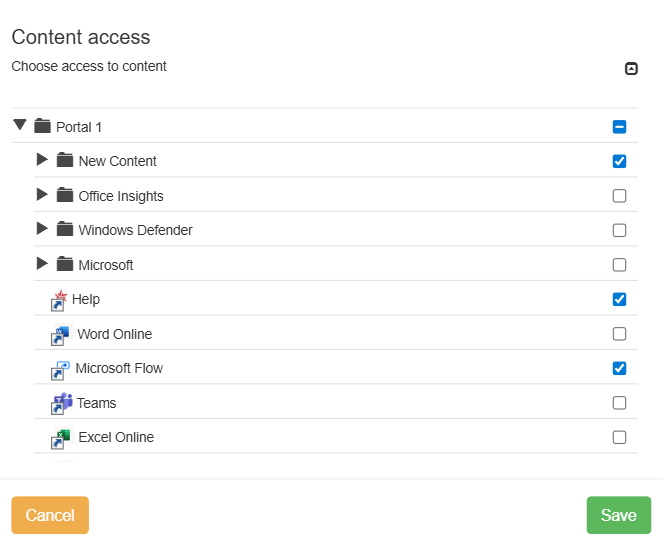
   * To grant or deny access to a specific subfolder, expand its parent folder and select or clear the checkbox next to the required subfolder.

     **Important**  
     A checkbox next to a folder means access is granted, but it doesn’t reveal whether access is set at the folder level or only for specific subfolders. If access is granted to the folder itself, all its subfolders automatically inherit access. If access is granted only to certain subfolders, the checkbox still appears next to the parent folder. To understand exactly which subfolders are included, always expand the folder.  
     Learn more about access inheritance in the[User Groups, roles, and access model](https://docs.bmc.com/xwiki/bin/view/Service-Management/Employee-Digital-Workplace/BMC-Helix-Knowledge-Management-by-ComAround/hkm/Creating-user-groups-and-assigning-content-access/#concepts)section.  
     
5. Click**Save**.

   **Important**  
   Wait for the operation to complete. Monitor the Operation Status Message to confirm that access changes were successfully applied. Avoid making additional changes until the operation finishes, as unsaved updates may be lost.  
   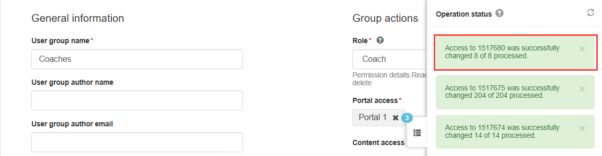
6. Confirm that the**User Group Activation**toggle is turned on.  

   **Warning**  
   If you turn this toggle off, the group will be deactivated. Deactivated groups are hidden from the list and require Support assistance to reactivate.  
   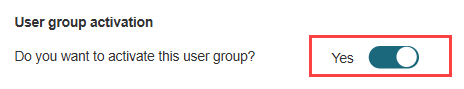
7. Click**Save**.

**Important**  
Learn how to access this help article in[Accessing product documentation provided by help articles](https://docs.bmc.com/xwiki/bin/view/Service-Management/Employee-Digital-Workplace/BMC-Helix-Knowledge-Management-by-ComAround/hkm/Getting-started/Accessing-product-documentation-provided-by-help-articles/).

# Where to go from here

After configuring content access, assign the group to users. For instructions, see[Add user (HKM)](https://zero.comaround.com/en-us/content/971335/#/).

---

## Getting-Started.md

If you are new to the HKM product, read and perform getting started tasks to learn how to implement HKM as the one knowledge base that gives you a centralized way of work with knowledge in your organization.

Watch the following video to get an overview of HKM architecture and the product benefits:

[🎥 Watch Video: https://www.youtube.com/watch?v=VcVxD0MBV2o](https://www.youtube.com/watch?v=VcVxD0MBV2o)

<https://youtu.be/VcVxD0MBV2o>

Getting started for new users

* [Release notes and notices](https://docs.bmc.com/xwiki/bin/view/Service-Management/Employee-Digital-Workplace/BMC-Helix-Knowledge-Management-by-ComAround/hkm/Release-notes-and-notices/)
* [Product overview](https://docs.bmc.com/xwiki/bin/view/Service-Management/Employee-Digital-Workplace/BMC-Helix-Knowledge-Management-by-ComAround/hkm/Getting-started/Product-overview/)
* [User interface overview](https://docs.bmc.com/xwiki/bin/view/Service-Management/Employee-Digital-Workplace/BMC-Helix-Knowledge-Management-by-ComAround/hkm/Getting-started/User-interface-overview/)

Getting started for new administrators

* [Setting up and going live](https://docs.bmc.com/xwiki/bin/view/Service-Management/Employee-Digital-Workplace/BMC-Helix-Knowledge-Management-by-ComAround/hkm/Setting-up-and-going-live/)
* [Integrating with third-party applications by using the REST API](https://docs.bmc.com/xwiki/bin/view/Service-Management/Employee-Digital-Workplace/BMC-Helix-Knowledge-Management-by-ComAround/hkm/Integrating-with-third-party-applications-by-using-the-REST-API/)
* [Leveraging knowledge articles from HKM in other applications](https://docs.bmc.com/xwiki/bin/view/Service-Management/Employee-Digital-Workplace/BMC-Helix-Knowledge-Management-by-ComAround/hkm/Getting-started/Use-cases/Leveraging-knowledge-articles-from-BMC-Helix-Knowledge-Management-by-ComAround-in-other-BMC-applications/)
* [Learning about KCS v6 verified HKM](https://docs.bmc.com/xwiki/bin/view/Service-Management/Employee-Digital-Workplace/BMC-Helix-Knowledge-Management-by-ComAround/hkm/Getting-started/Use-cases/Learning-about-KCS-v6-verified-BMC-Helix-Knowledge-Management-by-ComAround/)

---

## Getting-Started/Hkm-Architecture.md

HKMis a subscription-based service that provides a centralized system to create, search, and access knowledge across multiple cloud data sources.

Related topics

[User interface overview](https://docs.bmc.com/xwiki/bin/view/Service-Management/Employee-Digital-Workplace/BMC-Helix-Knowledge-Management-by-ComAround/hkm/Getting-started/User-interface-overview/)

[Setting up and going live](https://docs.bmc.com/xwiki/bin/view/Service-Management/Employee-Digital-Workplace/BMC-Helix-Knowledge-Management-by-ComAround/hkm/Setting-up-and-going-live/)

[HKM service](https://docs.bmc.com/xwiki/bin/view/Helix-Common-Services/Other/BMC-Helix-Subscriber-Information/helixsubscriber/BMC-Helix-services/BMC-Helix-Knowledge-Management-by-ComAround-service/)in the Subscriber documentation.

The following diagram gives an overview of the HKM architecture:

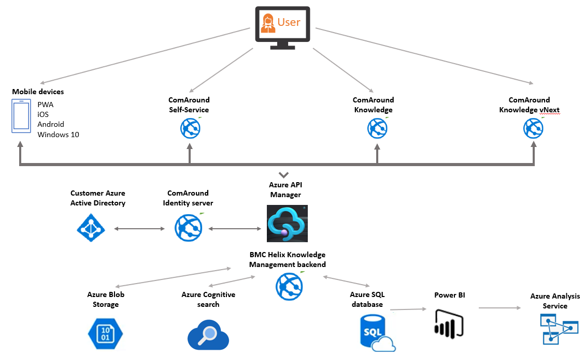

The components in a typical HKM system are described below:

* + - [HKM web platforms](#Hwebplatforms)
    - [Microsoft Azure Services](#HMicrosoftAzureServices)
    - [Third-party dependencies](#HThird-partydependencies)
    - [Sizing considerations](#HSizingconsiderations)

### HKM web platforms

The following web platforms are used by knowledge workers and end users:

| Component  | Description  |
| --- | --- |
| HKM Self-Service  | Web platform for consumption of knowledge for the end users. The platform is designed to make knowledge articles easy to find and easy to read.  |
| HKM Knowledge  | Web platform for knowledge workers that includes all the capabilities of HKM. This platform is used to create, maintain, and share knowledge as well as configure the administration settings for your company.  |
| HKM Knowledge vNext  | Web platform for knowledge workers that includes the decision tree capability. This platform is used to create, maintain, and share knowledge.  |

### Microsoft Azure Services

The following key Microsoft Azure services are used for cognitive search, data storage, and reporting insights:

| Component  | Description  |
| --- | --- |
| Azure Application Service  | Hosts web applications and backend functions.  |
| Azure Storage Service  | Stores files in a geo-redundant storage account (GRS), and data is replicated to a secondary region to ensure durability and high availability. This service includes the following products:   * Azure SQL Database Premium—Stores users, portals, and content. * Azure Blob Storage—Hosts images, videos, and attachments to knowledge articles. |
| Azure Cognitive Search  | Powers the AI search capabilities in HKM.  |
| Power BI  | Provides data and insights in HKM.  |
| Azure Analysis Services  | Extracts data from HKM as an insight connector.  |
| Azure API Management  | Handles all API calls and creates API subsets.  |

### Third-party dependencies

The following third-party applications are used to enhance the knowledge workers' experience:

| Component  | Description  |
| --- | --- |
| Froala Content Editor  | Enables knowledge workers to create and edit knowledge articles in HKM.  |
| Google Translation Service (Optional)  | Translates knowledge articles in HKM.  |
| Sendgrid (Optional)  | Handles email communication in HKM.  |

### Sizing considerations

When knowledge workers create content in HKM, they must consider the following types of content size limitations:

* [Article size limitations](https://docs.bmc.com/xwiki/bin/view/Service-Management/Employee-Digital-Workplace/BMC-Helix-Knowledge-Management-by-ComAround/hkm/Getting-started/BMC-Helix-Knowledge-Management-by-ComAround-architecture/#article_size)—These limitations apply to the article size and character count.
* [Field-specific limitations](https://docs.bmc.com/xwiki/bin/view/Service-Management/Employee-Digital-Workplace/BMC-Helix-Knowledge-Management-by-ComAround/hkm/Getting-started/BMC-Helix-Knowledge-Management-by-ComAround-architecture/#field_size)—These limitations apply to individual fields in articles, folders, and links.

#### Article size limitations

When knowledge workers create articles, they must consider limitations related to article size and character count. These limitations affect the ability to save articles, use machine translation, and access version history.

**Important**  
These limitations apply per individual language version of an article. If the article is available in multiple languages, the limitations apply to each translation separately.

| Category | Limit (per single language version) | Impact if exceeded | Details |
| --- | --- | --- | --- |
| Article size | 1 MB | The article can't be saved. | The size of an article is calculated based on its text and formatting. Images and attachments are excluded from this calculation because they are stored separately. The actual size depends on character type and formatting, not the character count. For example, Chinese characters might consume more bytes than English characters. As a result, fewer Chinese characters can fit within the 1 MB limit.  |
| A single image or attachment must not exceed 350 MB. |
| The combined size of all translations can exceed 1 MB, but each language version must remain within the 1 MB limit. For example, if an article is available in English, Swedish, and German, its total size can exceed 1 MB. |
| Machine translation | 30,000 English characters | Machine translation is unavailable.  | The limit applies to the total number of characters across all fields in an article. If exceeded, machine translation is unavailable, but manual translation remains possible.  |
| Version history | 31,940 English characters | The article can be saved, but it doesn't appear in the article history.  | The limit applies to the total number of characters across all fields in an article. If exceeded, the article can be saved, but it is not included in the article history. As a result, version management is unavailable for this article version, and it can't be restored or refactored later on.  |

**Important**  
The limit is measured in English characters. For other languages, the threshold may vary due to differences in character encoding.

#### Field-specific limitations

The following table lists character limits for specific fields in articles, folders, and links. If any of these limits are exceeded, the item cannot be saved. This rule applies even when other content size limits are within acceptable ranges. For example, if an article title is longer than 2,000 characters, the article cannot be saved. This restriction applies even when the total size of the article is within acceptable limits.

| Item | Field | Limit (English characters) |
| --- | --- | --- |
| **Articles** | Title | 2,000 |
| Author Email | 2,000 |
| Author | 2,000 |
| External links | 128 |
| **Folders** | Title | 2,000 |
| Author Email | 2,000 |
| Description | 2,000 |
| Author | 2,000 |
| External links | 128 |
| **Links** | Title | 2,000 |
| Author Email | 2,000 |
| URL | 2,000 |
| Author | 2,000 |
| External links | 128 |

**Important**  
The limit is measured in English characters. For other languages, the threshold may vary due to differences in character encoding.

---

## Getting-Started/Product-Overview.md

HKM is an Artificial Intelligence (AI)-powered, cloud-based knowledge management software that can be used for a centralized way of work with knowledge. You can create, search, and access valuable knowledge across multiple cloud data sources to ensure delivery of the right information for the best resolution.

HKM can used as a[knowledge provider for applications](https://docs.bmc.com/xwiki/bin/view/Service-Management/Employee-Digital-Workplace/BMC-Helix-Knowledge-Management-by-ComAround/hkm/Getting-started/Use-cases/Leveraging-knowledge-articles-from-BMC-Helix-Knowledge-Management-by-ComAround-in-other-BMC-applications/)or it can be integrated with third-party applications[by using REST APIs](https://docs.bmc.com/xwiki/bin/view/Service-Management/Employee-Digital-Workplace/BMC-Helix-Knowledge-Management-by-ComAround/hkm/Integrating-with-third-party-applications-by-using-the-REST-API/).

HKM provides HKM Knowledge, HKM Self Service, and Knowledge vNext interfaces that you can use to administer the configurations, and create and search for knowledge articles. To learn more about the interfaces and typical use cases associated with them, see[User interface overview](https://docs.bmc.com/xwiki/bin/view/Service-Management/Employee-Digital-Workplace/BMC-Helix-Knowledge-Management-by-ComAround/hkm/Getting-started/User-interface-overview/).

The following image illustrates the HKM Knowledge interface:

## Success stories

|  | The story  | References  |
| --- | --- | --- |
| Electrolux - Higher self-service usage and reduced service call rates  | To overcome their challenge of spending time and money on translating knowledge articles into several languages for their Global market, Electrolux chose HKM and in just two months, managed to implement one customized, self-service knowledge base with content in 34 languages. The solution is fully integrated into more than 80 Electrolux websites, and the company now has one knowledge base for all 30 worldwide locations.  | For more information, see[Electrolux customer story](https://www.bmc.com/customers/electrolux.html).  |
| Volvo - Higher resolution rate and increased customer satisfaction  | The Volvo Customer Care Center's biggest challenge was the wide variety of questions they received about their products. Implementing HKM helped Volvo create structured, easy-to-use, and intuitive knowledge that did not require any training before using it. With the use of HKM, the Customer Care Center has seen an increased customer satisfaction through their Net Promoter Score (NPS) and Customer Satisfaction Index (CSI), increased resolution rate, and increased competence of the customer care agents across all channels - phone, emails, chat, and social media. Watch the following video (1:44) to learn about a success story of Volvo Cars Sweden from a first-hand account. [🎥 Watch Video: https://www.youtube.com/watch?v=vEjXQ8xPdSI](https://www.youtube.com/watch?v=vEjXQ8xPdSI) <https://youtu.be/vEjXQ8xPdSI>  | You can also read more at[Volvo customer success case study](https://www.bmc.com/documents/case-study/customer-care-center-at-volvo-car-sweden.html).  |

## User roles

HKMprimarily includes the following roles and their regular activities:

| User  | Role  | Access to UI modules in HKM  | Reference  |
| --- | --- | --- | --- |
| Knowledge Reader (end user)   | * Access published knowledge articles for self-service. | * Self service platform | NA  |
| Knowledge candidate   | * Edit knowledge articles that are in-progress or in draft. * Find approved and published knowledge articles when resolving support tickets. * Flag articles that need improvement. * Assign ownership of knowledge articles to the user groups they belong to. | * Content editor - Content section * Business Intelligence | * [The content editor](https://zero.comaround.com/en-us/content/617188)  * [Business Intelligence](https://zero.comaround.com/en-us/content/617180)  * [Flag an article](https://zero.comaround.com/en-us/content/719680) * [Assigning knowledge article ownership to user groups](https://docs.bmc.com/xwiki/bin/view/Service-Management/Employee-Digital-Workplace/BMC-Helix-Knowledge-Management-by-ComAround/hkm/Assigning-knowledge-article-ownership-to-user-groups/)  ​​​​​​​  |
| Knowledge contributor   | * Edit knowledge articles that are in-progress, draft, or approved. * Review, enhance, and complete articles created by other users. * Flag articles that need improvement. * Create and validate articles. * Reorganize content structure and hierarchy by changing the order of articles and links. * Assign ownership of knowledge articles to the user groups they belong to. | * Content editor - Content section * Business Intelligence | * [The content editor](https://zero.comaround.com/en-us/content/617188) * [Business Intelligence](https://zero.comaround.com/en-us/content/617180) * [Flag an article](https://zero.comaround.com/en-us/content/719680) * ​​​​​​​[Assigning knowledge article ownership to user groups](https://docs.bmc.com/xwiki/bin/view/Service-Management/Employee-Digital-Workplace/BMC-Helix-Knowledge-Management-by-ComAround/hkm/Assigning-knowledge-article-ownership-to-user-groups/) |
| Knowledge publisher   | * Edit knowledge articles that are in-progress, draft, approved, published, or archived. * Publish articles to an external audience. * Modify published articles. * Reorganize content structure and hierarchy by changing the order of articles and links. * Flag published articles for improvements. * Assign ownership of knowledge articles to the user groups they belong to. | * Content editor - Content section * Business Intelligence | * [The content editor](https://zero.comaround.com/en-us/content/617188) * [Business Intelligence](https://zero.comaround.com/en-us/content/617180)​​​​​​​​​​​​​​ * [Flag an article](https://zero.comaround.com/en-us/content/719680) * ​​​​​​​[Assigning knowledge article ownership to user groups](https://docs.bmc.com/xwiki/bin/view/Service-Management/Employee-Digital-Workplace/BMC-Helix-Knowledge-Management-by-ComAround/hkm/Assigning-knowledge-article-ownership-to-user-groups/) |
| Knowledge coach   | * Edit knowledge articles that are in-progress, draft, approved, published, or archived. * Delete knowledge articles. * Monitor, maintain, and improve the knowledge health of an organization. * Generate reports and guides users to adopt good knowledge management processes. * Reorganize content structure and hierarchy by changing the order of articles and links. * Change content structure by moving the folders. * Subscribe to the prepopulated knowledge articles. * Modify the navigation bar and restructure the folders. * Assign ownership of knowledge articles to the user groups they belong to. | * Content editor - Content section * Content editor - Menu settings * Knowledge library | * [Edit the navigation bar](https://zero.comaround.com/en-us/content/617187) * [Import content from the Knowledge Library (HKM)](https://zero.comaround.com/en-us/content/1363496/#/) * [The content editor](https://zero.comaround.com/en-us/content/617188) * ​​​​​​​[Assigning knowledge article ownership to user groups](https://docs.bmc.com/xwiki/bin/view/Service-Management/Employee-Digital-Workplace/BMC-Helix-Knowledge-Management-by-ComAround/hkm/Assigning-knowledge-article-ownership-to-user-groups/) |
| * Assess article quality and adherence to the process. | * Business Intelligence * Article Quality Index | * [Business Intelligence](https://zero.comaround.com/en-us/content/617180) * [AQI - Article Quality Index](https://zero.comaround.com/en-us/content/617176/#/) |
| Knowledge manager   | * Edit knowledge articles that are in-progress, draft, approved, published, or archived. * Retire and delete knowledge articles. * Oversee the overall Knowledge Management database content and lifecycle of the articles in the database. * Access to system settings and user administration. * Reorganize content structure and hierarchy by changing the order of articles and links. * Change content structure by moving the folders. * Register and maintain various knowledge resources. * Create internal users. * Assign ownership of knowledge articles to any user group within the organization. | * Content editor - Content section * Content editor - Menu settings * Knowledge library * Business Intelligence * Administration module * Article Quality Index | * [Administration](https://zero.comaround.com/en-us/search/#/search?languages=en-US&highlight=http&contentId=959633&currentPage=1&sortBy=MostRelevant)  * [Business Intelligence](https://zero.comaround.com/en-us/content/617180)  * [AQI - Article Quality Index](https://zero.comaround.com/en-us/content/617176/#/) * [The content editor](https://zero.comaround.com/en-us/content/617188) * ​​​​​​​[Assigning knowledge article ownership to user groups](https://docs.bmc.com/xwiki/bin/view/Service-Management/Employee-Digital-Workplace/BMC-Helix-Knowledge-Management-by-ComAround/hkm/Assigning-knowledge-article-ownership-to-user-groups/) |

**Important**

To access these help articles, you must first subscribe, and then log in to HKM. You subscribe to HKM by purchasing the[Service Management Advanced license](https://docs.bmc.com/xwiki/bin/view/Helix-Common-Services/Other/BMC-Helix-Subscriber-Information/helixsubscriber/BMC-Helix-services/BMC-Helix-Service-Management-service/)or the[standalone](https://docs.bmc.com/xwiki/bin/view/Helix-Common-Services/Other/BMC-Helix-Subscriber-Information/helixsubscriber/BMC-Helix-services/BMC-Helix-Knowledge-Management-by-ComAround-service/)license. HKM is also available to customers with entitlements in[Virtual Agent Basic](https://docs.bmc.com/xwiki/bin/view/Helix-Common-Services/Other/BMC-Helix-Subscriber-Information/helixsubscriber/BMC-Helix-services/BMC-Helix-Virtual-Agent-Basic-service/)and[Virtual Agent Advanced](https://docs.bmc.com/xwiki/bin/view/Helix-Common-Services/Other/BMC-Helix-Subscriber-Information/helixsubscriber/BMC-Helix-services/BMC-Helix-Virtual-Agent-Advanced-service/)subscriptions.

## Permissions to read and edit content in HKM

The following table describes the read and edit access to knowledge articles for each knowledge worker role:

| **Knowledge worker role**  | Knowledge article state in**HKM**  | | | | | |
| --- | --- | --- | --- | --- | --- | --- |
| **Work in progress**  | **Draft**  | **Approved**  | **Published**  | **Archived**  | **Delete**  |
| **Reader**(end user)  | read ❌️ edit ❌️  | read ❌️ edit ❌️  | read ❌️ edit ❌️  | read ✅️ edit ❌️  | read ❌️ edit ❌️  | read ❌️ edit ❌️ delete ❌️  |
| **Candidate**  | read ✅️ edit ✅️  | read ✅️ edit ✅️  | read ✅️ edit ❌️  | read ✅️ edit ❌️  | read ❌️ edit ❌️  | read ❌️ edit ❌️ delete ❌️  |
| **Contributor**  | read ✅️ edit ✅️  | read ✅️ edit ✅️  | read ✅️ edit ✅️  | read ✅️ edit ❌️  | read ❌️ edit ❌️  | read ❌️ edit ❌️ delete ❌️  |
| **Publisher**  | read ✅️ edit ✅️  | read ✅️ edit ✅️  | read ✅️ edit ✅️  | read ✅️ edit ✅️  | read ✅️ edit ✅️  | read ❌️ edit ❌️ delete ❌️  |
| **Coach**  | read ✅️ edit ✅️  | read ✅️ edit ✅️  | read ✅️ edit ✅️  | read ✅️ edit ✅️  | read ✅️ edit ✅️  | read ❌️ edit ❌️ delete ✅️  |
| **Manager**(administrator)  | read ✅️ edit ✅️  | read ✅️ edit ✅️  | read ✅️ edit ✅️  | read ✅️ edit ✅️  | read ✅️ edit ✅️  | read ❌️ edit ❌️ delete ✅️  |

## Product features

As a centralized, AI-powered knowledge solution, HKM offers the following advantages to its users:

## Want to learn more?

The HKM documentation helps administrators implement this product.

| Action  | Reference  |
| --- | --- |
| Where do I begin?  | [Getting started](https://docs.bmc.com/xwiki/bin/view/Service-Management/Employee-Digital-Workplace/BMC-Helix-Knowledge-Management-by-ComAround/hkm/Getting-started/)  |
| How do I achieve value with HKM?  | [Leveraging knowledge articles from HKM in other applications](https://docs.bmc.com/xwiki/bin/view/Service-Management/Employee-Digital-Workplace/BMC-Helix-Knowledge-Management-by-ComAround/hkm/Getting-started/Use-cases/Leveraging-knowledge-articles-from-BMC-Helix-Knowledge-Management-by-ComAround-in-other-BMC-applications/)  |
| Where do I find information about resolving errors related to HKM?  | [Troubleshooting product issues](https://docs.bmc.com/xwiki/bin/view/Service-Management/Employee-Digital-Workplace/BMC-Helix-Knowledge-Management-by-ComAround/hkm/Troubleshooting/Troubleshooting-product-issues/)  |

---

## Getting-Started/Use-Cases.md

Consult the following use cases for information on how to achieve value with HKM.

Related topics

[Getting started](https://docs.bmc.com/xwiki/bin/view/Service-Management/Employee-Digital-Workplace/BMC-Helix-Knowledge-Management-by-ComAround/hkm/Getting-started/)

| Use case  | Business value  | User  | Products used  |
| --- | --- | --- | --- |
| [Leveraging knowledge articles from HKM in other applications](https://docs.bmc.com/xwiki/bin/view/Service-Management/Employee-Digital-Workplace/BMC-Helix-Knowledge-Management-by-ComAround/hkm/Getting-started/Use-cases/Leveraging-knowledge-articles-from-BMC-Helix-Knowledge-Management-by-ComAround-in-other-BMC-applications/)  | * Enables knowledge workers to create and update articles in HKM - a single, centralized system. * Enables end users to use knowledge articles in other applications. | * Knowledge workers * End users | * HKM * Virtual Agent * DWP * ITSM * Business Workflows |
| [Leveraging knowledge articles as a data source for HelixGPT](https://docs.bmc.com/xwiki/bin/view/Service-Management/Employee-Digital-Workplace/BMC-Helix-Knowledge-Management-by-ComAround/hkm/Getting-started/Use-cases/Leveraging-knowledge-articles-as-a-data-source-for-BMC-HelixGPT/)  | * Enables end users to get more precise answers to knowledge queries based on an automatically determined set of knowledge articles sourced from HKM. | * End users | * HKM * HelixGPT |
| [Learning about KCS v6 verified HKM](https://docs.bmc.com/xwiki/bin/view/Service-Management/Employee-Digital-Workplace/BMC-Helix-Knowledge-Management-by-ComAround/hkm/Getting-started/Use-cases/Learning-about-KCS-v6-verified-BMC-Helix-Knowledge-Management-by-ComAround/)  | * Understand the benefits of implementing all the eight KCS practices in HKM. | * Knowledge workers | * HKM |

---

## Getting-Started/Use-Cases/Learning-About-Kcs-V6-Verified.md

HKM is a Knowledge-Centered Service (KCS) v6 Verified application that demonstrates all the eight KCS practices. This knowledge management application helps support agents, end users, and knowledge workers in the following ways:

* Knowledge workers can use knowledge articles to help resolve incidents in a fast and accurate manner. They caneasily create, update, and maintain the knowledge base from the centralizedHKM
* End users can view the article in a channel and language of their choice for self-help.

Related topics

[Getting started](https://docs.bmc.com/xwiki/bin/view/Service-Management/Employee-Digital-Workplace/BMC-Helix-Knowledge-Management-by-ComAround/hkm/Getting-started/)

[Leveraging knowledge articles from HKM in other applications](https://docs.bmc.com/xwiki/bin/view/Service-Management/Employee-Digital-Workplace/BMC-Helix-Knowledge-Management-by-ComAround/hkm/Getting-started/Use-cases/Leveraging-knowledge-articles-from-BMC-Helix-Knowledge-Management-by-ComAround-in-other-BMC-applications/)

The following webinar (43:12) by the engineering team explains the benefits and use cases of HKM:

[🎥 Watch Video: https://www.youtube.com/watch?v=l5OSMgb3wrY](https://www.youtube.com/watch?v=l5OSMgb3wrY)

<https://youtu.be/l5OSMgb3wrY>

## KCS v6 verified

HKM was KCS v6 verified in 2018. The verification guarantees an efficient knowledge management workflow and advanced data capabilities to enable reporting and follow-up. The[KCS Academy](https://www.thekcsacademy.net/), in partnership with members from the[Consortium for Service Innovation](https://www.serviceinnovation.org/)developed the minimum functional criteria and scenarios through which vendors demonstrate their software application's ability to support the latest version of the KCS practices.

## The eight KCS practices

The following image displays the eight knowledge-centered service practices:

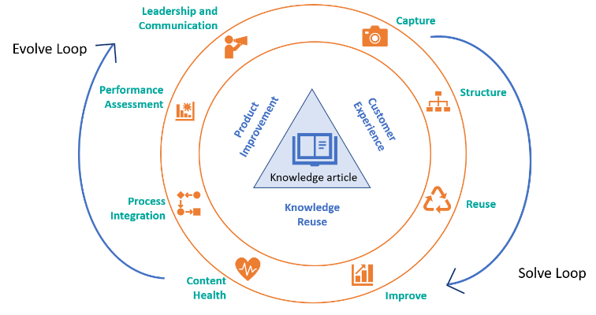

* **Capture**—Capture the requester's context and show relevant content.
* **Structure**—Use simple and consistent templates.
* **Reuse**—Avoid the work of researching and developing a resolution by reusing existing content.
* **Improve**—Collective ownership to reuse, review, flag, or fix knowledge articles.
* **Content Health**—Maintain content health by making sure that the articles are unique, complete, clear, have a descriptive title, valid links, and correct metadata.
* **Process Integration**—Integrate the process of capturing, structuring, reusing, and improving the knowledge articles in the daily work of the support staff.
* **Performance assessment**—Define clear goals for knowledge workers and provide them performance indicators for them to take responsibility and manage their performance.
* **Leadership and communication**—Define the organization's vision, create a strategic framework and recognition program, and communicate effectively with the knowledge workers.

For more information, see[KCS v6 Practices Guide](https://library.serviceinnovation.org/KCS/KCS_v6/KCS_v6_Practices_Guide).

## Benefits of KCS® v6 Verified HKM

Using HKM provides the following benefits:

* A standalone knowledge application which does not depend on other platforms.
* Modern, open APIs for advanced integration with other applications or systems.
* Advanced reporting capabilities that can be merged with data from other applications or systems.
* User interface and content in up to 34 languages.
* Built-in machine translation of content.

## Test your knowledge

Check your knowledge. See if you can answer each question. Click the questions to view the answer.

Who can benefit from knowledge articles?

<ul><li>Support agents use knowledge articles to help resolve incidents in a fast and accurate manner.</li><li>End users can view the article in a channel and language of their choice for self-help.</li></ul>

How do you know if a knowledge article is still relevant?

In a KCS environment, the solve and evolve loop, which is used to continuously create, review, and improve knowledge articles makes sure that all content is correct and relevant. Users can provide feedback on knowledge articles. KCS Coaches and KCS Mangers use Article Quality Index (AQI) assessment questions to assess their knowledge base.

What is KCS?

Knowledge-Centered Service (KCS) is a methodology defined by Consortium for Service Innovationfor continuous improvement of knowledge articles based on the reuse patterns. It is a demand-driven and self-correcting model that ensures accurate and relevant content at all times.

## Want to learn more?

provides official KCS Academy training conducted by certified KCS trainers.

KCS courses by

[Knowledge-Centered Service (KCS) v6: Fundamentals Certification Exam](https://www.bmc.com/education/courses/knowledge-centered-service-v6-fundamentals-certification-exam.html)[Knowledge-Centered Service (KCS) v6: Fundamentals Overview](https://www.bmc.com/education/courses/knowledge-centered-service-v6-fundamentals-certification-exam.html)[Knowledge-Centered Service (KCS) v6: Practices Workshop](https://www.bmc.com/education/courses/knowledge-centered-service-v6-practices-workshop.html)

---

## Getting-Started/Use-Cases/Leveraging-Hkm-Articles-In-Other-Applications.md

HKMcan be usedas a knowledge provider in the following applications:

* Virtual Agent
* DWP
* ITSM

* Business Workflows

**Important**

HKM is a SaaS solution, and you can use it as a knowledge provider in SaaS versions of the applications*only*. Also, you cannot use HKM as a knowledge provider forMid Tier.

Related topics

[Integrating with third-party applications by using the REST API](https://docs.bmc.com/xwiki/bin/view/Service-Management/Employee-Digital-Workplace/BMC-Helix-Knowledge-Management-by-ComAround/hkm/Integrating-with-third-party-applications-by-using-the-REST-API/)

[Leveraging knowledge articles as a data source for HelixGPT](https://docs.bmc.com/xwiki/bin/view/Service-Management/Employee-Digital-Workplace/BMC-Helix-Knowledge-Management-by-ComAround/hkm/Getting-started/Use-cases/Leveraging-knowledge-articles-as-a-data-source-for-BMC-HelixGPT/)

[Learning about KCS v6 verified HKM](https://docs.bmc.com/xwiki/bin/view/Service-Management/Employee-Digital-Workplace/BMC-Helix-Knowledge-Management-by-ComAround/hkm/Getting-started/Use-cases/Learning-about-KCS-v6-verified-BMC-Helix-Knowledge-Management-by-ComAround/)

WithHKM, applications boost their knowledge bases with the following capabilities:

## Scenario: UsingHKMinITSM

Scenario: Using with ITSM

Apex Global uses ITSM for handling user requests, incidents, and infrastructure-generated issues. The administrator wants to make sure that service desk agents can easily access solutions by referring to the knowledge base. To achieve this goal, the company has decided to implementHKMas the knowledge provider for ITSM. During this process, Apex Global transfers its existing knowledge articles fromITSM: Knowledge ManagementtoHKM, ensuring that all historical knowledge is retained. AfterHKMis configured and activated as the knowledge provider, service desk agents can efficiently locate, create, update, and manage knowledge articles to resolve incidents quickly and accurately.

## Workflow for configuringHKMas a knowledge provider

After subscribing to HKM, administrators configure it as the knowledge provider for a application. AISadministrator completes common configuration tasks inIS. Then, depending on a specific application, application administrators must enable HKM in the application or request , Inc. Support to enable it.

The following diagram illustrates how to set upHKMas a knowledge provider forITSM:

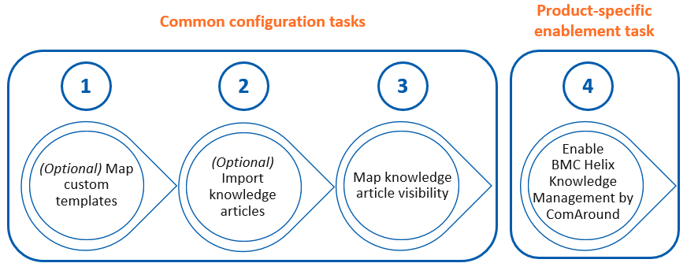

**Important**

The tasks to enableHKMas a knowledge provider differ for each application.

TheISadministrator must perform the following common configuration tasksinIS:

| Task  | Action  | Reference  |
| --- | --- | --- |
| 1  | *(Optional)*Mapcustom knowledge templates and fieldsfromITSM: Knowledge Managementor Business WorkflowsKnowledge ManagementtoHKM. **Important:**If you don't use customtemplates,you do*not*need to do the mapping because out-of-the-box knowledge templates and fields in your application are automatically mapped toHKM. However, if necessary, you can edit these out-of-the-box mappings too.  | [Mapping custom knowledge templates from applications to HKM](https://docs.bmc.com/xwiki/bin/view/Service-Management/Innovation-Suite/BMC-Helix-Innovation-Suite/is254/Enabling-services/Configuring-BMC-Helix-Knowledge-Management-by-ComAround-as-a-knowledge-provider/Mapping-custom-knowledge-templates-from-BMC-applications-to-BMC-Helix-Knowledge-Management-by-ComAround/)  |
| 2  | *(Optional)*Import the articles fromITSM: Knowledge Managementor Business WorkflowsKnowledge ManagementtoHKM.  | [Importing articles to HKM](https://docs.bmc.com/xwiki/bin/view/Service-Management/Innovation-Suite/BMC-Helix-Innovation-Suite/is254/Enabling-services/Configuring-BMC-Helix-Knowledge-Management-by-ComAround-as-a-knowledge-provider/Synchronizing-BMC-applications-with-BMC-Helix-Knowledge-Management-by-ComAround/)  |
| 3  | Map knowledge permissions from your application withHKMuser groups, roles, and portal to set knowledge access permissions inHKM.  | [Mapping knowledge permissions from applications to HKM](https://docs.bmc.com/xwiki/bin/view/Service-Management/Innovation-Suite/BMC-Helix-Innovation-Suite/is254/Enabling-services/Configuring-BMC-Helix-Knowledge-Management-by-ComAround-as-a-knowledge-provider/Mapping-knowledge-permissions-from-BMC-applications-to-BMC-Helix-Knowledge-Management-by-ComAround/) |

After theISadministratorcompletes the configuration tasks, application administrators must enableHKMin the application or request , Inc. Support to enable it:

| Action  | Role  | Reference  |
| --- | --- | --- |
| To useHKMas a knowledge provider in Virtual Agent  | Virtual Agent administrator  | [Leveraging knowledge from HKM](https://docs.bmc.com/xwiki/bin/view/Service-Management/Employee-Digital-Workplace/BMC-Helix-Virtual-Agent/hva254/Getting-started/Use-cases/Leveraging-knowledge-from-BMC-Helix-Knowledge-Management-by-ComAround/)  |
| To useHKMas a knowledge provider in DWP  | NA  | [Leveraging knowledge from HKM](https://docs.bmc.com/xwiki/bin/view/Service-Management/Employee-Digital-Workplace/BMC-Helix-Digital-Workplace/dwp254/Getting-started/Use-cases/Leveraging-knowledge-from-BMC-Helix-Knowledge-Management-by-ComAround/)  |
| To useHKMas a knowledge provider in ITSM  | NA  | [Leveraging knowledge from HKM](https://docs.bmc.com/xwiki/bin/view/Service-Management/IT-Service-Management/BMC-Helix-ITSM/itsm254/Getting-started/Use-cases/Leveraging-knowledge-from-BMC-Helix-Knowledge-Management-by-ComAround/)  |
| To useHKMas a knowledge provider in Business Workflows  | Business Workflows administrator  | [Selecting a knowledge base for Business Workflows](https://docs.bmc.com/xwiki/bin/view/Service-Management/Enterprise-Service-Management/BMC-Helix-Business-Workflows/bwf254/Administering/Defining-global-configurations/Selecting-a-knowledge-base-for-BMC-Helix-Business-Workflows/)  |

## Result

AfterHKMis configured as a knowledge provider for a application, end users can search for and access knowledge articles fromHKMwithin the application. For example,users can search for HKM articles directly within ITSM. They can also open HKM from ITSM to view, edit, and create articles.The following image shows how end users can open articles fromITSMand view them in HKM:

*(Controlled availability customers only)*Additionally, end users can preview and edit HKM knowledge articles directly within the ITSM interface.

The following image shows how end users can preview an article inthe preview pane within ITSM, rendered via an iframe:

For more information about using HKM as a knowledge provider for ITSM, see[Leveraging knowledge from HKM](https://docs.bmc.com/xwiki/bin/view/Service-Management/IT-Service-Management/BMC-Helix-ITSM/itsm254/Getting-started/Use-cases/Leveraging-knowledge-from-BMC-Helix-Knowledge-Management-by-ComAround/)in the ITSM documentation.

---

## Getting-Started/Use-Cases/Leveraging-Knowledge-Articles-As-A-Data-Source-For.md

HelixGPT is a generative Artificial Intelligence (AI) capability within Service Management and IT Operations Management. It helps with quicker problem resolution, better collaboration, and increased productivity. For example, HelixGPT administrators can configure HelixGPT to work with DWP to provide users with precise answers to queries. For more information about HelixGPT, its core capabilities, and products that HelixGPT can work with, see[Product overview](https://docs.bmc.com/xwiki/bin/view/Service-Management/Employee-Digital-Workplace/BMC-HelixGPT/helixgpt254/Getting-started/Product-overview/).

HelixGPT delivers reliable and refined results because it generates answers based on the knowledge articles, not from the Internet or the large language model (LLM)'s general knowledge.

HelixGPT supports HKM as a knowledge source.Itdelivers more precise answers to end-user queries based on an automatically determined set of knowledge articles sourced from HKM.

To view the complete list of all supported knowledge sources, see[Adding data sources in HelixGPT](https://docs.bmc.com/xwiki/bin/view/Service-Management/Employee-Digital-Workplace/BMC-HelixGPT/helixgpt254/Setting-up-and-going-live/Adding-data-sources-in-BMC-HelixGPT/).

Related topics

[Leveraging knowledge articles from HKM in other applications](https://docs.bmc.com/xwiki/bin/view/Service-Management/Employee-Digital-Workplace/BMC-Helix-Knowledge-Management-by-ComAround/hkm/Getting-started/Use-cases/Leveraging-knowledge-articles-from-BMC-Helix-Knowledge-Management-by-ComAround-in-other-BMC-applications/)

[Integrating with third-party applications by using the REST API](https://docs.bmc.com/xwiki/bin/view/Service-Management/Employee-Digital-Workplace/BMC-Helix-Knowledge-Management-by-ComAround/hkm/Integrating-with-third-party-applications-by-using-the-REST-API/)

[Learning about KCS v6 verified HKM](https://docs.bmc.com/xwiki/bin/view/Service-Management/Employee-Digital-Workplace/BMC-Helix-Knowledge-Management-by-ComAround/hkm/Getting-started/Use-cases/Learning-about-KCS-v6-verified-BMC-Helix-Knowledge-Management-by-ComAround/)

## Scenario: Configuring HelixGPT to generate answers based on knowledge articles fromHKM

Scenario: Configuring HelixGPT to generate answers based on knowledge articles from HKM

Apex Global usesDWPto enhance self-service for end users by providing them with knowledge articles, products, and services from multiple lines of business such as IT, HR, and Facilities. Apex Global has their knowledge articles inHKM.Allen is an administrator at Apex Global and has enabled theHelixGPTcapabilities for his end users.Allen selectsHKMas aknowledge source forHelixGPT.

Britney, the end user, wants to fix a WiFi issue, so she enters her query inDWP. A summary of the procedure to fix WiFi issues is provided along with the related knowledge article links fromHKM.

Britney follows the procedure and successfully resolves the issue without sifting through a list of knowledge articles to find the relevant one for her query.

## Workflow for configuringHKMas a data source for HelixGPT

The following image shows the process of configuring HKM as a data source for HelixGPT:

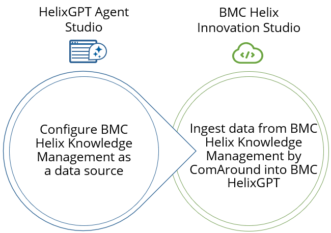

| Task  | Action  | Role  | Reference  |
| --- | --- | --- | --- |
| 1  | Configure HKM as an information source.  | The HelixGPT administrator  | [Adding data sources in HelixGPT](https://docs.bmc.com/xwiki/bin/view/Service-Management/Employee-Digital-Workplace/BMC-HelixGPT/helixgpt254/Setting-up-and-going-live/Adding-data-sources-in-BMC-HelixGPT/) |
| 2  | Ingest data from HKM into HelixGPT.  | The HelixGPT administrator  | [Ingesting data into HelixGPT](https://docs.bmc.com/xwiki/bin/view/Service-Management/Employee-Digital-Workplace/BMC-HelixGPT/helixgpt254/Setting-up-and-going-live/Ingesting-data-into-BMC-HelixGPT/)  |

**Important**

Configuring data sources and ingesting data into HelixGPT are the initial steps to set up HelixGPTto work with applications. For the next steps, see[Setting up and going live](https://docs.bmc.com/xwiki/bin/view/Service-Management/Employee-Digital-Workplace/BMC-HelixGPT/helixgpt254/Setting-up-and-going-live/)and[Administering](https://docs.bmc.com/xwiki/bin/view/Service-Management/Employee-Digital-Workplace/BMC-HelixGPT/helixgpt254/Administering/).

## Result

After the administrator has enabledHelixGPTcapabilities forDWPand selectedHKMas a knowledge source, end users can find answers to their queries from the Catalog, My Activity, or other custom pages created in the Studio. Answers are generated based on automatically determined set of knowledge articles from HKM.

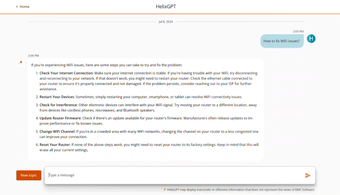

---

## Getting-Started/User-Interface-Overview.md

Knowledge workers and end users access HKMaccording to their roles and requirements. Roles determine what data and user interface modules users can access and the actions they can perform. For more information about user roles, see[Product overview](https://docs.bmc.com/xwiki/bin/view/Service-Management/Employee-Digital-Workplace/BMC-Helix-Knowledge-Management-by-ComAround/hkm/Getting-started/Product-overview/).

Related topics

[Getting started](https://docs.bmc.com/xwiki/bin/view/Service-Management/Employee-Digital-Workplace/BMC-Helix-Knowledge-Management-by-ComAround/hkm/Getting-started/)

## Overview ofHKM interfaces

HKM provides the following interfaces that you can use to manage and share knowledge:

### Knowledge vNext interface

Knowledge vNext ([https://knowledge.HKM.com](https://knowledge.comaround.com)) interface is a web platform for customers that use HKM as a knowledge provider for ITSM and Business Workflows.For more information about configuring HKM as a knowledge provider, see[Leveraging knowledge articles from HKM in other applications](https://docs.bmc.com/xwiki/bin/view/Service-Management/Employee-Digital-Workplace/BMC-Helix-Knowledge-Management-by-ComAround/hkm/Getting-started/Use-cases/Leveraging-knowledge-articles-from-BMC-Helix-Knowledge-Management-by-ComAround-in-other-BMC-applications/).

This interface is designed to provide the best possible experience in knowledge management that is certified for Knowledge Center Services (KCS) v6. It features the familiar style and offers a streamlined user experience. Knowledge workers use this platform daily to create, edit, and maintain knowledge, thus meeting an organization's needs for effective knowledge management.

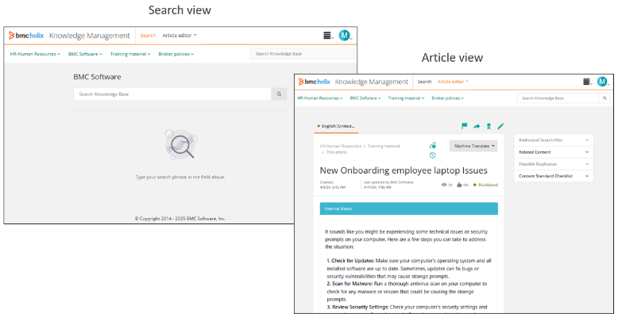

### HKM Knowledge interface

The HKM Knowledge([zero.comarond.com](http://zero.comarond.com/))interface is a web platform for knowledge workers that includes all the capabilities of HKM.This platform is designed to create, maintain, and share knowledge, as well as to configure your company's administration settings.

### HKM Self-Service interface

The HKM Self-Service([support.HKM.com](http://support.comaround.com/))interface is a web platform for the consumption of knowledge for the end users.The platform is designed to make knowledge articles easy to find and easy to read. It can't be used to create or edit articles.

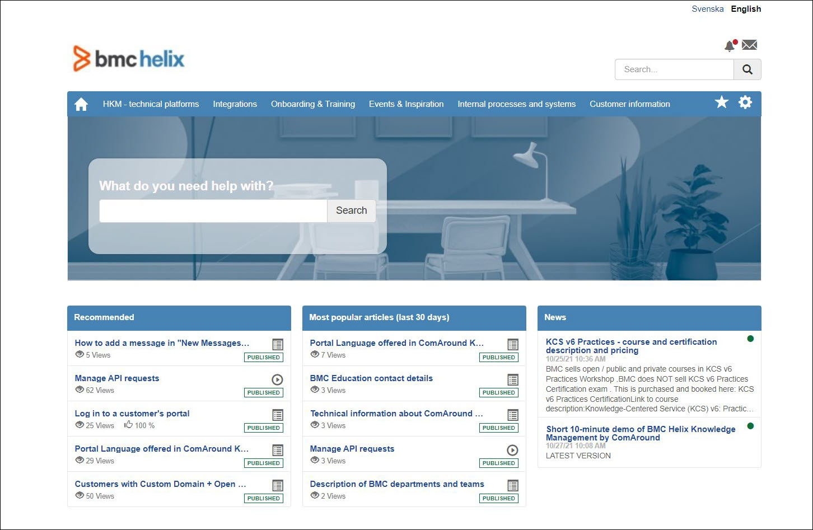

**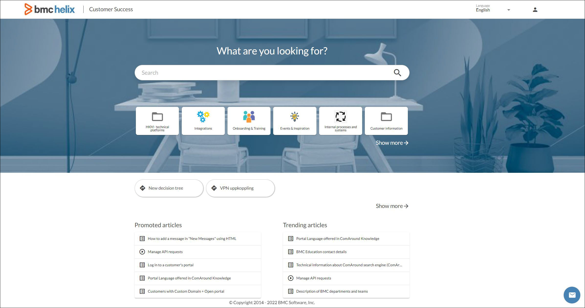**

Watch the following video to learn more about these interfaces and typical use cases associated with them:

[🎥 Watch Video: https://www.youtube.com/watch?v=E2sFwlPvTro](https://www.youtube.com/watch?v=E2sFwlPvTro)

[https://youtu.be/E2sFwlPvTro](https://youtu.be/E2sFwlPvTro)

For more information about solutions and components that form HKM architecture, see[HKM architecture](https://docs.bmc.com/xwiki/bin/view/Service-Management/Employee-Digital-Workplace/BMC-Helix-Knowledge-Management-by-ComAround/hkm/Getting-started/BMC-Helix-Knowledge-Management-by-ComAround-architecture/).

## Login methods

Knowledge workers and end users can access HKM by using several login methods.

All users are authenticated by using a login server by using the OpenID Connect protocol. Knowledge workers and end users can log in to HKM by using the following methods.

**Important**

To log in to HKM, you must first subscribe to HKM by purchasing the[Service Management Advanced license](https://docs.bmc.com/xwiki/bin/view/Helix-Common-Services/Other/BMC-Helix-Subscriber-Information/helixsubscriber/BMC-Helix-services/BMC-Helix-Service-Management-service/)or the[standalone](https://docs.bmc.com/xwiki/bin/view/Helix-Common-Services/Other/BMC-Helix-Subscriber-Information/helixsubscriber/BMC-Helix-services/BMC-Helix-Knowledge-Management-by-ComAround-service/)license. HKM is also available to customers with entitlements in[Virtual Agent Basic](https://docs.bmc.com/xwiki/bin/view/Helix-Common-Services/Other/BMC-Helix-Subscriber-Information/helixsubscriber/BMC-Helix-services/BMC-Helix-Virtual-Agent-Basic-service/)and[Virtual Agent Advanced](https://docs.bmc.com/xwiki/bin/view/Helix-Common-Services/Other/BMC-Helix-Subscriber-Information/helixsubscriber/BMC-Helix-services/BMC-Helix-Virtual-Agent-Advanced-service/)subscriptions.

| Login method  | Description  | Example  |
| --- | --- | --- |
| HKM  | HKM works with Single Sign-On so that knowledge workers do not have to authenticate themselves when they open HKM from ITSM and Business Workflows.  | 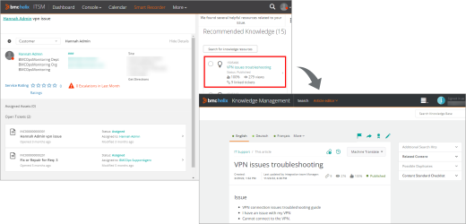  |
| Username and password  | Authentication for local users.  | 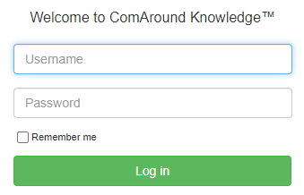  |
| External Identity Provider (IdP)  | Authentication for external users using an external IdP such as Microsoft Entra ID (formerly known as Azure Active Directory (Azure AD).  |   |
| Open portals  | Authentication not required for end users.  | knowledge.calbro.com  |
| Access shared articles  | Authentication not required for end users to view the shared articles.  | https://zero.HKM.com/link*/16 character GUID*/  |

## Permissions to access UI modules in HKM (the HKM Knowledge interface)

The following table describes permissions to access different UI modules for each knowledge worker role:

| **Knowledge worker role**  | **UI module inHKM (the HKM Knowledge interface)**  | | | | | | |
| --- | --- | --- | --- | --- | --- | --- | --- |
| **Content editor - Content section**  | **Content editor - Menu settings**  | **Content editor - Moving folders**  | **Knowledge library**  | **Business Intelligence**  | **Article Quality Index**  | **Administration module**  |
| **Candidate**  | ❌️  | ❌️  | ❌️  | ❌️  | ✅️  | ❌️  | ❌️  |
| **Contributor**  | ✅️  | ❌️  | ❌️  | ❌️  | ✅️  | ❌️  | ❌️  |
| **Publisher**  | ✅️  | ❌️  | ❌️  | ❌️  | ✅️  | ❌️  | ❌️  |
| **Coach**  | ✅️  | ✅️  | ✅️  | ✅️  | ✅️  | ✅️  | ❌️  |
| **Manager**  | ✅️  | ✅️  | ✅️  | ✅️  | ✅️  | ✅️  | ✅️  |

---

## Getting-Started/Using-This-Documentation.md

Learn how to effectively locate information in the product documentation and how to provide feedback to improve documentation further.

Watch this video (2:37) to learn how to navigate the product documentation portal:

[🎥 Watch Video: //www.youtube.com/watch?v=MZVmtdmL5tA](//www.youtube.com/watch?v=MZVmtdmL5tA)

## To select another version of the product

When you find documentation from a search engine, such as a Google search, you might be looking at documentation for  
an older version of the product.

1. Open a topic in the product documentation.
2. In the**Product version**section in the navigation pane, click the version number.
3. From the list of product documentation versions, select the required version.

   After you select the required version from the list, the same topic opens if it's available in the selected version. If the topic is not available or has a different title, you are directed to the homepage of the selected version. You can then search for the specific content.
4. Alternatively, use the breadcrumb to view the content of the page in the other versions.  
   

## To search the product documentation

Use the following methods to search for product content:

| Search type | Procedure |
| --- | --- |
| Global search | Use this search to find information about documentation for different products or solutions. This search box is located on all documentation pages as shown in the following image:  **💡 Tips for better results**   * Use**quotes**for exact phrases: "incident management" * Use**AND/OR**for combining terms: Helix AND upgrade * Use**wildcards**: instal\* to match install, installation, etc. |
| **Product documentation search** | Use this space-level search to find product-specific information such as concepts, architecture, access and navigation, integration, and troubleshooting This search box is located in the left navigation pane on the specific product documentation set page as shown in the following image:   |
| **Advanced search** | Use this to refine your search with additional criteria.   1. Go to the global search or the product documentation search bar. 2. Type the keywords (for example, prompt, API, architecture). You see the search results matching the keywords from the current documentation. 3. Press the**Enter key**to open the search results page with the list that matches the keywords across all documentation.  4. Add additional filtering options to refine your search.    * Result type    * Object type    * Location    * Language  You see the search results list changing as you refine the filters.  |

## To view sections on a page

The**On this page**pane in the product documentation typically serves as a table of contents for the current documentation page. It is beneficial on long pages with multiple sections, such as prerequisites, steps, examples, and troubleshooting.

1. On the right side of the page, you see the**On this page**section, which lists all major headings on the page.
2. Click a heading to jump to the specific part of the page without scrolling.  
   

Use the Toggle panel option to hide this section and get the wider reading area.

## To watch pages for later

Watch pages for your reference during future visits and to limit searches to your set of saved pages.

1. Log in to the documentation portal.
2. Navigate to the page you want to bookmark.
3. Scroll to the bottom of the page.
4. Look for the heart icon and click to save the page.  
   

To remove a saved page from your list, click the heart icon again.

## To provide feedback on a topic

You can take this short survey at the bottom of the page. Your feedback is only visible to the Documentation team. If you are not logged in to the documentation portal, your feedback is recorded anonymously.

1. Go to the "Was this page helpful" section and select an option.  
   
2. Provide details of your feedback.  
   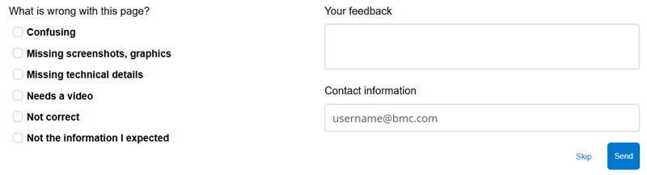
3. Click**Send**to forward your feedback.
4. For any queries or additional feedback, use the**Comments**section.  
     
   You must log in to the documentation portal to add comments.  
     
     
   

---

## Integrating-With-Third-Party-Applications-By-Using.md

HKM integrates with third-party applications such as contact center software, service management tools, and incident management systems by using the HKM Connect APIs. For more information about how to use the APIs and code samples, see[HKM Connect](https://connect.comaround.com/).

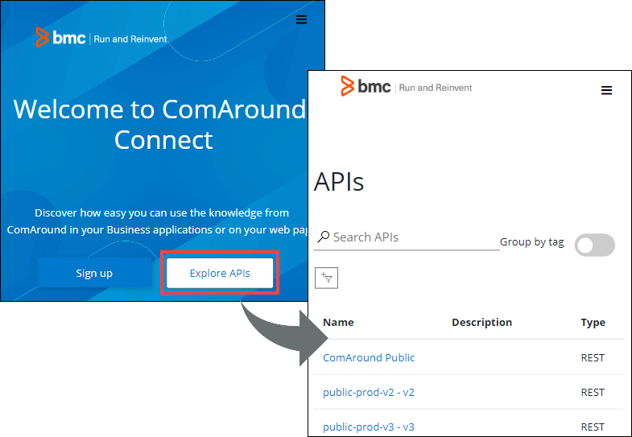

Learn how HKM can be used as a knowledge provider for applications in[Leveraging knowledge articles from HKM in other applications](https://docs.bmc.com/xwiki/bin/view/Service-Management/Employee-Digital-Workplace/BMC-Helix-Knowledge-Management-by-ComAround/hkm/Getting-started/Use-cases/Leveraging-knowledge-articles-from-BMC-Helix-Knowledge-Management-by-ComAround-in-other-BMC-applications/). For more information about using HKM as a knowledge source for HelixGPT, see[Leveraging knowledge articles as a data source for HelixGPT](https://docs.bmc.com/xwiki/bin/view/Service-Management/Employee-Digital-Workplace/BMC-Helix-Knowledge-Management-by-ComAround/hkm/Getting-started/Use-cases/Leveraging-knowledge-articles-as-a-data-source-for-BMC-HelixGPT/).

---

## Release-Notes-And-Notices.md

Learn what’s new or changed for HKM 25.3, including new features, urgent issues, documentation updates, and fixes or patches.

Related topics

[Support information](https://docs.bmc.com/xwiki/bin/view/Service-Management/Employee-Digital-Workplace/BMC-Helix-Knowledge-Management-by-ComAround/hkm/Support-information/)[Knowledge-Centered Service v6 training and certification](https://www.bmc.com/education/courses/find-courses.html#filter/%7B%22products%22%3A%22education-products-138131083%22%7D)

| Date  | Summary  | Reference  |
| --- | --- | --- |
| October 19, 2025 | Enhancements available in 25.4:   * *(Migrated customers only)*Assign knowledge article ownership to user groups. * Create dashboards for HKM. | [25.4 enhancements and patches](https://docs.bmc.com/xwiki/bin/view/Service-Management/Employee-Digital-Workplace/BMC-Helix-Knowledge-Management-by-ComAround/hkm/Release-notes-and-notices/25-4-enhancements-and-patches/) |
| September 5, 2025 | Enhancements available in 25.3 patch 1:   * *(Migrated customers only)*Create user groups and assign content access. | [25.3 enhancements and patches](https://docs.bmc.com/xwiki/bin/view/Service-Management/Employee-Digital-Workplace/BMC-Helix-Knowledge-Management-by-ComAround/hkm/Release-notes-and-notices/25-3-enhancements-and-patches/) |
| August 3, 2025  | Enhancements available in 25.3:   * Enhanced accessibility of the Knowledge vNext user interface. * New branding theme for the Knowledge vNext user interface. * *(Controlled availability customers only)*Preview and edit HKM knowledge articles directly within ITSM. * Use Knowledge Curator to create articles from ITSM incidents. | [25.3 enhancements and patches](https://docs.bmc.com/xwiki/bin/view/Service-Management/Employee-Digital-Workplace/BMC-Helix-Knowledge-Management-by-ComAround/hkm/Release-notes-and-notices/25-3-enhancements-and-patches/)  |

---

## Release-Notes-And-Notices/25.3-Enhancements-And-Patches.md

Review theHKM25.3 enhancements and patches for features that will benefit your organization and to understand changes that might impact your users.

| Version  | Updates and enhancement  |
| --- | --- |
| 25.3  | [Updates in 25.3](https://docs.bmc.com/xwiki/bin/view/Service-Management/Employee-Digital-Workplace/BMC-Helix-Knowledge-Management-by-ComAround/hkm/Release-notes-and-notices/25-3-enhancements-and-patches/#25.3)  |

Related topics

[Release-notes-and-notices](https://docs.bmc.com/xwiki/bin/view/Service-Management/Employee-Digital-Workplace/BMC-Helix-Knowledge-Management-by-ComAround/hkm/Release-notes-and-notices/)

[Deprecated and discontinued features](https://docs.bmc.com/xwiki/bin/view/Service-Management/Employee-Digital-Workplace/BMC-Helix-Knowledge-Management-by-ComAround/hkm/Release-notes-and-notices/Deprecated-and-discontinued-features/)

[Knowledge-Centered Service v6 training and certification](https://www.bmc.com/education/courses/find-courses.html#filter/%7B%22products%22%3A%22education-products-138131083%22%7D)

---

## *(Migrated customers only)*Create user groups and manage content access

**Important**  
This enhancement is available only to customers that have been migrated to the new content storage solution. For more information about the migration,[contact](https://docs.bmc.com/xwiki/bin/view/Service-Management/Employee-Digital-Workplace/BMC-Helix-Knowledge-Management-by-ComAround/hkm/Support-information/)Support.

Managers can independently create and manage user groups directly in HKM, enabling faster configuration of content access and user roles.

With this capability, managers can get the following key improvements:

* Accelerate access setup by removing dependency on support teams.
* Enhance governance by allowing direct control over content visibility and user roles.
* Reduce administrative overhead and streamline onboarding processes.

For more information, see[Creating user groups and assigning content access](https://docs.bmc.com/xwiki/bin/view/Service-Management/Employee-Digital-Workplace/BMC-Helix-Knowledge-Management-by-ComAround/hkm/Creating-user-groups-and-assigning-content-access/).

---

## What else changed after the migration

**Important**  
These enhancements are available only to customers that have been migrated to the new content storage solution. For more information about the migration,[contact](https://docs.bmc.com/xwiki/bin/view/Service-Management/Employee-Digital-Workplace/BMC-Helix-Knowledge-Management-by-ComAround/hkm/Support-information/)Support.

| Update  | Product behavior in the previous storage system  | Product behavior in theupgraded content storage solution  |
| --- | --- | --- |
| Independent statistics and associations for subscribed content  | Subscribed articles share statistics and associations with their original versions.  | Statistics and associations are tracked independently for subscribed articles, enabling clear insights into content engagement across portals.  |
| Standardized culture code format in API responses | Culture codes are returned with uppercase letters in the region part (for example, en-US). | Culture codes are now returned entirely in lowercase (for example, en-us, fr-fr), ensuring consistent formatting. |
| Removal of the*Copy*suffix in the titles of copied articles | Articles copied from another portal have the*Copy*suffix appended to their titles. | Copied articles retain the original title, improving consistency and reducing confusion. |
| Enforced limits on theTakeparameter in News and Recommended APIs | TheTakeparameter in/v1/recommended/{{takeValue}}and/v1/news/{{takeValue}}APIs can be set to any number, potentially returning large result sets. | TheTakeparameter must be set to a value between 1 and 15, ensuring predictable and controlled output from these APIs. |
| Changed the default folder for newly created content | New articles are automatically placed in the**New content**folder. | New articles are placed directly under the portal’s root folder unless a specific location is selected. |
| Removal of folder visibility in search results | Search results include folders alongside articles, making it possible to locate and navigate to folders directly from the search results. | Folders no longer appear in search results. Only articles (text, video, and links) are returned, aligning the behavior with other platforms and simplifying search output. |
| Increased limits for user groups and group membership | Only 64 user groups can be created per company, and each user can belong to a maximum of 64 groups. | Managers can create up to 3000 user groups, and each user can belong to up to 256 groups, enabling more scalable and granular access management. |

---

### 25.3

---

## Enhanced accessibility of the Knowledge vNext interface

The Knowledge vNext interface is enhanced with a wide range of updates to improve UI accessibility and provide an inclusive experience for all users. These changes are available in various areas, including the login page, menu, search results, article pages (Create, Edit, View), and the content editor. Knowledge workers can benefit from the following key improvements:

* Visual indicators, such as icons and descriptive text, are used alongside color, ensuring clarity for all users.
* Images provide alternative text to support screen readers and assistive technologies.
* Live regions are indicated to help assistive tools notify users of real-time content updates.
* Interactive functionality is operable via keyboard, allowing navigation without a mouse.
* Input fields are understandable and accessible without relying solely on placeholder text.

**Important**

Knowledge vNext interface is available when users open HKM from ITSM or Business Workflows.

The following image illustrates a UI enhancement that incorporates visual cues and text alongside color to represent the article state:

---

## New branding theme for the Knowledge vNext user interface

The Knowledge vNext interface features the new corporate branding that includes:

* An updated logo that reflects 's evolving identity.
* Refreshed color palette for a clean visual experience.

These updates enhance the user experience with a modern interface that improves visual clarity, usability, and consistency.

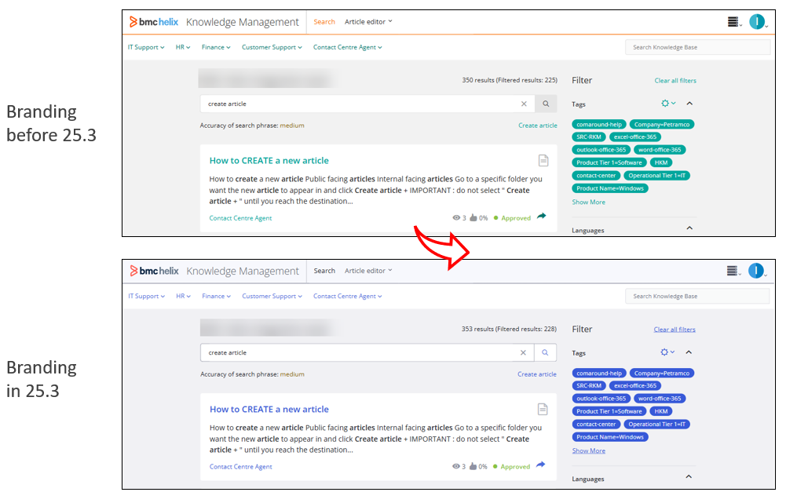

---

## *(Controlled availability customers only)*Preview and edit HKM knowledge articles directly within ITSM

Knowledge workers can preview and edit knowledge articles from HKM directly within the ITSM interface.

Knowledge workers can benefit from a seamless and consistent experience when viewing and editing knowledge articles from HKM. They don't need to navigate away from the ITSM application to preview or edit the knowledge articles from HKM, streamlining workflows and saving time.

​​​​​​Learn more about viewing and editing knowledge articles in[Leveraging knowledge from HKM](https://docs.bmc.com/xwiki/bin/view/Service-Management/IT-Service-Management/BMC-Helix-ITSM/itsm253/Getting-started/Use-cases/Leveraging-knowledge-from-BMC-Helix-Knowledge-Management-by-ComAround/).

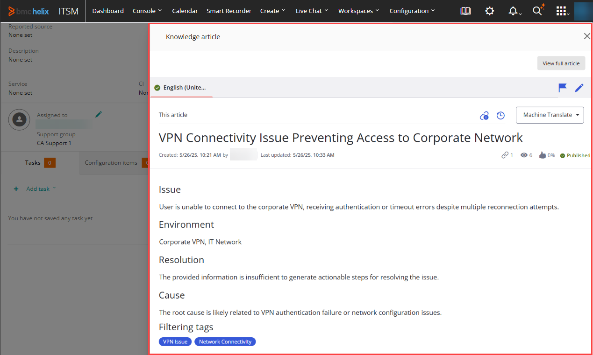

---

## Use Knowledge Curator to create articles from ITSM incidents

Seamlessly create knowledge articles in HKM directly from ITSM incidents, at any stage of the incident lifecycle. Knowledge Curator uses the description, summary, resolution notes, and activity logs from the incident to generate KCS-aligned knowledge articles. The generated knowledge article is then pinned to the originating incident in ITSM.

This capability provides the following benefits:

* Create knowledge articles without leaving the ITSM interface.
* Transform incident details into structured knowledge.
* Instantly access the knowledge article pinned to the corresponding incident.

For more information, see[Configuring the Knowledge Curator agent for HKM](https://docs.bmc.com/xwiki/bin/view/Service-Management/Employee-Digital-Workplace/BMC-Helix-Knowledge-Management-by-ComAround/hkm/Configuring-the-Knowledge-Curator-agent-for-BMC-Helix-Knowledge-Management-by-ComAround/).

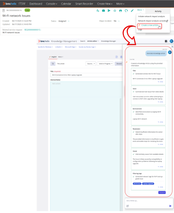

---

## What else changed in this release

| Update  | Product behavior in versions earlier than 25.3  | Product behavior in version 25.3  |
| --- | --- | --- |
| Experience an enhanced design of the Login page  | The Login page displayed the traditional design and branding theme.  | The Login page displays the enhanced design and refreshed branding theme. Additionally, the**Login with AzureID**button has been rebranded to**Login with Microsoft Entra ID**following Microsoft's renaming of Azure ID to Microsoft Entra ID.  |
| Follow tagging conventions that are more consistent with other applications | When adding tags to HKM articles, knowledge workers could include single (') and double (") quotation marks in article tags. | When adding tags to HKM articles, knowledge workers can no longer use single (') or double (") quotation marks. This update ensures tagging consistency across applications. |
| Experience enhanced knowledge articles generated by Knowledge Curator from the Business Workflows cases, driven by the improved prompt. | The prompt occasionally failed to effectively rephrase input from the cases, resulting in articles that closely resembled the original content from the cases. Additionally, it excluded code examples even when they were part of the input. | The**Generate**prompt for Knowledge Curator in Business Workflows has been improved to deliver more effective and compliant knowledge articles. This enhancement provides the following benefits:   * Improved removal of Personally Identifiable Information (PII) * Increased flexibility in rephrasing submitted text * Support for structured formatting, such as bullet points, numbered lists, embedded URLs, and inclusion of code examples in plain text.  For more information about the prompts, see[Configuring the Knowledge Curator agent for HKM](https://docs.bmc.com/xwiki/bin/view/Service-Management/Employee-Digital-Workplace/BMC-Helix-Knowledge-Management-by-ComAround/hkm/Configuring-the-Knowledge-Curator-agent-for-BMC-Helix-Knowledge-Management-by-ComAround/).  |
| Experience improved relevance in search results for knowledge articles. Create advanced filters with complex queries to help find more targeted and relevant knowledge articles.  | When users searched for knowledge articles, only basic filters with individual tags or simple AND/OR logic were supported. | To deliver more precise search results, administrators can create advanced filters by using the combined AND, OR, and NOT operators. These filters with complex queries help users find more targeted and relevant knowledge articles. For more information, see[Creating search filters for applications](https://docs.bmc.com/xwiki/bin/view/Service-Management/Innovation-Suite/BMC-Helix-Innovation-Suite/is253/Enabling-services/Configuring-BMC-Helix-Knowledge-Management-by-ComAround-as-a-knowledge-provider/Creating-search-filters-for-BMC-applications/).  |
| Observe seamless article-to-case association for knowledge articles created from Business Workflows cases. | When a knowledge article was created from a Business Workflows case using the Knowledge Curator agent, the article was not associated with the originating Business Workflows case. | When a knowledge article is created from a Business Workflows case using the Knowledge Curator agent, HKM automatically generates an associated article ID and pins it to the corresponding Business Workflows case. This enhances case context by linking the article directly to the originating case for easy reference. ​​​​For more information, see[Automatically generating knowledge articles](https://docs.bmc.com/xwiki/bin/view/Service-Management/Enterprise-Service-Management/BMC-Helix-Business-Workflows/bwf253/Managing-and-developing-knowledge-articles/Automatically-generating-knowledge-articles/).  |

---

## Release-Notes-And-Notices/25.4-Enhancements-And-Patches.md

Review theHKM25.4 enhancements and patches for features that will benefit your organization and to understand changes that might impact your users.

| Version  | Updates and enhancements  |
| --- | --- |
| 25.4  | [Updates in 25.4](https://docs.bmc.com/xwiki/bin/view/Service-Management/Employee-Digital-Workplace/BMC-Helix-Knowledge-Management-by-ComAround/hkm/Release-notes-and-notices/25-4-enhancements-and-patches/#25_4)  |

Related topics

[Release-notes-and-notices](https://docs.bmc.com/xwiki/bin/view/Service-Management/Employee-Digital-Workplace/BMC-Helix-Knowledge-Management-by-ComAround/hkm/Release-notes-and-notices/)

[Deprecated and discontinued features](https://docs.bmc.com/xwiki/bin/view/Service-Management/Employee-Digital-Workplace/BMC-Helix-Knowledge-Management-by-ComAround/hkm/Release-notes-and-notices/Deprecated-and-discontinued-features/)

[Knowledge-Centered Service v6 training and certification](https://www.bmc.com/education/courses/find-courses.html#filter/%7B%22products%22%3A%22education-products-138131083%22%7D)

## 25.4

---

## *(Migrated customers only)*Assign knowledge article ownership to user groups

**Important**  
This enhancement is available only to customers that have been migrated to the new content storage solution. For more information about the migration,[contact](https://docs.bmc.com/xwiki/bin/view/Service-Management/Employee-Digital-Workplace/BMC-Helix-Knowledge-Management-by-ComAround/hkm/Support-information/)Support.

Knowledge workers can assign ownership of knowledge articles to user groups in HKM, improving accountability and operational clarity.

This capability encourages regular updates, content maintenance, and improves operational efficiency by allowing knowledge managers to monitor and reassign ownership as needed.

For more information, see[Assigning knowledge article ownership to user groups](https://docs.bmc.com/xwiki/bin/view/Service-Management/Employee-Digital-Workplace/BMC-Helix-Knowledge-Management-by-ComAround/hkm/Assigning-knowledge-article-ownership-to-user-groups/).

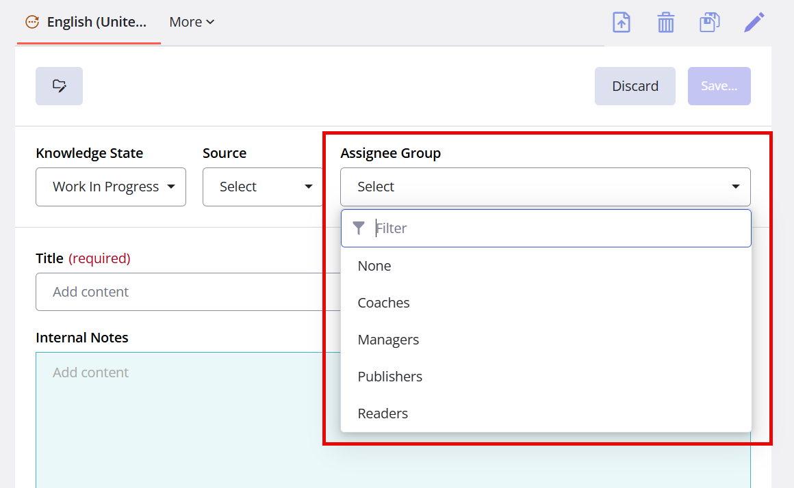

---

## Create dashboards for HKM

Use Dashboards to create custom dashboards that collect and visualize data from HKM. Dashboards provides unified reporting and a consolidated view of data from various applications within your environment. By creating custom dashboards for HKM, you can centralize all reports in one location and use them consistently. This capability offers your organization greater flexibility and adaptability, which means you can adjust reporting criteria and track evolving KPIs quickly.

For more information, see[Creating dashboards for HKM](https://docs.bmc.com/xwiki/bin/view/Service-Management/Employee-Digital-Workplace/BMC-Helix-Knowledge-Management-by-ComAround/hkm/Creating-dashboards-for-BMC-Helix-Knowledge-Management-by-ComAround/).

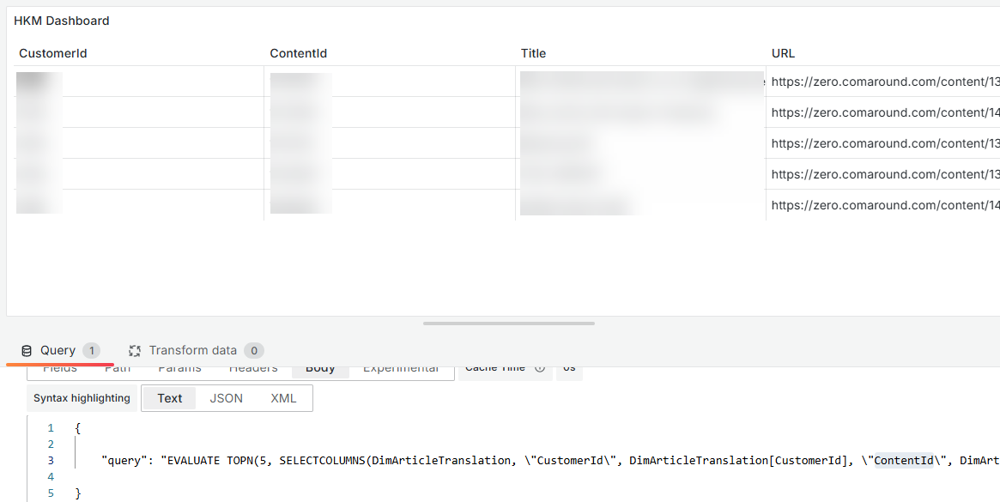

---

## Release-Notes-And-Notices/Deprecated-And-Discontinued-Features.md

Check for announcements that might affect future releases of the product or service. These changes can affect the way in which you configure or run your version of HKM.

**Important**

While every effort is made to provide accurate, forward-looking guidance on product direction to assist you with your buying and planning decisions, cannot guarantee that intentions stated as follows are final and binding.

Related topics

[Support information](https://docs.bmc.com/xwiki/bin/view/Service-Management/Employee-Digital-Workplace/BMC-Helix-Knowledge-Management-by-ComAround/hkm/Support-information/)

[Release notes and notices](https://docs.bmc.com/xwiki/bin/view/Service-Management/Employee-Digital-Workplace/BMC-Helix-Knowledge-Management-by-ComAround/hkm/Release-notes-and-notices/)

## Discontinued features

Discontinued features are no longer available in the product or service.

| Features  | Announcements and recommendations  |
| --- | --- |
| Screencast-O-Matic  | Since November 23, 2023, the Screencast-O-Matic screen recorder has been disabled in HKM.Starting with version 23.3.02, HKM no longer supports the use of this tool. As a result, knowledge workers can no longer use it to make a screen recording in the HKM Knowledge platform. Instead, has introduced a new native video recording tool in the Knowledge vNext platform ([https://knowledge.HKM.com](https://knowledge.comaround.com/)). We recommend that you start using Knowledge vNext to capture the screen when you create or edit articles.  |
| Azure Graph APIs  | Microsoft has deprecated Azure Active Directory (Azure AD) Graph as of June 30, 2023, and moved it into the retirement phase. HKM has used Azure AD Graph APIs to integrate its login server with Microsoft Entra ID (formerly known as Azure Active Directory (Azure AD). Starting with version 23.3.02, HKM will use Microsoft Graph API to integrate the login server with Microsoft Entra ID. All affected customers have already been notified of this change.  |
| Customer types  | Starting with version 23.3.02, HKM no longer supports the following customer types:   * Legacy * Team  All Legacy and Team customers will be upgraded to the Professional customer type.  |
| Azure Media Services  | Microsoft has announced the retirement of Azure Media Services on 30 June 2024, after which it will no longer be supported. HKM has used Azure Media Services to encode uploaded videos. Therefore, starting with version 23.3.02, HKM will no longer use Azure Media Services to encode uploaded videos. As a result, users can upload videos only with the MP4, WebM, and OGG extensions, and these videos must be in an HTML-supported format.  |
| Visits report  | Starting with version 23.3, HKM no longer supports generating the Visits report for analyzing new data. Due to the changes in Azure Application Insights data streaming, HKM stops tracking page views in the application. As a result, the Visits report is no longer populated with new data and will be removed from the application in the near future. Currently, you can continue using it for analyzing historical data that was collected prior to the release of version 23.3. However, if you select a time period for displaying data after the release of version 23.3, you see a blank report.   |
| Multi-import of a single Microsoft Word document (.docx)  | Starting with version 22.1.05, HKM no longer supports creatingmultiple articles and folders from a single Microsoft Word (.docx) document imported to HKM.  |
| Drag-and-drop sorting for lists  | * Starting withversion 22.1.05, HKM no longer supports drag-and-drop sorting of articles and folders in menu lists and the content tree. **Important:**This feature is discontinued for all knowledge portals.  * Starting withversion 22.1.05, article and folder lists are sorted alphabetically, and you can no longer manually control the order of items. If a list contains both articles and folders, the folders have a higher priority and are displayed first. However, you can still manually arrange the order of items for the following UI sections and widgets:   + Folders on the top menu bar   + Recommended widget   + News widget |
| eLearning  | Starting with version 22.1.05, HKM no longer supports the use of the eLearning feature. Note howHKM has handled the existing eLearning content created before the 22.1.05 release:   * All eLearning folders have been converted to standard folders. * The eLearning overview page has been converted to the standard search results page. * All eLearning links are redirected to the search results page. |
| Period of validity  | Starting with version 22.1.05, HKM no longer supports setting a validity period for knowledge articles. has replaced this feature with the Knowledge state scheduler functionality. We recommend that you start using the Knowledge state scheduler to plan and schedulethe automatic change of your article's knowledge state on a specific date.  |

---

## Setting-Up-And-Going-Live.md

HKMis a subscription-based service that you can purchase individually or with Virtual Agent Basic and Advanced licenses. After you subscribe to the service, , Inc. activates your system.

HKMis a multi-tenant system and includes the following environments and integrations:

* Environments—Production
* Integrations (if required)—Microsoft Entra ID (formerly known as Azure Active Directory (Azure AD).

Related topics

[Integrating with third-party applications by using the REST API](https://docs.bmc.com/xwiki/bin/view/Service-Management/Employee-Digital-Workplace/BMC-Helix-Knowledge-Management-by-ComAround/hkm/Integrating-with-third-party-applications-by-using-the-REST-API/)

[User interface overview](https://docs.bmc.com/xwiki/bin/view/Service-Management/Employee-Digital-Workplace/BMC-Helix-Knowledge-Management-by-ComAround/hkm/Getting-started/User-interface-overview/)

[HKM service](https://docs.bmc.com/xwiki/bin/view/Helix-Common-Services/Other/BMC-Helix-Subscriber-Information/helixsubscriber/BMC-Helix-services/BMC-Helix-Knowledge-Management-by-ComAround-service/)in the Subscriber documentation.

## Setting up HKM

, Inc. provides you different types of setups based on your subscription:

* If you have the standalone subscription, learn about your entitlements in[HKM service](https://docs.bmc.com/xwiki/bin/view/Helix-Common-Services/Other/BMC-Helix-Subscriber-Information/helixsubscriber/BMC-Helix-services/BMC-Helix-Knowledge-Management-by-ComAround-service/).
* If you have theService Management Advanced license, learn about your entitlements in[Service Management service](https://docs.bmc.com/xwiki/bin/view/Helix-Common-Services/Other/BMC-Helix-Subscriber-Information/helixsubscriber/BMC-Helix-services/BMC-Helix-Service-Management-service/).
* If you have Virtual Agent Basic or Advancedsubscriptions, learn about your entitlements in[Virtual Agent Basic service](https://docs.bmc.com/xwiki/bin/view/Helix-Common-Services/Other/BMC-Helix-Subscriber-Information/helixsubscriber/BMC-Helix-services/BMC-Helix-Virtual-Agent-Basic-service/)and[Virtual Agent Advanced service](https://docs.bmc.com/xwiki/bin/view/Helix-Common-Services/Other/BMC-Helix-Subscriber-Information/helixsubscriber/BMC-Helix-services/BMC-Helix-Virtual-Agent-Advanced-service/).

Before you make HKM available to the users in your company, you can modify the following portal configurations:

| Task  | Reference  |
| --- | --- |
| Edit organization details  | * [Edit organization details (HKM)](https://zero.comaround.com/en-us/content/971326/?ctxt=search#/)  |
| Modify portal settings  | * [Portal Settings - Settings (HKM)](https://zero.comaround.com/en-us/content/971323/?ctxt=search#/)  |
| Select portal languages  | * [Portal Settings - Settings (HKM)](https://zero.comaround.com/en-us/content/971323/?ctxt=search#/)  * [Portal language (HKM)](https://zero.comaround.com/en-us/content/820231/?ctxt=search#/)  |
| Modify interface settings and branding  | * [Portal Settings - Platform Specific Settings (HKM)](https://zero.comaround.com/en-us/content/1288802/#/) * [Change theme colors in the portal (HKM)](https://zero.comaround.com/en-us/content/760722/?ctxt=search#/)  * [Edit the navigation bar (HKM)](https://zero.comaround.com/en-us/content/617187/#/)  |
| Edit user groups  | * [User groups in administration tool (HKM)](https://zero.comaround.com/en-us/content/970339/?ctxt=search#/)  |
| Create user groups and manage content access | * *(Migrated customers only)*[Creating user groups and assigning content access](https://docs.bmc.com/xwiki/bin/view/Service-Management/Employee-Digital-Workplace/BMC-Helix-Knowledge-Management-by-ComAround/hkm/Creating-user-groups-and-assigning-content-access/) |
| Add users  | * [Add user (HKM)](https://zero.comaround.com/en-us/content/971335/?ctxt=search#/)  |
| Set alarms  | * [Alarms (HKM)](https://zero.comaround.com/en-us/content/1004617/?ctxt=search#/)  |

**Important**

To access these help articles, you must first subscribe, and then log in toHKM.

## Types of users

HKMcan have internal and external users as described in the following image:

---

## Troubleshooting.md

Consult the following topics for information about troubleshooting theHKMproduct and its components, such as problems you might encounter while using the productand accessing the help articles associated with it:

* [Troubleshooting product issues](https://docs.bmc.com/xwiki/bin/view/Service-Management/Employee-Digital-Workplace/BMC-Helix-Knowledge-Management-by-ComAround/hkm/Troubleshooting/Troubleshooting-product-issues/)
* [Troubleshooting access to help articles](https://docs.bmc.com/xwiki/bin/view/Service-Management/Employee-Digital-Workplace/BMC-Helix-Knowledge-Management-by-ComAround/hkm/Troubleshooting/Troubleshooting-access-to-help-articles/)

---

## Troubleshooting/Troubleshooting-Access-To-Help-Articles.md

Even though users are subscribed to HKM and have valid login credentials, they are unable to access help articles within the system.To learn more about product documentation provided by help articles and how to access it, see[Accessing product documentation provided by help articles](https://docs.bmc.com/xwiki/bin/view/Service-Management/Employee-Digital-Workplace/BMC-Helix-Knowledge-Management-by-ComAround/hkm/Getting-started/Accessing-product-documentation-provided-by-help-articles/).

Related topics

[Troubleshooting product issues](https://docs.bmc.com/xwiki/bin/view/Service-Management/Employee-Digital-Workplace/BMC-Helix-Knowledge-Management-by-ComAround/hkm/Troubleshooting/Troubleshooting-product-issues/)

[Product overview](https://docs.bmc.com/xwiki/bin/view/Service-Management/Employee-Digital-Workplace/BMC-Helix-Knowledge-Management-by-ComAround/hkm/Getting-started/Product-overview/)

## Issue symptoms

Users might experience one or more of the following symptoms:

* When attempting to access a help article via a direct link, users receive the following error message:  
  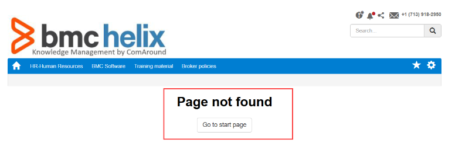

* When users search for a help article directly in HKM, no results are found, and the following error message is returned:  
  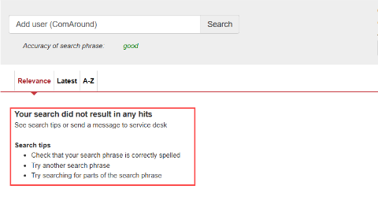

* When users select**Settings**>**Help**in HKM, no help articles are displayed, and the following error message is returned:  
  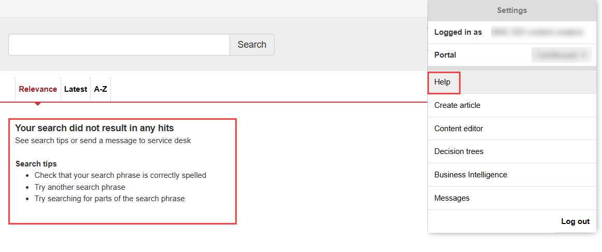

## Issue causes

Users might be unable to access the help articles for the following reasons:

* The**Help**folder containing the help articles has been deleted from the portal. As a result, users can no longer access the articles.
* The**Help**folder is present in the portal but users do not have the necessary role to access the help articles.

## Resolution for the missing Help folder

HKM provides help articles in the**Help**folder, which is included in the customer portal by default. However, customers have the option to manually delete this folder from the portal. If this folder is removed, all help articles will become unavailable.

To check whether the Help folder is missing and to reinstate it, follow these steps:

Knowledge workers with the following roles can check whether the**Help**folder is missing:

* Contributor
* Publisher
* Coach
* Manager

However, only knowledge workers with the following roles can reinstate the missing**Help**folder:

* Coach
* Manager

Learn more about user roles in[Product overview](https://docs.bmc.com/xwiki/bin/view/Service-Management/Employee-Digital-Workplace/BMC-Helix-Knowledge-Management-by-ComAround/hkm/Getting-started/Product-overview/).

1. As a coach or manager, log in to HKM.
2. On the Home page, select**Settings**>**Content editor**.  
   
3. Expand the folder for your portal and check whether the**Help**folder is present.  
   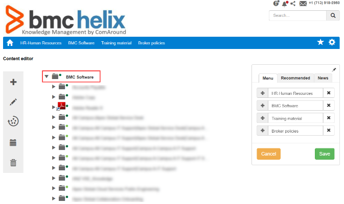
4. If the folder is absent, expand the**Knowledge Library**folder and locate the**Help**folder.  
   

   **Important**

   If you expand the**Help**folder, you might not find any help articles. However, these articles are present in the folder, even if they are not visible.
5. Drag and drop the**Help**folder from Knowledge Library to your portal folder, and then click**Subscribe**.  
   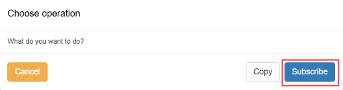

After you complete these steps, it may take a few moments for the**Help**folder to appear in your portal. After the folder is added, check to see whether the help articles can be accessed. If the user who experienced the access issue still cannot access the help articles, verify whether the user has the knowledge worker role.

## Resolution for the insufficient role

Only knowledge workers can access help articles. Users with the Reader role cannot view them. As a user, contact your portal manager to verify whether you have the knowledge worker role. Learn more about user roles in[Product overview](https://docs.bmc.com/xwiki/bin/view/Service-Management/Employee-Digital-Workplace/BMC-Helix-Knowledge-Management-by-ComAround/hkm/Getting-started/Product-overview/).

---

## Troubleshooting/Troubleshooting-Product-Issues.md

Knowledge workers can view troubleshooting information in the help articles hosted on the HKM Knowledge portal. The portal is powered with Microsoft Azure cognitive search, which ensures that you can find the relevant help articles easily and the search results improve over time.

Related topic

[Accessing product documentation provided by help articles](https://docs.bmc.com/xwiki/bin/view/Service-Management/Employee-Digital-Workplace/BMC-Helix-Knowledge-Management-by-ComAround/hkm/Getting-started/Accessing-product-documentation-provided-by-help-articles/)

## Example: Finding troubleshooting articles in the HKM Knowledge help articles

As a knowledge worker, an error is generated when you try to upload a video to a knowledge article. To look for troubleshooting information, perform the following steps:

1. Log in to[HKM Knowledge](https://zero.comaround.com/).

   **Important**

   To access[HKM Knowledge](https://zero.comaround.com/), you must first subscribe to HKM by purchasing the[Service Management Advanced license](https://docs.bmc.com/xwiki/bin/view/Helix-Common-Services/Other/BMC-Helix-Subscriber-Information/helixsubscriber/BMC-Helix-services/BMC-Helix-Service-Management-service/)or the[standalone](https://docs.bmc.com/xwiki/bin/view/Helix-Common-Services/Other/BMC-Helix-Subscriber-Information/helixsubscriber/BMC-Helix-services/BMC-Helix-Knowledge-Management-by-ComAround-service/)license. HKM is also available to customers with entitlements in[Virtual Agent Basic](https://docs.bmc.com/xwiki/bin/view/Helix-Common-Services/Other/BMC-Helix-Subscriber-Information/helixsubscriber/BMC-Helix-services/BMC-Helix-Virtual-Agent-Basic-service/)and[Virtual Agent Advanced](https://docs.bmc.com/xwiki/bin/view/Helix-Common-Services/Other/BMC-Helix-Subscriber-Information/helixsubscriber/BMC-Helix-services/BMC-Helix-Virtual-Agent-Advanced-service/)subscriptions.
2. On the Home page, select**Settings**>**Help**.
3. Enter the search term*error uploading video*  
   You can also filter or browse for a relevant article.
4. From the results, locate the appropriate articles, as in the following example:  
     
   

---

## Validating-Articles-By-Using-The-Knowledge-Curator.md

After the administrator has[configured](https://docs.bmc.com/xwiki/bin/view/Service-Management/Employee-Digital-Workplace/BMC-Helix-Knowledge-Management-by-ComAround/hkm/Configuring-the-Knowledge-Curator-agent-for-BMC-Helix-Knowledge-Management-by-ComAround/)the Knowledge Curator agent, knowledge workers can start using it to validate knowledge articles in HKM.

Knowledge workers can benefit from the validation capabilities of the Knowledge Curator agent in several ways:

* Ensure consistent article quality across the entire knowledge base.
* More readily adopt and implement KCS methodologies because suggestions from the Knowledge Curator agent are rooted in KCS principles.
* Save time and effort when updating the articles as the Knowledge Curator agent simplifies the review process and reduces manual tasks.

**Important**

The validate capability is available for , Inc. customers that use HKM as a knowledge provider for ITSM and Business Workflows.

Related topics

[KCS v6 Practices Guide](https://library.serviceinnovation.org/KCS/KCS_v6/KCS_v6_Practices_Guide)

[AI Agents in HelixGPT](https://docs.bmc.com/xwiki/bin/view/Service-Management/Employee-Digital-Workplace/BMC-HelixGPT/helixgpt254/AI-agents-in-BMC-HelixGPT/)

## Validation capabilities of the Knowledge Curator agent

Knowledge Curator is a HelixGPT-powered agent that uses generative AI capabilities to validate knowledge articles. It utilizes prompt instructions to review articles for quality and recommend improvements. The default prompt instructs the Knowledge Curator agent to use the Knowledge-Centered Service (KCS) principles for validating the articles and suggesting the rewrites. For more information about the KCS principles, see[Learning about KCS v6 verified HKM](https://docs.bmc.com/xwiki/bin/view/Service-Management/Employee-Digital-Workplace/BMC-Helix-Knowledge-Management-by-ComAround/hkm/Getting-started/Use-cases/Learning-about-KCS-v6-verified-BMC-Helix-Knowledge-Management-by-ComAround/).

**Best practice**  
Your organization might decide to use custom prompt instructions for the Knowledge Curator agent. However, recommends adhering to the default prompt text to ensure consistent and reliable generative AI performance. These default instructions have undergone thorough pre-testing withinHKM.

Scenario

Apex Global uses ITSM for handling user requests, incidents, and infrastructure-generated issues and has its knowledge articles inHKM.

Service desk agents use knowledge articles to resolve incidents quickly and accurately. Sometimes, while resolving incidents, service desk agents notice that certain articles are not clear or don't adhere to the KCS principles followed by Apex Global. As knowledge workers, these service desk agents navigate to HKM. They then use the Knowledge Curator  
capabilities to review and enhance knowledge articles by accepting suggestions from the agent.

In addition to validating articles, Knowledge Curator can be used to generate knowledge articles from Business Workflows cases and from ITSM incidents. Learn how to configure these capabilities in[Configuring the Knowledge Curator agent for HKM](https://docs.bmc.com/xwiki/bin/view/Service-Management/Employee-Digital-Workplace/BMC-Helix-Knowledge-Management-by-ComAround/hkm/Configuring-the-Knowledge-Curator-agent-for-BMC-Helix-Knowledge-Management-by-ComAround/).

## Before you begin

Make sure that you have the following licenses and permissions:

* [Service Management Advanced license](https://docs.bmc.com/xwiki/bin/view/Helix-Common-Services/Other/BMC-Helix-Subscriber-Information/helixsubscriber/BMC-Helix-services/BMC-Helix-Service-Management-service/)
* Knowledge worker roles inHKMthat enable you to create and edit articles.  
  For example, Knowledge candidate is the basic knowledge worker role that has editing access to knowledge articles, specifically those that are in progress or in draft. Higher-level roles have access to articles in additional states. For more information about different user roles, see[User roles](https://docs.bmc.com/xwiki/bin/view/Service-Management/Employee-Digital-Workplace/BMC-Helix-Knowledge-Management-by-ComAround/hkm/Getting-started/Product-overview/#roles).

## To validate articles

1. As a knowledge worker, open HKM from a knowledge article in ITSM or Business Workflows.
   1. To open HKM from ITSM, search for an article that you want to validate in ITSM, and click the article link from the search results.  
      ITSMopens the article in the HKM on a new browser tab.
   2. To open HKMfrom Business Workflows, search for an article that you want to validate in Business Workflows, and click the**Go to Article**button from the article preview.  
      Business Workflowsopens the article in the HKM on a new browser tab.
2. Open this article in the Edit mode.  
   After you open HKM from ITSM or Business Workflows, you can also search for knowledge articles that you want to validate directly from HKM.

   **Important**

   **Important:**If you create a new article, you must first save it. The Knowledge Curator agent cannot be launched in an unsaved article. Also, the Knowledge Curator can't be launched in the View mode.
3. In the article edit mode, click the**Ask Helix GPT**button.  
   The HelixGPT pane opens and displays insights on whether this article has been validated.
4. To start the validation process, click**Yes, please validate**.  
   The Knowledge Curator agent returns the improvement suggestions for individual topic sections as well as suggests additional tags for the article. These suggestions are displayed as tiles.
5. Click a specific suggestion tile to view the changes in the corresponding topic section.  
   You can now review the rewrites in the actual article section.

   **Important**

   If you move to another suggestion tile without accepting the rewrites, the suggested changes are deleted from the corresponding topic section.
6. Accept or dismiss the improvement suggestions.

   **Best practice**  
   The Knowledge Curator agent reviews the articles to ensure they meet high-quality standards; however, it cannot verify the accuracy or relevance of the validated content from a technical perspective. Therefore, we recommend thoroughly reviewing the suggested improvements before accepting them.

   1. If you're satisfied with the rewrites, click**Accept**.
   2. If you don't want to implement the changes, click**Dismiss**.
   3. After you click**Dismiss**, suggested rewrites are deleted from the corresponding topic section.
   4. If you want to revert the change after accepting it, click**Undo**.  
      
7. Repeat steps 5 and 6 for each improvement suggestion that you want to implement.  
   You can't accept all or multiple changes at once.
8. If you want additional changes to be made to the article, you can use natural language to instruct the Knowledge Curator agent to add them.  
   For example, you can instruct the Knowledge Curator agent to*Add Windows to the title*.  
   
9. Save the article.

Warning

The Knowledge Curator agent doesn't automatically save the changes made to the article. If you exit the Edit mode without saving the article first, all the changes will be lost.

The Knowledge Curator agent can validate only one language at a time. If the article is available in multiple languages and you want to validate different translations, you must switch to the tab for each language and repeat the validation process separately for each translation.However, to apply the same changes to a title across multiple languages, you can instruct the Knowledge Curator agent to update the title in all languages. For example, the product name needs to be updated in the title in multiple languages.

## Results

After you accept the improvement suggestions and save the article, the updates will be added to it.

## FAQ

The Knowledge Curator agent replies as text without any actionable suggestions. What should I do?

Click the<strong>Start over</strong>button to clear your conversation with the Knowledge Curator agent. You can restart the validation process or repeat your instructions.

<strong>Important:</strong>
<ul><li>After you click the<strong>Start over</strong>button, the accepted suggestions will still apply.</li><li>You might get different improvement suggestions when you rerun the validation.</li></ul>

The Knowledge Curator agent doesn't provide suggestions for specific template sections. What should I do?

Click the<strong>Start over</strong>button to clear your conversation with the Knowledge Curator agent and restart the validation process.

Alternatively, you can explicitly instruct the Knowledge Curator agent to validate information in a specific template section.

<strong>Important:</strong>
<ul><li>After you click the<strong>Start over</strong>button, the accepted suggestions will still apply.</li><li>You might get different improvement suggestions when you rerun the validation.</li></ul>

Can I use Knowledge Curator to find answers or guidance from knowledge articles in external data sources?

Knowledge Curator doesn’t support finding answers or guidance based on knowledge articles from external sources, such as Confluence.

​​​​​

---

