# Documentation Reference: Itsm 25.4

## Table of Contents
- [Getting-Started.md](#getting-startedmd)
- [Getting-Started/Key-Concepts.md](#getting-startedkey-conceptsmd)
- [Release-Notes-And-Notices.md](#release-notes-and-noticesmd)
- [Release-Notes-And-Notices/25.3-Enhancements-And-Patches.md](#release-notes-and-notices253-enhancements-and-patchesmd)
- [Release-Notes-And-Notices/25.4-Enhancements-And-Patches.md](#release-notes-and-notices254-enhancements-and-patchesmd)
- [Release-Notes-And-Notices/Deprecated-And-Discontinued-Features.md](#release-notes-and-noticesdeprecated-and-discontinued-featuresmd)
- [Release-Notes-And-Notices/Deprecated-And-Discontinued-Features/End-Of-Life-Plan-For-Birt-For-To-Dashboards.md](#release-notes-and-noticesdeprecated-and-discontinued-featuresend-of-life-plan-for-birt-for-to-dashboardsmd)
- [Release-Notes-And-Notices/Where-Did-The-Smart-It-Documentation-Go_.md](#release-notes-and-noticeswhere-did-the-smart-it-documentation-go_md)

---

## <a id="getting-startedmd"></a>Getting-Started.md

In an IT Service Management department, your role can be a business user who submits requests; an administrator who configures the system; a service desk agent who resolves issues; a change coordinator who implements change requests; and so on. Use the information here to start usingITSMaccording to your role.

ITSMprovidesa seamless user experience because the basic service management processes, such as creating tickets, viewing related items like tickets, assets, or knowledge articles, and updating profile information are now easier and quicker. TheITSMuser interface reduces the steps involved in performing these tasks. It provides an intuitive, social, and mobile service desk experience that enables a more knowledgeable and collaborative workforce organized around IT roles, not modules.

WithITSMyou:

* Experience an elegant, friction-free UI that is designed for specificITSMroles.
* Access all relevant information in a single window, including a 360-degree view of your customer, service history, and related incidents.
* Experience anytime, anywhere access to complete ITSM functionality from the field (mobile-first design).
* Share knowledge and collaborate in real time with crowd-sourcing.

Orientation

[Overview of Remedyforce](https://docs.bmc.com/xwiki/bin/view/More-Products/RemedyForce/BMC-Helix-Remedyforce/remforce202502/Getting-started/Getting-started-with-BMC-Helix-Remedyforce-modules/Overview-of-BMC-Helix-Remedyforce/)

[Getting started with service request management](https://docs.bmc.com/xwiki/bin/view/More-Products/RemedyForce/BMC-Helix-Remedyforce/remforce202502/Getting-started/Getting-started-with-BMC-Helix-Remedyforce-modules/Getting-started-with-service-request-management/)

[Getting Started with Remedyforce Permission Sets](https://docs.bmc.com/xwiki/bin/view/More-Products/RemedyForce/BMC-Helix-Remedyforce/Remedyforce-20-25-01/Getting-Started-with-BMC-Remedyforce-Permission-Sets/)

[Getting started with incident management](https://docs.bmc.com/xwiki/bin/view/More-Products/RemedyForce/BMC-Helix-Remedyforce/remforce202502/Getting-started/Getting-started-with-BMC-Helix-Remedyforce-modules/Getting-started-with-incident-management/)

[Getting started with change management](https://docs.bmc.com/xwiki/bin/view/More-Products/RemedyForce/BMC-Helix-Remedyforce/remforce202502/Getting-started/Getting-started-with-BMC-Helix-Remedyforce-modules/Getting-started-with-change-management/)

Getting started with various ITSM use cases

[Leveraging Agentic chat to search for information](https://docs.bmc.com/xwiki/bin/view/Service-Management/IT-Service-Management/BMC-Helix-ITSM/itsm254/Getting-started/Use-cases/Leveraging-BMC-HelixGPT-chat-to-search-for-information/)

[Leveraging Knowledge Curator for creating knowledge articles from incidents](https://docs.bmc.com/xwiki/bin/view/Service-Management/IT-Service-Management/BMC-Helix-ITSM/itsm254/Getting-started/Use-cases/Create-knowledge-articles-from-incidents-by-using-Knowledge-Curator/)

[Leveraging Service Collaborator for automatically responding to inbound emails](https://docs.bmc.com/xwiki/bin/view/Service-Management/IT-Service-Management/BMC-Helix-ITSM/itsm254/Getting-started/Use-cases/Automatically-responding-to-inbound-emails-by-leveraging-Service-Collaborator/)

[Leveraging AI Service Management capabilities](https://docs.bmc.com/xwiki/bin/view/Service-Management/IT-Service-Management/BMC-Helix-ITSM/itsm254/Getting-started/Use-cases/Leveraging-AI-Service-Management-capabilities/)

[Leveraging the out-of-the-box IT services](https://docs.bmc.com/xwiki/bin/view/Service-Management/IT-Service-Management/BMC-Helix-ITSM/itsm254/Getting-started/Use-cases/Leveraging-the-out-of-the-box-IT-services/)

[Leveraging knowledge from HKM](https://docs.bmc.com/xwiki/bin/view/Service-Management/IT-Service-Management/BMC-Helix-ITSM/itsm254/Getting-started/Use-cases/Leveraging-knowledge-from-BMC-Helix-Knowledge-Management-by-ComAround/)

[Automating Service Management and Operations Management tasks](https://docs.bmc.com/xwiki/bin/view/Service-Management/IT-Service-Management/BMC-Helix-ITSM/itsm254/Getting-started/Use-cases/Automating-Service-Management-and-Operations-Management-tasks/)

[Automating the F5 devices backup and restore tasks](https://docs.bmc.com/xwiki/bin/view/Service-Management/IT-Service-Management/BMC-Helix-ITSM/itsm254/Getting-started/Use-cases/Automating-the-F5-devices-backup-and-restore-tasks/)

[Automating the updating of whitelists for F5 devices](https://docs.bmc.com/xwiki/bin/view/Service-Management/IT-Service-Management/BMC-Helix-ITSM/itsm254/Getting-started/Use-cases/Automating-the-updating-of-whitelists-for-F5-devices/)

[Automating the renewal of SSL certificates for F5 load balancers](https://docs.bmc.com/xwiki/bin/view/Service-Management/IT-Service-Management/BMC-Helix-ITSM/itsm254/Getting-started/Use-cases/Automating-the-renewal-of-SSL-certificates-for-F5-load-balancers/)

[Automating database resource increase](https://docs.bmc.com/xwiki/bin/view/Service-Management/IT-Service-Management/BMC-Helix-ITSM/itsm254/Getting-started/Use-cases/Automating-database-resource-increase/)

[Automating IT Infrastructure operations](https://docs.bmc.com/xwiki/bin/view/Service-Management/IT-Service-Management/BMC-Helix-ITSM/itsm254/Getting-started/Use-cases/Automating-IT-Infrastructure-operations/)

Getting started with ServiceOps

[ServiceOps overview](https://docs.bmc.com/xwiki/bin/view/Service-Management/IT-Service-Management/BMC-Helix-ITSM/itsm254/Getting-started/ServiceOps-overview/)

Read the following content to get started withITSM:

| Section<br> | Description<br> |
| --- | --- |
| [Product-overview](https://docs.bmc.com/xwiki/bin/view/Service-Management/IT-Service-Management/BMC-Helix-ITSM/itsm254/Getting-started/Product-overview/)<br> | Overview of product and documentation.<br> |
| [Getting started with Asset Management](https://docs.bmc.com/xwiki/bin/view/Service-Management/IT-Service-Management/BMC-Helix-ITSM-Asset-Management/asset254/Getting-started/Getting-started-with-Asset-Management/)<br>[Learning about Change Management](https://docs.bmc.com/xwiki/bin/view/Service-Management/IT-Service-Management/BMC-Helix-ITSM-Change-Management/change254/Getting-started/Learning-about-Change-Management/)<br>[Learning about Incident Management](https://docs.bmc.com/xwiki/bin/view/Service-Management/IT-Service-Management/BMC-Helix-ITSM-Service-Desk/servicedesk254/Getting-started/Learning-about-Incident-Management/)<br>[Learning about Knowledge Management](https://docs.bmc.com/xwiki/bin/view/Service-Management/IT-Service-Management/BMC-Helix-ITSM-Knowledge-Management/km254/Getting-started/Learning-about-Knowledge-Management/)<br>[Learning about Problem Management](https://docs.bmc.com/xwiki/bin/view/Service-Management/IT-Service-Management/BMC-Helix-ITSM-Service-Desk/servicedesk254/Getting-started/Learning-about-Problem-Management/)<br>[Learning about Release Management](https://docs.bmc.com/xwiki/bin/view/Service-Management/IT-Service-Management/BMC-Helix-ITSM-Change-Management/change254/Getting-started/Learning-about-Release-Management/)<br>[Quick start to creating and managing service requests and work orders](https://docs.bmc.com/xwiki/bin/view/Service-Management/IT-Service-Management/BMC-Service-Request-Management/srm254/Getting-started/Quick-start-to-creating-and-managing-service-requests-and-work-orders/)<br> | Information about key areas, and how to work in those areas inITSM.<br> |
| [Key-concepts](https://docs.bmc.com/xwiki/bin/view/Service-Management/IT-Service-Management/BMC-Helix-ITSM/itsm254/Getting-started/Key-concepts/)<br> | Product architecture and other key concepts.<br> |
| [Use-cases](https://docs.bmc.com/xwiki/bin/view/Service-Management/IT-Service-Management/BMC-Helix-ITSM/itsm254/Getting-started/Use-cases/)<br> | Details about the use cases.<br> |
| [Best-practices-for-ITSM](https://docs.bmc.com/xwiki/bin/view/Service-Management/IT-Service-Management/BMC-Helix-ITSM/itsm254/Getting-started/Best-practices-for-BMC-Helix-ITSM/)<br> | Best practices forITSM.<br> |

---

## <a id="getting-startedkey-conceptsmd"></a>Getting-Started/Key-Concepts.md

The variousITSMconcepts are necessary to understand howITSMworks.

Key concepts for ITSM: Service Desk

[Incident Management overview](https://docs.bmc.com/xwiki/bin/view/Service-Management/IT-Service-Management/BMC-Helix-ITSM-Service-Desk/servicedesk254/Getting-started/Key-concepts/Incident-Management-overview/)

[Problem Management overview](https://docs.bmc.com/xwiki/bin/view/Service-Management/IT-Service-Management/BMC-Helix-ITSM-Service-Desk/servicedesk254/Getting-started/Key-concepts/Problem-Management-overview/)

Key concepts for ITSM: Asset Management

[Asset Management concept](https://docs.bmc.com/xwiki/bin/view/Service-Management/IT-Service-Management/BMC-Helix-ITSM-Asset-Management/asset254/Getting-started/Key-concepts/Asset-Management-concept/)

[Asset Management overview](https://docs.bmc.com/xwiki/bin/view/Service-Management/IT-Service-Management/BMC-Helix-ITSM-Asset-Management/asset254/Getting-started/BMC-Helix-ITSM-Asset-Management-overview/)

Key concepts for ITSM: Change Management and Release Management

[Learning about Change Management](https://docs.bmc.com/xwiki/bin/view/Service-Management/IT-Service-Management/BMC-Helix-ITSM-Change-Management/change254/Getting-started/Learning-about-Change-Management/)

[Learning about Release Management](https://docs.bmc.com/xwiki/bin/view/Service-Management/IT-Service-Management/BMC-Helix-ITSM-Change-Management/change254/Getting-started/Learning-about-Release-Management/)

Key concepts for ITSM: Knowledge Management

[Knowledge Management overview](https://docs.bmc.com/xwiki/bin/view/Service-Management/IT-Service-Management/BMC-Helix-ITSM-Knowledge-Management/km254/Getting-started/Key-concepts/Knowledge-Management-overview/)

[Knowledge-Centered Service overview](https://docs.bmc.com/xwiki/bin/view/Service-Management/IT-Service-Management/BMC-Helix-ITSM-Knowledge-Management/km254/Getting-started/Key-concepts/Knowledge-Centered-Service-overview/)

Key concepts for DWP

[DWP overview](https://docs.bmc.com/xwiki/bin/view/Service-Management/Employee-Digital-Workplace/BMC-Helix-Digital-Workplace/dwp254/Getting-started/Product-overview/)

Key concepts for Service Level Management

[Learning about Service Level Management](https://docs.bmc.com/xwiki/bin/view/Service-Management/IT-Service-Management/BMC-Service-Level-Management/slm254/Getting-started/Learning-about-Service-Level-Management/)

[Service Level Management overview](https://docs.bmc.com/xwiki/bin/view/Service-Management/IT-Service-Management/BMC-Service-Level-Management/slm254/Getting-started/BMC-Service-Level-Management-overview/)

Key concepts for Smart Recorder

[Smart Recorder overview](https://docs.bmc.com/xwiki/bin/view/Service-Management/IT-Service-Management/BMC-Helix-ITSM-Service-Desk/servicedesk254/Getting-started/Key-concepts/Smart-Recorder-overview/)

Key concepts for Multi-Cloud Broker for ITSM

[Multi-Cloud Broker for ITSM](https://docs.bmc.com/xwiki/bin/view/Service-Management/IT-Service-Management/BMC-Helix-ITSM-Service-Desk/servicedesk254/Getting-started/Key-concepts/BMC-Helix-Multi-Cloud-Broker-for-BMC-Helix-ITSM/)

---

## <a id="release-notes-and-noticesmd"></a>Release-Notes-And-Notices.md

Learn what’s new or changed forITSM, including new features, urgent issues, documentation updates, and fixes or patches.

Related topics

[Known-and-corrected-issues](https://docs.bmc.com/xwiki/bin/view/Service-Management/IT-Service-Management/BMC-Helix-ITSM/itsm254/Release-notes-and-notices/Known-and-corrected-issues/)

[IT Service Management Deployment](https://docs.bmc.com/xwiki/bin/view/Service-Management/On-Premises-Deployment/BMC-Helix-Service-Management-Deployment/brid25301/)

[IS release notes](https://docs.bmc.com/xwiki/bin/view/Service-Management/Innovation-Suite/BMC-Helix-Innovation-Suite/is254/Release-notes-and-notices/)

[CMDB release notes](https://docs.bmc.com/xwiki/bin/view/Service-Management/IT-Service-Management/BMC-Helix-CMDB/ac254/Release-notes-and-notices/)

[Change Management release notes](https://docs.bmc.com/xwiki/bin/view/Service-Management/IT-Service-Management/BMC-Helix-ITSM-Change-Management/change254/Release-notes-and-notices/)

[Asset Management release notes](https://docs.bmc.com/xwiki/bin/view/Service-Management/IT-Service-Management/BMC-Helix-ITSM-Asset-Management/asset254/Release-notes-and-notices/)

[Service Desk release notes](https://docs.bmc.com/xwiki/bin/view/Service-Management/IT-Service-Management/BMC-Helix-ITSM-Service-Desk/servicedesk254/Release-notes-and-notices/)

[Helix Single sign-on Release notes and notices](https://docs.bmc.com/xwiki/bin/view/Helix-Common-Services/Single-Sign-On/BMC-Helix-Single-Sign-On/hsso253/)

| Date | Summary | Reference |
| --- | --- | --- |
| November 20, 2025<br> | [Issues that were corrected by 25.4.01 and issues that remain open](https://docs.bmc.com/xwiki/bin/view/Service-Management/IT-Service-Management/BMC-Helix-ITSM/itsm254/Release-notes-and-notices/Known-and-corrected-issues/)<br>Patch 1 is available for SaaS and on-premises customers.<br> | [25.4 enhancements and patches](https://docs.bmc.com/xwiki/bin/view/Service-Management/IT-Service-Management/BMC-Helix-ITSM/itsm254/Release-notes-and-notices/25-4-enhancements-and-patches/) |
| October 17, 2025 | Enhancements to ITSM 25.4.00 are:<br>  * Use the ITSM Agent to get improved answers in Ask HelixGPT * Search for work orders, assets, and problem investigations by using the Agentic chat * Request access to the Microsoft Teams chat and get updated incident details by using the Ops Swarmer agent * *(Controlled availability customers only)*Localize CMDB and Foundation data to enhance user experience * Prioritize frequently used filter options for quick access * *(Controlled availability customers only)*Link and resolve HKM knowledge articles in ITSM * *(Controlled availability customers only)*Reduce manual efforts to identify missing or invalid CI details by creating data monitoring rules * Predict incident-related service disruptions for faster resolution * Rule-based automatic impact analysis of change requests * Accelerate incident resolution with automated CI and situation insights from AIOps * Track approval details for service requests in ITSM managed through DWP * Apply complex expressions in the Shared Ticket Console to analyze data * Set locale, time zone, and date formats directly from the UI Enhancements to IS 25.4.00 are:<br>  * Get context-aware responses by attaching images to HelixGPT chat * Access frequently used filter options quickly * Configure event handlers in the View designer to automatically trigger actions at runtime * Flexibility to enforce parent-child record associations to reduce errors * Support for the Catalan locale * Enable archiving on audit records * Launch Dashboards from the AR System Report Console to manage reports * Configure the Results list in Progressive View by using Developer Studio * Date/Time fields can store values beyond January 19, 2038 * Improve AR System server startup time by usage-based loading of forms * Configure support group and assignee fields for cases  Enhancements to CMDB 25.4.00 are:<br>  * Improved RE Performance with Java-based Miscellaneous Service * Access the Analytics option to manage data collection consent * Date/Time fields support dates beyond 2038 | [25.4 enhancements and patches](https://docs.bmc.com/xwiki/bin/view/Service-Management/IT-Service-Management/BMC-Helix-ITSM/itsm254/Release-notes-and-notices/25-4-enhancements-and-patches/) |

---

## <a id="release-notes-and-notices253-enhancements-and-patchesmd"></a>Release-Notes-And-Notices/25.3-Enhancements-And-Patches.md

Review the ITSM 25.3 enhancements for features that will benefit your organization and to understand changes that might impact your users.

| Version | SaaS | On premises | Fixed issues | Updates |
| --- | --- | --- | --- | --- |
| 25.3.02 | ✅️ |  | [Known and corrected issues](https://docs.bmc.com/xwiki/wiki/internal/view/Service-Management/IT-Service-Management/itsmMaster2/Release-notes-and-notices/Known-and-corrected-issues/) | [25.3.02 enhancements](https://docs.bmc.com/xwiki/bin/view/Service-Management/IT-Service-Management/BMC-Helix-ITSM/itsm254/Release-notes-and-notices/25-3-enhancements-and-patches/#25302) |
| 25.3.01 | ✅️ | ✅️ | [Known and corrected issues](https://docs.bmc.com/xwiki/wiki/internal/view/Service-Management/IT-Service-Management/itsmMaster2/Release-notes-and-notices/Known-and-corrected-issues/) | [25.3.01 enhancements](https://docs.bmc.com/xwiki/bin/view/Service-Management/IT-Service-Management/BMC-Helix-ITSM/itsm254/Release-notes-and-notices/25-3-enhancements-and-patches/#25301) |
| 25.3.00 | ✅️ |  | [Known and corrected issues](https://docs.bmc.com/xwiki/wiki/internal/view/Service-Management/IT-Service-Management/itsmMaster2/Release-notes-and-notices/Known-and-corrected-issues/) | [25.3.00 enhancements](https://docs.bmc.com/xwiki/bin/view/Service-Management/IT-Service-Management/BMC-Helix-ITSM/itsm254/Release-notes-and-notices/25-3-enhancements-and-patches/#25300) |

applies upgrades as described in the[Upgrade policy](https://docs.bmc.com/xwiki/bin/view/Helix-Common-Services/Other/BMC-Helix-Subscriber-Information/helixsubscriber/Policies/BMC-Helix-Upgrade-policy/). applies upgrades and patches during[Maintenance windows](https://docs.bmc.com/xwiki/bin/view/Helix-Common-Services/Other/BMC-Helix-Subscriber-Information/helixsubscriber/Operations/Maintenance-windows/).

---

## 25.3.02

There are no new features or enhancements in this release.

## 25.3.01

There are no new features or enhancements in this release

## 25.3.00

## ITSM enhancements

### Create knowledge articles from incidents by using the Knowledge Curator AI agent for faster incident resolution

As a service desk agent, create knowledge articles from incidents directly in HKM by using the Knowledge Curator AI Agent.

This capability provides the following benefits:

* Users need not navigate away from the incident to create a knowledge article.
* Incident data, such as description, summary, and work notes is used to generate the knowledge article.
* The knowledge article is automatically pinned to the incident for ready reference.


Learn more about how to create knowledge articles by using the Knowledge Curator agent in ITSM in[Creating knowledge articles from incidents by using Knowledge Curator](https://docs.bmc.com/xwiki/bin/view/Service-Management/IT-Service-Management/BMC-Helix-ITSM/itsm254/Getting-started/Use-cases/Create-knowledge-articles-from-incidents-by-using-Knowledge-Curator/).

### Use the Service Collaborator AI agent to automatically send email responses for inbound emails

As an administrator, enable automatic responses to inbound emails by using the Service Collaborator AI Agent. The AI agent understands the incident and sends an appropriate response to the email. The response contains a summary of the information retrieved from published knowledge articles with recommended resolutions for the incident. If users find the response helpful, they can resolve the incident directly by clicking**Resolve**button in the email body.

This capability provides the following benefits:

* Reduces agent workload by automating routine email responses.
* Improves response time and user satisfaction with faster, accurate replies.
* Increases operational efficiency by allowing agents to focus on complex issues while Service Collaborator handles common queries.


Learn more about enabling automatic responses to inbound emails in[Enabling automatic responses to inbound emails by using Agentic AI](https://docs.bmc.com/xwiki/bin/view/Service-Management/IT-Service-Management/BMC-Helix-ITSM/itsm254/Setting-up-and-going-live/Configuring-settings-to-use-Agentic-AI-capabilities/Enabling-automatic-responses-to-inbound-emails-using-Agentic-AI/).

### *(Controlled availability customers only)*Preview and edit HKM knowledge articles directly within ITSM

As a Service Desk Agent, preview and edit knowledge articles from HKM directly within the ITSM interface.

This capability provides the following benefits:

* No need to navigate away from the ITSM application to preview and edit the knowledge articles from HKM, streamlining workflows and saving time.
* Experience a seamless user interaction of viewing and editing knowledge articles from both sources with easy navigation.
* Use similar editing capabilities for the knowledge articles from both sources.


Learn more about viewing and editing knowledge articles in[Leveraging knowledge from HKM](https://docs.bmc.com/xwiki/bin/view/Service-Management/IT-Service-Management/BMC-Helix-ITSM/itsm254/Getting-started/Use-cases/Leveraging-knowledge-from-BMC-Helix-Knowledge-Management-by-ComAround/).

### Use the enhanced Agentic Chat to search for incidents, change requests, and knowledge articles

As a Service Desk Agent, use Agentic Chat for an improved, conversational experience when searching for incidents, change requests, and information from knowledge articles.

The improved chat provides the following benefits:

* When an administrator enables HelixGPT for ITSM, Agentic chat is available out of the box. The administrator need not enable it separately.
* A user can retrieve similar and related incidents in the chat and access incidents, change requests, and person objects directly from the chat through inline links.


Learn how to use Agentic Chat in[Searching for information by using HelixGPT chat](https://docs.bmc.com/xwiki/wiki/internal/view/Service-Management/IT-Service-Management/itsmMaster2/Navigating-common-interfaces/Searching-for-information-by-using-BMC-HelixGPT-chat/25-3-00#).

### Use predefined prompts in Ask HelixGPT to accelerate incident resolution and improve response consistency

As a service desk agent, use predefined prompts in Ask HelixGPT to minimize manual entry of standard queries and accelerate incident resolution. An administrator can also modify the predefined prompts according to the business requirement.

This capability provides the following benefits:

* Ease of use and improved user interaction, resulting in faster resolution of incidents.
* Customization of predefined prompts according to business requirements.


Learn how to use the predefined prompts in[Resolving tickets with the help of Ask HelixGPT](https://docs.bmc.com/xwiki/wiki/internal/view/Service-Management/IT-Service-Management/sdMaster2/Managing-incident-requests/Resolving-incident-requests/Resolving-tickets-with-the-help-of-Ask-HelixGPT/25-3).

### Use auto ticket categorization for accelerated incident resolution by leveraging AI capabilities

As a Service Desk Manager, leverage the capabilities of artificial intelligence (AI) to analyze historical, closed incidents to classify incoming incidents into appropriate categories. AI also predicts the best-suited support group for resolving incidents.

This AI-based capability provides the following benefits:

* Better classification of incidents into categories, resulting in quicker resolutions.
* Improved assignments to support groups, ensuring appropriate utilization of support resources.


Learn how auto-categorization works in[Creating incident requests](https://docs.bmc.com/xwiki/wiki/internal/view/Service-Management/IT-Service-Management/sdMaster2/Managing-incident-requests/Registering-incident-requests/Creating-an-incident-request/25-3#).

### Use contextual search in the Contracts console filters

As a user, leverage the type-ahead search in filters in the Contracts console to get contextual suggestions for search criteria such as email ID and department. Suggestions appear after you enter the first three characters.

This capability provides the following benefits:

* Alignment with other ITSM consoles, delivering a consistent, intuitive user experience across consoles.
* Service desk agents require less training to work on multiple consoles, improving productivity.


Learn more about the Contract console in[Managing contracts through the Contracts console](https://docs.bmc.com/xwiki/wiki/internal/view/Service-Management/IT-Service-Management/assetMaster2/Managing-contracts/Managing-contracts-through-the-Contract-console/).

### Create a contract from an asset or another contract

As an asset manager, create a contract from an asset or a contract ticket and relate it without navigating away from the ticket. You can also associate existing contracts with assets**.**This capability is consistent with Mid Tier and reduces the repetitive steps, saving you time and effort in asset management.


Learn more about creating and relating contracts in[Creating and updating contracts](https://docs.bmc.com/xwiki/wiki/internal/view/Service-Management/IT-Service-Management/assetMaster2/Managing-contracts/Creating-and-updating-contracts/)and[Relating contracts and CIs](https://docs.bmc.com/xwiki/wiki/internal/view/Service-Management/IT-Service-Management/assetMaster2/Managing-contracts/Relating-contracts-to-CIs/).

### Detect major incidents by using additional qualifiers

As a Service Desk Manager, get recommendations to assess whether an incident candidate qualifies to be classified as a major incident. This assessment is based on advanced major incident qualifiers such as economic impact, data loss, and reputational impact.

This capability provides the following benefits:

* Use the recommendation to identify major incidents and their risks in advance to reduce the impact of major incidents.
* Improve the overall incident management in your organization.


Learn how to detect major incidents in[Managing major incidents](https://docs.bmc.com/xwiki/wiki/internal/view/Service-Management/IT-Service-Management/sdMaster2/Managing-incident-requests/Managing-and-tracking-major-incidents/).

### *(Controlled availability customers only)*Localize foundation data to meet locale-specific language requirements

Localize the foundation data in the supported languages to enable users to view it in their preferred language while maintaining language consistency with the application user interface.

Localizing the foundation data helps you adhere to the region-specific language compliance requirements and also enhances user experience.

For more information, see[Localizing foundation data into the supported languages](https://docs.bmc.com/xwiki/bin/view/Service-Management/IT-Service-Management/BMC-Helix-ITSM/itsm254/Administering/Localizing-foundation-data-into-the-supported-languages/).

### Enhanced localization support

Localization support is extended for the following entities:

* System-generated activity notes on PWA screens
* IS-based Create change freeze page
* English Canada (EN\_CA) and French Canada (FR\_CA) languages supported for Mid Tier

Learn about the supported languages in[Supported languages and locales](https://docs.bmc.com/xwiki/bin/view/Service-Management/IT-Service-Management/BMC-Helix-ITSM/itsm253/Planning/Supported-languages-and-locales/).

## What else has changed in this release

| Update | Product behavior in versions earlier than 25.3.00 | Product behavior in version 25.3.00 |
| --- | --- | --- |
| The**Contactmiddlename**field is available out of the box in the ITSM Tickets CRD for the Shared Ticket Console. | In the ITSM Tickets CRD, only the**Contactfirstname**,**Contactlastname**, and**Contactfullname**fields are available out of the box for contact names. The**Contactmiddlename**field is not available.<br> | The**Contactmiddlename**field is available out of the box in the ITSM Tickets CRD. You can add this field to the ticket console record grid and search, filter, or sort contacts by their middle name in the Shared Ticket Console.<br>For more information about the Shared Ticket Console, see[Customizing Shared Ticket Console](https://docs.bmc.com/xwiki/bin/view/Service-Management/IT-Service-Management/BMC-Helix-ITSM/itsm252/Administering/Enabling-and-customizing-Shared-Ticket-Console/Customizing-Shared-Ticket-Console/)and[Managing your work by using Ticket Console](https://docs.bmc.com/xwiki/bin/view/Service-Management/IT-Service-Management/BMC-Helix-ITSM/itsm253/Navigating-common-interfaces/Managing-your-work-by-using-Ticket-Console/).<br> |
| Unified log format across services boosts event correlation | The log entry formats vary, particularly in timestamps and time zone offsets. It is difficult for a central logging solution to support logging across all tenants and applications. | A unified log format across multiple services in a distributed environment is implemented, enhancing the ability to quickly correlate and analyze sequences of events. |
| Ability to customize the Contracts console. | The Contracts console did not support customization. | The following views in the Contracts console support customization:<br>  * Contracts console * Related contracts * Related assets  For more details,[Enabling and configuring the Contract console](https://docs.bmc.com/xwiki/wiki/internal/view/Service-Management/IT-Service-Management/assetMaster2/Administering/Enabling-or-disabling-the-Contract-Console/).<br> |
| The**Resolution note**field is preserved when an incident is reverted from**Resolved**to a prior status, if it contains resolution-specific information.<br> | On PWA screens, the resolution note was removed when you reverted a resolved incident to a prior status.<br> | On PWA screens, the resolution note is preserved when you revert a resolved incident to a prior status. However, if you remove the resolution-specific details from the**Resolution note**field while reverting the incident to a previous status, the field is removed.<br>This functionality aligns with the incident behavior in the Mid Tier and non-PWA screens and provides you with a seamless experience of using ITSM products.<br>For more details, see[Moving a resolved incident request back to In Progress](https://docs.bmc.com/xwiki/wiki/internal/view/Service-Management/IT-Service-Management/sdMaster2/Managing-incident-requests/Resolving-incident-requests/Moving-a-resolved-incident-request-back-to-In-Progress/)and[Reopening a closed or resolved incident request](https://docs.bmc.com/xwiki/wiki/internal/view/Service-Management/IT-Service-Management/sdMaster2/Managing-incident-requests/Reopening-a-closed-or-resolved-incident-request/).<br> |

## ITSM Insights enhancements

### Investigate issues by using the Proactive Problem Management Advanced Analytics dashboard

As a problem coordinator, use the Proactive Problem Management Advanced Analytics dashboard to quickly identify incident trends and resolution patterns for every Proactive problem management job.

This capability provides the following benefits:

* Provides actionable insights about incident patterns and their volume.
* Helps in investigating and resolving problems more efficiently.


Learn more about ITSM Insights dashboards in[Tracking ITSM Insights usage in Dashboards](https://docs.bmc.com/xwiki/wiki/internal/view/Service-Management/IT-Service-Management/insightsMaster/Tracking-ITSM-Insights-usage-in-BMC-Helix-Dashboards/).


## IS 25.3.00 enhancements

25.3 enhancements and patches

## 25.3.01 updates

## Use updated support for technology stack

Service Management supports the following technology stacks:

* Kubernetes version 1.33
* OpenShift version 4.19
* Nginx Ingress Controller version 1.12.4
* Helm 3.18

For more information, see[System requirements](https://docs.bmc.com/xwiki/bin/view/Service-Management/On-Premises-Deployment/BMC-Helix-Service-Management-Deployment/brid25301/Planning/System-requirements/).

## *(Controlled availability customers only)*Deploy Service Management platform components

To optimize resource utilization and minimize your environmental footprint, deploy only the platform components of Service Management using the CORE deployment mode. This mode loads only the essential components and services into memory, allowing you to start with a lightweight setup and scale up based on your operational needs. Use the CORE mode to activate only the following components:

* IS
* CMDB
* Foundation data objects
* *(Optional)*HelixGPT and Clam AntiVirus

For more information, see[Deploying Service Management in the CORE mode](https://docs.bmc.com/xwiki/bin/view/Service-Management/On-Premises-Deployment/BMC-Helix-Service-Management-Deployment/brid25301/Getting-started/Deployment-use-cases/Deploy-BMC-Helix-Service-Management-platform-components/),[Performing the Service Management installation,](https://docs.bmc.com/xwiki/bin/view/Service-Management/On-Premises-Deployment/BMC-Helix-Service-Management-Deployment/brid25301/Installing/Performing-the-BMC-Helix-Service-Management-installation/)and[Transitioning between deployment modes.](https://docs.bmc.com/xwiki/bin/view/Service-Management/On-Premises-Deployment/BMC-Helix-Service-Management-Deployment/brid25301/Administering/Transitioning-between-deployment-modes/)

## What else changed in this release​

The following table lists the changes in the product behavior:

| Update | Product behavior in versions earlier than 25.3.01 | Product behavior in version 25.3.01 |
| --- | --- | --- |
| Localization of selection field values in record definition for AR System forms. | TheGET:api/rx/application/record/recorddefinition/{name}API did not support the localization of selection field values in record definitions for AR System forms.<br> | TheGET:api/rx/application/record/recorddefinition/{name}API supports the localization of selection field values in record definitions for AR System forms.<br>If you access a view created with AR System form, the selection field values are displayed in your locale.<br>For more information, see[Creating or modifying view definitions.](https://docs.bmc.com/xwiki/bin/view/Service-Management/Innovation-Suite/BMC-Helix-Innovation-Suite/is253/Tailoring-applications-and-automating-processes/Creating-the-definitions-for-a-tailorable-application/Defining-the-user-interface-through-view-definitions/Creating-or-modifying-view-definitions/)<br> |
| Upgrade process changes | Direct upgrade was supported for upgrading Service Management from an earlier version to the latest version. A step upgrade was not required for any earlier version. | You can perform a direct upgrade of Service Management from 23.3.x and later versions. However, upgrading from versions earlier to 23.3.x includes a step upgrade.<br>For more information, see[Upgrading Service Management to 25.3.01](https://docs.bmc.com/xwiki/bin/view/Service-Management/On-Premises-Deployment/BMC-Helix-Service-Management-Deployment/brid25301/Upgrading/Upgrading-BMC-Helix-Service-Management-to-22-1-06/).<br> |
| Parameters name changes in the**HELIX\_ONPREM\_DEPLOYMENT**pipeline. | The**HELIX\_ONPREM\_DEPLOYMENT**pipeline parameter names in version earlier to 25.3.01 are as follows:<br>  * CLUSTER * CLUSTER\_DOMAIN * CUSTOMER\_SIZE * DEPLOYMENT\_MODE | The following**HELIX\_ONPREM\_DEPLOYMENT**pipeline parameter names are renamed:<br>  * CLUSTER renamed as CLUSTER\_CONTEXT * CLUSTER\_DOMAIN renamed as APPLICATION\_PARENT\_DOMAIN * CUSTOMER\_SIZE renamed as ENVIRONMENT\_SIZE * DEPLOYMENT\_MODE renamed as DEPLOYMENT\_TYPE  Additionally, the DEPLOYMENT\_MODE parameter is included. Use this parameter to select the following deployment modes:<br>  * **CORE**—Loads only essential platform components such as:   + IS   + CMDB   + Foundation data objects   + Optionally, HelixGPT and Clam AntiVirus * **FULL**(Default)—Loads all available Service Management components and applications into memory.  For more information, see[Performing the Service Management installation](https://docs.bmc.com/xwiki/bin/view/Service-Management/On-Premises-Deployment/BMC-Helix-Service-Management-Deployment/brid25301/Installing/Performing-the-BMC-Helix-Service-Management-installation/).<br> |
| Automatic installation of the**yq**utility package on Helm nodes during deployment preparation | The**yq**utility package was not required or installed as part of the deployment process. | The**yq**utility package is now automatically installed on all Helm nodes during deployment preparation. This utility is required for smooth Helm-based pipeline execution in both Standard and Air-gapped environments. |

## 25.3.00 updates

The following video (01:05) provides a quick overview of the enhancements in the IS 25.3.00.

[🎥 Watch Video: //www.youtube.com/watch?v=HfKVItwWfdk](//www.youtube.com/watch?v=HfKVItwWfdk)

[Watch the video that describes the new features in IS 25.3](https://youtu.be/HfKVItwWfdk)

## Configure chat responses in a carousel or card format

Developers or application business analysts can configure actions on cards and buttons that are triggered when you click them.

You can view chat responses in a carousel or card format, which shows a more interactive and intuitive experience.

For more information, see[Adding an AI-based conversational search interface to a view](https://docs.bmc.com/xwiki/bin/view/Service-Management/Innovation-Suite/BMC-Helix-Innovation-Suite/is253/Tailoring-applications-and-automating-processes/Creating-the-definitions-for-a-tailorable-application/Defining-the-user-interface-through-view-definitions/Adding-an-AI-based-conversational-search-interface-to-a-view/).


## Configure dynamic welcome suggestions and view dynamic suggestions for chat responses

Developers or application business analysts can configure dynamic welcome suggestions to personalize the initial user interaction. Dynamic welcome suggestions enhance engagement by presenting personalized, context-aware prompts at the beginning of the conversation.

Additionally, HelixGPT displays dynamic suggestions after each response. Users can use these suggestions to select relevant follow-up options.

For more information, see[Adding an AI-based conversational search interface to a view](https://docs.bmc.com/xwiki/bin/view/Service-Management/Innovation-Suite/BMC-Helix-Innovation-Suite/is253/Tailoring-applications-and-automating-processes/Creating-the-definitions-for-a-tailorable-application/Defining-the-user-interface-through-view-definitions/Adding-an-AI-based-conversational-search-interface-to-a-view/).


## *(Controlled availability customers only)*Accelerate record creation with the IS RD Agent

You can generate record definitions by using the prompt-based conversations. The agent intelligently interprets your input and automatically builds the required structure. This capability streamlines the setup process, reduces manual effort, and accelerates application development.

For more information, see[Creating or modifying record definitions by using IS RD Agent](https://docs.bmc.com/xwiki/bin/view/Service-Management/Innovation-Suite/BMC-Helix-Innovation-Suite/is253/Tailoring-applications-and-automating-processes/Creating-the-definitions-for-a-tailorable-application/Defining-record-definitions-to-store-and-manage-data/Creating-or-modifying-record-definitions-by-using-generative-AI/).


## Enhance the flexibility of the Record editor by binding inputs to view variables instead of record fields

As an application business analyst, you can create a view variable while designing a view to get more flexibility while managing data. You can bind a supported Record editor input to this variable instead of binding it to a record field. The value of the view variable can be used within the view. The changes to a variable will be reflected in the input that is bound to it. Conversely, the changes in the input will be reflected in the view variable to which this input is bound. For more information, see[Creating or modifying view definitions](https://docs.bmc.com/xwiki/bin/view/Service-Management/Innovation-Suite/BMC-Helix-Innovation-Suite/is253/Tailoring-applications-and-automating-processes/Creating-the-definitions-for-a-tailorable-application/Defining-the-user-interface-through-view-definitions/Creating-or-modifying-view-definitions/).


## Add a named list to filterable grid columns in a record grid

As an application business analyst, you can assign a named list to a filterable grid column in a record grid if the field is not associated with a named list. You can also override the field’s default named list. A named list provides a predefined set of values that helps users filter and select data within a grid column more quickly. For more information, see[Creating a tabular view of record instances by using a record grid](https://docs.bmc.com/xwiki/bin/view/Service-Management/Innovation-Suite/BMC-Helix-Innovation-Suite/is253/Tailoring-applications-and-automating-processes/Creating-the-definitions-for-a-tailorable-application/Defining-the-user-interface-through-view-definitions/Creating-a-tabular-view-of-record-instances-by-using-a-record-grid/#.Creatingatabularviewofrecordinstancesbyusingarecordgridv23.3.04-Toeditthegridcolumnsandthecolumnpropertiesforthefields).


## Invoke an AI agent from IS workflow

In the Process designer, Business Analysts can add the**Invoke Agent**element to trigger an AI agent to perform a task. The**Invoke Agent**element provides the following benefits:

* Enhances automation by leveraging AI capabilities within workflows.
* Retrieves responses dynamically based on user input.
* Integrates conversational experiences seamlessly into business workflows.

For more information, see[Invoking an AI agent from the process](https://docs.bmc.com/xwiki/bin/view/Service-Management/Innovation-Suite/BMC-Helix-Innovation-Suite/is253/Tailoring-applications-and-automating-processes/Creating-the-definitions-for-a-tailorable-application/Defining-the-application-business-logic-through-processes/Invoking-an-AI-agent-from-the-process/).


## Enable localization of data in AR System forms

As an administrator, enable data localization so that users across multiple regions can interact with IS in their preferred language. With support for localized data, users benefit from improved clarity, compliance, and a more intuitive experience. Administrators can easily manage localized data, ensuring consistency and accessibility across the organization.

For more information, see[Preparing your application to be localized](https://docs.bmc.com/xwiki/bin/view/Service-Management/Innovation-Suite/BMC-Helix-Innovation-Suite/is253/Developing-applications-by-using-Developer-Studio/Localizing-an-application-to-other-languages/Using-the-localization-toolkit-to-localize-your-applications/Preparing-your-application-to-be-localized/).


## Create advanced search filters by combining AND, OR, and NOT operators

While creating search filters for HKM articles, administrators can define advanced search filters that integrate logical operators AND, OR, and NOT within a single query. When your end users use these filters to search for knowledge articles, the workplace page returns only those articles that meet the search criteria. This capability helps users in the following ways:

* Delivers the most relevant knowledge articles.
* Reduces time spent sifting through unrelated search results.
* Helps users apply the right solutions to the right context.

For more information, see[Creating search filters for applications](https://docs.bmc.com/xwiki/bin/view/Service-Management/Innovation-Suite/BMC-Helix-Innovation-Suite/is253/Enabling-services/Configuring-BMC-Helix-Knowledge-Management-by-ComAround-as-a-knowledge-provider/Creating-search-filters-for-BMC-applications/).


## *(Controlled availability customers only)*Preview and edit HKM knowledge articles directly within ITSM

Knowledge workers can preview and edit knowledge articles from HKM directly within the ITSM interface.

Knowledge workers can benefit from a seamless and consistent experience when viewing and editing knowledge articles from HKM. They don't need to navigate away from the ITSM application to preview or edit the knowledge articles from HKM, streamlining workflows and saving time.

​​​​Learn more about configuring HKM as a knowledge provider for ITSM in[Configuring HKM as a knowledge provider](https://docs.bmc.com/xwiki/bin/view/Service-Management/Innovation-Suite/BMC-Helix-Innovation-Suite/is253/Enabling-services/Configuring-BMC-Helix-Knowledge-Management-by-ComAround-as-a-knowledge-provider/).

****

## What else changed in this release​

The following table lists the changes in the product behavior:

| Update | Product behavior in versions earlier that 25.3.00 | Product behavior in version 25.3.00 |
| --- | --- | --- |
| Response links behavior based on the target attribute for the**HelixGPT chat**component.<br> | Links received in the chat response while using the**HelixGPT chat**component always open on the same tab.<br> | Links received in the chat response while using the**HelixGPT chat**component open on the same tab or a new tab. This behavior depends on the target attribute value specified in the response.<br>For more information, see[Adding an AI-based conversational search interface to a view](https://docs.bmc.com/xwiki/bin/view/Service-Management/Innovation-Suite/BMC-Helix-Innovation-Suite/is253/Tailoring-applications-and-automating-processes/Creating-the-definitions-for-a-tailorable-application/Defining-the-user-interface-through-view-definitions/Adding-an-AI-based-conversational-search-interface-to-a-view/).<br> |
| HelixGPT Manager is rebranded to HelixGPT Agent Studio | NA | HelixGPT Manager, the console that helps administrators to navigate and manage agentic AI capabilities across applications, is rebranded to HelixGPT Agent Studio. |
| The ISO 8601 format is used for log timestamps. | Logs used varying timestamp formats across services. | Log files, including Jetty logs, use timestamps in the ISO 8601 format (yyyy-MM-dd'T'HH:mm:ss.SSSZ); for example, 2025-01-29T15:20:15.000-0700. This format makes it easier to debug issues across services.<br>Formore information, see[Log entry format](https://docs.bmc.com/xwiki/bin/view/Service-Management/Innovation-Suite/BMC-Helix-Innovation-Suite/is253/Troubleshooting/Enabling-and-analyzing-logs/Analyzing-logs/Log-entry-format/).<br> |
| Localize Ask HelixGPT prompt text in Progressive Views. | AR System did not provide the capability to localize Ask HelixGPT prompts. | The message type**Ask HelixGPT Prompt**is available in the AR System Message Catalog form. You can enable applications to centrally define and localize prompt text entries in Progressive Views.<br>For more information, see[Localizing message components of a form view](https://docs.bmc.com/xwiki/bin/view/Service-Management/Innovation-Suite/BMC-Helix-Innovation-Suite/is253/Developing-applications-by-using-Developer-Studio/Localizing-an-application-to-other-languages/Localizing-AR-System-applications-manually/Localizing-message-components-of-a-form-view/).<br> |
| The Creator module in the Email Engine can be configured to run in multi-threaded mode for enhanced performance. | The Creator module in the Email Engine supported only single-threaded mode. | The Creator module in the Email Engine can be configured to run in multi-threaded mode for enhanced performance when handling large volumes of outgoing emails. By default, it runs in single-threaded mode. For more information, see[Email Engine architecture](https://docs.bmc.com/xwiki/bin/view/Service-Management/Innovation-Suite/BMC-Helix-Innovation-Suite/is253/Getting-started/Key-concepts/Architecture/Email-Engine-architecture/). |

## CMDB 25.3.00 enhancements

25.3 enhancements and patches

The following video (01:05) provides a quick overview of the enhancements in the CMDB 25.3.00.

[🎥 Watch Video: //www.youtube.com/watch?v=w0WC0Ko0Js4](//www.youtube.com/watch?v=w0WC0Ko0Js4)

[Watch the video that describes the new features in CMDB 25.3](https://youtu.be/w0WC0Ko0Js4)

### Source data from Azure SQL databases

Source data from Azure SQL databases by using the Atrium Integrator Spoon client.

If your data is on an Azure SQL database, you can continue to have the performance, scalability, and security of an Azure database while directly sourcing the data to the Atrium Integrator Spoon client and then add that data to your CMDB.

To learn more, see[Using the Atrium Integrator Spoon client](https://docs.bmc.com/xwiki/bin/view/Service-Management/IT-Service-Management/BMC-Helix-CMDB/ac253/Using/Transferring-data-from-external-data-stores-to-BMC-Helix-CMDB/Atrium-Integrator/Using-the-Atrium-Integrator-Spoon-client/).

### Access self-help resources with in-app help

In-app help is available from a movable widget on every screen. Click the self-help widget to access a product tour, interactive guides, instructions for setting up and going live, and more. In addition, you can continue to find answers to your questions in the online documentation or in our[CMDB playlist](https://youtube.com/playlist?list=PLibAMtD70sYEcM-dfbe_L0HlKL3HTsHcX&si=7ff83KidKxAzmZFk)


### Consent for data collection

After you log in, select whether you want to allow the product to collect data about your product usage. This data helps to improve product performance, identify usage trends, and prioritize feature enhancements. For more information, see[Modifying consent for data collection](https://docs.bmc.com/xwiki/bin/view/Service-Management/IT-Service-Management/BMC-Helix-CMDB/ac253/Administering/Modifying-consent-for-data-collection/)


## What else changed in this release​

The following table lists the changes in the product behavior:

| Update | Product behavior in versions earlier than 25.3.00 | Product behavior in version 25.3.00 |
| --- | --- | --- |
| Look and feel of the user interface | The user interface for CMDB reflected the older branding.<br><br> | The user interface for CMDB reflects the updated branding, which mainly includes changes to the color palette.<br><br>If you have made any custom branding to the CMDB user interface before upgrading to 25.3.00, the new branding is not applied. To learn more about customizing the color and branding of the CMDB user interface, see[Rebranding the CMDB Portal](https://docs.bmc.com/xwiki/bin/view/Service-Management/IT-Service-Management/BMC-Helix-CMDB/ac253/Administering/Rebranding-the-CMDB-Portal/).<br> |
| Date format in log files | Log files used varying time stamp formats in different services. | Date formats in all the log files are in the ISO 8601 format.<br>ISO 8601 dates are in the following format:<br>  ``` yyyy-MM-dd'T'HH:mm:ss.SSSZ ```  Example :<br>  ``` 2025-01-29T15:20:15.000-0700 ```  This format helps with easy correlation of ​​​events across several services in distributed environments.<br> |

**Related topics**

[Known-and-corrected-issues](https://docs.bmc.com/xwiki/wiki/internal/view/Service-Management/IT-Service-Management/itsmMaster2/Release-notes-and-notices/Known-and-corrected-issues/)

[Release-notes-and-notices](https://docs.bmc.com/xwiki/wiki/internal/view/Service-Management/IT-Service-Management/itsmMaster2/Release-notes-and-notices/)

[Downloading the installation files](https://docs.bmc.com/xwiki/bin/view/Service-Management/On-Premises-Deployment/BMC-Helix-Service-Management-Deployment/brid23304/Installing/Preparing-for-installation/Downloading-the-installation-files/)

[Single Sign-on 22.3 enhancements and patches](https://docs.bmc.com/xwiki/bin/view/Helix-Common-Services/Single-Sign-On/BMC-Helix-Single-Sign-On/rsso223/Release-notes-and-notices/22-3-enhancements-and-patches/)

[DWP 25.3 enhancements and patches](https://docs.bmc.com/xwiki/bin/view/Service-Management/Employee-Digital-Workplace/BMC-Helix-Digital-Workplace/dwp253/Release-notes-and-notices/25-3-enhancements-and-patches/)

---

## <a id="release-notes-and-notices254-enhancements-and-patchesmd"></a>Release-Notes-And-Notices/25.4-Enhancements-And-Patches.md

Review the ITSM 25.4 enhancements for features that will benefit your organization and to understand changes that might impact your users.

| Version | SaaS | On premises | Fixed issues | Updates |
| --- | --- | --- | --- | --- |
| 25.4.01 | ✅️ | ✅️ | [Known and corrected issues](https://docs.bmc.com/xwiki/bin/view/Service-Management/IT-Service-Management/BMC-Helix-ITSM/itsm254/Release-notes-and-notices/Known-and-corrected-issues/) | applies upgrades as described in the[Upgrade policy](https://docs.bmc.com/xwiki/bin/view/Helix-Common-Services/Other/BMC-Helix-Subscriber-Information/helixsubscriber/Policies/BMC-Helix-Upgrade-policy/). applies upgrades and patches during[Maintenance windows](https://docs.bmc.com/xwiki/bin/view/Helix-Common-Services/Other/BMC-Helix-Subscriber-Information/helixsubscriber/Operations/Maintenance-windows/). |
| 25.4.00 | ✅️ |  | [Known and corrected issues](https://docs.bmc.com/xwiki/bin/view/Service-Management/IT-Service-Management/BMC-Helix-ITSM/itsm254/Release-notes-and-notices/Known-and-corrected-issues/) | applies upgrades as described in the[Upgrade policy](https://docs.bmc.com/xwiki/bin/view/Helix-Common-Services/Other/BMC-Helix-Subscriber-Information/helixsubscriber/Policies/BMC-Helix-Upgrade-policy/). applies upgrades and patches during[Maintenance windows](https://docs.bmc.com/xwiki/bin/view/Helix-Common-Services/Other/BMC-Helix-Subscriber-Information/helixsubscriber/Operations/Maintenance-windows/). |

---

## 25.4.01

There are no new features are enhancements in this release.

## 25.4.00

## ITSM enhancements

### Get improved answers in Ask HelixGPT by using the agentic approach

Ask HelixGPT is now powered by the agentic AI capabilities from HelixGPT, and delivers more accurate and context-aware responses to queries. The agentic approach uses historical ticket data and provides answers based on knowledge articles and conversational understanding, handling a wider range of queries.

In this release, you can continue using the Retrieval Augmented Generation (RAG) approach or opt for the agentic approach when using Ask HelixGPT.

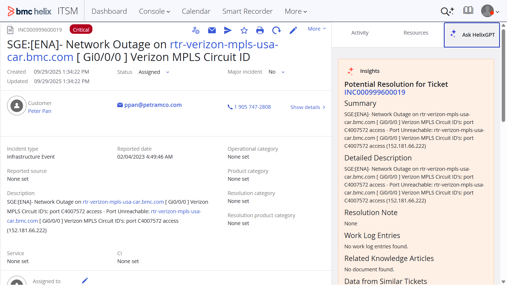

Learn how to configure and use the ITSM agent for Ask HelixGPT in[Configuring Ask HelixGPT for ITSM](https://docs.bmc.com/xwiki/bin/view/Service-Management/IT-Service-Management/BMC-Helix-ITSM/itsm254/Setting-up-and-going-live/Configuring-settings-to-use-Agentic-AI-capabilities/Configuring-Ask-HelixGPT-for-BMC-Helix-ITSM/). Learn how to use Ask HelixGPT in incidents in[Resolving incidents with the help of Ask HelixGPT](https://docs.bmc.com/xwiki/bin/view/Service-Management/IT-Service-Management/BMC-Helix-ITSM-Service-Desk/servicedesk254/Managing-incident-requests/Resolving-incident-requests/Resolving-tickets-with-the-help-of-Ask-HelixGPT/).

### Search for work orders, assets, and problem investigations by using the Agentic chat

Use Agentic chat to search not just incidents and knowledge articles, but also work orders, assets, and problem investigations by using natural language queries. It retrieves and displays the relevant details, including relationships among assets, work orders, and problems, with in-line links for easy access. You can also filter search results based on multi-form search category names.

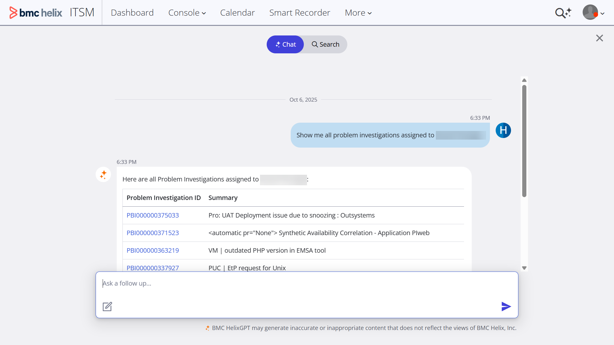

Learn how to configure Agentic chat in[Enabling Agentic chat for ITSM](https://docs.bmc.com/xwiki/bin/view/Service-Management/IT-Service-Management/BMC-Helix-ITSM/itsm254/Setting-up-and-going-live/Configuring-settings-to-use-Agentic-AI-capabilities/Enabling-Agentic-chat-for-BMC-Helix-ITSM/). Learn how to search by using Agentic chat in[Searching for information by using Agentic chat](https://docs.bmc.com/xwiki/bin/view/Service-Management/IT-Service-Management/BMC-Helix-ITSM/itsm254/Navigating-common-interfaces/Searching-for-information-by-using-BMC-HelixGPT-chat/).

### Request access to the Microsoft Teams chat and get updated incident details by using the Ops Swarmer agent

Start a Microsoft Teams group chat, add members, or request to join the chat from ITSM by using the Ops Swarmer agent.

When users with write permission to an incident start an Ops Swarmer chat, the incident assignee, major incident manager, and communication coordinator users are automatically added to the chat. Users with edit permission to the incident, and who are not part of the chat, can request access to the chat, which the existing chat members can approve.

The new capabilities of starting an Ops Swarmer chat, requesting access to the chat, and approving access requests help in faster collaboration to resolve incidents.


Learn how to configure ITSM to use the Ops Swarmer agent in[Enabling the Ops Swarmer chat capabilities](https://docs.bmc.com/xwiki/bin/view/Service-Management/IT-Service-Management/BMC-Helix-ITSM/itsm254/Setting-up-and-going-live/Configuring-settings-to-use-Agentic-AI-capabilities/Enabling-the-Ops-Swarmer-chat-capabilities/). Learn how to start a Microsoft Teams chat, add new members, and request access in[Launching Ops Swarmer for collaboration](https://docs.bmc.com/xwiki/bin/view/Service-Management/IT-Service-Management/BMC-Helix-ITSM-Service-Desk/servicedesk254/Managing-incident-requests/Viewing-and-updating-incident-requests/Launching-ChatOps-for-collaboration/).

### *(Controlled availability customers only)*Localize CMDB and Foundation data to enhance user experience

Localize CMDB and Foundation data in the supported languages, and make it available for use in the service management applications that use the Foundation data, such as ITSM: Change Management.

Users can view and use the CMDB and Foundation data in their user-preferred locale. For example, while composing an email message in PWA, you can select the data in your preferred language in the email message.

Learn about the supported languages in[Supported languages and locales](https://docs.bmc.com/xwiki/bin/view/Service-Management/IT-Service-Management/BMC-Helix-ITSM/itsm254/Planning/Supported-languages-and-locales/). Learn how to localize the Foundation and CMDB data in[Localizing foundation data into the supported languages](https://docs.bmc.com/xwiki/bin/view/Service-Management/IT-Service-Management/BMC-Helix-ITSM/itsm254/Administering/Localizing-foundation-data-into-the-supported-languages/)

### Prioritize frequently used filter options for quick access

Customize the display order of fields in the filters on the record grid of Shared Ticket Console. Sort filter columns in an ascending or a custom order using the drag-and-drop interface. This capability provides easy access to frequently-used filters, reducing search time.


Learn how to customize the field order at[Customizing Shared Ticket Console](https://docs.bmc.com/xwiki/bin/view/Service-Management/IT-Service-Management/BMC-Helix-ITSM/itsm254/Administering/Enabling-and-customizing-Shared-Ticket-Console/Customizing-Shared-Ticket-Console/).

### *(Controlled availability customers only)*Link and resolve HKM knowledge articles in ITSM

Associate knowledge articles with tickets by pinning the most relevant articles to a ticket for future reference. You can also associate articles and resolve an incident simultaneously, saving time and reducing the steps to resolve incidents.


Learn how to enable HKM for ITSM in[Leveraging knowledge from HKM](https://docs.bmc.com/xwiki/bin/view/Service-Management/IT-Service-Management/BMC-Helix-ITSM/itsm254/Getting-started/Use-cases/Leveraging-knowledge-from-BMC-Helix-Knowledge-Management-by-ComAround/). Learn how to manage the articles from incidents in[Handling tickets dynamically with Smart Recorder](https://docs.bmc.com/xwiki/bin/view/Service-Management/IT-Service-Management/BMC-Helix-ITSM-Service-Desk/servicedesk254/Managing-incident-requests/Registering-incident-requests/Handling-tickets-dynamically-with-Smart-Recorder/).

### *(Controlled availability customers only)*Use the Data Monitor console to create data monitoring rules for identifying missing or invalid CI details

Create data monitoring rules in the new Data Monitor console to find inconsistent or incomplete configuration items (CIs) in your asset database. Running the data monitoring rules on a regular schedule ensures that your database remains accurate and healthy.

The generative AI capabilities of HelixGPT can also be leveraged to get insights into the data monitoring rules. When enabled, HelixGPT can analyze the inconsistent or incomplete CIs, and provide suggestions to resolve them.

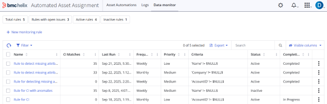

Learn how to configure and run the monitoring rules in[Configuring Data monitoring rules to detect incomplete or inconsistent CI details](https://docs.bmc.com/xwiki/bin/view/Service-Management/IT-Service-Management/BMC-Helix-ITSM-Asset-Management/asset254/Administering/Managing-data-monitoring-rules-to-detect-incomplete-and-inconsistent-CI-details/).

### Predict incident-related service disruptions for faster resolution

Leverage artificial intelligence to predict the services that are likely to be disrupted by incoming incidents. You can then use this information to identify the relevant support team that can work on such incidents for faster resolution, lowering the turnaround time of overall incident management in your organization.

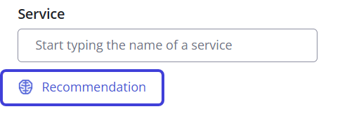

Learn more about the service prediction capability in[Leveraging intelligent service prediction in incidents with the model](https://docs.bmc.com/xwiki/bin/view/Service-Management/IT-Service-Management/BMC-Helix-ITSM-Service-Desk/servicedesk254/Getting-started/Use-cases/Intelligent-service-prediction-in-incidents-with-BMC-Helix-classifier/).  
Learn more about its configuration in[Configuring intelligent service prediction in incidents with classifier](https://docs.bmc.com/xwiki/bin/view/Service-Management/IT-Service-Management/BMC-Helix-ITSM-Service-Desk/servicedesk254/Administering/Setting-up-incident-management/Configuring-intelligent-service-prediction-in-incidents-with-BMC-Helix-classifier/).

### Rule-based automatic impact analysis of change requests

You can now create automation rules to run impact analysis on change requests and associate configuration items (CIs). This enhancement eliminates the need for running the impact analysis manually, saving time and streamlining operations.


Learn more about the capability and its configuration in[Configuring rules for automated impact analysis of change requests](https://docs.bmc.com/xwiki/bin/view/Service-Management/IT-Service-Management/BMC-Helix-ITSM-Change-Management/change254/Administering/Configuring-rules-for-automatic-impact-analysis-of-change-requests/).

### Accelerate incident resolution with automated CI and situation insights from AIOps

For incidents created from AIOps, causal configuration items (CIs) and situational insights are displayed on the incident details page. These insights update automatically as the situation evolves, reducing manual effort and improving response time, data accuracy, and operational efficiency. You can also navigate to AIOps from the incident to view more details about the situation.

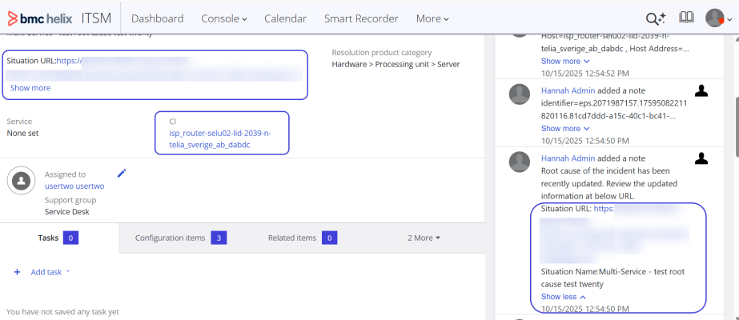

Learn more about the capability in[Information displayed on a ticket](https://docs.bmc.com/xwiki/bin/view/Service-Management/IT-Service-Management/BMC-Helix-ITSM-Service-Desk/servicedesk254/Managing-incident-requests/Viewing-and-updating-incident-requests/Information-displayed-on-a-ticket/).

### Track approval details for service requests in ITSM managed through DWP

As a service desk agent using ITSM, view the approvers and the reason for approval or rejection of service requests managed in DWP. By using this capability, you can view the approval details in a single interface without moving away from ITSM, which saves your time and effort for other critical tasks.


Learn more in[Submitting service requests for customers](https://docs.bmc.com/xwiki/bin/view/Service-Management/IT-Service-Management/BMC-Service-Request-Management/srm254/Managing-service-requests/Submitting-service-requests-for-customers/).

### Apply complex expressions in Shared Ticket Console to analyze data

Use advanced filtering on a record grid to apply complex expressions at runtime. Advanced filtering helps you analyze large datasets and locate the most relevant information.

When you install or upgrade to the 25.4.00 version, advanced filtering is enabled and available by default. If you customized your views in the earlier versions and want to use advanced filtering after you upgrade, you must manually enable advanced filtering. Learn more in[Enabling advanced filters in Asset Console and Shared Ticket Console](https://docs.bmc.com/xwiki/bin/view/Service-Management/IT-Service-Management/BMC-Helix-ITSM/itsm254/Administering/Reconciling-customized-views-after-the-upgrade/Enabling-advanced-filters-in-the-Shared-Ticket-Console-and-Asset-Console/).

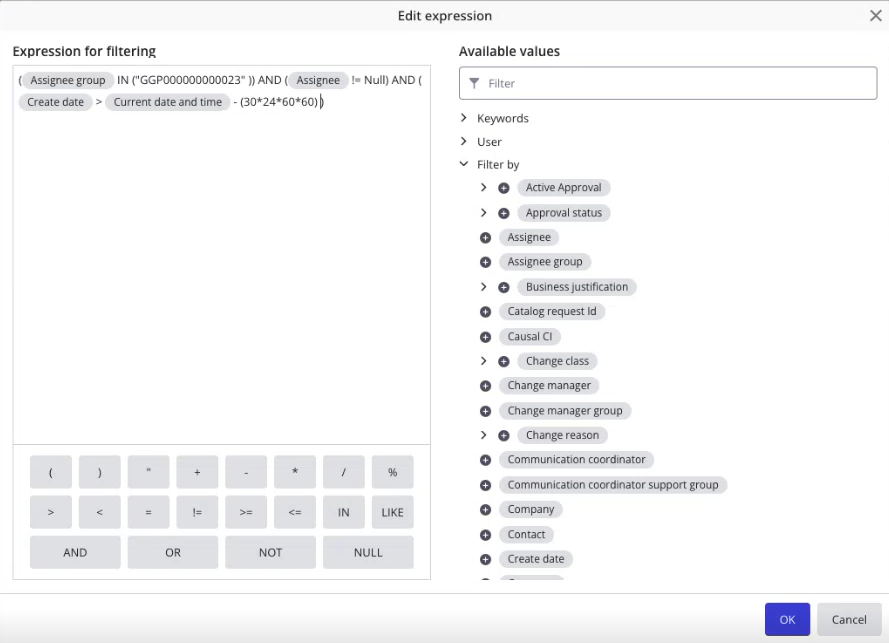

Learn more about configuring the advanced filters in[Customizing Shared Ticket Console](https://docs.bmc.com/xwiki/bin/view/Service-Management/IT-Service-Management/BMC-Helix-ITSM/itsm254/Administering/Enabling-and-customizing-Shared-Ticket-Console/Customizing-Shared-Ticket-Console/)and using them in[Managing your work by using Ticket Console](https://docs.bmc.com/xwiki/bin/view/Service-Management/IT-Service-Management/BMC-Helix-ITSM/itsm254/Navigating-common-interfaces/Managing-your-work-by-using-Ticket-Console/).

### *(Controlled availability customers only)*Set locale, time zone, and date formats from your user profile

Set your preferred locale, time zone, and date format preferences from your user profile in ITSM instead of from the AR System server form. With these enhancements, you can change the locale, time, and date formats without navigating away from the ITSM user interface (UI).  


Learn how to set preferences in[Date, time, and time zone display](https://docs.bmc.com/xwiki/bin/view/Service-Management/IT-Service-Management/BMC-Helix-ITSM/itsm254/Navigating-common-interfaces/Date-time-and-time-zone-display/)in ITSM. Learn about the supported languages in[Supported languages and locales.](https://docs.bmc.com/xwiki/bin/view/Service-Management/IT-Service-Management/BMC-Helix-ITSM/itsm254/Planning/Supported-languages-and-locales/)

### What else has changed in this release

| Update | Product behavior in versions earlier than 25.4.00 | Product behavior in version 25.4.00 |
| --- | --- | --- |
| The rule-based email engine does not create duplicate incidents from the same email thread. Relevant details from the email thread are added as activity notes to the original incident.<br> | Every email in the thread created duplicate incidents, and the content from the individual emails was rejected. Details of subsequent emails were not added to the activity notes.<br> | If an incident is already created from a user's email, the Rule-based email engine prevents creating duplicate incidents from subsequent emails sent in the same thread.<br>Relevant information is also extracted from the subsequent emails and added to the original incident's activity notes.<br>For more details, see[Creating and updating records by using email](https://docs.bmc.com/xwiki/wiki/internal/view/Service-Management/IT-Service-Management/sdMaster2/Managing-incident-requests/Registering-incident-requests/Creating-and-updating-records-by-using-email/#multiple).<br> |
| ITSM supports the Arabic language. | The Arabic language was not supported. | Users can view all modules in ITSM in the Arabic language.<br>Learn about the supported languages in[Supported languages and locales](https://docs.bmc.com/xwiki/bin/view/Service-Management/IT-Service-Management/BMC-Helix-ITSM/itsm254/Planning/Supported-languages-and-locales/).<br> |
| Date beyond 01/19/2038 is supported in ITSM. | Any date and time later than January 19, 2038, 03:14:08 AM was not stored in the date and time field. | Users can now enter dates and time beyond January 19, 2038, 03:14:08 AM.<br> |
| Standardized time stamp format for logs. | Logs were created with a time stamp based on different time zones as set in the user preferences.<br> | Users can view logs in a standardized time stamp format, ensuring consistency across different time zones.<br>Learn more about the logs in[Configuring logs](https://docs.bmc.com/xwiki/bin/view/Service-Management/IT-Service-Management/BMC-Helix-ITSM/itsm254/Troubleshooting/Enabling-and-analyzing-logs/Configuring-logs/).<br> |
| Update assets to the In Inventory status in bulk. | You could update a single asset to the**In Inventory**status. | You can update multiple assets to the**In Inventory**status at the same time.<br>Learn more in[Performing bulk updates](https://docs.bmc.com/xwiki/wiki/internal/view/Service-Management/IT-Service-Management/assetMaster2/Managing-assets-and-CIs/Performing-bulk-updates/).<br> |
| View the service models with CIs in Asset Console. | In Asset Console, while viewing assets, you could view only Business Service models, even when CIs were associated with other service types, such as Business Applications or Technical Services. | In Asset Console, you can view CIs listed under their respective service models, Business Services, Business Applications, or Technical Services.<br>Learn more in[Exploring asset relationships](https://docs.bmc.com/xwiki/wiki/internal/view/Service-Management/IT-Service-Management/assetMaster2/Managing-assets-and-CIs/Exploring-asset-relationships/).<br> |
| Branding for applications | applications used an older color theme for icons, buttons, links, and UI pages. | The core brand colors have been updated to create a more modern and accessible palette.<br>The new branding includes an updated color theme, icons, and buttons for a consistent look across all applications.<br>Learn more about the updated color theme at[Customizing the look and feel of ITSM applications](https://docs.bmc.com/xwiki/bin/view/Service-Management/IT-Service-Management/BMC-Helix-ITSM/itsm254/Administering/Enabling-Advanced-Responsive-Navigation/Customizing-the-ITSM-navigation-bar/).<br> |

## IS 25.4.00 enhancements

25.4 enhancements and patches

## 25.4.01 updates

## Use updated support for technology stack

Service Management supports the following technology stacks:

* Kubernetes version 1.34
* OpenShift version 4.19
* Nginx Ingress Controller version 1.13.x and1.14.0
* Helm 3.19

For more information, see[System requirements](https://docs.bmc.com/xwiki/bin/view/Service-Management/On-Premises-Deployment/BMC-Helix-Service-Management-Deployment/brid25401/Planning/System-requirements/).

## Enable realm identification by using patterns

Enable realm identification by using patterns to control user access based on the user name pattern and IP range pattern. This capability ensures that only approved users can log in to Service Management applications.

For more information, see[Setting up the installation environment](https://docs.bmc.com/xwiki/bin/view/Service-Management/On-Premises-Deployment/BMC-Helix-Service-Management-Deployment/brid25401/Installing/Preparing-for-installation/Setting-up-the-installation-environment/).

## Remove obsolete container images

Remove obsolete Service Management container images in your Harbor registry to optimize storage and ensure security by retaining only approved images.

For more information, see[Setting up a Harbor repository to synchronize container images](https://docs.bmc.com/xwiki/bin/view/Service-Management/On-Premises-Deployment/BMC-Helix-Service-Management-Deployment/brid25401/Installing/Preparing-for-installation/Setting-up-a-Harbor-repository-to-synchronize-container-images/).

## Enable multiple domain authentication with Single Sign-On for seamless authentication

Enable seamless authentication between Service Management applications and the Platform hosted on different domains by using the**ENABLE\_RSSO\_MULTI\_DOMAIN**parameter in the**HELIX\_ONPREM\_DEPLOYMENT**pipeline.

For more information, see[Performing the Service Management installation](https://docs.bmc.com/xwiki/bin/view/Service-Management/On-Premises-Deployment/BMC-Helix-Service-Management-Deployment/brid25401/Installing/Performing-the-BMC-Helix-Service-Management-installation/).

## Deploy infrastructure services required for CORE mode automatically

The Platform Common Services deployment manager configures the necessary infrastructure services required for Service Management CORE mode automatically when you set the**SM\_PLATFORM\_CORE**parameter in the**deployment.config**file. This automation efficiently streamlines setup and optimizes resource sizing based on deployment requirements.

For more information, see[Installing Platform Common services 25.4.00](https://docs.bmc.com/xwiki/bin/view/Service-Management/On-Premises-Deployment/BMC-Helix-Service-Management-Deployment/brid25401/Installing/Preparing-for-installation/Installing-BMC-Helix-Platform-Common-services-25-4-00/).

## What else changed in this release

The following table lists the changes in the product behavior in this release:

| Update<br> | Product behavior in versions earlier than 25.4.01<br> | Product behavior in version 25.4.01<br> |
| --- | --- | --- |
| Change in the security certificate configuration process | To use a security certificate, you create the cacerts files in a specific format provided by and then provide this file as the**CACERTS\_FILE**parameter value in the**HELIX\_ONPREM\_DEPLOYMENT**pipeline.<br> | You can directly provide a single certificate file or a ZIP file containing multiple certificates as the**CUSTOM\_CERTIFICATE**parameter value in the**HELIX\_ONPREM\_DEPLOYMENT**pipeline.<br>The**CACERTS\_FILE**parameter in the**HELIX\_ONPREM\_DEPLOYMENT**pipeline is renamed to**CUSTOM\_CERTIFICATE**.<br>For more information, see[Performing the Service Management installation](https://docs.bmc.com/xwiki/bin/view/Service-Management/On-Premises-Deployment/BMC-Helix-Service-Management-Deployment/brid25401/Installing/Performing-the-BMC-Helix-Service-Management-installation/).<br> |
| Parameters added in the**HELIX\_ONPREM\_DEPLOYMENT**pipeline | The**HELIX\_ONPREM\_DEPLOYMENT**pipeline do not include the following parameters:<br>  * **ENABLE\_RSSO\_MULTI\_DOMAIN** * **HELIX\_DSO** | The**HELIX\_ONPREM\_DEPLOYMENT**pipeline includes the following parameters:<br>**ENABLE\_RSSO\_MULTI\_DOMAIN**—Use this parameter to enable Single Sign-On multiple domain configuration.<br>**HELIX\_DSO**—Use this parameter to enable the Distributed Server Option (DSO) service. For more information, see[Performing the Service Management installation](https://docs.bmc.com/xwiki/bin/view/Service-Management/On-Premises-Deployment/BMC-Helix-Service-Management-Deployment/brid25401/Installing/Performing-the-BMC-Helix-Service-Management-installation/).<br> |

## 25.4.00 enhancements

The following video (01:05) provides a quick overview of the enhancements in the IS 25.4.00.

[🎥 Watch Video: //www.youtube.com/watch?v=dBWGVVQqiPQ](//www.youtube.com/watch?v=dBWGVVQqiPQ)

## Get context-aware responses by attaching images to HelixGPT chat

Attach images to the HelixGPT chat component to provide visual context to your prompt by using the**Allow attachments**property. HelixGPT can analyze the content of your uploaded images and provide more accurate and relevant responses.

For more information, see[Adding an AI-based conversational search interface to a view](https://docs.bmc.com/xwiki/bin/view/Service-Management/Innovation-Suite/BMC-Helix-Innovation-Suite/is254/Tailoring-applications-and-automating-processes/Creating-the-definitions-for-a-tailorable-application/Defining-the-user-interface-through-view-definitions/Adding-an-AI-based-conversational-search-interface-to-a-view/).


## Access frequently used filter options quickly

Sort filter columns in the**Record grid**component in ascending order or in a custom order by using the drag and drop interface. With this capability, you can easily access frequently used filters, resulting in improved usability.

For more information, see[To enable filters in a record grid](https://docs.bmc.com/xwiki/bin/view/Service-Management/Innovation-Suite/BMC-Helix-Innovation-Suite/is254/Tailoring-applications-and-automating-processes/Creating-the-definitions-for-a-tailorable-application/Defining-the-user-interface-through-view-definitions/Creating-a-tabular-view-of-record-instances-by-using-a-record-grid/#Toenablefiltersinarecordgrid).

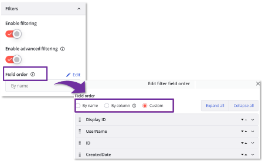

## Configure event handlers in the View designer to automatically trigger actions at runtime

As an application business analyst, configure event handlers in the View designer to automatically trigger actions when specific conditions are met. An event handler enables dynamic, runtime interactions within the application and ensures predefined actions are executed in response to user input or system changes. For more information, see[Creating or modifying view definitions](https://docs.bmc.com/xwiki/bin/view/Service-Management/Innovation-Suite/BMC-Helix-Innovation-Suite/is254/Tailoring-applications-and-automating-processes/Creating-the-definitions-for-a-tailorable-application/Defining-the-user-interface-through-view-definitions/Creating-or-modifying-view-definitions/).


## Flexibility to enforce parent-child record associations to reduce errors

As a developer, you can choose whether a child record must always reference a valid parent record. If you choose to enforce this association, every child record must be associated with a parent. However, if you don’t enforce the association, you can still create records, which prevents errors during upgrades or archival of records. Existing associations created before this feature remain enforced by default to preserve data integrity.

For more information, see[Creating record associations](https://docs.bmc.com/xwiki/bin/view/Service-Management/Innovation-Suite/BMC-Helix-Innovation-Suite/is254/Tailoring-applications-and-automating-processes/Creating-the-definitions-for-a-tailorable-application/Defining-record-definitions-to-store-and-manage-data/Creating-record-associations/).

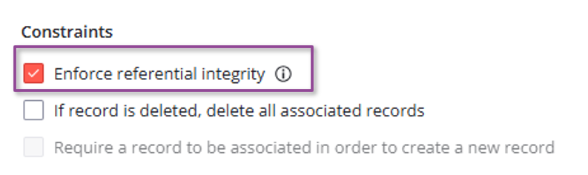

## Support for the Catalan locale

​​​​IS applications support the Catalan locale. You can localize the application in Catalan to translate error messages, warning messages, and static strings on the UI.

For more information, see[Localizing an application](https://docs.bmc.com/xwiki/bin/view/Service-Management/Innovation-Suite/BMC-Helix-Innovation-Suite/is254/Developing-applications-by-using-BMC-Helix-Innovation-Studio/Developing-and-deploying-code-based-applications/Getting-your-code-based-application-ready-for-use/Localizing-an-application/).


## Enable archiving on audit records

As an application business analyst, you can create an association between a parent record and its corresponding audit record. This association ensures that the parent record is archived with the related audit record, facilitating complete and consistent archival.

For more information, see[Creating record associations](https://docs.bmc.com/xwiki/bin/view/Service-Management/Innovation-Suite/BMC-Helix-Innovation-Suite/is254/Tailoring-applications-and-automating-processes/Creating-the-definitions-for-a-tailorable-application/Defining-record-definitions-to-store-and-manage-data/Creating-record-associations/).

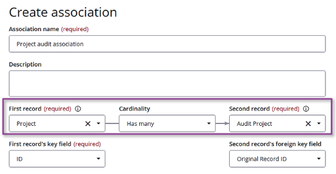

## Launch Dashboards from the AR System Report Console to manage reports

With BIRT reports reaching end of life, administrators can use alternative, modern tools to view analytics for various artifacts and print the reports. Reports are now accessible via Dashboards, PWA screens, or other ITSM consoles. These tools ensure continued access to critical data with enhanced visualization, export, and printing capabilities.

When you view the BIRT reports, a message is displayed in the application informing you about the end of life of the reports.

For more information, see[Creating and managing reports from the AR System Report Console](https://docs.bmc.com/xwiki/bin/view/Service-Management/Innovation-Suite/BMC-Helix-Innovation-Suite/is254/Using/Reporting-on-Service-Management-application-activity/Creating-and-managing-reports-from-the-AR-System-Report-Console/).

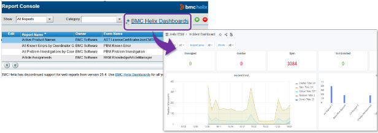

## Configure the Results list in Progressive View by using Developer Studio

Configure the Results list in progressive view by using Developer Studio and Mid-Tier CCS configuration parameters. The Results list lets you search, create, update, delete, and save records within a progressive view.

For more information, see[Configuring the Results List in progressive view](https://docs.bmc.com/xwiki/bin/view/Service-Management/Innovation-Suite/BMC-Helix-Innovation-Suite/is254/Developing-Progressive-Web-Applications/Configuring-the-Results-List-in-progressive-view/).

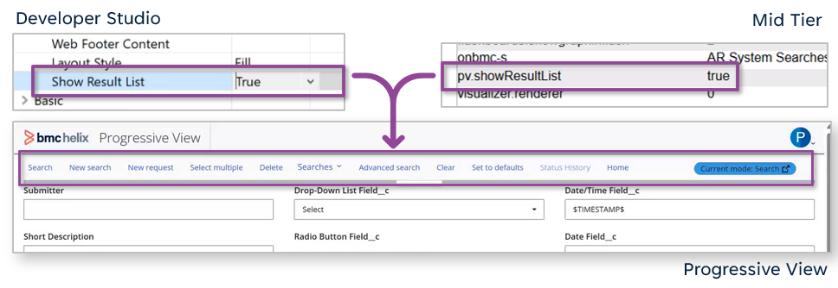

## Date/Time fields can store values beyond January 19, 2038

Date/Time fields can support values beyond January 19, 2038, up to April 11, 2262, which helps store future dates, such as End of Life (EOL) dates for assets. Earlier, Date/Time fields did not support values later than January 19, 2038, because the database column used the INT data type.  
For more information, see[Date and time fields](https://docs.bmc.com/xwiki/bin/view/Service-Management/Innovation-Suite/BMC-Helix-Innovation-Suite/is254/Developing-applications-by-using-Developer-Studio/Developing-the-application-interface/Creating-and-managing-fields/Data-fields/Types-of-data-fields/#Typesofdatafields-Dateandtimefields)and[Troubleshooting invalid or truncated dates.](https://docs.bmc.com/xwiki/bin/view/Service-Management/Innovation-Suite/BMC-Helix-Innovation-Suite/is254/Developing-an-API-program/AR-System-Java-API-overview/Programming-with-the-Java-API/Troubleshooting-the-Java-API/Troubleshooting-invalid-or-truncated-dates/)  
  
For Oracle, this capability is supported automatically after you upgrade to IS 25.4.  
For MSSQL, this capability is supported only for fresh deployments.  
For PostgreSQL, after upgrading to IS 25.4, you must run a database migration to update the data type of the Date/Time field column from INT to BIGINT.​​​​​ To perform the migration, submit a Change Request (RFC) in[Support Central](https://www.bmc.com/support/support-central.html). For more information, see the[Request for Change process](https://docs.bmc.com/xwiki/bin/view/Helix-Common-Services/Other/BMC-Helix-Subscriber-Information/helixsubscriber/Policies/BMC-Helix-Change-Management-policy/Request-for-Change-process/).


## Improve AR System server startup time by usage-based loading of forms

As an administrator, you can improve AR System server startup time by configuring usage-based loading of the forms in the cache. This configuration analyzes the most frequently used forms during AR System server startup and loads only the necessary forms to minimize the server's load. Configure the AR System server to run a periodic removal check to identify forms that have been idle for longer than the defined time. Remove the forms that are not frequently used.

For more information, see[Improving AR Server startup time by usage based loading of forms](https://docs.bmc.com/xwiki/bin/view/Service-Management/Innovation-Suite/BMC-Helix-Innovation-Suite/is254/Administering/Monitoring-the-system-and-performance/Configuring-cache-settings-for-AR-System/Improving-the-AR-Server-startup-time-by-loading-forms-based-on-their-usage/).

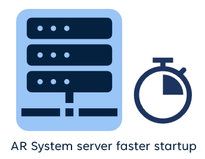

## Configure support group and assignee fields for cases

Use the Change Assignment component in the View designer to define fields for the support group and assignee in Business Workflows. These fields appear as drop-downs on the case screen, helping agents select appropriate assignments during case updates.

For more information, see[Updating case assignments using the Change Assignment component](https://docs.bmc.com/xwiki/bin/view/Service-Management/Innovation-Suite/BMC-Helix-Innovation-Suite/is254/Tailoring-applications-and-automating-processes/Creating-the-definitions-for-a-tailorable-application/Defining-the-user-interface-through-view-definitions/Changing-assignments-using-Change-Assignment-component/).

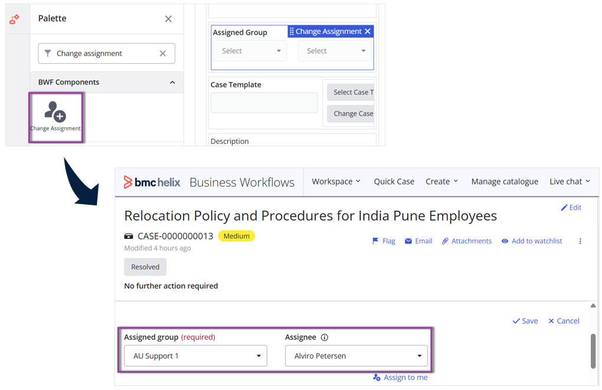

## What else changed in this release​

The following table lists the changes in the product behavior:

| Update | Product behavior in versions earlier than 25.4.00 | Product behavior in version 25.4.00 |
| --- | --- | --- |
| New branding for applications | applications had the old branding theme. ​​<br> | The core brand colors have been updated to create a more modern and accessible palette. The new branding includes an updated**ADAPT Theme**,**Images**,and**Buttons**themes for a consistent look across all applications. You can customize the branding theme according to your preferences.<br>For more information, see[Customizing the skins and logo for IS applications](https://docs.bmc.com/xwiki/bin/view/Service-Management/Innovation-Suite/BMC-Helix-Innovation-Suite/is254/Administering/Tailoring-the-application-skin-and-brand/Customizing-the-skins-and-logo-for-BMC-Helix-Innovation-Studio-applications/).<br> |
| Key-pair authentication support for Snowflake destination<br> | Data Connector supports username-and-password authentication for connecting to Snowflake destination.<br> | Data Connector supports key-pair authentication for connecting to Snowflake destination, ensuring secure data transfer and key rotation. While new configurations must use key-pair authentication, existing username and password authentication setups will continue to function post-upgrade, provided Snowflake still supports the username/password authentication method.<br>For more information, see[Configuring the destination as Snowflake](https://docs.bmc.com/xwiki/bin/view/Service-Management/Innovation-Suite/BMC-Helix-Innovation-Suite/is254/Administering/Managing-data-and-objects/Replicating-data-from-BMC-Helix-SaaS-to-a-destination-database/Configuring-the-destination-as-Snowflake/).<br> |
| The ISO 8601 format is used for log timestamps. | Logs used varying timestamp formats across services. | MidTier log files use timestamps in the ISO 8601 format (yyyy-MM-dd'T'HH:mm:ss.SSSZ); for example, 2025-01-29T15:20:15.000-0700. This format makes it easier to debug issues across services.  For more information, see[Configuring the Log Settings page by using Mid Tier Configuration Tool](https://docs.bmc.com/xwiki/bin/view/Service-Management/Innovation-Suite/BMC-Helix-Innovation-Suite/is254/Troubleshooting/Troubleshooting-Mid-Tier/Enabling-logs-for-Mid-Tier-troubleshooting/Mid-Tier-logging/Configuring-the-Log-Settings-page-by-using-Mid-Tier-Configuration-Tool/#ConfiguringtheLogSettingspagebyusingMidTierConfigurationTool-Logfileformat).<br> |
| Date related database functions are defined during fresh installs and upgrades. | Administrators had to manually run thePERFORM-CUSTOM-DB-FUNCTION-CHANGEcommand and could not define the date related database functions separately.<br> | Date related database functions are defined during fresh installations and upgrades. Administrators can manually run only the date-related database functions by using thePERFORM-CUSTOM-DB-FUNCTION-CHANGE dstOnlycommand.  For more information, see[Defining database functions](https://docs.bmc.com/xwiki/bin/view/Service-Management/Innovation-Suite/BMC-Helix-Innovation-Suite/is254/Enabling-services/Enabling-reporting-for-Service-Management-Applications/Defining-database-functions-in-AR-System-server/). |

## CMDB 25.4.00 enhancements

The following video (00:53) provides a quick overview of the enhancements in the CMDB 25.4.00.

[🎥 Watch Video: //www.youtube.com/watch?v=ZALhErG3jqg](//www.youtube.com/watch?v=ZALhErG3jqg)

[Watch the video that describes the new features in CMDB 25.4](https://youtu.be/ZALhErG3jqg)

### Improved RE performance with Java-based miscellaneous service

The delete, purge, copy, and compare activities in the Reconciliation Engine run in a dedicated Java-based miscellaneous service. This enhancement improves the performance and reliability of the reconciliation engine by separating these activities from the main reconciliation pod. For more information, see[Enabling or disabling reconciliation engine services](https://docs.bmc.com/xwiki/bin/view/Service-Management/IT-Service-Management/BMC-Helix-CMDB/ac254/Using/Merging-duplicate-CIs-by-reconciling-data-from-multiple-sources/Creating-a-reconciliation-job/Reconciling-a-large-number-of-CIs/).

### Manage product data collection from within the product

You can now manage your product data collection preferences directly from the**Analytics**option in CMDB. This enhancement provides greater control by allowing you to enable or disable data collection from within the product, without navigating to another console. The data helps improve product performance, identify usage trends, and prioritize feature enhancements.  
For more information, see[Modifying consent for data collection](https://docs.bmc.com/xwiki/bin/view/Service-Management/IT-Service-Management/BMC-Helix-CMDB/ac254/Administering/Modifying-consent-for-data-collection/).

### Date and Time fields support dates beyond the year 2038

CMDB Date and Time fields support dates beyond January 19, 2038, helping you store long-range timelines like End of Life (EOL) for configuration items (CIs). With this enhancement, the Date and Time field can store values up to April 11, 2262, 11:47:16.854 PM. This change ensures accurate tracking of future lifecycle data in CMDB.  
For more information, see[Normalization and the Product Catalog](https://docs.bmc.com/xwiki/bin/view/Service-Management/IT-Service-Management/BMC-Helix-CMDB/ac254/Using/Managing-consistency-of-CMDB-data-by-using-normalization/Normalization-and-the-Product-Catalog/).

### What else changed in this release​

The following table lists the changes in the product behavior:

| Update | Product behavior in versions earlier than 25.4.00 | Product behavior in version 25.4.00 |
| --- | --- | --- |
| Failover support for CMDB to Smartgraph synchronization for Telco Extensions | If a CMDB to Smartgraph synchronization run failed or if the AR or plug-in server experienced a temporary outage, the entire sync process had to be restarted. | During the sync, if temporary outages or failures occur, the sync automatically resumes from the point of interruption instead of restarting the entire process. This failover mechanism prevents data duplication, minimizes delays, and maintains consistency across synchronized records.For details, see[Syncing CIs for Telco Extensions by using SmartGraph Sync](https://docs.bmc.com/xwiki/bin/view/Service-Management/IT-Service-Management/BMC-Helix-CMDB/ac254/Administering/Scheduling-a-DSM-Sync-to-share-impact-attributes-with-BMC-Helix-NetOps/). |

## Related topics

[Known-and-corrected-issues](https://docs.bmc.com/xwiki/wiki/internal/view/Service-Management/IT-Service-Management/itsmMaster2/Release-notes-and-notices/Known-and-corrected-issues/)  
[Release-notes-and-notices](https://docs.bmc.com/xwiki/wiki/internal/view/Service-Management/IT-Service-Management/itsmMaster2/Release-notes-and-notices/)  
[Downloading the installation files](https://docs.bmc.com/xwiki/bin/view/Service-Management/On-Premises-Deployment/BMC-Helix-Service-Management-Deployment/brid25301/Installing/Preparing-for-installation/Downloading-the-installation-files/)  
[Single Sign-on 25.3 enhancements and patches](https://docs.bmc.com/xwiki/bin/view/Helix-Common-Services/Single-Sign-On/BMC-Helix-Single-Sign-On/hsso253/)  
[DWP 25.4 enhancements and patches](https://docs.bmc.com/xwiki/bin/view/Service-Management/Employee-Digital-Workplace/BMC-Helix-Digital-Workplace/dwp254/Release-notes-and-notices/25-4-enhancements-and-patches/)

---

## <a id="release-notes-and-noticesdeprecated-and-discontinued-featuresmd"></a>Release-Notes-And-Notices/Deprecated-And-Discontinued-Features.md

You must[log in](https://docs.bmc.com/xwiki/bin/login/XWiki/XWikiLogin?xredirect=%2Fxwiki%2Fbin%2Fview%2FService-Management%2FIT-Service-Management%2FBMC-Helix-ITSM%2Fitsm254%2FRelease-notes-and-notices%2FDeprecated-and-discontinued-features%2F)or[register](https://www.bmc.com/available/register-now.html?c=n)to view this page

---

## <a id="release-notes-and-noticesdeprecated-and-discontinued-featuresend-of-life-plan-for-birt-for-to-dashboardsmd"></a>Release-Notes-And-Notices/Deprecated-And-Discontinued-Features/End-Of-Life-Plan-For-Birt-For-To-Dashboards.md

announces the end-of-life plan for Business Intelligence and Reporting Tools (BIRT) forITSMandIS. We recommend that you plan to transition to Dashboards for your reporting needs.

**Important**

While every effort is made to provide accurate, forward-looking guidance on product direction to assist you with your buying and planning decisions, cannot guarantee that intentions stated as follows are final and binding.

Related topics

[Support-information](https://docs.bmc.com/xwiki/bin/view/Service-Management/IT-Service-Management/BMC-Helix-ITSM/itsm254/Troubleshooting/Support-information/)

[Deprecated-and-discontinued-features](https://docs.bmc.com/xwiki/bin/view/Service-Management/IT-Service-Management/BMC-Helix-ITSM/itsm254/Release-notes-and-notices/Deprecated-and-discontinued-features/)

## Background

BIRT is a module ofITSM, (earlier known as Remedy IT Service Management Suite) and delivers in-application ITSM reporting capabilities as a part of the standard ITSM user licenses. You might have used BIRT to develop reports and dashboards forITSMapplications or applications created by using IS.

## Statement of direction

Starting with version 25.4.00, plans the end of life of BIRT in ITSM applications and applications developed by using IS.

To view and create reports, recommends that all customers use Dashboards or shared consoles in ITSM. Dashboards offers a unified reporting and dashboard experience across all service and operations management solutions.

To help you with a smooth transition to Dashboards, we plan to deliver relevant documentation and videos that explain the deployment of Dashboards.

**Important**

Dashboards does not deliver a one-to-one replacement for all BIRT features.

## Transition period

will use the following timelines to complete the transition:

* Starting with version 25.2.00, users can no longer create new web reports. However, they can continue to edit and access existing reports. To create new reports, they must use Dashboards.
* From version 25.3.00, users can no longer print reports by using the Print button from ticket forms. However, they can continue to print the reports from the report console.
* Starting with version 25.4.00, support for all BIRT reports will end.

You can continue using BIRT reports to view and edit existing reports until you upgrade to version 25.4.00; you cannot create new reports. However, support will no longer be available for BIRT reports.

## FAQ for end-of-life of BIRT

<details class="confluence-expand-macro panel panel-default"><summary><span class="panel-title"><span class="title-text">By what date will BIRT reach end of life</span></span></summary><div class="panel-body"><p><span>We plan to stop distributing and supporting BIRT starting from version 25.4.00. This applies to using BIRT with ’s Service Management products such as<span>ITSM</span>and applications developed by using IS.</span></p></div></details><details class="confluence-expand-macro panel panel-default"><summary><span class="panel-title"><span class="title-text">Which licensed products and services are affected?</span></span></summary><div class="panel-body"><p>The BIRT capability is licensed by Custom Applications - Reporting User (SaaS), and the deprecation of BIRT deprecation affects the following products:</p><ul><li><span><span>ITSM</span>(SaaS)</span></li><li><span><span>ITSM</span>(On-premises)</span></li></ul></div></details><details class="confluence-expand-macro panel panel-default"><summary><span class="panel-title"><span class="title-text">My company is using BIRT as SaaS service with ITSM SaaS. What changes will we experience after version 25.4.00?</span></span></summary><div class="panel-body"><p><span>Starting from version 25.4.00, will no longer provide BIRT as a service as a part of<span>ITSM</span>(SaaS).</span></p></div></details><details class="confluence-expand-macro panel panel-default"><summary><span class="panel-title"><span class="title-text">My company is using BIRT with ITSM On-premises. What changes will we experience from version 25.4.00?</span></span></summary><div class="panel-body"><p><span>Starting from version 25.4.00, will no longer provide BIRT (including hotfixes or patches) as a part of<span>ITSM</span>and<span>IS</span>, nor provide support for BIRT.</span></p></div></details><details class="confluence-expand-macro panel panel-default"><summary><span class="panel-title"><span class="title-text">Will existing BIRT On-premises installations stop working?</span></span></summary><div class="panel-body"><p><span>No. Existing On-premises deployments of BIRT will continue to work after reaching the end-of-life date.</span></p><p><span>However, you won’t get any more support (including hotfixes or patches), and you will not be able to download the BIRT software or update the BIRT license key. The solution continues to work until the license key expires.</span></p></div></details><details class="confluence-expand-macro panel panel-default"><summary><span class="panel-title"><span class="title-text">Should we keep our ITSM BIRT implementation going?</span></span></summary><div class="panel-body"><p><span>Even though will continue to support BIRT until version 25.3.02, we strongly recommend that you start using Dashboards f</span><span>or any reporting needs.</span></p></div></details>

## FAQ for Dashboards

<details class="confluence-expand-macro panel panel-default"><summary><span class="panel-title"><span class="title-text">Where can we learn about Dashboards?</span></span></summary><div class="panel-body"><p>The following information is available about Dashboards:</p><ul><li>Online documentation—<span class="wikilink"><a href="https://docs.bmc.com/xwiki/bin/view/Helix-Common-Services/Dashboards-Reports/BMC-Helix-Dashboards/BHD243/" shape="rect">Dashboards</a></span></li><li>Videos (YouTube)—<span class="wikiexternallink"><a href="https://www.youtube.com/results?search_query=bmc+helix+dashboards" shape="rect">Dashboards video playlist</a></span></li><li>Webinars—<span class="wikiexternallink"><a href="https://community.bmc.com/s/news/aA33n000000XfcsCAC/connect-with-bmc-helix-itsm-bmc-helix-dashboards-webinar" shape="rect">Connect with ITSM and Dashboards</a></span></li></ul></div></details><details class="confluence-expand-macro panel panel-default"><summary><span class="panel-title"><span class="title-text">Why is Dashboards a better solution for customers?</span></span></summary><div class="panel-body"><p>Dashboards is a modern reporting and dashboard solution for customers based on the widely used Grafana visualization technology. Some of the key features of Dashboards are as follows:</p><ul><li>A single reporting and dashboard solution for<span><span>ITSM</span></span>. Dashboards collect data from multiple Service Management and IT Operations Management solutions and several external data sources through Grafana connectors and display them in cross-solution dashboards.</li><li>Delivers out-of-the-box dashboards and reports for solutions, which so far did not have any reporting capability or for which the previous reporting options were limited to a few canned reports in a proprietary technology (DWP).</li><li>Superior visualization capabilities and better performance than many currently available modules, leading to a much better overall customer experience.</li><li>Provides better support experience with Dashboards, because has more control over the solution design.</li></ul></div></details><details class="confluence-expand-macro panel panel-default"><summary><span class="panel-title"><span class="title-text">Is Dashboards available for our on-premises deployments?</span></span></summary><div class="panel-body"><p>The support for On-premises deployments of Dashboards is available from the 21.3 release.</p><p>For more information, see<span class="wikilink"><a href="https://docs.bmc.com/xwiki/bin/view/IT-Operations-Management/On-Premises-Deployment/BMC-Helix-IT-Operations-Management-Deployment/itomdeploy213/" shape="rect">IT Operations Management deployment 21.3</a></span>.</p></div></details><details class="confluence-expand-macro panel panel-default"><summary><span class="panel-title"><span class="title-text">We are a licensed ITSM customer, but we only use the IS platform to develop custom applications. Can we use the new Dashboards capabilities?</span></span></summary><div class="panel-body"><p><span>Dashboards are available to anyone who is a licensed user of<span>ITSM</span>or for<span>IS</span>, which includes. Such customers can use Dashboards for report and dashboard use cases for their custom applications developed by using Developer Studio or IS.</span></p></div></details><details class="confluence-expand-macro panel panel-default"><summary><span class="panel-title"><span class="title-text">Can we run Dashboards with previous versions of ITSM?</span></span></summary><div class="panel-body"><p><span>No. Dashboards was first introduced with<span>ITSM</span>version 21.02. Customers need to upgrade the entire<span>ITSM</span>stack to version 21.02 or later to use the Dashboards capabilities.</span></p></div></details><details class="confluence-expand-macro panel panel-default"><summary><span class="panel-title"><span class="title-text">Can SaaS customers use the Dashboards functionality?</span></span></summary><div class="panel-body"><p><span>After you upgrade to</span><span><span>IS</span></span><span>version 21.03 or later, Dashboards will be available to</span><span><span>ITSM</span></span><span>customers for both on-premises and SaaS.</span></p></div></details><details class="confluence-expand-macro panel panel-default"><summary><span class="panel-title"><span class="title-text">Which solutions are integrated with Dashboards?</span></span></summary><div class="panel-body"><ul><li><span><span>ITSM</span></span>(including<span>ITSM: Smart IT</span>, ITSM Insights, and<span>CMDB</span>)</li><li>Business Workflows(BWF)</li><li><span>DWP</span>(DWP)</li><li><span><span>IS</span></span>(including AR System and IS) and custom applications built on<span><span>IS</span></span></li><li><span>Virtual Agent</span></li><li>Live Chat</li><li>Operations Management</li><li>Continuous Optimization</li><li>Automation Console</li><li>Cloud Security</li><li>Remediate</li></ul></div></details>

## FAQ for technical transition to Dashboards

<details class="confluence-expand-macro panel panel-default"><summary><span class="panel-title"><span class="title-text">Does offer a migration tool to migrate reports from BIRT to Dashboards?</span></span></summary><div class="panel-body"><p>No, there is no tool for migration. We recommend customers review their BIRT reports and use this change as an opportunity to clean up their reports.</p><p>Develop reports afresh in Dashboards only if they are routinely required. With recent features like Visual Query Builder and Reporting Metadata Studio, you can develop dashboards using a drag-and-drop interface.</p></div></details><details class="confluence-expand-macro panel panel-default"><summary><span class="panel-title"><span class="title-text">What transition services are available to help us transition from BIRT to Dashboards?</span></span></summary><div class="panel-body"><p><span>Global Services or Partners can provide services to assist you in transitioning from BIRT to Dashboards. These paid services are optional and aimed at accelerating customer adoption of Dashboards and the content migration from BIRT to Dashboards.</span></p><p><span>Contact your Account Manager for more details on the available packages.</span></p></div></details>

---

## <a id="release-notes-and-noticeswhere-did-the-smart-it-documentation-go_md"></a>Release-Notes-And-Notices/Where-Did-The-Smart-It-Documentation-Go_.md

Starting with version 23.3, we have streamlined the documentation of ITSM to help you find the documentation for the ticket types that you work on.

Related topics

[23-3-enhancements-and-patches](https://docs.bmc.com/xwiki/bin/create/Service-Management/IT-Service-Management/BMC-Helix-ITSM/itsm254/Release-notes-and-notices/23-3-enhancements-and-patches/WebHome?parent=Service-Management.IT-Service-Management.BMC-Helix-ITSM.itsm254.Release-notes-and-notices.Where-did-the-Smart-IT-documentation-go.WebHome)

## Looking for Smart IT documentation?

Consult the following table to understand where you can find the information you need.

| Feature or component<br> | Link<br> |
| --- | --- |
| * Incident management * Problem investigation * Known error | [ITSM: Service Desk documentation](https://docs.bmc.com/xwiki/bin/view/Service-Management/IT-Service-Management/BMC-Helix-ITSM-Service-Desk/servicedesk233/)<br> |
| * Change request * Task management | [ITSM: Change Management documentation](https://docs.bmc.com/xwiki/bin/view/Service-Management/IT-Service-Management/BMC-Helix-ITSM-Change-Management/change233/)<br> |
| Asset management<br> | [ITSM: Asset Management documentation](https://docs.bmc.com/xwiki/bin/view/Service-Management/IT-Service-Management/BMC-Helix-ITSM-Asset-Management/asset233/)<br> |
| Knowledge management<br> | [ITSM: Knowledge Management documentation](https://docs.bmc.com/xwiki/bin/view/Service-Management/IT-Service-Management/BMC-Helix-ITSM-Knowledge-Management/km233/)<br> |
| * Service request management * Work order management | [Service Request Management documentation](https://docs.bmc.com/xwiki/bin/view/Service-Management/IT-Service-Management/BMC-Service-Request-Management/srm233/)<br> |
| Service level management<br> | [Service Level Management documentation](https://docs.bmc.com/xwiki/bin/view/Service-Management/IT-Service-Management/BMC-Service-Level-Management/slm233/)<br> |
| * Common concepts * Common configurations | [ITSM documentation](https://docs.bmc.com/xwiki/bin/view/Service-Management/IT-Service-Management/BMC-Helix-ITSM/itsm233/)<br> |

## Why was the change?

Prior to version 23.3, information related to Mid Tier and Smart IT for the same ticket type was in different documentation spaces. For example, if you work on Incident Management, you had to go through two different documentation spaces to get the required information - one for Mid Tier and one for Smart IT and PWA screens. Going forward, you will be able to find all information related to a*specific*ticket type, for example Incident Management, in one single documentation space. Similarly, all information related to Change Management is in the Change Management documentation space.

Due to the redesigned documentation, you get the following advantages:

* Reduced topic-hierarchy: Get to the content with fewer clicks.
* Use-case based titles: Easier to find the topic you are looking for.
* Merged topics: Less number of topics to navigate through, all relevant information is in the same topic.


The following video (3:15) provides an overview of documentation space restructure from ITSM version 23.3.

[🎥 Watch Video: https://www.youtube.com/watch?v=S6YhIgSV9lc](https://www.youtube.com/watch?v=S6YhIgSV9lc)

[Watch the YouTube video about the documentation space restructure](https://youtu.be/S6YhIgSV9lc?si=IaLw_UXDLXWC9RL5)

## Structure within a topic

At a topic level, we have segregated the information so that it is easier for you to follow the latest information. Based on your requirement, you can also read information related to older screens in the same topic. For example, if you are reading about a procedure that can be performed by using PWA screens, classic Smart IT, and Mid Tier, the topic will display the information related to the PWA screens at the top. If you want, you can read the relevant information for the classic interfaces (Classic Smart IT and Mid Tier) by going to the**Instructions for classic interfaces**section of the topic.


## Popular links

See the following links to some of the popular content across the ITSM documentation spaces.

Service desk

* [Learning about Incident Management](https://docs.bmc.com/xwiki/bin/view/Service-Management/IT-Service-Management/BMC-Helix-ITSM-Service-Desk/servicedesk233/Getting-started/Learning-about-Incident-Management/)
* [Learning about Problem Management](https://docs.bmc.com/xwiki/bin/view/Service-Management/IT-Service-Management/BMC-Helix-ITSM-Service-Desk/servicedesk233/Getting-started/Learning-about-Problem-Management/)
* [Managing incident requests](https://docs.bmc.com/xwiki/bin/view/Service-Management/IT-Service-Management/BMC-Helix-ITSM-Service-Desk/servicedesk233/Managing-incident-requests/)
* [Managing problem investigations and known errors](https://docs.bmc.com/xwiki/bin/view/Service-Management/IT-Service-Management/BMC-Helix-ITSM-Service-Desk/servicedesk233/Managing-problem-investigations-and-known-errors/)
* [Managing work on tickets by using tasks](https://docs.bmc.com/xwiki/bin/view/Service-Management/IT-Service-Management/BMC-Helix-ITSM-Service-Desk/servicedesk233/Managing-work-on-tickets-by-using-tasks/)

Change Management

* [Learning about Change Management](https://docs.bmc.com/xwiki/bin/view/Service-Management/IT-Service-Management/BMC-Helix-ITSM-Change-Management/change233/Getting-started/Learning-about-Change-Management/)
* [Learning about Release Management](https://docs.bmc.com/xwiki/bin/view/Service-Management/IT-Service-Management/BMC-Helix-ITSM-Change-Management/change233/Getting-started/Learning-about-Release-Management/)
* [Learning about Task Management](https://docs.bmc.com/xwiki/bin/view/Service-Management/IT-Service-Management/BMC-Helix-ITSM-Change-Management/change233/Getting-started/Learning-about-Task-Management/)
* [Managing change](https://docs.bmc.com/xwiki/bin/view/Service-Management/IT-Service-Management/BMC-Helix-ITSM-Change-Management/change233/Managing-change/)
* [Managing release](https://docs.bmc.com/xwiki/bin/view/Service-Management/IT-Service-Management/BMC-Helix-ITSM-Change-Management/change233/Managing-releases/)

Asset Management

* [ITSM: Asset management overview](https://docs.bmc.com/xwiki/bin/view/Service-Management/IT-Service-Management/BMC-Helix-ITSM-Asset-Management/asset233/Getting-started/BMC-Helix-ITSM-Asset-Management-overview/)
* [Getting started with Asset Management](https://docs.bmc.com/xwiki/bin/view/Service-Management/IT-Service-Management/BMC-Helix-ITSM-Asset-Management/asset233/Getting-started/Getting-started-with-Asset-Management/)
* [Managing contracts](https://docs.bmc.com/xwiki/bin/view/Service-Management/IT-Service-Management/BMC-Helix-ITSM-Asset-Management/asset233/Managing-contracts/)
* [Use cases](https://docs.bmc.com/xwiki/bin/view/Service-Management/IT-Service-Management/BMC-Helix-ITSM-Asset-Management/asset233/Getting-started/Use-cases/)
* [Key concepts](https://docs.bmc.com/xwiki/bin/view/Service-Management/IT-Service-Management/BMC-Helix-ITSM-Asset-Management/asset233/Getting-started/Key-concepts/)

Knowledge Management

* [Learning about Knowledge Management](https://docs.bmc.com/xwiki/bin/view/Service-Management/IT-Service-Management/BMC-Helix-ITSM-Knowledge-Management/km233/Getting-started/Learning-about-Knowledge-Management/)
* [Creating and publishing knowledge articles](https://docs.bmc.com/xwiki/bin/view/Service-Management/IT-Service-Management/BMC-Helix-ITSM-Knowledge-Management/km233/Creating-and-publishing-knowledge-articles/)
* [Use cases](https://docs.bmc.com/xwiki/bin/view/Service-Management/IT-Service-Management/BMC-Helix-ITSM-Knowledge-Management/km233/Getting-started/Use-cases/)
* [Improving the findability of knowledge articles](https://docs.bmc.com/xwiki/bin/view/Service-Management/IT-Service-Management/BMC-Helix-ITSM-Knowledge-Management/km233/Improving-the-findability-of-knowledge-articles/)
* [Reviewing and improving knowledge articles](https://docs.bmc.com/xwiki/bin/view/Service-Management/IT-Service-Management/BMC-Helix-ITSM-Knowledge-Management/km233/Reviewing-and-improving-knowledge-articles/)

Service Request Management

* [Learning about Service Request Management](https://docs.bmc.com/xwiki/bin/view/Service-Management/IT-Service-Management/BMC-Service-Request-Management/srm233/Getting-started/Learning-about-BMC-Service-Request-Management/)
* [Managing work orders](https://docs.bmc.com/xwiki/bin/view/Service-Management/IT-Service-Management/BMC-Service-Request-Management/srm233/Managing-work-orders/)
* [Managing service requests](https://docs.bmc.com/xwiki/bin/view/Service-Management/IT-Service-Management/BMC-Service-Request-Management/srm233/Managing-service-requests/)
* [Building the service catalog](https://docs.bmc.com/xwiki/bin/view/Service-Management/IT-Service-Management/BMC-Service-Request-Management/srm233/Building-the-service-catalog/)

We recommend that you use[DWP](https://docs.bmc.com/xwiki/bin/view/Service-Management/Employee-Digital-Workplace/BMC-Helix-Digital-Workplace/dwp233/)for managing service requests

ITSM (Foundation)

* [ITSM suite overview](https://docs.bmc.com/xwiki/bin/view/Service-Management/IT-Service-Management/BMC-Helix-ITSM/itsm233/Getting-started/BMC-Helix-ITSM-suite-overview/)
* [Use cases](https://docs.bmc.com/xwiki/bin/view/Service-Management/IT-Service-Management/BMC-Helix-ITSM/itsm254/Getting-started/Use-cases/)
* [Key concepts](https://docs.bmc.com/xwiki/bin/view/Service-Management/IT-Service-Management/BMC-Helix-ITSM/itsm233/Getting-started/Key-concepts/)
* [Navigating common interfaces](https://docs.bmc.com/xwiki/bin/view/Service-Management/IT-Service-Management/BMC-Helix-ITSM/itsm233/Navigating-common-interfaces/)
* [Setting up and going live](https://docs.bmc.com/xwiki/bin/view/Service-Management/IT-Service-Management/BMC-Helix-ITSM/itsm233/Setting-up-and-going-live/)

## What's next

We constantly strive to give the best experience to our customers. Use the comments box that is available at the bottom of each topic to let us know your feedback about the topic.We will soon get back to you with the updates.

---

