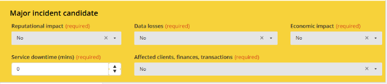
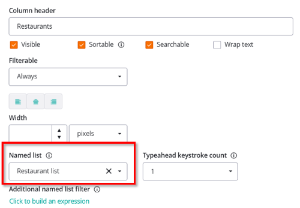
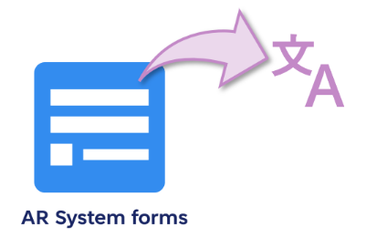
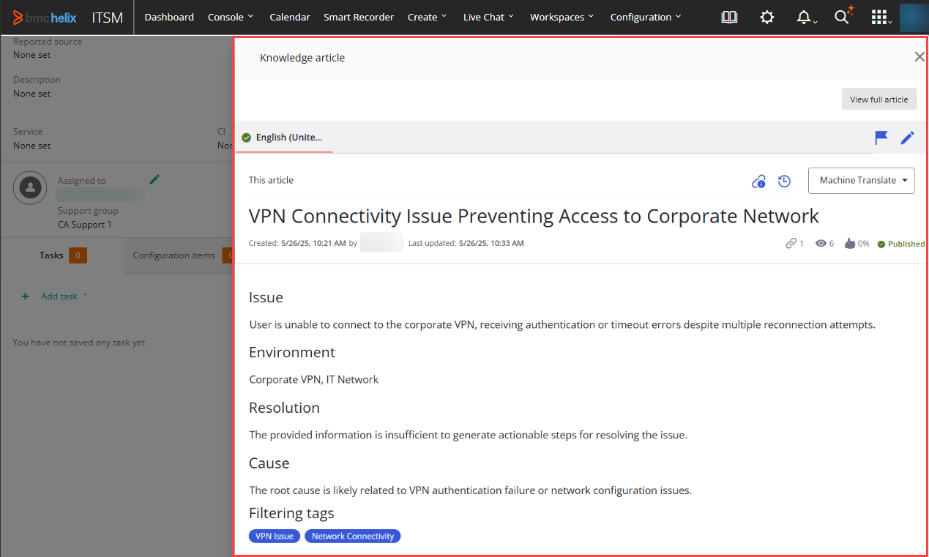

Review the ITSM 25.3 enhancements for features that will benefit your organization and to understand changes that might impact your users.

| Version | SaaS | On premises | Fixed issues | Updates |
| --- | --- | --- | --- | --- |
| 25.3.02 | ✅️ |  | [Known and corrected issues](https://docs.bmc.com/xwiki/wiki/internal/view/Service-Management/IT-Service-Management/itsmMaster2/Release-notes-and-notices/Known-and-corrected-issues/) | [25.3.02 enhancements](https://docs.bmc.com/xwiki/bin/view/Service-Management/IT-Service-Management/BMC-Helix-ITSM/itsm254/Release-notes-and-notices/25-3-enhancements-and-patches/#25302) |
| 25.3.01 | ✅️ | ✅️ | [Known and corrected issues](https://docs.bmc.com/xwiki/wiki/internal/view/Service-Management/IT-Service-Management/itsmMaster2/Release-notes-and-notices/Known-and-corrected-issues/) | [25.3.01 enhancements](https://docs.bmc.com/xwiki/bin/view/Service-Management/IT-Service-Management/BMC-Helix-ITSM/itsm254/Release-notes-and-notices/25-3-enhancements-and-patches/#25301) |
| 25.3.00 | ✅️ |  | [Known and corrected issues](https://docs.bmc.com/xwiki/wiki/internal/view/Service-Management/IT-Service-Management/itsmMaster2/Release-notes-and-notices/Known-and-corrected-issues/) | [25.3.00 enhancements](https://docs.bmc.com/xwiki/bin/view/Service-Management/IT-Service-Management/BMC-Helix-ITSM/itsm254/Release-notes-and-notices/25-3-enhancements-and-patches/#25300) |

applies upgrades as described in the[Upgrade policy](https://docs.bmc.com/xwiki/bin/view/Helix-Common-Services/Other/BMC-Helix-Subscriber-Information/helixsubscriber/Policies/BMC-Helix-Upgrade-policy/). applies upgrades and patches during[Maintenance windows](https://docs.bmc.com/xwiki/bin/view/Helix-Common-Services/Other/BMC-Helix-Subscriber-Information/helixsubscriber/Operations/Maintenance-windows/).

---

## 25.3.02

There are no new features or enhancements in this release.

## 25.3.01

There are no new features or enhancements in this release

## 25.3.00

## ITSM enhancements

### Create knowledge articles from incidents by using the Knowledge Curator AI agent for faster incident resolution

As a service desk agent, create knowledge articles from incidents directly in HKM by using the Knowledge Curator AI Agent.

This capability provides the following benefits:

* Users need not navigate away from the incident to create a knowledge article.
* Incident data, such as description, summary, and work notes is used to generate the knowledge article.
* The knowledge article is automatically pinned to the incident for ready reference.


Learn more about how to create knowledge articles by using the Knowledge Curator agent in ITSM in[Creating knowledge articles from incidents by using Knowledge Curator](https://docs.bmc.com/xwiki/bin/view/Service-Management/IT-Service-Management/BMC-Helix-ITSM/itsm254/Getting-started/Use-cases/Create-knowledge-articles-from-incidents-by-using-Knowledge-Curator/).

### Use the Service Collaborator AI agent to automatically send email responses for inbound emails

As an administrator, enable automatic responses to inbound emails by using the Service Collaborator AI Agent. The AI agent understands the incident and sends an appropriate response to the email. The response contains a summary of the information retrieved from published knowledge articles with recommended resolutions for the incident. If users find the response helpful, they can resolve the incident directly by clicking**Resolve**button in the email body.

This capability provides the following benefits:

* Reduces agent workload by automating routine email responses.
* Improves response time and user satisfaction with faster, accurate replies.
* Increases operational efficiency by allowing agents to focus on complex issues while Service Collaborator handles common queries.


Learn more about enabling automatic responses to inbound emails in[Enabling automatic responses to inbound emails by using Agentic AI](https://docs.bmc.com/xwiki/bin/view/Service-Management/IT-Service-Management/BMC-Helix-ITSM/itsm254/Setting-up-and-going-live/Configuring-settings-to-use-Agentic-AI-capabilities/Enabling-automatic-responses-to-inbound-emails-using-Agentic-AI/).

### *(Controlled availability customers only)*Preview and edit HKM knowledge articles directly within ITSM

As a Service Desk Agent, preview and edit knowledge articles from HKM directly within the ITSM interface.

This capability provides the following benefits:

* No need to navigate away from the ITSM application to preview and edit the knowledge articles from HKM, streamlining workflows and saving time.
* Experience a seamless user interaction of viewing and editing knowledge articles from both sources with easy navigation.
* Use similar editing capabilities for the knowledge articles from both sources.


Learn more about viewing and editing knowledge articles in[Leveraging knowledge from HKM](https://docs.bmc.com/xwiki/bin/view/Service-Management/IT-Service-Management/BMC-Helix-ITSM/itsm254/Getting-started/Use-cases/Leveraging-knowledge-from-BMC-Helix-Knowledge-Management-by-ComAround/).

### Use the enhanced Agentic Chat to search for incidents, change requests, and knowledge articles

As a Service Desk Agent, use Agentic Chat for an improved, conversational experience when searching for incidents, change requests, and information from knowledge articles.

The improved chat provides the following benefits:

* When an administrator enables HelixGPT for ITSM, Agentic chat is available out of the box. The administrator need not enable it separately.
* A user can retrieve similar and related incidents in the chat and access incidents, change requests, and person objects directly from the chat through inline links.


Learn how to use Agentic Chat in[Searching for information by using HelixGPT chat](https://docs.bmc.com/xwiki/wiki/internal/view/Service-Management/IT-Service-Management/itsmMaster2/Navigating-common-interfaces/Searching-for-information-by-using-BMC-HelixGPT-chat/25-3-00#).

### Use predefined prompts in Ask HelixGPT to accelerate incident resolution and improve response consistency

As a service desk agent, use predefined prompts in Ask HelixGPT to minimize manual entry of standard queries and accelerate incident resolution. An administrator can also modify the predefined prompts according to the business requirement.

This capability provides the following benefits:

* Ease of use and improved user interaction, resulting in faster resolution of incidents.
* Customization of predefined prompts according to business requirements.


Learn how to use the predefined prompts in[Resolving tickets with the help of Ask HelixGPT](https://docs.bmc.com/xwiki/wiki/internal/view/Service-Management/IT-Service-Management/sdMaster2/Managing-incident-requests/Resolving-incident-requests/Resolving-tickets-with-the-help-of-Ask-HelixGPT/25-3).

### Use auto ticket categorization for accelerated incident resolution by leveraging AI capabilities

As a Service Desk Manager, leverage the capabilities of artificial intelligence (AI) to analyze historical, closed incidents to classify incoming incidents into appropriate categories. AI also predicts the best-suited support group for resolving incidents.

This AI-based capability provides the following benefits:

* Better classification of incidents into categories, resulting in quicker resolutions.
* Improved assignments to support groups, ensuring appropriate utilization of support resources.


Learn how auto-categorization works in[Creating incident requests](https://docs.bmc.com/xwiki/wiki/internal/view/Service-Management/IT-Service-Management/sdMaster2/Managing-incident-requests/Registering-incident-requests/Creating-an-incident-request/25-3#).

### Use contextual search in the Contracts console filters

As a user, leverage the type-ahead search in filters in the Contracts console to get contextual suggestions for search criteria such as email ID and department. Suggestions appear after you enter the first three characters.

This capability provides the following benefits:

* Alignment with other ITSM consoles, delivering a consistent, intuitive user experience across consoles.
* Service desk agents require less training to work on multiple consoles, improving productivity.


Learn more about the Contract console in[Managing contracts through the Contracts console](https://docs.bmc.com/xwiki/wiki/internal/view/Service-Management/IT-Service-Management/assetMaster2/Managing-contracts/Managing-contracts-through-the-Contract-console/).

### Create a contract from an asset or another contract

As an asset manager, create a contract from an asset or a contract ticket and relate it without navigating away from the ticket. You can also associate existing contracts with assets**.**This capability is consistent with Mid Tier and reduces the repetitive steps, saving you time and effort in asset management.


Learn more about creating and relating contracts in[Creating and updating contracts](https://docs.bmc.com/xwiki/wiki/internal/view/Service-Management/IT-Service-Management/assetMaster2/Managing-contracts/Creating-and-updating-contracts/)and[Relating contracts and CIs](https://docs.bmc.com/xwiki/wiki/internal/view/Service-Management/IT-Service-Management/assetMaster2/Managing-contracts/Relating-contracts-to-CIs/).

### Detect major incidents by using additional qualifiers

As a Service Desk Manager, get recommendations to assess whether an incident candidate qualifies to be classified as a major incident. This assessment is based on advanced major incident qualifiers such as economic impact, data loss, and reputational impact.

This capability provides the following benefits:

* Use the recommendation to identify major incidents and their risks in advance to reduce the impact of major incidents.
* Improve the overall incident management in your organization.



Learn how to detect major incidents in[Managing major incidents](https://docs.bmc.com/xwiki/wiki/internal/view/Service-Management/IT-Service-Management/sdMaster2/Managing-incident-requests/Managing-and-tracking-major-incidents/).

### *(Controlled availability customers only)*Localize foundation data to meet locale-specific language requirements

Localize the foundation data in the supported languages to enable users to view it in their preferred language while maintaining language consistency with the application user interface.

Localizing the foundation data helps you adhere to the region-specific language compliance requirements and also enhances user experience.

For more information, see[Localizing foundation data into the supported languages](https://docs.bmc.com/xwiki/bin/view/Service-Management/IT-Service-Management/BMC-Helix-ITSM/itsm254/Administering/Localizing-foundation-data-into-the-supported-languages/).

### Enhanced localization support

Localization support is extended for the following entities:

* System-generated activity notes on PWA screens
* IS-based Create change freeze page
* English Canada (EN\_CA) and French Canada (FR\_CA) languages supported for Mid Tier

Learn about the supported languages in[Supported languages and locales](https://docs.bmc.com/xwiki/bin/view/Service-Management/IT-Service-Management/BMC-Helix-ITSM/itsm253/Planning/Supported-languages-and-locales/).

## What else has changed in this release

| Update | Product behavior in versions earlier than 25.3.00 | Product behavior in version 25.3.00 |
| --- | --- | --- |
| The**Contactmiddlename**field is available out of the box in the ITSM Tickets CRD for the Shared Ticket Console. | In the ITSM Tickets CRD, only the**Contactfirstname**,**Contactlastname**, and**Contactfullname**fields are available out of the box for contact names. The**Contactmiddlename**field is not available.<br> | The**Contactmiddlename**field is available out of the box in the ITSM Tickets CRD. You can add this field to the ticket console record grid and search, filter, or sort contacts by their middle name in the Shared Ticket Console.<br>For more information about the Shared Ticket Console, see[Customizing Shared Ticket Console](https://docs.bmc.com/xwiki/bin/view/Service-Management/IT-Service-Management/BMC-Helix-ITSM/itsm252/Administering/Enabling-and-customizing-Shared-Ticket-Console/Customizing-Shared-Ticket-Console/)and[Managing your work by using Ticket Console](https://docs.bmc.com/xwiki/bin/view/Service-Management/IT-Service-Management/BMC-Helix-ITSM/itsm253/Navigating-common-interfaces/Managing-your-work-by-using-Ticket-Console/).<br> |
| Unified log format across services boosts event correlation | The log entry formats vary, particularly in timestamps and time zone offsets. It is difficult for a central logging solution to support logging across all tenants and applications. | A unified log format across multiple services in a distributed environment is implemented, enhancing the ability to quickly correlate and analyze sequences of events. |
| Ability to customize the Contracts console. | The Contracts console did not support customization. | The following views in the Contracts console support customization:<br>  * Contracts console * Related contracts * Related assets  For more details,[Enabling and configuring the Contract console](https://docs.bmc.com/xwiki/wiki/internal/view/Service-Management/IT-Service-Management/assetMaster2/Administering/Enabling-or-disabling-the-Contract-Console/).<br> |
| The**Resolution note**field is preserved when an incident is reverted from**Resolved**to a prior status, if it contains resolution-specific information.<br> | On PWA screens, the resolution note was removed when you reverted a resolved incident to a prior status.<br> | On PWA screens, the resolution note is preserved when you revert a resolved incident to a prior status. However, if you remove the resolution-specific details from the**Resolution note**field while reverting the incident to a previous status, the field is removed.<br>This functionality aligns with the incident behavior in the Mid Tier and non-PWA screens and provides you with a seamless experience of using ITSM products.<br>For more details, see[Moving a resolved incident request back to In Progress](https://docs.bmc.com/xwiki/wiki/internal/view/Service-Management/IT-Service-Management/sdMaster2/Managing-incident-requests/Resolving-incident-requests/Moving-a-resolved-incident-request-back-to-In-Progress/)and[Reopening a closed or resolved incident request](https://docs.bmc.com/xwiki/wiki/internal/view/Service-Management/IT-Service-Management/sdMaster2/Managing-incident-requests/Reopening-a-closed-or-resolved-incident-request/).<br> |

## ITSM Insights enhancements

### Investigate issues by using the Proactive Problem Management Advanced Analytics dashboard

As a problem coordinator, use the Proactive Problem Management Advanced Analytics dashboard to quickly identify incident trends and resolution patterns for every Proactive problem management job.

This capability provides the following benefits:

* Provides actionable insights about incident patterns and their volume.
* Helps in investigating and resolving problems more efficiently.


Learn more about ITSM Insights dashboards in[Tracking ITSM Insights usage in Dashboards](https://docs.bmc.com/xwiki/wiki/internal/view/Service-Management/IT-Service-Management/insightsMaster/Tracking-ITSM-Insights-usage-in-BMC-Helix-Dashboards/).


## IS 25.3.00 enhancements

25.3 enhancements and patches

## 25.3.01 updates

## Use updated support for technology stack

Service Management supports the following technology stacks:

* Kubernetes version 1.33
* OpenShift version 4.19
* Nginx Ingress Controller version 1.12.4
* Helm 3.18

For more information, see[System requirements](https://docs.bmc.com/xwiki/bin/view/Service-Management/On-Premises-Deployment/BMC-Helix-Service-Management-Deployment/brid25301/Planning/System-requirements/).

## *(Controlled availability customers only)*Deploy Service Management platform components

To optimize resource utilization and minimize your environmental footprint, deploy only the platform components of Service Management using the CORE deployment mode. This mode loads only the essential components and services into memory, allowing you to start with a lightweight setup and scale up based on your operational needs. Use the CORE mode to activate only the following components:

* IS
* CMDB
* Foundation data objects
* *(Optional)*HelixGPT and Clam AntiVirus

For more information, see[Deploying Service Management in the CORE mode](https://docs.bmc.com/xwiki/bin/view/Service-Management/On-Premises-Deployment/BMC-Helix-Service-Management-Deployment/brid25301/Getting-started/Deployment-use-cases/Deploy-BMC-Helix-Service-Management-platform-components/),[Performing the Service Management installation,](https://docs.bmc.com/xwiki/bin/view/Service-Management/On-Premises-Deployment/BMC-Helix-Service-Management-Deployment/brid25301/Installing/Performing-the-BMC-Helix-Service-Management-installation/)and[Transitioning between deployment modes.](https://docs.bmc.com/xwiki/bin/view/Service-Management/On-Premises-Deployment/BMC-Helix-Service-Management-Deployment/brid25301/Administering/Transitioning-between-deployment-modes/)

## What else changed in this release​

The following table lists the changes in the product behavior:

| Update | Product behavior in versions earlier than 25.3.01 | Product behavior in version 25.3.01 |
| --- | --- | --- |
| Localization of selection field values in record definition for AR System forms. | TheGET:api/rx/application/record/recorddefinition/{name}API did not support the localization of selection field values in record definitions for AR System forms.<br> | TheGET:api/rx/application/record/recorddefinition/{name}API supports the localization of selection field values in record definitions for AR System forms.<br>If you access a view created with AR System form, the selection field values are displayed in your locale.<br>For more information, see[Creating or modifying view definitions.](https://docs.bmc.com/xwiki/bin/view/Service-Management/Innovation-Suite/BMC-Helix-Innovation-Suite/is253/Tailoring-applications-and-automating-processes/Creating-the-definitions-for-a-tailorable-application/Defining-the-user-interface-through-view-definitions/Creating-or-modifying-view-definitions/)<br> |
| Upgrade process changes | Direct upgrade was supported for upgrading Service Management from an earlier version to the latest version. A step upgrade was not required for any earlier version. | You can perform a direct upgrade of Service Management from 23.3.x and later versions. However, upgrading from versions earlier to 23.3.x includes a step upgrade.<br>For more information, see[Upgrading Service Management to 25.3.01](https://docs.bmc.com/xwiki/bin/view/Service-Management/On-Premises-Deployment/BMC-Helix-Service-Management-Deployment/brid25301/Upgrading/Upgrading-BMC-Helix-Service-Management-to-22-1-06/).<br> |
| Parameters name changes in the**HELIX\_ONPREM\_DEPLOYMENT**pipeline. | The**HELIX\_ONPREM\_DEPLOYMENT**pipeline parameter names in version earlier to 25.3.01 are as follows:<br>  * CLUSTER * CLUSTER\_DOMAIN * CUSTOMER\_SIZE * DEPLOYMENT\_MODE | The following**HELIX\_ONPREM\_DEPLOYMENT**pipeline parameter names are renamed:<br>  * CLUSTER renamed as CLUSTER\_CONTEXT * CLUSTER\_DOMAIN renamed as APPLICATION\_PARENT\_DOMAIN * CUSTOMER\_SIZE renamed as ENVIRONMENT\_SIZE * DEPLOYMENT\_MODE renamed as DEPLOYMENT\_TYPE  Additionally, the DEPLOYMENT\_MODE parameter is included. Use this parameter to select the following deployment modes:<br>  * **CORE**—Loads only essential platform components such as:   + IS   + CMDB   + Foundation data objects   + Optionally, HelixGPT and Clam AntiVirus * **FULL**(Default)—Loads all available Service Management components and applications into memory.  For more information, see[Performing the Service Management installation](https://docs.bmc.com/xwiki/bin/view/Service-Management/On-Premises-Deployment/BMC-Helix-Service-Management-Deployment/brid25301/Installing/Performing-the-BMC-Helix-Service-Management-installation/).<br> |
| Automatic installation of the**yq**utility package on Helm nodes during deployment preparation | The**yq**utility package was not required or installed as part of the deployment process. | The**yq**utility package is now automatically installed on all Helm nodes during deployment preparation. This utility is required for smooth Helm-based pipeline execution in both Standard and Air-gapped environments. |

## 25.3.00 updates

The following video (01:05) provides a quick overview of the enhancements in the IS 25.3.00.

[🎥 Watch Video: //www.youtube.com/watch?v=HfKVItwWfdk](//www.youtube.com/watch?v=HfKVItwWfdk)

[Watch the video that describes the new features in IS 25.3](https://youtu.be/HfKVItwWfdk)

## Configure chat responses in a carousel or card format

Developers or application business analysts can configure actions on cards and buttons that are triggered when you click them.

You can view chat responses in a carousel or card format, which shows a more interactive and intuitive experience.

For more information, see[Adding an AI-based conversational search interface to a view](https://docs.bmc.com/xwiki/bin/view/Service-Management/Innovation-Suite/BMC-Helix-Innovation-Suite/is253/Tailoring-applications-and-automating-processes/Creating-the-definitions-for-a-tailorable-application/Defining-the-user-interface-through-view-definitions/Adding-an-AI-based-conversational-search-interface-to-a-view/).


## Configure dynamic welcome suggestions and view dynamic suggestions for chat responses

Developers or application business analysts can configure dynamic welcome suggestions to personalize the initial user interaction. Dynamic welcome suggestions enhance engagement by presenting personalized, context-aware prompts at the beginning of the conversation.

Additionally, HelixGPT displays dynamic suggestions after each response. Users can use these suggestions to select relevant follow-up options.

For more information, see[Adding an AI-based conversational search interface to a view](https://docs.bmc.com/xwiki/bin/view/Service-Management/Innovation-Suite/BMC-Helix-Innovation-Suite/is253/Tailoring-applications-and-automating-processes/Creating-the-definitions-for-a-tailorable-application/Defining-the-user-interface-through-view-definitions/Adding-an-AI-based-conversational-search-interface-to-a-view/).


## *(Controlled availability customers only)*Accelerate record creation with the IS RD Agent

You can generate record definitions by using the prompt-based conversations. The agent intelligently interprets your input and automatically builds the required structure. This capability streamlines the setup process, reduces manual effort, and accelerates application development.

For more information, see[Creating or modifying record definitions by using IS RD Agent](https://docs.bmc.com/xwiki/bin/view/Service-Management/Innovation-Suite/BMC-Helix-Innovation-Suite/is253/Tailoring-applications-and-automating-processes/Creating-the-definitions-for-a-tailorable-application/Defining-record-definitions-to-store-and-manage-data/Creating-or-modifying-record-definitions-by-using-generative-AI/).


## Enhance the flexibility of the Record editor by binding inputs to view variables instead of record fields

As an application business analyst, you can create a view variable while designing a view to get more flexibility while managing data. You can bind a supported Record editor input to this variable instead of binding it to a record field. The value of the view variable can be used within the view. The changes to a variable will be reflected in the input that is bound to it. Conversely, the changes in the input will be reflected in the view variable to which this input is bound. For more information, see[Creating or modifying view definitions](https://docs.bmc.com/xwiki/bin/view/Service-Management/Innovation-Suite/BMC-Helix-Innovation-Suite/is253/Tailoring-applications-and-automating-processes/Creating-the-definitions-for-a-tailorable-application/Defining-the-user-interface-through-view-definitions/Creating-or-modifying-view-definitions/).


## Add a named list to filterable grid columns in a record grid

As an application business analyst, you can assign a named list to a filterable grid column in a record grid if the field is not associated with a named list. You can also override the field’s default named list. A named list provides a predefined set of values that helps users filter and select data within a grid column more quickly. For more information, see[Creating a tabular view of record instances by using a record grid](https://docs.bmc.com/xwiki/bin/view/Service-Management/Innovation-Suite/BMC-Helix-Innovation-Suite/is253/Tailoring-applications-and-automating-processes/Creating-the-definitions-for-a-tailorable-application/Defining-the-user-interface-through-view-definitions/Creating-a-tabular-view-of-record-instances-by-using-a-record-grid/#.Creatingatabularviewofrecordinstancesbyusingarecordgridv23.3.04-Toeditthegridcolumnsandthecolumnpropertiesforthefields).



## Invoke an AI agent from IS workflow

In the Process designer, Business Analysts can add the**Invoke Agent**element to trigger an AI agent to perform a task. The**Invoke Agent**element provides the following benefits:

* Enhances automation by leveraging AI capabilities within workflows.
* Retrieves responses dynamically based on user input.
* Integrates conversational experiences seamlessly into business workflows.

For more information, see[Invoking an AI agent from the process](https://docs.bmc.com/xwiki/bin/view/Service-Management/Innovation-Suite/BMC-Helix-Innovation-Suite/is253/Tailoring-applications-and-automating-processes/Creating-the-definitions-for-a-tailorable-application/Defining-the-application-business-logic-through-processes/Invoking-an-AI-agent-from-the-process/).


## Enable localization of data in AR System forms

As an administrator, enable data localization so that users across multiple regions can interact with IS in their preferred language. With support for localized data, users benefit from improved clarity, compliance, and a more intuitive experience. Administrators can easily manage localized data, ensuring consistency and accessibility across the organization.

For more information, see[Preparing your application to be localized](https://docs.bmc.com/xwiki/bin/view/Service-Management/Innovation-Suite/BMC-Helix-Innovation-Suite/is253/Developing-applications-by-using-Developer-Studio/Localizing-an-application-to-other-languages/Using-the-localization-toolkit-to-localize-your-applications/Preparing-your-application-to-be-localized/).



## Create advanced search filters by combining AND, OR, and NOT operators

While creating search filters for HKM articles, administrators can define advanced search filters that integrate logical operators AND, OR, and NOT within a single query. When your end users use these filters to search for knowledge articles, the workplace page returns only those articles that meet the search criteria. This capability helps users in the following ways:

* Delivers the most relevant knowledge articles.
* Reduces time spent sifting through unrelated search results.
* Helps users apply the right solutions to the right context.

For more information, see[Creating search filters for applications](https://docs.bmc.com/xwiki/bin/view/Service-Management/Innovation-Suite/BMC-Helix-Innovation-Suite/is253/Enabling-services/Configuring-BMC-Helix-Knowledge-Management-by-ComAround-as-a-knowledge-provider/Creating-search-filters-for-BMC-applications/).


## *(Controlled availability customers only)*Preview and edit HKM knowledge articles directly within ITSM

Knowledge workers can preview and edit knowledge articles from HKM directly within the ITSM interface.

Knowledge workers can benefit from a seamless and consistent experience when viewing and editing knowledge articles from HKM. They don't need to navigate away from the ITSM application to preview or edit the knowledge articles from HKM, streamlining workflows and saving time.

​​​​Learn more about configuring HKM as a knowledge provider for ITSM in[Configuring HKM as a knowledge provider](https://docs.bmc.com/xwiki/bin/view/Service-Management/Innovation-Suite/BMC-Helix-Innovation-Suite/is253/Enabling-services/Configuring-BMC-Helix-Knowledge-Management-by-ComAround-as-a-knowledge-provider/).

****

## What else changed in this release​

The following table lists the changes in the product behavior:

| Update | Product behavior in versions earlier that 25.3.00 | Product behavior in version 25.3.00 |
| --- | --- | --- |
| Response links behavior based on the target attribute for the**HelixGPT chat**component.<br> | Links received in the chat response while using the**HelixGPT chat**component always open on the same tab.<br> | Links received in the chat response while using the**HelixGPT chat**component open on the same tab or a new tab. This behavior depends on the target attribute value specified in the response.<br>For more information, see[Adding an AI-based conversational search interface to a view](https://docs.bmc.com/xwiki/bin/view/Service-Management/Innovation-Suite/BMC-Helix-Innovation-Suite/is253/Tailoring-applications-and-automating-processes/Creating-the-definitions-for-a-tailorable-application/Defining-the-user-interface-through-view-definitions/Adding-an-AI-based-conversational-search-interface-to-a-view/).<br> |
| HelixGPT Manager is rebranded to HelixGPT Agent Studio | NA | HelixGPT Manager, the console that helps administrators to navigate and manage agentic AI capabilities across applications, is rebranded to HelixGPT Agent Studio. |
| The ISO 8601 format is used for log timestamps. | Logs used varying timestamp formats across services. | Log files, including Jetty logs, use timestamps in the ISO 8601 format (yyyy-MM-dd'T'HH:mm:ss.SSSZ); for example, 2025-01-29T15:20:15.000-0700. This format makes it easier to debug issues across services.<br>Formore information, see[Log entry format](https://docs.bmc.com/xwiki/bin/view/Service-Management/Innovation-Suite/BMC-Helix-Innovation-Suite/is253/Troubleshooting/Enabling-and-analyzing-logs/Analyzing-logs/Log-entry-format/).<br> |
| Localize Ask HelixGPT prompt text in Progressive Views. | AR System did not provide the capability to localize Ask HelixGPT prompts. | The message type**Ask HelixGPT Prompt**is available in the AR System Message Catalog form. You can enable applications to centrally define and localize prompt text entries in Progressive Views.<br>For more information, see[Localizing message components of a form view](https://docs.bmc.com/xwiki/bin/view/Service-Management/Innovation-Suite/BMC-Helix-Innovation-Suite/is253/Developing-applications-by-using-Developer-Studio/Localizing-an-application-to-other-languages/Localizing-AR-System-applications-manually/Localizing-message-components-of-a-form-view/).<br> |
| The Creator module in the Email Engine can be configured to run in multi-threaded mode for enhanced performance. | The Creator module in the Email Engine supported only single-threaded mode. | The Creator module in the Email Engine can be configured to run in multi-threaded mode for enhanced performance when handling large volumes of outgoing emails. By default, it runs in single-threaded mode. For more information, see[Email Engine architecture](https://docs.bmc.com/xwiki/bin/view/Service-Management/Innovation-Suite/BMC-Helix-Innovation-Suite/is253/Getting-started/Key-concepts/Architecture/Email-Engine-architecture/). |

## CMDB 25.3.00 enhancements

25.3 enhancements and patches

The following video (01:05) provides a quick overview of the enhancements in the CMDB 25.3.00.

[🎥 Watch Video: //www.youtube.com/watch?v=w0WC0Ko0Js4](//www.youtube.com/watch?v=w0WC0Ko0Js4)

[Watch the video that describes the new features in CMDB 25.3](https://youtu.be/w0WC0Ko0Js4)

### Source data from Azure SQL databases

Source data from Azure SQL databases by using the Atrium Integrator Spoon client.

If your data is on an Azure SQL database, you can continue to have the performance, scalability, and security of an Azure database while directly sourcing the data to the Atrium Integrator Spoon client and then add that data to your CMDB.

To learn more, see[Using the Atrium Integrator Spoon client](https://docs.bmc.com/xwiki/bin/view/Service-Management/IT-Service-Management/BMC-Helix-CMDB/ac253/Using/Transferring-data-from-external-data-stores-to-BMC-Helix-CMDB/Atrium-Integrator/Using-the-Atrium-Integrator-Spoon-client/).

### Access self-help resources with in-app help

In-app help is available from a movable widget on every screen. Click the self-help widget to access a product tour, interactive guides, instructions for setting up and going live, and more. In addition, you can continue to find answers to your questions in the online documentation or in our[CMDB playlist](https://youtube.com/playlist?list=PLibAMtD70sYEcM-dfbe_L0HlKL3HTsHcX&si=7ff83KidKxAzmZFk)


### Consent for data collection

After you log in, select whether you want to allow the product to collect data about your product usage. This data helps to improve product performance, identify usage trends, and prioritize feature enhancements. For more information, see[Modifying consent for data collection](https://docs.bmc.com/xwiki/bin/view/Service-Management/IT-Service-Management/BMC-Helix-CMDB/ac253/Administering/Modifying-consent-for-data-collection/)


## What else changed in this release​

The following table lists the changes in the product behavior:

| Update | Product behavior in versions earlier than 25.3.00 | Product behavior in version 25.3.00 |
| --- | --- | --- |
| Look and feel of the user interface | The user interface for CMDB reflected the older branding.<br><br> | The user interface for CMDB reflects the updated branding, which mainly includes changes to the color palette.<br><br>If you have made any custom branding to the CMDB user interface before upgrading to 25.3.00, the new branding is not applied. To learn more about customizing the color and branding of the CMDB user interface, see[Rebranding the CMDB Portal](https://docs.bmc.com/xwiki/bin/view/Service-Management/IT-Service-Management/BMC-Helix-CMDB/ac253/Administering/Rebranding-the-CMDB-Portal/).<br> |
| Date format in log files | Log files used varying time stamp formats in different services. | Date formats in all the log files are in the ISO 8601 format.<br>ISO 8601 dates are in the following format:<br>  ``` yyyy-MM-dd'T'HH:mm:ss.SSSZ ```  Example :<br>  ``` 2025-01-29T15:20:15.000-0700 ```  This format helps with easy correlation of ​​​events across several services in distributed environments.<br> |

**Related topics**

[Known-and-corrected-issues](https://docs.bmc.com/xwiki/wiki/internal/view/Service-Management/IT-Service-Management/itsmMaster2/Release-notes-and-notices/Known-and-corrected-issues/)

[Release-notes-and-notices](https://docs.bmc.com/xwiki/wiki/internal/view/Service-Management/IT-Service-Management/itsmMaster2/Release-notes-and-notices/)

[Downloading the installation files](https://docs.bmc.com/xwiki/bin/view/Service-Management/On-Premises-Deployment/BMC-Helix-Service-Management-Deployment/brid23304/Installing/Preparing-for-installation/Downloading-the-installation-files/)

[Single Sign-on 22.3 enhancements and patches](https://docs.bmc.com/xwiki/bin/view/Helix-Common-Services/Single-Sign-On/BMC-Helix-Single-Sign-On/rsso223/Release-notes-and-notices/22-3-enhancements-and-patches/)

[DWP 25.3 enhancements and patches](https://docs.bmc.com/xwiki/bin/view/Service-Management/Employee-Digital-Workplace/BMC-Helix-Digital-Workplace/dwp253/Release-notes-and-notices/25-3-enhancements-and-patches/)