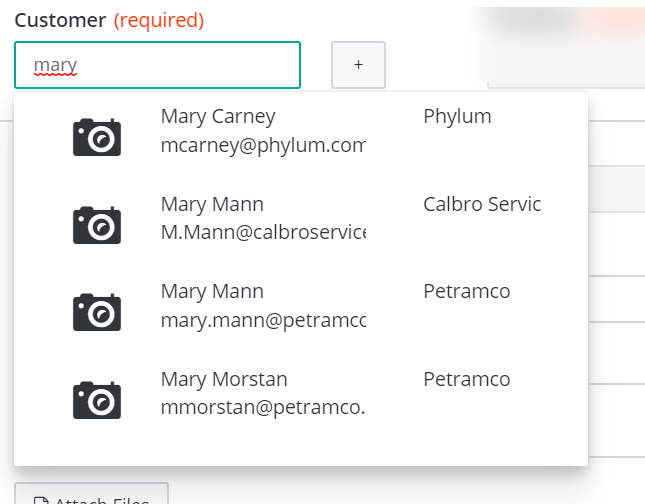

For forms viewed in a browser, you can turn on an "automatic complete" feature for character fields that have a menu attached to them. When this feature is configured for a field and a user begins typing text into the field, a list of values that match the text appears. When multiple values are presented, the user can change the selection with the up and down arrow keys or using the mouse. To select a highlighted option, the user presses Enter or click it with a mouse.

Related topics

[Adding-mention-for-fields-in-Progressive-Web-Applications](https://docs.bmc.com/xwiki/bin/view/Service-Management/Innovation-Suite/BMC-Helix-Innovation-Suite/is254/Developing-Progressive-Web-Applications/Adding-mention-for-fields-in-Progressive-Web-Applications/)

[Creating-dynamic-selection-lists-for-Progressive-Web-Applications-by-using-JSON-data](https://docs.bmc.com/xwiki/bin/view/Service-Management/Innovation-Suite/BMC-Helix-Innovation-Suite/is254/Developing-Progressive-Web-Applications/Creating-dynamic-selection-lists-for-Progressive-Web-Applications-by-using-JSON-data/)

[Creating-selection-lists-in-Progressive-Web-Applications](https://docs.bmc.com/xwiki/bin/view/Service-Management/Innovation-Suite/BMC-Helix-Innovation-Suite/is254/Developing-Progressive-Web-Applications/Creating-selection-lists-in-Progressive-Web-Applications/)

**Standard view**

**Progressive view**

By default, the suggestion list is case-insensitive, and it displays the*value*of the option, not the label. (You can change the configuration so that the menu's*labels*are displayed instead of its values.)

The results in the suggestion list can differ among databases. For example, for an Oracle database, the results are case sensitive by default. For other databases, the results are case insensitive.

The Menu/Row/Level Choice workflow condition runs when auto complete is used to fill in the value.Remember these tips when configuring workflow with character fields that have the automatic complete feature turned on:

* If workflow manipulates*values*of menu selections, you might want to configure auto-complete to show labels rather than values so that the workflow runs properly.
* The Return/Table or Level Dbl-Clk workflow condition does not run when the user presses Enter as part of the Auto Complete feature (that is, when the selection list is displayed). At other times, the workflow condition runs normally.

For more information, see[Defining-workflow-to-automate-processes](https://docs.bmc.com/xwiki/bin/view/Service-Management/Innovation-Suite/AR-System/ars221/Developing-applications/Defining-workflow-to-automate-processes/).

The following video (0:40) provides an overview of using the auto-complete or typeahead feature.

[🎥 Watch Video: https://www.youtube.com/watch?v=qU0O9nIJJ5M](https://www.youtube.com/watch?v=qU0O9nIJJ5M)

<https://youtu.be/qU0O9nIJJ5M>

The following video (5:41) shows how tocreate typeahead fields and explore various options available to customize them.

[🎥 Watch Video: https://www.youtube.com/watch?v=hhvyBy99Ujg](https://www.youtube.com/watch?v=hhvyBy99Ujg)

<https://youtu.be/hhvyBy99Ujg>

## To enable or disable auto-complete

1. In Developer Studio, create a New Regular Form.  
   
2. Create a Progressive View.

   

Steps (2)

<ol><li><strong>Form &gt; Create New View</strong>.  The Create New View dialog box opens.</li><li>In the<strong>View Type</strong>list, select<strong>Progressive</strong>. </li></ol>

3. Create a character field in the view.
4. Attach a menu to it.
5. Select the character field.
6. In the**Properties**tab, set the following properties:

   | **Property**  | **Description**  |
   | --- | --- |
   | Auto Complete  | Determines what types of matches are displayed. The options are:  * **None**(the default)—Disables auto-complete. * **Leading Match**—Lists menu options that begin with the text that the user entered in the field. * **Anywhere Match**—Lists menu options that include any text that the user entered in the field. |
   | Auto Complete After Keystrokes  | * This property is used only for character fields with a*search*menu attached. The property is ignored for all other fields. * The number of characters the user must type to trigger auto complete. For example, if you enter 3, auto complete displays the list of matching values after the users enters 3 or more characters. The default is 0. * Use the Auto Complete After Keystrokes property to set the typeahead value for search menus in Progressive Views. * Choose the value carefully to get efficient results as this can have performance implications. If menu is expected to return huge amount of data, set this value to a higher number such as 3 or more. * If you have enabled the Auto Complete property and set the**Auto Complete After Keystrokes**to zero (0), the dropdown will appear as soon as you click or tab to focus on the character field. |
   | Auto Complete Hide Menu Button  | Determines whether the menu box is displayed (False) or hidden (True). The default is False. For large data sets, set this option to True so that users cannot open a menu. Instead, the menu data is used for auto-completion purposes only.  |
   | Auto Complete Match By  | Determines whether menu*values*or*labels*are displayed. The options are:  * **Value**(the default)—Menu values are displayed and used for matching while typing, as well as for completion. * **Label**—Menu labels are displayed and used for matching while typing, but the menu value is used for completion. (This option is not normally used unless workflow on menu choice operates on the value, but you want to show the label to the user.) |

   At runtime, users can disable auto-complete by pressing Escape while typing in a character field. Auto-complete remains canceled until the field loses focus; it is re-enabled the next time the field gets focus.

## To configure auto-complete to match by label

1. Follow the steps in[To enable or disable auto-complete](https://docs.bmc.com/xwiki/bin/create/ars221/2021-03-24_14-31-33_/Automatically%20completing%20menu%20entries%20v21/02/WebHome?parent=Service-Management.Innovation-Suite.BMC-Helix-Innovation-Suite.is254.Developing-Progressive-Web-Applications.Creating-fields-that-auto-complete-in-Progressive-Web-Applications.WebHome)to enable Auto Complete for a character field.
2. Select the character field.
3. In the**Properties**tab, click**Auto Complete Match By**, and select one of the following values:
   * **Value**(default)—Menu values are displayed and used for matching while typing, as well as for completion.
   * **Label**—Menu labels are displayed and used for matching while typing, but the menu value is used for completion. (This option is not normally used unless workflow on menu choice operates on the value but you want to show the label to the user.)

## Considerations for search menus with large data sets

Fields with search menus that represent a large data set (for example, over 10,000 entries) can cause performance issues and might not show the complete set of matches if the query limit is exceeded. Additionally, if a menu on the character field has thousands of entries, you might not want to display the menu with the field. To avoid these issues, remember these tips:

* Make sure that the menu is a*search*menu whose values are character fields in the target data source. Set the Refresh option for the menu to On Open.
* Because the data set is large, hide the menu button for the character field. (Set the character field's Auto Complete Hide Menu Button property to True.) This ensures that the menu data is used only for auto-completion purposes.
* Optionally, enable a limit on the number of characters required to be typed before matching begins. (Enter an integer in the character field's Auto Complete After Keystrokes property.)

## Workflow considerations

Remember these tips when configuring workflow with character fields that have the automatic complete feature turned on:

* The Menu/Row/Level Choice workflow condition executes when auto complete is used to fill in the value.
* If workflow manipulates*values*of menu selections, you might want to configure auto-complete to show labels rather than values so that the workflow runs properly.
* The Return/Table or Level Dbl-Clk workflow condition does not run when the user presses**Enter**as part of the Auto Complete feature (that is, when the selection list is displayed). At other times, the workflow condition executes normally.

For more information about workflow conditions, see[Defining-workflow-to-automate-processes](https://docs.bmc.com/xwiki/bin/view/Service-Management/Innovation-Suite/AR-System/ars221/Developing-applications/Defining-workflow-to-automate-processes/).