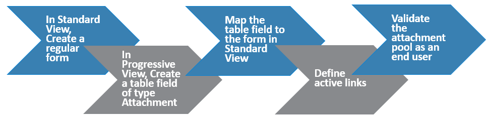
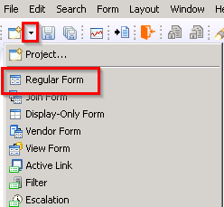
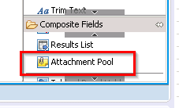
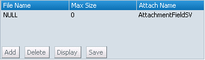
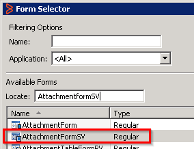
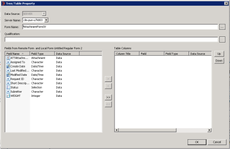
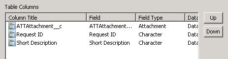
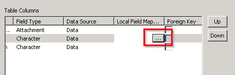
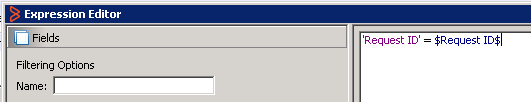
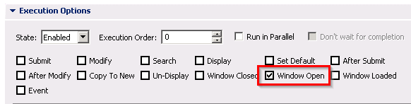

As an application developer, you can define an attachment pool by using a Table field in Progressive View to enable end users to add any number of attachments in Progressive Web Applications (PWA). An attachment pool contains attachment fields that enable users to store text, graphics, audio, or video with a request.  
To create an attachment pool, in Developer Studio, you must first create a regular form with an attachment pool in Standard View, and then associate it with a Table field of type attachment in Progressive View.

If you create an attachment pool as described in[Managing-attachments-in-interfaces-by-creating-attachment-pools](https://docs.bmc.com/xwiki/bin/view/Service-Management/Innovation-Suite/BMC-Helix-Innovation-Suite/is254/Developing-applications-by-using-Developer-Studio/Developing-the-application-interface/Creating-and-managing-fields/Managing-attachments-in-application-interfaces/Managing-attachments-in-interfaces-by-creating-attachment-pools/), end users can add only the number of attachments you specify in Developer Studio. Any change in the number of attachment fields, requires you to add more attachment fields in the Attachment Pool field in Developer Studio.

Related topics

[Enabling-Progressive-Views-for-forms-by-using-Centralized-Configuration-Settings](https://docs.bmc.com/xwiki/bin/view/Service-Management/Innovation-Suite/BMC-Helix-Innovation-Suite/is254/Developing-Progressive-Web-Applications/Enabling-Progressive-Views-for-forms-by-using-Centralized-Configuration-Settings/)

[UI-layout-of-Progressive-Web-Applications](https://docs.bmc.com/xwiki/bin/view/Service-Management/Innovation-Suite/BMC-Helix-Innovation-Suite/is254/Developing-Progressive-Web-Applications/UI-layout-of-Progressive-Web-Applications/)

[Customization-best-practices-for-developing-PWA](https://docs.bmc.com/xwiki/bin/view/Service-Management/Innovation-Suite/BMC-Helix-Innovation-Suite/is254/Developing-Progressive-Web-Applications/Customization-best-practices-for-developing-PWA/)

[Workflow-considerations-for-attachment-pools](https://docs.bmc.com/xwiki/bin/view/Service-Management/Innovation-Suite/BMC-Helix-Innovation-Suite/is254/Developing-applications-by-using-Developer-Studio/Developing-the-application-interface/Creating-and-managing-fields/Managing-attachments-in-application-interfaces/Workflow-considerations-for-attachment-pools/)

The following video (5:15) shows how to create attachment pools that allow variable number of attachments in progressive web applications:

[🎥 Watch Video: https://www.youtube.com/watch?v=sFkBJ-cjcH0](https://www.youtube.com/watch?v=sFkBJ-cjcH0)

<https://youtu.be/sFkBJ-cjcH0>

To create an attachment pool in PWA, you must perform the following high-level steps:  

| 1  | [Create a regular form in Standard View with an attachment pool](https://docs.bmc.com/xwiki/bin/view/Service-Management/Innovation-Suite/BMC-Helix-Innovation-Suite/is254/Developing-Progressive-Web-Applications/Managing-attachments-in-Progressive-Web-Applications-by-using-a-remote-form/#ManagingattachmentsinProgressiveWebApplicationsbyusingaremoteform-regular_form).  |
| 2  | [Create a table field of type attachment in Progressive View](https://docs.bmc.com/xwiki/bin/view/Service-Management/Innovation-Suite/BMC-Helix-Innovation-Suite/is254/Developing-Progressive-Web-Applications/Managing-attachments-in-Progressive-Web-Applications-by-using-a-remote-form/#ManagingattachmentsinProgressiveWebApplicationsbyusingaremoteform-table_field_type_attchmnt).  |
| 3  | [Map the table field to the regular form](https://docs.bmc.com/xwiki/bin/view/Service-Management/Innovation-Suite/BMC-Helix-Innovation-Suite/is254/Developing-Progressive-Web-Applications/Managing-attachments-in-Progressive-Web-Applications-by-using-a-remote-form/#ManagingattachmentsinProgressiveWebApplicationsbyusingaremoteform-map_fields).  |
| 4  | [Define active links to enable end users to save the attachments and to view them.](https://docs.bmc.com/xwiki/bin/view/Service-Management/Innovation-Suite/BMC-Helix-Innovation-Suite/is254/Developing-Progressive-Web-Applications/Managing-attachments-in-Progressive-Web-Applications-by-using-a-remote-form/#ManagingattachmentsinProgressiveWebApplicationsbyusingaremoteform-activelink_savebutton)  |
| 5  | [Validate whether the attachment pool works by logging in as a user.](https://docs.bmc.com/xwiki/bin/view/Service-Management/Innovation-Suite/BMC-Helix-Innovation-Suite/is254/Developing-Progressive-Web-Applications/Managing-attachments-in-Progressive-Web-Applications-by-using-a-remote-form/#ManagingattachmentsinProgressiveWebApplicationsbyusingaremoteform-validate)  |

The following concept diagram explains how the table field set to type Attachment that you must define in Progressive View in Developer Studio maps to the remote form you must define in Standard View in Developer Studio.

## Before you begin

* You must have a basic understanding of defining workflows. For more information see[Defining-workflow-to-automate-processes](https://docs.bmc.com/xwiki/bin/view/Service-Management/Innovation-Suite/BMC-Helix-Innovation-Suite/is254/Developing-applications-by-using-Developer-Studio/Defining-workflow-to-automate-processes/).
* You must know how to create active links. For more information, see[Defining-Set-Fields-actions-to-assign-values-based-on-conditions](https://docs.bmc.com/xwiki/bin/view/Service-Management/Innovation-Suite/BMC-Helix-Innovation-Suite/is254/Developing-applications-by-using-Developer-Studio/Defining-workflow-to-automate-processes/Specifying-workflow-actions/Defining-Set-Fields-actions-to-assign-values-based-on-conditions/).

  **Best practice**  
  To create an application where you allow end users to delete data from the main form that contains attachments in the Progressive View, make sure that the related data from the remote form is also deleted. To delete the remote form data, we recommend that you create a strong association between the parent form and the remote form with the same qualification as that of the table field of type attachment. This makes it possible for users to perform a cascade delete. For information about associations, see[Creating-associations](https://docs.bmc.com/xwiki/bin/view/Service-Management/Innovation-Suite/AR-System/ars221/Administering/Managing-data-and-objects/Defining-data-associations-among-forms/Creating-associations/).

## To create an attachment pool for PWA by using a remote form

### Step 1: To create a regular form with an attachment field in Standard View

1. Open Developer Studio and create a regular form in Standard View.  
   Select**New > Regular Form  
   **
2. Save the form with a name.  
   Use a name that will help you search for the form easily. For example,**AttachmentFormSV**.  
   We use this form, that you just saved, in the Standard View as the remote form which stores the attachments.
3. Under**Composite Fields**, drag**Attachment Pool**and drop it into the view.  
   
4. Select the attachment pool and in the properties, under**Attributes**, click the ellipsis next to**Attachment Fields**.  
     
   The Attachment Fields dialog box opens.
5. Click**New**.  
   An attachment field appears.  
   You can rename the field to identify it easily; for example,**AttachmentFieldSV**.
6. To add the field to the attachment pool field, click**OK**.  
   The regular form displays the attachment field.  
   
7. At the bottom of the view editor, click the view tab.
8. (*Optional*) Under Properties, edit the**Label**and**Name**properties to rename the view.
9. Set default values for all the required fields.  
   Required fields are in bold.  
     
   The preceding image shows an example in which. in Properties, we set a**Default Value**to**$USER$**for**Submitter**and**NA**for**Short Description**.
10. Click**Save**().

### Step 2: To create a table field of type Attachment

1. In Developer Studio, select**Form > Create New View**.  
   The Create New View dialog box opens.
2. In the**View Type**list, select**Progressive**.  
     
   A new view is created; For example,**DefaultAdministratorView2\_c**.
3. (*Optional*) Under Properties, edit the**Label**and**Name**properties to rename the view.
4. Drag and drop the**Table - List View**field.
5. On the**Properties**panel, expand the Display property group.
6. Click**Display Type**and then select**Attachment**from the list.  
     
   The option**Attachment**is available only when the view is set to Progressive.

### Step 3: To map the table field to the regular form created in Standard View

1. In the Properties tab, next to**Tree/Table Property**, in the**Value**column, click the ellipsis () button.  
     
   The Tree/Table Property dialog box opens.
2. On the**Tree/Table Property**dialog box, next to the**Form Name**field, click the ellipsis ().  
   The Form Selector dialog box opens.
3. Select the regular form in the Standard View that you created.  
   The following image shows the example in which we select**AttachmentFormSV**.  
     
   This regular form acts as the remote form that holds the attachment data.  
   When you close the Form Selector dialog box, you see that the Tree/Table Property dialog box with the available fields.  
   
4. Add the field of type**Attachment**and any other required columns to the table.  
   In this example, we add the following fields.  
     
   You must map at least one field of type Attachment.
5. Click the ellipsis () button in the Local Field Mapping column.  
     
   The Field Selector dialog box opens.  
   You might have to scroll sideways to view the Local Field Mapping column.
6. Select the field of the same data type and click**OK**.  
     
   For example, for the column with title Request ID, you can select**Request ID\_c**.
7. Add the**Local Field Mapping**for all columns in the table except the one that has Data Type set to**Attachment**.  
   This is required to pass data from the Progressive View form back to the regular form in Standard View.
8. Select the**Foreign Key**check box for at least one column.  
   The**Qualification**field is automatically populated and this qualification is used to fetch the data from the remote form. You must make sure that the**Foreign Key**is a unique identifier.
9. Click**OK**and save the form.  
   In this example, save the form as**AttachmentFormPV**.
10. (*Optional*) In**Display Properties**, set a value for**Size of Chunk**to define the number of attachments that are displayed in the PWA.  
    When end users add more attachments than this number, a**Show More**option appears.
11. Define an active link to enable end users to save the attachments as described in[Enable end users to save the attachments by defining an active link](https://docs.bmc.com/xwiki/bin/view/Service-Management/Innovation-Suite/BMC-Helix-Innovation-Suite/is254/Developing-Progressive-Web-Applications/Managing-attachments-in-Progressive-Web-Applications-by-using-a-remote-form/#ManagingattachmentsinProgressiveWebApplicationsbyusingaremoteform-activelink_savebutton).

## Enable end users to save the attachments and refresh the form by using active links

You must create a button to save attachments and also add an active link so that end users can view uploaded attachments.

### Step 1: To create buttons to save and refresh in the Progressive View

1. In the Progressive View, under**Display Fields**, drag and drop**Button**into the view.  
     
   This is the button that end users click to save their attachments after adding them to the Progressive View form.
2. Select the new button and update the following required properties:
   1. **Database > Name**
   2. **Database > ID**  
      Optionally, you can enter ID as 1001 to enable saving the attachments. In such a case, you do not need to define an active link to commit changes as described later in this procedure.
   3. **Display > Button Label**Change the button label to**Save**.
   4. **Permissions > Permissions**.  
      Add permissions as required.
3. Add another button.
4. Modify the properties as required and change the label to**Refresh**.

### Step 2: To create active links to commit changes

1. Create a new active link.  
   Select**New > Active Link**.  
   
2. Select a server in the Select Server dialog box.  
   The Untitled Active Link screen appears.
3. In the Associated Forms section, click**Add**.  
   The Form Selector dialog box opens.
4. Select the form in the Progressive View which has the button.  
   In this example, select**AttachmentFormPV**.
5. In the Execution Options section, beside the**Button/Menu Field**, click the ellipsis () button.  
   The Field Selector dialog box opens.
6. Select the button for which you want to create the active link.  
   In this example, it is the button for which you have set the**Button Label**value to**Save**. Whenever this button is clicked this active link is run.
7. In the**If Action**section, right-click and select**Add Action > Commit Changes**.
8. In the**If Action**section, right-click and select**Add Action > Open Window**.
9. In the**Window Type**list select**Display Directly**.
10. Beside the**Form View Name**field, select the ellipsis () button.  
    The View Selector dialog box opens.
11. Select the name of the view that contains the button for which you want to add the active link.  
    In this example, select**DefaultAdministratorView2\_c**.

### Step 3: To create a qualification for the active link

1. Click the ellipsis () button beside the**Qualification**field.  
   The**Expression Editor**dialog box opens.
2. In the**Forms**list, select the form in Progressive View which contains the button.
3. In the**Available Fields**list, select**Request ID**.  
   You can see the qualification being created in the field.
4. Complete the qualification.  
   In this example, enter '**Request ID' = $Request ID$**as this field is also mapped in the remote form.  
     
   Retain the default settings and save this active link.  
   In this example, save this as AttachmentAL.  
   After the end users add attachments in the PWA and click**Save**, this active link saves a record in the remote form along with the attachments, and then reloads the PWA entry and all of its attachments in view mode.

### Step 4: Create an active link to refresh the view

1. Create a new active link.  
   **New > Active Link**  
   
2. Select a server in the Select Server dialog box.  
   The Untitled Active Link screen appears.
3. In the Associated Forms section, click**Add**.  
   The Form Selector dialog box opens.
4. Select the form in the Progressive View which has the button.  
   In this example, select**AttachmentFormPV**.
5. In the Execution Options section, select**Window Open**.  
   
6. Beside the**Button/Menu/Field**, click the ellipsis () button.
7. The Field Selector dialog box opens.
8. Select the button for which you want to create the active link.  
   In this example, it is the button for which you have set the**Button Label**value to**Refresh**.
9. In the**If Action**section, right-click and select**Add Action > Change Field**.
10. Click the ellipsis () button beside**Field**and select the table field.
11. Select the check box beside**Refresh Tree/Table**.
12. Save the active link.

### Step 5: To validate whether the attachment pool works

1. Refresh your browser cache.  
   **<*serverName*>:8080/arsys/shared/config/config.jsp**
2. Click**Sync Cache**.  
   You must perform this step every time you make changes in Developer Studio.
3. In a browser, sign in to PWA with valid credentials.  
   **<*serverName*>:8080/arsys/pwa/#/login**
4. Change the URL to include the Progressive View form that you created in Developer Studio.  
   **<*serverName*>:8080/arsys/pwa/#/forms/<*serverName*>/<*formName*>/<*viewName*>**  
   In this example, the URL is**<*serverName*>:8080/arsys/pwa/#/forms/<*serverName*>/AttachmentFormPV/DefaultAdministratorView2\_c**

   **Important**

   If there are any required fields in the remote form in the standard view, you must make sure that they are mapped to the form in Progressive View so that users are able to view them in PWA. If required fields exist and are not displayed, users will not be able to complete the form in PWA.
5. Attach a few files and click**Save**.  
   The attachments are saved and displayed.

**Important**

The size of the attachment that end users can upload is determined by the**Field > Max Size**property in the remote form. For more information about this property, see[Managing-attachments-in-interfaces-by-creating-attachment-pools](https://docs.bmc.com/xwiki/bin/view/Service-Management/Innovation-Suite/BMC-Helix-Innovation-Suite/is254/Developing-applications-by-using-Developer-Studio/Developing-the-application-interface/Creating-and-managing-fields/Managing-attachments-in-application-interfaces/Managing-attachments-in-interfaces-by-creating-attachment-pools/).