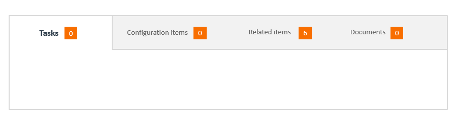

As a developer, you must first build the application interface by using various basic elements such as panels and panel holders before you can add elements such as fields and buttons. Panel holders are basic structural elements you can create by using Developer Studio. The following display types are available for panels in a panel holder.

## Tabbed

In a tabbed display, only one panel in the container is visible at a time. To view each panel, users click its tab or press the Tab key.  
  
Only the horizontal orientation is available for tabbed panel holders. Tabbed panel holders do not have Border Thickness or Border Color properties.

Related topics

[Flow-panel-holders-for-Progressive-Web-Applications](https://docs.bmc.com/xwiki/bin/view/Service-Management/Innovation-Suite/BMC-Helix-Innovation-Suite/is254/Developing-Progressive-Web-Applications/Flow-panel-holders-for-Progressive-Web-Applications/)

[Setting-panels-to-scroll-at-different-rates-in-Progressive-Web-Applications](https://docs.bmc.com/xwiki/bin/view/Service-Management/Innovation-Suite/BMC-Helix-Innovation-Suite/is254/Developing-Progressive-Web-Applications/Setting-panels-to-scroll-at-different-rates-in-Progressive-Web-Applications/)

**Tabbed panel holder**

If a tabbed panel holder has more tabs than fit in one row, Developer Studio hides the remaining tabs. However, you can scroll the tabs to see them.  
  
In browsers, multiple rows of tabs are not supported. Instead, if the number of tabs exceeds the width of the panel holder, left and right arrows appear. Users click the arrows to scroll to the tabs that extend beyond the width of the holder. The focus remains on the current panel when scrolling occurs.

**Best practice**  
A performance impact might occur if the tabbed panel contains a table that is populated with large amount of data. We recommend using collapsible, or Accordion style panel.

## Collapsible (stacked)

In a collapsible display, multiple panels in a panel holder can be viewed at the same time, either horizontally or vertically.  
  
By default, if a collapsible panel holder contains space that is not allocated to a panel, the extra space is added to the bottom or right-most expanded panel in the holder. This prevents white space from appearing in the holder itself. In addition, you can control the allocation of extra space by assigning priorities to panels and by using the Fit to Content property. For more information, see[Avoiding-scroll-bars-in-panels](https://docs.bmc.com/xwiki/bin/view/Service-Management/Innovation-Suite/BMC-Helix-Innovation-Suite/is254/Developing-applications-by-using-Developer-Studio/Developing-the-application-interface/Grouping-fields-with-panels/Avoiding-scroll-bars-in-panels/)).  
  
At design time, collapsible panels appear to have a fixed size. But at runtime, as various panels in the holder are expanded and collapsed by users or hidden and unhidden by workflow, the other panels in the holder shrink and expand to accommodate the changing space in the holder. This can create visual differences between panels at design time and runtime.  
  
**Collapsible panel holder**

## Accordion

An accordion display is similar to the collapsible pane except that the content of one panel in the panel holder is always visible. Only the headers for the remaining panels are visible. Headers cannot be hidden in accordion displays.  
  
At runtime, when you click a panel header, that panel is expanded to display its contents. If another panel was open, it is automatically collapsed and only its header is visible.

## Splitter

In a splitter display, multiple panels in a container can be viewed at the same time, either vertically or horizontally, and can be dynamically resized by dragging a splitter control on either side.  
  

Flow panel holder for Progressive Web Applications

A Flow panel holder is available when you enable a Progressive view for your form. For more information, see[Progressive View quick start guide](https://docs.bmc.com/xwiki/bin/view/Service-Management/Innovation-Suite/BMC-Helix-Innovation-Suite/is254/Getting-started/Key-concepts/Application-development-overview/Progressive-View-quick-reference-guide/).

The Flow panel holder supports the properties required to enable a progressive view. Use a Flow Panel holder for aligning fields on a form. You can also group the fields to ensure correct alignment of fields on a form. This panel does not have a panel header, and supports Container panel holder (Default), Sub Panel holder, and Section Panel holder types.

The following video (4:52) demonstrates creating Fixed panels in Developer Studio when you enable progressive views for a form:

[🎥 Watch Video: https://www.youtube.com/watch?v=m33BWG-mEoI](https://www.youtube.com/watch?v=m33BWG-mEoI)

<https://youtu.be/m33BWG-mEoI>

The following video (13:03) demonstrates creating complex layouts with flow panels:

[🎥 Watch Video: https://www.youtube.com/watch?v=TnwUS2RF28Q](https://www.youtube.com/watch?v=TnwUS2RF28Q)

[https://youtu.be/TnwUS2RF28Q](https://youtu.be/TnwUS2RF28Q)

### Panel arrangement sequence

The panels are arranged in the following sequence or hierarchy:  
Flow Panel holder > Container Panel Holder > Container Panel> Sub Panel Holder > Sub Panel > Section Panel Holder > Section Panel > Section Panel Holder > Section Panel > fields

* A progressive view can hold only a Container type Flow panel holder and a Fixed panel holder.
* By default, a Flow panel holder has one panel as a child panel.
* You can change the read-only property type of any panel only when you change the property type of Flow panel holder.

**Tip**

When you add Flow Panel Holder to the Progressive View from the palette in Developer Studio, the flow panel holder is represented by a panel holder in the Outline pane.

In the following example figure, the flow panel holder is represented by**Panel Holder\_c**enclosing a panel named**Panel\_c**:

### Container Flow panel holder

* By default, a Container type Flow panel is added to a Flow panel holder.
* You can delete a Container Flow panel only if you remove all progressive views.
* A Container Flow panel holder can have one or more Sub panels.

### Section Flow panel holder

* You can add a Section Flow panel holder only under a Sub panel or Section panel.
* A Section panel can either have a Section type Flow panel holder or non-panel fields.
* The Section Flow panel holder added by framework contains only Section panel as children.

### Sub panel holder

The Sub panel holder behaves as a Section panel on the desktop client. However, it is displayed as a tab on a mobile client.

* You can add a sub panel holder only under the container panel.
* A sub panel holder can have one or more sub panels.

For more information about developing PWA, see[Developing-Progressive-Web-Applications](https://docs.bmc.com/xwiki/bin/view/Service-Management/Innovation-Suite/BMC-Helix-Innovation-Suite/is254/Developing-Progressive-Web-Applications/).