# Documentation Reference: Suite Is-25.4

## Table of Contents
- [Developing-Pwa.md](#developing-pwamd)
- [Developing-Pwa/Adding-@Mention-For-Fields.md](#developing-pwaadding-@mention-for-fieldsmd)
- [Developing-Pwa/Adding-Context-Menus-For-Right-Clicking-Of-Interfa.md](#developing-pwaadding-context-menus-for-right-clicking-of-interfamd)
- [Developing-Pwa/Adding-Icons-And-Images.md](#developing-pwaadding-icons-and-imagesmd)
- [Developing-Pwa/Adding-Icons-And-Images/Adding-Background-Images-To-Fields-And-Form-Views.md](#developing-pwaadding-icons-and-imagesadding-background-images-to-fields-and-form-viewsmd)
- [Developing-Pwa/Adding-Icons-And-Images/Adding-Icons-To-Ui-Elements-On-Forms-By-Using-Deve.md](#developing-pwaadding-icons-and-imagesadding-icons-to-ui-elements-on-forms-by-using-devemd)
- [Developing-Pwa/Adding-Icons-And-Images/Creating-And-Modifying-Image-Objects.md](#developing-pwaadding-icons-and-imagescreating-and-modifying-image-objectsmd)
- [Developing-Pwa/Adding-Icons-And-Images/Previews-Of-Icons-Available-In-Developer-Studio-To.md](#developing-pwaadding-icons-and-imagespreviews-of-icons-available-in-developer-studio-tomd)
- [Developing-Pwa/Adding-Rich-Text-Fields.md](#developing-pwaadding-rich-text-fieldsmd)
- [Developing-Pwa/Configuring-The-Progress-Bar-Widget.md](#developing-pwaconfiguring-the-progress-bar-widgetmd)
- [Developing-Pwa/Configuring-The-Results-List-In-Progressive-View.md](#developing-pwaconfiguring-the-results-list-in-progressive-viewmd)
- [Developing-Pwa/Creating-A-Popup-Window.md](#developing-pwacreating-a-popup-windowmd)
- [Developing-Pwa/Creating-A-Progressive-View-In-Developer-Studio.md](#developing-pwacreating-a-progressive-view-in-developer-studiomd)
- [Developing-Pwa/Creating-An-Advanced-Filter.md](#developing-pwacreating-an-advanced-filtermd)
- [Developing-Pwa/Creating-Dynamic-Selection-Lists-Using-Json-Data.md](#developing-pwacreating-dynamic-selection-lists-using-json-datamd)
- [Developing-Pwa/Creating-Fields-That-Auto-Complete.md](#developing-pwacreating-fields-that-auto-completemd)
- [Developing-Pwa/Creating-List-Tables-And-Setting-Selection-Mode-By.md](#developing-pwacreating-list-tables-and-setting-selection-mode-bymd)
- [Developing-Pwa/Creating-Resizable-Panes.md](#developing-pwacreating-resizable-panesmd)
- [Developing-Pwa/Creating-Search-Menus-With-Better-Readability.md](#developing-pwacreating-search-menus-with-better-readabilitymd)
- [Developing-Pwa/Creating-Selection-Lists.md](#developing-pwacreating-selection-listsmd)
- [Developing-Pwa/Css-Classes-Used-In-Progressive-Web-App-Screens.md](#developing-pwacss-classes-used-in-progressive-web-app-screensmd)
- [Developing-Pwa/Customization-Best-Practices-For-Developing-Pwa.md](#developing-pwacustomization-best-practices-for-developing-pwamd)
- [Developing-Pwa/Enabling-Progressive-Views-For-Forms-By-Using-Cent.md](#developing-pwaenabling-progressive-views-for-forms-by-using-centmd)
- [Developing-Pwa/Flow-Panel-Holders.md](#developing-pwaflow-panel-holdersmd)
- [Developing-Pwa/Localizing-A-Progressive-Web-Application.md](#developing-pwalocalizing-a-progressive-web-applicationmd)
- [Developing-Pwa/Managing-Attachments-Using-A-Remote-Form.md](#developing-pwamanaging-attachments-using-a-remote-formmd)
- [Developing-Pwa/Organizing-Fields-By-Using-Collapsible-And-Accordi.md](#developing-pwaorganizing-fields-by-using-collapsible-and-accordimd)
- [Developing-Pwa/Panel-Holder-Display-Types-In-Progressive-View.md](#developing-pwapanel-holder-display-types-in-progressive-viewmd)
- [Developing-Pwa/Rebranding-Progressive-Web-Application-Screens.md](#developing-pwarebranding-progressive-web-application-screensmd)
- [Developing-Pwa/Setting-Panels-To-Scroll-At-Different-Rates.md](#developing-pwasetting-panels-to-scroll-at-different-ratesmd)
- [Developing-Pwa/Setting-User-Preferences-And-Ccs-Parameters.md](#developing-pwasetting-user-preferences-and-ccs-parametersmd)
- [Developing-Pwa/Ui-Layout-Of-Pwa.md](#developing-pwaui-layout-of-pwamd)

---

## <a id="developing-pwamd"></a>Developing-Pwa.md

Progressive web applications (PWA) are applications that use common web technologies including HTML, CSS, and JavaScript. These applications are platform-independent and can be used across different devices such as desktops, tablets, and mobiles.

**Best practice**  
Use IS for developing new codeless and code-based applications.

Use Developer Studio for customizing PWA screens for existing applications such asITSM.

You can develop a PWA in Developer Studio. PWA technology provides you with the ability to create applications and additions to the ITSM applications that work across multiple platforms. For example, the same application runs on an iOS device or an Android device without you having to develop a separate client for each device.

Progressive web applications automatically fit the screen of the device they run on.

Related topics

[Comparison-between-Developer-Studio-and-IS-capabilities](https://docs.bmc.com/xwiki/bin/view/Service-Management/Innovation-Suite/BMC-Helix-Innovation-Suite/is254/Getting-started/Comparison-between-Developer-Studio-and-BMC-Helix-Innovation-Studio-capabilities/)

[Mid-Tier-architecture](https://docs.bmc.com/xwiki/bin/view/Service-Management/Innovation-Suite/AR-System/ars221/Getting-started/Key-concepts/Architecture/Mid-Tier-architecture/)

[Enabling-Progressive-Views-for-forms-by-using-Centralized-Configuration-Settings](https://docs.bmc.com/xwiki/bin/view/Service-Management/Innovation-Suite/BMC-Helix-Innovation-Suite/is254/Developing-Progressive-Web-Applications/Enabling-Progressive-Views-for-forms-by-using-Centralized-Configuration-Settings/)

[Adding custom fields to your views by using Smart IT](https://docs.bmc.com/xwiki/bin/create/smartit221/Adding%20custom%20fields%20to%20your%20views%20using%20Smart%20ITe?parent=Service-Management.Innovation-Suite.BMC-Helix-Innovation-Suite.is254.Developing-Progressive-Web-Applications.WebHome)[Community: Video series for PWA](https://community.bmc.com/s/news/aA33n000000CjKYCA0/recorded-video-series-for-remedy-progressive-web-applications-pwa)[Community blog: Whitepaper on ITSM PWA Implementation Methodology](https://community.bmc.com/s/news/aA33n000000TXSHCA4/bmc-helix-itsm-pwa-implementation-methodology)

The following diagram shows the high-level process of developing applications with PWA technologies by using Developer Studio.


## Topics related to developing PWA in Developer Studio

Read through the following topics to learn more about developing a Progressive Web Application (PWA) in Developer Studio.

| Action<br> | Reference<br> |
| --- | --- |
| To understand the basic concepts of what PWAs are and their advantages<br> | [Progressive-Web-Applications-overview](https://docs.bmc.com/xwiki/bin/view/Service-Management/Innovation-Suite/BMC-Helix-Innovation-Suite/is254/Getting-started/Key-concepts/Application-development-overview/Progressive-View-quick-reference-guide/Illustrated-guide-to-progressive-web-applications/)<br> |
| To understand the Mid Tier architecture in general as well as Mid Tier architecture for PWAs<br> | [Mid-Tier-architecture](https://docs.bmc.com/xwiki/bin/view/Service-Management/Innovation-Suite/BMC-Helix-Innovation-Suite/is254/Getting-started/Key-concepts/Architecture/Mid-Tier-architecture/)<br> |
| To understand how flow panel holders can in creating create PWA screens and how they help with making screens responsive to varying screens<br> | [Flow-panel-holders-for-Progressive-Web-Applications](https://docs.bmc.com/xwiki/bin/view/Service-Management/Innovation-Suite/BMC-Helix-Innovation-Suite/is254/Developing-Progressive-Web-Applications/Flow-panel-holders-for-Progressive-Web-Applications/)<br> |
| To understand Progressive Web Application screens with a few examples<br> | [Progressive-web-application-screens](https://docs.bmc.com/xwiki/bin/view/Service-Management/Innovation-Suite/BMC-Helix-Innovation-Suite/is254/Getting-started/Key-concepts/Application-development-overview/Progressive-View-quick-reference-guide/)<br> |
| To know the basics of accessing and using Developer Studio<br> | [Accessing-and-navigating-Developer-Studio](https://docs.bmc.com/xwiki/bin/view/Service-Management/Innovation-Suite/BMC-Helix-Innovation-Suite/is254/Developing-applications-by-using-Developer-Studio/Accessing-and-navigating-Developer-Studio/)<br> |
| To create a Progressive Web Application you must first enable Progressive View for forms in Developer Studio<br> | [Enabling-Progressive-Views-for-forms-by-using-Centralized-Configuration-Settings](https://docs.bmc.com/xwiki/bin/view/Service-Management/Innovation-Suite/BMC-Helix-Innovation-Suite/is254/Developing-Progressive-Web-Applications/Enabling-Progressive-Views-for-forms-by-using-Centralized-Configuration-Settings/)<br> |
| To know best practices when developing and customizing a PWA<br> | [Customization-best-practices-for-developing-PWA](https://docs.bmc.com/xwiki/bin/view/Service-Management/Innovation-Suite/BMC-Helix-Innovation-Suite/is254/Developing-Progressive-Web-Applications/Customization-best-practices-for-developing-PWA/)<br> |
| To know the differences between the Developer Studio features for Mid Tier versus the features available in Progressive View<br> | [Differences-between-Developer-Studio-features-available-for-Mid-Tier-and-Progressive-Web-Applications](https://docs.bmc.com/xwiki/bin/view/Service-Management/Innovation-Suite/AR-System/ars221/Getting-started/Differences-between-Developer-Studio-features-available-for-Mid-Tier-and-Progressive-Web-Applications/)<br> |
| To learn about the localization support for a PWA<br> | [Localizing-a-Progressive-Web-Application](https://docs.bmc.com/xwiki/bin/view/Service-Management/Innovation-Suite/BMC-Helix-Innovation-Suite/is254/Developing-Progressive-Web-Applications/Localizing-a-Progressive-Web-Application/)<br> |
| To know how to use autocomplete for character fields in search menus<br> | [Creating-search-menus](https://docs.bmc.com/xwiki/bin/view/Service-Management/Innovation-Suite/AR-System/ars221/Developing-applications/Developing-the-application-interface/Defining-application-menus/Creating-search-menus/)<br> |
| To achieve better performance by setting the active links to run in parallel<br> | [Creating-active-links](https://docs.bmc.com/xwiki/bin/view/Service-Management/Innovation-Suite/AR-System/ars221/Developing-applications/Defining-workflow-to-automate-processes/Creating-workflow-objects/Creating-active-links/)<br> |
| To know the properties supported when developing a progressive view<br> | [Field properties](https://docs.bmc.com/xwiki/bin/view/Service-Management/Innovation-Suite/AR-System/ars221/Developing-applications/Developing-the-application-interface/Creating-and-managing-fields/Field-Properties/)<br> |
| Creating filters and advanced filters in progressive views that enable PWA users to search records and to fill forms<br> | [Creating-filters](https://docs.bmc.com/xwiki/bin/view/Service-Management/Innovation-Suite/AR-System/ars221/Developing-applications/Defining-workflow-to-automate-processes/Creating-workflow-objects/Creating-filters/)<br>[Creating-an-advanced-filter-in-Progressive-Web-Applications](https://docs.bmc.com/xwiki/bin/view/Service-Management/Innovation-Suite/BMC-Helix-Innovation-Suite/is254/Developing-Progressive-Web-Applications/Creating-an-advanced-filter-in-Progressive-Web-Applications/)<br>[Creating-a-faceted-filter](https://docs.bmc.com/xwiki/bin/view/Service-Management/Innovation-Suite/AR-System/ars221/Developing-applications/Developing-the-application-interface/Defining-tables-to-display-data/Creating-a-faceted-filter/)<br> |
| To know the icons available in Developer Studio for PWA and how to use them in your applications<br> | [Previews-of-icons-available-in-Developer-Studio-to-support-PWA](https://docs.bmc.com/xwiki/bin/view/Service-Management/Innovation-Suite/BMC-Helix-Innovation-Suite/is254/Developing-Progressive-Web-Applications/Adding-icons-and-images-to-Progressive-Web-Applications/Previews-of-icons-available-in-Developer-Studio-to-support-PWA/)<br>[Adding-icons-to-UI-elements-on-forms-by-using-Developer-Studio](https://docs.bmc.com/xwiki/bin/view/Service-Management/Innovation-Suite/BMC-Helix-Innovation-Suite/is254/Developing-Progressive-Web-Applications/Adding-icons-and-images-to-Progressive-Web-Applications/Adding-BMC-icons-to-UI-elements-on-forms-by-using-Developer-Studio/)<br> |
| To create various types of selection lists<br> | [Creating-selection-lists-in-Progressive-Web-Applications](https://docs.bmc.com/xwiki/bin/view/Service-Management/Innovation-Suite/BMC-Helix-Innovation-Suite/is254/Developing-Progressive-Web-Applications/Creating-selection-lists-in-Progressive-Web-Applications/)<br> |
| [Creating dynamic multiple selection lists for Progressive Web Applications by using JSON data](https://docs.bmc.com/xwiki/bin/view/Service-Management/Innovation-Suite/BMC-Helix-Innovation-Suite/is254/Developing-Progressive-Web-Applications/Creating-dynamic-selection-lists-for-Progressive-Web-Applications-by-using-JSON-data/)<br> |
| Add fields that allow editing and formatting of text, adding images, and so on<br> | [Adding-rich-text-fields-in-Progressive-Web-Applications](https://docs.bmc.com/xwiki/bin/view/Service-Management/Innovation-Suite/BMC-Helix-Innovation-Suite/is254/Developing-Progressive-Web-Applications/Adding-rich-text-fields-in-Progressive-Web-Applications/)<br> |
| Add a pause to a character field in a workflow<br> | [Adding-a-pause-interval-in-a-character-field-for-a-workflow-in-PWA](https://docs.bmc.com/xwiki/bin/view/Service-Management/Innovation-Suite/AR-System/ars221/Developing-applications/Developing-the-application-interface/Creating-and-managing-fields/Data-fields/Adding-a-pause-interval-in-a-character-field-for-a-workflow-in-PWA/)<br> |
| Create a survey in the application<br> | [Creating-a-survey-questionnaire](https://docs.bmc.com/xwiki/bin/view/Service-Management/Innovation-Suite/AR-System/ars221/Developing-applications/Developing-the-application-interface/Creating-and-managing-fields/Creating-a-survey-questionnaire/)<br> |
| Manage attachments in the application<br> | [Managing-attachments-in-Progressive-Web-Applications-by-using-a-remote-form](https://docs.bmc.com/xwiki/bin/view/Service-Management/Innovation-Suite/AR-System/ars221/Developing-a-Progressive-Web-Application/Managing-attachments-in-Progressive-Web-Applications-by-using-a-remote-form/)<br> |
| Add typeahead to mention users in the organization<br> | [Configuring-the-mention-component](https://docs.bmc.com/xwiki/bin/view/Service-Management/Innovation-Suite/AR-System/ars221/Developing-applications/Developing-the-application-interface/Creating-and-managing-fields/Data-fields/Configuring-the-mention-component/)<br> |
| Create a progress bar that shows stages of a workflow or process in your application<br> | [Configuring-the-Progress-bar-widget-in-Progressive-Web-Applications](https://docs.bmc.com/xwiki/bin/view/Service-Management/Innovation-Suite/BMC-Helix-Innovation-Suite/is254/Developing-Progressive-Web-Applications/Configuring-the-Progress-bar-widget-in-Progressive-Web-Applications/)<br> |
| Add autocomplete to a field<br> | [Automatically-completing-menu-entries](https://docs.bmc.com/xwiki/bin/view/Service-Management/Innovation-Suite/AR-System/ars221/Developing-applications/Developing-the-application-interface/Defining-application-menus/Automatically-completing-menu-entries/)<br> |
| Adding images in the interface of your application<br> | [Adding-background-images-to-fields-and-form-views](https://docs.bmc.com/xwiki/bin/view/Service-Management/Innovation-Suite/BMC-Helix-Innovation-Suite/is254/Developing-Progressive-Web-Applications/Adding-icons-and-images-to-Progressive-Web-Applications/Adding-background-images-to-fields-and-form-views/)<br> |
| Automatically aligning fields in Developer Studio<br> | [Aligning-fields](https://docs.bmc.com/xwiki/bin/view/Service-Management/Innovation-Suite/AR-System/ars221/Developing-applications/Developing-the-application-interface/Customizing-the-interface-for-multiple-consumers/Defining-and-managing-form-views/Arranging-fields-in-a-form-view/Aligning-fields/)<br> |
| Change the look and feel of your application to suit the branding and styles of your organization<br> | [Rebranding-Progressive-Web-Application-screens](https://docs.bmc.com/xwiki/bin/view/Service-Management/Innovation-Suite/BMC-Helix-Innovation-Suite/is254/Developing-Progressive-Web-Applications/Rebranding-Progressive-Web-Application-screens/)<br> |

## Videos related to developing PWA in Developer Studio

You can watch the following videos to know more about developing progressive web applications:

| Video title<br> | Description<br> |
| --- | --- |
| Webinar: Progressive Web Apps Introduction & Best Practices<br> | [🎥 Watch Video: https://www.youtube.com/watch?v=sVJXAhfVzQk](https://www.youtube.com/watch?v=sVJXAhfVzQk)<br>[](https://youtu.be/7DnZnfo6uZ8)<https://youtu.be/sVJXAhfVzQk><br> |
| Webinar: Progressive Web Application (PWA) Development In Helix ITSM<br> | [🎥 Watch Video: https://www.youtube.com/watch?v=-J-ENCJ8bc4](https://www.youtube.com/watch?v=-J-ENCJ8bc4)<br>[](https://youtu.be/7DnZnfo6uZ8)<https://youtu.be/-J-ENCJ8bc4><br> |
| Overview of Progressive Web Applications<br> | [🎥 Watch Video: https://www.youtube.com/watch?v=7DnZnfo6uZ8](https://www.youtube.com/watch?v=7DnZnfo6uZ8)<br>[https://youtu.be/7DnZnfo6uZ8](https://youtu.be/7DnZnfo6uZ8)<br> |
| Advancements in Developer Studio to support PWA<br> | [🎥 Watch Video: https://www.youtube.com/watch?v=YaI3s28w\_XY](https://www.youtube.com/watch?v=YaI3s28w_XY)<br>[](https://youtu.be/4Fy9LUFvK_w)<https://youtu.be/YaI3s28w_XY><br> |
| Use cases for Progressive Web Applications.<br> | [🎥 Watch Video: https://www.youtube.com/watch?v=s14\_l\_r9DwQ](https://www.youtube.com/watch?v=s14_l_r9DwQ)<br><https://youtu.be/s14_l_r9DwQ> This video (2:08) provides use cases for Progressive Web Application.<br> |
| Localizing a Progressive Web Application<br> | [🎥 Watch Video: https://www.youtube.com/watch?v=e2tOOdpBAB0](https://www.youtube.com/watch?v=e2tOOdpBAB0)<br><https://youtu.be/e2tOOdpBAB0> This video (7:31) provides an overview of how to localize a Progressive Web Application.<br> |
| Panel holder display types, creating fixed panels and complex layouts with flow panels<br> | [🎥 Watch Video: https://www.youtube.com/watch?v=m33BWG-mEoI](https://www.youtube.com/watch?v=m33BWG-mEoI)<br><https://youtu.be/m33BWG-mEoI> This video (4:52) demonstrates creating Fixed panels in Developer Studio when you enable progressive views for a form.<br> |
| [🎥 Watch Video: https://www.youtube.com/watch?v=TnwUS2RF28Q](https://www.youtube.com/watch?v=TnwUS2RF28Q)<br>[https://youtu.be/TnwUS2RF28Q](https://youtu.be/TnwUS2RF28Q) This video (13:03) demonstrates creating complex layouts with flow panels.<br> |
| Configuring a progress bar widget<br> | [🎥 Watch Video: https://www.youtube.com/watch?v=-T90EgZ\_ZtI](https://www.youtube.com/watch?v=-T90EgZ_ZtI)<br><https://youtu.be/-T90EgZ_ZtI> This video (3:37) describes how to configure and use the progress bar widget.<br> |
| Managing attachments in PWA by using a remote form<br> | [🎥 Watch Video: https://www.youtube.com/watch?v=sFkBJ-cjcH0](https://www.youtube.com/watch?v=sFkBJ-cjcH0)<br><https://youtu.be/sFkBJ-cjcH0> This video (5:15) shows how to create attachment pools that allow variable number of attachments in progressive web applications.<br> |
| Troubleshooting PWA<br> | [🎥 Watch Video: https://www.youtube.com/watch?v=MfSTrjhwau8](https://www.youtube.com/watch?v=MfSTrjhwau8)<br><https://youtu.be/MfSTrjhwau8>  This video (3:40) shows you how to use additional log settings and generated HTML to diagnose and troubleshoot PWA<br> |
| Adding images to buttons and background images to fields and form views.<br> | [🎥 Watch Video: https://www.youtube.com/watch?v=349xdes86qM](https://www.youtube.com/watch?v=349xdes86qM)<br><https://www.youtube.com/watch?v=349xdes86qM><br>This video (3:54) provides a summary of adding static or SVG images in Developer Studio for progressive views.<br> |
| Creating dynamic selection lists for Progressive Web Applications by using JSON data<br> | [🎥 Watch Video: https://www.youtube.com/watch?v=3eRIML5mOgI](https://www.youtube.com/watch?v=3eRIML5mOgI)<br><https://youtu.be/3eRIML5mOgI> This video (4:06) explains the concept and also demonstrates how the JSON properties and the JSONMAP function works.<br> |
| Creating a survey questionnaire<br> | [🎥 Watch Video: https://www.youtube.com/watch?v=v0VVhzPHQww](https://www.youtube.com/watch?v=v0VVhzPHQww)<br><https://youtu.be/v0VVhzPHQww>  Thisvideo (5:33) provides a summary of creating a survey questionnaire in Developer Studio for progressive views:<br> |
| Adding images in PWA<br> | This video (3:54) provides a summary of adding static or SVG images in Developer Studio for progressive views: <br>[🎥 Watch Video: https://www.youtube.com/watch?v=349xdes86qM](https://www.youtube.com/watch?v=349xdes86qM)<br><https://www.youtube.com/watch?v=349xdes86qM><br> |
| Aligning fields<br> | [🎥 Watch Video: https://www.youtube.com/watch?v=\_JhOoLN2agY](https://www.youtube.com/watch?v=_JhOoLN2agY)<br><https://youtu.be/_JhOoLN2agY><br>This video (3:50) provides a summary of how automatic alignment of fields happens in progressive views in Developer Studio.<br> |
| Creating typeahead fields for PWA<br> | [🎥 Watch Video: https://www.youtube.com/watch?v=hhvyBy99Ujg](https://www.youtube.com/watch?v=hhvyBy99Ujg)<br>[https://youtu.be/hhvyBy99Ujg](https://youtu.be/hhvyBy99Ujg)<br> |

---

## <a id="developing-pwaadding-@mention-for-fieldsmd"></a>Developing-Pwa/Adding-@Mention-For-Fields.md

The @mention component is a typeahead feature introduced for Progressive views. This component is supported for the Character field, where you can type in to provide your inputs. You can set the metadata for this component by using Developer Studio.

When you define a menu for a Character field, the Enable Menu Hotkeys property is automatically set to**False**. However, any hotkey definitions created earlier remain as they are. You can't add any duplicate hotkey definitions. Ensure that the menu you attach to a hotkey is a Search Menu.

Related topics

[Process-commands](https://docs.bmc.com/xwiki/bin/view/Service-Management/Innovation-Suite/BMC-Helix-Innovation-Suite/is254/Developing-applications-by-using-Developer-Studio/Defining-workflow-to-automate-processes/Specifying-workflow-actions/Using-Run-Process-and-PROCESS-commands/Process-commands/)

[Field-Properties](https://docs.bmc.com/xwiki/bin/view/Service-Management/Innovation-Suite/BMC-Helix-Innovation-Suite/is254/Developing-applications-by-using-Developer-Studio/Developing-the-application-interface/Creating-and-managing-fields/Field-Properties/)

[Developing-Progressive-Web-Applications](https://docs.bmc.com/xwiki/bin/view/Service-Management/Innovation-Suite/BMC-Helix-Innovation-Suite/is254/Developing-Progressive-Web-Applications/)

[Using-Run-Process-and-PROCESS-commands](https://docs.bmc.com/xwiki/bin/view/Service-Management/Innovation-Suite/BMC-Helix-Innovation-Suite/is254/Developing-applications-by-using-Developer-Studio/Defining-workflow-to-automate-processes/Specifying-workflow-actions/Using-Run-Process-and-PROCESS-commands/)

Example

To understand how the @mention component works, consider a scenario where you're composing a new email in Microsoft Outlook for Office 365. As soon as you type**@**you get a list of users in your organization and the user that you select gets added to the**To**list. You also get additional information about the user, such as name, email address, and a display picture if available, which helps you identify the correct user when there are multiple users of the same name.

As a scenario specific toIS, if an incident manager is working with an incident, the incident manager can type**@**in the activity notes to get a list of agents. This helps the incident manager select a particular agent from the list of available agents.

To support the @mention component for Progressive views, the following properties are added in Developer Studio:

| Property name<br> | Property type<br> | Property values<br> | Description<br> |
| --- | --- | --- | --- |
| Enable Menu Hotkeys<br> | Boolean<br> | * True * False (Default) | Specifies if the menu hotkeys are to be enabled. To define menu hotkeys, you must set the value of this property to**True**.<br> |
| Menu Hotkeys<br> | String<br> | A string<br> | Use this property to define hotkey definitions. By default, the text "No Hotkey Defined" is displayed as the value for this property.<br> |

## To configure the @mention component

1. On the Progressive view of a form, double-click a Character field.
2. On the**Properties**panel, under the Display property group, for the Enable Menu Hotkeys property, select the**True**value.
3. In the**Value**column for the Menu Hotkeys property, click the ellipsis button.  
   The**Menu Hotkeys**dialog box is displayed.  
     
   
4. Click**Add**, and then perform the following steps:

   | Column<br> | Step<br> |
   | --- | --- |
   | Hotkey<br> | Click the first row in this column, and then select a character from the list.<br> |
   | Menu Name<br> | Click the first row in this column, and then click the ellipsis button to select a menu from the**Menu Selector**dialog box.<br> |
   | Active Link<br> | Click the first row in this column, and then click the ellipsis button to select an active link from the**Active Link Selector**dialog box.<br>The active link that you attach to a hotkey must be an existing one and associated with the current form.<br> |
   | Labels<br> | Click the first row in this column, and then in the box, type in labels that are separated by a semicolon.<br> |
   | Auto Complete Key Stroke #<br> | Enter an integer value.<br> |
5. Click**OK**.

## Parameters for hotkey definition

The following parameters can be a part of any hotkey definition:

| Parameter<br> | Description<br> |
| --- | --- |
| Hotkey<br> | When you press this character key, the @mention component is executed based on the other parameters that you've provided in the hotkey definition. This parameter is the mandatory part of any @mention definition.<br> |
| Menu Name<br> | This is a name of the menu that is used to populate the popup. This parameter is the mandatory part of any @mention definition.<br> |
| Active Link<br> | This is a name of the active link that gets executed when you select an item from the popup. This parameter is an optional part of any @mention definition.<br> |
| Labels<br> | This is a set of labels that are defined for a menu. This parameter is an optional part of any @mention definition. You can add any text or you can add**$*menuLabel*$**where the label gets replaced by the menu label value during execution.*menuLabel*represents the label that is selected when using a search menu.<br> |
| Auto Complete Key Stroke #<br> | You can enter an integer value value for this parameter. For example, if you enter the value 3, a drop-down list appears after you type three characters in the menu. If you enter the value zero (0), the drop-down list appears as soon as type a hotkey character key.<br> |

There are scenarios when you want the users of your application to have the option of selecting the type of content that they see in an autosuggest list when using @mention. You can create such a search field by using theCHANGE\_HOTKEY\_MENUcommand.

## To enable users to select the type of content displayed in @mention

In the following example scenario, as an application developer, you add theCHANGE\_HOTKEY\_MENUcommand to enable the application users to decide the type of content in the @mention list.However, note that real-world implementations can vary considerably depending on your business needs.

Example:

**Problem**Apex Global wants to have a ticketing application in which one of the fields requires the application users to be able to use @mention to add mentions of either people or assets. The default behavior is that both assets and people are displayed in the @mention autosuggestion list. Apex Global wants the application users to be able to select an option to see only assets or only people for ease of use.

**Solution**Seth, the application developer, creates two buttons right next to the field. Users can click one button to make@mentionsuggest only assets or click the other button to make the @mention show only usernames. Seth uses a run processCHANGE\_HOTKEY\_MENU*fieldID key menuName*in an active link in each of the buttons so that the content displayed by the @mention autosuggest list is replaced by the content specified in the active link.

Before you begin

Make sure that you fulfil the following conditions before you perform the steps for creating fields where users can switch between @mention content.

* In Developer Studio, you must have a form that contains usernames and a form that contains asset names.
* You must have predefined search menus of type Search.

### Process for creating fields where users can switch between @mention content

The following diagram shows a high-level overview of the steps required to create fields where users can switch between different types of @mention content:


Create two buttons and a character field. The character field consists of a default @mention menu. The buttons are assigned active links and menus which should replace the default @mention menu when the buttons are clicked by application users.  
The following animation explains a high-level concept of the use case:

To create the field and buttons

In this procedure, we create a character field with a default menu, two buttons that contain an active link that uses theCHANGE\_HOTKEY\_MENU.

1. In Developer Studio, create a New Regular Form.  
   
2. Create a Progressive View.

   <details class="confluence-expand-macro panel panel-default"><summary><span class="panel-title"><span class="title-text">Steps (2)</span></span></summary><div class="panel-body"><ol><li><strong>Form &gt; Create New View</strong>.<br/><br/>The Create New View dialog box opens.</li><li>In the<strong>View Type</strong>list, select<strong>Progressive</strong>.<br/></li></ol></div></details>
3. Add two buttons to the view.
4. Name the buttons as**Assets Only**and**Users Only**.
5. (*Optional*) Add a new section panel.

<details class="confluence-expand-macro panel panel-default"><summary><span class="panel-title"><span class="title-text">Steps (2)</span></span></summary><div class="panel-body"><ol><li><br/><ol><li>In<strong>Outline</strong>, right-click the section panel holder and select<strong>Add New Panel</strong>.<br/><strong></strong></li><li>In the Properties tab, select the Sub Panel Holder, and in Properties, click<strong>Display &gt; Orientation</strong>and select<strong>Horizontal</strong>.<br/>This changes the orientation to show the new section panel to the right of the section with the buttons.</li></ol></li></ol></div></details>

### To define the hotkey for the character field

1. Add a character field and add a hotkey associated with a search menu to it.
   1. From the Palette, drag**Character**into the view or the section panel.  
      Developer Studio assigns it a default name such as**Character Field\_c**.
   2. Select the character field and rename it to**Character Field**.  
      
   3. In the Properties tab, click**Display > Enable Menu Hotkey**and select**True**.  
      This enabled you to set a hotkey for the character field.
   4. Below the**Enable Menu Hotkey**property, click the ellipsis () button next to**Menu Hotkeys**.  
      The Menu Hotkeys dialog opens.
   5. Click**Add**.  
      Developer Studio adds**@**in the Hotkey column.

      **Best practice**  
      To fetch email IDs in the @mention options, you must add # as the hotkey instead of @ in the Hotkey column to avoid errors.
   6. In the Menu Name column, click the ellipsis () button.  
      The Menu Selector dialog opens.
   7. Find the search menu that lists usernames and assets you want to associate with the hotkey and click**OK**.
   8. In the Auto Complete Key Stroke # column, add**3**.  
      The autosuggest is activated when application user types at least three characters.
   9. In the Properties tab, set a value in pixels for the**Hotkey Menu Max Height**property.  
      This is the maximum height of the @mention list when it displays a large number of results. The default value ofthe Hotkey Menu Max Height property is 200.

      **Best practice**  
      We recommend a value between 200 to 500 pixels for the**Hotkey Menu Max Height**property.
2. Save the form with a name.
3. In this example name the form as**ChangeHotkeyMenu**.

### To create a search menu that contains usernames

1. Create a new search menu.
2. Select**AR System Navigator >*aRServerName*> All Objects > Menus > New Search Menu**.  
     
   The hotkey supports only search menus.
3. Click the ellipsis () button next to**Form Name**.  
   The Form Selector dialog opens.
4. Find and add the user form that contains all usernames, and click**OK**.
5. Save the search menu.  
   In this example, name the menu as**ChangeHotkeyMenuM1**.

### To create a search menu that contains asset names

1. Create another search menu and name it as**ChangeHotkeyMenuM2**.  
   This menu must list all asset names.
2. Click the ellipsis () button next to**Form Name**.  
   The Form Selector dialog opens.
3. Find and add the form that contains all asset names, and click**OK**.
4. In the Label Fields section, click**Add**.  
   The Field Selector dialog opens.
5. Select Asset Name, and click**OK**.
6. Save the search menu.  
   In this example, name the menu as**ChangeHotkeyMenuM2**.

### To create an active link for the Users Only button

1. Create an active link for the**Users Only**button named**ChangehotkeymenuAL1**.
2. Select**New > Active Link**.  
   
3. Add the following settings to the active link:

   | Setting<br> | Value, selection, or function<br> | Additional details<br> |
   | --- | --- | --- |
   | **Associated Forms > Add**<br> | **ChangeHotkeyMenu**<br> |  |
   | **Execution Options > Button/Menu Field**<br> | **Users**<br> | This is the button that triggers the active link.<br> |
   | **Run If Qualification**<br> | **1=1**<br> | This triggers the run process in the**If Actions**without exception.<br> |
   | **If Actions > Add action > Run Process**<br> | **CHANGE\_HOTKEY\_MENU*fieldID******@******changehotkeymenuM1*****$NULL$ $NULL$*****3***<br> | Make sure that there is a single space between each attribute.<br>*fieldID*is the ID of**Character Field**.<br>**changehotkeymenuM1**is not dynamic and must always be hardcoded (static). This active link runs when you type three characters, that is, when you type @ in the**Character Field**and it fetches information from the**ChangehotkeymenuM1**search menu.<br> |

To create an active link for the Assets Only button

1. Create another active link for the**Assets Only**button named**ChangehotkeymenuAL2**.
2. Select**New > Active Link**.
3. Add the following settings to the active link:

   | Setting<br> | Value, selection, or function<br> | Additional details<br> |
   | --- | --- | --- |
   | **Associated Forms > Add**<br> | **ChangeHotkeyMenu**<br> |  |
   | **Execution Options > Button/Menu Field**<br> | **Assets**<br> | This is the button that triggers the active link fetches and uses it to replace the default menu of the character field.<br> |
   | **Run If Qualification**<br> | **1=1**<br> | This triggers the run process in the**If Actions**without exception.<br> |
   | **If Actions > Add action > Run Process**<br> | **CHANGE\_HOTKEY\_MENU*fieldID******@******changehotkeymenuM2**activeLink1**labelsToShow**3***<br> | Make sure that there is a single space between each attribute.<br>*fieldID*is the ID of**Character Field**.<br>**changehotkeymenuM2**is not dynamic and must always be hardcoded (static) with the menu name. This active link runs when you type three characters, that is, when you type @ in the**Character Field**and it fetches information from the**ChangehotkeymenuM2**search menu.<br> |
4. Save the changes.

**Important**

In the case of rich text enabled fields, in the run process command, you can additionally specify the fields to be displayed in the @mention list as shown in the following example:

**CHANGE\_HOTKEY\_MENU*fieldID******@******changehotkeymenuM2**activeLink1**fieldID**3 $rtfLabel1$ $rtfLabel2$***

The***$rtfLabel1$***and***$rtfLabel2$***values are used to limit the display of @mention options list to just these two fields. If you do not specify any values, the first four fields available in the menu are displayed by default. You can specify up to four different values to be displayed in the @mention options list.

The following graphic illustrates the display of @mentions options with default information and when restricted to only employee name and email ID:


Validating the character field in PWA

View the form in the progressive web application screen to check whether it works as intended.

1. In a browser, log in to PWA.  
   For example,**<*serverName*>:8080/arsys/pwa/#/login**
2. Change the URL to include the Progressive View form that you created in Developer Studio.  
   **<*serverName*>:8080/arsys/pwa/#/forms/<*serverName*>/<*formName*>/<progressiveV*iewName*>**
3. The PWA screen displays the character field and the buttons.
4. In**Character Field**, type**@**followed by three characters.  
   The field displays users and assets.
5. Click**Users Only**and type**@**followed by three characters.  
   The field displays usernames.
6. Click**Assets Only**and type**@**followed by three characters.  
   The field displays assets names.

## Where to go from here

Learn more about the syntax and additional options within the process command in the[Process-commands](https://docs.bmc.com/xwiki/bin/view/Service-Management/Innovation-Suite/BMC-Helix-Innovation-Suite/is254/Developing-applications-by-using-Developer-Studio/Defining-workflow-to-automate-processes/Specifying-workflow-actions/Using-Run-Process-and-PROCESS-commands/Process-commands/)topic.

---

## <a id="developing-pwaadding-context-menus-for-right-clicking-of-interfamd"></a>Developing-Pwa/Adding-Context-Menus-For-Right-Clicking-Of-Interfa.md

As a developer, you create various objects such as buttons and character fields in a Progressive Web Application (PWA). You might want to enhance the user experience in an application by providing the application users with the option to right-click an object and view a context menu. The context menu provides various options such as opening links in a new tab or a new window.

Related topic

[Creating-a-popup-window-in-Progressive-Web-Applications](https://docs.bmc.com/xwiki/bin/view/Service-Management/Innovation-Suite/BMC-Helix-Innovation-Suite/is254/Developing-Progressive-Web-Applications/Creating-a-popup-window-in-Progressive-Web-Applications/)

[Adding-rich-text-fields-in-Progressive-Web-Applications](https://docs.bmc.com/xwiki/bin/view/Service-Management/Innovation-Suite/BMC-Helix-Innovation-Suite/is254/Developing-Progressive-Web-Applications/Adding-rich-text-fields-in-Progressive-Web-Applications/)

Scenario

In Apex Global, Seth the developer wants to provide the application users with the ability to right-click links and view a context menu that displays options such as**Open link in new tab**, and**Open link in new window**. To enable context menus in the application,Seth adds a few properties by using Developer Studio.

Application users see a context menu as shown in the following example illustration:

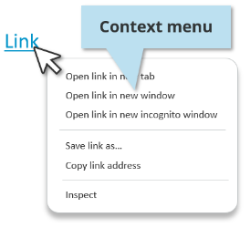

You can enable application users to right-click and view a context menu for the following objects:

* Character fields
* Button field with Button Type set to Tertiary
* Table list column fields

## Before you begin

* You must have created a character field, tertiary button, or a table column in Developer Studio.
* You must set the following properties based on the object you create:

  | Object<br> | Property<br> | Value<br> |
  | --- | --- | --- |
  | Character field or character menu  <br> | **Display Type**<br> | **Edit**<br> |
  | **Display > Show URL**<br> | **True**<br> |
  | **Display > Display as text**<br> | **True**<br> |
  | Button<br> | **Button Type**<br> | **Tertiary**<br> |
  | Table column<br> | **Display Type**<br> | **Read Only**<br> |

  **Important**

  These fields must display a non-null value.

## To add context menus for right-clicking the interface objects in Progressive Web Applications

1. Open Developer Studio.
2. Search the form containing the object in which you want to create the link.
3. Open the form.
4. Select the object.  
   The object can be a character field, a tertiary button field, or a table list column field.
5. In the Properties pane, set**Display > HREF Link**to**True**.
6. Set**HREF**to a URL that you want users to open on the PWA screen.  
   Only static URLs are supported.
7. Set**HREF Target**to one of the following options:

   * **Open in the full body of the window**—The destination page occupies the entire browser window.
   * **Open in a new tab**—Opens the link in a new tab.
   * **Open in the same frame**—Opens the link within the iframe view in which the link appears.
   * **Open in the parent frame**—Opens the link in the parent iframe view.
8. Click**Save**.
9. Open the Mid Tier configuration tool and sync the cache.  
   **http://<*MidtierHostName*>:<*PortNumber*>/arsys/shared/config/config\_cache.jsp**

## To test the configuration

1. In a browser, log in to PWA.  
   (*On-premises*)**http://<*midtierHostName*>:<*portNumber*>/arsys/pwa/#/login**(*SaaS*)**http://<*helixBaseURL*>/arsys/pwa/#/login**
2. Change the URL to include the Progressive View form that you created inDeveloper Studio.
3. (*On-premises*)**http://<*midtierHostName*>:<*portNumber*>/arsys/pwa/#/forms/<AR\_Server\_Name>/<formName>/**

   (*SaaS*)**http://<*helixBaseURL*>/arsys/pwa/#/forms/<AR\_Server\_Name>/<formName>/**
4. Confirm that a context menu appears when you right-click the object.  
   You can also open the context menu by using standard keyboard shortcuts of the browser.

---

## <a id="developing-pwaadding-icons-and-imagesmd"></a>Developing-Pwa/Adding-Icons-And-Images.md

As a developer, you can add icons and images to the progressive web application screens you create by usingDeveloper Studio.

To add custom icons, you must use CSS. To learn more about using CSS, see[Rebranding Progressive Web Application screens](https://docs.bmc.com/xwiki/bin/view/Service-Management/Innovation-Suite/BMC-Helix-Innovation-Suite/is254/Developing-Progressive-Web-Applications/Rebranding-Progressive-Web-Application-screens/).

Use the information in the following topics to create and modify image objects that you want to use in Progressive Web Applications (PWA):

| Action<br> | Reference<br> |
| --- | --- |
| Use an image as the background of a panel field, of the cells in a cell-based table field, or of a form view.<br> | [Adding-background-images-to-fields-and-form-views](https://docs.bmc.com/xwiki/bin/view/Service-Management/Innovation-Suite/BMC-Helix-Innovation-Suite/is254/Developing-Progressive-Web-Applications/Adding-icons-and-images-to-Progressive-Web-Applications/Adding-background-images-to-fields-and-form-views/)<br> |
| Create and manage image objects.<br> | [Creating-and-modifying-image-objects](https://docs.bmc.com/xwiki/bin/view/Service-Management/Innovation-Suite/BMC-Helix-Innovation-Suite/is254/Developing-Progressive-Web-Applications/Adding-icons-and-images-to-Progressive-Web-Applications/Creating-and-modifying-image-objects/)<br> |
| Add icons to a UI element on a form in the Progressive Web Application.<br> | [Adding-icons-to-UI-elements-on-forms-by-using-Developer-Studio](https://docs.bmc.com/xwiki/bin/view/Service-Management/Innovation-Suite/BMC-Helix-Innovation-Suite/is254/Developing-Progressive-Web-Applications/Adding-icons-and-images-to-Progressive-Web-Applications/Adding-BMC-icons-to-UI-elements-on-forms-by-using-Developer-Studio/)<br> |
| Refer to the list of icons that are available inDeveloper Studioso that you can use them in a PWA<br> | [Previews-of-icons-available-in-Developer-Studio-to-support-PWA](https://docs.bmc.com/xwiki/bin/view/Service-Management/Innovation-Suite/BMC-Helix-Innovation-Suite/is254/Developing-Progressive-Web-Applications/Adding-icons-and-images-to-Progressive-Web-Applications/Previews-of-icons-available-in-Developer-Studio-to-support-PWA/)<br> |

Related topics

[Adding-images-to-buttons](https://docs.bmc.com/xwiki/bin/view/Service-Management/Innovation-Suite/BMC-Helix-Innovation-Suite/is254/Developing-applications-by-using-Developer-Studio/Developing-the-application-interface/Creating-and-managing-fields/Button-fields/Adding-images-to-buttons/)

[Adding-images-to-tables](https://docs.bmc.com/xwiki/bin/view/Service-Management/Innovation-Suite/BMC-Helix-Innovation-Suite/is254/Developing-applications-by-using-Developer-Studio/Developing-the-application-interface/Defining-tables-to-display-data/Creating-table-fields/Adding-images-to-tables/)

---

## <a id="developing-pwaadding-icons-and-imagesadding-background-images-to-fields-and-form-viewsmd"></a>Developing-Pwa/Adding-Icons-And-Images/Adding-Background-Images-To-Fields-And-Form-Views.md

When developing an application, you can use an image as the background of a panel field, of the cells in a cell-based table field, or of a form view. You can use a reference to aAR System serverimage object, or you can store the image as an embedded object in the field.

To support the Image Reference functionality for panel and cell-based table fields, Remedy AR System clients and supporting applications such as theMid Tiermust be release 7.5.00 or later. When previous clients open a form containing an image reference, the image is converted to embedded format.

Related topics

[Adding-icons-and-images-to-Progressive-Web-Applications](https://docs.bmc.com/xwiki/bin/view/Service-Management/Innovation-Suite/BMC-Helix-Innovation-Suite/is254/Developing-Progressive-Web-Applications/Adding-icons-and-images-to-Progressive-Web-Applications/)

[Creating-and-modifying-image-objects](https://docs.bmc.com/xwiki/bin/view/Service-Management/Innovation-Suite/BMC-Helix-Innovation-Suite/is254/Developing-Progressive-Web-Applications/Adding-icons-and-images-to-Progressive-Web-Applications/Creating-and-modifying-image-objects/)

[Adding-icons-to-UI-elements-on-forms-by-using-Developer-Studio](https://docs.bmc.com/xwiki/bin/view/Service-Management/Innovation-Suite/BMC-Helix-Innovation-Suite/is254/Developing-Progressive-Web-Applications/Adding-icons-and-images-to-Progressive-Web-Applications/Adding-BMC-icons-to-UI-elements-on-forms-by-using-Developer-Studio/)

[Previews-of-icons-available-in-Developer-Studio-to-support-PWA](https://docs.bmc.com/xwiki/bin/view/Service-Management/Innovation-Suite/BMC-Helix-Innovation-Suite/is254/Developing-Progressive-Web-Applications/Adding-icons-and-images-to-Progressive-Web-Applications/Previews-of-icons-available-in-Developer-Studio-to-support-PWA/)

The following video (3:54) provides a summary of adding static or SVG images inDeveloper Studiofor progressive views:

[🎥 Watch Video: https://www.youtube.com/watch?v=349xdes86qM](https://www.youtube.com/watch?v=349xdes86qM)

<https://www.youtube.com/watch?v=349xdes86qM>

## Using transparent images

Developer StudioandMid Tiersupport**.gif**and**.png**images, which*can*have transparent backgrounds. You can use**.gif**and**.png**images anywhere that images are supported inAR System server, including

* Backgrounds on form views
* Backgrounds on standalone panel fields

PNG images that use*alpha transparency*are supported by Firefox and Safari. PNG and GIF images that use*binary transparency*are supported by allAR System servercompatible browsers.

To create graphics with transparent backgrounds that let the surface on which they are placed show through, use**.gif**and**.png**images with the Display as Flat Image property. For example, use such images to create borderless buttons. The following figure shows a**.gif**coffee cup image with a transparent background on a regular button and on a borderless button.

**A .gif file with transparent background on regular and borderless buttons**


To build toolbars, you can use transparent images on borderless buttons as shown in the following figure.

**Transparent images as toolbar buttons**  


**Tip**

To add decorative graphics to forms, use borderless buttons without workflow.

Most browsers always use a visual aid, such as a dotted outline, to indicate that borderless buttons have focus. Internet Explorer, however, does this only when the form has certain background colors.

## To add an image to a panel field or a cell-based table

1. Select the panel field or the working cell of the cell-based table field.
2. In the**Properties**tab, click the Background Image property, and click its**ellipsis**button.
3. In the Background Image dialog box:
   1. If necessary, click**Clear Image**to delete an existing image.
   2. Browse for the image to display on the button.  
      You can select**.bmp**,**.jpeg**,**.jpg**, .**gif**, and**.png**files. The selected image appears in the Preview area.
   3. To save the image to a different file or folder, click**Save to File**.
   4. Set the Image Type:
      * **Embedded Image**—The image is stored in the field display properties as anARByteList.  
        In this case, the image is embedded in the form and is therefore downloaded with the form whenever the form is refreshed by the client.
      * **Image Reference**—A reference to a shared image object is stored in the field display properties.  
        In this case, the image is stored as an image object inAR System server. When the form is downloaded, the image is cached separately, so the image does not have to be refreshed along with the form. This allows for faster form refresh time.
   5. Click**OK**.
4. To position the graphic horizontally in the panel or cell, select the Background Image Horizontal property, and then select one of the following options:
   * **Left**—Position the left edge of the image at the left edge of the panel or cell.
   * **Center**—Position the horizontal center of the image at the horizontal center of the panel or cell.
   * **Fill**—Resize the image horizontally to fit the width of the panel or cell.
   * **Right**—Position the right edge of the image at the right edge of the panel or cell.
   * **Tile**—If the width of the image is smaller than the width of the panel or cell, tile the image horizontally in the panel or cell. If the width of the image is larger than the width of the panel or cell, Tile has no effect.  
     This property works together with the Background Image Vertical property to control the overall position and dimensions of the image.
5. To position the graphic vertically in the pane or cell, select the Background Image Vertical property, and then select one of the following options:
   * **Top**—Position the top edge of the image at the top edge of the panel or cell.
   * **Center**—Position the vertical center of the image at the vertical center of the panel or cell.
   * **Fill**—Resize the image vertically to fit the height of the panel or cell.
   * **Bottom**—Position the bottom edge of the image at the bottom edge of the panel or cell.
   * **Tile**—If the height of the image is smaller than the height of the panel or cell, tile the image vertically in the panel or cell. If the height of the image is larger than the height of the panel or cell, Tile has no effect.  
     This property works together with the Background Image Horizontal property to control the overall position and dimensions of the image. However, the Background Image Vertical property is not available in progressive views.
6. To add a background image for each device type, namely desktop, mobile, and tablet, click the ellipsis button for the Background Image property under Progressive-Desktop, Progressive-Mobile, and Progressive-Tablet respectively.

---

## <a id="developing-pwaadding-icons-and-imagesadding-icons-to-ui-elements-on-forms-by-using-devemd"></a>Developing-Pwa/Adding-Icons-And-Images/Adding-Icons-To-Ui-Elements-On-Forms-By-Using-Deve.md

Developer Studioprovides some predefined icons that are available Out-Of-The-Box (OOTB) for a Progressive Web Application (PWA). You can add an icon to a UI element on a form inDeveloper Studio. To know what icons are available to support PWA, see[Previews-of-icons-available-in-Developer-Studio-to-support-PWA](https://docs.bmc.com/xwiki/bin/view/Service-Management/Innovation-Suite/BMC-Helix-Innovation-Suite/is254/Developing-Progressive-Web-Applications/Adding-icons-and-images-to-Progressive-Web-Applications/Previews-of-icons-available-in-Developer-Studio-to-support-PWA/).

To add custom icons to the PWA screens, you must update the CSS mentioned in[Rebranding Progressive Web Application screens](https://docs.bmc.com/xwiki/bin/view/Service-Management/Innovation-Suite/BMC-Helix-Innovation-Suite/is254/Developing-Progressive-Web-Applications/Rebranding-Progressive-Web-Application-screens/).

## To add a icon to UI elements on forms by usingDeveloper Studio

1. Copy an icon name from the[list of categorized icons](https://docs.bmc.com/xwiki/bin/view/Service-Management/Innovation-Suite/BMC-Helix-Innovation-Suite/is254/Developing-Progressive-Web-Applications/Adding-icons-and-images-to-Progressive-Web-Applications/Previews-of-icons-available-in-Developer-Studio-to-support-PWA/#PreviewsoficonsavailableinDeveloperStudiotosupportPWA-ListOfIcons).
2. InDeveloper Studio, paste the icon name as the value for a property that supports icons. You must paste the icon name as it is.
3. View the form in PWA to see the icon. To know how to enable a PWA, see[Enabling-Progressive-Views-for-forms-by-using-Centralized-Configuration-Settings](https://docs.bmc.com/xwiki/bin/view/Service-Management/Innovation-Suite/BMC-Helix-Innovation-Suite/is254/Developing-Progressive-Web-Applications/Enabling-Progressive-Views-for-forms-by-using-Centralized-Configuration-Settings/).  
   You can see that the icon is displayed on the form in PWA.

## Example: Adding the d-icon-user\_o icon

1. Copy the d-icon-user\_o icon name from the[list of categorized icons](https://docs.bmc.com/xwiki/bin/view/Service-Management/Innovation-Suite/BMC-Helix-Innovation-Suite/is254/Developing-Progressive-Web-Applications/Adding-icons-and-images-to-Progressive-Web-Applications/Previews-of-icons-available-in-Developer-Studio-to-support-PWA/#PreviewsoficonsavailableinDeveloperStudiotosupportPWA-ListOfIcons).
2. InDeveloper Studio, drag the Character field onto the form.
3. Paste the icon name as the value for the Default Thumbnail Image property.  
   The Default Thumbnail Image property is one of the properties where you can use an icon name.
4. View the form in PWA to see the icon. To know how to enable a PWA, see[Enabling-Progressive-Views-for-forms-by-using-Centralized-Configuration-Settings](https://docs.bmc.com/xwiki/bin/view/Service-Management/Innovation-Suite/BMC-Helix-Innovation-Suite/is254/Developing-Progressive-Web-Applications/Enabling-Progressive-Views-for-forms-by-using-Centralized-Configuration-Settings/).  
   You can see the d-icon-user\_o icon () on the form in PWA. If you use the d-icon-user\_circle icon name, you can see the person icon in a circle.

Related topics

[Adding-icons-and-images-to-Progressive-Web-Applications](https://docs.bmc.com/xwiki/bin/view/Service-Management/Innovation-Suite/BMC-Helix-Innovation-Suite/is254/Developing-Progressive-Web-Applications/Adding-icons-and-images-to-Progressive-Web-Applications/)

[Previews-of-icons-available-in-Developer-Studio-to-support-PWA](https://docs.bmc.com/xwiki/bin/view/Service-Management/Innovation-Suite/BMC-Helix-Innovation-Suite/is254/Developing-Progressive-Web-Applications/Adding-icons-and-images-to-Progressive-Web-Applications/Previews-of-icons-available-in-Developer-Studio-to-support-PWA/)

---

## <a id="developing-pwaadding-icons-and-imagescreating-and-modifying-image-objectsmd"></a>Developing-Pwa/Adding-Icons-And-Images/Creating-And-Modifying-Image-Objects.md

As a developer, you can use images as backgrounds for form views and certain field types, including buttons, panels, and cell-based tables when creating a Progressive Web Application (PWA). An image object is an image stored in theAR System serverdatabase with information defining the image as aAR System serverobject. The image object type appears in the AR System Navigator pane at the end of the All Objects list (see the following figure).

Related topics

[Adding-icons-and-images-to-Progressive-Web-Applications](https://docs.bmc.com/xwiki/bin/view/Service-Management/Innovation-Suite/BMC-Helix-Innovation-Suite/is254/Developing-Progressive-Web-Applications/Adding-icons-and-images-to-Progressive-Web-Applications/)

[Adding-background-images-to-fields-and-form-views](https://docs.bmc.com/xwiki/bin/view/Service-Management/Innovation-Suite/BMC-Helix-Innovation-Suite/is254/Developing-Progressive-Web-Applications/Adding-icons-and-images-to-Progressive-Web-Applications/Adding-background-images-to-fields-and-form-views/)

[Adding-icons-to-UI-elements-on-forms-by-using-Developer-Studio](https://docs.bmc.com/xwiki/bin/view/Service-Management/Innovation-Suite/BMC-Helix-Innovation-Suite/is254/Developing-Progressive-Web-Applications/Adding-icons-and-images-to-Progressive-Web-Applications/Adding-BMC-icons-to-UI-elements-on-forms-by-using-Developer-Studio/)

[Previews-of-icons-available-in-Developer-Studio-to-support-PWA](https://docs.bmc.com/xwiki/bin/view/Service-Management/Innovation-Suite/BMC-Helix-Innovation-Suite/is254/Developing-Progressive-Web-Applications/Adding-icons-and-images-to-Progressive-Web-Applications/Previews-of-icons-available-in-Developer-Studio-to-support-PWA/)


To use the same image in multiple locations, such as the background of related forms, you do not need to store a copy of the image in the display properties of each form view or field that uses the image. Instead, store the image once as an image object, and include it by reference in form view and field display properties. Using an image object, you can also avoid the 4 MB size limit on the field display property.

AR System serversupports the following image types:

* Windows bitmap (**.bmp**file extension)
* Joint Photographic Experts Group format (**.jpeg**or**.jpg**file extensions)
* Graphics Interchange Format (**.gif**file extension)
* Portable Network Graphics format (**.png**file extension)

To convert existing references and image files to shared images, use the**ImageExtractor.bat**utility. See[ImageExtractor-jar-ImageExtractor-bat](https://docs.bmc.com/xwiki/bin/view/Service-Management/Innovation-Suite/AR-System/ars221/Administering/Remedy-configuration-reference/AR-System-external-utilities/ImageExtractor-jar-ImageExtractor-bat/).

## To create an image object

1. In AR System Navigator, expand***serverName*****> All Object**s.
2. Right-click**Images**, and select**New Image**.  
   A blank image object opens in the editing area.
3. In the**Description**field, enter a description of the image.  
   The description appears in the list of images in the Object Selector dialog box when you add an image to a field or form view. Enter up to 255 characters.
4. Click**Browse**, and navigate to the directory containing the image.
5. To display the available images in the directory, select the various image types from the Files of Type list.
6. Select the image to store in AR System, and click**Open**.  
   The image appears in the preview pane of the image object.
7. Save the image object, assigning a unique name in the Save Image As dialog box.  
   Images are indexed on the name you assign and by the image ID. Image names can have up to 255 characters.  
   AlthoughAR System serverpermits backslashes in image object names, you should*not*to include them. To prevent attacks on your system, you should exclude unsafe characters from your web server. By default, most web servers do not allow the backslash character ( \ ) in URLs for security reasons. For example, Tomcat does not allow backslashes in URLs unless you set a parameter to permit them. If your system uses such a web server, images whose object name contains backslashes might not appear in your browser.

## To open an image object

1. In AR System Navigator, expand***serverName*****> All Objects**.
2. Double-click**Images**.
3. From the Images list, double-click the image object to open.

## To save an image to a file outsideAR System server

1. Open the image object, and then click**Save to Disk**.
2. Navigate to the directory where you want to save the file.
3. Enter an appropriate file name, and then click**Save**.

## To rename an image object

1. In AR System Navigator, expand***serverName*****> All Objects**.
2. Double-click**Images**.
3. Right-click the image to be renamed, and then select**Rename**.
4. Enter the new name, and then save the image object.  
   You cannot rename an open object inDeveloper Studio. If a warning indicates the object has an open editor, close the image and repeat these steps.

## To delete an image object

Warning

Deleting a shared image object removes it from*all*form views and fields. You cannot undo this operation inDeveloper Studio.

1. In AR System Navigator, expand***serverName*> All Objects**.
2. Double-click**Images**.
3. Right-click the image to be renamed, and then select**Delete**.
4. Confirm the deletion when prompted.
5. In the second confirmation dialog, specify whether to remove references to the image from the display properties of fields and objects.
   * Click**Yes**to remove the reference from the listed fields or objects.
   * Click**Yes to All**to remove all references to the image.
   * Click**No**to retain the reference in the listed field or object.
   * Click**No to All**to retain all references to the image.  
     If you retain a reference, the image object name stays in the display property, and you can create another image object with the same name to restore the reference.

---

## <a id="developing-pwaadding-icons-and-imagespreviews-of-icons-available-in-developer-studio-tomd"></a>Developing-Pwa/Adding-Icons-And-Images/Previews-Of-Icons-Available-In-Developer-Studio-To.md

As a developer who wants to add icons to your Progressive Web Application (PWA), you need to see a preview of the icons that you want to add. You can sign in to this documentation page and view the PDF listing the icon previews.

Related topics

[Adding-icons-and-images-to-Progressive-Web-Applications](https://docs.bmc.com/xwiki/bin/view/Service-Management/Innovation-Suite/BMC-Helix-Innovation-Suite/is254/Developing-Progressive-Web-Applications/Adding-icons-and-images-to-Progressive-Web-Applications/)

[Adding-icons-to-UI-elements-on-forms-by-using-Developer-Studio](https://docs.bmc.com/xwiki/bin/view/Service-Management/Innovation-Suite/BMC-Helix-Innovation-Suite/is254/Developing-Progressive-Web-Applications/Adding-icons-and-images-to-Progressive-Web-Applications/Adding-BMC-icons-to-UI-elements-on-forms-by-using-Developer-Studio/)

For a Progressive Web Application (PWA), two properties are available in Developer Studio, namely Icon and Icon Position. Use these properties to add and position icons to the UI elements on a form. For example, you can add an icon to a button in Developer Studio.The following table provides more information about the properties:

| Property name<br> | Property type<br> | Default value<br> | Description<br> |
| --- | --- | --- | --- |
| Icon<br> | String<br> | N/A<br> | You can specify the name of an icon as a value for this property.<br> |
| Icon Position<br> | String<br> | Left<br> | You can specify the position of an icon as a value for this property.<br> |

The following fields in Developer Studio support icons:

* Button
* Character
* Thumbnail
* Trim Text
* Vertical Navigation

## PDF with previews of icons

The following PDF (sign in required) lists the predefined icons and the corresponding icon class names that are available Out-Of-The-Box (OOTB) in Developer Studio for PWA.

You must[log in](https://docs.bmc.com/xwiki/bin/login/XWiki/XWikiLogin?xredirect=%2Fxwiki%2Fbin%2Fview%2FService-Management%2FInnovation-Suite%2FBMC-Helix-Innovation-Suite%2Fis254%2FDeveloping-Progressive-Web-Applications%2FAdding-icons-and-images-to-Progressive-Web-Applications%2FPreviews-of-icons-available-in-Developer-Studio-to-support-PWA%2F)or[register](https://www.bmc.com/available/register-now.html?c=n)to view this page

---

## <a id="developing-pwaadding-rich-text-fieldsmd"></a>Developing-Pwa/Adding-Rich-Text-Fields.md

As an application developer, you can add character fields as rich text format (RTF) fields to enable your application users to add formatted text, add images along with text, and so on.

Application users can perform the following tasks by using RTF fields:

* Edit and format text.
* Add content from Microsoft Word, Microsoft Outlook, or HTML pages.
* Add images and links along with text.

**Important**

Rich text fields are displayed as plain text fields in mobile views.

Related topics

[Adding-icons-and-images-to-Progressive-Web-Applications](https://docs.bmc.com/xwiki/bin/view/Service-Management/Innovation-Suite/BMC-Helix-Innovation-Suite/is254/Developing-Progressive-Web-Applications/Adding-icons-and-images-to-Progressive-Web-Applications/)

[Customization-best-practices-for-developing-PWA](https://docs.bmc.com/xwiki/bin/view/Service-Management/Innovation-Suite/BMC-Helix-Innovation-Suite/is254/Developing-Progressive-Web-Applications/Customization-best-practices-for-developing-PWA/)

[Enabling rich text fields on PWA screens by running a utility](https://docs.bmc.com/xwiki/bin/view/Service-Management/IT-Service-Management/BMC-Helix-ITSM/itsm254/Developing/Customizing-BMC-Helix-ITSM/Enabling-rich-text-field-on-Progressive-Web-Application-screens/Enabling-rich-text-fields-on-PWA-screens-by-running-a-utility/)


## To add RTF fields or advanced RTF fields in Progressive Web Applications

1. In Developer Studio, create a progressive view.
2. In Palette, in the Data Fields section, drag**Character**into the view.  
   
3. Select the character field.  
   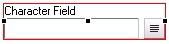
4. On the Properties pane, perform one of the following steps:
   * To create a simple rich text field, in the**Display > Display Type**list, select**Rich Text**.  
     This option creates an RTF field in PWA but does not provide you any additional configuration options.
   * To create an advanced rich text field in the**Display > Display Type**list, select**Advanced Rich Text**.  
     Select**Advanced Rich Text**to create an RTF field along with additional configuration options. For example, you can select the RTF toolbar options that are displayed in the application along with other features described in the following section. In the select**Display > Display as text**list, select**True**to display the rich text in view-only mode.

     **Best practice**  
     If you source text from a rich-text-enabled field in Mid Tier and display it within a field in a PWA screen, you must make sure that the field in PWA also has rich text enabled. In such a scenario, if you do not enable rich text in the field in PWA, the field may display text along with the HTML source.
5. Save the changes.

## To perform additional configurations to advanced RTF fields in Progressive Web Applications

Optionally, you can add additional properties to the advanced RTF (ARTF) fields after you select**Advanced Rich Text**in Developer Studio to do the following:

* Add a toggle that enables application users to switch the RTF field to show plain text.
* Enable application users to use @mention in the RTF fields.
* Show or hide advanced RTF palette options.

1. Enable @mention to the rich text field.  
   1. On the**Properties**panel, under the Display property group, for the Enable Menu Hotkeys property, select the**True**value.
   2. In the**Value**column for the Menu Hotkeys property, click the ellipsis button.  
      The**Menu Hotkeys**dialog box is displayed.  
      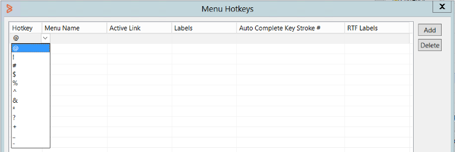
   3. Click**Add**, and then perform the following steps:

      | Property<br> | Step<br> |
      | --- | --- |
      | Hotkey<br> | Click the first row in this column, and then select a character from the list. When application users type this character, the @mention list appears.<br> |
      | Menu Name<br> | Click the first row in this column, and then click the ellipsis buttonto select a menu from the**Menu Selector**dialog box. This is the menu from which information for the @mention list if obtained.<br> |
      | Active Link<br> | Click the first row in this column, and then click the ellipsis buttonto select an active link from the**Active Link Selector**dialog box.<br>The active link that you attach to a hotkey must be an existing one and associated with the current form.<br> |
      | Labels<br> | Leave this column empty. This column is related to only character fields without any RTF enabled.<br> |
      | Auto Complete Key Stroke #<br> | Enter an integer value. This is the number of characters application users have to enter before the @mention list appears.<br> |
      | RTF Labels<br> | Click the first row in this column, and then click the ellipsis buttonto select the fields from which the @mention list obtains data.<br>For example, if you specify a form with all user details in the Menu Name column, you can select the fields representing the following data:<br> * User name * Device ID * User email * Company nameIn such a scenario, the @mention in the PWA screens displays the information as shown: 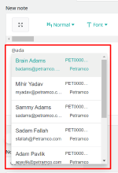<br>The displayed order of the information is the same as the order in which they are in the RTF Label column.<br>**Important**<br> * The @mention list in the PWA screen displays only the first four fields you select in the RTF Labels column. * If you select more than four fields, the @mention performs the search in all those fields even though it displays only the first four fields in the PWA screen. * If you do not specify anything in the RTF Labels column, Developer Studio uses the first four available fields in the order specified in the form and then displays it in the @mention list in the application.**Best practice** Since @mention searches through all the fields you add in the RTF Label column, make sure you add those fields which make search easier to the application users.<br> |
   4. Click**OK**.
2. Show only relevant RTF field options.
   1. On the**Properties**panel, beside the**Display >Additional RTF Toolbar Configuration**property, click the field.
   2. Enter the list of options you want the RTF field to display with the following syntax:  
      **Option1, Option2 | Option3, Option4, Option5**  
      The pipe character (|) specifies that the options after it are in a new group. The syntax is case sensitive.

      <details class="confluence-expand-macro panel panel-default"><summary><span class="panel-title"><span class="title-text">Example syntax for adding RTF toolbar options</span></span></summary><div class="panel-body"><p><span>For example, enter<strong><span class="box"><span class="code">Maximize, Bold, Underline | Image, Link</span></span></strong>to display the Maximize, Bold, and Underline options with the RTF field.<br/><br/>The PWA screen displays the following options on the RTF toolbar:<br/></span></p></div></details><details class="confluence-expand-macro panel panel-default"><summary><span class="panel-title"><span class="title-text">Values for RTF toolbar options</span></span></summary><div class="panel-body"><p><span>You must use the following values for the corresponding RTF toolbar options:</span></p><table class="wrapped"><thead><tr><th scope="col"><div><p>Type</p></div></th><th scope="col"><div><p>RTF toolbar option</p></div></th><th scope="col"><div><p>Description</p></div></th><th scope="col"><div><p>Value</p></div></th></tr></thead><tr><td rowspan="8"><div><div class="content-wrapper"><p>Basic style</p></div></div></td><td><div><div class="content-wrapper"><p></p></div></div></td><td><div><p>Bold text</p></div></td><td><div><p><strong><span class="box"><span class="code">Bold</span></span></strong></p></div></td></tr><tr><td><div><div class="content-wrapper"><p></p></div></div></td><td><div><p>Italicize text</p></div></td><td><div><p><strong><span class="box"><span class="code">Italic</span></span></strong></p></div></td></tr><tr><td><div><div class="content-wrapper"><p></p></div></div></td><td><div><p>Underline text</p></div></td><td><div><p><strong><span class="box"><span class="code">Underline</span></span></strong></p></div></td></tr><tr><td><div><div class="content-wrapper"><p></p></div></div></td><td><div><p>Strikeout text</p></div></td><td><div><p><strong><span class="box"><span class="code">Strike</span></span></strong></p></div></td></tr><tr><td><div><div class="content-wrapper"><p></p></div></div></td><td><div><p>Subscript</p></div></td><td><div><p><strong><span class="box"><span class="code">Subscript</span></span></strong></p></div></td></tr><tr><td><div><div class="content-wrapper"><p></p></div></div></td><td><div><p>Superscript</p></div></td><td><div><p><strong><span class="box"><span class="code">Superscript</span></span></strong></p></div></td></tr><tr><td><div><div class="content-wrapper"><p></p></div></div></td><td><div><p>Remove formatting</p></div></td><td><div><p><strong><span class="box"><span class="code">RemoveFormat</span></span></strong></p></div></td></tr><tr><td><div><div class="content-wrapper"><p></p></div></div></td><td><div><p>Copy formatting</p></div></td><td><div><p><strong><span class="box"><span class="code">CopyFormatting</span></span></strong></p></div></td></tr><tr><td rowspan="3"><div><div class="content-wrapper"><p>Style</p></div></div></td><td><div><div class="content-wrapper"><p></p></div></div></td><td><div><p>Format</p></div></td><td><div><p><strong><span class="box"><span class="code">Format</span></span></strong></p></div></td></tr><tr><td><div><div class="content-wrapper"><p></p></div></div></td><td><div><p>Font</p></div></td><td><div><p><strong><span class="box"><span class="code">Font</span></span></strong></p></div></td></tr><tr><td><div><div class="content-wrapper"><p></p></div></div></td><td><div><p>Font size</p></div></td><td><div><p><strong><span class="box"><span class="code">FontSize</span></span></strong></p></div></td></tr><tr><td rowspan="2"><div><div class="content-wrapper"><p>Color</p></div></div></td><td><div><div class="content-wrapper"><p></p></div></div></td><td><div><p>Text color</p></div></td><td><div><p><strong><span class="box"><span class="code">TextColor</span></span></strong></p></div></td></tr><tr><td><div><div class="content-wrapper"><p></p></div></div></td><td><div><p>Background color</p></div></td><td><div><p><strong><span class="box"><span class="code">BGcolor</span></span></strong></p></div></td></tr><tr><td rowspan="3"><div><div class="content-wrapper"><p>Editing</p></div></div></td><td><div><div class="content-wrapper"><p></p></div></div></td><td><div><p>Find</p></div></td><td><div><p><strong><span class="box"><span class="code">Find</span></span></strong></p></div></td></tr><tr><td><div><div class="content-wrapper"><p></p></div></div></td><td><div><p>Replace</p></div></td><td><div><p><strong><span class="box"><span class="code">Replace</span></span></strong></p></div></td></tr><tr><td><div><div class="content-wrapper"><p></p></div></div></td><td><div><p>Select all</p></div></td><td><div><p><strong><span class="box"><span class="code">SelectAll</span></span></strong></p></div></td></tr><tr><td rowspan="9"><div><p>Paragraph</p></div></td><td><div><div class="content-wrapper"><p></p></div></div></td><td><div><p>Outdent</p></div></td><td><div><p><strong><span class="box"><span class="code">Outdent</span></span></strong></p></div></td></tr><tr><td><div><div class="content-wrapper"><p></p></div></div></td><td><div><p>Indent</p></div></td><td><div><p><strong><span class="box"><span class="code">Indent</span></span></strong></p></div></td></tr><tr><td><div><div class="content-wrapper"><p></p></div></div></td><td><div><p>Justify to the left</p></div></td><td><div><p><strong><span class="box"><span class="code">JustifyLeft</span></span></strong></p></div></td></tr><tr><td><div><div class="content-wrapper"><p></p></div></div></td><td><div><p>Justify to center</p></div></td><td><div><p><strong><span class="box"><span class="code">JustifyCenter</span></span></strong></p></div></td></tr><tr><td><div><div class="content-wrapper"><p></p></div></div></td><td><div><p>Justify to right</p></div></td><td><div><p><strong><span class="box"><span class="code">JustifyRight</span></span></strong></p></div></td></tr><tr><td><div><div class="content-wrapper"><p></p></div></div></td><td><div><p>Justify</p></div></td><td><div><p><strong><span class="box"><span class="code">JustifyBlock</span></span></strong></p></div></td></tr><tr><td><div><div class="content-wrapper"><p></p></div></div></td><td><div><p>Numbered list</p></div></td><td><div><p><strong><span class="box"><span class="code">NumberedList</span></span></strong></p></div></td></tr><tr><td><div><div class="content-wrapper"><p></p></div></div></td><td><div><p>Bulleted list</p></div></td><td><div><p><strong><span class="box"><span class="code">BulletedList</span></span></strong></p></div></td></tr><tr><td><div><div class="content-wrapper"><p></p></div></div></td><td><div><p>Quote</p></div></td><td><div><p><strong><span class="box"><span class="code">Blockquote</span></span></strong></p></div></td></tr><tr><td rowspan="3"><div><p>Link</p></div></td><td><div><div class="content-wrapper"><p></p></div></div></td><td><div><p>Add link</p></div></td><td><div><p><strong><span class="box"><span class="code">Link</span></span></strong></p></div></td></tr><tr><td><div><div class="content-wrapper"><p></p></div></div></td><td><div><p>Remove link</p></div></td><td><div><p><strong><span class="box"><span class="code">Unlink</span></span></strong></p></div></td></tr><tr><td><div><div class="content-wrapper"><p></p></div></div></td><td><div><p>Add anchor</p></div></td><td><div><p><strong><span class="box"><span class="code">Anchor</span></span></strong></p></div></td></tr><tr><td rowspan="5"><div><p>Insert</p></div></td><td><div><div class="content-wrapper"><p></p></div></div></td><td><div><p>Add image</p></div></td><td><div><p><strong><span class="box"><span class="code">Image</span></span></strong></p></div></td></tr><tr><td><div><div class="content-wrapper"><p></p></div></div></td><td><div><p>Add table</p></div></td><td><div><p><strong><span class="box"><span class="code">Table</span></span></strong></p></div></td></tr><tr><td><div><div class="content-wrapper"><p></p></div></div></td><td><div><p>Add horizontal rule</p></div></td><td><div><p><strong><span class="box"><span class="code">HorizontalRule</span></span></strong></p></div></td></tr><tr><td><div><div class="content-wrapper"><p></p></div></div></td><td><div><p>Embed YouTube video</p></div></td><td><div><p><strong><span class="box"><span class="code">Youtube</span></span></strong></p></div></td></tr><tr><td><div><div class="content-wrapper"><p></p></div></div></td><td><div><p>Insert page break</p></div></td><td><div><p><strong><span class="box"><span class="code">PageBreak</span></span></strong></p></div></td></tr><tr><td rowspan="7"><div><p>clipboard</p></div></td><td><div><div class="content-wrapper"><p></p></div></div></td><td><div><p>Cut</p></div></td><td><div><p><strong><span class="box"><span class="code">Cut</span></span></strong></p></div></td></tr><tr><td><div><div class="content-wrapper"><p></p></div></div></td><td><div><p>Copy</p></div></td><td><div><p><strong><span class="box"><span class="code">Copy</span></span></strong></p></div></td></tr><tr><td><div><div class="content-wrapper"><p></p></div></div></td><td><div><p>Paste</p></div></td><td><div><p><strong><span class="box"><span class="code">Paste</span></span></strong></p></div></td></tr><tr><td><div><div class="content-wrapper"><p></p></div></div></td><td><div><p>Paste as plain text</p></div></td><td><div><p><strong><span class="box"><span class="code">PasteText</span></span></strong></p></div></td></tr><tr><td><div><div class="content-wrapper"><p></p></div></div></td><td><div><p>Paste Word content</p></div></td><td><div><p><strong><span class="box"><span class="code">PasteFromWord</span></span></strong></p></div></td></tr><tr><td><div><div class="content-wrapper"><p></p></div></div></td><td><div><p>Undo</p></div></td><td><div><p><strong><span class="box"><span class="code">Undo</span></span></strong></p></div></td></tr><tr><td><div><div class="content-wrapper"><p></p></div></div></td><td><div><p>Redo</p></div></td><td><div><p><strong><span class="box"><span class="code">Redo</span></span></strong></p></div></td></tr><tr><td></td><td><div><div class="content-wrapper"><p></p></div></div></td><td><div><p>Maximize</p></div></td><td><div><p><strong><span class="box"><span class="code">Maximize</span></span></strong></p></div></td></tr><tr><td></td><td><div><div class="content-wrapper"><p></p></div></div></td><td><div><p>View as source</p></div></td><td><div><p><span class="monospace"><strong>Source</strong></span></p></div></td></tr></table></div></details>
3. Save the changes.

## To validate the RTF field or advanced RTF field in PWA

1. In a browser, log in to PWA.  
   **<*serverName*>:8080/arsys/pwa/#/login**
2. Change the URL to include the Progressive View form that you created in Developer Studio.  
   **<*serverName*>:8080/arsys/pwa/#/forms/<*serverName*>/<*formName*>/<*viewName*>**
3. (*Optional*) If you want to display more changes you made in Developer Studio, you must sync the cache in Mid Tier.
   1. Log in to Mid Tier configuration.  
      **<*serverName*>:8080/arsys/shared/config/config.jsp**
   2. Click**Sync Cache**.
   3. Refresh the browser displaying the progressive view form.
4. As an application user, you can perform the following tasks in the RTF editor:
   * Add content that uses standard HTML markup, this RTF editor renders the content without any loss of formatting.
   * Edit the existing rich text content.
   * Copy content from Microsoft Word, Microsoft Outlook, or HTML while retaining most of the supported formatting.
   * You can view the following options in the RTF editor and advanced RTF editor:

     <details class="confluence-expand-macro panel panel-default"><summary><span class="panel-title"><span class="title-text">Options in the RTF editor</span></span></summary><div class="panel-body"><table><thead><tr><th scope="col"><div><p><span>Function</span></p></div></th><th scope="col"><div><p><span>Description</span></p></div></th></tr></thead><tr><td><div><div class="content-wrapper"><p></p></div></div></td><td><div><p><span>Make the selected text bold, italicized, underlined, or</span>strikethrough.</p></div></td></tr><tr><td><div><div class="content-wrapper"><p></p></div></div></td><td><div><p><span>Select the text color and text highlighting background.</span></p></div></td></tr><tr><td><div><div class="content-wrapper"><p></p></div></div></td><td><div><p><span>Set the paragraph so that it aligns evenly on the left or center, or justifies the text.</span></p></div></td></tr><tr><td><div><div class="content-wrapper"><p></p></div></div></td><td><div><p>Create an ordered or unordered list.</p></div></td></tr><tr><td><div><div class="content-wrapper"><p></p></div></div></td><td><div><div class="content-wrapper"><p>Create special formatting to any text so that it is displayed prominently as shown in the following example:<br/><br/></p></div></div></td></tr><tr><td><div><div class="content-wrapper"><p></p></div></div></td><td><div><p>Set paragraph formatting style such as headings.</p></div></td></tr><tr><td><div><div class="content-wrapper"><p></p></div></div></td><td><div><p>Make the selected text subscript or superscript.</p></div></td></tr><tr><td><div><div class="content-wrapper"><p></p></div></div></td><td><div><p>Embed a YouTube video when you provide the embed URL.</p></div></td></tr><tr><td><div><div class="content-wrapper"><p></p></div></div></td><td><div><p>Insert a URL.<br/>The URL must contain the protocol such as<strong>http://</strong>or<strong>https://</strong>.<br/>For example, enter<strong><span class="nolink"><span class="wikiexternallink"><a href="http://www.docs.bmc.com" shape="rect">http://www.docs..com</a></span></span></strong><strong></strong>instead of entering<strong><span class="wikiexternallink"><a href="http://www.docs.bmc.com" shape="rect">www.docs..com</a></span></strong>.</p></div></td></tr><tr><td><div><div class="content-wrapper"><p></p></div></div></td><td><div><p><span>Insert an image into the</span>RTF<span>field.<br/>You can also copy and paste images into the RTF field.</span></p></div></td></tr><tr><td><div><div class="content-wrapper"><p></p></div></div></td><td><div><p><span>The undo button removes the last 30 changes made in the RTF editor or reverses the undo action.</span></p></div></td></tr></table></div></details><details class="confluence-expand-macro panel panel-default"><summary><span class="panel-title"><span class="title-text">Additional options in advanced RTF editor</span></span></summary><div class="panel-body"><table><thead><tr><th scope="col"><div><p><span>Function</span></p></div></th><th scope="col"><div><p><span>Description</span></p></div></th></tr></thead><tr><td><div><div class="content-wrapper"><p></p></div></div></td><td><div><p><span>Set text formatting style such as headings, font, and size.</span></p></div></td></tr><tr><td><div><div class="content-wrapper"><p></p></div></div></td><td><div><p><span>Display the text along with source.</span></p></div></td></tr><tr><td><div><div class="content-wrapper"><p></p></div></div></td><td><div><p><span>Copy formatting and remove text formatting.</span></p></div></td></tr><tr><td><div><div class="content-wrapper"><p></p></div></div></td><td><div><p><span>Search, replace, and select all text.</span></p></div></td></tr><tr><td><div><div class="content-wrapper"><p></p></div></div></td><td><div><p><span>Text indentation.</span></p></div></td></tr><tr><td><div><div class="content-wrapper"><p></p></div></div></td><td><div><p>Remove hyperlink from text and add an anchor.</p></div></td></tr><tr><td><div><div class="content-wrapper"><p></p></div></div></td><td><div><p>Insert tables.</p></div></td></tr><tr><td><div><div class="content-wrapper"><p></p></div></div></td><td><div><p>Insert page breaks for printing.</p></div></td></tr><tr><td><div><div class="content-wrapper"><p></p></div></div></td><td><div><p>Cut, copy to clipboard, paste from clipboard, paste as plain text, and paste from Word</p></div></td></tr><tr><td><div><div class="content-wrapper"><p></p></div></div></td><td><div><p>Maximize the field to occupy the browser screen.</p></div></td></tr></table><div class="box infomessage"><div><div class="box-title">How does advanced RTF handle HTML and domains?</div><ul><li><span>Any content created in earlier releases that has HTML is executed and rendered according to the HTML tags.</span></li><li><span>HTML tags are compared to the</span><span>IS</span>administration email configuration whitelist.</li><li>If the tags are not in the whitelist, they are removed and then displayed by the advanced RTF field.</li></ul></div></div></div></details>

---

## <a id="developing-pwaconfiguring-the-progress-bar-widgetmd"></a>Developing-Pwa/Configuring-The-Progress-Bar-Widget.md

The Progress bar widget is a component that you can configure to show the progress of a particular event or the steps of a particular process. You can also configure it to show the milestones on a timeline. For example, you can use this widget to display the status of your ticket. Mid Tier displays this widget on a form for which a progressive view is enabled. In Developer Studio, you can enable the Progress bar widget by adding a table, and then setting the Display Type of the table to**Progress Bar View**.

A table on a form represents one Progress bar on the UI and the number of rows in that table represent the number of nodes on the Progress bar.

Related topics

[Developing-Progressive-Web-Applications](https://docs.bmc.com/xwiki/bin/view/Service-Management/Innovation-Suite/BMC-Helix-Innovation-Suite/is254/Developing-Progressive-Web-Applications/)

[Defining-tables-to-display-data](https://docs.bmc.com/xwiki/bin/view/Service-Management/Innovation-Suite/BMC-Helix-Innovation-Suite/is254/Developing-applications-by-using-Developer-Studio/Developing-the-application-interface/Defining-tables-to-display-data/)

[Flow-panel-holders-for-Progressive-Web-Applications](https://docs.bmc.com/xwiki/bin/view/Service-Management/Innovation-Suite/BMC-Helix-Innovation-Suite/is254/Developing-Progressive-Web-Applications/Flow-panel-holders-for-Progressive-Web-Applications/)

The following video (3:37) describes how to configure and use the progress bar widget:

[🎥 Watch Video: https://www.youtube.com/watch?v=-T90EgZ\_ZtI](https://www.youtube.com/watch?v=-T90EgZ_ZtI)

<https://youtu.be/-T90EgZ_ZtI>

The following image shows the Progress bar widget:

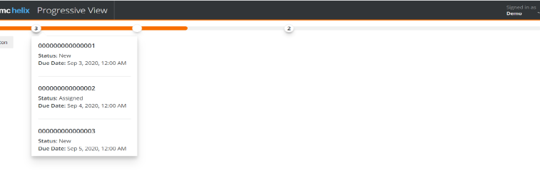

## Before you begin

* To configure a Progress bar widget, you must have a minimum of six columns selected from a table.
* You must define the mappings for all columns.
* You can't define a duplicate mapping.

## To configure the Progress bar widget

1. On the progressive view of a form, double-click a Table field.
2. On the**Properties**panel, under the Display property group, for the Display Type property, select the**Progress Bar View**value.
3. In the**Value**column for the Tree/Table Property property, click the ellipsis button.  
   The**Tree/Table Property**dialog box is displayed.  
     
   
4. Perform the following steps:
   1. In the**Form Name**box, add any form from where you want to fetch the data in the table.
   2. In the**Qualification**box, add a condition as per your requirement.
   3. Add the minimum required six columns for the mappings.  
      You can add any additional columns, if required.
   4. Click**OK**.
5. Click a column in the table.
6. On the**Properties**panel, under the Display property group, in the Progressbar Field property, define the required mappings such as title, status, and instance ID.
7. Double-click the Table field.
8. *(Optional)*On the**Properties**panel, under the Display property group, for the Mapping Identifier property, enter a value.  
   If you don't specify any value, the default colors are displayed on a Progress bar. To learn how to define a color for the Progress bar, see[AR System Progress Bar Widget Mapping form](https://docs.bmc.com/xwiki/bin/view/Service-Management/Innovation-Suite/BMC-Helix-Innovation-Suite/is254/Developing-Progressive-Web-Applications/Configuring-the-Progress-bar-widget-in-Progressive-Web-Applications/#ConfiguringtheProgressbarwidgetinProgressiveWebApplications-PBWidget).
9. *(Optional)*On the**Properties**panel, under the Display property group, for the**Show Date As**property, select any option.  
   You can specify whether the tooltips on the SLA progress bardisplayabsolute dates, relative dates, or both.

## AR System Progress Bar Widget Mapping form

While designing a Progress bar, if you want to define a color for the Progress bar based on certain rules, you can use the AR System Progress Bar Widget Mapping form. The value in the**Mapping Identifier**box on this form must match the value for the Mapping Identifier property in Developer Studio. You can use this form before or after setting the properties for the Progress bar in Developer Studio.

The following table provides information about the fields available on the AR System Progress Bar Widget Mapping form:

| Field name<br> | Field type<br> | Description<br> |
| --- | --- | --- |
| Mapping Identifier<br> | Character<br> | Specifies the value that you must provide for the in a table to attach a mapping.<br> |
| Status Value<br> | Character<br> | Specifies the status value for which you want to set the bar color.<br> |
| Progress Bar Color<br> | Selection:<br>  * Danger * Success * Warning * Info * Inactive | Specifies the color of the bar for the provided status value.<br> |
| Precedence<br> | Integer<br> | Specifies the precedence for the overall status of the bar, in case there are multiple SLTs on the same bar.<br> |
| Node Icon<br> | Selection:<br>  * Check * Cross * None | Specifies the icon for the node on the progress bar.<br> |
| Node Fill Color<br> | Selection:<br>  * Danger * Success * Warning * Info * Inactive * None | Specifies the color for the node on the progress bar.<br> |

---

## <a id="developing-pwaconfiguring-the-results-list-in-progressive-viewmd"></a>Developing-Pwa/Configuring-The-Results-List-In-Progressive-View.md

**Related topics**

[Enabling Progressive Views for forms by using Centralized Configuration Settings](https://docs.bmc.com/xwiki/bin/view/Service-Management/Innovation-Suite/BMC-Helix-Innovation-Suite/is254/Developing-Progressive-Web-Applications/Enabling-Progressive-Views-for-forms-by-using-Centralized-Configuration-Settings/)

[Updating-configuration-settings-by-using-the-AR-System-Configuration-Generic-UI-form](https://docs.bmc.com/xwiki/bin/view/Service-Management/Innovation-Suite/BMC-Helix-Innovation-Suite/is254/Administering/BMC-Helix-Innovation-Suite-configuration-references/Centralized-configuration/Updating-configuration-settings-by-using-the-AR-System-Configuration-Generic-UI-form/).

As an administrator, configure the Results List in Developer Studio to provide users with a modern interface for managing records. Use the Results List in Progressive View to perform actions such as creating, searching, or updating records directly within a form in IS.

## Task 1: To enable the CCS parameter in Mid Tier

1. In a browser, open the AR System Administration Console, and select**System > General > Centralized Configuration**.
2. In the AR System Configuration Generic UI form, from the**Component Name**list, select**arsystem..arsys.midtier-DockerMTClusterUser**component to add a CCS parameter.
3. Click**Add**.
4. Enter**pv.showResultList**name of the setting and set its value to**t**(True). For more information, see[Configuration settings N-R](https://docs.bmc.com/xwiki/bin/view/Service-Management/Innovation-Suite/BMC-Helix-Innovation-Suite/is254/Administering/BMC-Helix-Innovation-Suite-configuration-references/Centralized-configuration/Configuration-settings/Configuration-settings-N-R/).

* The following image shows the**pv.showResultList**property set to**true:**
* 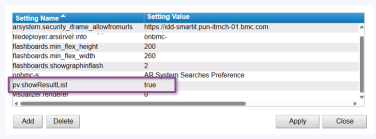

5. Click**Apply**and**Close**.
6. Flush the cache from the Mid Tier. For more information, see[Configuring cache settings for the Mid Tier](https://docs.bmc.com/xwiki/wiki/internal/get/Service-Management/Innovation-Suite/innovationsuitemaster/Administering/BMC-Helix-Innovation-Suite-configuration-references/Centralized-configuration/Configuration-settings/Configuration-settings-N-R/25-4?sheet=CKEditor.ResourceDispatcher&outputSyntax=plain&language=&type=doc&reference=Service-Management.Innovation-Suite.innovationsuitemaster.Administering.Monitoring-the-system-and-performance.Configuring-cache-settings-for-the-Mid-Tier.WebHome&typed=true).

### Task 2: To enable the Results List in Developer Studio

1. Open a form in Developer Studio.
2. Select the form for which you want to enable the Results List and navigate to the**Properties**tab.
3. On the**Properties**tab, under the**Appearance**section, set the**Show Result List**property to**True**. For more information, see[Setting form view properties](https://docs.bmc.com/xwiki/bin/view/Service-Management/Innovation-Suite/BMC-Helix-Innovation-Suite/is254/Developing-applications-by-using-Developer-Studio/Developing-the-application-interface/Customizing-the-interface-for-multiple-consumers/Defining-and-managing-form-views/Setting-form-view-properties/).

* The following image shows the**Show Result List**property:
* 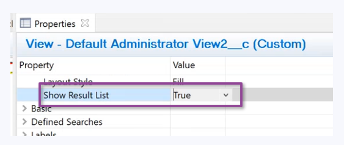

Important

The Results List is view-specific. If a form has multiple views, enable the property for each view where you want the Results List to appear.

### Task 3: To configure the Results List in Developer Studio

1. On the**Properties**tab, under the**Menu Access**section, click**Accessible Menu Items**to select the actions to be visible in the Results List. For more information, see[Setting form view properties](https://docs.bmc.com/xwiki/bin/view/Service-Management/Innovation-Suite/BMC-Helix-Innovation-Suite/is254/Developing-applications-by-using-Developer-Studio/Developing-the-application-interface/Customizing-the-interface-for-multiple-consumers/Defining-and-managing-form-views/Setting-form-view-properties/).

* The following image shows the**Accessible Menu Items**box:
* 

2. On the**Properties**tab, under the**Result List**section, set the**Size of Chunk**value. For more information, see[Setting form view properties](https://docs.bmc.com/xwiki/bin/view/Service-Management/Innovation-Suite/BMC-Helix-Innovation-Suite/is254/Developing-applications-by-using-Developer-Studio/Developing-the-application-interface/Customizing-the-interface-for-multiple-consumers/Defining-and-managing-form-views/Setting-form-view-properties/).

* The following image shows the**Size of Chunk**property with its value set to zero:
* 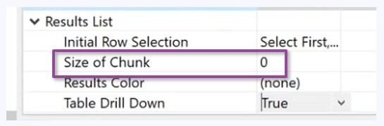

3. To use the Results List in Progressive View, open the form where you’ve enabled it in a browser.  
   The following image shows the Results List interface in the form opened in PWA screen:  
   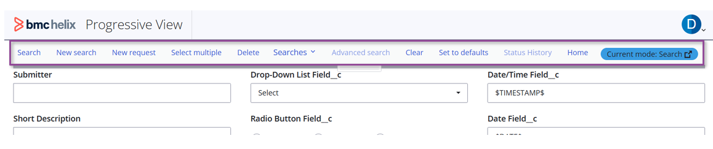

Although many of the menu options available in applications built by using Developer Studio are supported in Progressive View for creating Progressive Web Applications, some features, such as Reporting, are not available in Progressive Web Application screens. To see a comparative list of Results List menu items available in Mid Tier and Progressive View, see[Differences between Developer Studio features available for Mid Tier and Progressive Web Applications](https://docs.bmc.com/xwiki/bin/view/Service-Management/Innovation-Suite/BMC-Helix-Innovation-Suite/is254/Getting-started/Differences-between-Developer-Studio-features-available-for-Mid-Tier-and-Progressive-Web-Applications/).

---

## <a id="developing-pwacreating-a-popup-windowmd"></a>Developing-Pwa/Creating-A-Popup-Window.md

In a Progressive View, an open popup window looks like an action blade. The popup window does not open in a new window or on a new tab. Instead, it appears as a child window as an action blade by using a docked panel component. The popup window closes automatically when you close the parent window. You cannot move a popup window outside the parent window.

To specify the width of a docked panel:

The blade width is derived from the Width property of the view that you are using in the Open Window action. The following is the behavior:

* (View Width <= 250 AND View Width > 0) = Small = 25% of the whole page
* (View Width > 250 AND View Width <= 500) = Medium = 50% of the whole page
* (View Width > 500 AND View Width <= 750) = Large = 75% of the whole page
* (View Width > 750) = Extra large = 100% of the whole page

The following image shows an open popup window in a desktop view:

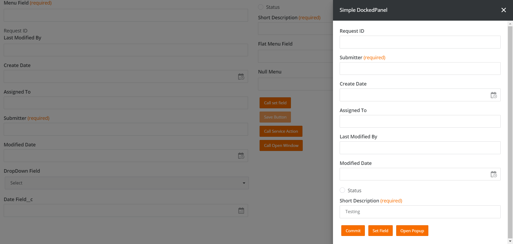

The following image shows two open popup windows in a desktop view:

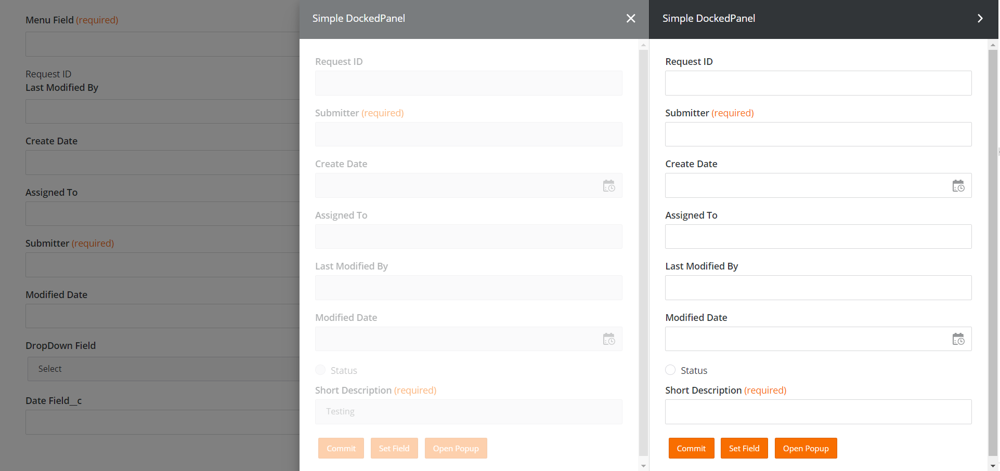

The following image shows a mobile view, where the action blade occupies full-screen height and width, which is the default behavior of the docked panel component:

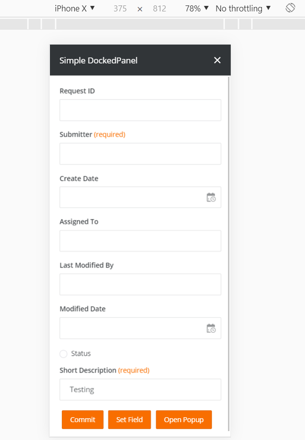

Related topics

[Developing-Progressive-Web-Applications](https://docs.bmc.com/xwiki/bin/view/Service-Management/Innovation-Suite/BMC-Helix-Innovation-Suite/is254/Developing-Progressive-Web-Applications/)

[UI-layout-of-Progressive-Web-Applications](https://docs.bmc.com/xwiki/bin/view/Service-Management/Innovation-Suite/BMC-Helix-Innovation-Suite/is254/Developing-Progressive-Web-Applications/UI-layout-of-Progressive-Web-Applications/)

---

## <a id="developing-pwacreating-a-progressive-view-in-developer-studiomd"></a>Developing-Pwa/Creating-A-Progressive-View-In-Developer-Studio.md

In Developer Studio, create a Progressive Web Application (PWA) by creating the components of the application interface such as fields, forms, and workflows in a Progressive View.

## Before you begin

You must enable Progressive View for forms by using the Centralized Configuration. To know more, see[Enabling Progressive Views for forms from the Centralized Configuration](https://docs.bmc.com/xwiki/bin/view/Service-Management/Innovation-Suite/BMC-Helix-Innovation-Suite/is254/Developing-Progressive-Web-Applications/Enabling-Progressive-Views-for-forms-by-using-Centralized-Configuration-Settings/).

## To create a Progressive View in Developer Studio to create Progressive Web Applications

1. In Developer Studio, create a New Regular Form.
2. Create a Progressive View.

   <details class="confluence-expand-macro panel panel-default"><summary><span class="panel-title"><span class="title-text">Steps (2)</span></span></summary><div class="panel-body"><ol><li>Select<strong>Form &gt; Create New View</strong>.<br/>The Create New View dialog box opens.</li><li>In the<strong>View Type</strong>list, select<strong>Progressive</strong>.<br/><br/><br/></li></ol></div></details>

The Progressive View appears with panel holders having the following colors and the tooltip at the view tab is suffixed with "Progressive".  
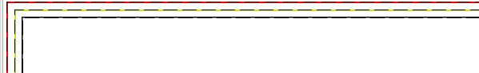

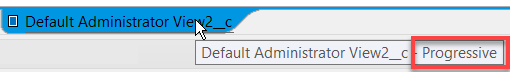

## Where to go from here

[UI-layout-of-Progressive-Web-Applications](https://docs.bmc.com/xwiki/bin/view/Service-Management/Innovation-Suite/BMC-Helix-Innovation-Suite/is254/Developing-Progressive-Web-Applications/UI-layout-of-Progressive-Web-Applications/)

[Flow-panel-holders-for-Progressive-Web-Applications](https://docs.bmc.com/xwiki/bin/view/Service-Management/Innovation-Suite/BMC-Helix-Innovation-Suite/is254/Developing-Progressive-Web-Applications/Flow-panel-holders-for-Progressive-Web-Applications/)

Related topics

[Enabling Progressive Views for forms from the Centralized Configuration](https://docs.bmc.com/xwiki/bin/view/Service-Management/Innovation-Suite/BMC-Helix-Innovation-Suite/is254/Developing-Progressive-Web-Applications/Enabling-Progressive-Views-for-forms-by-using-Centralized-Configuration-Settings/)

[Developing-Progressive-Web-Applications](https://docs.bmc.com/xwiki/bin/view/Service-Management/Innovation-Suite/BMC-Helix-Innovation-Suite/is254/Developing-Progressive-Web-Applications/)

[Accessing-and-navigating-Developer-Studio](https://docs.bmc.com/xwiki/bin/view/Service-Management/Innovation-Suite/AR-System/ars221/Developing-applications/Accessing-and-navigating-Developer-Studio/)

[Developing-applications](https://docs.bmc.com/xwiki/bin/view/Service-Management/Innovation-Suite/AR-System/ars221/Developing-applications/)

---

## <a id="developing-pwacreating-an-advanced-filtermd"></a>Developing-Pwa/Creating-An-Advanced-Filter.md

The Advanced filter component enables you to apply advanced filtering options to the fields on a form for which a Progressive view is enabled. You can configure this component on the Table field inDeveloper Studio. After you configure this component, you can view it in a Progressive view. The Advanced filter component is a UI element. It is not related to the Filter, which is a workflow component in AR System.

The following image shows an Advanced filter in a progressive view:

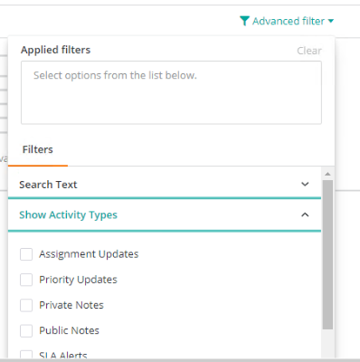

Related topics

[Defining-tables-to-display-data](https://docs.bmc.com/xwiki/bin/view/Service-Management/Innovation-Suite/BMC-Helix-Innovation-Suite/is254/Developing-applications-by-using-Developer-Studio/Developing-the-application-interface/Defining-tables-to-display-data/)

[Creating-a-faceted-filter](https://docs.bmc.com/xwiki/bin/view/Service-Management/Innovation-Suite/BMC-Helix-Innovation-Suite/is254/Developing-applications-by-using-Developer-Studio/Developing-the-application-interface/Defining-tables-to-display-data/Creating-a-faceted-filter/)

The following table lists the characteristics of the Advanced filter:

| Characteristic<br> | Example<br> |
| --- | --- |
| Dependent filter values<br> | Depending on the value that you select in one filter, the values in another filter are populated.<br> |
| Filter options within a filter<br> | The Asset Console features options, such as People, Support Group, and Organization.<br> |
| Filter within filter<br> | The Operating System section in the Asset Console features filters within a filter.<br> |
| Specifying a custom display by overriding type<br> | The CPU Count section in the Asset Console lets you specify a custom display by overriding type.<br> |
| Specifying the display position of a filter<br> | The Change Calendar filter in Change Request section lets you specify its display position.<br> |
| Default options based on the logged in user<br> | The To be approved by (Me, My Support Groups) and Schedule dates (24H, 48H) filters in the Ticket Console section feature the default options based on the logged in user.<br> |
| Associating a menu to a filter<br> | The filters in the Ticket Console section associate a menu with them.<br> |

To support the Advanced filtering component for progressive views, the following properties are added inDeveloper Studio:

| Property name<br> | Applicable for field<br> | Property value<br> | Description<br> |
| --- | --- | --- | --- |
| Filter<br> | * Table - List View * Table - Cell Based | * True * False (Default) | Specifies if the Advanced filter is to be enabled at table-level.<br> |
| Filter External ID<br> | * Table - List View * Table - Cell Based | A field ID<br> | Specifies the external ID of the Advanced filter.<br> |
| Filter<br> | Column<br> | * True * False (Default) | Specifies if the Advanced filter is to be enabled at column-level.<br> |
| Display As Select<br> | Column<br> | * True * False (Default) | Specifies if the options in the Advanced filter are to be displayed as check boxes that you can select.<br> |
| Use Value As Qualification<br> | Column<br> | * True * False (Default) | Specifies if the value of a menu that contains a qualification is to be used as is when you apply the Advanced filter.<br> |
| Filter QBE Match<br> | Column<br> | * Anywhere * Equals * Leading (Default) | Specifies the Query By Example (QBE) match for the Advanced filter.<br>  * Leading—The leading characters in the query string are matched. * Equals—The characters in the query string are precisely matched. * Anywhere—The characters in the query string are matched irrespective of their location. |
| Filter Display Order<br> | Column<br> | An Integer<br> | Specifies the order for a menu item in the Advanced filter.<br> |
| Menu Name<br> | Column<br> | You must associate a menu of type search to this property.<br> | Specifies a search menu for the filter. You have to set the type Search for the menu. You can use this only when the Filter property value is set to**True**and is mapped to a character field.<br>This property takes precedence over the Menu Name property under Attributes of the character field.<br>The following video clip shows how you can associate a Menu Name property with a predefined search menu. In this example, we associate Menu Name with Menu:Features so that end users in the custom application see searchable options from Menu:Features.<br>Another example where you can use this property is for usernames that you want displayed when users type in a search field.<br> |
| Button Field<br> | Button<br> | You must associate a field of type filter to the Button Field property<br> | Displays a filter in place of a button. Use this property to provide a button ID to display the filter in place of a button. This property is available in the Filter section.<br>The following video clip shows how you can display a filter in the place of a button. The initial steps inDeveloper Studioinvolve associating a predefined filter with the button:  <br> |
| Groups<br> | Table<br> | You must associate a group.<br> | Creates a group of filters within one section.  Click the property to launch a dialogue where you can define a group. This property is available only when you set the Filter Type to Advanced.<br>Only the following filters types are allowed to be part of groups:<br>  * Character This can be with or without a menu. * Integer * Selection This filter type is always rendered as checkboxes.  The following video clip shows how you can add a filter to a filter group:<br> |
| Show Apply Button<br> | * Table - List View * Table - Cell Based | * False (Default) * True | Specifies if the**Apply filters**button is to be shown on the filter. In addition, it also displays the**Cancel**and**Remove all**, buttons. This property is available in the Filter section only when you set the Filter Type to Advanced.<br>The following video clip shows how you can add the**Apply filters**, Cancel, and the**Remove all**buttons.<br> |
| Filter Visibility<br> | Table Column<br> | * False (Default) * True | Set this property to**True**to display a filter.  This property is available in the Filter section. You can add this property if the column Filter property value is set to**True**<br> |
| Generate Qualification<br> | Table Column<br> | * False (Default) * True | Generates a filter qualification when end users select options. To set this property, the Filter property must be set to**True**and Table Type must set to Advanced.<br>Use the following command in an active link along with the Generate Qualification property to fetch the generated qualification:<br> |

## To configure the Advanced filter component

You must set the values for the properties that are available for the Table field and the Column field.

### To set the values for the properties for the Table field

1. On the progressive view of a form, double-click a Table field.
2. On the**Properties**panel, under the Attributes group, for the Filter property, select the**True**value.
3. Beside the Qualification Field property, in the Value column, click the ellipsisbutton.  
   The Qualification Field dialog box opens.
4. Select a field from the available fields, and then click**OK**.  
   The values for the properties for the Table field are set.
5. Under Attributes, beside Tree/Table Property, in the Value column, click the ellipsisbutton and add the following additive qualification:  
   **EXTERNAL($*qualificationField*$)**
6. Save the changes.

### To set the values for the properties for the Column field

1. In the**Value**column for the Tree/Table Property property, click the ellipsis button.
2. On the**Tree/Table Property**dialog box, add a field as a table column, and then click**OK**.
3. Double-click the column field on the table, and then for the Filter property, select the**True**value.
4. Drag a Character field to the form, and then double-click it to view the**Properties**panel.
5. In the**Value**column for the Menu Name property, click the ellipsis button.
6. On the**Menu Name**dialog box, select a menu of type Search from the available menus, and then click**OK**.
7. Double-click the Table field, in the**Value**column for the Tree/Table Property property, click the ellipsis button.
8. On the Tree/Table Property dialog box, add the Character field with a menu that you've added in step 6 as a table column, and then click**OK**.
9. Double-click the column that you've added in step 8, and then for the Filter property, select the**True**value.
10. Select a value for the following properties as required:
    1. Display As Select
    2. Use Value As Qualification
    3. Filter QBE Match
    4. Filter Display Order
11. Click**Save**to save your settings.

**Tip**

To display the filter labels in alphabetical order on the PWA screen, you must select**Sort On Label**in the menu as shown in the following example:


---

## <a id="developing-pwacreating-dynamic-selection-lists-using-json-datamd"></a>Developing-Pwa/Creating-Dynamic-Selection-Lists-Using-Json-Data.md

Fetch JSON data and pass it to a character menu inDeveloper Studioto create a list or to populate a field in Progressive Web Applications. Use this method of creating dynamic selection lists in situations where the content to be displayed varies according to various user actions and settings. You can fetch JSON data by using webhooks, REST filters, or active links.

The following example procedure demonstrates:

* How to use the**JSON Menu Label**,**JSON Menu Value**, and**JSON Field ID**properties in a character field to extract values from JSON data and display the data as a list.
* How to create an active link that uses the JSONMAP function to extract a specific value from JSON data and display it in a character field.

This example shows how the**JSON Menu Label**,**JSON Menu Value**, and**JSON Field ID**properties, and the JSONMAP function work. However, note that real-world implementations can vary considerably depending on your business needs.

The following video (4:06) explains the concept and also demonstrates how the JSON properties and the JSONMAP function works:

[🎥 Watch Video: https://www.youtube.com/watch?v=3eRIML5mOgI](https://www.youtube.com/watch?v=3eRIML5mOgI)

<https://youtu.be/3eRIML5mOgI>

## Before you begin

* You must have a basic understanding of progressive web applications and their development. For more information, see[Developing-Progressive-Web-Applications](https://docs.bmc.com/xwiki/bin/view/Service-Management/Innovation-Suite/BMC-Helix-Innovation-Suite/is254/Developing-Progressive-Web-Applications/).
* You must know how to fetch JSON data by using workflows that have webhooks, REST filters, or active links.
* You can download the[JSONMAP\_example\_fields.def](https://docs.bmc.com/xwiki/bin/download/Service-Management/Innovation-Suite/BMC-Helix-Innovation-Suite/is254/Developing-Progressive-Web-Applications/Creating-dynamic-selection-lists-for-Progressive-Web-Applications-by-using-JSON-data/WebHome/JSONMAP_example_fields.def?rev=1.1)file and import it intoDeveloper Studioto create the fields and settings described in the following procedure.

## To create a dynamic selection list for progressive web applications by using JSON data

1. InDeveloper Studio, create a New Regular Form.
2. Create a Progressive View.

   <details class="confluence-expand-macro panel panel-default"><summary><span class="panel-title"><span class="title-text">Steps (2)</span></span></summary><div class="panel-body"><ol><li>Select<strong>Form &gt; Create New View</strong>.<br/>The Create New View dialog box opens.</li><li>In the<strong>View Type</strong>list, select<strong>Progressive</strong>.<br/></li></ol></div></details>
3. Drag four character fields into the view.  
   In this example, name the fields**JSON**,**Json Exp**,**Output**, and**Character Field**.  
   
4. In the Properties pane, change the**Display Type**property of the character fields to**Drop-Down List**.
5. Select the**JSON**field, and in the**Properties**tab, change the**Database > Input Length**to**0**.  
   Setting**Input Length**at a value of**0**enables the field to store content of any length.  
   In real-world scenarios, the**JSON**field receives the JSON data automatically by means of a workflow or a webhook that you have already defined. Also, the field may be hidden from the Progressive View because it simply holds the JSON data. In this example, we manually paste JSON data into the**JSON**field in Progressive View.
6. Select**Character Field**from the view and in the**Properties**tab, add the following values under**Attributes**:

   | Property<br> | Value<br> |
   | --- | --- |
   | **JSON Menu Label**<br> | **#colors[\*].color#+#colors[\*].category**<br> |
   | **JSON Menu Value**<br> | **colors[\*].id**<br> |
   | **JSON Field ID**<br> | The field ID of the**JSON**field<br> |

   The**Character Field**displays menu labels of the format color and category.
7. In the**Menu Style**list, select**Append**.  
   This option displays the**Character Field**in Progressive View as a list where you can select multiple options.
8. Define a button that runs the active links that you defined for the**Output**field.  
   
9. Select the**Extract Value**button field in the view and add an active link with the following settings:

   | Setting<br> | Value, selection, or function<br> |
   | --- | --- |
   | **If Actions**<br> | **Set Fields**<br> |
   | **Data Source**<br> | **CURRENT SCREEN**<br> |
   | **Field**<br> | **Output**<br> |
   | **Value**<br> | JSONMAP($JSON$, $Json Exp$) |

   This field uses the JSONMAP function, which picks up the data from the**JSON**field and the expression that you enter in the**Json Exp**field, and displays it in the**Output**field.
10. Select the**Character Field**from the view and define an active link with the following settings:

    | Setting<br> | Value, selection, or function<br> |
    | --- | --- |
    | **Execution Options > Field**<br> | **Character Field**<br> |
    | **Menu Choice**<br> | **Selected**<br> |
    | **If Actions**<br> | **Set Fields**<br> |
    | **Data Source**<br> | **CURRENT SCREEN**<br> |
    | **Field**<br> | **Output**<br> |
    | **Value**<br> | **JSONMAP($JSON$, $Json Exp$)**<br> |

    This active link runs when you select any item in the**Character Field**list in Progressive View, and displays the output of the JSONMAP function in the**Output**field.
11. Save the changes.

## Validating the selection list in Progressive View

1. In a browser, log in to PWA.  
   **<*serverName*>:8080/arsys/pwa/#/login**
2. Change the URL to include the Progressive View form that you created inDeveloper Studio.**<*serverName*>:8080/arsys/pwa/#/forms/<*serverName*>/<*formName*>/<*viewName*>**
3. Paste the following example JSON to the**JSON**field.

   <details class="confluence-expand-macro panel panel-default"><summary><span class="panel-title"><span class="title-text">Example JSON</span></span></summary><div class="panel-body"><div class="box"><div class="code"><span>"colors"</span>: [<br/><span>{</span><br/><span>"id"</span>:<span>1</span>,<br/><span>"color"</span>:<span>"black"</span>,<br/><span>"category"</span>:<span>"hue"</span>,<br/><span>"type"</span>:<span>"primary"</span>,<br/><span>"code"</span>:<span>{</span><br/><span>"rgba"</span>: [<span>255</span>,<span>255</span>,<span>255</span>,<span>1</span>],<br/><span>"hex"</span>:<span>"#000"</span><br/><span>}</span><br/><span>}</span>,<br/><span>{</span><br/><span>"id"</span>:<span>2</span>,<br/><span>"color"</span>:<span>"white"</span>,<br/><span>"category"</span>:<span>"value"</span>,<br/><span>"code"</span>:<span>{</span><br/><span>"rgba"</span>: [<span>0</span>,<span>0</span>,<span>0</span>,<span>1</span>],<br/><span>"hex"</span>:<span>"#FFF"</span><br/><span>}</span><br/><span>}</span>,<br/><span>{</span><br/><span>"id"</span>:<span>3</span>,<br/><span>"color"</span>:<span>"red"</span>,<br/><span>"category"</span>:<span>"hue"</span>,<br/><span>"type"</span>:<span>"primary"</span>,<br/><span>"code"</span>:<span>{</span><br/><span>"rgba"</span>: [<span>255</span>,<span>0</span>,<span>0</span>,<span>1</span>],<br/><span>"hex"</span>:<span>"#FF0"</span><br/><span>}</span><br/><span>}</span>,<br/><span>{</span><br/><span>"id"</span>:<span>4</span>,<br/><span>"color"</span>:<span>"blue"</span>,<br/><span>"category"</span>:<span>"hue"</span>,<br/><span>"type"</span>:<span>"primary"</span>,<br/><span>"code"</span>:<span>{</span><br/><span>"rgba"</span>: [<span>0</span>,<span>0</span>,<span>255</span>,<span>1</span>],<br/><span>"hex"</span>:<span>"#00F"</span><br/><span>}</span><br/><span>}</span>,<br/><span>{</span><br/><span>"id"</span>:<span>5</span>,<br/><span>"color"</span>:<span>"yellow"</span>,<br/><span>"category"</span>:<span>"hue"</span>,<br/><span>"type"</span>:<span>"primary"</span>,<br/><span>"code"</span>:<span>{</span><br/><span>"rgba"</span>: [<span>255</span>,<span>255</span>,<span>0</span>,<span>1</span>],<br/><span>"hex"</span>:<span>"#FF0"</span><br/><span>}</span><br/><span>}</span>,<br/><span>{</span><br/><span>"id"</span>:<span>6</span>,<br/><span>"color"</span>:<span>"green"</span>,<br/><span>"category"</span>:<span>"hue"</span>,<br/><span>"type"</span>:<span>"secondary"</span>,<br/><span>"code"</span>:<span>{</span><br/><span>"rgba"</span>: [<span>0</span>,<span>255</span>,<span>0</span>,<span>1</span>],<br/><span>"hex"</span>:<span>"#0F0"</span><br/><span>}</span><br/><span>}</span><br/>]<br/><span>}</span></div></div></div></details>

   As soon as you paste the example JSON, the**Character Field**displays the list of colors and the categories.  
   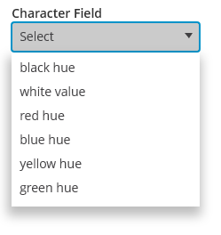
4. To the**Json Exp**field, add the following expression:  
   colors[id=1].color
5. Click**Extract Value**.  
   The active link uses the expression in the**Json Exp**field and displays**black**in the**Output**field. The value**black**is associated withid=1in the example JSON data.  
   
6. (*Optional*) If you want to validate additional changes you made inDeveloper Studio, you must sync the cache in Mid Tier.
   1. Log in toDeveloper Studioconfiguration.  
      **<*serverName*>:8080/arsys/shared/config/config.jsp**
   2. Click**Sync Cache**.
   3. Refresh the browser to display the updated Progressive View form.

## Results

The**JSON Menu Label**,**JSON Menu Value**, and**JSON Field ID**properties in a character field extract the required data from the JSON data and display that information in a list. The JSONMAP function extracts specific values that you want from the JSON data and displays it in the associated field when you run the active link.

Related topics

[Creating-fields-that-auto-complete-in-Progressive-Web-Applications](https://docs.bmc.com/xwiki/bin/view/Service-Management/Innovation-Suite/BMC-Helix-Innovation-Suite/is254/Developing-Progressive-Web-Applications/Creating-fields-that-auto-complete-in-Progressive-Web-Applications/)

[Creating-selection-lists-in-Progressive-Web-Applications](https://docs.bmc.com/xwiki/bin/view/Service-Management/Innovation-Suite/BMC-Helix-Innovation-Suite/is254/Developing-Progressive-Web-Applications/Creating-selection-lists-in-Progressive-Web-Applications/)

[Creating-list-tables-and-setting-selection-mode-by-using-run-processes-in-Progressive-Web-Applications](https://docs.bmc.com/xwiki/bin/view/Service-Management/Innovation-Suite/BMC-Helix-Innovation-Suite/is254/Developing-Progressive-Web-Applications/Creating-list-tables-and-setting-selection-mode-by-using-run-processes-in-Progressive-Web-Applications/)[JSON examples that you can use](https://www.sitepoint.com/colors-json-example/)[Online JSON validator](https://jsonlint.com/?code=)

---

## <a id="developing-pwacreating-fields-that-auto-completemd"></a>Developing-Pwa/Creating-Fields-That-Auto-Complete.md

For forms viewed in a browser, you can turn on an "automatic complete" feature for character fields that have a menu attached to them. When this feature is configured for a field and a user begins typing text into the field, a list of values that match the text appears. When multiple values are presented, the user can change the selection with the up and down arrow keys or using the mouse. To select a highlighted option, the user presses Enter or click it with a mouse.

Related topics

[Adding-mention-for-fields-in-Progressive-Web-Applications](https://docs.bmc.com/xwiki/bin/view/Service-Management/Innovation-Suite/BMC-Helix-Innovation-Suite/is254/Developing-Progressive-Web-Applications/Adding-mention-for-fields-in-Progressive-Web-Applications/)

[Creating-dynamic-selection-lists-for-Progressive-Web-Applications-by-using-JSON-data](https://docs.bmc.com/xwiki/bin/view/Service-Management/Innovation-Suite/BMC-Helix-Innovation-Suite/is254/Developing-Progressive-Web-Applications/Creating-dynamic-selection-lists-for-Progressive-Web-Applications-by-using-JSON-data/)

[Creating-selection-lists-in-Progressive-Web-Applications](https://docs.bmc.com/xwiki/bin/view/Service-Management/Innovation-Suite/BMC-Helix-Innovation-Suite/is254/Developing-Progressive-Web-Applications/Creating-selection-lists-in-Progressive-Web-Applications/)

**Standard view**


**Progressive view**


By default, the suggestion list is case-insensitive, and it displays the*value*of the option, not the label. (You can change the configuration so that the menu's*labels*are displayed instead of its values.)

The results in the suggestion list can differ among databases. For example, for an Oracle database, the results are case sensitive by default. For other databases, the results are case insensitive.

The Menu/Row/Level Choice workflow condition runs when auto complete is used to fill in the value.Remember these tips when configuring workflow with character fields that have the automatic complete feature turned on:

* If workflow manipulates*values*of menu selections, you might want to configure auto-complete to show labels rather than values so that the workflow runs properly.
* The Return/Table or Level Dbl-Clk workflow condition does not run when the user presses Enter as part of the Auto Complete feature (that is, when the selection list is displayed). At other times, the workflow condition runs normally.

For more information, see[Defining-workflow-to-automate-processes](https://docs.bmc.com/xwiki/bin/view/Service-Management/Innovation-Suite/AR-System/ars221/Developing-applications/Defining-workflow-to-automate-processes/).

The following video (0:40) provides an overview of using the auto-complete or typeahead feature.

[🎥 Watch Video: https://www.youtube.com/watch?v=qU0O9nIJJ5M](https://www.youtube.com/watch?v=qU0O9nIJJ5M)

<https://youtu.be/qU0O9nIJJ5M>

The following video (5:41) shows how tocreate typeahead fields and explore various options available to customize them.

[🎥 Watch Video: https://www.youtube.com/watch?v=hhvyBy99Ujg](https://www.youtube.com/watch?v=hhvyBy99Ujg)

<https://youtu.be/hhvyBy99Ujg>

## To enable or disable auto-complete

1. In Developer Studio, create a New Regular Form.  
   
2. Create a Progressive View.

   <details class="confluence-expand-macro panel panel-default"><summary><span class="panel-title"><span class="title-text">Steps (2)</span></span></summary><div class="panel-body"><ol><li><strong>Form &gt; Create New View</strong>.<br/><br/>The Create New View dialog box opens.</li><li>In the<strong>View Type</strong>list, select<strong>Progressive</strong>.<br/></li></ol></div></details>
3. Create a character field in the view.
4. Attach a menu to it.
5. Select the character field.
6. In the**Properties**tab, set the following properties:

   | **Property**<br> | **Description**<br> |
   | --- | --- |
   | Auto Complete<br> | Determines what types of matches are displayed. The options are:<br> * **None**(the default)—Disables auto-complete. * **Leading Match**—Lists menu options that begin with the text that the user entered in the field. * **Anywhere Match**—Lists menu options that include any text that the user entered in the field. |
   | Auto Complete After Keystrokes<br> | * This property is used only for character fields with a*search*menu attached. The property is ignored for all other fields. * The number of characters the user must type to trigger auto complete. For example, if you enter 3, auto complete displays the list of matching values after the users enters 3 or more characters. The default is 0. * Use the Auto Complete After Keystrokes property to set the typeahead value for search menus in Progressive Views. * Choose the value carefully to get efficient results as this can have performance implications. If menu is expected to return huge amount of data, set this value to a higher number such as 3 or more. * If you have enabled the Auto Complete property and set the**Auto Complete After Keystrokes**to zero (0), the dropdown will appear as soon as you click or tab to focus on the character field. |
   | Auto Complete Hide Menu Button<br> | Determines whether the menu box is displayed (False) or hidden (True). The default is False. For large data sets, set this option to True so that users cannot open a menu. Instead, the menu data is used for auto-completion purposes only.<br> |
   | Auto Complete Match By<br> | Determines whether menu*values*or*labels*are displayed. The options are:<br> * **Value**(the default)—Menu values are displayed and used for matching while typing, as well as for completion. * **Label**—Menu labels are displayed and used for matching while typing, but the menu value is used for completion. (This option is not normally used unless workflow on menu choice operates on the value, but you want to show the label to the user.) |

   At runtime, users can disable auto-complete by pressing Escape while typing in a character field. Auto-complete remains canceled until the field loses focus; it is re-enabled the next time the field gets focus.

## To configure auto-complete to match by label

1. Follow the steps in[To enable or disable auto-complete](https://docs.bmc.com/xwiki/bin/create/ars221/2021-03-24_14-31-33_/Automatically%20completing%20menu%20entries%20v21/02/WebHome?parent=Service-Management.Innovation-Suite.BMC-Helix-Innovation-Suite.is254.Developing-Progressive-Web-Applications.Creating-fields-that-auto-complete-in-Progressive-Web-Applications.WebHome)to enable Auto Complete for a character field.
2. Select the character field.
3. In the**Properties**tab, click**Auto Complete Match By**, and select one of the following values:
   * **Value**(default)—Menu values are displayed and used for matching while typing, as well as for completion.
   * **Label**—Menu labels are displayed and used for matching while typing, but the menu value is used for completion. (This option is not normally used unless workflow on menu choice operates on the value but you want to show the label to the user.)

## Considerations for search menus with large data sets

Fields with search menus that represent a large data set (for example, over 10,000 entries) can cause performance issues and might not show the complete set of matches if the query limit is exceeded. Additionally, if a menu on the character field has thousands of entries, you might not want to display the menu with the field. To avoid these issues, remember these tips:

* Make sure that the menu is a*search*menu whose values are character fields in the target data source. Set the Refresh option for the menu to On Open.
* Because the data set is large, hide the menu button for the character field. (Set the character field's Auto Complete Hide Menu Button property to True.) This ensures that the menu data is used only for auto-completion purposes.
* Optionally, enable a limit on the number of characters required to be typed before matching begins. (Enter an integer in the character field's Auto Complete After Keystrokes property.)

## Workflow considerations

Remember these tips when configuring workflow with character fields that have the automatic complete feature turned on:

* The Menu/Row/Level Choice workflow condition executes when auto complete is used to fill in the value.
* If workflow manipulates*values*of menu selections, you might want to configure auto-complete to show labels rather than values so that the workflow runs properly.
* The Return/Table or Level Dbl-Clk workflow condition does not run when the user presses**Enter**as part of the Auto Complete feature (that is, when the selection list is displayed). At other times, the workflow condition executes normally.

For more information about workflow conditions, see[Defining-workflow-to-automate-processes](https://docs.bmc.com/xwiki/bin/view/Service-Management/Innovation-Suite/AR-System/ars221/Developing-applications/Defining-workflow-to-automate-processes/).

---

## <a id="developing-pwacreating-list-tables-and-setting-selection-mode-bymd"></a>Developing-Pwa/Creating-List-Tables-And-Setting-Selection-Mode-By.md

As a developer, you can create a table that can switch between selection modes. You can design a workflow that returns values which in turn are used by thePERFORM-ACTION-TABLE-ROW-SELECTION-MODEcommand to switch table lists between multiple selection, single selection, or view-only.

The following graphic shows the three selection modes that you can create for selection lists:


Related topics

[Using-Run-Process-and-PROCESS-commands](https://docs.bmc.com/xwiki/bin/view/Service-Management/Innovation-Suite/BMC-Helix-Innovation-Suite/is254/Developing-applications-by-using-Developer-Studio/Defining-workflow-to-automate-processes/Specifying-workflow-actions/Using-Run-Process-and-PROCESS-commands/)

[Creating-table-fields](https://docs.bmc.com/xwiki/bin/view/Service-Management/Innovation-Suite/BMC-Helix-Innovation-Suite/is254/Developing-applications-by-using-Developer-Studio/Developing-the-application-interface/Defining-tables-to-display-data/Creating-table-fields/)

## Before you begin

* You must have a basic understanding of progressive web applications and their development.  
  For more information, see[Developing-Progressive-Web-Applications](https://docs.bmc.com/xwiki/bin/view/Service-Management/Innovation-Suite/BMC-Helix-Innovation-Suite/is254/Developing-Progressive-Web-Applications/).
* You must create forms that contain the information that you want to display in the table.  
  In the following procedure, we map this form to the list table we create.
* You may have to define workflows that return values that can be used by thePERFORM-ACTION-TABLE-ROW-SELECTION-MODEcommand.

## To create a list table and set the selection mode by using a run process in a Progressive Web Application

### Step 1: To create a progressive view with a table showing information

1. InDeveloper Studio, create a regular form.
2. Create a Progressive View.

   <details class="confluence-expand-macro panel panel-default"><summary><span class="panel-title"><span class="title-text">Steps (2)</span></span></summary><div class="panel-body"><ol><li><strong>Form &gt; Create New View</strong>.<br/>The Create New View dialog box opens.</li><li>In the<strong>View Type</strong>list, select<strong>Progressive</strong>.<br/></li></ol></div></details>
3. From the Palette, drag and drop**Table - List View**into the view.
4. In the Properties tab, at**Attributes > Tree/Table Property**, in the**Value**column, click the ellipsis () button.  
   The Tree/Table Property dialog opens.
5. Search for a form name and map the Table Columns to fields from a remote form.  
   For example if the table needs to show a list of departments and geographical locations, you can accordingly add remote forms with this information.
6. From the Palette, drag and drop**Button**into the view.  
   You can rename the button to indicate its function. In this example, rename it to**Multiple to Single Select**.
7. Save the form.

## Step 2: To create an active link and add the Run Process command

1. Select the button and create a new active link.  
   Select**New > Active Link**.
2. Select a server in the Select Server dialog box.  
   The Untitled Active Link screen appears.
3. In the Associated Forms section, click**Add**.  
   The Form Selector dialog box opens.
4. Select the form in the Progressive View which has the table and the button.
5. In**Active Link > Execution Options > Button/Menu****Field**, select the button that triggers the active link.
6. Right-click the**If Action**panel header.
7. Select**Add Action > Run Process**.
8. In the**Command Line**field, enter the following command:  
   PERFORM-ACTION-TABLE-ROW-SELECTION-MODE*selectionMode**tableFieldID*  
   Enter the following values of*selectionMode*to make a corresponding switch in selection modes of the lists:

   | Value of*selectionMode*<br> | Selection mode of list switches from<br> |
   | --- | --- |
   | 0<br> | Any selection mode to multiple selection mode<br> |
   | 1<br> | Any selection mode to to view-only<br> |
   | 2<br> | Any selection mode to to single selection<br> |

   In place of***tableFieldID***, you can also add**$*tableField*$**or**$*tableName*$**, where*tableField*and*tableName*are names of the table field table. The value of***selectionMode***can be passed by another field based on how you design active links but the values must be one among**0**,**2**, or**1**.
9. Save the active link.

## Results

When you display this form in progressive views, you can see a table list and a button that allows you to change the form, for example, multiple selection to a single selection, if you add**2**as the value of***selectionMode***in the command.

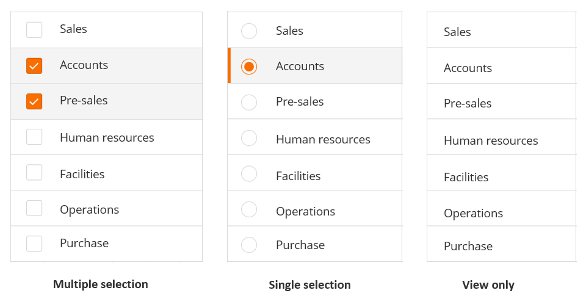

---

## <a id="developing-pwacreating-resizable-panesmd"></a>Developing-Pwa/Creating-Resizable-Panes.md

As a developer, you can create panes that application users can resize according to their preferences.When you add resizable panes, users can expand the panes that have large amounts of information, thereby improving readability and user experience.

Related topic

[Flow-panel-holders-for-Progressive-Web-Applications](https://docs.bmc.com/xwiki/bin/view/Service-Management/Innovation-Suite/BMC-Helix-Innovation-Suite/is254/Developing-Progressive-Web-Applications/Flow-panel-holders-for-Progressive-Web-Applications/)

[Panel-holder-display-types-in-Progressive-View](https://docs.bmc.com/xwiki/bin/view/Service-Management/Innovation-Suite/BMC-Helix-Innovation-Suite/is254/Developing-Progressive-Web-Applications/Panel-holder-display-types-in-Progressive-View/)

Scenario

At Apex Global Inc., the change request screen has an activity pane where the volume of content is sometimes large.Due to the fixed width of the activity pane, users need to scroll the pane to view all the content. Making the pane width adjustable could improve the user experience.

To enable users to resize the activity pane, the developer Seth creates a resizable pane by using Developer Studio. Users can increase the width of the activity pane when they want to view more content.

The following animation shows an example of a resizable pane displayed on a PWA screen:  
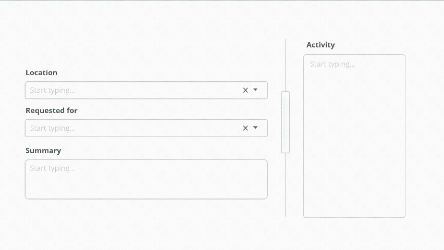

## To create resizable panes in Progressive Web Applications

1. In Developer Studio, create a progressive view.  
   1. Select**Form > Create New View**.  
      The Create New View dialog box is displayed.
   2. From the**View Type**list, select**Progressive**.  
        
      Developer Studioautomatically creates a section panel.
2. From the Palette pane, drag a Splitter Panel Holder into the view.  
   
3. Set a value for the property**Display > Splitter Min Width Percent**.  
   This is the minimum width to which users can resize the pane.

   The Default value of**Splitter Min Width Percent**is**20**.
4. Click**Save**.
5. Open the Mid Tier configuration tool and sync the cache.  
   **http://<*MidtierHostName*>:<*PortNumber*>/arsys/shared/config/config\_cache.jsp**

To test and review the resizable panes in Progressive Web Applications

1. In a browser, log in to PWA.  
   (*On-premises*)**http://<*midtierHostName*>:<*portNumber*>/arsys/pwa/#/login**(*SaaS*)**http://<*helixBaseURL*>/arsys/pwa/#/login**
2. Change the URL to include the Progressive View form that you created in Developer Studio.  
   (*On-premises*)**http://<*midtierHostName*>:<*portNumber*>/arsys/pwa/#/forms/<AR\_Server\_Name>/<formName>/**(*SaaS*)**http://<*helixBaseURL*>/arsys/pwa/#/forms/<AR\_Server\_Name>/<formName>/**
3. Confirm whether the resizable pane can be set to the minimum width.  
   The width of the pane you set is saved across sessions, that is, when you log in again, you will see the previously set width of the pane.

---

## <a id="developing-pwacreating-search-menus-with-better-readabilitymd"></a>Developing-Pwa/Creating-Search-Menus-With-Better-Readability.md

As an application developer, you can create search menus for Progressive Web Applications (PWA). These search menus improve the user experience by providing suggestions that help application users with populating fields.

search menus with display property set to Menu Section present diverse information with better formatting compared to search menus set to Section Panel. Search menus displaying multiple types of information with better formatting have improved readability and easier navigation.

Related topics

[UI-layout-of-Progressive-Web-Applications](https://docs.bmc.com/xwiki/bin/view/Service-Management/Innovation-Suite/BMC-Helix-Innovation-Suite/is254/Developing-Progressive-Web-Applications/UI-layout-of-Progressive-Web-Applications/)

[Flow-panel-holders-for-Progressive-Web-Applications](https://docs.bmc.com/xwiki/bin/view/Service-Management/Innovation-Suite/BMC-Helix-Innovation-Suite/is254/Developing-Progressive-Web-Applications/Flow-panel-holders-for-Progressive-Web-Applications/)

[Creating-search-menus](https://docs.bmc.com/xwiki/bin/view/Service-Management/Innovation-Suite/BMC-Helix-Innovation-Suite/is254/Developing-applications-by-using-Developer-Studio/Developing-the-application-interface/Defining-application-menus/Creating-search-menus/)

Scenario

At Apex Global, Seth the developer wants to create an**Assigned to**field that enables application users to assign a ticket to an employee in Apex Global. Seth has found that application users search by using either the username, employee name, or email ID. To improve the search experience, Seth wants to create search suggestions in the**Assigned to**field which shows the username, employee name, and email ID, so that application users find it easier to search for the appropriate employee.


## Before you begin

You must have a form that has the data required by the search menu with display property set to Menu Section .

## To create smart menus in Progressive Web Applications

The following video (3:28) and procedure describe the example of creating a search menu with display property set to Menu Section by using data from the User Form.

[🎥 Watch Video: https://www.youtube.com/watch?v=1QHi28coXqw](https://www.youtube.com/watch?v=1QHi28coXqw)

[](https://youtu.be/I5PoOIB0VRg)<https://www.youtube.com/watch?v=1QHi28coXqw>

### To create the panels with fields

1. In Developer Studio,open the User Form.  
   

1. Create a Progressive View.

   <details class="confluence-expand-macro panel panel-default"><summary><span class="panel-title"><span class="title-text">Steps (2)</span></span></summary><div class="panel-body"><ol><li>Select<strong>Form &gt; Create New View</strong>.<br/>The Create New View dialog box opens.</li><li>In the<strong>View Type</strong>list, select<strong>Progressive</strong>.<br/><br/>Developer Studio<span>automatically creates a Section Panel.</span></li></ol></div></details>
2. Right-click within the section panel and create a flow panel holder in the current view.  
   **Create a New Field > In Current View > Flow Panel Holder**  
   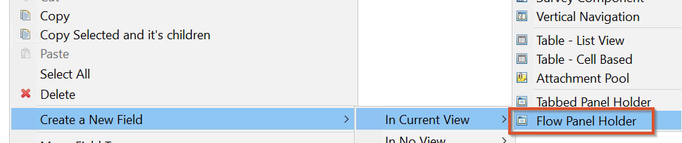  
   Adjust the panel size to allow the addition of more panels. You can see in the Outline pane that a new panel holder and panel are created.
3. Name the new panel holder and panel.  
   In this example, the names are**Panel Holder4**and**Panel 4**.  
   
4. Select**Panel4**and in Properties, set**Display > Type**to**Section Panel**.  
   

1. Inside**Panel4**, create another flow panel holder.

1. Name the panel holder and panel.  
   For example,**Panel Holder5**and**Panel5**.
2. Create another panel within**PanelHolder5**.  
   You can see the two new panels within the panel.  
   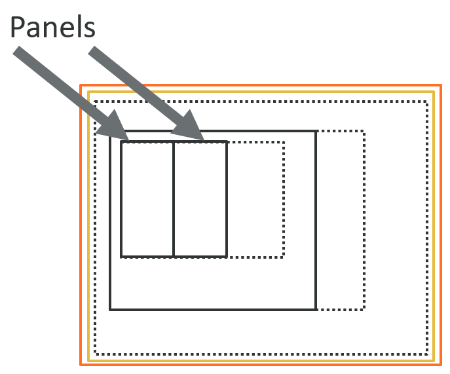

1. Select the two newly created panels.
2. In Properties, set**Progressive Desktop > Progressive Width.**In this example, the value is set to**6/12**. These two panels occupy half the screen according to the 12-column layout. You can set**Progressive Width**to any other value based on how you want to
3. Add the**Login Name**,**Full Name**, and**Email Address**fields by navigating to**Form**>**Add/Remove Fields in View**.  
   These are the fields that are displayed by the search menu with display property set to Menu Section.  
   

1. Select the two panels containing the**Login Name**,**Full Name**, and**Email Address**fields and in Properties, set**Display**>**Type**to**Menu Section**.

   **Best practice**  
   When creating search menus with display property set to Menu Section, include only the following fields or objects within the view:

   * Character
   * Trim Text
   * Check Box
   * Radio Button
   * Date
   * Panel
   * Drop-Down List
2. Change the**Label**and**Name**property of the view to**sample**.  
   

### To create the search menu

1. Create a search menu.  
   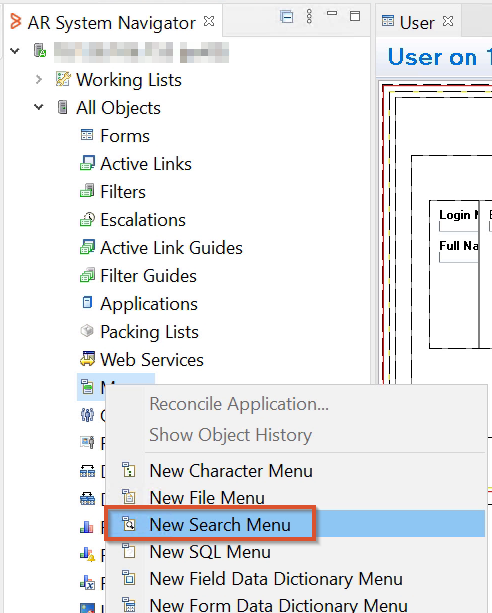
2. In the search menu, in the**Form Name**field, type**U****ser**, and in the**View Name**field, type**sample**.  
   The**View Name**must refer to the view that we just created and named as**sample**.
3. Under**Label fields,**add the three fields**Email Address**,**Full Name**, and**Login Name**.
4. In**Value Field**, type**Login Name**.
5. In Qualification, type**1=1**.
6. Save the menu as**sample\_menu**.
7. Create a form in Progressive View with a character field.  
   Name the form and the field.
8. Select the character fields and change the**Menu Name**property to**sample\_menu**.
9. Set the**Chunk Size**property to 5.  
   Chunking helps with the performance of the search menu with display property set to Menu Section.
10. Save the changes.
11. Open the Mid Tier configuration tool and sync the cache.  
    **http://<*MidtierHostName*>:<*PortNumber*>/arsys/shared/config/config\_cache.jsp**

## To validate the search menu in Progressive Web Applications

1. In a browser, log in to PWA.  
   (*On-premise*)**http://<*midtierHostName*>:<*portNumber*>/arsys/pwa/#/login**(*helix*)**http://<*helixBaseURL*>/arsys/pwa/#/login**
2. Change the URL to include the Progressive View form that you created in Developer Studio.
3. (*On-premise*)**http://<*midtierHostName*>:<*portNumber*>/arsys/pwa/#/forms/<AR\_Server\_Name>/<formName>/**

   (*helix*)**http://<*helixBaseURL*>/arsys/pwa/#/forms/<AR\_Server\_Name>/<formName>/**
4. In the character field, start typing any name.The search menu displays search suggestions consisting of multiple types of information in a well-formatted way.  
   

**Important**

The following table helps you understand the differences between the Menu Section property and the Section Panel property so that you can decide the appropriate option:

| Property<br> | Behavior<br> |
| --- | --- |
| Menu Section<br> | A panel with the**Display > Type**property set to**Menu Section**retains the relative positions of the fields that it encloses when displayed on the PWA screen. The following example illustration shows two fields within the menu section positioned one above another in Developer Studio are displayed one above another on PWA screens as well.<br><br> |
| Section Panel<br> | A panel with the**Display > Type**property set to**Section Panel**does not retain the relative positions of the fields it encloses when displayed on PWA screens. The following illustration shows an example of two fields arranged one above another in Developer Studio. However, on a PWA screen, they are displayed side-by-side.<br>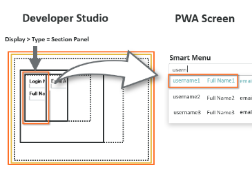<br> |

---

## <a id="developing-pwacreating-selection-listsmd"></a>Developing-Pwa/Creating-Selection-Lists.md

As an application developer, you can create a list where application users can select multiple options. Users can use this list to populate a field.

Example scenario: selection of multiple stakeholders

Seth, the developer wants service desk agents to add a number of stakeholders to the list of people who are notified about the status changes of a ticket.


For this, Seth wants to create a selection field consisting of stakeholders listed with check boxes against each name so that the service desk agent can quickly select and add stakeholders to the CC list.

## To create selection lists in Progressive Web Applications

1. InDeveloper Studio, create a Progressive View.
2. Drag and drop**Character**into the view.  
   
3. Select the character field.  
   
4. In the Properties tab, beside**Attributes >****Menu Name**, click the ellipsis () button.  
   The Menu Name dialog opens.
5. In the**Name**field, enter the name of the form which contains the options you want to display in the list.  
   You must select a menu of category Search.  
   
6. In the**Menu Style**list, select**Append**.  
   If you select**Overwrite**, you get a list that allows selecting only one item.
7. In the**Display > Display Type**list, select**Drop-Down List**.
8. (*Optional*) Under**Display**, in the**Menu Delimiter**field, enter the character that should appear between the selected options when this data is saved.  
   For example, if you enter a slash (/) as the delimiter, you generate the following data within the application:  
   Option1/Option2/Option3  
   Irrespective of the delimiter you specify, application users see a comma (,) as the delimiter in the field.
9. Save the changes.

## Validating the multiple selection list in PWA

1. In a browser, log in to PWA.  
   **<*serverName*>:8080/arsys/pwa/#/login**
2. Change the URL to include the Progressive View form that you created inDeveloper Studio.**<*serverName*>:8080/arsys/pwa/#/forms/<*serverName*>/<*formName*>/<*viewName*>**
3. (*Optional*) If you want to display more changes you made inDeveloper Studio, you must sync the cache in Mid Tier.
   1. Log in toMid Tierconfiguration.  
      **<*serverName*>:8080/arsys/shared/config/config.jsp**
   2. Click**Sync Cache**.
   3. Refresh the browser displaying the progressive view form.

Related topics

[Creating-fields-that-auto-complete-in-Progressive-Web-Applications](https://docs.bmc.com/xwiki/bin/view/Service-Management/Innovation-Suite/BMC-Helix-Innovation-Suite/is254/Developing-Progressive-Web-Applications/Creating-fields-that-auto-complete-in-Progressive-Web-Applications/)

[Creating-dynamic-selection-lists-for-Progressive-Web-Applications-by-using-JSON-data](https://docs.bmc.com/xwiki/bin/view/Service-Management/Innovation-Suite/BMC-Helix-Innovation-Suite/is254/Developing-Progressive-Web-Applications/Creating-dynamic-selection-lists-for-Progressive-Web-Applications-by-using-JSON-data/)

[Adding-mention-for-fields-in-Progressive-Web-Applications](https://docs.bmc.com/xwiki/bin/view/Service-Management/Innovation-Suite/BMC-Helix-Innovation-Suite/is254/Developing-Progressive-Web-Applications/Adding-mention-for-fields-in-Progressive-Web-Applications/)

---

## <a id="developing-pwacss-classes-used-in-progressive-web-app-screensmd"></a>Developing-Pwa/Css-Classes-Used-In-Progressive-Web-App-Screens.md

The following table lists out the CSS classes that are being used in Progressive Web App (PWA) screens:

| **CSS Class Name**<br> | **Description**<br> |
| --- | --- |
| mb-1<br> | Sets margin-bottom to .25rem<br> |
| mb-2<br> | Sets margin-bottom to .5rem<br> |
| mb-0<br> | Removes margin-bottom<br> |
| mt-3<br> | Sets margin-top to 1rem<br> |
| m-0<br> | Sets margin to 0 across all sides<br> |
| pr-2<br> | Sets padding right to .5rem<br> |
| pl-0<br> | Sets padding-left to 0<br> |
| border-0<br> | Removes border from the element across all sides<br> |
| w-100<br> | Sets width to 100%<br> |
| detatch<br> | Indicates whether to use relative position for vertical dropdown.<br>Default behavior for dropdown shown in vertical navbar is absolute. If you want the position of the dropdown to be relative, use the CSS class detatch.<br> |
| justify<br> | This class is specific to tab panels. Indicates how browser distributes space between and around content items along the main-axis of a flex container, and the inline axis of a grid container.<br> |
| text-primary<br> | Displays text color in blue<br> |
| rev-ml-1rem rev-mr-1rem<br> | rev-ml-1rem=Sets margin-left to -0.25rem<br>rev-mr-1rem=Sets margin-right to -0.25rem<br> |

Related topics

[UI-layout-of-Progressive-Web-Applications](https://docs.bmc.com/xwiki/bin/view/Service-Management/Innovation-Suite/BMC-Helix-Innovation-Suite/is254/Developing-Progressive-Web-Applications/UI-layout-of-Progressive-Web-Applications/)

[Adding-icons-and-images-to-Progressive-Web-Applications](https://docs.bmc.com/xwiki/bin/view/Service-Management/Innovation-Suite/BMC-Helix-Innovation-Suite/is254/Developing-Progressive-Web-Applications/Adding-icons-and-images-to-Progressive-Web-Applications/)

[Previews-of-icons-available-in-Developer-Studio-to-support-PWA](https://docs.bmc.com/xwiki/bin/view/Service-Management/Innovation-Suite/BMC-Helix-Innovation-Suite/is254/Developing-Progressive-Web-Applications/Adding-icons-and-images-to-Progressive-Web-Applications/Previews-of-icons-available-in-Developer-Studio-to-support-PWA/)

---

## <a id="developing-pwacustomization-best-practices-for-developing-pwamd"></a>Developing-Pwa/Customization-Best-Practices-For-Developing-Pwa.md

Consider the following best practices when developing or customizing Progressive Web Applications (PWA).

Adhering to these best practices helps you to achieve the following outcomes:

* Leverage the full potential of PWA features, such as responsiveness.
* Enhance the experience of your application users.
* Avoid errors when running workflows.

## Whitepaper on PWA implementation methodology

Make sure that you read the whitepaper at the following link before referring to the best practices in this topic:[Community blog: Whitepaper on ITSM PWA Implementation Methodology](https://community.bmc.com/s/news/aA33n000000TXSHCA4/bmc-helix-itsm-pwa-implementation-methodology)

The information in the whitepaper helps you achieve the following objectives:

* Understand PWA concepts
* Learn how Smart IT PWA screens are developed
* Perform customization and localization of PWA screens

**Important**

Before enabling Progressive Views, make sure that you haveAR System server, Mid Tier, and Developer Studio version 20.08 or later installed.

Related topics

[Developing-Progressive-Web-Applications](https://docs.bmc.com/xwiki/bin/view/Service-Management/Innovation-Suite/BMC-Helix-Innovation-Suite/is254/Developing-Progressive-Web-Applications/)

[UI-layout-of-Progressive-Web-Applications](https://docs.bmc.com/xwiki/bin/view/Service-Management/Innovation-Suite/BMC-Helix-Innovation-Suite/is254/Developing-Progressive-Web-Applications/UI-layout-of-Progressive-Web-Applications/)

[Adding-rich-text-fields-in-Progressive-Web-Applications](https://docs.bmc.com/xwiki/bin/view/Service-Management/Innovation-Suite/BMC-Helix-Innovation-Suite/is254/Developing-Progressive-Web-Applications/Adding-rich-text-fields-in-Progressive-Web-Applications/)

[Panel-holder-display-types-in-Progressive-View](https://docs.bmc.com/xwiki/bin/view/Service-Management/Innovation-Suite/BMC-Helix-Innovation-Suite/is254/Developing-Progressive-Web-Applications/Panel-holder-display-types-in-Progressive-View/)

## Use supported fields and properties in Progressive View

You must only use the fields supported by progressive views to build a Progressive Web Application.For each field on a form, the**Properties**tab in Developer Studio lists the properties of that field.

Fields and properties help you perform the following tasks:

* Create elements in your application interface.
* Set properties that determine the look and behaviorof the field during operations performed in a browser.

The properties listed in the**Properties**tab vary depending on the type of field you create or modify.For the list of supported fields and properties, see[Field properties](https://docs.bmc.com/xwiki/bin/create/Service-Management/Innovation-Suite/remedyservermaster/Developing-applications/Developing-the-application-interface/Creating-and-managing-fields/Field-Properties/WebHome?parent=Service-Management.Innovation-Suite.BMC-Helix-Innovation-Suite.is254.Developing-Progressive-Web-Applications.Customization-best-practices-for-developing-PWA.WebHome).

## Set permissions, visibility, and hierarchy for fields and sections

When creating fields and sections, you must adhere to the following best practices:

* Set section panel permissions for users to be able to view the section panel and its contents.
* In a panel, set the**Visible**property to**True**to enable users to see the contents of that panel.
* Share the same panels between multiple form views where required.  
  Display properties are associated with specific views and do not interfere with other form views, unlike other properties.
* Move temporary fields that don't need localization outside the form view while keeping them within the form.  
  Use the Add/Remove Fields in View dialog to move a field out of the view.
* Maintain panel and field hierarchy—Do not place fields and flow panels at the same level in the hierarchy.  
  The following illustration shows how the hierarchy should appear inDeveloper Studio:  
  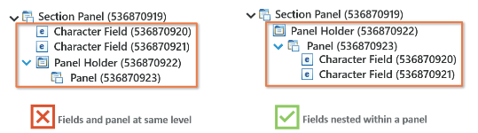

The following video (1:14) demonstrates the best practices when creating fields and sections:

[🎥 Watch Video: https://www.youtube.com/watch?v=uKdaUBgwfJg](https://www.youtube.com/watch?v=uKdaUBgwfJg)

[](https://youtu.be/I5PoOIB0VRg)<https://youtu.be/4QzFHEaRwIM><https://youtu.be/uKdaUBgwfJg>

Skip to specific parts of the video:

[0:06](https://www.youtube.com/watch?v=uKdaUBgwfJg&t=6s)Setting panel permissions for users  
[0:24](https://www.youtube.com/watch?v=uKdaUBgwfJg&t=24s)Maintaining panel and field hierarchy  
[0:41](https://www.youtube.com/watch?v=uKdaUBgwfJg&t=41s)Setting panel visibility

## Best practices to create and use flow panel holders

A Flow panel holder is available when you enable a Progressive view for your form. For more information, see[Progressive View quick start guide](https://docs.bmc.com/xwiki/bin/view/Service-Management/Innovation-Suite/BMC-Helix-Innovation-Suite/is254/Getting-started/Key-concepts/Application-development-overview/Progressive-View-quick-reference-guide/).The Flow panel holder supports the properties required to enable a progressive view. Use a Flow Panel holder for aligning fields on a form. You can also group the fields to ensure correct alignment of fields on a form. This panel does not have a panel header, and supports Container panel holder (Default), Sub Panel holder, and Section Panel holder types.The following video (4:52) demonstrates creating Fixed panels in Developer Studio when you enable progressive views for a form:

[🎥 Watch Video: https://www.youtube.com/watch?v=m33BWG-mEoI](https://www.youtube.com/watch?v=m33BWG-mEoI)

<https://youtu.be/m33BWG-mEoI>The following video (13:03) demonstrates creating complex layouts with flow panels:

[🎥 Watch Video: https://www.youtube.com/watch?v=TnwUS2RF28Q](https://www.youtube.com/watch?v=TnwUS2RF28Q)

[https://youtu.be/TnwUS2RF28Q](https://youtu.be/TnwUS2RF28Q)

### Panel arrangement sequence

The panels are arranged in the following sequence or hierarchy:  
Flow Panel holder > Container Panel Holder > Container Panel> Sub Panel Holder > Sub Panel > Section Panel Holder > Section Panel > Section Panel Holder > Section Panel > fields

* A progressive view can hold only a Container type Flow panel holder and a Fixed panel holder.
* By default, a Flow panel holder has one panel as a child panel.
* You can change the read-only property type of any panel only when you change the property type of Flow panel holder.

**Tip**When you add Flow Panel Holder to the Progressive View from the palette in Developer Studio, the flow panel holder is represented by a panel holder in the Outline pane.In the following example figure, the flow panel holder is represented by**Panel Holder\_c**enclosing a panel named**Panel\_c**:

### Container Flow panel holder

* By default, a Container type Flow panel is added to a Flow panel holder.
* You can delete a Container Flow panel only if you remove all progressive views.
* A Container Flow panel holder can have one or more Sub panels.

### Section Flow panel holder

* You can add a Section Flow panel holder only under a Sub panel or Section panel.
* A Section panel can either have a Section type Flow panel holder or non-panel fields.
* The Section Flow panel holder added by framework contains only Section panel as children.

### Sub panel holder

The Sub panel holder behaves as a Section panel on the desktop client. However, it is displayed as a tab on a mobile client.

* You can add a sub panel holder only under the container panel.
* A sub panel holder can have one or more sub panels.

For more information about developing PWA, see[Developing-Progressive-Web-Applications](https://docs.bmc.com/xwiki/bin/view/Service-Management/Innovation-Suite/BMC-Helix-Innovation-Suite/is254/Developing-Progressive-Web-Applications/).

<https://youtu.be/m33BWG-mEoI>The following video (13:03) demonstrates creating complex layouts with flow panels:

[🎥 Watch Video: https://www.youtube.com/watch?v=TnwUS2RF28Q](https://www.youtube.com/watch?v=TnwUS2RF28Q)

[https://youtu.be/TnwUS2RF28Q](https://youtu.be/TnwUS2RF28Q)

### Panel arrangement sequence

The panels are arranged in the following sequence or hierarchy:  
Flow Panel holder > Container Panel Holder > Container Panel> Sub Panel Holder > Sub Panel > Section Panel Holder > Section Panel > Section Panel Holder > Section Panel > fields

* A progressive view can hold only a Container type Flow panel holder and a Fixed panel holder.
* By default, a Flow panel holder has one panel as a child panel.
* You can change the read-only property type of any panel only when you change the property type of Flow panel holder.

**Tip**

When you add Flow Panel Holder to the Progressive View from the palette in Developer Studio, the flow panel holder is represented by a panel holder in the Outline pane.

In the following example figure, the flow panel holder is represented by**Panel Holder\_c**enclosing a panel named**Panel\_c**:


### Container Flow panel holder

* By default, a Container type Flow panel is added to a Flow panel holder.
* You can delete a Container Flow panel only if you remove all progressive views.
* A Container Flow panel holder can have one or more Sub panels.

### Section Flow panel holder

* You can add a Section Flow panel holder only under a Sub panel or Section panel.
* A Section panel can either have a Section type Flow panel holder or non-panel fields.
* The Section Flow panel holder added by framework contains only Section panel as children.

### Sub panel holder

The Sub panel holder behaves as a Section panel on the desktop client. However, it is displayed as a tab on a mobile client.

* You can add a sub panel holder only under the container panel.
* A sub panel holder can have one or more sub panels.

For more information about developing PWA, see[Developing-Progressive-Web-Applications](https://docs.bmc.com/xwiki/bin/view/Service-Management/Innovation-Suite/BMC-Helix-Innovation-Suite/is254/Developing-Progressive-Web-Applications/).

## Best practices when localizing Progressive Web Application screens

Use the localization toolkit and the AR System Message Catalog form to localize your Progressive Web Application (PWA).

You must adhere to the following best practices when localizing a PWA:

* Use independent forms only so that the related Active Links and Filters are also considered.
* For the form fields that you want to localize, set the value of the "Localize Label" property in Display Properties to**True**.
* When you delete a package definition, the package definition is deleted, but the extracted strings are not deleted from the localization database. If you create a package definition with the same name as the deleted one and export, you get the extracted strings from the deleted package definition as well. To avoid this issue, we recommend that you explicitly delete those strings from the database.

For more information about localizing PWA, see[Localizing-a-Progressive-Web-Application](https://docs.bmc.com/xwiki/bin/create/Service-Management/Innovation-Suite/remedyservermaster/Developing-a-Progressive-Web-Application/Localizing-a-Progressive-Web-Application/WebHome?parent=Service-Management.Innovation-Suite.BMC-Helix-Innovation-Suite.is254.Developing-Progressive-Web-Applications.Customization-best-practices-for-developing-PWA.WebHome).

## Update associated workflows when altering Drop-Down List fields

As a developer, you can create a list for PWA users by using the Drop-Down List field. The following graphic shows an example Drop-Down List field:

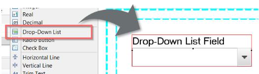

The Drop-Down List field lists the options that you add by using the Selections dialog box. You must then define active links that refer to these selection values. You must make sure that you do not remove any of the selections shown in the following example graphic:  
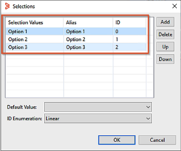

For example, if you delete any of the selections in the Selection dialog, the Progressive Web Application users see a blank field in place of the drop-down list. This is because the active link that opens the drop-down list refers to these three options.When one option is missing, the active link breaks the workflow and the field does not get displayed. If you must delete any of the selections, you must also make sure that the associated workflows referring to the selections are updated accordingly.

The following video (1:00) explains the best practice of making sure workflows are updated along with selection lists.

[🎥 Watch Video: https://www.youtube.com/watch?v=4QzFHEaRwIM](https://www.youtube.com/watch?v=4QzFHEaRwIM)

[](https://youtu.be/I5PoOIB0VRg)<https://youtu.be/4QzFHEaRwIM>

## Check execution order when modifying workflows

When adding any additional steps in your workflows, you must do the following:

1. Get to know the execution order of all the other existing workflows by viewing the active link logs.
2. Add the additional workflow with the correct execution order depending on the outcome you want to achieve.

The following video (0:52) demonstrates how to view and set the execution order of workflows:

[🎥 Watch Video: https://www.youtube.com/watch?v=gaXqNLvCdBA](https://www.youtube.com/watch?v=gaXqNLvCdBA)

[](https://youtu.be/I5PoOIB0VRg)<https://youtu.be/4QzFHEaRwIM><https://youtu.be/gaXqNLvCdBA>

## Best practice to display activity note type in Smart IT by updating the activity template

When Smart IT PWA screen users create a new note, they can select a note type. But by default, the note type is not displayed in the activity pane. In this example procedure, we update the activity template in the AR System Resource Definitions form so that the Smart IT activity note information displays the activity note type.

The following graphic shows a high-level overview of the steps you need to perform in this procedure.


The following video (2:01) shows how to display the activity note type to the activity note message inITSM: Smart IT.

[🎥 Watch Video: https://www.youtube.com/watch?v=-npsSMfbvs](https://www.youtube.com/watch?v=--npsSMfbvs)

[](https://youtu.be/I5PoOIB0VRg)[https://youtu.be/-npsSMfbvs](https://youtu.be/--npsSMfbvs)

## To update activity template to display activity note type in the Activity tab

1. Search and download the**SHR\_SV\_Activity\_Template\_Generic.html**template file.
   1. Open the AR System object list page and AR System Resource Definitions form.  
      **http://<MidtierHostName>:PortNumber>/arsys/forms/<AR\_Server\_Name>/AR+System+Mid+Tier+Object+List**
   2. In the**Name**field, enter**AR System Resource Definitions form**.
   3. Click**Open Search**to open the form in search mode.  
      The**AR System Resource Definitions**form opens.
   4. In the**AR System Resource Definitions**form, in the**Name**field, enter**SHR\_SV\_Activity\_Template\_Generic.html**.  
      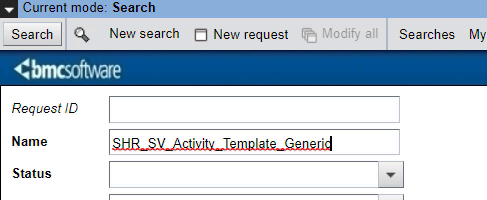
   5. Click**Search**.  
      The search result shows SHR\_SV\_Activity\_Template\_Generic.html
   6. In the Resource section, select**SHR\_SV\_Activity\_Template\_Generic.html**.
   7. Click**Save to Disk**.
2. Open the**SHR\_SV\_Activity\_Template\_Generic.html**template file in a source code editor such as Notepad++.
3. Add the following variable in the template file:  
   **varworkLogType= $<field ID>$**
4. Replace the field ID with the field ID of the incident, which is 304427491.  
   The field ID is 304422931 for work orders. After this change, you have the following line of code:  
   **varworkLogType=`$304427491$`;**
5. In the template file, search for the following line of code:  
   **messageText = peopleText + valField\_0 + ' ' + addedNoteStr + '</br>' + generateLinkForURL(valField\_1)**
6. Replace it with the following line of code to add the note type variable to the activity notes message:  
   **messageText =****peopleText**+**valField\_0 + ' ' + addedNoteStr + ' ( ' + notetype + ' )' + '</br>' + generateLinkForURL(valField\_1);**
7. Save the changes to the template file.
8. In the AR System Resource Definitions form, delete the existing template file (SHR\_SV\_Activity\_Template\_Generic.html) and add the file you just updated.
9. Open the Mid Tier configuration tool and flush the cache to update the changes.
10. OpenITSM: Smart ITand create a new note in the incident page.  
    You can see that the note type information is displayed in the activity note message.

## Create custom activity messages

Create custom activity messages in Smart IT PWA screens. For example, you can change the activity messages to show more information on the changes that were made by a specific user.

The following video (3:16) show how you can change the activity message that is displayed in Smart IT PWA screens.

[🎥 Watch Video: https://www.youtube.com/watch?v=GPqPunk1z\_8](https://www.youtube.com/watch?v=GPqPunk1z_8)

[](https://youtu.be/I5PoOIB0VRg)<https://youtu.be/GPqPunk1z_8>

## Identify missing active link guides during customization

When customizing the PWA, you might have to change workflows such as active links and filters. When updating workflows, make sure that the active link guides are not edited or removed in Developer Studio. If the custom message does not appear as expected, it is important to check the logs to see if the active link guides or any workflows are not working as expected.

The following video (1:03) shows you how to make sure the active link guides are working.

[🎥 Watch Video: https://www.youtube.com/watch?v=6De09pnOPqY](https://www.youtube.com/watch?v=6De09pnOPqY)

[](https://youtu.be/I5PoOIB0VRg)<https://youtu.be/6De09pnOPqY>

## Change the chunk size in search fields for optimum results and performance

Search fields on PWA screens have a**Chunk Size**display property in Developer Studio that determines the maximum number of matching results that are displayed.  
In the following example graphic,**Chunk Size**is set to**5**and hence not more than 5 matching results are displayed.


To view all the search suggestions, set the**Chunk Size**property for the field to zero.

Setting**Chunk Size**to zero might affect the performance of the application based on factors such as database size.

We recommend that you optimize the chunk size to view the required number of results while making sure performance is reasonable.

The following video (0:17) shows how to change the chunk size of a field in Developer Studio.

## Display messages in prompt bar instead of pop-up window when loader is enabled

To display a message to the application user after an active link executes, use the Message section of the Active Link in Developer Studio to add the message and the message text.

When displaying a message through an active link, you must ensure the following best practices:

* To show the message with the loader enabled, you must select**Show Message in Prompt Bar**in the active link message settings.  
  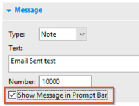  
  For example, if you have created a message action that is followed by theENABLE-WAIT-CURSOR-ON-LONGRUNNING  
  PROCESScommand to display the loader, you must select**Show Message in Prompt Bar**to make sure the workflow is not interrupted. For more information about theENABLE-WAIT-CURSOR-ON-LONGRUNNING-PROCESScommand, see[Process-commands](https://docs.bmc.com/xwiki/bin/create/Service-Management/Innovation-Suite/remedyservermaster/Developing-applications/Defining-workflow-to-automate-processes/Specifying-workflow-actions/Using-Run-Process-and-PROCESS-commands/Process-commands/WebHome?parent=Service-Management.Innovation-Suite.BMC-Helix-Innovation-Suite.is254.Developing-Progressive-Web-Applications.Customization-best-practices-for-developing-PWA.WebHome).
* To show the message as a pop-up window, you must set the message to display before theENABLE-WAIT-CURSOR-ON-LONGRUNNING-PROCESScommand runs.

## Text with ampersand (&) must have spaces to avoid matching with HTML elements

Plain text with an ampersand (&) that is not preceded and followed by spaces is processed as HTML. If you have any plain text containing ampersand (&), make sure is preceded by and followed by a space.

For example, if you add a value such as**Test&amplitude**, the portion of the string**&amp**is assumed to be an ampersand (&), and that value is replaced by**Test&litude**.

## Use active links to fetch labels of list options

InITSM, when character fields are associated with a menu, the value of the label for the menu and the value returned by the menu are different. In such cases, you must use an active link workflow with**Menu Choice**selected as the**Execution Option**to set the label based on the value returned by the menu.

The following active link is an example of an active link which resets the field back to the label of the option selected by application users:

CHG:Infrastructure Change form, Field ID: 1000000881, z1D Status Reason field in Best Practice View, active link named CHG:SHR:SetStatusReason\_100.

However in PWA, if the field is in enabled state, upon menu selection, the system automatically fetches the label and displays it in the field. In this scenario, there is no need to write an explicit workflow.

**Important**

If the field is in disabled or read-only state, you must create an active link that fetches the label of the selected option.  
You can create an active link similar to the active link CHG:SHR:SetStatusReason\_100 mentioned in the example.

## Avoid selection fields when using autocomplete

When you create a search field in Developer Studio that has autocomplete, make sure you avoid adding fields with**Selection**as a the data type. The following fields are of data type**Selection**:

* Drop-Down List
* Radio Button
* Check Box

If any of these fields of selection data type exist in the source forms that provide the data for the search field, the autocomplete may not work as expected.

## Set Display Type to correctly display phone numbers or email IDs in character fields

When you display an email ID or a phone number in a character field on a PWA screen, the phone number or email ID may not display correctly when they are longer than usual. To avoid this, you must select the following display type properties for the character field:

| information to display<br> | Property to add to character field<br> |
| --- | --- |
| Email ID<br> | **Display Type > Email ID**<br> |
| Phone number<br> | **Display Type > Phone Number**<br> |

Close an existing loader before opening a pop-up window

When a pop-window is set to open when there is a loader running, as a developer, you must make sure that the loader closes before the pop-up window opens.If the loader is not stopped before a pop-up window appears, the loader could prevent access to the pop-up window.

The following animation shows an example of a loader:


To make sure that the loader stops before the pop-up window opens, you must perform the following high-level steps:

1. Identify the active link that opens the pop-up window.
2. Insert the following run process before the open window action:  
   ENABLE-WAIT-CURSOR-ON-LONG-RUNNING-PROCESS 0  
   This ensures that the loader closes before the pop-up stops.
3. (*Optional*) You may run the loader again after the open window action by using the following run process:  
   ENABLE-WAIT-CURSOR-ON-LONG-RUNNING-PROCESS 1

For more information about theENABLE-WAIT-CURSOR-ON-LONGRUNNING-PROCESScommand, see[Process-commands](https://docs.bmc.com/xwiki/bin/view/Service-Management/Innovation-Suite/BMC-Helix-Innovation-Suite/is254/Developing-applications-by-using-Developer-Studio/Defining-workflow-to-automate-processes/Specifying-workflow-actions/Using-Run-Process-and-PROCESS-commands/Process-commands/).

## Enable searching by support groups aliases

As an application developer, perform the following procedure to provide your application users with the ability to search by support group aliases on PWA screens.

### Prerequisites

Create a support group alias for the support group.

1. Log into Mid Tier.
2. Open the Support Group window.  
   **Application Administration Console > Support Group > Group Alias panel**
3. In the**Support Group**tab, click**Update**.
4. In the Support Group Alias Update dialog box, create an alias for the support group.  
     
   For more information about support groups, see[Creating support groups](https://docs.bmc.com/xwiki/bin/view/Service-Management/Innovation-Suite/AR-System/ars221/Administering/Setting-up-and-modifying-Foundation-data-by-using-Application-Administration-Console/Creating-and-modifying-companies-and-organization-structures/Configuring-support-groups/Creating-support-groups/).

**To create a support group search on PWA screens**

1. Log into Developer Studio.
2. Open the CTM:Support Group Alias Lookup form.
3. Create a Progressive View for the CTM:Support Group Alias Lookup form.
4. Create a search menu based on the CTM:Support Group Alias Lookup form.  
   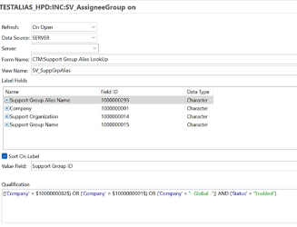  
   For information about creating a search menu, see[Creating search menus.](https://docs.bmc.com/xwiki/bin/view/Service-Management/Innovation-Suite/BMC-Helix-Innovation-Suite/is254/Developing-Progressive-Web-Applications/Creating-search-menus-with-better-readability-in-Progressive-Web-Applications/)
5. Attach the smart menu to the custom or overlaid support group fields in Progressive View.
6. Validate these changes by opening a ticket on a PWA screen and searching by support group alias names.  
   The following graphic shows an example where searching by support group alias names is enabled.  
   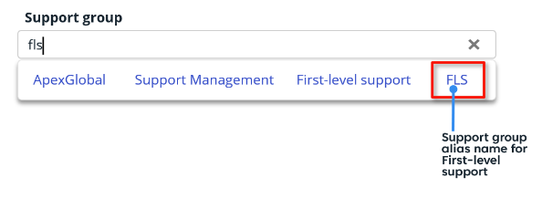

Best practices for enhanced performance

Follow these best practices for better performance of PWA:

* Disable logs for both Mid Tier and AR System. Enable logs only when troubleshooting issues.  
  For more information, see[Enabling-logs-for-performance-issues](https://docs.bmc.com/xwiki/bin/view/Service-Management/Innovation-Suite/BMC-Helix-Innovation-Suite/is254/Troubleshooting/Enabling-and-analyzing-logs/Enabling-logs/Enabling-logs-for-performance-issues/).
* When creating workflows with multiple calls, use parallel calls.  
  This ensures that the time taken by the workflow to complete is limited to that of the longest call. If workflow calls are made one after another, then the workflow duration is the sum of the time taken for all the calls. For more information, see[Creating-active-links](https://docs.bmc.com/xwiki/bin/view/Service-Management/Innovation-Suite/BMC-Helix-Innovation-Suite/is254/Developing-applications-by-using-Developer-Studio/Defining-workflow-to-automate-processes/Creating-workflow-objects/Creating-active-links/).
* Enable archiving for transactional data for all the modules.  
  For more information, see[Archiving-data](https://docs.bmc.com/xwiki/bin/view/Service-Management/Innovation-Suite/BMC-Helix-Innovation-Suite/is254/Administering/Managing-data-and-objects/Archiving-data/).
* Write qualifications that lead to optimum SQL queries.  
  For example, avoid a qualification that will lead to a full table scan.
* Ensure that you include correct and optimized DB indexes.

## Additional resources

[](https://youtu.be/7DnZnfo6uZ8)[Webinar: Progressive Web Apps Introduction & Best Practices](https://youtu.be/sVJXAhfVzQk)

[](https://youtu.be/7DnZnfo6uZ8)[Webinar: Progressive Web Application (PWA) Development In Helix ITSM](https://youtu.be/-J-ENCJ8bc4)

---

## <a id="developing-pwaenabling-progressive-views-for-forms-by-using-centmd"></a>Developing-Pwa/Enabling-Progressive-Views-For-Forms-By-Using-Cent.md

As a developer, you must enable progress views for out-of-the-box forms and custom forms when creating Progressive Web Applications (PWAs). Use the information in this topic to understand the methods for enabling progressive views for Smart IT and custom applications.

Related topics

[Developing-Progressive-Web-Applications](https://docs.bmc.com/xwiki/bin/view/Service-Management/Innovation-Suite/BMC-Helix-Innovation-Suite/is254/Developing-Progressive-Web-Applications/)

[Creating-a-Progressive-View-in-Developer-Studio-to-create-Progressive-Web-Applications](https://docs.bmc.com/xwiki/bin/view/Service-Management/Innovation-Suite/BMC-Helix-Innovation-Suite/is254/Developing-Progressive-Web-Applications/Creating-a-Progressive-View-in-Developer-Studio-to-create-Progressive-Web-Applications/)

Before you begin

* Make sure that you have installedAR System server, Mid Tier, and Developer Studio.
* If you are a ITSM user, configure a client gateway to access and customize your application by usingDeveloper Studio. For more information, see the following topics in the Subscriber documentation:  
  + [Client Gateway connectivity](https://docs.bmc.com/xwiki/bin/view/Helix-Common-Services/Other/BMC-Helix-Subscriber-Information/helixsubscriber/Getting-started/BMC-Helix-services-lifecycle/Technical-services/Lifecycle-Requests/BMC-Helix-Client-Gateway-connectivity/)
  + [ITSM customizations, configurations, and changes](https://docs.bmc.com/xwiki/bin/view/Helix-Common-Services/Other/BMC-Helix-Subscriber-Information/helixsubscriber/Getting-started/BMC-Helix-ITSM-customizations-configurations-and-changes/)
  + [ITSM Customization policy](https://docs.bmc.com/xwiki/bin/view/Helix-Common-Services/Other/BMC-Helix-Subscriber-Information/helixsubscriber/Policies/BMC-Helix-ITSM-Customization-policy/)
* (Smart ITonly) If you plan to use the**Progressive Views configuration**form, in the Centralized Configuration, make sure that the following parameters are set to the appropriate values:

  | Parameter<br> | Value<br> |
  | --- | --- |
  | **mid\_tier.base.url**<br> | Mid TierURL of Progressive Web Application<br> |
  | **arsystem.security\_iframe\_allowfromurls**<br> | Smart ITbase URL<br> |
  | **Enable-Progressive-Views**<br> | **T**<br> |

  For more information, see[Enabling the Progressive Web Application screens](https://docs.bmc.com/xwiki/bin/view/Service-Management/IT-Service-Management/BMC-Helix-ITSM-Smart-IT/smartit221/Administering/Enabling-the-Progressive-Web-Application-screens/).

## To enable Progressive Views for forms by using the Centralized Configuration Settings

1. In Centralized Configuration, set the**Enable-Progressive-Views**property to**T**(True)as shown in the following image:

   
2. InDeveloper Studio, select the form for which you want to enable progressive views:

   1. From the**Form**menu, select**Create New View**.
   2. From the**View Type**list, select**Progressive.  
      **

   Developer Studioapplies certain restrictions on modifying progressive views. For more information, see[Customization-best-practices-for-developing-PWA](https://docs.bmc.com/xwiki/bin/view/Service-Management/Innovation-Suite/BMC-Helix-Innovation-Suite/is254/Developing-Progressive-Web-Applications/Customization-best-practices-for-developing-PWA/).
3. Launch theMid Tierby using the following URL format:  
   ***ARSystemServerName:portNumber*/arsys****/pwa/#/forms/*ARSystemServerName****/formName*/NewDefault%20Administrator%20View  
   For example:  
   **Server1:8080/arsys/pwa/#/forms/Server1/My%20Form/NewDefault%20Administrator%20View**

---

## <a id="developing-pwaflow-panel-holdersmd"></a>Developing-Pwa/Flow-Panel-Holders.md

A Flow panel holder is available when you enable a Progressive view for your form. For more information, see[Progressive View quick start guide](https://docs.bmc.com/xwiki/bin/view/Service-Management/Innovation-Suite/BMC-Helix-Innovation-Suite/is254/Getting-started/Key-concepts/Application-development-overview/Progressive-View-quick-reference-guide/).

The Flow panel holder supports the properties required to enable a progressive view. Use a Flow Panel holder for aligning fields on a form. You can also group the fields to ensure correct alignment of fields on a form. This panel does not have a panel header, and supports Container panel holder (Default), Sub Panel holder, and Section Panel holder types.

The following video (4:52) demonstrates creating Fixed panels in Developer Studio when you enable progressive views for a form:

[🎥 Watch Video: https://www.youtube.com/watch?v=m33BWG-mEoI](https://www.youtube.com/watch?v=m33BWG-mEoI)

<https://youtu.be/m33BWG-mEoI>

The following video (13:03) demonstrates creating complex layouts with flow panels:

[🎥 Watch Video: https://www.youtube.com/watch?v=TnwUS2RF28Q](https://www.youtube.com/watch?v=TnwUS2RF28Q)

[https://youtu.be/TnwUS2RF28Q](https://youtu.be/TnwUS2RF28Q)

### Panel arrangement sequence

The panels are arranged in the following sequence or hierarchy:  
Flow Panel holder > Container Panel Holder > Container Panel> Sub Panel Holder > Sub Panel > Section Panel Holder > Section Panel > Section Panel Holder > Section Panel > fields


* A progressive view can hold only a Container type Flow panel holder and a Fixed panel holder.
* By default, a Flow panel holder has one panel as a child panel.
* You can change the read-only property type of any panel only when you change the property type of Flow panel holder.

**Tip**

When you add Flow Panel Holder to the Progressive View from the palette in Developer Studio, the flow panel holder is represented by a panel holder in the Outline pane.

In the following example figure, the flow panel holder is represented by**Panel Holder\_c**enclosing a panel named**Panel\_c**:


### Container Flow panel holder

* By default, a Container type Flow panel is added to a Flow panel holder.
* You can delete a Container Flow panel only if you remove all progressive views.
* A Container Flow panel holder can have one or more Sub panels.

### Section Flow panel holder

* You can add a Section Flow panel holder only under a Sub panel or Section panel.
* A Section panel can either have a Section type Flow panel holder or non-panel fields.
* The Section Flow panel holder added by framework contains only Section panel as children.

### Sub panel holder

The Sub panel holder behaves as a Section panel on the desktop client. However, it is displayed as a tab on a mobile client.

* You can add a sub panel holder only under the container panel.
* A sub panel holder can have one or more sub panels.

For more information about developing PWA, see[Developing-Progressive-Web-Applications](https://docs.bmc.com/xwiki/bin/view/Service-Management/Innovation-Suite/BMC-Helix-Innovation-Suite/is254/Developing-Progressive-Web-Applications/).

Related topics

[Panel-holder-display-types](https://docs.bmc.com/xwiki/bin/view/Service-Management/Innovation-Suite/BMC-Helix-Innovation-Suite/is254/Developing-applications-by-using-Developer-Studio/Developing-the-application-interface/Grouping-fields-with-panels/Panel-holder-display-types/)

[Grouping-fields-with-panels](https://docs.bmc.com/xwiki/bin/view/Service-Management/Innovation-Suite/BMC-Helix-Innovation-Suite/is254/Developing-applications-by-using-Developer-Studio/Developing-the-application-interface/Grouping-fields-with-panels/)

[Developing-Progressive-Web-Applications](https://docs.bmc.com/xwiki/bin/view/Service-Management/Innovation-Suite/BMC-Helix-Innovation-Suite/is254/Developing-Progressive-Web-Applications/)

---

## <a id="developing-pwalocalizing-a-progressive-web-applicationmd"></a>Developing-Pwa/Localizing-A-Progressive-Web-Application.md

provides a[localization toolkit](https://docs.bmc.com/xwiki/bin/view/Service-Management/Innovation-Suite/AR-System/ars221/Developing-applications/Localizing-an-application-to-other-languages/Using-the-localization-toolkit-to-localize-your-applications/)in Developer Studio to localize yourAR System serverapplications from English to other supported locales. Use the localization toolkit and the AR System Message Catalog form to localize your Progressive Web Application (PWA).  
  
The localization toolkit is used to extract the localizable strings from the objects. After extracting, export the strings to a Tab Separated Values (TSV) file, translate the strings and import the translated strings into the AR System Message Catalog form by using the ARMsgCatalogEntryCreator utility. This utility creates new records in the AR System Message Catalog form.The PWA screens use these records in the AR System Message Catalog form and display localized strings based on the browser locale.

Related topics

[Progressive View quick start guide](https://docs.bmc.com/xwiki/bin/view/Service-Management/Innovation-Suite/BMC-Helix-Innovation-Suite/is254/Getting-started/Key-concepts/Application-development-overview/Progressive-View-quick-reference-guide/)

[Using the localization toolkit (Video)](https://www.youtube.com/watch?v=ztGN-amEf3A)

[Synchronizing-Mid-Tier-cache](https://docs.bmc.com/xwiki/bin/view/Service-Management/Innovation-Suite/BMC-Helix-Innovation-Suite/is254/Administering/Monitoring-the-system-and-performance/Configuring-cache-settings-for-the-Mid-Tier/Synchronizing-Mid-Tier-cache/)

To localize a progressive web application, you don't need the static, locale-specific views created by the localization toolkit for standard applications. For PWA, the localization toolkit is used only to extract the localizable strings from the objects and to export the strings into a TSV file.

PWA uses the AR System Message Catalog form to store and retrieve translations as required. Thus, as a Remedy developer, you do not need to create locale-specific views for the same objects by using the new form.

If you are a ITSM user, you must configure a client gateway to access and customize your application by using Developer Studio.

Review the[Best practices for localizing a progressive web application](https://docs.bmc.com/xwiki/bin/view/Service-Management/Innovation-Suite/BMC-Helix-Innovation-Suite/is254/Developing-Progressive-Web-Applications/Localizing-a-Progressive-Web-Application/#LocalizingaProgressiveWebApplication-localization)section below before you perform the localization process.

The following video (3:50) provides an overview of how to localize a Progressive Web Application.

[🎥 Watch Video: //www.youtube.com/watch?v=t-3YfIcljjU](//www.youtube.com/watch?v=t-3YfIcljjU)

<https://youtu.be/t-3YfIcljjU>

PWA supports the following languages out-of-the-box:

* en—English (default)
* de—German
* es—Spanish
* fr—French
* iw\_IL—Hebrew
* it—Italian
* ja- Japanese
* ko-Korean
* pt\_BR—Portuguese
* ru—Russian
* zh\_CN—Chinese

If you want to localize your Progressive Web Application in any other language, use the following localization process.

## Localization process

Perform the following steps in Developer Studio to complete the localization process:


1. Prepare your application that you want to localize.
2. Install the localization toolkit.
3. Set a root folder.
4. Create a package definition for the forms that you want to localize.
5. Extract the strings that you want to localize.
6. Export the strings in a file that has the default Tab Separated Values (TSV) format.
7. Translate the strings in the TSV file.
8. Import the TSV file to the AR System Message Catalog form.

## To prepare your application that you want to localize

To be ready for localization, your server must be configured for localization. Additionally, applications must have the correct localization properties set for forms, their associated views, and fields. By default, all forms, views, and fields are configured to be localized, so you should not have to manually set each property. Conversely, if you have specific forms, views, or fields that you*do not*want localized, set the property accordingly.

For instructions, see[Preparing-your-application-to-be-localized](https://docs.bmc.com/xwiki/bin/view/Service-Management/Innovation-Suite/AR-System/ars221/Developing-applications/Localizing-an-application-to-other-languages/Using-the-localization-toolkit-to-localize-your-applications/Preparing-your-application-to-be-localized/).

## To install the localization toolkit

When you install the localization toolkit, the localization toolkit files are added to the**DeveloperStudio**folder of your AR System installation. (The default installation directory is**C:\Program Files\ Software\ARSystem\ DeveloperStudio**.)

The localization toolkit plug-ins are placed in the**plugins**folder with the other Developer Studio plug-ins. A Localization Package Definitions branch is added to each server in the AR System Navigator in Developer Studio.

For instructions, see[Installing-the-localization-toolkit](https://docs.bmc.com/xwiki/bin/view/Service-Management/Innovation-Suite/AR-System/ars221/Developing-applications/Localizing-an-application-to-other-languages/Using-the-localization-toolkit-to-localize-your-applications/Installing-the-localization-toolkit/).

## To set a root folder

To begin the localization process, set a root folder, which stores:

* The localization database (**l10n.db**)
* The log file that logs the translation progress (**l10n.log**)
* Package definition files that you create for translation

The default root folder is the*BMCRemedyDeveloperStudioInstallDir***\workspace\l10N**folder.

For instructions, see[Setting-a-root-folder](https://docs.bmc.com/xwiki/bin/view/Service-Management/Innovation-Suite/AR-System/ars221/Developing-applications/Localizing-an-application-to-other-languages/Using-the-localization-toolkit-to-localize-your-applications/Setting-a-root-folder/).

## To create a package definitions for the forms

The Localization Package Definition editor in Developer Studio makes it easy to create a localization package definition for your application and any other forms that you want in the package definition.

For instructions, see[Creating-a-localization-package-definition](https://docs.bmc.com/xwiki/bin/view/Service-Management/Innovation-Suite/AR-System/ars221/Developing-applications/Localizing-an-application-to-other-languages/Using-the-localization-toolkit-to-localize-your-applications/Creating-a-localization-package-definition/).

## To extract the strings that you want to localize

After you create a localization package definition, you can extract the strings for localization into the localization database (**l10n.db**in the root folder).

For instructions, see[Extracting-the-strings-for-localization](https://docs.bmc.com/xwiki/bin/view/Service-Management/Innovation-Suite/AR-System/ars221/Developing-applications/Localizing-an-application-to-other-languages/Using-the-localization-toolkit-to-localize-your-applications/Extracting-the-strings-for-localization/).

## To export the extracted strings to a TSV file

For Progressive Views, you must use the TSV format.

**Important**

* While exporting strings for localization, you can opt to export only the items that are related with Progressive Views.
* The time taken to extract or export strings depends upon the number of items involved. Therefore, it can take a while to export large number of items, for example, 1000 or 2000.
* You cannot use a TSV file to import translations through the localization toolkit. This file is generated specifically for the AR System Message Catalog form. Use the[command-line utility](https://docs.bmc.com/xwiki/bin/view/Service-Management/Innovation-Suite/BMC-Helix-Innovation-Suite/is254/Developing-Progressive-Web-Applications/Localizing-a-Progressive-Web-Application/#LocalizingaProgressiveWebApplication-ImportTSVFile)to import a TSV file in to the AR System Message Catalog form after translation.

Perform the following steps:

1. In Developer Studio, open the localization package definition.
2. Click**Export Strings**.
3. In the Localization Item Export dialog box, enter the full path to a target**.tsv**file that will contain the extracted strings.  
   If the path you enter does not have a TSV file, then it is created. If you specify a full path, the file is created at that location. If you specify only a file name, the file is created in the root folder.  
   The default root folder is the*BMCRemedyDeveloperStudioInstallDir***\workspace\l10N**folder.
4. Select the locale you want to export.
5. Select the state of the strings that you want to export.
6. Click**OK**.  
   Only those items that are set to the state you selected in step 5 (for example, "Ready to Translate") are exported to the**.tsv**file. For more information, see[Reviewing the status of the translation progress](https://docs.bmc.com/xwiki/bin/view/Service-Management/Innovation-Suite/AR-System/ars221/Developing-applications/Localizing-an-application-to-other-languages/Using-the-localization-toolkit-to-localize-your-applications/Reviewing-the-translations/).

   **Tip**

   For each locale, add a new column with localized strings that map to the**Source Text**column to the exported file. Add the locale code to the header of the new localized column.

## Tab Separated Values (TSV) file

The following image shows a sample**TSV**file*before translation*:

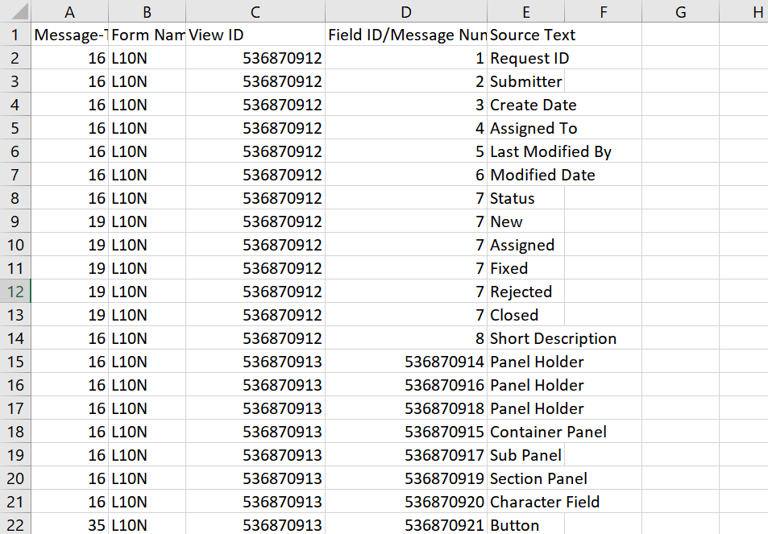

The following table provides information about the columns in the exported TSV file:

| Column name<br> | Description<br> |
| --- | --- |
| Message-Type<br> | The type of the object for which the string is extracted.<br>See[Types of objects exported](https://docs.bmc.com/xwiki/bin/view/Service-Management/Innovation-Suite/BMC-Helix-Innovation-Suite/is254/Developing-Progressive-Web-Applications/Localizing-a-Progressive-Web-Application/#LocalizingaProgressiveWebApplication-TOEO).<br> |
| Form Name/Message ID<br> | The name of the Form or Active Link or Filter<br> |
| VUI ID<br> | The View ID of the Form<br> |
| Field ID/Message Num<br> | Field ID or message number from the Active Link or Filter actions<br> |
| Source Text<br> | The string to be localized. It includes the following:<br>  * Field labels, such as Data Fields, Control Fields, and Selection Fields * Selection alias for fields such as Radio button and Drop-down list * Help text from forms and fields * Alternative text for fields * Message strings from Active Links and Filters |

**Important**

In a TSV file, characters such as comma (,) are replaced by tags such as <comma> in strings.

Because TSV is a delimiter-separated file, characters such as commas or new lines in the file result in localization strings occupying multiple cells and rows instead of just one cell. Therefore, these are replaced by tags as shown in the following table:

| Character<br> | Description<br> | Tag used<br> |
| --- | --- | --- |
| \r\n<br> | Carriage return and new line<br> | <crlf><br> |
| \n<br> | New line<br> | <lf><br> |
| \r<br> | Carriage return<br> | <cr><br> |
| ,<br> | Comma<br> | <comma><br> |

### Types of objects exported

<details class="confluence-expand-macro panel panel-default"><summary><span class="panel-title"><span class="title-text">Click here to see the types of objects currently exported in a TSV file</span></span></summary><div class="panel-body"><table><thead><tr><th scope="col"><div><p>Message type</p></div></th><th scope="col"><div><p>Type of object</p></div></th><th scope="col"><div><p>Description of the string</p></div></th></tr></thead><tr><td><div><p>0</p></div></td><td><div><p>System Message</p></div></td><td><div><p>Belongs to a System message action.</p></div></td></tr><tr><td><div><p>1</p></div></td><td><div><p>Active Link Message</p></div></td><td><div><p>Belongs to an Active Link message action.</p></div></td></tr><tr><td><div><p>2</p></div></td><td><div><p>Filter Message</p></div></td><td><div><p>Belongs to a Filter message action.</p></div></td></tr><tr><td><div><p>3</p></div></td><td><div><p>Active Link Help Text</p></div></td><td><div><p>Belongs to the Help Text property of an Active Link.</p></div></td></tr><tr><td><div><p>4</p></div></td><td><div><p>Form Help Text</p></div></td><td><div><p>Belongs to the Help Text property of a Form.</p></div></td></tr><tr><td><div><p>5</p></div></td><td><div><p>Field Help Text</p></div></td><td><div><p>Belongs to the Help Text property of a Field.</p></div></td></tr><tr><td><div><p>6</p></div></td><td><div><p>Container Description</p></div></td><td><div><p>Belongs to the Description property of a Container.</p></div></td></tr><tr><td><div><p>7</p></div></td><td><div><p>List Menu Definition</p></div></td><td><div><p>Belongs to the Definition property of a List Menu.</p></div></td></tr><tr><td><div><p>8</p></div></td><td><div><p>External Report</p></div></td><td><div><p>Belongs to an External Report.</p></div></td></tr><tr><td><div><p>9</p></div></td><td><div><p>Container Label</p></div></td><td><div><p>Belongs to the Label property of a Container.</p></div></td></tr><tr><td><div><p>10</p></div></td><td><div><p>Container Help</p></div></td><td><div><p>Belongs to the Help property of a Container.</p></div></td></tr><tr><td><div><p>11</p></div></td><td><div><p>Application Help</p></div></td><td><div><p>Belongs to the Help property of an Application.</p></div></td></tr><tr><td><div><p>12</p></div></td><td><div><p>Application About</p></div></td><td><div><p>Belongs to the About property of an Application.</p></div></td></tr><tr><td><div><p>13</p></div></td><td><div><p>Application Help Index</p></div></td><td><div><p>Belongs to the Help Index property of an Application.</p></div></td></tr><tr><td><div><p>14</p></div></td><td><div><p>Flashboards System Message</p></div></td><td><div><p>Belongs to the System Message property of Flashboards.</p></div></td></tr><tr><td><div><p>15</p></div></td><td><div><p>Flashboards Label</p></div></td><td><div><p>Belongs to the Label property of Flashboards.</p></div></td></tr><tr><td><div><p>16</p></div></td><td><div><p>Field Label</p></div></td><td><div><p>Belongs to the Label property of a Field.</p></div></td></tr><tr><td><div><p>17</p></div></td><td><div><p>Field Help Text</p></div></td><td><div><p>Belongs to the Help Text property of a Field.</p></div></td></tr><tr><td><div><p>18</p></div></td><td><div><p>Alternative Text</p></div></td><td><div><p>Belongs to the Alternative Text property of a Field.</p></div></td></tr><tr><td><div><p>19</p></div></td><td><div><p>Selection Alias</p></div></td><td><div><p>Belongs to the Alias property of a Selection Field.</p></div></td></tr><tr><td><div><p>20</p></div></td><td><div><p>Label for Empty Value</p></div></td><td><div><p>Belongs to the Empty Value property of a Label.</p></div></td></tr><tr><td><div><p>21</p></div></td><td><div><p>Alias Singular</p></div></td><td><div><p>Belongs to the Singular property of an Alias Field.</p></div></td></tr><tr><td><div><p>22</p></div></td><td><div><p>Alias Plural</p></div></td><td><div><p>Belongs to the Plural property of an Alias Field.</p></div></td></tr><tr><td><div><p>23</p></div></td><td><div><p>Alias Short Singular</p></div></td><td><div><p>Belongs to the Short Singular property of an Alias Field.</p></div></td></tr><tr><td><div><p>24</p></div></td><td><div><p>Alias Short Plural</p></div></td><td><div><p>Belongs to the Short Plural property of an Alias Field.</p></div></td></tr><tr><td><div><p>25</p></div></td><td><div><p>Entrypoint Label Default New</p></div></td><td><div><p>Belongs to the Default New property of an Entrypoint Label.</p></div></td></tr><tr><td><div><p>26</p></div></td><td><div><p>Entrypoint Label Default Search</p></div></td><td><div><p>Belongs to the Default Search property of an Entrypoint Label.</p></div></td></tr><tr><td><div><p>27</p></div></td><td><div><p>Attach Add Label</p></div></td><td><div><p>Belongs to the Add Label property of an Attach Field.</p></div></td></tr><tr><td><div><p>28</p></div></td><td><div><p>Attach Delete Label</p></div></td><td><div><p>Belongs to the Delete Label property of an Attach Field.</p></div></td></tr><tr><td><div><p>29</p></div></td><td><div><p>Attach Display Label</p></div></td><td><div><p>Belongs to the Display Label property of an Attach Field.</p></div></td></tr><tr><td><div><p>30</p></div></td><td><div><p>Attach Save Label</p></div></td><td><div><p>Belongs to the Save Label property of an Attach Field.</p></div></td></tr><tr><td><div><p>31</p></div></td><td><div><p>Attach File Name Title</p></div></td><td><div><p>Belongs to the File Name Title property of an Attach Field.</p></div></td></tr><tr><td><div><p>32</p></div></td><td><div><p>Attach File Size Title</p></div></td><td><div><p>Belongs to the File Size Title property of an Attach Field.</p></div></td></tr><tr><td><div><p>33</p></div></td><td><div><p>Attach Label Title</p></div></td><td><div><p>Belongs to the Label Title property of an Attach Field.</p></div></td></tr><tr><td><div><p>34</p></div></td><td><div><p>Attach Deselect Label</p></div></td><td><div><p>Belongs to the Deselect Label property of an Attach Field.</p></div></td></tr><tr><td><div><p>35</p></div></td><td><div><p>Button Text</p></div></td><td><div><p>Belongs to the Text property of a Button.</p></div></td></tr><tr><td><div><p>36</p></div></td><td><div><p>Menu Text</p></div></td><td><div><p>Belongs to the Text property of a Menu.</p></div></td></tr><tr><td><div><p>37</p></div></td><td><div><p>Menu Help</p></div></td><td><div><p>Belongs to the Help property of a Menu.</p></div></td></tr><tr><td><div><p>38</p></div></td><td><div><p>Tooltip</p></div></td><td><div><p>Belongs to the Text property of a Button.</p></div></td></tr><tr><td><div><p>39</p></div></td><td><div><p>HTML Text</p></div></td><td><div><p>Belongs to the Text property of HTML.</p></div></td></tr><tr><td><div><p>40</p></div></td><td><div><p>Enums Labels</p></div></td><td><div><p>Belongs to the Labels property of an Enumeration.</p></div></td></tr><tr><td><div><p>41</p></div></td><td><div><p>Text</p></div></td><td><div><p>Belongs to the Text property.</p></div></td></tr><tr><td><div><p>42</p></div></td><td><div><p>Table Selection Column Label</p></div></td><td><div><p>Belongs to the Column Label property of a Table Selection.</p></div></td></tr><tr><td><div><p>43</p></div></td><td><div><p>Table Root Node Alternative Text</p></div></td><td><div><p>Belongs to the Alternative Text property of a Table Root Node.</p></div></td></tr><tr><td><div><p>44</p></div></td><td><div><p>Table Entries Returned</p></div></td><td><div><p>Belongs to the Entries Returned property of a Table.</p></div></td></tr><tr><td><div><p>45</p></div></td><td><div><p>Table Refresh</p></div></td><td><div><p>Belongs to the Refresh property of a Table.</p></div></td></tr><tr><td><div><p>46</p></div></td><td><div><p>Table Delete</p></div></td><td><div><p>Belongs to the Delete property of a Table.</p></div></td></tr><tr><td><div><p>47</p></div></td><td><div><p>Table Report</p></div></td><td><div><p>Belongs to the Report property of a Table.</p></div></td></tr><tr><td><div><p>48</p></div></td><td><div><p>Table Select All</p></div></td><td><div><p>Belongs to the Select All property of a Table.</p></div></td></tr><tr><td><div><p>49</p></div></td><td><div><p>Table Deselect All</p></div></td><td><div><p>Belongs to the Deselect All property of a Table.</p></div></td></tr><tr><td><div><p>50</p></div></td><td><div><p>Table Preference</p></div></td><td><div><p>Belongs to the Preference property of a Table.</p></div></td></tr><tr><td><div><p>51</p></div></td><td><div><p>Table Chunk Next</p></div></td><td><div><p>Belongs to the Chunk Next property of a Table.</p></div></td></tr><tr><td><div><p>52</p></div></td><td><div><p>Table Chunk Previous</p></div></td><td><div><p>Belongs to the Chunk Previous property of a Table.</p></div></td></tr><tr><td><div><p>53</p></div></td><td><div><p>Row Label</p></div></td><td><div><p>Belongs to the Label property of a Row.</p></div></td></tr><tr><td><div><p>54</p></div></td><td><div><p>Row Label Plural</p></div></td><td><div><p>Belongs to the Label Plural property of a Row.</p></div></td></tr><tr><td><div><p>55</p></div></td><td><div><p>Table Auto Refresh</p></div></td><td><div><p>Belongs to the Auto Refresh property of a Table.</p></div></td></tr><tr><td><div><p>56</p></div></td><td><div><p>Table Unread</p></div></td><td><div><p>Belongs to the Unread property of a Table.</p></div></td></tr><tr><td><div><p>57</p></div></td><td><div><p>Table Read</p></div></td><td><div><p>Belongs to the Read property of a Table.</p></div></td></tr><tr><td><div><p>58</p></div></td><td><div><p>Table Not Refresh</p></div></td><td><div><p>Belongs to the Not Refresh property of a Table.</p></div></td></tr><tr><td><div><p>59</p></div></td><td><div><p>Tree Table Custom Value</p></div></td><td><div><p>Belongs to the Custom Value property of a Tree Table.</p></div></td></tr><tr><td><div><p>101</p></div></td><td><div><p>Message</p></div></td><td><div><p>Belongs to the Message property.</p></div></td></tr><tr><td><div><p>102</p></div></td><td><div><p>Data</p></div></td><td><div><p>Belongs to the Data property.</p></div></td></tr><tr><td><div><p>103</p></div></td><td><div><p>Entry Point</p></div></td><td><div><p>Belongs to the Entry Point property.</p></div></td></tr><tr><td><div><p>104</p></div></td><td><div><p>Menu</p></div></td><td><div><p>Belongs to the Menu property.</p></div></td></tr><tr><td><div><p>105</p></div></td><td><div><p>Description</p></div></td><td><div><p>Belongs to the Description property.</p></div></td></tr><tr><td><div><p>106</p></div></td><td><div><p>Guide Help Text</p></div></td><td><div><p>Belongs to the Help Text property of a Guide.</p></div></td></tr><tr><td><div><p>107</p></div></td><td><div><p>App Help Text</p></div></td><td><div><p>Belongs to the Help Text property of an Application.</p></div></td></tr></table></div></details>

## To translate the strings in a TSV file

Send the exported TSV file to a vendor for translation.

**Best practice**  
For accurate translation, we recommend that you send the file to professional translators. (Open source and commercial editors are available for purchase by several third-party vendors.)

After the translation is completed, the TSV file has an additional sixth column which contains all the translations. The TSV file contains localized strings starting from the sixth column. That is, each column represents a single locale.

The following image shows a sample**TSV**file*after translation*:


## To import a TSV file containing translated strings to the AR System Message Catalog Form

You can use the ARMsgCatalogEntryCreator utility that reads the TSV file and creates or updates an entry in the AR System Message Catalog form. The ARMsgCatalogEntryCreator utility accepts only a TSV file as an input.

Perform the following steps to import a TSV file to the AR System Message Catalog form using the ARMsgCatalogEntryCreator utility:

1. Before you use this utility, sort the TSV file four times—first by the Form Name column, next by the Field ID column, next by the View ID column, and finally by the Message Type column.

   **Important**

   Make sure that yourAR System serversupports the locale that you want to translate to. Otherwise, records with corrupted data, instead of the actual data, might get created in the AR System Message Catalog form.
2. Navigate to**<ARSystemInstallDir>/ARSystem/artools**and find the**armsgcatalogentrycreator.bat**file.
3. From a command prompt, run the**armsgcatalogentrycreator.bat**file by using the following command:

   ARMsgCatalogEntryCreator utility command syntaxarmsgcatalogentrycreator.bat [x] [u] [p] [t] [f]ARMsgCatalogEntryCreator utility command examplearmsgcatalogentrycreator.batf<LocationofTSV file>\Translations.tsvu<Username>x<Server Name>

   The following table describes the inputs for the Command Line Interface (CLI) and parameters for connecting to the AR System:

   <details class="confluence-expand-macro panel panel-default"><summary><span class="panel-title"><span class="title-text">Parameter descriptions</span></span></summary><div class="panel-body"><table><thead><tr class=""><th scope="col"><div><p>Parameter</p></div></th><th scope="col"><div><p>Description</p></div></th></tr></thead><tr class=""><td><div><p>x</p></div></td><td><div><p>Name of the server to connect to.</p></div></td></tr><tr class=""><td><div><p>u</p></div></td><td><div><div class="content-wrapper"><p>Name that identifies the user account for the<span>AR System server</span>.</p></div></div></td></tr><tr class=""><td><div><p>p</p></div></td><td><div><p>Password for the user account.</p><p>If you have a blank password, you can ignore this option.</p></div></td></tr><tr class=""><td><div><p>t</p></div></td><td><div><p>TCP port number to connect to.</p><p>If the port number is unknown, use<span class="box"><span class="code">t 0</span></span>.</p></div></td></tr><tr class=""><td><div><p>f</p></div></td><td><div><p>Name of the TSV file.</p></div></td></tr></table><p>Depending upon the row data, an entry is created or updated. For every locale, a separate entry is created per row. For example, a single row entry in the TSV file with three translations (that is, three different locales) creates three new entries for that string.</p></div></details>
4. On the**Cache Settings**page of the Mid Tier Configuration Tool, click**Flush Cache**.

**Important**

The Selection Alias type of object (Message type 19) is handled in a special way. Suppose, there is a Selection Alias type of object called "Status" that has five aliases as New, Assigned, Fixed, Rejected, and Close. For each alias, instead of creating a separate entry, the aliases are combined into a single record.

For example:

{"New":"Neu","Assigned":"Zugewiesen","Fixed":"Fest","Rejected":"Abgelehnt","Closed":"Geschlossen"}

In this example, each alias is separated by a comma (,) and contains two values—the left one is the actual string that is being exported and the right one is the translated string.

**Important**

In the TSV file, columns after the Source Text column hold the translated data. If the translated data column for a language has the*same string*as the Source Text (English) column, the ARMsgCatalogEntryCreator utility does not create a record for the same string in the AR System Message Catalog Form.

For example, if you have a string 'ALL' in the English and the Russian language columns, the utility skips creating a new record for the string 'ALL' for the Russian language column.

This is applicable for all message types except**19 (Selection Field)**as all the values are combined in a single record.

## Best practices for localizing a progressive web application

* Use independent forms only so that the related Active Links and Filters are also considered.
* For the form fields that you want to localize, set the value of the "Localize Label" property in Display Properties to**True**.
* When you delete a package definition, the package definition is deleted, but the extracted strings are not deleted from the localization database. If you create a package definition with the same name as the deleted one and export, you get the extracted strings from the deleted package definition as well. To avoid this issue, we recommend that you explicitly delete those strings from the database.

---

## <a id="developing-pwamanaging-attachments-using-a-remote-formmd"></a>Developing-Pwa/Managing-Attachments-Using-A-Remote-Form.md

As an application developer, you can define an attachment pool by using a Table field in Progressive View to enable end users to add any number of attachments in Progressive Web Applications (PWA). An attachment pool contains attachment fields that enable users to store text, graphics, audio, or video with a request.  
To create an attachment pool, in Developer Studio, you must first create a regular form with an attachment pool in Standard View, and then associate it with a Table field of type attachment in Progressive View.

If you create an attachment pool as described in[Managing-attachments-in-interfaces-by-creating-attachment-pools](https://docs.bmc.com/xwiki/bin/view/Service-Management/Innovation-Suite/BMC-Helix-Innovation-Suite/is254/Developing-applications-by-using-Developer-Studio/Developing-the-application-interface/Creating-and-managing-fields/Managing-attachments-in-application-interfaces/Managing-attachments-in-interfaces-by-creating-attachment-pools/), end users can add only the number of attachments you specify in Developer Studio. Any change in the number of attachment fields, requires you to add more attachment fields in the Attachment Pool field in Developer Studio.

Related topics

[Enabling-Progressive-Views-for-forms-by-using-Centralized-Configuration-Settings](https://docs.bmc.com/xwiki/bin/view/Service-Management/Innovation-Suite/BMC-Helix-Innovation-Suite/is254/Developing-Progressive-Web-Applications/Enabling-Progressive-Views-for-forms-by-using-Centralized-Configuration-Settings/)

[UI-layout-of-Progressive-Web-Applications](https://docs.bmc.com/xwiki/bin/view/Service-Management/Innovation-Suite/BMC-Helix-Innovation-Suite/is254/Developing-Progressive-Web-Applications/UI-layout-of-Progressive-Web-Applications/)

[Customization-best-practices-for-developing-PWA](https://docs.bmc.com/xwiki/bin/view/Service-Management/Innovation-Suite/BMC-Helix-Innovation-Suite/is254/Developing-Progressive-Web-Applications/Customization-best-practices-for-developing-PWA/)

[Workflow-considerations-for-attachment-pools](https://docs.bmc.com/xwiki/bin/view/Service-Management/Innovation-Suite/BMC-Helix-Innovation-Suite/is254/Developing-applications-by-using-Developer-Studio/Developing-the-application-interface/Creating-and-managing-fields/Managing-attachments-in-application-interfaces/Workflow-considerations-for-attachment-pools/)

The following video (5:15) shows how to create attachment pools that allow variable number of attachments in progressive web applications:

[🎥 Watch Video: https://www.youtube.com/watch?v=sFkBJ-cjcH0](https://www.youtube.com/watch?v=sFkBJ-cjcH0)

<https://youtu.be/sFkBJ-cjcH0>

To create an attachment pool in PWA, you must perform the following high-level steps:  


| 1<br> | [Create a regular form in Standard View with an attachment pool](https://docs.bmc.com/xwiki/bin/view/Service-Management/Innovation-Suite/BMC-Helix-Innovation-Suite/is254/Developing-Progressive-Web-Applications/Managing-attachments-in-Progressive-Web-Applications-by-using-a-remote-form/#ManagingattachmentsinProgressiveWebApplicationsbyusingaremoteform-regular_form).<br> |
| 2<br> | [Create a table field of type attachment in Progressive View](https://docs.bmc.com/xwiki/bin/view/Service-Management/Innovation-Suite/BMC-Helix-Innovation-Suite/is254/Developing-Progressive-Web-Applications/Managing-attachments-in-Progressive-Web-Applications-by-using-a-remote-form/#ManagingattachmentsinProgressiveWebApplicationsbyusingaremoteform-table_field_type_attchmnt).<br> |
| 3<br> | [Map the table field to the regular form](https://docs.bmc.com/xwiki/bin/view/Service-Management/Innovation-Suite/BMC-Helix-Innovation-Suite/is254/Developing-Progressive-Web-Applications/Managing-attachments-in-Progressive-Web-Applications-by-using-a-remote-form/#ManagingattachmentsinProgressiveWebApplicationsbyusingaremoteform-map_fields).<br> |
| 4<br> | [Define active links to enable end users to save the attachments and to view them.](https://docs.bmc.com/xwiki/bin/view/Service-Management/Innovation-Suite/BMC-Helix-Innovation-Suite/is254/Developing-Progressive-Web-Applications/Managing-attachments-in-Progressive-Web-Applications-by-using-a-remote-form/#ManagingattachmentsinProgressiveWebApplicationsbyusingaremoteform-activelink_savebutton)<br> |
| 5<br> | [Validate whether the attachment pool works by logging in as a user.](https://docs.bmc.com/xwiki/bin/view/Service-Management/Innovation-Suite/BMC-Helix-Innovation-Suite/is254/Developing-Progressive-Web-Applications/Managing-attachments-in-Progressive-Web-Applications-by-using-a-remote-form/#ManagingattachmentsinProgressiveWebApplicationsbyusingaremoteform-validate)<br> |

The following concept diagram explains how the table field set to type Attachment that you must define in Progressive View in Developer Studio maps to the remote form you must define in Standard View in Developer Studio.


## Before you begin

* You must have a basic understanding of defining workflows. For more information see[Defining-workflow-to-automate-processes](https://docs.bmc.com/xwiki/bin/view/Service-Management/Innovation-Suite/BMC-Helix-Innovation-Suite/is254/Developing-applications-by-using-Developer-Studio/Defining-workflow-to-automate-processes/).
* You must know how to create active links. For more information, see[Defining-Set-Fields-actions-to-assign-values-based-on-conditions](https://docs.bmc.com/xwiki/bin/view/Service-Management/Innovation-Suite/BMC-Helix-Innovation-Suite/is254/Developing-applications-by-using-Developer-Studio/Defining-workflow-to-automate-processes/Specifying-workflow-actions/Defining-Set-Fields-actions-to-assign-values-based-on-conditions/).

  **Best practice**  
  To create an application where you allow end users to delete data from the main form that contains attachments in the Progressive View, make sure that the related data from the remote form is also deleted. To delete the remote form data, we recommend that you create a strong association between the parent form and the remote form with the same qualification as that of the table field of type attachment. This makes it possible for users to perform a cascade delete. For information about associations, see[Creating-associations](https://docs.bmc.com/xwiki/bin/view/Service-Management/Innovation-Suite/AR-System/ars221/Administering/Managing-data-and-objects/Defining-data-associations-among-forms/Creating-associations/).

## To create an attachment pool for PWA by using a remote form

### Step 1: To create a regular form with an attachment field in Standard View

1. Open Developer Studio and create a regular form in Standard View.  
   Select**New > Regular Form  
   **
2. Save the form with a name.  
   Use a name that will help you search for the form easily. For example,**AttachmentFormSV**.  
   We use this form, that you just saved, in the Standard View as the remote form which stores the attachments.
3. Under**Composite Fields**, drag**Attachment Pool**and drop it into the view.  
   
4. Select the attachment pool and in the properties, under**Attributes**, click the ellipsis next to**Attachment Fields**.  
     
   The Attachment Fields dialog box opens.
5. Click**New**.  
   An attachment field appears.  
   You can rename the field to identify it easily; for example,**AttachmentFieldSV**.
6. To add the field to the attachment pool field, click**OK**.  
   The regular form displays the attachment field.  
   
7. At the bottom of the view editor, click the view tab.
8. (*Optional*) Under Properties, edit the**Label**and**Name**properties to rename the view.
9. Set default values for all the required fields.  
   Required fields are in bold.  
     
   The preceding image shows an example in which. in Properties, we set a**Default Value**to**$USER$**for**Submitter**and**NA**for**Short Description**.
10. Click**Save**().

### Step 2: To create a table field of type Attachment

1. In Developer Studio, select**Form > Create New View**.  
   The Create New View dialog box opens.
2. In the**View Type**list, select**Progressive**.  
     
   A new view is created; For example,**DefaultAdministratorView2\_c**.
3. (*Optional*) Under Properties, edit the**Label**and**Name**properties to rename the view.
4. Drag and drop the**Table - List View**field.
5. On the**Properties**panel, expand the Display property group.
6. Click**Display Type**and then select**Attachment**from the list.  
     
   The option**Attachment**is available only when the view is set to Progressive.

### Step 3: To map the table field to the regular form created in Standard View

1. In the Properties tab, next to**Tree/Table Property**, in the**Value**column, click the ellipsis () button.  
     
   The Tree/Table Property dialog box opens.
2. On the**Tree/Table Property**dialog box, next to the**Form Name**field, click the ellipsis ().  
   The Form Selector dialog box opens.
3. Select the regular form in the Standard View that you created.  
   The following image shows the example in which we select**AttachmentFormSV**.  
     
   This regular form acts as the remote form that holds the attachment data.  
   When you close the Form Selector dialog box, you see that the Tree/Table Property dialog box with the available fields.  
   
4. Add the field of type**Attachment**and any other required columns to the table.  
   In this example, we add the following fields.  
     
   You must map at least one field of type Attachment.
5. Click the ellipsis () button in the Local Field Mapping column.  
     
   The Field Selector dialog box opens.  
   You might have to scroll sideways to view the Local Field Mapping column.
6. Select the field of the same data type and click**OK**.  
     
   For example, for the column with title Request ID, you can select**Request ID\_c**.
7. Add the**Local Field Mapping**for all columns in the table except the one that has Data Type set to**Attachment**.  
   This is required to pass data from the Progressive View form back to the regular form in Standard View.
8. Select the**Foreign Key**check box for at least one column.  
   The**Qualification**field is automatically populated and this qualification is used to fetch the data from the remote form. You must make sure that the**Foreign Key**is a unique identifier.
9. Click**OK**and save the form.  
   In this example, save the form as**AttachmentFormPV**.
10. (*Optional*) In**Display Properties**, set a value for**Size of Chunk**to define the number of attachments that are displayed in the PWA.  
    When end users add more attachments than this number, a**Show More**option appears.
11. Define an active link to enable end users to save the attachments as described in[Enable end users to save the attachments by defining an active link](https://docs.bmc.com/xwiki/bin/view/Service-Management/Innovation-Suite/BMC-Helix-Innovation-Suite/is254/Developing-Progressive-Web-Applications/Managing-attachments-in-Progressive-Web-Applications-by-using-a-remote-form/#ManagingattachmentsinProgressiveWebApplicationsbyusingaremoteform-activelink_savebutton).

## Enable end users to save the attachments and refresh the form by using active links

You must create a button to save attachments and also add an active link so that end users can view uploaded attachments.

### Step 1: To create buttons to save and refresh in the Progressive View

1. In the Progressive View, under**Display Fields**, drag and drop**Button**into the view.  
     
   This is the button that end users click to save their attachments after adding them to the Progressive View form.
2. Select the new button and update the following required properties:
   1. **Database > Name**
   2. **Database > ID**  
      Optionally, you can enter ID as 1001 to enable saving the attachments. In such a case, you do not need to define an active link to commit changes as described later in this procedure.
   3. **Display > Button Label**Change the button label to**Save**.
   4. **Permissions > Permissions**.  
      Add permissions as required.
3. Add another button.
4. Modify the properties as required and change the label to**Refresh**.

### Step 2: To create active links to commit changes

1. Create a new active link.  
   Select**New > Active Link**.  
   
2. Select a server in the Select Server dialog box.  
   The Untitled Active Link screen appears.
3. In the Associated Forms section, click**Add**.  
   The Form Selector dialog box opens.
4. Select the form in the Progressive View which has the button.  
   In this example, select**AttachmentFormPV**.
5. In the Execution Options section, beside the**Button/Menu Field**, click the ellipsis () button.  
   The Field Selector dialog box opens.
6. Select the button for which you want to create the active link.  
   In this example, it is the button for which you have set the**Button Label**value to**Save**. Whenever this button is clicked this active link is run.
7. In the**If Action**section, right-click and select**Add Action > Commit Changes**.
8. In the**If Action**section, right-click and select**Add Action > Open Window**.
9. In the**Window Type**list select**Display Directly**.
10. Beside the**Form View Name**field, select the ellipsis () button.  
    The View Selector dialog box opens.
11. Select the name of the view that contains the button for which you want to add the active link.  
    In this example, select**DefaultAdministratorView2\_c**.

### Step 3: To create a qualification for the active link

1. Click the ellipsis () button beside the**Qualification**field.  
   The**Expression Editor**dialog box opens.
2. In the**Forms**list, select the form in Progressive View which contains the button.
3. In the**Available Fields**list, select**Request ID**.  
   You can see the qualification being created in the field.
4. Complete the qualification.  
   In this example, enter '**Request ID' = $Request ID$**as this field is also mapped in the remote form.  
     
   Retain the default settings and save this active link.  
   In this example, save this as AttachmentAL.  
   After the end users add attachments in the PWA and click**Save**, this active link saves a record in the remote form along with the attachments, and then reloads the PWA entry and all of its attachments in view mode.

### Step 4: Create an active link to refresh the view

1. Create a new active link.  
   **New > Active Link**  
   
2. Select a server in the Select Server dialog box.  
   The Untitled Active Link screen appears.
3. In the Associated Forms section, click**Add**.  
   The Form Selector dialog box opens.
4. Select the form in the Progressive View which has the button.  
   In this example, select**AttachmentFormPV**.
5. In the Execution Options section, select**Window Open**.  
   
6. Beside the**Button/Menu/Field**, click the ellipsis () button.
7. The Field Selector dialog box opens.
8. Select the button for which you want to create the active link.  
   In this example, it is the button for which you have set the**Button Label**value to**Refresh**.
9. In the**If Action**section, right-click and select**Add Action > Change Field**.
10. Click the ellipsis () button beside**Field**and select the table field.
11. Select the check box beside**Refresh Tree/Table**.
12. Save the active link.

### Step 5: To validate whether the attachment pool works

1. Refresh your browser cache.  
   **<*serverName*>:8080/arsys/shared/config/config.jsp**
2. Click**Sync Cache**.  
   You must perform this step every time you make changes in Developer Studio.
3. In a browser, sign in to PWA with valid credentials.  
   **<*serverName*>:8080/arsys/pwa/#/login**
4. Change the URL to include the Progressive View form that you created in Developer Studio.  
   **<*serverName*>:8080/arsys/pwa/#/forms/<*serverName*>/<*formName*>/<*viewName*>**  
   In this example, the URL is**<*serverName*>:8080/arsys/pwa/#/forms/<*serverName*>/AttachmentFormPV/DefaultAdministratorView2\_c**

   **Important**

   If there are any required fields in the remote form in the standard view, you must make sure that they are mapped to the form in Progressive View so that users are able to view them in PWA. If required fields exist and are not displayed, users will not be able to complete the form in PWA.
5. Attach a few files and click**Save**.  
   The attachments are saved and displayed.

**Important**

The size of the attachment that end users can upload is determined by the**Field > Max Size**property in the remote form. For more information about this property, see[Managing-attachments-in-interfaces-by-creating-attachment-pools](https://docs.bmc.com/xwiki/bin/view/Service-Management/Innovation-Suite/BMC-Helix-Innovation-Suite/is254/Developing-applications-by-using-Developer-Studio/Developing-the-application-interface/Creating-and-managing-fields/Managing-attachments-in-application-interfaces/Managing-attachments-in-interfaces-by-creating-attachment-pools/).

---

## <a id="developing-pwaorganizing-fields-by-using-collapsible-and-accordimd"></a>Developing-Pwa/Organizing-Fields-By-Using-Collapsible-And-Accordi.md

As a developer working on PWA screens, you can simplify the user experience by making use of collapsible or accordion panels to organize the options. This structure declutters the screen and helps users quickly find what they are looking for.

By using these panels, you can also make the screen more visually appealing and easier to navigate, which can lead to higher engagement and user satisfaction.

Related topic

[Flow-panel-holders-for-Progressive-Web-Applications](https://docs.bmc.com/xwiki/bin/view/Service-Management/Innovation-Suite/BMC-Helix-Innovation-Suite/is254/Developing-Progressive-Web-Applications/Flow-panel-holders-for-Progressive-Web-Applications/)

[Panel-holder-display-types-in-Progressive-View](https://docs.bmc.com/xwiki/bin/view/Service-Management/Innovation-Suite/BMC-Helix-Innovation-Suite/is254/Developing-Progressive-Web-Applications/Panel-holder-display-types-in-Progressive-View/)

[Creating-resizable-panes-in-Progressive-Web-Applications](https://docs.bmc.com/xwiki/bin/view/Service-Management/Innovation-Suite/BMC-Helix-Innovation-Suite/is254/Developing-Progressive-Web-Applications/Creating-resizable-panes-in-Progressive-Web-Applications/)

Scenario

At Apex Global, the Change Request screen has some fields that require general information such as change request location and the employee name. Seth, a developer working for Apex Global, organizes the options on this screen into different panels. The users can opt to open only those panels with fields to which they are adding information while closing the other panels. By using these panels, users can have a clutter-free and well-organized view when working with change requests.

The following animation shows an example where the fields are grouped into three panes within a Collapsible Panel Holder and displayed on a PWA screen:  


## To organize fields by using collapsible or accordion panels in Progressive Web Applications

1. In Developer Studio, create a progressive view.  
   1. Select**Form > Create New View**.  
      The Create New View dialog box is displayed.
   2. From the**View Type**list, select**Progressive**.  
        
      Developer Studioautomatically creates a Section Panel.
2. Perform one of the following steps:
   * From the Palette pane, drag a Collapsible Panel Holder into the view.  
     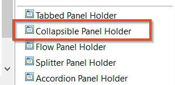  
     The view shows a Collapsible Panel Holder with two panels within it.  
     
   * From the Palette pane, drag Accordion Panel Holder into the view.  
     Accordion panels are similar to collapsible panels except that at least one panel is always open.
3. Click**Save**.
4. Open the Mid Tier configuration tool and sync the cache.  
   **http://<*MidtierHostName*>:<*PortNumber*>/arsys/shared/config/config\_cache.jsp**

## To test and review the panels in Progressive Web Applications

1. In a browser, log in to PWA.  
   (*On-premises*)**http://<*midtierHostName*>:<*portNumber*>/arsys/pwa/#/login**(*SaaS*)**http://<*helixBaseURL*>/arsys/pwa/#/login**
2. Change the URL to include the Progressive View form that you created in Developer Studio.
3. (*On-premises*)**http://<*midtierHostName*>:<*portNumber*>/arsys/pwa/#/forms/<AR\_Server\_Name>/<formName>/**

   (*SaaS*)**http://<*helixBaseURL*>/arsys/pwa/#/forms/<AR\_Server\_Name>/<formName>/**
4. Confirm that the collapsible and accordion panels hide or show options.

---

## <a id="developing-pwapanel-holder-display-types-in-progressive-viewmd"></a>Developing-Pwa/Panel-Holder-Display-Types-In-Progressive-View.md

As a developer, you must first build the application interface by using various basic elements such as panels and panel holders before you can add elements such as fields and buttons. Panel holders are basic structural elements you can create by using Developer Studio. The following display types are available for panels in a panel holder.

## Tabbed

In a tabbed display, only one panel in the container is visible at a time. To view each panel, users click its tab or press the Tab key.  
  
Only the horizontal orientation is available for tabbed panel holders. Tabbed panel holders do not have Border Thickness or Border Color properties.

Related topics

[Flow-panel-holders-for-Progressive-Web-Applications](https://docs.bmc.com/xwiki/bin/view/Service-Management/Innovation-Suite/BMC-Helix-Innovation-Suite/is254/Developing-Progressive-Web-Applications/Flow-panel-holders-for-Progressive-Web-Applications/)

[Setting-panels-to-scroll-at-different-rates-in-Progressive-Web-Applications](https://docs.bmc.com/xwiki/bin/view/Service-Management/Innovation-Suite/BMC-Helix-Innovation-Suite/is254/Developing-Progressive-Web-Applications/Setting-panels-to-scroll-at-different-rates-in-Progressive-Web-Applications/)

**Tabbed panel holder**


If a tabbed panel holder has more tabs than fit in one row, Developer Studio hides the remaining tabs. However, you can scroll the tabs to see them.  
  
In browsers, multiple rows of tabs are not supported. Instead, if the number of tabs exceeds the width of the panel holder, left and right arrows appear. Users click the arrows to scroll to the tabs that extend beyond the width of the holder. The focus remains on the current panel when scrolling occurs.

**Best practice**  
A performance impact might occur if the tabbed panel contains a table that is populated with large amount of data. We recommend using collapsible, or Accordion style panel.

## Collapsible (stacked)

In a collapsible display, multiple panels in a panel holder can be viewed at the same time, either horizontally or vertically.  
  
By default, if a collapsible panel holder contains space that is not allocated to a panel, the extra space is added to the bottom or right-most expanded panel in the holder. This prevents white space from appearing in the holder itself. In addition, you can control the allocation of extra space by assigning priorities to panels and by using the Fit to Content property. For more information, see[Avoiding-scroll-bars-in-panels](https://docs.bmc.com/xwiki/bin/view/Service-Management/Innovation-Suite/BMC-Helix-Innovation-Suite/is254/Developing-applications-by-using-Developer-Studio/Developing-the-application-interface/Grouping-fields-with-panels/Avoiding-scroll-bars-in-panels/)).  
  
At design time, collapsible panels appear to have a fixed size. But at runtime, as various panels in the holder are expanded and collapsed by users or hidden and unhidden by workflow, the other panels in the holder shrink and expand to accommodate the changing space in the holder. This can create visual differences between panels at design time and runtime.  
  
**Collapsible panel holder**


## Accordion

An accordion display is similar to the collapsible pane except that the content of one panel in the panel holder is always visible. Only the headers for the remaining panels are visible. Headers cannot be hidden in accordion displays.  
  
At runtime, when you click a panel header, that panel is expanded to display its contents. If another panel was open, it is automatically collapsed and only its header is visible.

## Splitter

In a splitter display, multiple panels in a container can be viewed at the same time, either vertically or horizontally, and can be dynamically resized by dragging a splitter control on either side.  
  


Flow panel holder for Progressive Web Applications

A Flow panel holder is available when you enable a Progressive view for your form. For more information, see[Progressive View quick start guide](https://docs.bmc.com/xwiki/bin/view/Service-Management/Innovation-Suite/BMC-Helix-Innovation-Suite/is254/Getting-started/Key-concepts/Application-development-overview/Progressive-View-quick-reference-guide/).

The Flow panel holder supports the properties required to enable a progressive view. Use a Flow Panel holder for aligning fields on a form. You can also group the fields to ensure correct alignment of fields on a form. This panel does not have a panel header, and supports Container panel holder (Default), Sub Panel holder, and Section Panel holder types.

The following video (4:52) demonstrates creating Fixed panels in Developer Studio when you enable progressive views for a form:

[🎥 Watch Video: https://www.youtube.com/watch?v=m33BWG-mEoI](https://www.youtube.com/watch?v=m33BWG-mEoI)

<https://youtu.be/m33BWG-mEoI>

The following video (13:03) demonstrates creating complex layouts with flow panels:

[🎥 Watch Video: https://www.youtube.com/watch?v=TnwUS2RF28Q](https://www.youtube.com/watch?v=TnwUS2RF28Q)

[https://youtu.be/TnwUS2RF28Q](https://youtu.be/TnwUS2RF28Q)

### Panel arrangement sequence

The panels are arranged in the following sequence or hierarchy:  
Flow Panel holder > Container Panel Holder > Container Panel> Sub Panel Holder > Sub Panel > Section Panel Holder > Section Panel > Section Panel Holder > Section Panel > fields


* A progressive view can hold only a Container type Flow panel holder and a Fixed panel holder.
* By default, a Flow panel holder has one panel as a child panel.
* You can change the read-only property type of any panel only when you change the property type of Flow panel holder.

**Tip**

When you add Flow Panel Holder to the Progressive View from the palette in Developer Studio, the flow panel holder is represented by a panel holder in the Outline pane.

In the following example figure, the flow panel holder is represented by**Panel Holder\_c**enclosing a panel named**Panel\_c**:


### Container Flow panel holder

* By default, a Container type Flow panel is added to a Flow panel holder.
* You can delete a Container Flow panel only if you remove all progressive views.
* A Container Flow panel holder can have one or more Sub panels.

### Section Flow panel holder

* You can add a Section Flow panel holder only under a Sub panel or Section panel.
* A Section panel can either have a Section type Flow panel holder or non-panel fields.
* The Section Flow panel holder added by framework contains only Section panel as children.

### Sub panel holder

The Sub panel holder behaves as a Section panel on the desktop client. However, it is displayed as a tab on a mobile client.

* You can add a sub panel holder only under the container panel.
* A sub panel holder can have one or more sub panels.

For more information about developing PWA, see[Developing-Progressive-Web-Applications](https://docs.bmc.com/xwiki/bin/view/Service-Management/Innovation-Suite/BMC-Helix-Innovation-Suite/is254/Developing-Progressive-Web-Applications/).

---

## <a id="developing-pwarebranding-progressive-web-application-screensmd"></a>Developing-Pwa/Rebranding-Progressive-Web-Application-Screens.md

You can rebrand Progressive Web Application (PWA) screens according to your companystandards and requirements by using custom cascading style sheet (CSS) files and images.

Important

If you are viewing the PWA screens fromSmart IT, then the banner, logo, and favicon are from withinSmart ITand so you must use the rebranding utility in classicSmart ITto change the banner, logo, and favicon. To learn more, see[Rebranding Smart IT on the Universal Client](https://docs.bmc.com/xwiki/bin/view/Service-Management/IT-Service-Management/BMC-Helix-ITSM-Smart-IT/smartit221/Setting-up-and-going-live/Deploying-Smart-IT-to-your-users/Rebranding-Smart-IT-on-the-Universal-Client/).

Related topics

[Developing-Progressive-Web-Applications](https://docs.bmc.com/xwiki/bin/view/Service-Management/Innovation-Suite/BMC-Helix-Innovation-Suite/is254/Developing-Progressive-Web-Applications/)

[Rebranding Smart IT on the Universal Client](https://docs.bmc.com/xwiki/bin/view/Service-Management/IT-Service-Management/BMC-Helix-ITSM-Smart-IT/smartit221/Setting-up-and-going-live/Deploying-Smart-IT-to-your-users/Rebranding-Smart-IT-on-the-Universal-Client/)

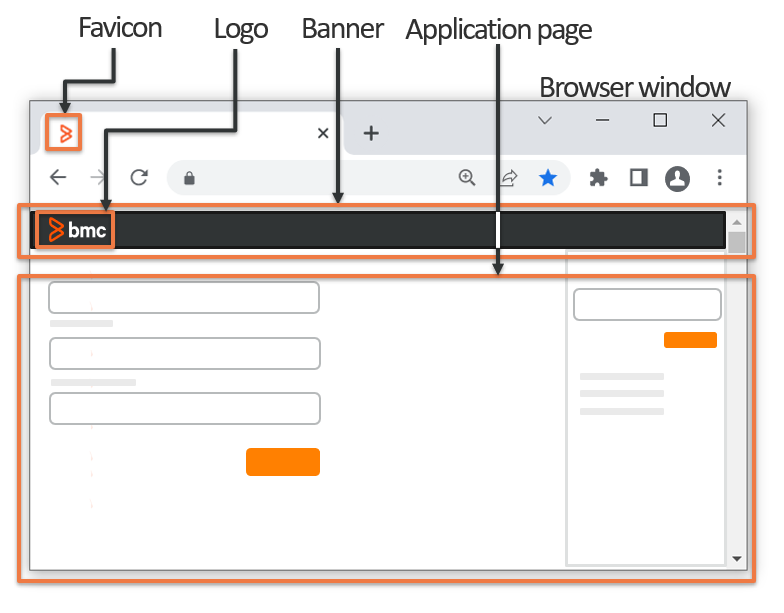

## Before you begin

Before you begin the rebranding process, you must ensure the following:

* (*for on-premises deployments*)You must have**AR Administrator**,**groupID:1**permissions to be able to access the PWA style configuration page.
* (*for Saas*) You must submit a request to be able to access the PWAstyle configuration page.
* You must know how to work with or create a new CSS file.
* You must first set custom values and settings in a CSS file that you can then upload by using the rebranding config page.
* You must have a favicon file of the type ICO which you can upload from the rebranding config page.
* The custom CSS file must be named**custom.css**and the favicon file must be named**favicon\_pwa.ico**.  
  You can rename a JPEG or PNG file with the file extension of**.ico**to create a ICO file.
* In a multiple server environment, you must make sure that one of the servers is set as the home server or that the value for the home server should not be NULL in the Mid Tier configuration.
* If you want to add a custom image, you must either convert the image to Base64 format or have a URL to the image location.  
  You can use free online tools such as[Base64.guru](https://base64.guru/converter/encode/image)to convert an image to Base64 format.

  For example, the following image and its Base64 format in plain text are shown:

  | Image in PNG<br> | Image as plain text Base64<br> |
  | --- | --- |
  | <br> | iVBORw0KGgoAAAANSUhEUgAAB4QAAAGOCAYAAAB/k772AAASv3pUWHRSYXcgcHJvZmlsZSB0eXBlIGV4aWYAAHjapZpZlhs5kkX/sYpeAmYYlgPAgHN6B738vo8RUqWU+qisikiRDA7ugNmzNzgz3P/73xf+h59am4XahvXZe+Snzjrz4oHFr5/1uU2xfm4/P1bj+H72l+eD3e+HmfvCffn+QP+6Tz+e//7Aj/u0eNT+eqDz/cL+9YVZv+6z/Xag7xMVrSjzwL8PNL8PVPLXC+n7AOtrW7FPG3/dwr5f99+f/yoD/4Judoyfw6X5/ebf/q6D6nnjPCXnW1KJ3JaSvxZQ9C+HsnghcRuL8cbEk3pcuW2lf6+EgvypTj9/OGF4Wmr945t+6crPR791q3yXIvzerZq/31J+K3L/ef/H50Nqf+7Kp/R/OXO1nzD55fl00veKfqu+/r3n9j57Zherdkrdvzf1Y4ufR7yPvlSd2gJL62C1gyHjXr+TXwPVByg4/dv8njRTpl0v1eRppZfu5/6kwxJrviEPHuR8cvk8aWXkmU9R/6p+08ujzOLF6Of5tL2W/HMt6XPaGU/4nM04syfemhMHEwT+8W/4px94T1hNSbWk9emrvzmr2CxDndMtb6Mj6X0XtX0K/OP39x/1tdDBpiprRCaF3V+H2C39iwnKp9GFNzbuv4CXhn8fgBJx6sZimIya6FoqLfUUR84jJQppNGix9Fxq3nQgtZadReZaSqc3TBKn5iMjfd6aW+bpwPOQGZ1gssqgN7MsmgXpgZ9RDQytVlptrfU2mrXZVi+99tZ7H12kuEYZNYw2+hjDxhzLilVr1m2Y2bQ18yyQZpt9jmlzzrU45+LIi08v3rDWzrvsulvYfY9te+51gM+pp51+xrEzz/LsxeEP7z7cfPq66QKlW2+7/Y5rd971gNor4dXXXn/j2Ztv/ezad1v/9vsPupa+u5Y/ndIbx8+u8ewYPw6RRCdNPaNhOdREx4daAKCzehYt1ZrVOfUszsxUtMwim3rmSR2jg/Wm3F760buQvzqqzv1XfQuj/tK3/J92Lqh1/7Bzf+/bn7rmkqHz6djXFKqosTB9t3H+vDflKs86B2YUR1reNwQd+ky9nH3HqmhlH+nVdIbDUm1sdsVu9y6nG0+7z8Te4oO1GvgBD1kVu747xBb7zb3sXu7z+BocllhRczvgaeTezdI277fUWdj96LedCFp2fLe1XS7ckoKVbr7qtZTZ7ry1jtEPS/louVkDCT6NY597tcVC3zim06T4wJ+hvewu1DXdKPdKKZ/V4jwHsv2A0t7qXubdh52OXdcuY9G87fuq17vwfja2u58TKM+z5mtXlqzln70351vp+m3lei90Ib3lI7Vy4Jx17ot+akUIFsbgzJxnC5033/jqenXTh7kuj+2d/m4a7HRX7au9SveuuZ+ZPN6ICMx0oCbPOvgc4VT3nKvlYTfvTis45diL9w3qBiDklUDe9XmMk2xrnK4N8LzXm0zWghhvcOTp3Q6sPdU3F8MSJ1DoqnKu/bTmQK1lPEaekz8G5Msu2/J13tiDLS+n2N1zfRlMMVx31bl2WusaEF3J3TYfVTETgxJvouf9LNZ2bk258N6msscWhPkG8QLaaaY7W/Jp/7pfxxmENyb9PcYwpc2cCnvnHvMKR4z1woYV9la71ttJU3B3GzetoXnMrhr5vIbQj3runO/CAGnx1KNwhgTbaGmHMjuTCO8y/xcGujZQ9pNXhoRSHr2yk8a+qBWr9MQdMwJdFM5hazCo1AN7DIU9n/vSu5wNPjq9xvM4ZXlFoz4PEzjbmzWDV4Afte15T/d0H78U/eYAo85yqHCWU8jwLeu5WnldXlW0y8yyWWzpPgCEnh2gDhrZZN23GW3KWL+K2zjPywPs9S7pZcHE223yOH3S60q7K3THAzjwZm1tD4zN9Th3K3t6DR0C1lqtZsh8l6R69svpwEpmW9nzoDV2UNRKi419Vh0Trk/tGiWgkh7gAwAYuxVx2FRldoUm4lgbg23l7lcwS+oeJqTdMRpP3WwvMjnCvWemJqwHJXRr6EuHySYgP1RBT2D3tO15nZmOkC5EnW4HVQZwWeOe9G5+DmZhLQZyQCx8OKEYKnek7LfV8hx+nz0zgXUcmKQPw5ztAYHVI5u37gUgNCKGMR6shz4OWtPaGAumM/hiqrswUIPGZ2QR0Uansrw2CC4YTqgvbz8DCbUVaHTU4hIL3jDxBWFgpy0MJlV/aA8v1VukKquArc+Cx8gVQgUJqz+A46GxqyJ3ClL3oYh0BI141H/PXn0gDmgYBIk8+D2Qe7WLNoD6NdzvBgIRgbS7inNaWFGTAQEXbzMjVsz95K1YbElDtIY4K9/0loA1jUFwGPjdRJUjgDzMc+7H8Vq0n5OCZag/OdhaZTCrpAZIss93WoTE7cGBaNG6HVa1TkwaC39Ul0woLaSgIB4BYY8crm4E4TCl8Y0GHW5m9wJOg93REdEeqn6anzxHDMwWRhdt5nwgmhlat/RNuQy6qvQDaOeGA9JA1sYo+UGQSwIvqOviT5rJipCi6f0UWLPAAbE+yg3Hv06g65vp2Q9a77AVbN1gb4cZkbQCmtrKHGy8W3D+jl3qTujAppg/ZC2x8PISHIXC+J11U87JdHCi9KBvBBDaJO4OP8jheK8GlujawEOgEQ/UkgWSiCZQYaClkTPLDjmyiaJBNRASw38XW0obvIC34syaoXtIhJbjl+TqKCRclhebzujZZ1xR6gNgIMvawAjqx7MDBQLp0O1IdA0AIIML3vR3kQVG9i4K95DYVtZRYm0ZqPdM8ZP6PTjubv1zCgcD+LCQ3Uu7oGO3hiTMvnNl5402TyRn4DcWCmZHBPXU+pwxFWegKoZqJGdmsU0hZdmTIX/1+rnMBXhjyDP0URaLPoCK8LAl2ZOiYJnkLDr2oOJTMtTzMlkEsm+AbfQynYHabBTSPb5oKhsGK1kXHeCCB10WXp1I+xbjcVCQwliB402NEo0BY/byR947h4TKUGaWZMf7l/rv+rCaOBeGCOuASMEreE7qgDBaDORRtAIdNBEoGz9CNehaIBb6vMtFqwlAMDEXAsAtsFScc08MEw5XHH0CRt6TZBmXCYfjYIlXNGlAmbdDTzAjo0YGIfNUcMPmVxz4ZFYAcI/VImAFCAfZYij6qIypp9HO5IwT3z1L7fSKqZa3GhMex0bjS3jbk6gbUpGgLzMPOFIgj17gJGAJ3EEyaGcybPWixUweFtzEOjhV+on0J1H6RP+oCZ4Y2FgPEevVqTyfSyKGgi9g+atjcQSQ21DVwuZHnKPkhpJyYlgPX9rc+2SAJrFAgDwZeve3M6a0EIR27Ulig5Ae3CM+npknkDCC4xS4eRl0u89BE5Ksx2XgAhAtjjGBpNUjoqs7CWJDTHnR5vx684cRRNVOxX7pKgWMCLRIEogEVbJ8U3Dg56V721lWMh4TwnfpH225+D1heeIKAACFm6CQOT1YnjUR3grz6Z0hoaw1O8zTIRYGMMGSjtfENcCZHATOSxGQwUaF5t4IMyUKDCQJ7DXb4fw14MBWfQ/5XtsR3arxihtjdAzz6gw2lQLyGZHFKVtKDDNVZ/GX+LE1zqAwZI5UCIRw10CaT8EfQl7wNfoj3eTA82jxh0EhTjCTuAVHkLE86qUoiOlfjPySLqpLEz8VGw63EdyIP21TVDj1HSh4iu8z4onDZHoaI0eTN+LX24bY0L2pQMezaK2hDbfQpsY+2bzDviD3obArYVgbI60hByp3gUFy83g4rxYoISy7E9ZhQgxbWsJr3DasxewRaidqwHnIdC+YT4Ud0i0ZkjpnOQMgWjERCXOgZ0l1ElkQy2DAGswBw0defay/41FvB4WwGBKcnIKSquGQndgqJsKQrZc2TRiUkFiGYeivw5jwL2aHLKt5QyKInfq9ZAB6X6HkiT8HvnGzoaCIRVYqheHFulWqgduuSjfCDrCNjDsZAndZsKoCJWiAzCEXJAmTQZHLDnA8PMFsYqF5hZgMsbN1nGLmSCwVI90VGqZkLCnEkYDQgGK6tqprpsBjBGXtl7D9JV9szSjYck5GdsdXMwcdx48djfRI8V0LgaIzfBSV+xHW2kSxgUXgoWnWadwMMgKlnKhkJcfwSamQT3whIRzOtIT8Amfme5BnsQHINpYwBt65lBXUzkL3CjJdaTPNlKhOlHGxCbhjUK0PwqsrhG8gzDCMmVNvvQa08DMAtJn2gyrqgbG5KTpuV01LlcOCIj5q1WQE1NCE+8oQJXQmMhihIWNIDotk1q1uYvnEOpCUEZ7dv0zpSRXSYbOL6CdlGcTYj2DPLOcBPsJ+HdkUyR75/bkl1QgO5A0StRpvDVtWKykvQex9oQw4q3mAuX28PyC+QUp++bsbvhZFgjvQPEY6gaBLtfJgTjeyzpmouSa/9CNemNRmGstxKzGAXpQd39GBQEZkmHPGhTxcD6RO2jlkh4bmnUR6+AoMd34+ASe2vlEwvGV4SfiEy+k+w467Z0xlwrDBDxL0Jj8Ca5HK8NB9IlF8gKz6ib0YbyZ3ew4KcwPrxGxG2Ux84r31YIshVeqO2EHjGOaDjV5SPLy2xBvCxYQiQPgEBCIMePhIzGmzk5+xRFVfI6C8ZNpzUR1M33nY85kcbsoIZH/xorNwRS0EnwTlQWzEZcImLAvwmDaLGNqiS3ReYtWZcfLN871KdrdEI9quK/NaIBxn+bccaORgMTowJ458kAF7cnbI5RR8CI22q/pj7Lt8ka7HaNtACQOD3rnydEqBWIFTOkQ5CM3v1bVeHPM+FeQvk5Em+2HkJh6C7D4q0pbZmeO0iR/yeAtCCATxiyuAeZ647fRITNwKeYplsBKOpJRh/K32sk8geQ1H6mtcDGvcUEJsgRRcZAbAKoM4QQOGWU6jp9Ql+yzLFzYE6ydY2EPQOTa+NcLrnBQXxokC2EDE4OcIXxEWh0YrwoHjM5WR6iLCUMEVGSkcN0FFwBU0V25Jx9oBB0Hsw5xzS0iHy4mpwJbMWhqmHc8zhx4gQGVv932tC89rC5pdARlyYEW4G0exFW3VfxpGuN5b7uUTJqk7r4LYhS9vOFKp5CwMD22VH4BH0PSQBr4Ktyh0IcZ6YEwfOGo4MNgOQUMxNrDcZ3+uSdo9jSYSGCCRRT0ZetIRrDVOsq0YR87NkJMuZJSFqpWvSLgQ1DHpCO5Y9hMsy5jgnwg4wjIUjqsldOApH3YEc8vZETUWsXS9a+siEHKP+y+GUyWEE53wensQRQmvGPzEwJPZwtNppuniA0ksrghRuqIbVEE0FsBxJ/dqTNrqmD7vGd3FS7n0CROYiEoWkIzi0BSZkc0Q+9ASHZxEumSHHZdyLBNoYKMInXjlJegTROTJeGPhIb4S6Dfgc6jsPok44t/JnistpqxTv4QTZi0oMQIExD5KQhBMom6gd+pgpGr4DOrWNd5LhzrYgAVYsJR9IqkIuyYanhwRjmc8mGNdlAchMAyayGSTU8PF1mIMpi7izMarurawzgEErAL9OfruCevlupoEey5d9Sh4/OWapg4zyKgFk1sgmWgiqd8kPGIVdWUKQ1xlUjDDGweqjYFUnYLiLSho3D44BjJBACJmwcnsr14yy4YtABVwbcqnS6594xtXmUqhm1HIS243KlsyeBsG4oMLHGE25PxZFKOA1SAObeU105fYBwthCQSYLrAinloNU7dVJ4TOI7jqqB9bczZP/gAC+BDJbXTMJdzDdtgcFabBIx5CxmaTENBRVKE4mUwBhxMqONgMQJEdH9Tz0nLl4vJ04YJgOnX5Eo659zNn+MaCtyfKn63r8ANbzSlq0hec6FolwzOm+E5d9NSlsLgVZJ8uaHgcsB59x8JQikZjoW9OqajWCVkUkeR4EkpL9XRd1ZRxqMI1uA2CYN6mLiDhArHSFHWvDurF0FiF9rn8v1kyqQ42vy9UFDWLWzpnIyAThch1S+TOZDpzbbhUBVr8UXuQG6kCxuTt88IJOOrP99aB2RkXcctUBkvcIGYMMG4W509QZqowTC7e3EvuANWGmYEQTP18w3u4XCxcMM7bSOpFl/Ox9I7yD2UFXCB1xVDRBuQN70atsBVg98gcmoZLkk7OoaSBg9JVIKAAiootqgIMqEPZs5SFy32Z9MzEEBT0/cBhPAhaLk5qoHCTUOMMiCUEmEgvmqhx87jGJkfXFZ9hmFSyLKJQcDnEdbjzKEDo2x/lxCS/iljsoMRNCI26UFIe/I83eQST9lzNeQdnB5uT1plkceOaTVZIxe5JlyRhuYdj40bfTeBnxKlMCgWBm67tSBod+r6AKQL6OjSng/+yXDRV93Ofrg8uIlcMSz7s67sCr+eP3x78cq9vOgYmBGHPJ4E8aBQ/Q15jCnQ5QZeoI13ShZh77kdxxAA0N1Miz7qErf8b5HP/uQTOf/Hnffj9iX/zvijZhP8Hc4BHdM2QF6cAAAGFaUNDUElDQyBwcm9maWxlAAB4nH2RPUjDQBzFX1O1RSsOdhBxyFCdLIgVcZQqFsFCaSu06mBy6YfQpCFJcXEUXAsOfixWHVycdXVwFQTBDxBHJydFFynxf0mhRYwHx/14d+9x9w4QGhWmml0TgKpZRjoRF3P5FTHwij4E4UcMPRIz9WRmIQvP8XUPH1/vojzL+9yfo18pmAzwicSzTDcs4nXi6U1L57xPHGZlSSE+Jx436ILEj1yXXX7jXHJY4JlhI5ueIw4Ti6UOljuYlQ2VeIo4oqga5Qs5lxXOW5zVSo217slfGCpoyxmu0xxBAotIIgURMmrYQAUWorRqpJhI037cwz/s+FPkksm1AUaOeVShQnL84H/wu1uzGJt0k0JxoPvFtj9GgcAu0Kzb9vexbTdPAP8zcKW1/dUGMPNJer2tRY6AgW3g4rqtyXvA5Q4w9KRLhuRIfppCsQi8n9E35YHBW6B31e2ttY/TByBLXS3dAAeHwFiJstc83h3s7O3fM63+fgBUy3Kbl9ZA8gAADXZpVFh0WE1MOmNvbS5hZG9iZS54bXAAAAAAADw/eHBhY2tldCBiZWdpbj0i77u/IiBpZD0iVzVNME1wQ2VoaUh6cmVTek5UY3prYzlkIj8+Cjx4OnhtcG1ldGEgeG1sbnM6eD0iYWRvYmU6bnM6bWV0YS8iIHg6eG1wdGs9IlhNUCBDb3JlIDQuNC4wLUV4aXYyIj4KIDxyZGY6UkRGIHhtbG5zOnJkZj0iaHR0cDovL3d3dy53My5vcmcvMTk5OS8wMi8yMi1yZGYtc3ludGF4LW5zIyI+CiAgPHJkZjpEZXNjcmlwdGlvbiByZGY6YWJvdXQ9IiIKICAgIHhtbG5zOnhtcE1NPSJodHRwOi8vbnMuYWRvYmUuY29tL3hhcC8xLjAvbW0vIgogICAgeG1sbnM6c3RFdnQ9Imh0dHA6Ly9ucy5hZG9iZS5jb20veGFwLzEuMC9zVHlwZS9SZXNvdXJjZUV2ZW50IyIKICAgIHhtbG5zOmRjPSJodHRwOi8vcHVybC5vcmcvZGMvZWxlbWVudHMvMS4xLyIKICAgIHhtbG5zOkdJTVA9Imh0dHA6Ly93d3cuZ2ltcC5vcmcveG1wLyIKICAgIHhtbG5zOnRpZmY9Imh0dHA6Ly9ucy5hZG9iZS5jb20vdGlmZi8xLjAvIgogICAgeG1sbnM6eG1wPSJodHRwOi8vbnMuYWRvYmUuY29tL3hhcC8xLjAvIgogICB4bXBNTTpEb2N1bWVudElEPSJnaW1wOmRvY2lkOmdpbXA6MzVhNDFkN2EtZGMxNS00YTkwLWFhNDAtNjliZTc0NmYxNWY4IgogICB4bXBNTTpJbnN0YW5jZUlEPSJ4bXAuaWlkOjdlNmM5NTdmLTMwYWYtNDZiMi1hNTVhLTA2MGZlYzZhYzI0ZCIKICAgeG1wTU06T3JpZ2luYWxEb2N1bWVudElEPSJ4bXAuZGlkOmI3NTgwZDAxLTNhMjItNDBkNy04ZDU2LTc5YzljNDNmNjc1YyIKICAgZGM6Rm9ybWF0PSJpbWFnZS9wbmciCiAgIEdJTVA6QVBJPSIyLjAiCiAgIEdJTVA6UGxhdGZvcm09IldpbmRvd3MiCiAgIEdJTVA6VGltZVN0YW1wPSIxNjY3ODg5Mjk2NTQ3MDM0IgogICBHSU1QOlZlcnNpb249IjIuMTAuMzIiCiAgIHRpZmY6T3JpZW50YXRpb249IjEiCiAgIHhtcDpDcmVhdG9yVG9vbD0iR0lNUCAyLjEwIgogICB4bXA6TWV0YWRhdGFEYXRlPSIyMDIyOjExOjA4VDEyOjA0OjU2KzA1OjMwIgogICB4bXA6TW9kaWZ5RGF0ZT0iMjAyMjoxMTowOFQxMjowNDo1NiswNTozMCI+CiAgIDx4bXBNTTpIaXN0b3J5PgogICAgPHJkZjpTZXE+CiAgICAgPHJkZjpsaQogICAgICBzdEV2dDphY3Rpb249InNhdmVkIgogICAgICBzdEV2dDpjaGFuZ2VkPSIvIgogICAgICBzdEV2dDppbnN0YW5jZUlEPSJ4bXAuaWlkOjgzYTQ3MzJjLTc2YTUtNDBhMC05MTA1LTAwNDM2OTE5OTc0YyIKICAgICAgc3RFdnQ6c29mdHdhcmVBZ2VudD0iR2ltcCAyLjEwIChXaW5kb3dzKSIKICAgICAgc3RFdnQ6d2hlbj0iMjAyMi0xMS0wOFQxMjowNDo1NiIvPgogICAgPC9yZGY6U2VxPgogICA8L3htcE1NOkhpc3Rvcnk+CiAgPC9yZGY6RGVzY3JpcHRpb24+CiA8L3JkZjpSREY+CjwveDp4bXBtZXRhPgogICAgICAgICAgICAgICAgICAgICAgICAgICAgICAgICAgICAgICAgICAgICAgICAgICAgICAgICAgICAgICAgICAgICAgICAgICAgICAgICAgICAgICAgICAgICAgICAgICAgCiAgICAgICAgICAgICAgICAgICAgICAgICAgICAgICAgICAgICAgICAgICAgICAgICAgICAgICAgICAgICAgICAgICAgICAgICAgICAgICAgICAgICAgICAgICAgICAgICAgICAKICAgICAgICAgICAgICAgICAgICAgICAgICAgICAgICAgICAgICAgICAgICAgICAgICAgICAgICAgICAgICAgICAgICAgICAgICAgICAgICAgICAgICAgICAgICAgICAgICAgIAogICAgICAgICAgICAgICAgICAgICAgICAgICAgICAgICAgICAgICAgICAgICAgICAgICAgICAgICAgICAgICAgICAgICAgICAgICAgICAgICAgICAgICAgICAgICAgICAgICAgCiAgICAgICAgICAgICAgICAgICAgICAgICAgICAgICAgICAgICAgICAgICAgICAgICAgICAgICAgICAgICAgICAgICAgICAgICAgICAgICAgICAgICAgICAgICAgICAgICAgICAKICAgICAgICAgICAgICAgICAgICAgICAgICAgICAgICAgICAgICAgICAgICAgICAgICAgICAgICAgICAgICAgICAgICAgICAgICAgICAgICAgICAgICAgICAgICAgICAgICAgIAogICAgICAgICAgICAgICAgICAgICAgICAgICAgICAgICAgICAgICAgICAgICAgICAgICAgICAgICAgICAgICAgICAgICAgICAgICAgICAgICAgICAgICAgICAgICAgICAgICAgCiAgICAgICAgICAgICAgICAgICAgICAgICAgICAgICAgICAgICAgICAgICAgICAgICAgICAgICAgICAgICAgICAgICAgICAgICAgICAgICAgICAgICAgICAgICAgICAgICAgICAKICAgICAgICAgICAgICAgICAgICAgICAgICAgICAgICAgICAgICAgICAgICAgICAgICAgICAgICAgICAgICAgICAgICAgICAgICAgICAgICAgICAgICAgICAgICAgICAgICAgIAogICAgICAgICAgICAgICAgICAgICAgICAgICAgICAgICAgICAgICAgICAgICAgICAgICAgICAgICAgICAgICAgICAgICAgICAgICAgICAgICAgICAgICAgICAgICAgICAgICAgCiAgICAgICAgICAgICAgICAgICAgICAgICAgICAgICAgICAgICAgICAgICAgICAgICAgICAgICAgICAgICAgICAgICAgICAgICAgICAgICAgICAgICAgICAgICAgICAgICAgICAKICAgICAgICAgICAgICAgICAgICAgICAgICAgICAgICAgICAgICAgICAgICAgICAgICAgICAgICAgICAgICAgICAgICAgICAgICAgICAgICAgICAgICAgICAgICAgICAgICAgIAogICAgICAgICAgICAgICAgICAgICAgICAgICAgICAgICAgICAgICAgICAgICAgICAgICAgICAgICAgICAgICAgICAgICAgICAgICAgICAgICAgICAgICAgICAgICAgICAgICAgCiAgICAgICAgICAgICAgICAgICAgICAgICAgICAgICAgICAgICAgICAgICAgICAgICAgICAgICAgICAgICAgICAgICAgICAgICAgICAgICAgICAgICAgICAgICAgICAgICAgICAKICAgICAgICAgICAgICAgICAgICAgICAgICAgICAgICAgICAgICAgICAgICAgICAgICAgICAgICAgICAgICAgICAgICAgICAgICAgICAgICAgICAgICAgICAgICAgICAgICAgIAogICAgICAgICAgICAgICAgICAgICAgICAgICAgICAgICAgICAgICAgICAgICAgICAgICAgICAgICAgICAgICAgICAgICAgICAgICAgICAgICAgICAgICAgICAgICAgICAgICAgCiAgICAgICAgICAgICAgICAgICAgICAgICAgICAgICAgICAgICAgICAgICAgICAgICAgICAgICAgICAgICAgICAgICAgICAgICAgICAgICAgICAgICAgICAgICAgICAgICAgICAKICAgICAgICAgICAgICAgICAgICAgICAgICAgICAgICAgICAgICAgICAgICAgICAgICAgICAgICAgICAgICAgICAgICAgICAgICAgICAgICAgICAgICAgICAgICAgICAgICAgIAogICAgICAgICAgICAgICAgICAgICAgICAgICAgICAgICAgICAgICAgICAgICAgICAgICAgICAgICAgICAgICAgICAgICAgICAgICAgICAgICAgICAgICAgICAgICAgICAgICAgCiAgICAgICAgICAgICAgICAgICAgICAgICAgICAgICAgICAgICAgICAgICAgICAgICAgICAgICAgICAgICAgICAgICAgICAgICAgICAgICAgICAgICAgICAgICAgICAgICAgICAKICAgICAgICAgICAgICAgICAgICAgICAgICAgCjw/eHBhY2tldCBlbmQ9InciPz7eM2Y2AAAACXBIWXMAADLAAAAywAEoZFrbAAAAB3RJTUUH5gsIBiI4NZDJzQAAIABJREFUeNrs3Xl8FfW9//FPEpIQspAQkkACSViysJOQhF1BBUGQAIr7bSu2tSDWaitdf72tt7213M22Sq6tYq+tbbVWCa51BRWVnLAKJGGRNWFLgCQkENbfH3gwQBKSc+Y75/udeT0fDx8PxDiZ+c6cOTPzns/nGzT47t+dFQAAAAAAAAAAAACA43QSCQpiGAAAAAAAAAAAAADAeYIZAgAAAAAAAAAAAABwJgJhAAAAAAAAAAAAAHAoAmEAAAAAAAAAAAAAcCgCYQAAAAAAAAAAAABwKAJhAAAAAAAAAAAAAHAoAmEAAAAAAAAAAAAAcCgCYQAAAAAAAAAAAABwKAJhAAAAAAAAAAAAAHAoAmEAAAAAAAAAAAAAcCgCYQAAAAAAAAAAAABwKAJhAAAAAAAAAAAAAHAoAmEAAAAAAAAAAAAAcCgCYQAAAAAAAAAAAABwKAJhAAAAAAAAAAAAAHAoAmEAAAAAAAAAAAAAcCgCYQAAAAAAAAAAAABwKAJhAAAAAAAAAAAAAHAoAmEAAAAAAAAAAAAAcCgCYQAAAAAAAAAAAABwKAJhAAAAAAAAAAAAAHAoAmEAAAAAAAAAAAAAcCgCYQAAAAAAAAAAAABwKAJhAAAAAAAAAAAAAHAoAmEAAAAAAAAAAAAAcCgCYQAAAAAAAAAAAABwKAJhAAAAAAAAAAAAAHAoAmEAAAAAAAAAAAAAcCgCYQAAAAAAAAAAAABwKAJhAAAAAAAAAAAAAHCoTgwBoFZ+dkrLf5+V0qHleCoqL/738koGFwAAAAAAAAAAAG0iEAZ81Dzozc9Kkbys5Fb/uxXmSX6r/80bDpdWVF389xWVBMcAAAAAAAAAAAAuFjT47sfPMQxAy1oLfa0Oe+3gKa+8KDAmLAYAAAAAAAAAAHA+AmHgC96Q1xv8mhj6+qJ5ULy4uIQDAQAAAAAAAAAAwEEIhOFa+dkprgt/26uo2CMiVBEDAAAAAAAAAACYjkAYrpEYFyk3XzWIANgHVBEDAAAAAAAAAACYiUAYzj24g0QGpydJQlyk/GbBVAbEYt4qYgJiAAAAAAAAAAAAfREIw1kHdJDIxJy+IiKEwDYiHAYAAAAAAAAAANATgTDMP4i/CIGTYiPlR3ddxYAEGOEwAAAAAAAAAACAPgiEYeaBSwhsBMJhAAAAAAAAAACAwCIQhjkHKyGw0QiHAQAAAAAAAAAA7EcgDL0PUOYEdiTCYQAAAAAAAAAAAHsQCENLiXGRMrhPEiGwCxQVewiGAQAAAAAAAAAAFCEQhlaG9EmSB+eMlvzsFAbDZQiGAQAAAAAAAAAArEcgjIBLjIuUR78xiRAYIkI7aQAAAAAAAAAAACsRCCNg8rNTZN6MfIJgtIqqYQAAAAAAAAAAAP8QCMN2BMHoKIJhAAAAAAAAAAAA3xAIwzYEwfAXwTAAAAAAAAAAAEDHEAhDOYJgWI1gGAAAAAAAAAAAoH0IhKEMQTBUIxgGAAAAAAAAAABoG4EwLEcQDLsRDAMAAAAAAAAAALSMQBiWIQhGoBEMAwAAAAAAAAAAXKwTQwArLFk4kyAYATevMF9EhFAYAAAAAAAAAADgC1QIwy/52SmyZOFMBiKAioo9IiKSl5VMKH/JuBAMAwAAAAAAAAAAtyMQhs+oCtaDp7xSipZ5xFNeeeHv8rNTJD/ry33j5rCYYBgAAAAAAAAAALgZgTA6bH5hwYXWvNBHe4LP5kGx20JigmEAAAAAAAAAAOBGzCGMdsvPTpF5M/KpCtZUe+bP9ZRXXlRJ7DW/sEBEnB0SM78wAAAAAAAAAABwIyqE0S5UBZvDikpYbyWxUwNiqoUBAAAAAAAAAIBbEAijTW6oCvaUV0ppRZXkZSVf2GYnmLtoaYvVwL7wVhA76aUAQmEAAAAAAAAAAOAGBMJolVuqgj3llTJ30dLL/t4bDHvn3DVxLKwMhZuPi1Oqhz3llVK0zGP5GAEAAAAAAAAAAOiCQBiXceNcwUPmPtHunzWtWlZ1JawTqoepFgYAAAAAAAAAAE5FIIyLuHWuYF8raU0JQ+0KPE0+flqrFAcAAAAAAAAAADBZSGLODT9jGCAismThTCkcl+3KbU+Oj5bileUd/v88FZXiqaiUomKPBEmQtlXV+dkpEiRB4qlQ2xrZOxalFVVSVV1vVJV5SvcYmV9YYMs4AQAAAAAAAAAA2IVAGJKfnSK/mHutq1pEXyqle4wUFXv8WkbzYLi0okq78bQrFBYRqaqu1348dBgnAAAAAAAAAAAA1WgZ7XJubRHdEl/bRrc1tiL6tZMOZGtk04435hYGAAAAAAAAAACmo0LYxQiDL+Zr2+jWeNtJ69ZKOqV7jORnpVi6rR0ZE93bazdHtTAAAAAAAAAAADAdgbBLuXm+4NZY0Ta6JTqGoN75cr1z/drNpGCYUBgAAAAAAAAAAJiMQNhlTJ4vuKjYI0XLPFI4Vl2QrTIg1TEELRybHbBQ+NIx0XmeYUJhAAAAAAAAAABgKgJhF5lfWCC/uOdaSekeY9y6e+dyraquvzA3rwpWt41uiaeiUkorqiQ5PlqLfWHHNrdnTHRsr91cfnaK5GelSFVNfcACdAAAAAAAAAAAgI4iEHYJk+cL9obBXvlZKcqCVFVtoy9VVV0vxSvLtQhAAzmn8KV0byWd0j1GCsdmUy0MAAAAAAAAAACMQSDsAibPF3xpGCwiUlVTb2zb6EvpUi2sUyjsHRedg2FaSAMAAAAAAAAAAFMQCDuYyfMFi4h4yivlJ0vevezvndA2+tLt0aFaWLdQWETvYJhQGAAAAAAAAAAAmIBA2KHys1NkycKZRs4X7DVl4Z9a3z4HtI2+lLdaWGX1c3u2XbdQ2Ds2OgbDhMIAAAAAAAAAAEB3BMIO5A2DTTZ30dI22zY7qW30RdtVXR/w4FPXUFjkfDCsYyis63gBAAAAAAAAAAAQCDuME8LgomLPFcM1p7WNvlSgg0/dQ2HdqoVTusfI/MKCgL1IAAAAAAAAAAAA0BoCYQdxShi8uLikfdvrwLbRzekQCuvcDtnbYruqul6bYLhwbDahMAAAAAAAAAAA0AqBsEM4IQwWOd8qur2c2ja6OW/omRwfHZD5oHWfI7equl67NtKEwgAAAAAAAAAAQCcEwg7glDC4qNjToeCxqrpeaZVwoNtGN9/O4pXlSrf1SseXzqGwyJdtpAM1RpciFAYAAAAAAAAAALoIZgjM5qQwuL2tou0cW53MXbQ0YG2s5xXmazceuo3RpZYsnGnEmAEAAAAAAAAAAGcjEDbY/MICR4TB/ihapjb80y3QW1xcErDA05SAc3FxSYdajzNmAAAAAAAAAADAyWgZbaj5hQUyrzDfEdviT3WwW9pGNxfIOXN1HI/WjouiYo8WcwubMmYAAAAAAAAAAMCZCIQN5KQwWET8ruYsHJutLBBO6R6j5VywgQqFU7rHSH5WijEBZyDDc1PHDAAAAAAAAAAAOAuBsGGcFgYXFXvEU1Hp1zKqauqlcGy2snUsXlmuXSAsEthQOEiC/N5vdo5TaUWVJMdHK3txoD1jRigMAAAAAAAAAAACgUDYIPnZKfKLe6511DZZMderG9tGewUqFM7PTjEqFK6qrpfileUBrRYmFAYAAAAAAAAAAIEQzBCYY8nCmY7anqJijxHrmZ+dEvB5aNuyuLgkIGM5rzBf63HRaayaH0tO+xwDAAAAAAAAAAC9EQgbwokh0uLiEsuWVbTM4+rjI1BB55KFMwmFO4hQGAAAAAAAAAAA2ImW0QaYX1ggheOyHbVNVswd3Jyb20Z7Bap9tAlj09JYBXJeYdpHAwAAAAAAAAAAu1AhrLn5hQUyrzDfcdtlytyzXrq3jfYKRPWrqRWvnvJKmbtoqXjKKwN2TM0vLOAkBwAAAAAAAAAAlKJCWGNODYOLij1KKiOrauqlcKy6SurileVSVV2v/fgGolI4pXuMBEmQcUG/d78GorJa5HwobOq4AQAAAAAAAAAAMxAIa8qpYbCISGlFlZIAjLbRXwpEKJyfnSKlFVVGhOY6jJcTxg0AAAAAAAAAAOiPltEays9OCVgYXFTsUd5Cd3FxibH7xYS20c3H2e52yPNmmPsSQyDabTth3AAAAAAAAAAAgN4IhDUUqPlYi4o9sri4RGnoqTpwK1rm4QBqxu45ck2fFzdQobCp8zADAAAAAAAAAAD9EQhrxslhsB085ZVKA1ATKzntDsnnFeYbfRwFMhQ2OUwHAAAAAAAAAAB6IhDWyPzCgoAEad4wWEQkP0vt7ze1XbSXaW2jRc6H5HMXLbX1d5pe7RqoUHheYT6hMAAAAAAAAAAAsBSBsCbmFxYEZN7g5mGwHb/Llt9D2+jLeMorbQ84CYV9Y3qFNQAAAAAAAAAA0EsnhiDwdAqDVa6Hp8KeuWy9baNVhWrzZuTbOi+vVbz72q5jzdsC2eSqcLvHzPRjDAAAAADc5rMl92m9fnYWAgA6KCn6pkSEh2q7fn97b6P88s8r2FEAfPLgzaNl7g25Wq/jkLlPsKM0RYWwBnQJg1VXJTol4DKxbbTX4uISW/eDE6pdA1EpnJ+dYnyFNQAAAAA4nQn3u4TBcJP4mC5ah8EiIqvK9rCjAPhseEZPrddv446D7CSNEQgHWCDmC23t7VCV8wfbHajRNrp1cxcttTcUnpFv/JgFKhRmPmEAAAAA0JfK5ygAOi4no4f26/jp5r3sKAA+y9U8EC4p5xynMwLhAApEq2i3tAryto1WxfSQ087A3CnBZiBCYeYTBgAAAAD4iqmI4DY5Gcnar+Ox4yfZUQB8ktI9hmsP+IVAOIB0C4PzstRdNDkthDa5bbT3xGxnuOmUYDMQoTCtowEAAABAT4GYAqwjSiuq2ElwFd0rhFdRHQzAD7mZPbVfx5IyAmGdEQgHiN0Vk57yyiuGsqoCu0C9FULb6LbZHW46oXW0d9zsPqYJhQEAAAAAANo2pE+S1uv3aRmBMADf6d4u+tTpM3Ly9Bl2lMYIhAPA7lbRnvJKmbtoaZs/o7J6M1BvpNI2+srsDDedNCeu3fMwm16RDgAAAABOY8L9rRumDAO8+vSM034dSwiEAfghR/v5g6kO1h2BcADY3VLoSmGwiEh+lrqwyVPhzBOBU0I6OyupnTQnbns+V5aOnUMqrAEAAAAAAKyW01//VqobPj/AjgLgs37J3bRePwJh/REI28zuN0jtDq1aEsiJxGkb3b79Y+dx4qRg085xc1KFNQAAAACYLi8rWev1s3OKKEAHus+teeDIMXYSAJ8NTE/Qfh3pgqC/TgyBfexuFV1U7Gl3GKvqRsYT4LdCvG2jVVWlzpuRH/BttGqcioo9thyf3spqp4zb3EVLbZvjd15hvngqKh0xdgAAAAC+1CkkWBJiIyWmS7iEdQqR0NAQCesUImGdgiXsiz+HfvHPyVOnpenUGTl56ow0Nf/z6dNS33hSDtcfl6aTpxlUG+5tAehjeP8eWq/fqjKe5QDwnQldEDbuOMiO0v2egyGw70bB7jC4I3PFqLqRCdT8wXbuV6eEm4uLSyQvK9mWm9olC2fKkLlPOOIYsDNMF3HOSwgAAACAW4R2CpG0pK7SO7Gr9IyPloSuXSQhNlK6d+0iCV0jJSG2i8RFR1j6OxtOnJKjx47L4frjcrT+hByuPy77aupl14Fa2X3gqOw6UCu1DSfYOX48C9D+XrWC+0a4S1pSrNbrt2rzHnYSAJ/laj5/8KHaRnaSAQiEbWJnm1xdwmBdFC3z8OauhmO1ZOFMLVqaW8H7ebOrwnp+YUGHPuMAAAAA1OvRLUoye8VLWlKs9E7qKmlJsZKW1FVSusfYvi6RnUMlsnNom7/7cN1x2XXgqOw+WCvlu6tl444DsnHHQTl95iw780r3ZVkGBMK8SAwXGdavh/bruG7bfnYUAJ/lZOo9VYWHdtFGIBC2wfzCAlsDyY4GRSpvZHQIrWgb3bGxonW078e6XRXWtI6GkwQHBcmkvH4SFBQkIiJBQSJB3v8YFPTln320ccdB2XXgKAMNAAAsN7Rvkgzt10OG9k2SYf16SHL3aKPWv1tMhHSLiZCcjJ5SOPb83507J7Jx5/lgeNOOg/LZ5wfk831H2NkG3tsDbqJ75ZyIyO6DtewoAD4JDw2RhK5dtF7HEq49jEAgbAM7W0U7peLSJASbfnw2HNb+2M4Ka1pHwykWzBop35g+Qt3nsoNdMwAAANq69xs3JFWGfRECh3YKcdw2BgWJDOmTJEP6JF34u4NHGmRV2V5ZVbZXPOWVUlVT7/pjIS9L7yodp0/fBVwqR/NAeMPnB9hJAPw4xyVrv44EwmYgEFZsfmGBbb+rqNjjU0Ck6kamqNijzX6gbbSe4+W09sd2V1jTOhqm6961i9IwWEQkLakrAw0AAHwSHBwkVw9Lv/BPd80rM1RJjIuUG8dkyY1jskREZFvlYSkp2yuryitl+dodcvbcOdeNCc8XAL3oHgiv2kwrVQC+M6ELwh66IBiBQFih+YUFtlUH+1MB5YYbGdpGd3y87Ao2ndb+mNbRQPstmDVS+e9ITYploAEAQLtFdg6Va3P7ytXD+8jVw9IlPDSEQblE/5Ru0j+lm9xx3VBpbDolb5dul3dWb5fl63a6YvtNeIbiqeAeEe4RFREmsVGdtV7HNVv3saMA+Ez3QHhb5WF2kiEIhB2CKsHA3xA6qW2095iidbRv5i5aKksWzmTsgDZk9o6Xm64aqPz3pCZSIQwAAK5s4vA+MmVkhkwp6C/BQUEMSDt1CQ+VwrHZUjg2W44cOyHvlG6Xt1dvl0827XHu/X+WAYEw94hwkRwDKuc27aBlNAA/znOZep/nuO4wB4GwInZXB2t5ItDsjVTaRnfc3EVL5bMl96m/oXZgoG5n222njR3cwY7qYBGRmMhwBhsAALRoaN+kL0LgDElwaTtoK8VFdZY5EwbJnAmDpKq6Xl76cLO8/FGZHDzSwODYiHtDuI3ulXP1jU1y5NgJdhQAnyR07SJhnfTuWLOqjLb4pghmCNQwoVW0iNpWR7rdhHjbRivb5zPyHXks2/XCgdPGz9t2m7EDLjdqYG+ZOLyPbb8vLjqCQQcAACIi0ikkWL4yeZj8/We3ynM/uVn+ZdIwwmAFkrtHy4JZI+Xd//qa/Pqbk2TUwN6O2Ta7nvf4qrSiigMQrqL9/MFlvKQBwI9zXGay9uvIVBXmIBBWYH5hgT0ftPJKv1tFm9DqyEpFy9QFdN5KTadZXFxiS7jvxPFj7ICW3T97pK2/Ly2JttEAALhdXFRnmV9YIO//z93y8G3jJDu1O4NikxtGZcofvjdDXvjZLXL7tUMkPIxmdQCsM0LzsKSUoASAH3INaItf19DEjjIEgbACdr0tOnfRUm3HgBZFzqIySL/os+PASlfGDrjYtFGZMrRvkq2/My0ploEHAMClUhO7yvdvHyfLH5sr8wrzJTaqM4MSIANSE+RHd14ly//nbnlwzmiJjzGvMtuuAgB/+Fs4AJgkuXu09uu4ccdBdhQAn+keCK/eQmcSkxAIG3pzoOu8wV66tiiibbTv42bHMZefnWLEDTZjB/jO7upgEZHeiVQIAwDgNhm94uUX91wrrz16l9w1aZgEBwcxKJqIigiTuVNzZfljd8svv34dL+8B8Fluhv6tVAmEAfhjQFqC1utXQlt8oxAIW8yO6mArWkV75WUlu24f0TbaN3a1P9Z9PibGDvDdVyYPk5TuMbb/XlpGAwDgHlERYfK9W8fKS4/cJoVjsxkQzc0YkyWv/upO+d23p8nA9ATt11f3Zyi6Fw8AVsvJ6KH1+m2rPCxnzp5lRwHwSf+UbtqvY0n5XnaUQQiELWRbdfAy/S/w3TyRuJNb99p17Dmx0pWxg9uFBAfL/bNHBeR3U3UCAIA73HndUHnj1/8iX71+OINhmAnD0yU1Uf9rNqe+AA6YSvcKYabUA+CPHAPmD9a1UyxaRiBskfmFBbZU5xUVeyy9mHDjzYzqttGMnf/mFeY77ti0q3U0VcLQ1f2zR0rnsE4B+d20jAYAwNkm5vSRF352i/zgjvHMEWyoI/XH5c2SrVqvown3qG5+OR/upHv13MYdB9hJAHyW01/vQPjY8ZPsJMMQCBvGqlbRym9CNA9caRvtu7mLltrye5xYaW1X62iqhKGbxNhIueeG3ID9/qiIMHYCAAAOlJYUK79ZMFV+e/8NMiA1gQEx2JOvlGq/jvlZBgTCvPwOFzHhvM/8wQD8kZupdyBcUka7aNMQCFvAzupgS29maHWkjJPbRqs4Fls7Pp14jNrROpoqYehmwayRAV+HhK5d2BEAADjIXZOGSfEvb5drcvsyGA7w3DsbGAQ/EQbDbXI0D0rOnD0rn+87wo4C4LOU7jFar98qrj2MQyBsiKJijzHVwabcKHGz5Du7Kl2dGKzbdexRJQxdDEhNkFnjBwR8PXozjzAAAI6Q0StenvzuDPn+7eMkJJhHGk7w+1dLjVjPvCy95yplDj+4TU7/Hlqv36ebqZwD4LtcA+YPpkLYPNw9+cmu6mCTwmBTglbaRus7fk4fR6qE4SYLZo/UYj3SkphHGAAA0829IVdeeuQ2GTOoN4PhIE8uMyMQpssaoJfcDL1f0qBdNAB/5BgQCG+rPMyOMgyBsAFUtec1Yf4bkzm9bbRdla5UCftuycKZfBARUGMHp8pVQ9O0WJfURAJhAABMldErXv74g1ny4M2jGQyHeXHFZjl5+oz262lCGOypoAsa3COsU4gkxkVqvY4bdxxgRwHwWW6m3i+97D1Ux04yEIGwn6gONhdto/1HlTBjB7RFh7mDvVJpGQ0AgJGmj86Sv/10jozQ/KEYfGNKu2gTXqjn+QbcxITKOSqEAfhD95bRJeW0izYRgbAf7JijU1V1sEomzVtD22j/bzipEvZ97Oz4fDu9Uh36unFMlgzuk6jN+tAyGgAA83z3ljHyq29cJ2GdQhgMB3p/7Q7ZV1PPQFh0fwm4ie6BcFVNvVTXNrKjAPika2RniYoI03odS8q49jARgbAfqA7GFY8RF4RxcxctVf47nBquLy4uUX7jToUwAkWn6mARWkYDAGCSnvHR8vvvzpCvTclhMBzsyVdKjVnXvCy9K9RNejEfsILulXPrt+1nJwHwWU5GD+3XkakqzEQg7COqg52BttHmHKtODdftah0N2Omr1w+X5PhordYpIjyUHQMAgAEmDE+Xv/6/m2X0oN4MhoOt375fNu00p50q91SAXkZo/pLGxp20iwbgOxPa4h880sCOMhCBsI9UVwcXFXuoDrYJbaP9Z1elqxPH0o6XEmgbDTuFdQqRB+eM1nLdkuKi2EEAAGjsK5OHye++PU3iY7owGA5nUnWwCfehPD+Cm3Tv2kX7qQSYPxiAP3Iz9H7pZRMvvRiLQNgHdlQH20H3lkdO4ZYwzo5KV6qEfZOfnSKJcZF8GGGLBbNHSkiwnpcXqcwjDACAth68ebQ8fNs4BsIF9h6qkw837DJmffOzqA4GdJJrQOXcph0H2FEAfDa8v94to1eV7WUnGYpAWENUB9uLttHmjCNVwr579BuTOEihXI9uUXK3xnP9pREIAwCgpV/cc63MvSGXgXCJ/13G9FhW308CbjJc80B4885D0nTqDDsKgE96J+r/7IprD3MRCPtAdbto429GDJxQnLbR+o/jhc8fVcI+H4dBQZyfoNaCWSO5qAYAAO0WFREmRQ/eKIVjsxkMl2hsOiXFK8uNWmfdnwGVVlRxYMFVdK8Q3riT6mAAzj3Hce1hNgLhDlLdLprqYGdyS9toqoT9GzvVJub05cMIZQamJ1j+MPfkaWvfqk5LimVHAQCgibQesfLM92fJuCGpDIaLPLmslEEA4JdB6Ylarx/zBwPwx/D+egfCp06fkRMnT7OjDEUg3EFUBzsTbaOtQ5WwH2NXrHbsfrNgKgcolLlfQXXwu6s/t3R5BMIAAOihf0o3+cN3Z0h2ancGw2WWvLHGqPVVXRRgBYoK4CZ9e8Zpv47rt+1nRwHw2YhMvQPhEjIUoxEIa3YjYOeFvFvaGLcXbaOtQZWw3p9/2kZDhXFD0mTckDRLl3nq9BnZvOuQpcukZTQAAIGX3iNWHn9gmvSMj2YwXObZf65jEAD4JVfzoORQbaN8vu8IOwqAz/po/uILgbDZCIQ7QHV1sOrqQAT4+JnhnupyqoT1PQ/QNhoqfHu29dXBDzz+hhyua7R0meGhIewsAAACqHdiV3n8gWmS0j2GwXCh/33FvHbReVnJrr5/BHSjeyvVtVv3sZMA+Ez3lvgiIp4yAmGTEQi3kx3ViLT5CfDJjLbRRo0lVcK+oW00rFY4NlsGpCVYvtwPN+ySw/XHLV8u1UgAAARGcny0PP7ANKZwcKlXP6mQ+sYm49abzmqAXkZk6v2SxjoCYQB+yM3oqf06frbjADvKYATC7b0JyFJ7ExCItzoJP1vYD7SNNmIsvZxaJaz6s0nbaFjp2zeNsnyZP3n6XRERqam1PhBOTaJtNAAAdkuMi5THH5hmxNyPUMPE6mAT7t89FTzXgbv0StC7w8TabQTCAHyXo3lb/OraRnaS4ToxBO2jul001cEuOY5m5LsmiPdWCau8iXZSwO7dlnkz8pVv18ScvvLems/5QMJvc6fmSmJspOXLLV5ZLiIiNfXWX2imJcbKqs172XkAANgksnOoPP7ANMnoFc9gdMDxplPS2HRKjjedvvDnsNAQ6RIWKp3DO0nnsE7SOSzUiCkxPt60R3btP2rePVqWAYEwL/rDRXI0r5xrOHFKNu44yI4C4LM8zbsglJTxPM10BMLtuQnIdl51MFq/mVIdYrpJ0TKP8rHMz04x9ibYzhC4ud8smCpD5j7BAQq/hId1kgfnjLZ8uY+9+MmFP1MhDACA+X71jUkyIDWBgbjErv1HpWz3ISnbXS01tY1SU9co1bXn/6mpa5Rz59q3nNBOIZIQ20WmszvcAAAgAElEQVSS4qIkITZSkmIjJSEuUvr2jJMBqQmSGBcZ8G19chnPPFQgDIbb5DB/MAAH6xzWSeKiI7RexxKuPYxHINwOJrwVCuuoDDG9baOpEraOiVXX+dkptofAlwoODpKzZ8/xgYfP7p81UslyX1i+6cKfz5w9a/nyCYQBALDPw7eOlYk5fVw/DnUNTbJm6z5Zs6VKNu08KGW7qy2bT/fU6TNSVV0vVdX1Lf73xLhIGZCaINmp3WVYvx4ycmAvCetkX1Vx+e5qWWNoSJKXpXeVTmlFFScZuIruFcLraBcNwA8mzB/MtYf5CITbgXbRsPR4clHbaBH1VcKmhOw6hMDNTRjeh7bR8FlyfLR89frhli/3uXc2WPZwtDVpSbHsQAAAbHDbNYPlKwquF0zx6eY9smL9LlmztUo27zwUsPU4eKRBDh5pkBXrd4qISHBQkIwc2EtGDeglIwf2kkHpiUp//5OvmFsdTOcwQC+6v6RBhTAAf+QYEAjvOnCUHWU4AuEA3wDQLlo/tI02bzx1Ddl1C4Gbo200/HH/bEXVwe9vVL7uqYlUCAMAoNrYwany47uudt12r9++X94q3S5vl26XfTX1Wq7j2XPn5JNNe+STTXsuXBtNG50p00ZmSloPa1+cO3i0Qd5ZbeZLqCY8D/BU0LYR7hHdJVyiIsK0Xb9z50TWbtvPjgLgM90D4W2Vh9lJDkAgfKWbAMXtoqkO1hNto61VWlGlvEpYpwcHuobAl6JtNHwxpE+STB+dZfly/+nZJp/vO3LZ3589e06Cg4Osu/AJCWYnAgCgUFpSrPz7169zzfaeOyfywvKN8sLyjbJlT41x67/7YK0UFXukqNgjowf1lmmjMmXaqExLrpl+/0qpsfvVhKnDmEMYbqJ7K9W12/bJqdNn2FEAfFaQ3YvrDihHIHwFKtuRUB3sXm5rG724uER56/VAhuwmhcDN0TYavlhgc3VwbWOTxEV1tvR3pXSPkcrqOnYmAAAK/PLr10q3mAjHb+eh2kZ54f2N8vz7G+VI/XFHbJO3cviXf/7gQjDs6zORs2fPyfM2dH9xKx7Kwm10r5yjXTQAfyTGRUpQkN7rWFK+lx3lAATCV0DbYB/GLMv86lfaRluvqNijNBS2O2Q3NQRujrbR6Kirh6XLmEG9LV/uyo27paSVz2/dsROWB8JpSV0JhAEAUOAHd4yXYf16OHob6xqa5A+vrZY/vrnWsdt4vOmUvLhik7y4YpP0T+km00dnSeHYbOnetUu7l/G/r5j9ArzqF5r9VVpRxQkHrqJ7ILyqjKAEgO9yM5K1X8fVW3jxxQkIhNswv7BA6fJpF6032kZby1NRKfNE3U21HWPqhBD4UkFB59vcAe2hau7g597Z0Op/q21osvz3pSXFysdfzJsHAACsMW1Uptx53VBHb+NTr62Wp15bLQ0nTrlmv26rPCyPvfiJ/OYfn8hd1w2Tr03JkcS4yCv+f08uK+VDAcAyOreMPnX6DIEwAMee47yc0hHH7QiE20C7aKjktrbRdlRdqxhTJ4bAzU3M6UvbaLTLrPEDJKt3d8uXu3pLlXy4YVer/7224YTlvzM1qSs7FAAAC6X1iJWffnWCY7eveGW5LF5aIlU19a7dx+fOifzp7fXyp7fXyy0TBsu9N+a1Ggz/7b2Nctbgt05VFwdYgQIDuEmvhBit129VWaWcPcub9gB8l5updyC8egudSZyCQLgNKgMgT4Vzg0CVQbqdaBttPZVV197PrBVVwk4PgZujbTTa66E5Y5Qs97m3N7T539UEwrHsUAAALPTTr0yQLuGhjtuu8t3V8tuXPm3z5TU3emH5Rnlh+UYpHJst35496rJg+MlXeAEegHV0bxddQnUwAD+pKMCw9jxXyU5yCALhVqh+I1SHytDSiirCziugbbT1x72uVcJuCoEvRdtoXMnXp42QWIvn8RUR2bjjoLy9enubP6OkZXQiFcIAAFjlwTmjpcCB19C/e2mV/P5V2h63pXhluRSvLJcbx2TJd24aLYlxkfJW6Xaprm00ert0f8mdjnNwG91bqa4qJxAG4Lv+Kd20X8cSznOOQSAcgBsALt7h5ba20SL2VAl35GfdGgI3R9totKVLeKg8cNMoJctua+5gLxUVwr1pGQ0AgCWuye0rc6fmOmqbdh04Kj95+l1Zt20/O7idXvm4Ql75uEJuHJMlFXuqjd8eXpx3nub7ND/r/J9be+7X/Gdbel5TWvFl20xv9z+3PdexW26mvi9pVNc2yuadh5T+jqze3SWrd7xkpSZI78QY6RIeKhHhodIlPFS6dA6VIBFpbDolDSdOyfETp6Sx6ZTsP3xMduw/Ijv3H5Wd+4/KPhdPeWC6vj3jJLl7jPRKiJbk7jGSEh8tsdER0iU8VCI7nz8GIjuHScOJk3Ls+ElpOH5Kjl3480nZe6hOtlbWyNa9NbL3UB0DquM5LkP/bqtrt3Jd7BQEwtwAoA20jVYzpnZ8flv7PYTAl7vruqEEwmjVgtkjlSx3W+VhefWTiiv+nIoK4eCgIHYsAAAW+I6il8YC5YMNu+THT70jR4+dYOf64JWPKxgEO+6pKwgfr/Q8QOT8C/jN/92fZbX2d/Mk/6L/5i0A8VRUEhJbqG/POG3XTUW76IHpCTJhWB8ZPzRNsnrHS2inEL+XWdfQJOu275e1W/ed/2fbPuY91lRBdooM699DhvXrIcP795Cuke3r1hYVESZJV/ioHDt+UrZVHpZtlTWyYv1OWb5uJwOuAd3nDz52/KScOXuWHeUQBMLtvOCz0uLiEm1uIi69eDVh/OxG22gFY1rskXmF+cqWf2nlNSHwlY9D2kajJb0SYuRfJg1Tsuzn3lnfrp+rVfRANjWxq+w+WMtOBgDAR9+ePUr6aPyQvqOe/ec6+Y/nV7JjXU719GFWIGi8/H42PytF8rKSA37P733O4X3W5imvlNKKKgJiPwxMT9B6/T61KBAekZksE3P6yIRh6ZLWI9by9YyJDJerhqbJVUPTRETk7NlzsnRlmSz9qFzWbt3HgRZgVw9Ll0l5/eTa3L4SFRGm7PdERYTJ8P7ng+abrx4kR4+dkHdWfy7vrN4uKzfutn2746I6S3BwsATqnX1dprjQfaoK5kl3FgLhli4ms9RdQNIu2jyqL9rd2DZa1csIzW8I5xcWaHFDaIqE2Eg5eKSBgcBF7p+lpjp476E6eXHF5nb9rIoKYRGR1KRYAmG3XOyGBEtqYleJjeosXSM7S0xkuHSN6ixdI8MlpktnaTxxUhpOnJKGEyelsemU1NQ2yp5DdbL3UJ2cOn2GAXTSNf4X1wTeh8ZX0rwl5KXXMTzUhdsNSEuQb0wf4Zjt+fn/LZcXV2xix8L1zydM+k434aVvbxGA9/lHUbGH64gOyumv+fzBfgYlIzKT5atThsvE4X1sXe/g4CCZPX6gzB4/UNZv3y9LPypr9z06rDEwPUFuumqgTMrrL3FRnQOyDrFRneXmqwfKzVcPlOraRnn5wzL509vr5Uj9cVt+f9FDN8qg9MSAbPvrq7bK9598K+DHQXBQkCTFRWl9rJbwneUoBMJAO2+6VFYJu3E8VbfiVlmB7ESPfmOSzF20lIHABUP7JckNozKVLPvPb69v98/WNaipEE5L6ioffcZ+dqL4mC4X3no+32arp89vHO+rqZdtlYelpLxSSsr3Kp8fDNZeX/lbLdTa/9f8pTZaQ8KtvnPzaEdsR1VNvfzk6Xf5/OIC3at0WntZyS3f7aZ3/ppXmH9ROKxLB0Gd5WboGwhvqzwsVdW+zc07IjNZvnr9cJmY0yfg2zGs3/n7plsmDpanXl0tb5Vu58BT6IaRGTJ7/EAZObCXVuvVvWsX+cb0EXL31Bz589vr5U9vr1daOJKd2j1gYbCIiKdcj6rXnIye2h+zbr72cCIC4VYu0FTR6WKPm972U9k22ntj47q20YrHFIB/VFUHH6ptlOfe2dDun1dVIZyWFOvq/eu98QoKEgmSIL9aNG34/EDAt6cgO0WmFGTIiKxkS+cY6xkfLT3jo2X8F63VauoaZfm6nbLs4wpZs4WbIp00ny/QzuuLS1tDinwZEpv4kFfl2HHvYd9Yqx73ORMGyZhBvY3fB59s2iM/fuodOaRJu0C467OJ9u8Pp07/NK8wX+YV5hMMG/yZ/HjTng7/P5GdQ+XBOWPk1omDtdueAakJ8l/zp8gnm/bI718tJQSy2K0TB8s9N+RKz/hordezU0iwfG1KjnxtyvlguGiZR+oUPJe5ZUJgPwMlZXrcm5gQCFfsqeYD7CAEwjZy00MQpwWctI1WM6aqq4TRsc9sYhxto3HexOF9ZNRANQ96//zW+g79fHWtmmOyd2JXV+/j/33oRom1qC3VkLlPBGQb+qd0kykFGTIlv7+SebZaEh/TRW66aqDcdNVAKdt1SJZ9XCEvvL9RTtJaOmDfXbrMGXjRdZ03JDb0Ie+ShTOVXfvRjeS8+YUFtnSzKSr2WH6PERcdIQ/cNMr4ffD+2h3y7d+9zsGIy75XtL+Prqh0zb5wahDc0nUDwXDLwkNDJC46Qtv1++izXR36+RtGZcpDc0Zr3x529KDeMnpQb/mfv38iS95Yw4Hop2ty+8q90/O0nw+7JXdNGibX5vaVX/75A1mxfqely54zYVBAt02XKcRyNQ+E9x6q40PsMATCLdycq8KbVWajbbSazwSBsD7SkmIJhCEiIt+Zo6YNZG3DiQ61ixYRaThxSuoamiQmMtzi4929gXBURJhlYXB9Y5Pt63/HdUNlSn7/gL9JOyAtQQakJcg3p4+QZ95YK8+8uZaTh01MekjsfcjrKa+U0ooq7R/0qnxhj2u+L+837QqDVRxv8wrzpWtkZ6P3gae8Ur7zxBscjLj8PJWVYsTx6/TveFUvJplyzUAw/KWcDH1buNc3Nskn7awQToqLku/eMkamjswwavwfnDNahvRNkn/703I5XHecA7KDMnvHy7dnj5Krh6UbvR0946Pl8QemyVOvrZbf/ONTS5Z501UDA7pN2yoPazO+BQN6ab3/SzRprQ3rBDME7qbqZsKEG6mOKlrmUX7j4zbc5Gh2AzqDeZchcvPVAy1tudvcn9/e4FMl5f7DxyxfFzdXCA/vb12QumP/UdvWe9b4AfL6o3fJD+8Yr1VbpbjoCHnoljHyzn99Ve64bignEcXXSksWzpQlC2cad92Un50i8wrz5bMl9yl9AVX3a163h8Le40D5PlQUJvRP6Sa3XzPE6H1QtuuQPPjEm3L27DlOqjCOk8Pg5t/xrr8vN+R6wQ46V859+Nnudv3c0H5J8scfzDIuDPa6bkRf+fu/3mpEW1ud3HNDrvzj57cZHwY39/VpI+SPP5gl/VO6+b2sQLdMLynTI+SMjeos4aEhWu93XVprwzpUCF8iL0vd22eEX9x8tXnR78K20d5xpWKk/cdfaUWVLQ8S4V7fu3WckuU2Np3qcHWw14EjxySzdzw7xyJWPljZZUMgPHF4H/n69BEytG+S1uOaFBclP7xjvIwe2FsW/e0j2aNJCyoncFrbSO/3uK73BiqrhN16vetlR9DhKa9UdmzNnZpr9PjvOVgrDz7xptQ2nODEihapfB5kBSd2nXNTa2inXS+Ydt9itQ83XLld9OS8fvLoNydJaKcQo/dDYlykPP1woXy36J/y/todfDjbMLhPonzv1rEyIjPZkds3IjNZ/viDWfLA796Q1Vt8+04akHq+01YgrSpn/uD2Wrt1Hx9shyEQbuFiVNWNOTdS5qNttPWKlnm4+bvCeaNo2cXzv6kKhNkP+Ob0PInsHKpk2UteXyPHjp/06f89cOSYknVK6xFrS6Cpm9xM6246diocv2H9esg3po8w7q3qCcPTZfTAXvLoXz+SF1ds4sTi5/eSUx8S694WUtW0HvnZKZKfneLKUNiuqjdV8zQP69dDbhyTZez4Hzl2Qh584k2prGYeNHA/xHe8WdcLeVnJlz0TcM1xMkDf4+NK8wf/y6RhsvD2cY7ZF6GdQuS3998gP33mPXn5wzI+nC34yuRh8vBt4xy/nV0jO8vvvzdDHvjd6/JROyvlm7tl4qCAb4MuFcK5BgTCVTX1fLgdhkDYpot/Xd/kZA7XjlEdXrrpARk3gC1rLQS+9GdUvpjg5sodN4uKCJP7Z49UsuyaukZZ8obv86uqaBktIpKe5M5A2Mq3UHceUDN+D982Tr4yeZixYxwe1kn+9asTJKV7tGXzLLntmtwt1wi6Vv8sLi5R9gKaG6uE5xcW2HI8qwqDRUTumWZudfDpM2flwcffkIo91Zxg0eZ3j+6cUilq11zqTjo287NTXDe3cGJspAQHBWm5bqvK9srRY613m3j41rHyleuHO3K/PHL3NdIpJFj+vpwXX72Cg4PkkbuvkcKx2a7Z5rBOIVL04I3y0BNvyturt3fo/7356sAHwr4WK1hthOYFdZt2HuQD7kAEws0vsrIIptx0M+UL2kb7f1wQArd+XLX3rV9e5IAKC2aNVLbsJa+vkVM+zB3sdeBIg5L1Skty3zzCPeOjLX2wsnP/Ecu/J75/+zjJ6t3dEeP99WkjpFtMhPzrM+9zkmknNz4k9lYLz120VKvrQFUvoLntGsauY7qoWF312LghqTJxeB9j98F3Hve9rSHcg+dBPA8w4XpBxD0tpIdrXDnXVlXkj+66Sm6/Zoij981PvzJBDh5pkBXrd7r+czkgNUF+fvfEgLdADpT/vm+K/Pipd2TZxxXt+nkdwuASje63hvTRe1qsEgqGHIlA2CbazhFWUSnzhDczOzRmtI3mps+i40hEfGr9pPJz6/a5/dwqNbGr3HndUCXL3nuoTp59a71fy1DVMjo1KdZ1+9rqOWqsrLBeMGuk3HtjnuPGfPb4gdItuovc/9vXONlwvdCmJQtnahUKq+yMM7+wwBUPtPOzU2wLg1WO5z03jDB2Hzz/3kYeWMNR948mnw/tap3vZG4KhU2cP/j7t49zfBjstehbk+Vrv3pZynYfcu3nccLwdHlswVQJCQ529Xnp3+65VrZWHpayXVc+FmgX/aXURP0LFHg+7EwEwi1cWMG6C34nnjhoG92+bSAEbv2L1K3z/0BfqlpFi4g8/foav5dxQFHLaBMuwK1m9YOVplNn/F7G4D6J8v3bx8vw/j0c/bDg1/dOlu8/+RYnnBbQOrLZ/YhGL2Z5yiuVvQiZp3l7NKvYEX6oDoOvye1r7P4qXlkuv/jzCk4saN/5V/PvIV2nIeN7PnDHqtND4RGZen73bKs8LNurDl/299+7dazcNWmYa47DLuGhsuhbk+XOX74odQ1NrvscXpPbV36zYConJBEJDgqSn39totz6yAty7lzrPzcwPUEGpAa+klqXe60cA+YPXrt1Hwe4AxEI26Co2MMgOAhto1tGCNz2MWNlCKzy+GD/uU9ORk+ZUpChZNlb9tTIiyv8n1tI1RzCaW6sEO5v3U3HkTbmzWqvO68bKj+4Y7wrxv6GkRnScPykPPLsck48zSxZOJPvnku+h72Vwlrcxyh6EdI7H6KTX5CzIwz2lFcqDwRunTjYyPHff/iYPPqXDzmpAHzPO9K8wnzJy0rW5npBhexUPaeQaanrxHduHi1fdeicwW1J7xErP7nralnospdeJ43oJ/993xRORM0MSEuQn3/tGvnpM++1+jO3TNDjmnKNJiFnbqbegfCp02e0mWsZ1gpmCM5z6wUqVYr6jZtJx6L3oaX3H270Lj5G5i5aKkPmPqGk/SPHIKzywE2jlC376TfWWLKcxqZTSt46Tu4e7br9ndk73rJl+dsu+qFbxrgmDPaaM2GQPHTLGE48X3zXfLbkPr5z2ri+0uV6RtU1x7wZzq0Wm19YYMuxrToIGN6/h4wZ1NvIffDrv37IQyx06DOrO9OqQb3fZXzPu+N6wWr9U7ppu27L1+246N8XzBop99yQ69rjcOrIDGXTT+no+vz+hMGtmDV+gNx+best02+6amDA19GKl9otO4dn6f39yPzBzkUgbMOH0FOh9wdI1UMe3U9s/ihaprbqW+ebppZCYG7yvvwsqQyBmzO5ZRj0cW1uX2WtuNZu3Sevf7rFsuWpmkc4OCjINfs7q7e1b9nv3H/E5zFfdO9kuXtKjis/d3dPyTGiPZQd1xJoe4x0CShUXfc69RrSrtaodlSFmVod/Pz7G+Wd1Z9zIgECeB4kDHbf9YKVhvfX81q5qqZe1m3bf+Hfb792iNx7Y57rj8Mf3DFehvRJcvx23jAyQ/5z3vWceNrwozuvkvQel3dimzNhkBbr59Fk/mARkd6aT2FGIOxcBMJ2nGxc+gFy8txgdrSN1u0mgxC49WPBrhD4ot9bwRcz/Pe9W8cqW/YSi6qDvVS1jW7pZsWprJ4/eKcPFcLJ8dHyxx/MkqkjM1z92Xvw5tGu3XbvQ2K043qwUI+pOKgS7tg1sx1hcFGxR/k1Z1pSrEwfnWXcPti1/6gs+utHnEDQIbo/uzBpGjLmCw7M9YLTQuFcTV+eXLFu54U/jx+aJj+68yoOwC/8+F+cPRbTRmXKr++dzI5uh/tnX96FTpd20avK9HiWasILFKspRHIs5hA25AZApdKKKsI9H3jKK5WNmw77wzsnsC7ro9u+t3JOYO1uKA2dxxodM2fCIOmVEKNk2Ss37pblzW6WraCqQjitR6x8vu+IK/b58AAHwjkZPeXX35wkPeOjXf/5y8noKXOn5lr+4oTueEhs7neyyrmEncSOlx2Kij22tI69xdDq4F//7SM5efoMJw+4+lzE97wLrxe+GHfTWou3pmCAnp/JpSvLRESkb884WUQ4eJFB6Yly01UD5R8fbHbcts0YkyW//Pp17OR2mpzXT64b0fdCt5ZB6YnazAleUq5HhXBOpv4dw9Zv38/B7FAEwopvAEwIVTwVlTJP8o0ZU12oejDWfPzsPn4Igdv+LOsUAhPYwl8/VDh365LXrQ+5VFUIpyVRIeyrXQfaHwhPHZkhv/7mZHFRh+4renDOaHlv7ec+VVqbiIfEvl+bBeKa0M7rDh22z5LvPgeFwVERYUa2i372n+vkww27OHGgw+cg7e9FDegOxfd84M0rzBdPRaXx36lBQSJJcVHardeRYydk885DEh4aIou+NVmiIsI46C7x9WkjHBcIF47Nll/ccy07t4O+c9PoC4HwLRMHabNeutx752o+hVR1bSMHsYPRMloxt8/z6eRQ0Slto2kH3fY+DkQ7aF2OQTjXt2bkS2inECXLfnfN50rmGjlwpEHJ+qYldXXFPg8JDpYe3ax9sLJjX/tupibn9ZNF9xIGt+ShOWNcsZ08JDbjmvBKVLUsdULb6PmFBcqvn+0Kg0XOzx0cHhpi1D7YsqdG/uP5lZww0PH74SwDAmHN7/v4nueawUo5ms4f/OaqrSIi8h/ful6yenfnYGtBr4QYmTs11zHbMzA9QR6Zew071gdpPWLl3hvzJChIZPb4gVqsk06d4UYO6KX1/mP+YGejQliohIR/N2Ymto2mErjtferkdtCcExETGS73zVQ3x9Qzb6xVslxVLaN7J7ojEM7J6GH5Ms+cPXvFn7k2t6/81/wpyrevrqFJyvdUy9a9NbJ1b43sP3xMahtOyNFjJ+TsuXPSLTpC4qIjJC6qs8RFR0i36AjJy06RoX0DO3fPxJw+MnPcAFn6UZljjz0dHxJ7v+Obv7jpqahsMRTQYd21qRJW2FXI5CphO45xT3mlrW1Ap43KNG4/PP7yKi7y4Nj7U77n0ZHv1PmFBUa3js7RtHLu3TXbZeHt42RiTh8OtDZ8fVqu/PW9z+R40ymjtyO0U4g8cvc1EsxbzT5bMGukLJg1Upv1KdFk/uCI8FDtOwyUlO3lAHYwAmHVF+8GtPZR2gIuK8XRwZpJbaMJgdv+DJgYAquc/9sp7RvR8kW5Km+s2qpsnhFaRvsnNyPZ0uXV1F25hdDE4X3ksQVTlW3T3kN1smL9Tlmxfqd8smlPmz9bVV3f4t8nx0fL1cPS5aph6TJuSGpA9s1DX7SOrmtoctxxp8tDYk95pZRWVF2xjWJL/837QHV+4fkXaQK1PTrMJewpr1T2MqQucyXreowXLfPYtk25GT0lo1e8Ufvhk0175P11O7jIg0/yspK1Xj+du84RBuvJ9NbRIzL1/Ew+9fBMDq52iO4SLnOuHijPvrXe6O145O6JVII7jEeT+YN1bxctIrJ26z4OGAcjEBYzWgSpPymqebij+82VFeOm9ELez4djhMBt7zvTK4FVVerAudJ7xMrt1wxRtvxn3lyrbNkHFAXCVrdR1pXVb9pfae6d8UPT5LffvkHJtnywYZe8uGKTvL/W/4f/VTX18tf3PpO/vveZdIuJkG/dmC+3XzvE1n0TFx0hM8Zky5/fXu+oYy7QD4m9IbBVFTLe5SwuLglIOKzLdZyqlyFNrRK24xiwe9qSqSPNqw5e8sZaAUw/v/I9D0u/nwx90UpEpIDPpPFuvnqQ0YHw3Km5Mn10FjvSYXQ5J+YYEAjr1F4b1iMQdsnJBmr3sU5towmB23Fxp+F8wIAd7p89Stmyi1eWS9muQ8qW39h0SuoamiQmMtz6i6GQYDl95qyj931uprU3HW3NHzx2cKo8/sA0JcfYs2+tky17apSM0eG64/Lvz30g//hgs9w7I08mjehn2/6ZPjrTUYFwIB8S2/HCV/OQ2e5QmCphfSxZqL5SqKjY/pcXbxiZYdT55v21O+TTzXu4yINt99u2n3c17DpHGGzGsW1i6+iukZ0lPIxH1abr0zNOJo3oJ2+v3m7cuo8bkiYPzhnNTnSgI8dO6HF+1rx4blvlYQ4WhwtmCCCirg2RGwJJ1S3c2jOG+dkpsmThzAv/eKss0DJvYI62LlA4fpwmNzNZJuepC7j++Kb66hxV8win93B22+i4qM7SJTzU0mXuOtByIDxqYG95/IFpls619NgaFUsAACAASURBVPqqrXLLz16Qnzz9rrIwuLmKPdXy0BNvym//8amcPXvOln00KD1RhvXr4YjjLVAPiT3llTJ30VJbX/paXFwiQ+Y+IUXF9rTz1eX6RdW1r0nXrvMLC5Svb1Gxx/YH+TeMzFDy4pVKT7++hos8OPqeR7cXZfKzUwiDDWHifsrJ6MGOc4ibJwwybp2T4qLk53dPZOc50Jot+ky/kJupdyBMAZXzEQiLurbGJn2AVL516vRg0o620a2NKyGwu49JvqTREd+dM0bZsl9cscmWtwhVzSPs9EA4R8ENx879l7cQ6tMzTv7jW5OlU4g1l5e7D9bK/Mdele8/+ZaU7T5k+7j94bXVMv+xV20LhZ3QlixQD4mLij0B7f6xuLjEVd/J3ipht16j2fHSQyDCYBHz2kW//ukWWb99Pxd54FmDjezojgBrv7OMum8xoJUq2mfMoN7G3Wf//O6Jkhgbyc5zoFVlenyfmjBlWWkFz5qdjkAY0PxGrfmDMUJgNePKsXc5p8//7TaT8/rJ0H5Jypb/1Gv2VOeoqhBOTXJ2IJyr4MHKpXMIh4eGyKPfmCSxUZ0tWf6LKzbJ7J/+TT7csCugY7dy427bQuHpozMlODjI6GPN7gpWb1WwDu0Q7QikdbruU1UlrHsXFzvCYE95ZUCO6aS4KJkwPN2ocw5zB8Pvc47mFZSqOrn5cw6Eece4Sc8+8uhU5ijX5vY1Zl2/e8sYGTs4lZ3mUCXle7VYDxNeelmzdR8HjMMRCIu6YEi3i/e2qHyA5Yb2vKrbRs8vLCAEtvpzz40GXGTh7eOULfuZN9dKZXWdLduhqkI4Lamro/d/Tn/1gfCj35wsA9MT/F7u8aZT8v3fvy0//7/l0nTytBbj5w2FVYuKCJMbDa4StqOF7kXXXgGuCg7E9aBu9w4qxl7361w7wqO5i5YGZNuuz+9n1DH44orNUrGnmos8wMbveVpFm8mkZ3JD+yaxwxzkGkMC4etG9JWvTclhhznYmi16hJwmBMLVtY0cMA5HIIwLaD+r79iZ9lanCaiAhVvcds1gSYpT05bmeNMpefo1++buUxUIpyY6u0JYZXW4iMjDt42T60b4f7O/Zus+ue2Rv8vrn27RbgxXbtwtv3+1VPnvmT4608hjzO6HxIFqp9ue60HV8wnr9EKbqpdfdX1wbUeb1ECFwSIiE3PMqeIREXnmDeYOhv/fXbrT6buOMNhcpjxL6p3YlZ3ltPvQvklGtI1eMGskO8vB6hqa5Oy5c1qsS4Hm52Od5lqGOgTCCnnouW7Uxaff+5tAneOS8YGGfnzX1cqW/fTra6S24YRt26IsEHZwhXCagnbYB480XPjzndcNla9MHub3Mv/yzgb56q9eks/3HdF2LH/30irZdeCo0t8xamBv6dszzqhjzO4wWJcW0a1RPZ+wTi+0qdoPOlYJ21EBX1TsCdj9RFJclFEvS/757fWy+2AtF3mAjedAcH+vWi7zBzuS7m2j770xT/old2NHOViJRs/rdT/WdJlrGWq5PhAm9PiSyhbXbhhnN7UJtIuqdoROOi5Nak0P+6l8eHPwaIP84bXVtm7Pvpp6JctNjI107DEwvH8Py5e5Y//50HZiTh/5wR3j/V7ef7/wsfzqLx8aMZ6/e2mV8t9x3Qiz2rbaHQab8AKe21pHK7lG06gS2o6XHgJd9T4xJ92o427Zygou8uA33V+CUN1xQqdzIGy4XjOgbXSOSwPh6tpGOVJ/3LHbN2pgL23XLS0p1vHVwceOn5TtVYflyLET4la6zB+c2Tte+7FavZVnzG7QiSGAl6eiUuaJmovE/KwUx1fQUiFs3TgWLfuyQkJle755M/LZb3Cs2KjOSh/ePP36Gjl71t62O/sUVQiLiISHhkjTqTOOOw5yM61/sHKotkHGDE6Vx+6b6vey/t+S92TpR2XGjOc/Pdvk+oL+MklhaDsgLcGY8bCzYsiUMNhtipZ5lLxgN68wX4tKcDeEwSJmtYtet22/lO0+xIcP/j+joDigXWPk1DDYU1554eXqlrr7NX8xyQlj4O2+ofO1VIELPpOvfFwhb6/eLoeONsiho41y6GjDRa1s46IjJD4mQgalJ8rEnD4ycXgfCQ4OMvx+VN+XbxbMclb3g9qGE/LSh2WyYft+qayul6rq+os6ugUHB0m36AhJ7h4t1+f1l8n5/aVHtyjHf+50Oe+Z0AVh3dZ9AucjEIYtJ0i3zNfqKa/kxtLHcWseAjen6kEj4HQq33T9fN8R+cs7G2zfplOnz0hNXaPEx3SxfNlpPWJly54axx0HuRnWf/9OH5Ul00dl+bWMk6fPyHcXvynL1+00bkz/9NZ6pYHwwHQzAmG7KobaukbQ+brGLdeEKrdVhwfXqo9xT3llwMPguKjOMmZQb2OOudc+pToYLrlH1mAKMhOqSlVdUzT/mcXFJecD1SyzA3LdX4h36hzCZbsOySsfV8iyjyuuON3SkfrjcqT+uGyrPCzFK8slPKyTPDRntFw9LF1SuscYuf1hnUIkN6OnrNEsaLomt69MKchwxDG2YfsBeenDzfLSh5ulralyz549J9W1jVJd2ygbth+Q/3h+pYwdnCp3TRoq44akOfb7dFvlYS3WQ8WzGSsdO37SkUUSuByBsOKLTRPXmfDNd4SX1t+M0TL6yg8KlFX2Z6dQjWWovj3j5NaJg5Ut/2mbW0U3V1VTryQQTu8R58hAOL1HrJbr9Z3H35APN+wyckzXbt0nW/fWSEYvNS2fkuOjJT6mi9TUNWo9DnY9EDUtDFZNx2sXZVXCAX5wrbJLjfcad+6ipQHffyZVB587J/LqJ1s4EcBvJsyJG+jvPjvmTrfte8qCTgzeF6AWF5cY20Zb5/05KD3RceeZPQdr5Xcvr5I3Vm31eRlNJ0/Lr577UBb9daU8cPMouXtKjpFjkZuZrF0gfL8DWkXv3H9U/v25D+STTXt8XsbKjbtl5cbdMnPcALl/9kjHTae168BRbdZl5IBeWo9VSdlegTsEMwSw68LTLVUSaHt85i5aKkPmPtGh1o+EwkDHPDhnjLJlb9h+QJZ9HLjqnH01atpGpyU57430wX30fLDy8P++ZWwY7PW6Hw922kP3ttF2PUgvKjY3DPa2oXTL9Z2K/RTI+wc7ghBd5pqemNPHmGPttU8r5Njxk1zoATacA53QJtn7/MHqTgyLi0u0mePZl+9WHeU6bP7gp15bLdN/+JxfYXBzZ86elf9+4WO5+9cvy/GmU8aNx4hMvfbvN6fnSf+UbkYfYy+u2Cw3/fRvfoXBzS39qEym//A5KV5Z7qjPYkmZHveSwcFB0i0mQu+xItNwDdcHws3nBYG7Hl5ZfVG9ZOFM+WzJfQxGKzdhHQ2B7ToundYGC8jPTpEJw9OVLX/JG2sCun37a+qVLDctKdZxx4KOD1Z+9sf35c2SrcaP7RuKA+GBGgfCdj0k1mFeVb+ufyrcdUOtKtwMxHWaXfMG6/CyQ0hwsIwfmmrMcfbap1QHwxq6T2llatio2zMIX58/tMfi4hIZMvcJ415c0/X5xwiHTDP3wYZdMudnz8tv/vHpRXMDW6W0okrmP/aqcaGwTi+79kqIkfsMnju4rqFJfviHd+Tn//e+nDxtbXvf402n5CdPvyvPBWB6MFVKmD+43dZuY/5gt6BlNC6+cFbYflb3+Uo6Kj87RebNyKfCtJUbMCtbPKo8LgGnefi2scqWvapsr7y75vOAbt/+w2oqhJ04Z1WOZnPULPrrR/KPDzY7Ymwrq+tk5cbdMnawmiBF53mECYPR2rWfiqln7L7OtisM1uX4zs9OkZBgM94R33OwVj76bDcfNhh5bjGJ6dXBdrfjZ9owaxQ4YAxf/aRCfviHd5T/Hm8o/NTDhcZ8h8fHdJGYyHCpa2gK+LrcP2ukBAcFGXmMbdlTIz/7v/fls88PKP09j/7lQzl2/KTce2Oe8Z/L1RW6BML6v/SyeechvoxcgpbRuOziGW3fOHorgZcsnMmFfws3Xv5UAgfiuHRLO3O4w/X5/WVAqrog6Zk31gZ8G/cdVlUh7LxAWKfWXI+/vEr+9PZ6R43v+2t3KFu2ri2j7WgV7Z2fD+ZRVSVs51yfbgqDRfSvkmyO6mBYef+n/b11Bc9lfD3H2j03uy7zwXfk+NftM9A5rJNEdwk3+tj763uf2RIGe5VWVMnjL5t1vZyqwQvYIwf0khtGZRp5jG3ZUyPzH3tVeRjc/P79pQ/Nf5n7UG2jJudeva+5K6vruIhwESqE0eIFrYoLRFNDNyqB2z5WrKwEDsRxCTjJj++6Stmyl6/bKSs3Br4yR1WFcHxMF0cdC53DOklctB5z1Dzz5lp58pVSx33etlcdVrbs5PhoiY/pIjV1jdpsr10VQyY9VA3UtZfb1s2u0HLJwplKl69j5btJ19avEgjDquPegGnDAnWuN7k6OJDnWE95pRQVexwx73IgmD5/8B9eXS2/felT23/vU6+tlumjM6Vfshlz4aYmxcrGHQcDug63XzvEyGNsy54aue83r8qBI8ds/b3/+fzHMn5ouiR0NfNZybpt+7VZl4LsXlqP1aqyvXwZuQgVwuChQyvrSSVw6zc7qiqB27zBW6ZuHiWT5xGmqh/Nb25UBoDPBHjuYK99NepugjqHOec9OV0erDz//kb57xc+duRnbnvVEaXL161KmDC4g9eSWe68dlQx76Ud1UzzCwuU/g4dK98jwkONeQj/yaY9smv/US724Jr7bXT8uyfQ59jFxSXG7Dvdnn/kGBwI/8/fPwlIGOz1hEFVwoHuyDUgLUGuze1r3DHmDYNVvRjflvrGJvnP51ca+/ksKdcj5IyLjpDgYL3blK+uqOJiwkWoEMZlSiuqlD0Qyc9K0fYimUrgtm9K7aoEBuCbH92prjr4zZKtsmbrPi22U2XFZJ8ecVK22xnzpujwYGXjjoPyiz+tcOxn7kj9camubZTuit6Y7p0Qo8222tGyt6iY6wxHXDNWVMo8sf5B87wZ+cqODzsq4nR82SHfoHbR76z+XMv1Gj807cKfmz/mC7pkbsLm/xoklzwQDGrj/3PY+eHdNXrsR91bpZcG6KGsqdXBOnVfYD5hH7+PDB2z59/fKEsC/NL026u3y7bKw9I/Rf8q4bSk2ID+/tuvMa86uKq6PmBhsNfrn26RyXn9jAzTSzS5tzThpRddnvfBHgTCuIyqBzk63nwRArdxHGgWAqueRxgw2YJZI5Uuf4kGcwc3d/BIgyTGRVp/k9ojlkDYIufOiTzyf8sd/9nbXnVYWSAc1SVMm+1U/YCYeYPbr1Tzt7c95ZVKpvnwVglbfT3o1jBYRCTPoOtfXSo8LrX4O9M5KbXTpp0HtQmEufdzDt2uH1R9Bzr9MzAiM9m4Y2/V5r3avPj6wYadRgTC3QPYdjile4zMGj/AuOPskWeXBzQM9vrbexuNDITXbtEj5BxhQCC89xBzCLsJLaPR4kWsky88aQfd9r4PRDtojk3Ad91iIuTeG/OULf/lD8ukbJdeIemeQ7VKlhvoNlaWntMC3K72kWffd0y43pbPFbaNju4SrsU22lIdrHBaiEBx8zyCqvanihaXqveTzpXvprQ133uoTnZq2C56aL8kLkI7QJcqHRPu+TwV9o+VqdXBOr5wY8o1jS6fBRUv+aq2r6ZefvT0O9qszwfrdxkxboEMhO8wcO7gx19eJSs37tZiXT7dvEfWGlZB2nDilJw8fUaP8+0Ava89Nu08KHAXKoTR8k2IwrcaVbzd357fSSVw6/valHbQKlsw6dzOHGjLAzeNUrr8JZrMHdzc3kN1St4kD3QbK6skxkUGdI6aF1dskhdXbHbF52971WFly46OCHfFGNIquoPXbRX6j5XKKmFLv98WzlR+bOta+R7WKUQG90k04pjXtTp4RIZ5FW0B3Y9lmgTCBrwIwXdi++jafcEUujz/yDXwXPqTp9+Vg0catFmf1VuqlE5jY5WEroEJ/2Miw+V2wwLh5et2ypOvlGq1Tn97f6NR833rdP04IDVB87HiusNtCITRIpXzCKucA+yiC1xC4DZvMpkT+GJ5WTzUgXn6p3ST2eMHKlv+X97ZoGVVTlV1vZLlpjqkQjinf+Bu1Mp2HZKfu6BVtFd9Y5OyZUdr0DLajoohJ7aKVllVbcq1m6qX+Kx6sXR+YYHSewSdw2ARkcze8cZ8nnQJEi/7rs0056GoHvtxL4Og6TnexOpgnV8mM6VttC7PP3INO5f+27MrtAxPPOWVMnVkhtZjFxMZLuFhnaTp5Glbf+/t1wyR0E4hxhxjNXWN8m9/0u9++vVPt8gjX5so4WFmREm6XD+m9dC/6GDNliqBuxAIo+WLCYXzCKtECNz2BaLpITABNnCx7906VtmyT585K0+9tlrL7VY1j06qQyqEcwP45q6bwmARkTqlgbDzK4SLij2O3C5VD9ZNug5S9UDcihdLVYcfJsyJndEr3qhjSUdUCLdf06kz2rRt1D341H2eeF3OCbqfY1V2NnOaAoPGafm6nfLC8o1arlv5nmrtA2ERkYSuXWydqzQoSIyrDn7k2f/P3pmHZXVd+3+BMg+CICCI4MTglDjwOmY2zSw2TdOmTXMbOmrSIb2t7S+36W2am7bX297btFHbtLFt2qaNTRow8+QQk6i8CIoTCI4ICiIzMsPvD30NIsP7wrv3WWuf7+d58jQx6TnnXWefc9be372+axurCvTe7D1aKeaZzWPiqjRXQFV1QckZfIxsBgRhoH3inZGW4FXbaIjAg99H0yqBVe22lTp+MO7ty4L0CbRk5kRlx3/29Xw6W3+e5W8/XaOmQjgyNNCIsWFV1dITz22zXf8ZlYJwaJC1FcKqRTPuFZQjiZsqpAkFKhbERzqP0FEJJ8HGVIogXFxWTVV1/BZFw0MCKDzEHrb+3pm/oTqYM+Kqgzc5cdMMYkr8WBHX2d3dQ7/c+CHb6ztcVi0ijmPDg7QKwp+9cRZFhQeLeR6yPzhEm/OPsr2+wiNnxAjCRSd5PBMqWp15k47OLqpvbsXHyGZAEAaDTNz42txABB78vplsB63SztyK/tYADJcffO4aZceubWyh3zOtDiZSVyFMRBQS6EfNrR2ix4YVPWre2FXCdse8Shqa1QnC4YZXCJsoBoMrc1JuVcIQgy+QkiBDEOba02zuNNhFe3Qfmdg2qtywI/XbKCEmveFsFd33+8cdDmtpUxPGihl7v9z4IctWSi64iF9DEeTvp/V8n7tptpgx1tbRRb95eRfrayw8Wikiljo3HQzFgvQJyLUBO2wvCEu1RtYBtz7CLhGYS/LKbcJhl57AKp/ZjFQIwkAGty+YpnQC/YfXdmvv7eMJp881Kjt2clyk6CpXqxZW7CruNZ5vV3ZsK3sI66gONhHVcZP4nKmYTwy3SnjD6hVKf6sUoYJITg9hJ9P+wXNTYBftCbtQIcwWLn1kTfwOSugjbPm7VIj1/s6DZfTc23tZX2N1/XmqrG2i2MhQ1tcZ4Kevl++di1IpOU5OS6inX97F1iraRbGQjQe5jPKOuLG8n0msgdsTX4RAHdKTPycDv/2MtATasHrFpb9cC0Dg8pd31pps27zEVf5OaRNiYF8ee+B6Zcc+caaO/YS3VaFYnRQnu4/wHAuqlp55NY/1jnmVqLWMNrdC2NQNBBDR9d1r1yZRd1mV6VA6h5BkgR4bGUqRYUEirjWXqZCI/sGecfD4WRbXwX2uZ8V7XtLaiqmbyazE6vsvZf3lFy98JOI6K5mLiUREgQH6KoQ/kTFF1HfyT28WsL/OuiYZ1sJcnElmT45lH6uCUvQPtiOwjAYDYlUfYVQCmzuJ8+bYxNi4eP9TE0S+A8Dwuf/mq5T2Fv3D6/ki4lBxrpHio8K8ftzkWNmCsG4by4pzjbQ2277Wvx2dXdTS1kFBChY3AvxGUYDfKGrr6NKeV0DY9BxptpvS8zZPjod+2JcjpX9wfslpti0cZk+JxYPtJirbfGDebK/vlrTNZCod90zBkc4/Pn96s4CKhfTnbWnj3/YoUFOFcERoIN1w9SQxz8LT2btEXOf5tg5q6+jSWuk93BySA3MEtBgpKKnAx8iGQBAGg6JLeIMIPPL4QbzDIgEwH18fH/r+fUuVHX/fsUrK/uCQiFiUVdUrEYSTYseIHiO6bSzXZedSd3ePrZ/LAP/RSo+tXRBOxbfQU1QLjkSyq6rXb3IqybHcyX8hBl+JlJ6N+5n2qZPuJKIbLr3pJMzzdDu0qf5ueftdKw20pxt6XhsVHsz6Grt7eui5t/aIiWkr45ZPLgI19RBeNk9OdfArHxXT9sITYq63vqmVYiJDWF+jyhZjnuBg3j+4uv489dh7Kce+32CEAAyaeG9Sl3ivXJ4BO2gvxhLj0j6LBcC+fOPuBUqP/+xr+WJicepsg5LjJgoXhFWI5AOx6+ApyvmwyNbPZID/aPL18VF2/JY2/Qs7EM88zxtUL6pLr6p2FpUr2bjoTv6r8t44i8pFjucJ48JFXOexM7Usrwt20Z6Re4iH7beEzU46N3hLm/Oa2mrCzs+FhMq5597aQ2frz4u5nyIqhP31VJZ+Yr4cQfhv7xaKem9wt43ed4zPhkIH829tLgrLbIvtBWGltsiosBhyEgIR2J4TOkyKAPCc6DHB9OU75ik7/kcHyui9/KNi4lFWVa/kuEkxcit/dNtFY3GOKEhhdXBXdzd1dOqtDobtsef514bVK/CsuYGKzXxDzSNU35usNdki74UUQfhoBU9BeG7KeALug8VG99Dt9iVpzovewWbCXRCWVh1MJKNC+LyGza6xkaG0aEaiiHu2dc9xOnC8StQ46yHeJaVc+geHBPpRoD9vY97dxbCLtiuoEAasJiZgBJM6G4nCKsfl/FTs+sezz5PvfHqx0uM/+9puUfFQVSEcHhIgdoxcrXFh5cVtB9j05rESFb2DXVhRHawakzYR6BKDTVkI110lvCrToTQ3lioGEwkShE/zFIQd2IjrEVxsG7nP8fI0L8pKsovGBkQz4f4ulVYdTETUIkIQVl/FfLOg6uAXtuwT9+xyFznzinmsZc4R4CiTj/7BtgWCMBgSCEMysJtttKpxKU1Yh4BtD1ITo+muxanKjv923hFxFRyna9QtMIYFyxSFdVUIt7Z30rpsLM6pnhBbsaij2i7aFFZlOrSIwURmLYTrqhLW0TdY8vwocRz/1ghn68+ztSQcr7E1g3QOnTjL5lrgqHX5O1LMdwPVwcbiSOf7THb39NCfhVUHExEFB/ixv8YWCMKX2HvkDH2w7yTmv14m/zCPTevzBDjKlJbX4GNkUyAIkzphyRShRmW/VruML2dROWWtyVZrUY5Jri3BfbcHq+9bqvT4f36zQFxMzpxrUnbs5NgIvA8G4fn3CsXtmFdFUIBCQVhzHzDVC8SmCJuqxcbLcnDDFsJVVQn3tj7VIQZLHssTxoWTr68P++s8xrQ6eO402EV7wi4u/YMFzJecxdiEb3LuAC4nIjSQRvnyXY7+69t7qVrgXCeIuVBHpL5COCk2Qsy3+h+b94t8fgP8+I6z1vZOLVXo7uBIm8D6PkIMtjejEQIAFEzoLi52rd90ZQWByglpRlqCbSq684orlMXSTnEcLL6AB4tmJCq11Hozt4QKj1aKi0tVXbOyYyePj6B9x2TFJDwkQNuucKmTVxUE+auLeatmy2hUBw+dG6xcnqFNWHAWlRu5EL5+k9PrMey9CRdi8OBMEFAdTMS3f/AcCMIewcV9RkK/XJ1zTyl20dJzBzjtyX2XvrKjWOa8BBXCtGzeZBH36kRlHb0qdZwx3njAyfVu9pRYfKMAWyAIq5x4GFK559rNj0pE916m/YnAul64K5dn2Oal7iwup5WUYesxh2fSHvzH/dcqPf6GNwrExqanh8hHQaFTksAK4TlT9SysvPT+QTb9AFlMiFVWCLfr292s+nsiWUTTLQS7MNWhR0mF8EXbaJXtU0wR6OX0D+ZZtbAgfQIB98k/jA2mVr0XMX8EnJmfwtdNcffhCio6WS10XsJfED7fqnZ+84n5U0Xcq41b5G6wDuAsCDNxJpHQXiS/5DQB+wJBmNRWGgJ7TN4GE4H7+/+orGwFXohjKiqEAQ/uWJiiVJx8fedhVv3dPKXsbD1NjPF+tVNS7BhxsdBljfX39/bhweyFygphnZbRKqunJH9PddpD90Z6j1p3fp+346q6p3PWmmwjYp8oRBA+drqO5XVBEHafjs4uam7lYdvIvSJWpzOThGppF9I34WBtZpDYMO4fLLVqk0jtRlXvzW/UOSClJEbR9ORxIu7V23lHRI6xAPQPdgsJjjIFEIRtDQRhDUmg1AUdqyoiuDMcEbg3KqzyTBlzw7kPKpDS/1vpAj76WLHg8S/eoPT4v/7XLtHxOXW2QYkgPDFGYIWwhknHO7uPUHFZNR7MXgQqrRDWZxmtcrFcWgsCq/NfE2yJ3ckxJLm8mCIGExFFR4SIuE6OFcKRYUEi+i9zYdchzCXAyL6FwFzSJ/IU7draO+mVjyQLwgIsoxU6IN08b4qI+/TRgTI6U9Mkc+7rx1tG4tL2K0PAmnJlrcwxCLwDBGGC9exlLy2IwP2PkRGKwP0dSxW2so2GlTkwmAc+cZXSHZivfFRM5dUNomN06mw9ESV6/bgTBVYI6xCE/4Hq4CtQWyGsRxBelelQenwp4iaXHNh0MdiVv0nJ4Uyr1o4MDWR/jQ3NbVRV28zuuuaifzCrOS+Xb5y0976U/sHAXDi35nllRzG1dXQJnpfwX+JXaRm9aEaiiPv0jtDqYCKiAP9RbK+NU1srB3NHGbT0ABCEFSPBerZ3zy2Ia1dOYr0hAvd3bNhG834mMP6xq99KRvn60vc+u1TpOX7+9+3i41RWpUbQDg3yFxWHhGj1FqC7Dp2iXLwXriB2rLpqu9b2DvHxQQ7sGSZVog6Fasccr1yjgdXaEWH8BeETad0IOwAAIABJREFUVTztoh2YH3hEbtEpBAEMGztsjrIrV0+NY3ttkquDiYhCAnnPYbt7eqhVkQNSgP9oumpKnIj7JFkQ5jzGOK1VqHCx8+ocvRiCsN2BIEz2tJ6FCDz4eFAhAvcGttEy4sgdKdbWwHO+8+lFSo//8vZD1NDcJj5OFyqE1TAmJJDqm1tFxGFuiobq4M2oDu4PlWK8rgphu9lFc82Bs9Zk22ozFvcqYVOtu8eGBbG/xvOtPDfDLJiO/sGesP9YFeZLbr5rdCGhWlp3TOyOFW2iuH73D504S/mCe2qGBvlTeEgA62tUObeZM1WGi8d7+UfFrDH0R9zYUNZzCw6kJkazv4/oHwwgCPd6cZguLEEEHvz+qxaBdX6o7GQbrfJ5kVDZZHIiZVdiIkPogVuuVnqOH/1xsxGxOnVWneV1clwE7T1yRkQcVE+Ai05W07u7j+Lh7If4qDBlx27V2ENYFRwENde3knNLFNNsid3+3Uw39pncxzkiFILwcJkSPxYfPTfhZPmNdQ8AeMHVbWHLnmOi48pZqLv0fW9T932fM01GdfDbgquDiYjGjw1je21cNnRIaDGSD0HY9kAQNnwCAhF4YHSLwP2dH7bRI48h3i3eJw/2IZayWrFV9HNv7TEmVmVV6iqEJQnCqqtfXt1RjAdzABLGqasQrmtSv3tcZbWQFd/o3uKvlHzIZPHRnTHCbVOus6jc2PsR4DeKQgL92F+nygXj4QIx2DN2HYJdtNvvHI0VmlL6B8Mu2mzGR/EUlLYXnhAd1zjGQp2LeoVzGwkiXFtHF70rXBDmvPFA5dqQJ3DvH9zU0k4tbfJbU4GRAUFYA7orDSECDzLhslgE7g1so5k/t8z7f2ek4tk2kfSJ4+iWjKlKz/E/L3xoTLyaFVYRJcdFiInDpPGRSo8vfSezKgL8RlFMhLoewhXVDaLjo2pzUe/cKSM14dKGCIk5r91soq3Ih4dzPaYSKcAu+sK3vZ3hfB5tWjyBSx8/CRbJmK+bGw/M169k1qRYltdVUd3IxuZ+uEioEC5T2O5JgmX09sIT1N7ZhXGmgIPHz7K5FgfzOWkuNu0BgiB82eRfsngKEXjwSQUXEVjnZMcuttGqKkvs3J/Xil5C4AKP3n+t2knIvhP0hZuvop6L/9zTc+Hvenr9N64/o0v/c/G/cf1znz/v/WdW0NnVTaNH+Xr9uBNjZQjC6UnjlB7/owNldPpcIx7OflDZP5iI6JQGQVhltZA7FT79fb97L6D2/hablt9CDP44j+NSJWz6PYkMlSII86taWJCeiI+eB+QfhtsQN6T0D4ZTldnMSeEp2m0rPC4+tiIE4So1c5urpsRRgD9/eWPnwTLx42x8FM9xllvEQ+QcPcqXfS/v3bCLBgRBWAuqhDmIwAPDVQTu7zphGw2Gg0rBGgvU1rBk5kS6eqra3jfXzEqia2YlIdhuMDFmjIjrnKPYHuudvFIMhgGIVywIV1SrFeJV5wn7NjyEQTLANzZrTTYC0Yu84grL81Y79HEODw0QcZ3nWQrCmFd5wkkmto3cN/iuz3FisPT9RmJjsvacRCdcK+ek20UT8bXi7s0pRd+GOQLsoomIdh6UX5nJ1Zp8N5ONaBKsywsOQxAGEITFARF48GRWggh82SQQttGsnzVcH9DJf/7b9QgCI5JiZQjCqicdbzlhFz0QCdHqJsSN59uU9xCGlaE1uSrE4CtZl5NraW9Lu/Rx9hs1SsR1nmdmGe3r60NhwQF4UN3k0Ek+to2YL32MFPcrk9Yu7Ow4NhAcBeGWtg4jBGE7W0bPUbyp3hscP1NHJyrrMM4Ukc+k6nWegPf+vmOV+BgBCMI6Es+RTkQgAg9+36SJwDonPHawjeZQVYJ3IRgpyxenitjVayeCAvxEXKdKUe/tvCPUeL4Ng2EA4hUKwuXVsOk2DVhED51/WJHP2UUMJiLy9xMiCLfxqhDG5hkPn+VDPN5zEuaHOqthJcQDFdPmz604zq/eN0AMJiKaoNi5yBuosoyWUCG8wwC76MiwIApkaM3d0dlFDc081iwcaRNY38NyDS2pgAwgCPdOyBXb93qyCAQRePD7JFkE1j3uTK8SdhaX00rKYPHc6kJlDyj0bbKGJ750E4LAdNJT29jC9vr8Ro+iseHqekK+7YRd9GCoXHipEN4/GFye56EqeGhUu+YMdG/sIgYTEfmN8hVxndx6CC9In4AH1AN2HeJhiSlByMcmIbPBOt7lcLVSNaE6OCo8WOlGVW/Q00NUpsAyetqEKIoMC2J/j0ywi04cx3PTwa5DfL6l3J0hcg8h7wAXgCDcC6srDSECDz5ZMkkE7o0VC2AAAD5k3T6XfH18EAiGTIqLYC0Iq1xYaW7toHfyYBc9GCp7CJ8S3j8YXMzxbFR96o1cX3eVsN2EejEVwtwE4ekQhD2h8CisCN195+lCyjcf/YPNHYNEfIWSfQa8s9KTxrG/xrKz9dTd0yNqPuxNdh6QXyGcOjEa77JBULlR31twsdYG1gNBuE8CqqrScCDrXojAg7/UTRWB+/5OlQtgpttG23FntcrJFCbievEfPYoeuWcRAsGUpLgI1kmzSnust52lSibtpuDr60MzkmOUHV91hTAsUJHDckTnJkk7Vm37j5YhCDcz6yE8e3IsHk436ezqprqmVuPnS95ApyuTlG++Sd9MrO1dCUcr1fNtHXT0dK342E6XIAhXqekfPHsK//7BzqJydu0whkNqIk9BuKCUx3qNhM0JXGIFrAeCsIXJ4crlGUgUBwELad4bb6bbRqucPHOMm8r3BsaJXr77mSUIAmOSYyNYX9+8FIWCcB7sogdjZnIMqSzsV93fh/tCuVQgBI88fjqqhNfn2PMe+Y2WYRnd3c1nM1JMRAgeTA/IZfRcYZ1F3vsf6EV3q6jZU/htrik6cdaIeymiQlhR/+CJMWPY//Z9hjhnpDGtEC5gsoFfwuarE2fq8PEDRARBWFsS6hLlIAJ79jK1y8QAttEjf3btEj+V/YMxEddL3NhQuu+mWQgEY5LieAvCqnbad3V3044DpzAABkFldTARUbliy2jg/e8nhGAhObeNbbylVAgHBfixuZb68230s+e3s7me669OpkXTE9neOzb9gwXMC+HKdDm6xUnlYxBOLFfMezly6GS1EfGdLsQyWgUSBOGiMjPGGccK4araZjbX4kjn3WLkwPEqfIzAJSAI903MFQpLG1avQIA9wE7VK7CNxhjERNx+/L/PXYMgMCeJcYVwVHgw+fqqKVHNK6qgru5uDIBBmJ6sduFFuWU0NqF5LX+DEOw9VmU6lI9NO/d0Hi1GEOazRNHW3knPv1vI5nqWL05lfe/yD/OYS0gQ43R+N+AKAvodgxo3JcxhaqV6yIAK4ajwYIqPDmN/nSoso8OCA0T0bS02YOPBlPixFOjPT0LKLeKziX1qwljW9xDrvaA3vggBHhCuuKqqAWIJMKE3jRnJMXTj3MkIBHMSGe84VtmjBlUr7j3DqqhpaKHmVnV9ppAPeOEZKSqnrDXZlLUmG2Kwl1iV6aCVmRlazmNXRvvKmPoH+vvhgbDg2+MN9h45g5vk5jdE91oA+5gYlntizn45DqZjsNiAyk0JdtFEagRhCdXBre2dRvSpTk2MYnldXDScSeMj2d9DLtbagAcQhPvw4vsHEARGrFyeYZvfun6TEzdceBIgfUJv56oZ3Tz2wHUIggAC/PhWU12tUBDG5rjBCQrwo2kT1E2KTymuDgbDw1lUTutznDQray2EYC+jSwwmsvcifWt7h4jr5FQhzImE6HDW11dV10w9TNo/63qfIM/y7jcWc3ZzY84xHh2dXVRkQOXmrMkx7K+xobmNSstrvH7cibEC7KJPwi5aJVxEzrlMXRB6kw9BGPQCgnDfiQwj/3lgr8pWl220somxjcR1U7FzVYtJXDM7iX2FB/iY6DHBPL+PikSN1vZO2n0YC5WDMUOxXXSh4gor9LXzPD9zVQNj45SaXF+neGNn15yW9k4R18mphzAnFs3g3Zsu99Ap3CSm71gJ31nE3Gw4tuExpa/rQuZ9S4mI9iia20ioEC42pX/wRJ6CMJfqa+79gzu7uqm2sQUfI3AJCMI2SEilAyHTexMTUycnqiym7DSZW5+DCnVd/OTBGxEEQXDtI6zKHiwPdtFDonpDR+HRSgSZwVwga002qoE1sGH1CswtNNEqRBAeGxaEB6MfFk5PZH19uUzekxI20GJzkdmgh/XlpDC1mj1ZWS9+rIUG+dPcFP7OJ3tK1VQmJkIQ1oKvjw/NZ/he41R97WC+dpyLuSzoA/yY+uH//rmDnn/sHgTCjSRy/SYnZaSq3dlvK1FukxM7SsGAcLc/A0OzYmk624pT0D+Txkewq5hV2aPGCRvDIZmuWBBW3YMRfe36z2nziivIWVwO8VcjVojBrrlFRlqC7e51axsEYclwX2zcW4r+wRyRIE7CQtvsmM+bxjPvrKhuFH8fFwioDiYi2lOKCmHJLJ45kWUrLU4iJ/c1vnw4wIE+QBDuh8q6JgRhAFwisOvvXf87PzVeqZBpl0Ubl220qliuXJ6BhU6hY0/1RgHsVNfDE1moDpYGxwrhOVNV9g/GN2IoVFpGnz7XqHyBChvPPs5h129yIi+yiFWZDkvHoh1z4tYOIYJwOATh/ohkLpRzsW3kvukJrkzmg413ffLOdJ555+kaAwTh6fwF4Z4ehYKwgB7CZQZUoi+ZydOhpKCEh8h51ZQ49vcQ/YNBXyAI9wP6CF+OO4tmecUVShd1IGR6KRm3aUWEEfcOPR/F83XY34skKY6fIDw3RY0g3NTSToVHYFc8GAnR4Uo3CcAuWl0eiwpgPqzKdFjuemLHnFiMZTQE4SvgvujPqQIKm54AxiAvuLobnD4nvxBIQoXwntLT1NHZ5fXjhgUHUFQ476rM820dVNvUKn6cLZk5keV1cRE5JWwCKoAgDPoAQXgAvvX0G/TUw7fZ9vd7WjnhLC6nlaTWNtouizawjR7+eDUZlQun2KmunkD/0fTQCgcCIRCOFcKqvhGw7LN+Qlyo2C7a5Pyir/Brl/xAGhzE4Eu5lc02nEqxjI4KQ2uNvixi3j941yEez5GEb5wTTixGx0RKnqUr5qN8fWlMSCDLGJw+J7tCODFmDE1W2EbIW+w5Yl+7aOljjIhoSvxYpe2qhkt3dw/VNLSwuBYH840Z1fXnqbOrG8kGuAwIwgNw1oZVwiOxz1NtdUxkn0Ub2EYDqRNLMDDfv+8aBEEoHCeb8VFhSo5bdrYeN3wIls5SKwjvVVyhLdltonfuAtFXbj7DRQx2XY+dqoRb2jtEXGdcVCj5+FywmQQXcKTzfndz6U0n4Run+30joXLJpHewlDxLV8znTONrpSpdrLN9/2ABdtFnauRXoS+ewXNDWm7RKT45GvP1WsyVQX9AEB6A/cftYdnnzR5qqitbIYp5L46wjfZsUmd1rFRPLNE/WC3x0WF0z3XTEQipidIoX1bXM3tKrLJjl1VBEB4MXx8fWqywQrijs4v2Kq4QtnKyOVQFet9qFeQp5rFh9QrkeRbS3CpDEPb18aGJMRF0orIOD81FZk2KZX19kr9dnL6TQD4SBHid7mBc1/BqG1vofFuH6LG2aEaiiOvcU6rGqjY2MpT9bzfBlnwxU7toLs5moUH+7NaL+gK7aNAfEIQHoKfHXNtob4rAfY+rukoYttFgsPFnasxgFy2bx75wHYIgnJiIEKqq4+EcMneauoWmsqoG3OxBWDJrIgX4jVJ2fOn9g/OKK7DBCAwIRzHYlWPZZdxW158Xc62JMWMgCF8kITqc9fV1d/ewGVvcxTi05jAfrOFcjiONZxWrdKEuPCSAPjF/CvvrPFJRo8zWNyiAv5xxpkZ2FfqY0ED0Dx6COdPGs7+PBaUQhMGVQBC2CapE4L6oFjJhG404YlIJJDFrUiwtnZWk9BzPvb1X++/y8ennz674b3w8+vfU7zF9Bj1v739OTYymq6aosSVLjovgIwinqJt0wDJ6cJbOVG0XjQorYCarMh2s8xm7bDjt6Oyi+uZWtv0cezMxdgzRPjw7RESLZvC2Bd116BSrZxnIwqR376pMh4yYa+zZzHWTxmnhQt0tGVNFXGdBibq5TVCAH/vfL92W/OZ5U/pd9+FA/mEeIqdDQN5RdLIayQa4AgjCg7Cl4KgRybVqEVhnQg+7Y8TRdvcKdtGiefzBG5Qe/7m39tD/vPAhAk1EN8yZRL/+xu1Kjp0UF0G5TN6XKnfawzJ6cFTvkC48UokgA+NYlelg1Te4P+y0UbK6/rwMQThmDB6ei3DvE8klP5IgBusU4gAYcBxqemYjw4LYxqC1vVP0PZQiCO9RWJkY5C9AEBbeQ/iuRSlsc9mu7m4W18LVBcHFkYoafPRAv/giBAPT00P007++Ly65cxaVU9aa7Et/6V7gUH2+lcszbDH+1m+ClS9QaxeNDQFque6qZJo2IUrpOSDof4xKMTM5LpLFbwwJ9KOQQDWT3/LqBuru7sFAGoCpCWMpKS5C6TkKNVQIS+htB8xBghhM9PFGSTsgxTZ6ztTxeIBcsWBuR8jF3UL1Jlqpcy9UTZsxb/cWOttFzWX87pIsCCfGjGG/UcjFjgNlyo4twTK6ubVd7DhLTxpHc1N4zhtzGa1jTk8ex/o+olUFGAhUCA9BJROLSHcmFjorgQdNMhXbRtuluhW20UC17RSSA7X89MvLlE/om1s7EOiLqBWEI1j8xjlK+wejOngwVFcHF5dV01lB/T37zVtQ+QT65DASFsftlhefE/KemZ48jiJDA6m2qdX2z1JsZCjr69tbinYH7s7tAebtdoKzlapkQVhKdfDOg2VKWy5JsIxuaZM7zu5anMr22vIP81jHjI8OY38fC0rQPxj0DwThIeBqG81NBO57bSqFTCKImd4AttEAi/fquPf6mRQeEqDs+M2tHagO7kNbR5eyYycxsa6cMy1O2bHLqhowiAZh6Sy1gvB7+UcRZGBUjilJDLZTXlwtaOPJ/NQEemf3EVs/Swum864CO1t/nto7u1hcC/d3DjbiArvN/x2Mq1ghCKtnc/4xpccPFlAhfF7w5v07F/EVhAtKeYic81L4O29xiRXgByyjh4CTbTQHO2h3UW13bBdrN9hG2xvVdtHYDKCOxx64TunxIQb3zxlFfXoSY3kIwirtEFEhPDDjxgTTwumJSs8BQRgYlb8obO+yPsdJWWuyxV03FyQJwrC6JVqk+Nsz4vnEoVN44QFAJGYTlM75/9SEsWzj0NImU6ibOSmG0iZGi7hW1XMbERXC7TLH2R0LUygyNJDt9R0uO8fiOiRYt1dUN+IDDfoFFcJuYKVtNOdKYKsTTTtUCcM22n3yiiuMWjiCXbRcvnH3AqXHr6ptpufe2oNA90NZVT3FjfW+taKvjw+L36eyj2DZWQjCA3HXkjSlxz908qy2iS0EFqAjf1E5zlwbolTkx3aoEq5ukCMIL5qRaPvniXv/4N2HeVSeSLDrxWZOc+ekUuyidX7bkpi02xkIlc5SKlmxNF3Edaq2iyYiCvKHZbSyuS9ju+jS8ho218J9Xs3FWhvwBBXCbmCFbbSUSuDBWJ+DKmHuIIZ8Ub3LGIsSaggO8KOv3jkf984iTiqsclUhNHM6f1ML+lEPxHLFk+L3dptRHQzXCaC6b3DvymBVLjqmVwlzWkgbiuS4CLpqSpytn6k5U3kLwnuPoH8wAFLQKb7PZ26l2iqwcjN6TDB95oaZIq5VtV00EVEQc8vojs4u6uiUt/Fg9uRYWjJzItvr4zTfjI/i3UM4H/2DwSBAEHYDXbbRLhF4VtZasSLwZb+nWE+VsOnANtpa5qfqn8yo3mWMRXt1PHr/tUqPf/R0Lb30/kEEegBU2h4nx0Va+tvmKq4Sam5pxwDqh8UzEmlKvFrLO9hFAxNQLQavz7ncLUlVLmP6Rsnik9XU3dMj5npvnj/Fts9UQnQ4MTEoGXg8lVXbdr7m6fsLyLx37iDGLlpn/2Dm31KJlZufvXGWmGvVMbfhbhkttTr4gVuuZn19XETO9Inj2N9LCMJgMCAIu4lq22jJlcADJpwaepTaocJVdRztIKqDy4FdtBomjAunTMXWsuuyUR08GGoFYWv7CM+ZpnbBrLGlDQOoH1Q/0wePnxVVsQdAf+gQg/tzx1Alskix/xwO3T09VHyyWsz1Lps32bbP1aIZvHvTcenh51oTAMCq758UdK41ZjDvrdkurHJz9Chf+uyNMqqDddhFE/GvEG4TWh18S8ZU1tdYwETkzEjjv5mpAIIwGAQIwm6i2jbaVFFOR3VrRiomgCOdQGMSzWtSCbtomfz4325Qevx9xyrpLWcpAj0IKi2jk2Kt7YXlSFf7nkaF8JWMDQ+i2xemKD0HqoOBCXmkFWKwynxGSrXXcCkSJAgnRIfTNbOTbPlszZ3Ge7Ext+gUXoBuorMyE+hFyvdCd5X6uDHBrOMRHhwgapx99sZZNCYkUMS16rCLJrrQqoszYUH+4t5n3KuDiYgqa5uYzH94b3ppammnJqzvgEGAIOwmPT1E33r6DYUvEzNFOR1VwqYv2hDBNhrInQzahaumxNGC6WqTQlQHD43JltGTx6s9fyMmDFewfHGa8nO8u/uIMfHC5jJ7smH1CrXfviFEX1hHe05RWbWo6/30dTNs+WzNmca9f3Ali+uQUKGJdj1mIqk6WOeG8NmTY9nHQ4q46uKzQnoHE+nZ7Orr40N+o0exjkOg/2gaPUqO5CKhOjiX0bdU9Wb9Eecd2IgGhnqPIgTuc7ZWre0FqoSHj+rFKA6TSNhG2wM7bHAwkf/60k1Kj7/zYBl9sO8kAj0Eza0dyo6dFGudZXRKYpTS43d1d1NreycGUB+WL05Vevz9x6ro6OlaBBqIRXX+nbUm27J5hsm5saQKYSKiG+ZMomkTomz3fE0YF876+vYeOYOXIMC8XQC6NyRI2FAVHiKnQviOhSmUFBch4lp12UV39/RQWwd/S+YwQZXoEqqD8w/zaH3nN3oU+wr1gsOwiwaDA0HYA/YfV7sLFlXCiJ1VIH4Do7Pfro5dxrCL9j7L5k2mZMWTtHWo7Hab6vrzSo6bGGOdIDxXcZVQ43lUB/dlwfQJygUIk6qDgf1YlelQmjuuz3G6NX9QNc8wOTcuPnlW3DXbrUpYtevMSOnu6aHT5xpZXMv8VN7W2nBnMvcbKAWd6xlERA7m/YOJZFlGf+XOeWKuVWcrnDYBm5mljLN5KfHsq4OJiPKZ9MSdmzKefawKSiEIg8GBIOwBqm2jiVAljNhZG0PJcF8McGsMK95ljAUJNfz0y8uUHv/d3UepoAQJnbuo7CNs5SRNJc2tEIT7kqnBLhr9g4FUVmU6LOsbrDNHNnVu0dzaQceEuRPcd9MsmjUp1jbP2PwU3vMa5yE+VoTY1DzEvWJuVy31/kly9dK9Idwh4J4unTVRxL370u1zaUr8WBHX2t7ZRa/uOKztfBLcrUKF9BH+zqcXi7hOLoKwhHfcnlK4uIDBgSDsIfuPoUp4uBMRVAnzjiFso60F1cEy+fyy2RSk2C4G980zVPYRjo8Os+Q3qf62oUL4clITo+kuxXbRe0rP0PEzdQg2EJmvqFwIdxaVe/zdQ5Ww5+w8eErcNf/7Zxbb5jmbM5V39cnuEh62jRKeT/TxM+M+6p63ewvdG8JDAv1E9E3t6Opmf40xESG0UtBY27hlPzW16JtTtnbwF4THR4Wyv8av3DmPZk/hv+GutqmVTVW4I423C0J5dQMSCzAkEIQ9pKq2WbmwiSphxM6qiRh2WFsHqoNl8oPPXaP0+DkfFlHJqXMItAeoFISTY/X3b/L19aGo8GCl50CF8OV86fa5ys+xcet+S36byhw2IxU5hB1yRdX5ijt9g3XOM0ydW+w4WCbumuelxNMXb51ji2ft6mm8BeG9TCpPJHx3uFfoAn7zdsnMTZHh2hYfFUbRY4KZjzMHBfiNEnPvN249oPV8EiyjuVd3T5sQRd+8e6GI8eU8xGcj49VT41jHSnebACATCMLD4Ae/f0ftxAZVwojdAMA22kwk7TIGH/Ode9VXqqzLRnWwpygVhMdHav89OqqEpNhZ6WDutPF024JpSs9x6mwDvfJRMYINxLFh9Qqlxx+uGOyaZ2Bu4T4SK4SJiP793sU0PXmc0c9ZQnQ4exFg7xFYEVr5XvIECQvDkjbeSJu3wy56YNKT+H5L5k4bT/dcN11MLN92lmpvRdEiQBCemsBbEP7OpxeJGWNc7KK5byQhItqD/sHADSAID4Oq2mYkxcMEVcIjn1TCNto8dOwyhu2wdwkN8qcHFVep/O3dQqo414hge8hJwyqE56aoF4TDgwMwcC6SpaE6+IUt+42M3fzUeAwgg1EtBq/PcY44x1XlhmJiftzS1kG7hIrCj33heqOfNe7v0nMN56m5tQOxcgMOYiwsq72H6pYJKr6ruuFupdqb6YwFYWkbD3RXBxMR1Te1so/L1IQottf2mRtm0tJZSWLGWAETkXOeABeEghJs2gNDA0F4uIk1Kl2HHTfEji+Inf5JtI5kH3bR3uexB65Xfg6I+MOjrEpdz5SkOP2CsA47xPCQQAwcIlo6K4muuypZ6Tla2ztpo4WCsMrFaeQP5rIq06H0/q7PcXrlm6cqZzN1bEu0jSYimjkphh79/LXGPm9zmNtF7zrER2DEdwdrEDqRZhVtxWYASQ4OjnSe4vWqTActmC5HWM8vOU27LLDzrRUgCE+JH0u+Pj7sris9aRx97zNLRL3PDh4/y+S9wf9bdaSiBokFGBIIwsNEtW00EaqEETtr4ic1dhIXBHT04iOCsOhtkmIj6HbFlrLPvJpHDc1tCPYwqG9WNzm0okJYx6QjJNCPRvkiJfySpurg820dxsYQi/PmoboiyllU7rU8ReXGUxPbe0i1jSYiuu+mWfTIPYuMfOYrytlSAAAgAElEQVS4C8Jc7KIlfG9QnWvWt1AS3nDd8JTxUWGiYuRIS6BJFrQDGoxl8yaL23jwTwuqg4mI6gQIwj4+RMvmT2F1TWNCAunnX72ZAvxHixljRzXbkQ/GAuYuCAeOV+GDDdwCq3/DpKq2GZWuw50YaUhMTa501VFlDfSgo/IP1cHe5ycP3qD0+G3tnbQWvYNZThDjo/UudESEBmoTasND7G0b/YmMqVqsJzdabBeNxWngCTrsMUfSN7jfvEfRxklpC7TucOB4FZ2tPy/2+rNun0v/8/VPGLehaTIzgaIve0uZCMKpAgRhBnN2KWsHnDelS7OKtgqJrUNUb/L2hIkxY+jxL94oKn6nzjbQqzuKLZrvt4iI0a2Oqayu5+dfXcY+z+jLbgbtF1xY4RjnCQUl6B8M3AOCMMMFBymJ8Yhil4PYcR17sI02a2KJ6mDvMjclnuYq7huyLsdJ3d09CPYIUNlHWCc6q4Ts3kf4S7eprw5+bedhY8bmgDlEKvIHY+6lBhcTb4vBRGrFDxPz47dyS0Rf/62OafTco3fTxJgxRtwPCYIKqk/cfxcB+WsQEsVgb7Vh8BSHwG/kbYwE4ccfvFHcBl2rqoOJZFQIExHdPG8KRYTyaM/0wy9cJ6pvsIt8JiKnBCG9oBT9g4F7QBBmuuDQOzE20aJMR4Jqaux0YLKYzgUdCz6oDvY+P/vyMqXHP9dwnja8kY9Aj5BTCkW3CePCtf2OeSn6FobnTB1v2/Hy4K1ztPQ8s7o62JW7Sv+2AT1sWL1CeY6iajwqqxI2MD/O+bBI/G+YPTmWnnv0blo4PVH8b+FuF11y6hyf+SpzkS6PUUUTp2uR9I5FZbBnONImiLvmpNgIylySZvl1/L/PXSMuh27r6KKNW62b29Q1toqJFYcq4azb59Jnbpgp8t3CpepVQv/ggsMVBIA7QBBmuuDQd7Jj4o50LVXChsYOttGXo/Ieq4jzqkyHlnGJ6mDvcvuCacotg9dlQ8T3BiqrMJPj9O0M1bnTPjTY35ZjJT1pHH3n3sXKz7Pr4Ck2u5tV5g9wGDEDHWKwyhxFVZ5sootO0clq2iW4l7CLqPBg+v13l9Onrp0u+ndw35y1+zCsCEWuHQhpF8HpHavDJUPi93UwdLfW8Rbf/NRCCgrws+78dy+kzy2bLS5uG7fup6aWdsvOz6mv7FA88ImrLT3/55fNpkfuWST2G1Ze3cDku8B700tnV7foVjBALxCEmS449MXEHenrcnIRu5Ek+7CNFouOySWqg73PT7+itjr4ZFW9pbtsTaJMqSCsr29MetI4beeaPTnWlmPlB/ct1XKeF7bY59lG/iAb1ZvWnEXlWharUSXsPtkGVAm7+PEXb6B//vgztHxxqsjr514hvPcIDytCCS5gnDbmStpIzuEdm5GWoHxjlGmkTYwWe+0xESH0rU8ttOTc37x7IX3lznki42b13OZIRQ11dXeLiFVizBh6aIU1362v3TWffvC5a8Q+n/mMKl652+LnFaNoDLgPBGHGCw59k1Ijq4QRO0zGbIauBQxUB3uXB2+dQ6N81X4y12bjnnmLkwYIwrr7IV41Nc5+37nMDOU9wYmISstr6J3dRxhNFtVOrJE/yM5RJPYN7g+VfYRNm1e8uqOYzjWYU1GQNjGanvzyMvrXTz5Ln7wmXcx1j48Ko9Ag3m4dXARhwOedqOIda6XgvyrTIVYMtrI62CH8u/j5ZbPpczfN0nrOb31Krhj8u1fy6MSZOsuv40i5nCrhry/PoKTYCK3n/N5nltDDn1wg+tnk4rBFRGx6QUuIFeAPBGEvJdeodEXsTI2diIljaoKyGHt7gonqYJmotpQ9dOIsvb7zMALtJcqq1NkKJWuayOmuEoqPCqP4qDDbjJG5KfHaFhzXZu/ilT8o3j2MTXgyMUkMVpXHmTyvyPmgyLjfNG1CFP3kwRsp58nP0T3X8baSTp84jh5ewbvqtadHrQOLJ3DvtclxLqZjI77X3rGZGZaIwtJ7Blu5ITxDYP/gvnz7nkXa3i3f+tRC+vIdMsXgiupGWsdkI/uRihpRsdNZqfv4gzfQA7dcLf655CJyzmXu4EJEVFCCTXvAfSAIC0qwrd4tidjZK3aorFYzuTV9MmgiOhJ3VAd7F5WVTkmaKoStWOycPcU+VcLf/6weq+i3nKX07u6jrH67js1kJuZcJqNjEXx9jlP7RkZVebKJObJJttF9mTw+kv7z326g93/9Jfrfh26lzy+bTamJ1tmbRo8JpqWzJtLDn1xAz65eQQW/X0kbf3wvLV+SxjqOuUV8ek1jjmqPebOuXMJlES1ZDLZ6E4IjXf4zGRTgR+u+fafSOVhSbAT95pt3iBWDiS6sNXX39LC4FmmC8NJZE+mph29Teo4508bTXx79FN19zXQygQImgrCEvKOgFBXCwH1GIwTewVWtqfolsTIzg5zFZlWG6owdhDIPY7Y8w9ZVyN601dQ1oUV1sHcJDwmgzy+brfwduG3vcQTbyzS1tCuxXowbG6rl+h0W7LS/akosvZlbYvzYeOTTi2h6sp7+zL9+aSfb3Etl3sW9egt8TEZaghYx2IocXOUcw7Qc+djpWsr5sIgymYuSIyEyNJBunjeFbp43hYiIquvP0+7DFZRXXE55xRVUWu7dheVRvr40JSGSpiZE0dT4sTQ14cJfiZpbQngLLnbREhZlnQz7+Olac/Hqe/bit0nl90N6VbALK9e5Ro/ypeAAPyO+Ey5R+Ed/3OL1OdHnl82m7312ifI2VCrZdfAU5TDaQHboxFlxMbxx7mRa87VP0A+eecfrwvojn15EWbfNNSZva2huo6aWdhbX4kjn7YJQXX+e2to7MbEF7n+7EQIvLnZscmpJsE0U6XTFblWmwyhRWOLETgXcF551LLZymAyayONfvBH3TChlVfWUnjRO7PXHR+u3b77nuhn09Mu7qLm1w9hxcfvCFG0T5d/8a5fSftac8y5XBSVaW/BHtf2xs6jc0u+cqrFuYu79pzcLjBaE+xI9JphuyZhKt2RMJaIL7iJ1Ta1U39xG9U2tVN/cSnVNrZf9WV1zKxERBfmPpuBAfwoKGE1BAX4UHhxAMREhFBMZQjERITQuIoSixwQbFa+9pUwE4VQBgjC+fd77RmVm0MrMDK9vLHJVBZuA1RvC5xm2CTAowI/+5+ufoOuvTqb/3fgRVdU1j+h4qYnR9O17FtHSWRPFx4bbuoXUnqm3LZhG05PG0f+88KFXCgOuuyqZvnPvYpo8PtKoZzGP0eYq7n3S8w9XEACeAEHYy4m/DnHOZX8MYXN4EwrTKqxVLupKWdDlviina+EC1cHeJTkugpbNm6z0HFv2HPNqJTr4GJWCcFJsBJ2orFN27TOSYyyJWaD/aLrvptn0h9d2Gzkmls6aSP/91Zu1nOtw2Tl65tU8Wz+DdncZkcCG1SuU51C6+wbrnGOYNh8rLa+hl94/SJ+6drotn4eo8GCKCg/Gi2EA9h6pRBDcfOfYcd1AeU7RSxgmGp4wlZGWQCuXZxi3ocfq75DD0OKEOxam0HVXJdMfXttN7+4+6vHc746FKbRiaRotnJ5oRDxe3HaAnQDb1NJOB4+f1eb85NX1hLgIevpbd9DGrfvpxa0H6dBJz6qdx40JpjsXpdKdi1IpJTHKyGewgMlGtLDgAMQKGAcEYaFJton2x6iwZjr5snG8vGH3pcuGyio7RpP56VeWqb9v2RDxVaGyMjM5Tq0gPHfaeMvidt9Ns4wUhGdOiqFfrrpV2/l+8/JO1vHQsREPVcK8WZXpUJ53c9mopmqOYaI1+p/eLLCtIAwGpqahheovVkdbDffnjvNGTxPcxVzz6pWZF9Yoese779w9IzXh0ngx1VHN6k1XRNa0udFFaJA/ffueRfTtexZRQclpeifvCBWVVVNNQwvVNLZQbWML+Y0eRfHRYTQhOpzio8NoxZJ0mjAunMaGBxkTh9b2TlqXzXOtqaD0tEhB2MW918+ke6+fSafONtD2whOUW3SKahpa6NzF8dXc0kHjIoIpJiKEoiNCKCYimBzpEy61vzCZ/BIe31MJ+X5BCfoHA8+AIKwgyV6f49QiAG1YvYJFAigtdqZVWMM2Wm1sRzrWdFlFc+xVJZkF0yfQrEmxSs/x6o5ij3eCAvdRKQgnxUUQ7VX4nUq37n0eExFCn71xJv1j835jxkJizBj631W3autv9trOw7R1z3E8hBdz1VlZaxEIZujYrMZpo5qqXNnETQ/Hz9TRxq376d7rZ+JBAZfYXcJH5MScd4TvZsFVwgO9g12spAx73cscJ4vvz9VT42wR7znTxtMcCzftWj3WztafZ3lt+SWn6fPLZouP8YRx4XTfTbPovptm4UN1kUImziQSXBAOHK/CgAEe4YsQeB9dix99E2DEzn1WZpplFbR+k9O244zztanuy8dtMmgSP/2y+urgdbD4VkqZygrh2Ai17zWL++Pdd9NsY8ZBeEgA/e+qW2l8lJ6ezJ1d3fTrl3aKiI3K3KE3pvToMwW7icGqx7uuXE8nf3pzDx4UcBls+gcLmL9z36Tr2iADZOMsKmfxnTWpChb0T8mpc7ThjXy217cb7beMRKUbm6csSOftgnCkogYDBngMBGFF6LJI09H7Sze6qp5NXMCxY6ysFk4GQocVowtYRXuXzCVpFBMRovQcL2zZr1SwBOoto1UR4D+aQoP8LY3d5PGR9Mg9i4wYB/+76lZKmxit7Xy/+dcuqjjXKCI2uhaFTdzAONw4cLgG1WIwl0Xq/q4L49s9yqrq2dh9Ax7sPcJEEE4VIAgLEFvzIKCIR9emPhOeSTAyns7mvdZ0ruE8fXSgDDfKMPIP87FAnjaBd4/mghL0DwaeA0FYEetycrVNBkwTNnUuUK7KdCBmwOuTeV19g4kIC3YK+K8v3aT8HGuzIeKrpqq2WdmxkxQKwnOZWJFl3T6Xls2bLPb+R4UH0/pH7tK6o3ffsUrWO+j7/YagSlhLvrlh9QrasHqF5XmnjvvAuZ2NqlzZxE2m63Jy0Y8MXIKLIGzy/FH38w3kwskdzJEOQdhkfvdKHm3OP8r+Ot/bfRQ3yzDymeSgCdHh7GO1pxT5OvAcCMIqEzVNi2wmCZu6Y2eSdbRdbaPnp8YrOe5Idk7rEoMxofc+X71zvvJzbHg9n2obWxBsDbS2dyo5rsoK8nkp8Wzi99gXrqfYyFBx931uSjz97YefoqWzJmo7Z1NLOz327GZxsdK5oGg3Ubi3EMwhh9IRf+6b1FTlyqZWwf/33z9AIgGotLyGenp4XIvOOZbu+aP29yE2FYuEW0sGR9oE3BRD2V54gp5+eZeIa91cAEHYNAqYiJzc7aKJ+IjnQBYQhBXiLCrXlmib1hNXZ8UrrKNlx4nbuNe5OQMTee/zjbsXKD1+Z1c3qoM1otKW28fH/Hfa2PAgeuyB60Td87uvmU5//sEnte/m/eGz74nt36PrW5KRlkD7NjxkvH00NyHYlZuovhaOfYN1zi9MnE8cOF5F//fiDiQTNgfVwWai09EOePe+cUJlGx1gHdX15+nHf94i6nphG20WJ87w6CEswQUBrejAcIAgbFDCZlo/YV2Wc6ZUWMM22np0WkVz7dEnGR3C17qcXGrv7EKwNaG2j3CkkuNysYx2cd1VyfTjL94g4n4/8ulF9PiD+q/1qZd20nv5cnem6/6WmJav9s4nuQnBunITCWLwpWtFlbBnz+vr+bTzIBZZ7QwXQVjCfF3a3IxLH1rg/reWE5PHR+KmGMrjf96itP2SCl7feRg3zhAKj1Symt9xZk8pNu2B4QFBWAM6e2mZtjtdV+xMqbC2m220yoUBZ3G5x9ei08ZMkiWZBCJDA+ne62cqPUddUyv9/tXdCLZGVO6WTI71/o54FVbU5dUNtOKHfx9RL8hPXTudfv/d5RQVHszyPocG+dOvv3E7Zd02V/u5N31UTH94Tf5zrXuR0RRR2CUC79vwEMvfpCM3kbZBTeUGyoxUM6vf//vvH1A3F89goJ29WGw0Fmwol5WncfvWon+wuWNt657j4q4758Miqqxtwg00gPwSPmudKluFeYMC9A8GwwSCsGGJtmn9hGEdzQs7xciTcZeRlqBVDJZUiSOFJ750k/Jz4J7pR22FsPcF4asVVAcfO11HRypqRrxhaOH0RPrLo3fT7CmxrO7x/TdfRa/97H66Yc4k7efed6ySHnv2PSOeFSveTxtWrxCbs3KtBrYiN9G58dVreZSiDZTc+5sOl9LyGvrBM+8gqbApR0/XsriO+anxvN8rQlv5oEpYwD1iOvfPQP9g49i657joNYt/bj2Am2gAXHrizpwUwz5WBYchCIPhAUFYE1qrhDMzjBKFdU1SXIt7ksEuX+/F0RN0jxsIi95l2oQouu6qZKXnqKhupL+/tw/B1kxZVYOyYycpEIRVVJcdP3NhIXfHgTL6YN/JER0rMWYM/eXRT9GKpemW39vbF6bQy0/cR9+/bymNDQ/Sfv6mlnZ67NnNRlXNWSHsrczMoH0bHhKRt3KvBrYiN5EqgCitEja0R/Ybu0rQT9iGcFmUNfnZ4vA+lPoutwOcN4I78EwaRVVdM/1EUN/g/nhx20HcSAPYwyT3cAjY9IIKYTBcIAhrRLcobMqkSeckxYQKazvZRquqxPDEjlm3GCyxEoc7P/3yMuXnWJu9C4G2gJNVdcqOraJCOCPN+9Uvp881Xvr7Z17NG3ni6ONDT2TdSC8/cZ8lwvDC6Ym0YfUK+u+v3kxTE8ZaNrZ++Ox7dKSixqjnxcpNZVyFYWkisM7cRLpbiarWGya76Wx4PZ/+sXk/kgsbwaV/sIhvaLHcTdnrcnKxqZwh3L+zEaGBLK6ju6eHKnrNd8DwePxPW+hs/XnRv+Fcw3l66X2IwsPl3d1HLb+G5tYOqm1qZTMP5ExTSzvVMYkVkAcEYZ2TBM0Lbab0Z9M9STFJTFcSH1hrX2JVpkPrWFmf48Rk3ctcMzuJ0iZGKz3H4bJztOmjYgTbAiqq1S0OqBCEp8R7X+A8U9t86e8LSk7TG7tKvHLcqQljLwnDmUvSlN7HiNBAuvua6fSbb95Bv//ucsu/0U+9tJPeyz9q5DNjtXVkb2FY9312bXpblekQKQLrzE1MaF2h6vq5bZ70Nk/+dRtt23scCYZN4NI/WMKGbelzNFhHM7sfzL+zcxW0uRkuv9uUR7d87zk6fqYOA2eY/Pz57fR+4Qkjfsszr+SRQQZO2vjZ89vp7bxSy69j92E+/YMXMO+TzsnFBchjNEKgP9HWuUiwcnmGMQKSzthJjptr44HporbKhQF3Jl+rMh1ae8U5i8phFa2AJ3VUB+O+WUpnVzeNHuX9/W9R4cFePZ4KMZiI6EyfHfPPvp5Pty2Y5rXjT00YS//1pZvooRUOchZXkLOonHKLTo1YjI8eE0w3zJlEN86ZTEtnTWQznv7yzl76w2u7jX1eXK4sVvdCXZmZQSsp49I15RVXkLPYuxsrM9ISKCM14VJfShPyJh25iUn5iKp82aT5V3/84Jl36M8/uJtSEqOQZBgOKoTtg7OonLLWZItvoWUCEjZdccqZXthywbni/17cQU89fBsGkIf8/Pnt9Ld3C435PRXnGumZV/Poa3fNx811k99uctLz7xZS1m1zLb+WAiYiZ4DfKPIbPYr1fSuAIAxGAARhCxJtnQttLqs7E2xmdcbOVSEidcFLpXjuqnywc6WqbjGYCFbRKrjnuhkUqdjqKr/kNG02tJJQCmVV9TRpfKSSY4/y9aWu7m6vHGuOop32J6vqL/vn4rJqJd/S8VFhtHxxKi1fnEpERMdO15KzuJwOl52j+uY2amhuvfC/59uovrmVGprbKCw4gGIjQ2hcRAjFRIRQbGQoxUSGUFLsGFo4PZHdWHrm1Tz6zb/Mt39fl5NL81Pj2Sz2ufKO3gKxi762v70tO3v35HaJvr2PidwE+YiqfNn0XLmppZ0e/vVr9KuHbqPpyeOQaBhKbWMLVTOxD+37Dmf3LjGkBy+XTWF2RooDhyOdR2/NLQXH6FzDhffU5vyjtKXgGN0wZxIGkpuYJga7+N0refTJa9IpJiIEN3kI/rF5P63NvvDOiYsKtfx6uFS9SpgrQhAGIwGCsAXoXmiTLm72jZ2uCcrKzAyvV6OYAofKB1XjYKjflZGWoH2SbMoiAzf+89+u1/LOAtZyUqEgnBwX4bU+sg4FOUFdU2u/fWXW5eTSvNR4Jed0MWl85KBx7+kh8vGRM46eemmn0ZXBV3x3NDvaDHeC3vcaXaKx3dAlBpuWj6h01TG9Svj0uUb6yi9z6FcP3YZWO4ay90gly/c+0DN3gShsQe4lqB2Dg8kz6aoOdvHrf+2EIOwmporBREQdnV30zCt59MMvXIcbPQhvO0vpyb9uu/TP8VFhll9TQQkPy2gIwsB00EPYqmRPc4+WlZkZInrvuIPOygSpfZh196s26ePct9qo73l122iZ0KePIw9/coHyc2wvPEG7Dp5CsC2mrE+FrDfxZh9hh4IeNScH+e0/+9v71N1tXYMlSWLwz57fbisx2JVHwJlCTk6kSww2MR9RNSczvZcwEVFDcxt99ZebaOue43gQDYSLXbSE56i3O4UJrMvJxaZ43d8iQd/Y0CB/FtdRca6RPtx/8rI/Ky2voWdfz8eAGgKTxWAXL2zZT2/nHcHNHoC84gr67m/fuuzPxo+1VhAur25g0/95ARMXhAHff9WN1I1m2WAEQBC2atJw0Y5HJ6aIwrrFzpXLZe6OVbnpwOpFrt42kDoXI6zoqQQxWA06esrg3vHgpEJBOMmLgrC3exITEZ2srBvw35WW19CTf30fA2QIfvTHzfS84QsmnHJVwDNPNXlzmsp5hdQ5hCd0dnXTN379Gr2+qwQPo2GwEYRTBQjCBoqnWWuyIQprGjtZa7JFfWMzmFYHu/jVizvY2M5yxA5isIsn/7qNzjJpfcCJbXuP01d+kXOF+DreYsvo/MN8ntsZyTGs72FBKd5xYGRAELaQdTm5EIVHMEHRmfBaIQRyx9RFroEmY1aMASzEq+GJrBuVn+ONXSW0/1gVgs2AsqoGZcee5CVBWFX/4BOVg4vhG7fuxyL+IHzvt2/Ty9sPIVfFt4gtqzIdyhdmnUXlxm9wUlklbBe+/7u36cVtB/BQGsTe0jMIgpvvSFOBKKx+7EiMMRe76I0DCMJERD/asJnqm1sxyPpgJzGYiKimoYWe/Ms23PhevL6rhB5+6jXq7Oq+4t+FBQdYem1cRE4JvadhFw1GCgRhi7HCjgeisOe4+jBLm2CYOoHT3dPIKjEYFabeJ3pMMK1Ymq7l3Q54oNIyOinWO4LwvJR4Jdd3YpAKYRePPfse5R+uwEDpRVd3Nz381Gv0Zi7Ectf7DKIwP7T1Dd5k/r1XmS+b0rLHHR7/81Z6/M9bCQ528jlxpo7aO7tYXMv81HjWsRqs3ZAJZK3JRg6gaK4vtTWHI816K9U3dpVQU0v7oHOgxzZsxkDrhd3EYBfv5R+1XeufgXhx2wH6/u/eZnt9XEROB3O7aCKCCwIYMRCEOSSDFiy0mCAK67YylBgzE22jVd6D/saTVX2kISiq4adfXqYh0T5Ix8/UIdhMOFml7l4kj4/02vtUBe4Iwu2dXfTttW/S4bJzGCx0oR/PV3+xibbtPY5g9PkmYUGYD9rE4BynbarDVI1v3ZsYrebFbQfoM49vhEuKcPYc4VMdbKdKe+QA9kD6xu+UxCjLr+GFQaqDXWwpOEZPvbTT9uOtubWDHln7hi3FYBdPvbSTcj4ssvU4+NObBfT4n7cO+O9jIq2vii0tr2ERK4eAvKPkFNZuwMiAIMwAl1WMbkwQhXVXWK/MzMCktHc8DO+NZpUYjAm3GmYkx9CiGYnq30vZuxBsRqisVIoMDWQ96Tjh5saE2sYWemTtG1RxrtHWY+Xd3UfpMz/ZSLmwRxww58L3yXp0isF22pym8rfabe5w6ORZuu+Jf9I/Nu/HAyuUwiOVLK5DwrPjLLZHzoAcwAtjRWC/4L5MGBdu+TUcO11Lu910N/rDa7tp41b7fosOHK+i+598kd7dfdT2z98Pn32PPjpQZsvf/osXPqRfbvxo0P9m/NgwS6/x4PGzbOLlSOedexSdrMYHFYwYCMKMkkMrEmwTRGHdFdaS+gmbaButchG094TeSjEY1cFq+OlX1FcH//mtPXS2/jyCzQyVttH+o0eN6P8fFhxAo0d5Px2rrG2i5tYOt//7k1X19MjaN6jxfJstx8hv/rWLHln7BtU1od/YYGBB2Foy0hIgBivOm5XkrsszbDlen/zrNnpsw2Y614C8SBp7mVQIZ6QKEIRttIkMOcDwyVqTbURPZg520e5UB/fmiee20Z/f2mO7Mff6zsN0/5Mvsam65MDq375tq8rK0+ca6au/3OTW+I+PtlYQzi/h034hITqc9X3l0msZyAaCMBJs8aKwFWK6JFHYJNto1ePUNUGDGGweN86dTJO9ZO87ED09RGuzcf84clJlH+G4kfURnjM1Tsl1HRiGXefB42fpm795XamAznFsrPrVq/TMq3l4UDzIV2dlrbXVIjiXb7yO/NNZVG7bXERVzmxVmxUOZH9wiG753nP0u1fyqBvNhVlT29hCG7fup6/+chMVl6H6xJO5ox1zAAjD7n/7TcqZOFTODcd94hcvfEi/3WSPMdvV3U0/f347ff+Zd6izqxsPYS/qm1vpy7/IMb73OxHRtr3H6b4nXqQdblZFW10hzKV/MAdLfCmxArKBIMwwwbYiWZQuCuuOW0ZagihRWOnYMaTqwTWphRhsJjp6B6/LyaWWtg4EmyEqBeFJIxSEVb1vSoa5GzyvuII+918v0paCY8aPiz++WUB3Pfo32l54Ag/JMMhak40F4SFw2UPOylorQgwm0u+8w+1+oUrY+7R1dNHTL++iW773HP1z63JoauIAABhlSURBVAG8GBhx6mwD/fHNAnrgZ/+ia7+1gZ54bpvbi8e61ig4YwdRYbB5D3KAob//ps3vrd7c9PL2Q9TVPTyRc212Lv3fizuMHnfvF56gFT/8u637BQ9FTUMLfWlNNr2z+4ixv/H3r+6mh596zSOHlrioUEuvmYvIycEFQUqsgGxGIwT8WL/JaUmi5ZpwSU1as9ZkaxXzMtISaFWmg328XItbquKic6yqXhRYlemw5NmzczWODu67aRaFBPopPUdTS7ttdh1L5BTjCmFVk47iEfSWqWtqpW/+5nV6+JML6Gt3zTduPOQWldNTL+1g0yNRMq5vF/dFeyu+6+s3Ob0mLurKT9bnOG1f+a1qHuaqErZzfM/UNNFPnttK/9x2gL5653xaNm8yXhYWUHLqHG0uOEZb9xyj/cNwEwGgdw6wLidXW297O37/uRETEWLp+T21i+7LhtfzqbKmif7j/mspLDjAmPvS1tFF//fPjyAEu0l3Tw99Z+2b9KMHrqdPXz/DmN9VeLSS1ufk0gf7Tnr8/7WyQri1vZNN2zUHc0efzq5uOlPThIcYjBgIwkyTSJe4qRvporBuMV1KvFTHRccCl+oK9vmp8ZbteM1ak40Xn0Ie/fy1ys+xDlbRrFFqGR07MkF4evI4Jde19+jI+/89/fIuKi2voZ88eAMFBfiJHwcnztTRn94qoBe3HcRD4c33HxaEL8vhvb0QrCuucCr5+B6q2ki5cnkGrNaJ6NCJs/TI2jdo9uRYuveGmZS5JA0vUoXUNrVS7qFTtPPgKdp16JSYthAS3MvwzrwyDnbNA0wXgomIZk6KsfzbceD4yDexvLbzMBWUnKZH77+WrrsqWfx92bh1P/02x8lGUJPET57bSrlF5bT6vqU0bkyw2N/ReL6N1mbnjmhDQHyUdYIwp4pXRzrvCmFUBwNvAUGYc0KZ47QkoZYsClsRNwnxUj0x0bHANT81XunxIQabySP3LFJ+jsraJvrLO3sRbMaUVTUoO/akuOH3po6PVjPxqjjXSFW1zV451pu5JVRQcpoeWuGgT16TLvL+V1Q30p/eLKC/b96Hh0EhdhWGVS4CQwy2BlQJ66HwaCUVHq2kddm5dO8NM+ne62cYVbFlJbsOnqJdRRcEYLhhAF05wKW1AeQARmK1lepIq4P7zpUefuo1yrptLj3y6UUi78f2whP0201OKjyKd/xI57o7DpTR9+9bSnctThV3/X/fvI/WZedSXVPriI4z3kLL6HxGIqdqZ0GTYgVkA0FYQFJtlSg8PzVepFi1LidXe7WnFFFYqm20VVbOqoE1o1p8fXwo6/a5ys+zFtXB7FFaIRw3Ztj/33kpaja6jMQuuj8qa5voR3/cTK/tOkzf+OQCumpKnIj7XlpeQy9vP0jPvY0NG7rzMNOFYdcCsOvvVeVWOuKHthX9x0TZnAFVwldQca6RfvXiDlqbnUv3Xj+D7rluBk1NGIvAuElXdzcVlJyhgpLTlF9ympzF5dTW3in+d6neDOyNeRwYPAcgMlMctpMI3DcvsYrunh566X3vO/xseCOfnEXl9MAtV9Gtjmki7sMH+07Qxi0HaMueY3jheIn65lZ69A/v0nv5R+lry+dT+sRx7K/5X9sP0sYtB7xSNU9Elm7I49M/mP+a855SCMLAO0AQFpBQW2Vlm5GWQBtWrxCZ7FrRh5m7KGyCbbRJoBpHPT/9yjLl5zhSUUMvbz+EYDOno7NL2bHHhASym3QUl1UrOe6ug6do18FTdN+Ns+jhTy6g8BCelVyv7zxMOR8W0UcHyjD4Lc5hTRKGdYjAvdHVOsb1m8CVeZqKcWviBkdvfqv/9m4h/e3dQpo0PpKWzpxIS2ZNpCUzJyI4vWhqaaeCktNUUHr6kgjc3d1j3O/EsyI/B3D9rwl5gLOonPKKK8hZXG7bNQ9HunXPpDerg/uy71glfe+3b9Nzb+1lLQy/vP0Qbdy6H73fFfJe/lF6L/8ofW7ZbPr6XfMpMiyI1fXVNbXSC1v208at+73mBsYBNoIwc7toIqL8wxCEgXeAICwAVz9hq0ThjLQEceKVVX2YOYvCkm2jTdtZDDFYPeOjwuiOhSnKz7MO1QFiqDjXqKw3ToD/6GFV46j6rhedrFYay79v3kd/37yPbl+YQncsTKFrZydZfn9zi8pp255j9NrOEjrXgB5anJBcLaRbBHahTQyGU8mg41bVWF2V6UAeOATHTtfSsdO19Jd39lJwgB8tnfWxOBwbGWqLGHR2ddOx07V09GIsLvxVR4dOnjX+t0sQg53FeHeange4vo92rAbui//oUeQ/epRl59+oUBB20VsYvv/m2XTd1ZMst4/df6yK3swtobecpXSmpgkvE008/24hvbz9EK1YmkaZS9JoRrK1/bPziivoLWcJbdxygLp7vL8BLCYyxLLfVlnbRO0KN+97AvcK4ZqGFjrf1oEHFHgFn5kPPt2DMMjAKlHYhUQRy6rdqFxjpXoMzcpaa8w9VDmxRN9gAAAR0b4NDyk57q2r/0Ll1Q3afsf4qDC6fcE0umNhCk2bEKXlnG3tnbTj4CnatvcYbd1znKrrIQJLIiMtgTJSEyxzwRno+0xEtq8AAoA78VFhNHNyLM2cFEOzJsXSrEkxFOAvb597T8+FhdCq2mY6U9tEVbVNVFnbTCfO1NHRM7V04kwdbjZAHmBBHmDFRjDAk+uuSqbrr55EN8xJpqjwYC3nLC2voa17jtFbzlLlm3yBe8ydNp6WL0mjxTMSabyiDea9aWppp+2FJ+iDfSdoe+EJqh1hf2B3CPCzbsNHW0cXBhkAmoEgLAyIwp4DUfjyiZfKqpOsNdlenzipEkysmmRCDAYAEBGlTxxHG398r9ePW9vUStd+81nLfld8VBjNnBRDMybF0IzkGJo5KXbEu+vbO7voxJk62n+sivYdq6T9x6ro0ImzGEQG4VoYJiLli8N9hd/efwYAEPpNTRpHsybF0sTYMRQ3NpTixobS+LFhllW9tHd2UVVtM1VeFHkra5uosqbpij8DACAPADJYkD6BpieNo6kTomjahLE0LSGKRo/yHdExq2qb6UhFDRUeraS9R85Q4ZFKqm9uRbAZkxgzhuZMjaM508bTjOQYSo6LoKCA4c912zq6qLT8HJWW11DJqXN0+NQ52oG2RwAAxUAQFpgo67ZB7i+BliZqWSWkcxSFVQqs3h4bplUHqxDMAQAyuf/mq+j79y31+nE/OlBGX/vlJla/ddqEKIobG0pjQgIpIjSQxoQE0JjQQBoTEkj+o0dRS1sHnW/roJa2Dmpp66SmljY6fa6JztQ00emaRlT/2jzvJaJLi8R9mZ8aT0QXFnUvy0cGsPLENxgAezHK1/djgTgqjEIC/SgowI8C/UdTUMBoCvK/8PcX/tmPRvn6UFtHF7V1dFJreye1tXdSW2cXtbVf/OeL/66tvZNaOy78ed//vq65lWoaWhB8ALyYCwyVB7gYLB9ADgC8zdSEsTQ1IYrCgwMoNMifQoL8KDTQn0KC/Ck0yJ+6urqpufXCPOf8xf8tq6qnk5X1dKKyDvavhjA+KoyS4yIoOS6CQoP8KTjA78JfgX4U4Deamlvbqanlwl/NrR3UeL6Nmlvb6WjFhbYQAACgGwjCQhNiq0VhInnVwhCF9cTBm7bRJlUHQwwGAPTm19+4nW6YM8nrx3329Xz61Ys7EGAAAAAAAAAAAAAAAMAlfBECeXCp0F2ZmUGrMh1i4ubqBWP3OKmOg7fEZkljayggBgMAVL0r+3IQVsoAAAAAAAAAAAAAAIA+QBAWCidR2Oq+xhJixkkUVi1Mrlw+cotnk6yiIQYDAPriN3oUhQb5Kzk2eusCAAAAAAAAAAAAAAD6AkFYMFxEYZeFtYSKTmdROa3Psa5SmIPVtysOKseDN2JlAhCDAQD9MWdqnJLj1jS0UFlVPQIMAAAAAAAAAAAAAAC4DAjCwuEiChPJsZBel5NrmSickZZA+zY8ZHlFNWfbaBOsop1F5TQray3EYABAvzjSJyg57oHjVQguAAAAAAAAAAAAAADgCiAIGwA3UXjfhofYi3rrcnItFeusrqjmbBstvTqY0/MIAOBJRmq8kuOifzAAAAAAAAAAAAAAAKA/IAgbAjcRylUtzLm3sNV2vlZXVHO0jeZiqW3KcwgA4MncFDWC8IFjqBAGAAAAAAAAAAAAAABcCQRhg+AoCnPvLWxnUZibbTT3DQTSnj8AAE/GhgcpO/b+Y5UIMAAAAAAAAAAAAAAA4AogCBsGx96l3G2kOYjCVvQV5mQbvSrTIdoqGmIwAMBd5k1TUx1cXt1AZ+vPI8AAAAAAAAAAAAAAAIArgCBsKFlrsml9jpPVNVltkTxUvKwW0a2opuZiGw0xGABgFzLS1Wz+gV00AAAAAAAAAAAAAABgIEbFzLn9xwiDmTiLy8mHfFjZ8GakJdCqTAf5kA85i8tZxSvnwyLKSE2ghOhwS+OjMzYV5xopc0masuPnFVdQRXXjoP/NhtUrLI35SFif46QfbngPLxsAgNv8+72LaWyY922jcz4soj2lZxBgAAAAAAAAAAAAAADAFaBC2HDW5eSyqxQm4msjzaFSWGdsrLaN3rB6hdi+wetznLQuJxcvGQCAR0yJH6vkuAeOo0IYAAAAAAAAAAAAAADQPxCEbQBXUZiIpzC8fpOTTWyki8KDib0QgwEAdiM5LkLZsSEIAwAAAAAAAAAAAAAABgKW0TbBWVxOecUVSu2BRwInK+mK6kY2sdIRFytso6WKwc6icnpsw2bK+bAILxUAgMcsmzeFrr862evHLTl1jv76TiECDAAAAAAAAAAAAAAA6BcIwjaiorqR1uc4Le+TOxgZaQmXrs9KYZiTKOyKiw/5EPnQkD15h/NbVVYix0eFXSagrsp0UObSNHHPj7OonLLWZHs9/gAA+/Bvt86haROivH7c7YUnaEvBMQQYAAAAAAAAAAAAAADQLxCEbUjOh0XkQz5sKzQTosNZVAxzFIUzl6QpiYnKTQIJ0eGXLMs3rF4hUgxen+OkH254Dy8PAMCI+I/7r6XgQD+vH/fFbQdhGQ0AAAAAAAAAAAAAABgQCMI2xVlczloUdmG1MOwSheOjwthUVauIiQ7b6P/KukmkTXTWmmxYRAMAvMJ3P7NEyXHXb3JSVV0zAgwAAAAAAAAAAAAAAOgXCMI2RoooTHS5CKrCNnkwKqobKefDInZW294UhlXbRmcuSWNrUz7g83GxX7CzqBwvCwDAiJk9OZY+de10rx+3o7OLnvjLNgQYAAAAAAAAAAAAAAAwIBCEbY6zuJzW5zhFCcOZS9Is6TPM1WrbW2I5597S2p8L9AsGAHiZOxel0sLpiV4/buGRSnr5g0MIMAAAAAAAAAAAAAAAYEAgCAMiklUtTHRln+GMtAQt4jDnOPXuMTyceKi2jZYC+gUDAFTw9eUZlBgzxuvHfTf/KH24/yQCDAAAAAAAAAAAAAAAGBAIwuASzuJydv1y3SEjLUFrr2Hu4nnfeLgrDqu2jZYA+gUDAFTxRNaN5Ovr4/XjPv9uIZWU1yDAAAAAAAAAAAAAAACAAYEgDC7D1S9XUrVwb1xC6CX7Y0X9hqVUVHsqDtvVNtpZVE63rv4LLKIBAEoIDvCjr901X8mxf/PyLqprakWQAQAAAAAAAAAAAAAAA+Iz88GnexAG0B8ZaQm0YfUKI37L+hwnOYvLyVnk3erhVZkOWpmZITImzqILFeFEdCk2Jt1zd8lak+31cQEAAL25ZnYSrfv2nV4/blNLOy166PcIMAAAAAAAAAAAAAAAYFAgCIMhkSx69sf6HCcREa3LyfXK8ewoopoyDrw1BgAAYDC+c+9ievDWOV4/bl5xBT343y8jwAAAAAAAAAAAAAAAgEEZjRCAoXCJZqaIwq7fsTIz47Iq2eGKg86icpqVtZY2rF4h0mbbbjiLymn9JieqggEA2nAo+jYcOnkWwQUAAAAAAAAAAAAAAAwJKoSBR5hWLdwfI6kgtkN8pN9bVAUDAHSzb8NDSo77H394lzZ9VIwAAwAAAAAAAAAAAAAABgUVwsAjTKsW7o/eFcRE/ffatXN8JIKqYACAVcSNDVV27EMnqxFgAAAAAAAAAAAAAADAkKBCGAwbu1fDDiYUo1KYD6gKBgBYyZ2LUulnX1nm9eM2tbTTood+jwADAAAAAAAAAAAAAACGBBXCYNisy8mldTm5thU/M9ISLvUMXkkf/36XUOwsKkdPYQtBVTAAgAOq+gfvP1aJ4AIAAAAAAAAAAAAAANwCgjAYMXYXhvvSWygG+oEQDADghCNdlSBcheACAAAAAAAAAAAAAADcAoIw8BronwusBvbQAABuJESHKznuPgjCAAAAAAAAAAAAAAAAN4EgDLwKqoWBFUAIBgBwJCUxStmxYRkNAAAAAAAAAAAAAABwFwjCQAkQhoEOIAQDADjjSJug5LgV1Y1UVduMAAMAAAAAAAAAAAAAANwCgjBQCoRhoAIIwQAACWSkxis5buHRMwguAAAAAAAAAAAAAADAbSAIAy1AGAbeAEIwAEASjnQ1FcLoHwwAAAAAAAAAAAAAAPAECMJAKxCGwXCAEAwAkIavjw+FBvkrOfa+o+gfDAAAAAAAAAAAAAAAcB8IwsASegvD81PjKSMtAUEBVwAhGAAglXmK7KK7e3qo8AgEYQAAAAAAAAAAAAAAgPtAEAaW4hL7VmU6iIhQNQzIWVRO6zc5yVlUjmAAAMTiULTRad/RSurq7kaAAQAAAAAAAAAAAAAAbgNBGLDAJQzDTtq+OIvK6Qe/f4eqapsRDACAeFQJwoWwiwYAAAAAAAAAAAAAAHgIBGHADvQZtg8QgQEApjI3RY1lNPoHAwAAAAAAAAAAAAAAPAWCMGBLb2GYCHbSJvGtp9+gLQVHqacHsQAAmMeYkEBlxz54/CwCDAAAAAAAAAAAAAAA8AgIwoA9fe2kiSAOSwQiMADALqiyi65raqUTlXUIMAAAAAAAAAAAAAAAwCMgCANRQByWxbeefoO2FhyjbqjAAAAbkaFIED54AtXBAAAAAAAAAAAAAAAAz4EgDMQCcZgnEIEBAHZHlSB8CIIwAAAAAAAAAAAAAABgGEAQBkYAcdhaYAcNAAAfMzVhrJLjHjxeheACAAAA/7+9O9ZpMgoDMHwiEBMdiInBBIgxLm1j4kR7MV6Juxfh4Orm5qp3UAYlEUsiiZAUpYGAaA0u1oGUNBUM/Q+H4Nfn2foPX+i3MLw95wcAAGBigjDhnBWHV2qLxU5sTaN2p5tevl0TgQHG3F+YLzb7w2cnhAEAAACAyQnChDaMw0PN+lJq1k7CsBPEF9fudFNKKT198Sb1DvoWAnCOVqPMj4/2j36m7t6RBQMAAAAAExOEmSrtTvc0bg5jsVPEZ+8ppZSev26nrd1DERjggpr15SJzvT8YAAAAAKhKEGbqnXeKeFoC8Wj8Hf0MwORahf5vuC4aAAAAAKhKEIYxo6eIh0avml6pLZ4++5++U0oprW7spPZG96/nAFyOu/O3isxdd0IYAAAAAKhIEIYLOCsSD43G4qGrjMajf9fqxs7JM9EX4Mo9fniv2GxXRgMAAAAAVQnCkOlfsXjcZQRigRfgelop9COg3mE/fdn/bsEAAAAAQCWCMFwhMRcgrlLvD173/mAAAAAAIMMNKwAAyFcsCG/1LBcAAAAAqEwQBgDIdHNuJs3NzhSZ7YQwAAAAAJBDEAYAyNSsLxeb/XFbEAYAAAAAqhOEAQAytRplrovuHfZT76BvwQAAAABAZYIwAECmUu8P7mzvWS4AAAAAkEUQBgDI9OjBQpG5HddFAwAAAACZBGEAgAwLd24Xm/3+01cLBgAAAACyCMIAABmataVis99tCsIAAAAAQB5BGAAgQ6tRJgh/6x+no/4vCwYAAAAAsgjCAAAZWvXlInPXNnctFwAAAADINmsFAADVPXn26tJnDlJKvwcDywUAAAAAsgnCAAAZDn4cWwIAAAAAcG25MhoAAAAAAAAgKEEYAAAAAAAAIChBGAAAAAAAACAoQRgAAAAAAAAgKEEYAAAAAAAAIChBGAAAAAAAACAoQRgAAAAAAAAgKEEYAAAAAAAAIChBGAAAAAAAACAoQRgAAAAAAAAgKEEYAAAAAAAAIChBGAAAAAAAACAoQRgAAAAAAAAgKEEYAAAAAAAAIChBGAAAAAAAACAoQRgAAAAAAAAgKEEYAAAAAAAAIChBGAAAAAAAACAoQRgAAAAAAAAgKEEYAAAAAAAAIChBGAAAAAAAACAoQRgAAAAAAAAgKEEYAAAAAAAAIChBGAAAAAAAACAoQRgAAAAAAAAgqD+/YyfNMNYMxQAAAABJRU5ErkJggg== |

## To rebrand Progressive Web Application screens

The following steps show how to rebrand PWA screens by adding a customized CSS file and a favicon file.

1. Open the PWA style configuration page.  
   **<*MidTierURL*>/arsys/pwa/#/config**
2. Click the**Attach files**button.  
   The Open dialog appears.
3. Add one or both of the files, custom.css and favicon.ico.
4. Click**Upload**.  
   The files are added to theAR System Resource Definitions form.
5. Sync the Mid Tier cache to see the updated styles and favicon in the PWA screens.  
   ***<MidTierURL>/arsys/shared/config/config.jsp***
6. (*Optional*) Click**Undo**to revert changes to out-of-the-box styles and favicon.  
   You must sync the Mid Tier cache to view the changes.
7. (*Optional*) If you want to revert any of the file to the out-of-the-box style, clickUndobeside the filename.  
   Click the**Undo**button to remove both the files.

## Example CSS file

The following example CSS file shows the some of the customizations you can make. Download the file and open in a text editor to view or edit the content.

[Example\_custom.css](https://docs.bmc.com/xwiki/bin/download/Service-Management/Innovation-Suite/BMC-Helix-Innovation-Suite/is254/Developing-Progressive-Web-Applications/Rebranding-Progressive-Web-Application-screens/WebHome/Example_custom.css?rev=1.1)(you must change the filename to custom.css before you can use this)

Example\_custom.css/\* The following elements can be used to change styles in both Progressive Web Applications (PWA) and Smart IT PWA screens \*/  
  
/\* Set the text color, background color and border color for primary buttons \*/  
.btn-primary{  
color:#fff;  
background-color:#ED1C24;  
border-color:yellow;  
font-family:monospace;  
}  
  
/\* Set the text color, background color and border color for secondary buttons \*/  
.btn-secondary{  
/\* color: #313538;  
background-color: #f9f9fa;  
border-color: #d5d5dc; \*/  
  
color:blue;  
background-color:#def5f2;  
border-color:yellow;  
}  
  
/\* Set the hyperlink color to green \*/  
.a-hamburger,.btn-link{  
font-weight:400;  
/\*color: #6ed588;\*/  
color:green;  
}  
  
  
/\* specific color change for toolbar icons: assigntome, email, chat, follow, print, refresh, edit icons \*/  
.d-icon-user\_plus,.d-icon-envelope,.d-icon-send,.d-icon-star,.d-icon-printer,.d-icon-refresh,.d-icon-pencil  
{  
/\* color: #ad3636; \*/  
color:green;  
}  
  
  
/\* this is to set anchor navigation color to blue in the create change screen\*/  
.anchor-navigator\_\_link:hover>.anchor-navigator\_\_link-title{  
/\* color: #1a1dec; \*/  
color:blue;  
}  
  
/\* You can change styles of the following elements only in standalone PWA and not in Smart IT PWA screens.  
To change the style of the banner, favicon, logo, and header, you must use the use  
the Rebranding Utility described in the topic "Rebranding Smart IT on the Universal Client"  
in Smart IT documentation.\*/  
  
  
/\* change the color of standalone PV signed in as link to red \*/  
.a-profile-dark.menu-profile\_\_signed{  
color:red;  
}\_\_  
  
/\* change the color of standalone PV username link to red \*/  
.menu-profile\_\_username{  
color:red;  
}\_\_  
  
/\* hide the banner completely \*/  
/\* adapt-navigation {  
display:none;  
} \*/  
  
/\* Set background color of banner as white \*/  
.a-header{  
min-width:320px;  
border:0;  
background:white;  
}  
  
/\* replace ootb logo with a custom logo in base64 format\*/  
/\*  
.logo-helix.logo-light {  
background-image:attach:xwiki:Service-Management.IS.IS.is254.Developing-Progressive-Web-Applications.Rebranding-Progressive-Web-Application-screens.WebHome@filename url("data:image/svg+xml;base64,<insert base64 format>")  
  
} \*/  
  
/\* replace ootb logo with a custom logo from a URL\*/  
/\*  
.logo-helix.logo-light {  
background-image:attach:xwiki:Service-Management.IS.IS.is254.Developing-Progressive-Web-Applications.Rebranding-Progressive-Web-Application-screens.WebHome@filename url("<insert image URL>")  
} \*/  
  
  
/\* Hide the ootb product name header: "Progressive View" \*/  
.a-product\_\_name{  
display:none;  
}\_\_  
  
  
/\* Set a custom header after the logo\*/  
.logo-helix:after{  
padding-left:1rem;  
position:absolute;  
color:#ED1C24;  
content:"Smart View";  
font-style:italic;  
font-weight:200  
font-family:fantasy;  
text-align:left;  
  
}

## Example output

Consider the example of changing the secondary buttons and hyperlink buttons to have values as show in the following sample code:

/\* Set the text color, background color and border color for secondary buttons \*/  
.btnsecondary{  
  
color:black;  
backgroundcolor: #C0C3C4;  
bordercolor:#6F9850;  
}  
  
/\* Set the hyperlink color to green \*/  
.btnlink{  
fontweight:400;  
color:red;  
}

| Code<br> | What it means<br> | Output<br> |
| --- | --- | --- |
| .btn-secondary{  color:black; background-color:#C0C3C4; border-color:#6F9850; | For secondary buttons, the following style settings apply:<br>  * The text color is black. * Background color of the button is**#C0C3C4**or a shade of grey * Border color of the button is**#6F9850**or a shade of green | <br> |
| .btn-link{ font-weight:400; color:red; } | For hyperlink buttons, the following style settings apply:<br>  * The text color is set to red. * The font weight is 400. | <br> |

The updated styles are displayed as shown in the following image:

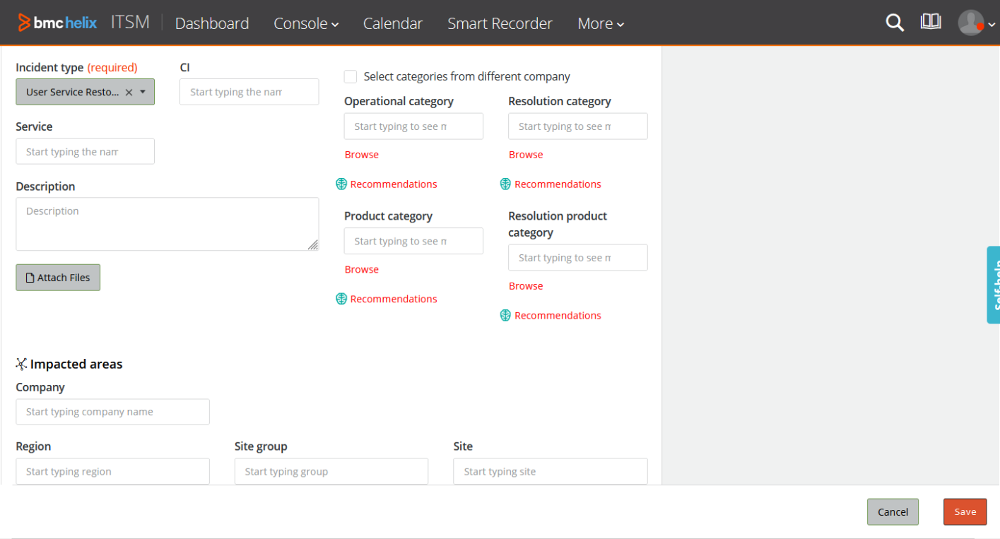

---

## <a id="developing-pwasetting-panels-to-scroll-at-different-ratesmd"></a>Developing-Pwa/Setting-Panels-To-Scroll-At-Different-Rates.md

When panels on application screens have different quantities of content, a normal scroll bar creates blank spaces in the panels that have less content. A sticky panel helps avoid such blank spaces by scrolling the panel with more content at a different rate.

You can add sticky panels in Progressive Web Applications (PWA) screens with multiple panels by usingDeveloper Studio. Adding sticky panels helps improve user experience when your users scroll screens with multiple panels displaying different amounts of content.

Sticky panels scroll in such a way that the panel with more content scrolls first so that scrolling of all the panels completes at the same time. Application users can see the content of the panels easily, without any of the content going out of view.

Scenario

At Apex Global, the change request screen has an activity panel which often has more scrollable content than the main panel. When users scroll down to view the activity panel content, the content in the main panel goes out of view.

The following animation shows a scenario where the panel on the left scrolls out of view leaving an empty space:

To address this issue, the application developer, Seth, adds a property in Developer Studiothat causes both the panels to scroll at different rates based on their content. The panel with more content scrolls first while the panel with less content remains sticky, until both panels have the same amount of scrollable content.

The following animation shows how a sticky panel behaves when scrolling:

Related topics

[Panel-holder-display-types-in-Progressive-View](https://docs.bmc.com/xwiki/bin/view/Service-Management/Innovation-Suite/BMC-Helix-Innovation-Suite/is254/Developing-Progressive-Web-Applications/Panel-holder-display-types-in-Progressive-View/)

[Flow-panel-holders-for-Progressive-Web-Applications](https://docs.bmc.com/xwiki/bin/view/Service-Management/Innovation-Suite/BMC-Helix-Innovation-Suite/is254/Developing-Progressive-Web-Applications/Flow-panel-holders-for-Progressive-Web-Applications/)

[Navigation-fields](https://docs.bmc.com/xwiki/bin/view/Service-Management/Innovation-Suite/BMC-Helix-Innovation-Suite/is254/Developing-applications-by-using-Developer-Studio/Developing-the-application-interface/Creating-and-managing-fields/Navigation-fields/)

## Before you begin

You must start with an existing form that has more than one panel with the following properties:

| Property<br> | Value<br> |
| --- | --- |
| **Display > Display Type**<br> | **Flow Panel**<br> |
| **Display > Type**<br> | **Section Panel**<br> |
| **Display > Orientation**<br> | **Vertical**<br> |

For example, the PWA screen in Smart IT such as theSHR:SV\_TicketDisplay formhas two flow panels with these properties.

## To set panels to scroll at different rates in Progressive Web Applications

1. In Developer Studio, open the form for which you want to create sticky panels.  
   For example, open theSHR:SV\_TicketDisplay form.
2. Select the Flow Panel Holder.  
   For example, in theSHR:SV\_TicketDisplay form, select panels with IDs 304428481 and 304436081.
3. In Properties, under**Display > Custom CSS Style,**add the following string:  
   **sticky-holder**  
   If there are previously existing values in the Custom CSS Style field, the string**sticky-holder**must be preceded by a space.
4. (*Optional*) If the form has horizontal navigation fields, remove the following string from the**Custom CSS Style**property:  
   **detach**
5. Click**Save**and sync the Mid Tier cache.  
   For more information about how to sync the cache, see[Synchronizing-Mid-Tier-cache](https://docs.bmc.com/xwiki/bin/view/Service-Management/Innovation-Suite/BMC-Helix-Innovation-Suite/is254/Administering/Monitoring-the-system-and-performance/Configuring-cache-settings-for-the-Mid-Tier/Synchronizing-Mid-Tier-cache/).

## To validate the behavior of the panels in Progressive Web Applications

1. In a browser, log in to PWA.  
   **<*serverName*>:8080/arsys/pwa/#/login**
2. Change the URL to include the Progressive View form that you created in Developer Studio.  
   **<*serverName*>:8080/arsys/pwa/#/forms/<*serverName*>/<*formName*>/<*viewName*>**The panels in the PWA show 'sticky' behavior whenever there is more content in one of the panels.

## Troubleshooting

If the panels do not appear or if there is an issue with scrolling, perform the following steps:

* Confirm that the workflows and field properties are correctly defined in Developer Studio.
* If the page has horizontal navigation fields, remove the following string from the Custom CSS Style property:  
  **detach**

---

## <a id="developing-pwasetting-user-preferences-and-ccs-parametersmd"></a>Developing-Pwa/Setting-User-Preferences-And-Ccs-Parameters.md

As an AR administrator, you can set preferences for web clients and Progressive Web Applications (PWA) users by using the AR System User Preference form. You can make settings for each user such as logging, locale-based settings, and so on, for better control of AR System behavior as well as better user experience.

Related topics

[Setting-user-preferences](https://docs.bmc.com/xwiki/bin/view/Service-Management/Innovation-Suite/BMC-Helix-Innovation-Suite/is254/Administering/Setting-up-users-access-and-preferences/Setting-user-preferences/)

[Developing-Progressive-Web-Applications](https://docs.bmc.com/xwiki/bin/view/Service-Management/Innovation-Suite/BMC-Helix-Innovation-Suite/is254/Developing-Progressive-Web-Applications/)

[Setting up the time zone](https://docs.bmc.com/xwiki/bin/view/Service-Management/IT-Service-Management/BMC-Helix-ITSM/itsm254/Administering/Setting-up-and-modifying-Foundation-data-by-using-Application-Administration-Console/Creating-and-modifying-companies-and-organization-structures/Setting-up-the-time-zone/)

[Updating-configuration-settings-by-using-the-AR-System-Configuration-Generic-UI-form](https://docs.bmc.com/xwiki/bin/view/Service-Management/Innovation-Suite/BMC-Helix-Innovation-Suite/is254/Administering/BMC-Helix-Innovation-Suite-configuration-references/Centralized-configuration/Updating-configuration-settings-by-using-the-AR-System-Configuration-Generic-UI-form/)

## To set the user preferences for Progressive Web Applications

1. Log into Action Request System and open the AR System User Preference form.  
   **Applications > AR System Administration > AR System Administration Console > User Preferences > My User Preferences**.
2. Set any of the following PWA-related user preferences:

   | Tab<br> | Area Name<br> | Option<br> | Description<br> |
   | --- | --- | --- | --- |
   | Logging<br> | Client<br> | Active Links<br> | Enables logging of active links on the client.<br> |
   | Server<br> | API<br> | Enables logging of APIs running on the server.<br> |
   | Filter<br> | Enables logging of filters on the server.<br> |
   | Database<br> | Enables logging of database activity.<br> |
   | Progressive View<br> | Date Field Display Settings<br>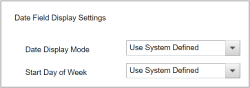<br> | Date Display Mode<br> * Use System Defined * Absolute * Relative | **Use System Defined**displays the date in the format specified by thearsystem.pwa\_date\_field\_display\_modeCCS parameter. To learn more about this CCS parameter, see[Configuring date and time formats](https://docs.bmc.com/xwiki/bin/view/Service-Management/IT-Service-Management/BMC-Helix-ITSM/itsm254/Administering/Configuring-date-and-time-formats/).<br>**Absolute**displays the full date and time when the record was created.<br>**Relative**displays the elapsed time since the record was created.<br> |
   | Start Day of Week<br> | Sets the specified day as the first day of the week.<br> |

   For a complete list of user preferences, see[Setting-centralized-preferences-with-the-AR-System-User-Preference-form](https://docs.bmc.com/xwiki/bin/view/Service-Management/Innovation-Suite/AR-System/ars221/Administering/Setting-up-users-access-and-preferences/Setting-user-preferences/Setting-centralized-preferences-with-the-AR-System-User-Preference-form/).
3. Click**Save**.

## To set centralized configuration settings parameters for Progressive Web Applications

The centralized configuration forms store the configuration settings. You can modify the settings by using the**AR System Configuration Generic UI**form. The settings are case- and space-sensitive. For more information, see[Updating-configuration-settings-by-using-the-AR-System-Configuration-Generic-UI-form](https://docs.bmc.com/xwiki/bin/view/Service-Management/Innovation-Suite/AR-System/ars221/Administering/Remedy-configuration-reference/Centralized-configuration/Updating-configuration-settings-by-using-the-AR-System-Configuration-Generic-UI-form/). For the entire list of configuration settings that are used in AR System, see[Configuration-settings](https://docs.bmc.com/xwiki/bin/view/Service-Management/Innovation-Suite/AR-System/ars221/Administering/Remedy-configuration-reference/Centralized-configuration/Configuration-settings/).

**Best practice**  
We recommend that you use the**AR System Configuration Generic UI**form to modify the configuration settings. Do not use the**ar.cfg**file to modify the configuration settings on the**AR System Configuration Generic UI**form.

1. In a browser, open the AR System Administration Console, and click**System > General > Centralized Configuration**.
2. In the AR System Configuration Generic UI form, from the**Component Name**list, select the component to which you want to add a setting.
3. Click**Add**.
4. Enter the name of the setting that you want to add and then enter its value.  
   The following table lists the PWA-related settings available in centralized configuration:

   | **Setting**<br> | **Description**<br> | **Server group configuration**<br> | **Maps to**<br> |
   | --- | --- | --- | --- |
   | **arsystem.pv\_menu\_debounce\_time**<br>(Component name: arsystem..arsys.midtier)<br> | On progressive view enabled forms, determine the wait time interval in milliseconds for sending expand menu call after entering Autokey stroke in a menu.<br>**Default value**: 500<br> | Yes<br> | **AR System Administration Console > System > General > Centralized Configuration**<br> |
   | **useARUserPreferenceForLocalization**<br>(Component type: arsystem..arsys.midtier)<br> | Use the locale set in the User Preference form as the first priority for the forms with progressive views enabled. The language the application users see is based on this setting.<br>**Valid values**:<br> * true * (Default) false<br>*Example use case:* Apex Global wants to make sure all the employees see the same language in the Progressive Web Application irrespective of the geography they log in from. Set this parameter to**true**to set the language of the Progressive Web Application according to the setting for**User Locale**in the User Preference form. Therefore, Apex Global implements a uniform locale-based experience to all its employees.<br> | Yes<br> | AR System Configuration Generic UI form.<br> |
   | **useARUserPreferenceForTimezone**<br>(Component type: arsystem..arsys.midtier)<br> | Use the time zone set in the User Preference form as the first priority for the forms with progressive view enabled. The time zone that the application users see is based on this setting.<br>**Valid values**:<br> * true * (Default) false<br>*Example use case:* Apex Global wants to make sure all the employees see the same time zone and time settings in the Progressive Web Application irrespective of the geography they log in from. Set this parameter to**true**to set the time zone of the Progressive Web Application according to the setting for**Time Zone**in the User Preference form. Therefore, Apex Global implements a uniform experience to all its employees.<br> | Yes<br> | AR System Configuration Generic UI form.<br> |
   | **useARUserPreferenceForDateTimeFormat**<br>(Component type: (Component name arsystem..arsys.midtier-DockerMTClusterUser))<br> | Use the date and time format set for**Display Date/Time Style (Web)**in the User Preference form as the first priority for the forms with Progressive View enabled. The date and time format that the application users see is based on this setting.<br><br>Valid values:<br> * **Custom** * **Short** * **Long**To learn more abut the values, see[Web-client-preferences](https://docs.bmc.com/xwiki/bin/view/Service-Management/Innovation-Suite/BMC-Helix-Innovation-Suite/is254/Administering/Setting-up-users-access-and-preferences/Setting-user-preferences/Setting-centralized-preferences-with-the-AR-System-User-Preference-form/Web-client-preferences/).<br> | Yes<br> | AR System Configuration Generic UI form.<br> |
   | **pv.enable\_attachment\_on\_delete\_confirmation**<br>(Component name:arsystem..arsys.midtier >arsystem..arsys.midtier-DockerMTClusterUser)<br> | Enables display of a confirmation message when users remove an attachment on Progressive Web Application (PWA) screens.<br>The default value for this option is**false**, which means the application does not display a message when attachments are removed. As an administrator, you can set this option to**true**to enable confirmation messages when PWA users remove attachments.<br> | Yes<br> | AR System Configuration Generic UI form<br> |
   | **pv.show\_transparent\_loader**<br>(Component name: com..arsys.server)<br> | Enables the display of a loader on PWA screens when you run the following command:<br>  ``` ENABLE-WAIT-CURSOR-ON-LONG-RUNNING-PROCESS 2 ```  **Valid values:**<br> * **true**(*Default*) * **false**To learn more about this command, see[Process commands](https://docs.bmc.com/xwiki/wiki/internal/view/Service-Management/Innovation-Suite/innovationsuitemaster/Developing-applications-by-using-Developer-Studio/Defining-workflow-to-automate-processes/Specifying-workflow-actions/Using-Run-Process-and-PROCESS-commands/Process-commands/).<br> | No | AR System Configuration Generic UI form |
   | **pv.menu.in.table.supported** (Component name: arsystem..arsys.midtier) | Enables menu attached fields and active links within cell-based tables on Progressive Web Applications (PWA) screens.  **Default value**: False | Yes | AR System Configuration Generic UI form. |

   For a complete list of configuration settings, see[Configuration settings](https://docs.bmc.com/xwiki/wiki/internal/view/Service-Management/Innovation-Suite/remedyservermaster/Administering/Remedy-configuration-reference/Centralized-configuration/Configuration-settings/).
5. Click**Apply**.
6. Click**Close**.

---

## <a id="developing-pwaui-layout-of-pwamd"></a>Developing-Pwa/Ui-Layout-Of-Pwa.md

To create views for Progressive Web Applications (PWA), you must first understand that the positioning of panels containing UI elements in Progressive Views is based on the twelve-column layout explained in the following sections.

To design the views in Developer Studio, add Panels within Panel Holder, and then add fields to the Panels. You can also use nested panels and appropriately place fields within. Panels and Panel Holders create a layout for the Mid Tier.

Related topics

[Flow-panel-holders-for-Progressive-Web-Applications](https://docs.bmc.com/xwiki/bin/view/Service-Management/Innovation-Suite/BMC-Helix-Innovation-Suite/is254/Developing-Progressive-Web-Applications/Flow-panel-holders-for-Progressive-Web-Applications/)

[Panel-holder-display-types-in-Progressive-View](https://docs.bmc.com/xwiki/bin/view/Service-Management/Innovation-Suite/BMC-Helix-Innovation-Suite/is254/Developing-Progressive-Web-Applications/Panel-holder-display-types-in-Progressive-View/)

The following options are available for the Layout Style property:

* Container panel – Occupies the entire view port (100% screen width).
* Sub-panel – Holds sections. On mobile devices, occupies the entire width and is displayed as tabs.
* Section panel – Holds fields or nested sections.
* Fixed panel – Holds a section. Aligns to the bottom of a screen.

The following diagram illustrates a sample UI layout of Progressive Views:


The responsive design automatically adjusts the Panels.

## Positioning elements on the screen

Use the twelve-column layout to position elements horizontally on the screen. The following image illustrates the twelve-column layout:

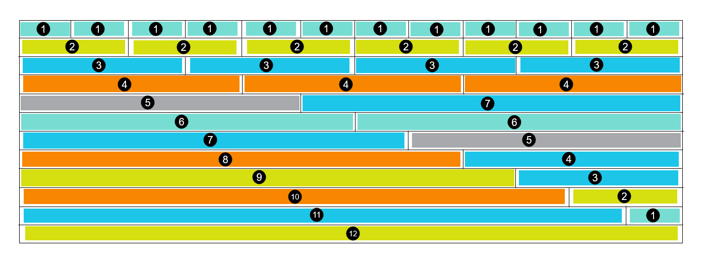

A developer can implement the preceding twelve-column layout by using developer-friendly properties that are added in Developer Studio. Refer to the following example:

To create a three-column layout, set the**Progressive Width**values as follows:

* Panel 1 - 4
* Panel 2 - 4
* Panel 3 - 4

These settings create a layout with orientations that vary based on screen size.

The illustrations in the following table show how the UI layout varies according to the device and screen size:

| Device<br> | UI layout<br> |
| --- | --- |
| Desktops and tablet screens<br><br> | <br> |
| Mobiles screens<br><br> | <br> |

From the illustrations, you can see that PWA screens have the same layout in tablet views and desktop views. PWA screens display the mobile view only when you view the application screens on mobiles. As a result, you may see differences in how the application layout is displayed on tablets and desktops when compared to mobiles.

---

